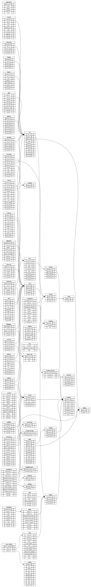

## deltadb

This application can build a standalone sqlite database which can be used as desired in third party applications.
It also adds an example of a limited REST API server as a technology demonstation.

This has been made possible by using the pure go module `modernc.org/sqlite`, which uses some interesting automatic
conversion of the core c-code to go to build a version that doesn't require the cgo library wrapper.

### options

```
Build a DELTA Sqlite DB and optional REST API service

Usage:

  ./deltadb [options]

Options:

  -base string
        base directory of delta files on disk
  -db string
        name of the database file on disk
  -debug
        add extra operational info
  -hostport string
        base directory of delta files on disk (default ":8080")
  -init
        initialise the database if a file on disk
  -listen
        should a web service be enabled
  -resp string
        base directory of resp files on disk
  -response string
        optional database response table name to use (default "Response")
```

### example

e.g.

```
./deltadb -init -db delta.db -debug
2024/11/03 20:49:20 initialise database
2024/11/03 20:49:22 database initialised in 2.179325139s
```

and then to examine the file

```
sqlite3  delta.db
SQLite version 3.46.1 2024-08-13 09:16:08
Enter ".help" for usage hints.
sqlite> .schema Network
CREATE TABLE Network (
        Code TEXT PRIMARY KEY,
        External TEXT,
        Description TEXT,
        Restricted TEXT
);
sqlite>
```

Another example which uses the built in REST API, e.g.

```
./deltadb -debug -listen
2024/11/03 20:55:11 initialise database
2024/11/03 20:55:12 database initialised in 1.181009504s
2024/11/03 20:55:12 handling requests on :8080
```

and then the service can be accessed via curl, e.g.

```
curl -s localhost:8080/network|jq .|head
[
  {
    "network": "AK",
    "external": "NZ",
    "description": "Auckland volcano seismic network"
  },
  {
    "network": "BC",
    "external": "BC",
    "description": "Building monitoring camera network"
  ...
```

or

```
curl -s localhost:8080/station/WEL/site/20/sensor/|jq . | head
[
  {
    "make": "Kinemetrics",
    "model": "FBA-23",
    "serial": "25073",
    "start": "1990-10-03T03:04:00Z",
    "end": "2003-04-08T00:00:00Z",
    "dip": 0,
    "azimuth": 0,
    "factor": 0,
  ...
```



