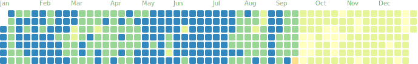

##  A11 -- Alfredton Array

The station __A11__, _(Alfredton Array}_ is part of the Temporary sites __(XX)__ and is located _"14 km east of Eketahuna"_ at 40.6846S 175.8597E at an elevation of 153 m.

It was opened on __1993-02-01T01:23:00Z__ and  was closed on __1993-02-21T08:48:00Z__.

### 10

Site location __10__ was opened on __1993-02-01T01:23:00Z__ and was closed on __1993-02-21T08:48:00Z__.

Dataloggers previously deployed, or currently active at this site location are:

- __1993-02-01T01:22:00Z__ -- _GNS Science_ EARSS [114] and was removed on __1993-02-21T08:48:00Z__.

Sensors previously installed, or currently active at this site location are:

- __1993-02-01T01:23:00Z__ -- _Sercel_ L4C-3D [A11_114] and was removed on __1993-02-21T08:48:00Z__.

Channel streams active, or previously active, at this site location are:

- __1993-02-01T01:23:00Z__ -- __SHZ,SHN,SHE__ _triggered_ 50 Hz and was stopped on __1993-02-21T08:48:00Z__.

## ABAZ -- Army Bay

The station __ABAZ__, _(Army Bay}_ is part of the Auckland volcano seismic network __(AK)__ and is located _"12 km east of Orewa"_ at 36.6002S 174.8323E at an elevation of 74 m.

It was opened on __2008-10-13T04:00:00Z__ and is still __operational__.

### 10

Site location __10__ was opened on __2008-10-13T04:00:00Z__ and is still __operational__.

Dataloggers previously deployed, or currently active at this site location are:

- __2008-10-13T01:00:01Z__ -- _Quanterra_ Q330 [2335] and is still __present__.

Sensors previously installed, or currently active at this site location are:

- __2008-10-13T04:00:00Z__ -- _Sercel_ L4C-3D [2910] and was removed on __2010-03-15T02:00:00Z__.
- __2010-03-15T02:15:00Z__ -- _Lennartz_ LE-3DliteMkII [F-0370] and was removed on __2017-08-15T00:00:00Z__.
- __2017-10-26T05:05:00Z__ -- _Lennartz_ LE-3DliteMkII [N-1293] and is still __present__.

Channel streams active, or previously active, at this site location are:

- __2008-10-13T04:00:00Z__ -- __EHZ,EHN,EHE__ _continuous_ 100 Hz and is still __active__.

## AC1A -- Acheron #1

The station __AC1A__, _(Acheron #1}_ is part of the Temporary sites __(XX)__ and is located _"41 km south-east of St Arnaud"_ at 42.0779S 173.1775E at an elevation of 1143 m.

It was opened on __2001-09-12T03:00:01Z__ and  was closed on __2002-01-22T22:00:00Z__.

### 10

Site location __10__ was opened on __2001-09-12T03:00:01Z__ and was closed on __2002-01-22T22:00:00Z__.

Dataloggers previously deployed, or currently active at this site location are:

- __2001-09-12T03:00:01Z__ -- _Nanometrics_ Orion [0307] and was removed on __2002-01-22T22:00:00Z__.

Sensors previously installed, or currently active at this site location are:

- __2001-09-12T03:00:00Z__ -- _Guralp_ CMG-40T [T41044] and was removed on __2002-01-22T22:00:00Z__.

Channel streams active, or previously active, at this site location are:

- __2001-09-12T03:00:01Z__ -- __HHZ,HHN,HHE__ _continuous_ 100 Hz and was stopped on __2002-01-22T22:00:00Z__.

## AC2A -- Acheron #2

The station __AC2A__, _(Acheron #2}_ is part of the Temporary sites __(XX)__ and is located _"41 km south-east of St Arnaud"_ at 42.0793S 173.1783E at an elevation of 1068 m.

It was opened on __2001-09-13T02:00:01Z__ and  was closed on __2002-01-22T22:00:00Z__.

### 10

Site location __10__ was opened on __2001-09-13T02:00:01Z__ and was closed on __2002-01-22T22:00:00Z__.

Dataloggers previously deployed, or currently active at this site location are:

- __2001-09-13T02:00:01Z__ -- _Nanometrics_ Orion [0289] and was removed on __2002-01-22T22:00:00Z__.

Sensors previously installed, or currently active at this site location are:

- __2001-09-13T02:00:00Z__ -- _Guralp_ CMG-40T [T4803] and was removed on __2002-01-22T22:00:00Z__.

Channel streams active, or previously active, at this site location are:

- __2001-09-13T02:00:01Z__ -- __HHZ,HHN,HHE__ _continuous_ 100 Hz and was stopped on __2002-01-22T22:00:00Z__.

## AC3A -- Acheron #3

The station __AC3A__, _(Acheron #3}_ is part of the Temporary sites __(XX)__ and is located _"41 km south-east of St Arnaud"_ at 42.0876S 173.1663E at an elevation of 972 m.

It was opened on __2001-07-31T23:00:00Z__ and  was closed on __2002-01-22T23:00:00Z__.

### 10

Site location __10__ was opened on __2001-07-31T23:00:00Z__ and was closed on __2002-01-22T23:00:00Z__.

Dataloggers previously deployed, or currently active at this site location are:

- __2001-07-31T23:00:00Z__ -- _Nanometrics_ Orion [0201] and was removed on __2002-01-22T23:00:00Z__.

Sensors previously installed, or currently active at this site location are:

- __2001-07-31T23:00:00Z__ -- _Guralp_ CMG-40T [T41040] and was removed on __2002-01-22T23:00:00Z__.

Channel streams active, or previously active, at this site location are:

- __2001-07-31T23:00:00Z__ -- __HHZ,HHN,HHE__ _continuous_ 100 Hz and was stopped on __2002-01-22T23:00:00Z__.

## AC4A -- Acheron #4

The station __AC4A__, _(Acheron #4}_ is part of the Temporary sites __(XX)__ and is located _"41 km south-east of St Arnaud"_ at 42.0877S 173.1662E at an elevation of 972 m.

It was opened on __2001-08-01T01:00:00Z__ and  was closed on __2002-01-22T23:00:00Z__.

### 10

Site location __10__ was opened on __2001-08-01T01:00:00Z__ and was closed on __2002-01-22T23:00:00Z__.

Dataloggers previously deployed, or currently active at this site location are:

- __2001-08-01T01:00:00Z__ -- _GNS Science_ EARSS [105] and was removed on __2001-08-30T09:00:00Z__.
- __2001-09-12T23:00:00Z__ -- _GNS Science_ EARSS [122] and was removed on __2002-01-22T23:00:00Z__.

Sensors previously installed, or currently active at this site location are:

- __2001-08-01T01:00:00Z__ -- _Sercel_ L4C-3D [795] and was removed on __2002-01-22T23:00:00Z__.

Channel streams active, or previously active, at this site location are:

- __2001-08-01T01:00:00Z__ -- __SHZ,SHN,SHE__ _triggered_ 50 Hz and was stopped on __2002-01-22T23:00:00Z__.

## AC5A -- Acheron #5

The station __AC5A__, _(Acheron #5}_ is part of the Temporary sites __(XX)__ and is located _"42 km south-east of St Arnaud"_ at 42.0909S 173.1767E at an elevation of 981 m.

It was opened on __2001-08-01T04:00:00Z__ and  was closed on __2001-11-27T23:00:00Z__.

### 10

Site location __10__ was opened on __2001-08-01T04:00:00Z__ and was closed on __2001-11-27T23:00:00Z__.

Dataloggers previously deployed, or currently active at this site location are:

- __2001-08-01T04:00:00Z__ -- _Nanometrics_ Orion [0253] and was removed on __2001-11-27T23:00:00Z__.

Sensors previously installed, or currently active at this site location are:

- __2001-08-01T04:00:00Z__ -- _Guralp_ CMG-40T [T4788] and was removed on __2001-11-27T23:00:00Z__.

Channel streams active, or previously active, at this site location are:

- __2001-08-01T04:00:00Z__ -- __HHZ,HHN,HHE__ _continuous_ 100 Hz and was stopped on __2001-11-27T23:00:00Z__.

## ADCS -- Ashburton District Council

The station __ADCS__, _(Ashburton District Council}_ is part of the National strong motion network __(SM)__ and is located _"within 5 km of Ashburton"_ at 43.9024S 171.7476E at an elevation of 111 m.

It was opened on __2002-06-26T21:00:00Z__ and is still __operational__.

### 20

Site location __20__ was opened on __2002-06-26T21:00:00Z__ and is still __operational__.

Dataloggers previously deployed, or currently active at this site location are:

- __2002-06-26T21:00:00Z__ -- _Kinemetrics_ Etna [__Unknown__] and was removed on __2015-01-29T01:30:00Z__.
- __2015-01-29T23:00:00Z__ -- _Canterbury Seismic Instruments_ Cusp3D [__Unknown__] and is still __present__.

Sensors previously installed, or currently active at this site location are:

- __2002-06-26T21:00:00Z__ -- _Kinemetrics_ FBA-ES-T [3225] and was removed on __2015-01-29T01:30:00Z__.
- __2015-01-29T23:00:00Z__ -- _Canterbury Seismic Instruments_ CUSP 3D [42251] and is still __present__.

Channel streams active, or previously active, at this site location are:

- __2015-01-29T23:00:00Z__ -- __BNZ,BN1,BN2__ _continuous_ 50 Hz and was stopped on __2020-06-16T00:00:00Z__.
- __2002-06-26T21:00:00Z__ -- __HNZ,HN1,HN2__ _triggered_ 200 Hz and is still __active__.

##  AGA -- Angora Road Quarry

The station __AGA__, _(Angora Road Quarry}_ is part of the Temporary sites __(XX)__ and is located _"20 km south-west of Porangahau"_ at 40.4516S 176.4799E at an elevation of 120 m.

It was opened on __1990-02-20T22:33:00Z__ and  was closed on __1992-04-07T17:01:00Z__.

### 10

Site location __10__ was opened on __1990-02-20T22:33:00Z__ and was closed on __1992-04-07T17:01:00Z__.

Dataloggers previously deployed, or currently active at this site location are:

- __1990-02-20T22:33:00Z__ -- _GNS Science_ EARSS [105] and was removed on __1990-05-17T20:53:00Z__.
- __1992-03-03T02:51:00Z__ -- _GNS Science_ EARSS [116] and was removed on __1992-03-03T12:28:00Z__.
- __1992-03-03T20:46:00Z__ -- _GNS Science_ EARSS [110] and was removed on __1992-04-07T17:01:00Z__.

Sensors previously installed, or currently active at this site location are:

- __1990-02-20T22:33:00Z__ -- _Sercel_ L4C-3D [AGA_105] and was removed on __1990-05-17T20:53:00Z__.
- __1992-03-03T02:51:00Z__ -- _Sercel_ L4C-3D [AGA_116] and was removed on __1992-03-03T12:28:00Z__.
- __1992-03-03T20:46:00Z__ -- _Sercel_ L4C-3D [AGA_110] and was removed on __1992-04-07T17:01:00Z__.

Channel streams active, or previously active, at this site location are:

- __1990-02-20T22:33:00Z__ -- __SHZ,SHN,SHE__ _triggered_ 50 Hz and was stopped on __1992-04-07T17:01:00Z__.

## AHAA -- Ahaura

The station __AHAA__, _(Ahaura}_ is part of the Temporary sites __(XX)__ and is located _"49 km north-east of Arthur's Pass"_ at 42.5675S 171.8664E at an elevation of 211 m.

It was opened on __1995-11-19T17:31:00Z__ and  was closed on __1995-12-12T01:28:00Z__.

### 10

Site location __10__ was opened on __1995-11-19T17:31:00Z__ and was closed on __1995-12-12T01:28:00Z__.

Dataloggers previously deployed, or currently active at this site location are:

- __1995-11-19T17:31:00Z__ -- _GNS Science_ EARSS [107] and was removed on __1995-12-12T01:28:00Z__.

Sensors previously installed, or currently active at this site location are:

- __1995-11-12T00:00:00Z__ -- _Sercel_ L4C-3D [792] and was removed on __1996-03-31T23:59:59Z__.

Channel streams active, or previously active, at this site location are:

- __1995-11-19T17:31:00Z__ -- __SHZ,SHN,SHE__ _triggered_ 50 Hz and was stopped on __1995-12-12T01:28:00Z__.

## AICS -- Aickens

The station __AICS__, _(Aickens}_ is part of the National strong motion network __(SM)__ and is located _"21 km north of Arthur's Pass"_ at 42.7682S 171.6244E at an elevation of 268 m.

It was opened on __2003-08-18T04:00:00Z__ and  was closed on __2008-02-15T23:00:00Z__.

### 20

Site location __20__ was opened on __2003-08-18T04:00:00Z__ and was closed on __2008-02-15T23:00:00Z__.

Dataloggers previously deployed, or currently active at this site location are:

- __2007-08-01T23:30:00Z__ -- _Kinemetrics_ Etna [__Unknown__] and was removed on __2008-02-15T23:00:00Z__.

Sensors previously installed, or currently active at this site location are:

- __2003-08-18T04:00:00Z__ -- _Kinemetrics_ FBA-ES-T [2844] and was removed on __2005-08-24T02:59:00Z__.
- __2005-08-24T03:00:00Z__ -- _Kinemetrics_ FBA-23 [2433] and was removed on __2006-04-04T04:00:00Z__.
- __2007-04-03T01:55:00Z__ -- _Kinemetrics_ FBA-ES-T [3094] and was removed on __2007-08-01T23:00:00Z__.
- __2007-08-01T23:30:00Z__ -- _Kinemetrics_ FBA-23 [1664] and was removed on __2008-02-15T23:00:00Z__.

Channel streams active, or previously active, at this site location are:

- __2003-08-18T04:00:00Z__ -- __HNZ,HN1,HN2__ _triggered_ 200 Hz and was stopped on __2008-02-15T23:00:00Z__.

## AKCZ -- Akaroa Harbour

The station __AKCZ__, _(Akaroa Harbour}_ is part of the South Island regional seismic network __(SI)__ and is located _"8 km south-west of Akaroa"_ at 43.8721S 172.9098E at an elevation of 374.2 m.

It was opened on __2012-03-01T00:00:00Z__ and is still __operational__.

### 10

Site location __10__ was opened on __2012-03-01T00:00:00Z__ and is still __operational__.

Dataloggers previously deployed, or currently active at this site location are:

- __2012-02-29T00:00:01Z__ -- _Quanterra_ Q330 [3613] and is still __present__.

Sensors previously installed, or currently active at this site location are:

- __2012-03-01T00:00:00Z__ -- _Lennartz_ LE-3DliteMkII [M-1178] and is still __present__.

Channel streams active, or previously active, at this site location are:

- __2012-03-01T00:00:00Z__ -- __EHZ,EHN,EHE__ _continuous_ 100 Hz and is still __active__.

## AKSS -- Akaroa School

The station __AKSS__, _(Akaroa School}_ is part of the National strong motion network __(SM)__ and is located _"within 5 km of Akaroa"_ at 43.8109S 172.9635E at an elevation of 13 m.

It was opened on __2011-08-25T00:25:00Z__ and is still __operational__.

### 20

Site location __20__ was opened on __2011-08-25T00:25:00Z__ and is still __operational__.

Dataloggers previously deployed, or currently active at this site location are:

- __2017-09-13T23:20:00Z__ -- _Kinemetrics_ Basalt [__Unknown__] and is still __present__.

Sensors previously installed, or currently active at this site location are:

- __2011-08-25T00:25:00Z__ -- _Kinemetrics_ FBA-ES-T [613] and was removed on __2013-08-20T00:00:00Z__.
- __2013-08-30T00:05:00Z__ -- _Kinemetrics_ FBA-ES-T [1675] and was removed on __2017-09-13T23:10:00Z__.
- __2017-09-13T23:20:00Z__ -- _Kinemetrics_ FBA-ES-T [2028] and is still __present__.

Channel streams active, or previously active, at this site location are:

- __2011-08-25T00:25:00Z__ -- __BNZ,BN1,BN2__ _continuous_ 50 Hz and was stopped on __2020-06-16T00:00:00Z__.
- __2011-08-25T00:25:00Z__ -- __HNZ,HN1,HN2__ _triggered_ 200 Hz and is still __active__.

## AKUS -- Auckland University School of Engineering

The station __AKUS__, _(Auckland University School of Engineering}_ is part of the National strong motion network __(SM)__ and is located _"within 5 km of Auckland"_ at 36.8532S 174.7705E at an elevation of 50 m.

It was opened on __2002-06-19T00:00:00Z__ and  was closed on __2017-02-16T01:00:00Z__.

### 20

Site location __20__ was opened on __2002-06-19T00:00:00Z__ and was closed on __2017-02-16T01:00:00Z__.

Dataloggers previously deployed, or currently active at this site location are:

- __2002-06-19T00:00:00Z__ -- _Kinemetrics_ Etna [__Unknown__] and was removed on __2014-08-19T01:00:00Z__.
- __2014-08-19T02:03:00Z__ -- _Canterbury Seismic Instruments_ Cusp3D [__Unknown__] and was removed on __2017-02-16T01:00:00Z__.

Sensors previously installed, or currently active at this site location are:

- __2002-06-19T00:00:00Z__ -- _Kinemetrics_ FBA-ES-T [3360] and was removed on __2014-08-19T01:00:00Z__.
- __2014-08-19T02:03:00Z__ -- _Canterbury Seismic Instruments_ CUSP 3D [42034] and was removed on __2017-02-16T01:00:00Z__.

Channel streams active, or previously active, at this site location are:

- __2014-08-19T02:01:00Z__ -- __BNZ,BN1,BN2__ _continuous_ 50 Hz and was stopped on __2017-02-16T01:00:00Z__.
- __2002-06-19T00:00:00Z__ -- __HNZ,HN1,HN2__ _triggered_ 200 Hz and was stopped on __2017-02-16T01:00:00Z__.

## ALLC -- Allen Road

The station __ALLC__, _(Allen Road}_ is part of the Temporary sites __(XX)__ and is located _"14 km north-east of Benneydale"_ at 38.4169S 175.4735E at an elevation of 575 m.

It was opened on __2001-02-13T16:17:00Z__ and  was closed on __2001-07-07T18:55:00Z__.

### 10

Site location __10__ was opened on __2001-02-13T16:17:00Z__ and was closed on __2001-07-07T18:55:00Z__.

Dataloggers previously deployed, or currently active at this site location are:

- __2001-02-13T16:17:00Z__ -- _GNS Science_ EARSS [153] and was removed on __2001-07-07T18:55:00Z__.

Sensors previously installed, or currently active at this site location are:

- __2001-02-13T16:17:00Z__ -- _Sercel_ L4C-3D [ALLC_153] and was removed on __2001-07-07T18:55:00Z__.

Channel streams active, or previously active, at this site location are:

- __2001-02-13T16:17:00Z__ -- __SHZ,SHN,SHE__ _triggered_ 50 Hz and was stopped on __2001-07-07T18:55:00Z__.

## ALRZ -- Allen Road

The station __ALRZ__, _(Allen Road}_ is part of the Rotorua/Okataina volcano seismic network __(RT)__ and is located _"14 km south of Reporoa"_ at 38.5620S 176.3430E at an elevation of 405 m.

It was opened on __2007-11-07T02:00:00Z__ and is still __operational__.

### 10

Site location __10__ was opened on __2007-11-07T02:00:00Z__ and is still __operational__.

Dataloggers previously deployed, or currently active at this site location are:

- __2007-11-07T01:00:01Z__ -- _Quanterra_ Q330 [961] and was removed on __2018-11-28T23:40:00Z__.
- __2018-11-29T01:05:00Z__ -- _Quanterra_ Q330 [6848] and is still __present__.

Sensors previously installed, or currently active at this site location are:

- __2007-11-07T02:00:00Z__ -- _Sercel_ L4C-3D [655] and was removed on __2018-11-28T23:40:00Z__.
- __2018-11-29T01:05:00Z__ -- _Lennartz_ LE-3DliteMkIII [F-0480] and is still __present__.

Channel streams active, or previously active, at this site location are:

- __2007-11-07T02:00:00Z__ -- __EHZ,EHN,EHE__ _continuous_ 100 Hz and is still __active__.

## AMBC -- Amberley HDC

The station __AMBC__, _(Amberley HDC}_ is part of the Canterbury regional strong motion network __(SC)__ and is located _"within 5 km of Amberley"_ at 43.1547S 172.7309E at an elevation of 41 m.

It was opened on __2004-11-27T00:00:00Z__ and is still __operational__.

### 20

Site location __20__ was opened on __2004-11-27T00:00:00Z__ and is still __operational__.

Dataloggers previously deployed, or currently active at this site location are:

- __2004-11-27T00:00:00Z__ -- _Canterbury Seismic Instruments_ Cusp3A [__Unknown__] and was removed on __2010-03-25T00:30:00Z__.
- __2010-03-25T01:00:00Z__ -- _Canterbury Seismic Instruments_ Cusp3C [__Unknown__] and was removed on __2016-10-12T00:01:00Z__.
- __2016-10-12T00:06:10Z__ -- _Canterbury Seismic Instruments_ Cusp3D [__Unknown__] and was removed on __2020-12-14T00:45:00Z__.
- __2021-04-28T00:04:00Z__ -- _Canterbury Seismic Instruments_ Eqr120 [__Unknown__] and is still __present__.

Sensors previously installed, or currently active at this site location are:

- __2004-11-27T00:00:00Z__ -- _Canterbury Seismic Instruments_ CUSP 3A [200] and was removed on __2010-03-25T00:30:00Z__.
- __2010-03-25T01:00:00Z__ -- _Canterbury Seismic Instruments_ CUSP 3C [10417] and was removed on __2016-10-12T00:01:00Z__.
- __2016-10-12T00:06:10Z__ -- _Canterbury Seismic Instruments_ CUSP 3D [42069] and was removed on __2020-12-14T00:45:00Z__.
- __2020-12-15T02:00:00Z__ -- _Canterbury Seismic Instruments_ Eqr120 [46503] and was removed on __2021-04-27T23:58:00Z__.
- __2021-04-28T00:04:00Z__ -- _Canterbury Seismic Instruments_ Eqr120 [46525] and is still __present__.

Channel streams active, or previously active, at this site location are:

- __2010-03-25T01:00:00Z__ -- __BNZ,BN1,BN2__ _continuous_ 50 Hz and was stopped on __2020-06-16T00:00:00Z__.
- __2004-11-27T00:00:00Z__ -- __HNZ,HN1,HN2__ _triggered_ 200 Hz and was stopped on __2020-12-14T00:45:00Z__.
- __2020-12-15T02:00:00Z__ -- __HNZ,HN1,HN2__ _continuous_ 200 Hz and is still __active__.

## AMCZ -- Amberley

The station __AMCZ__, _(Amberley}_ is part of the South Island regional seismic network __(SI)__ and is located _"7 km west of Amberley"_ at 43.1765S 172.6515E at an elevation of 179 m.

It was opened on __2012-06-26T23:00:01Z__ and is still __operational__.

### 10

Site location __10__ was opened on __2012-06-26T23:00:01Z__ and is still __operational__.

Dataloggers previously deployed, or currently active at this site location are:

- __2012-06-25T00:00:02Z__ -- _Quanterra_ Q330 [3620] and is still __present__.

Sensors previously installed, or currently active at this site location are:

- __2012-06-26T23:00:01Z__ -- _Lennartz_ LE-3Dlite [S-0994] and is still __present__.

Channel streams active, or previously active, at this site location are:

- __2012-06-26T23:00:01Z__ -- __EHZ,EHN,EHE__ _continuous_ 100 Hz and is still __active__.

##  AMF -- Ambury Farm

The station __AMF__, _(Ambury Farm}_ is part of the Temporary sites __(XX)__ and is located _"11 km south of Auckland"_ at 36.9482S 174.7602E at an elevation of 10 m.

It was opened on __2008-03-11T22:01:00Z__ and  was closed on __2008-03-14T00:00:00Z__.

### 10

Site location __10__ was opened on __2008-03-11T22:01:00Z__ and was closed on __2008-03-14T00:00:00Z__.

Dataloggers previously deployed, or currently active at this site location are:

- __2008-03-11T22:00:01Z__ -- _Quanterra_ Q330 [1197] and was removed on __2008-03-14T01:00:00Z__.

Sensors previously installed, or currently active at this site location are:

- __2008-03-11T22:01:00Z__ -- _Guralp_ CMG-40T [T4M19] and was removed on __2008-03-14T00:00:00Z__.

Channel streams active, or previously active, at this site location are:

- __2008-03-11T22:01:00Z__ -- __VHZ,VHN,VHE__ _continuous_ 0.1 Hz and was stopped on __2008-03-14T00:00:00Z__.
- __2008-03-11T22:01:00Z__ -- __LHZ,LHN,LHE__ _continuous_ 1 Hz and was stopped on __2008-03-14T00:00:00Z__.
- __2008-03-11T22:01:00Z__ -- __HHZ,HHN,HHE__ _continuous_ 100 Hz and was stopped on __2008-03-14T00:00:00Z__.

## AN01 -- Cape Bird, Antarctica

The station __AN01__, _(Cape Bird, Antarctica}_ is part of the Temporary sites __(XX)__ and is located _"69 km north of Scott Base"_ at 77.2431S 166.3725E at an elevation of 61.44 m.

It was opened on __1999-10-30T00:00:02Z__ and  was closed on __2000-01-21T23:59:59Z__.

### 10

Site location __10__ was opened on __1999-10-30T00:00:02Z__ and was closed on __2000-01-21T23:59:59Z__.

Dataloggers previously deployed, or currently active at this site location are:

- __1999-10-30T00:00:01Z__ -- _Nanometrics_ Orion [0160] and was removed on __2000-01-22T00:00:00Z__.

Sensors previously installed, or currently active at this site location are:

- __1999-10-30T00:00:02Z__ -- _Guralp_ CMG-40T [T4664] and was removed on __2000-01-21T23:59:59Z__.

Channel streams active, or previously active, at this site location are:

- __1999-10-30T00:00:02Z__ -- __HHZ,HHN,HHE__ _continuous_ 100 Hz and was stopped on __2000-01-21T23:59:59Z__.

## AN02 -- Cape Roberts, Antarctica

The station __AN02__, _(Cape Roberts, Antarctica}_ is part of the Temporary sites __(XX)__ and is located _"126 km north-west of Scott Base"_ at 77.0352S 163.1808E at an elevation of 10 m.

It was opened on __1999-11-02T00:00:02Z__ and  was closed on __2000-01-22T00:00:00Z__.

### 10

Site location __10__ was opened on __1999-11-02T00:00:02Z__ and was closed on __2000-01-22T00:00:00Z__.

Dataloggers previously deployed, or currently active at this site location are:

- __1999-11-02T00:00:01Z__ -- _Nanometrics_ Orion [0173] and was removed on __2000-01-22T00:00:00Z__.

Sensors previously installed, or currently active at this site location are:

- __1999-11-02T00:00:02Z__ -- _Guralp_ CMG-40T [T4581] and was removed on __2000-01-22T00:00:00Z__.

Channel streams active, or previously active, at this site location are:

- __1999-11-02T00:00:02Z__ -- __HHZ,HHN,HHE__ _continuous_ 100 Hz and was stopped on __2000-01-22T00:00:00Z__.

## AN03 -- Sperm Bluff, Antarctica

The station __AN03__, _(Sperm Bluff, Antarctica}_ is part of the Temporary sites __(XX)__ and is located _"151 km north-west of Scott Base"_ at 77.1150S 161.5317E at an elevation of 540 m.

It was opened on __1999-11-03T00:00:02Z__ and  was closed on __2000-01-22T00:00:00Z__.

### 10

Site location __10__ was opened on __1999-11-03T00:00:02Z__ and was closed on __2000-01-22T00:00:00Z__.

Dataloggers previously deployed, or currently active at this site location are:

- __1999-11-03T00:00:01Z__ -- _Nanometrics_ Orion [0168] and was removed on __2000-01-22T00:00:00Z__.

Sensors previously installed, or currently active at this site location are:

- __1999-11-03T00:00:02Z__ -- _Guralp_ CMG-3ESP [T3137] and was removed on __2000-01-22T00:00:00Z__.

Channel streams active, or previously active, at this site location are:

- __1999-11-03T00:00:02Z__ -- __HHZ,HHN,HHE__ _continuous_ 100 Hz and was stopped on __2000-01-22T00:00:00Z__.

## AN04 -- Marble Point, Antarctica

The station __AN04__, _(Marble Point, Antarctica}_ is part of the Temporary sites __(XX)__ and is located _"85 km north-west of Scott Base"_ at 77.4371S 163.8019E at an elevation of 44 m.

It was opened on __1999-11-03T00:00:02Z__ and  was closed on __2000-01-22T00:00:00Z__.

### 10

Site location __10__ was opened on __1999-11-03T00:00:02Z__ and was closed on __2000-01-22T00:00:00Z__.

Dataloggers previously deployed, or currently active at this site location are:

- __1999-11-03T00:00:01Z__ -- _Nanometrics_ Orion [0144] and was removed on __2000-01-22T00:00:00Z__.

Sensors previously installed, or currently active at this site location are:

- __1999-11-03T00:00:02Z__ -- _Guralp_ CMG-40T [T4665] and was removed on __2000-01-22T00:00:00Z__.

Channel streams active, or previously active, at this site location are:

- __1999-11-03T00:00:02Z__ -- __HHZ,HHN,HHE__ _continuous_ 100 Hz and was stopped on __2000-01-22T00:00:00Z__.

## AN05 -- Butter Point, Antarctica

The station __AN05__, _(Butter Point, Antarctica}_ is part of the Temporary sites __(XX)__ and is located _"70 km west of Scott Base"_ at 77.6986S 163.9118E at an elevation of 10 m.

It was opened on __1999-11-03T00:00:02Z__ and  was closed on __2000-01-22T00:00:00Z__.

### 10

Site location __10__ was opened on __1999-11-03T00:00:02Z__ and was closed on __2000-01-22T00:00:00Z__.

Dataloggers previously deployed, or currently active at this site location are:

- __1999-11-03T00:00:01Z__ -- _Nanometrics_ Orion [0165] and was removed on __2000-01-22T00:00:00Z__.

Sensors previously installed, or currently active at this site location are:

- __1999-11-03T00:00:02Z__ -- _Guralp_ CMG-40T [BTPT_ANTARCTICA] and was removed on __2000-01-22T00:00:00Z__.

Channel streams active, or previously active, at this site location are:

- __1999-11-03T00:00:02Z__ -- __HHZ,HHN,HHE__ _continuous_ 100 Hz and was stopped on __2000-01-22T00:00:00Z__.

## AN06 -- Lower Wright Valley, Antarctica

The station __AN06__, _(Lower Wright Valley, Antarctica}_ is part of the Temporary sites __(XX)__ and is located _"108 km west of Scott Base"_ at 77.4536S 162.6519E at an elevation of 390 m.

It was opened on __1999-11-08T00:00:02Z__ and  was closed on __2000-01-22T00:00:00Z__.

### 10

Site location __10__ was opened on __1999-11-08T00:00:02Z__ and was closed on __2000-01-22T00:00:00Z__.

Dataloggers previously deployed, or currently active at this site location are:

- __1999-11-08T00:00:01Z__ -- _Nanometrics_ Orion [0164] and was removed on __2000-01-22T00:00:00Z__.

Sensors previously installed, or currently active at this site location are:

- __1999-11-08T00:00:02Z__ -- _Guralp_ CMG-40T [T4675] and was removed on __2000-01-22T00:00:00Z__.

Channel streams active, or previously active, at this site location are:

- __1999-11-08T00:00:02Z__ -- __HHZ,HHN,HHE__ _continuous_ 100 Hz and was stopped on __2000-01-22T00:00:00Z__.

## AN07 -- Labyrinth, Antarctica

The station __AN07__, _(Labyrinth, Antarctica}_ is part of the Temporary sites __(XX)__ and is located _"144 km west of Scott Base"_ at 77.5296S 160.9227E at an elevation of 830 m.

It was opened on __1999-11-08T00:00:02Z__ and  was closed on __2000-01-23T00:00:00Z__.

### 10

Site location __10__ was opened on __1999-11-08T00:00:02Z__ and was closed on __2000-01-23T00:00:00Z__.

Dataloggers previously deployed, or currently active at this site location are:

- __1999-11-08T00:00:01Z__ -- _Nanometrics_ Orion [0169] and was removed on __2000-01-23T00:00:00Z__.

Sensors previously installed, or currently active at this site location are:

- __1999-11-08T00:00:02Z__ -- _Guralp_ CMG-40T [T4661] and was removed on __2000-01-23T00:00:00Z__.

Channel streams active, or previously active, at this site location are:

- __1999-11-08T00:00:02Z__ -- __HHZ,HHN,HHE__ _continuous_ 100 Hz and was stopped on __2000-01-23T00:00:00Z__.

## AN08 -- Mount Fleming, Antarctica

The station __AN08__, _(Mount Fleming, Antarctica}_ is part of the Temporary sites __(XX)__ and is located _"158 km west of Scott Base"_ at 77.5494S 160.2731E at an elevation of 1700 m.

It was opened on __1999-11-09T00:00:02Z__ and  was closed on __2000-01-23T00:00:00Z__.

### 10

Site location __10__ was opened on __1999-11-09T00:00:02Z__ and was closed on __2000-01-23T00:00:00Z__.

Dataloggers previously deployed, or currently active at this site location are:

- __1999-11-09T00:00:01Z__ -- _Nanometrics_ Orion [0163] and was removed on __2000-01-23T00:00:00Z__.

Sensors previously installed, or currently active at this site location are:

- __1999-11-09T00:00:02Z__ -- _Guralp_ CMG-40T [T4666] and was removed on __2000-01-23T00:00:00Z__.

Channel streams active, or previously active, at this site location are:

- __1999-11-09T00:00:02Z__ -- __HHZ,HHN,HHE__ _continuous_ 100 Hz and was stopped on __2000-01-23T00:00:00Z__.

## AN09 -- Table Mountain, Antarctica

The station __AN09__, _(Table Mountain, Antarctica}_ is part of the Temporary sites __(XX)__ and is located _"109 km west of Scott Base"_ at 77.9553S 162.1301E at an elevation of 1455 m.

It was opened on __1999-12-07T00:00:02Z__ and  was closed on __2000-01-21T00:00:00Z__.

### 10

Site location __10__ was opened on __1999-12-07T00:00:02Z__ and was closed on __2000-01-21T00:00:00Z__.

Dataloggers previously deployed, or currently active at this site location are:

- __1999-12-07T00:00:01Z__ -- _Nanometrics_ Orion [0145] and was removed on __2000-01-21T00:00:00Z__.

Sensors previously installed, or currently active at this site location are:

- __1999-12-07T00:00:02Z__ -- _Guralp_ CMG-3ESP [T367] and was removed on __2000-01-21T00:00:00Z__.

Channel streams active, or previously active, at this site location are:

- __1999-12-07T00:00:02Z__ -- __HHZ,HHN,HHE__ _continuous_ 100 Hz and was stopped on __2000-01-21T00:00:00Z__.

## AN10 -- Lake Chad, Antarctica

The station __AN10__, _(Lake Chad, Antarctica}_ is part of the Temporary sites __(XX)__ and is located _"within 5 km of Scott Base"_ at 77.8497S 166.7669E at an elevation of 50 m.

It was opened on __1999-12-07T00:00:02Z__ and  was closed on __2000-01-21T00:00:00Z__.

### 10

Site location __10__ was opened on __1999-12-07T00:00:02Z__ and was closed on __2000-01-21T00:00:00Z__.

Dataloggers previously deployed, or currently active at this site location are:

- __1999-12-07T00:00:01Z__ -- _Nanometrics_ Orion [0167] and was removed on __2000-01-21T00:00:00Z__.

Sensors previously installed, or currently active at this site location are:

- __1999-12-07T00:00:02Z__ -- _Guralp_ CMG-40T [LCHD_ANTARCTICA] and was removed on __2000-01-21T00:00:00Z__.

Channel streams active, or previously active, at this site location are:

- __1999-12-07T00:00:02Z__ -- __HHZ,HHN,HHE__ _continuous_ 100 Hz and was stopped on __2000-01-21T00:00:00Z__.

## ANWZ -- Angora Road

The station __ANWZ__, _(Angora Road}_ is part of the Wellington regional seismic network __(WL)__ and is located _"21 km south-west of Porangahau"_ at 40.4597S 176.4751E at an elevation of 132 m.

It was opened on __2008-08-07T00:05:00Z__ and is still __operational__.

### 10

Site location __10__ was opened on __2008-08-07T00:05:00Z__ and is still __operational__.

Dataloggers previously deployed, or currently active at this site location are:

- __2008-08-07T00:00:01Z__ -- _Quanterra_ Q330 [341] and was removed on __2019-01-23T01:00:00Z__.
- __2019-01-23T01:40:00Z__ -- _Quanterra_ Q330 [6867] and is still __present__.

Sensors previously installed, or currently active at this site location are:

- __2008-08-07T00:05:00Z__ -- _Sercel_ L4C-3D [2906] and is still __present__.

Channel streams active, or previously active, at this site location are:

- __2008-08-07T00:05:00Z__ -- __EHZ,EHN,EHE__ _continuous_ 100 Hz and is still __active__.

## APPS -- Arthurs Pass Police Station

The station __APPS__, _(Arthurs Pass Police Station}_ is part of the National strong motion network __(SM)__ and is located _"within 5 km of Arthur's Pass"_ at 42.9489S 171.5677E at an elevation of 743 m.

It was opened on __2001-11-12T00:00:00Z__ and is still __operational__.

### 20

Site location __20__ was opened on __2001-11-12T00:00:00Z__ and is still __operational__.

Dataloggers previously deployed, or currently active at this site location are:

- __2001-11-12T00:00:00Z__ -- _Kinemetrics_ Etna [__Unknown__] and was removed on __2014-08-15T00:00:00Z__.
- __2014-08-15T00:05:00Z__ -- _Kinemetrics_ Basalt [__Unknown__] and is still __present__.

Sensors previously installed, or currently active at this site location are:

- __2001-11-12T00:00:00Z__ -- _Kinemetrics_ FBA-ES-T [2838] and was removed on __2014-08-15T00:00:00Z__.
- __2014-08-15T00:05:00Z__ -- _Kinemetrics_ FBA-ES-T [2148] and is still __present__.

Channel streams active, or previously active, at this site location are:

- __2014-08-15T00:05:00Z__ -- __BNZ,BN1,BN2__ _continuous_ 50 Hz and was stopped on __2020-06-16T00:00:00Z__.
- __2001-11-12T00:00:00Z__ -- __HNZ,HN1,HN2__ _triggered_ 200 Hz and is still __active__.

## APUS -- Arapuni Dam

The station __APUS__, _(Arapuni Dam}_ is part of the Strong motion (private sites) __(SX)__ and is located _"8 km east of Pukeatua"_ at 38.0818S 175.6393E at an elevation of 119 m.

It was opened on __2004-08-15T22:00:00Z__ and  was closed on __2015-06-30T23:59:59Z__.

### 20

Site location __20__ was opened on __2004-08-15T22:00:00Z__ and was closed on __2015-06-30T23:59:59Z__.

Dataloggers previously deployed, or currently active at this site location are:

- __2004-08-15T22:00:00Z__ -- _Kinemetrics_ Etna [__Unknown__] and was removed on __2015-06-30T23:59:59Z__.

Sensors previously installed, or currently active at this site location are:

- __2004-08-15T22:00:00Z__ -- _Kinemetrics_ FBA-ES-T [4366] and was removed on __2015-06-30T23:59:59Z__.

Channel streams active, or previously active, at this site location are:

- __2004-08-15T22:00:00Z__ -- __HNZ,HN1,HN2__ _triggered_ 200 Hz and was stopped on __2015-06-30T23:59:59Z__.

##  APZ -- The Paps

The station __APZ__, _(The Paps}_ is part of the New Zealand National Seismograph Network __(NZ)__ and is located _"13 km north-west of Halfmoon Bay"_ at 46.8318S 167.9888E at an elevation of 601 m.

It was opened on __2006-05-07T03:23:54Z__ and is still __operational__.

### 10

Site location __10__ was opened on __2006-05-07T03:23:54Z__ and is still __operational__.

Dataloggers previously deployed, or currently active at this site location are:

- __2006-05-07T02:23:54Z__ -- _Quanterra_ Q330 [961] and was removed on __2007-05-02T22:00:00Z__.
- __2007-05-02T22:00:01Z__ -- _Quanterra_ Q330 [2031] and is still __present__.

Sensors previously installed, or currently active at this site location are:

- __2006-05-07T03:23:54Z__ -- _Guralp_ CMG-3ESP [T3B61] and is still __present__.

Channel streams active, or previously active, at this site location are:

- __2006-05-07T03:23:54Z__ -- __LHZ,LHN,LHE__ _continuous_ 1 Hz and is still __active__.
- __2006-05-07T03:23:54Z__ -- __HHZ,HHN,HHE__ _continuous_ 100 Hz and is still __active__.

### 20

Site location __20__ was opened on __2007-05-02T22:00:01Z__ and is still __operational__.

Dataloggers previously deployed, or currently active at this site location are:

- __2007-05-02T22:00:01Z__ -- _Quanterra_ Q330 [2031] and is still __present__.

Sensors previously installed, or currently active at this site location are:

- __2006-05-07T03:23:54Z__ -- _Kinemetrics_ FBA-ES-T [2265] and is still __present__.

Channel streams active, or previously active, at this site location are:

- __2007-05-02T22:00:01Z__ -- __LNZ,LNN,LNE__ _continuous_ 1 Hz and is still __active__.
- __2007-05-02T22:00:01Z__ -- __BNZ,BNN,BNE__ _continuous_ 50 Hz and was stopped on __2020-06-16T00:00:00Z__.
- __2007-05-02T22:00:01Z__ -- __HNZ,HNN,HNE__ _triggered_ 200 Hz and is still __active__.

## ARAZ -- Aratiatia Landcorp Farm

The station __ARAZ__, _(Aratiatia Landcorp Farm}_ is part of the Taupo volcano seismic network __(TP)__ and is located _"9 km north of Taupo"_ at 38.6277S 176.1201E at an elevation of 420 m.

It was opened on __2007-05-20T23:00:00Z__ and is still __operational__.

### 10

Site location __10__ was opened on __2007-05-20T23:00:00Z__ and is still __operational__.

Dataloggers previously deployed, or currently active at this site location are:

- __2011-03-06T22:00:01Z__ -- _Quanterra_ Q330 [339] and was removed on __2011-06-20T04:00:00Z__.
- __2011-06-20T04:00:01Z__ -- _Quanterra_ Q330 [541] and is still __present__.

Sensors previously installed, or currently active at this site location are:

- __2007-05-20T23:00:00Z__ -- _Sercel_ L4C-3D [2989] and is still __present__.

Channel streams active, or previously active, at this site location are:

- __2007-05-20T23:00:00Z__ -- __EHZ,EHN,EHE__ _continuous_ 100 Hz and is still __active__.

## ARCZ -- Arundel

The station __ARCZ__, _(Arundel}_ is part of the South Island regional seismic network __(SI)__ and is located _"8 km south-west of Peel Forest"_ at 43.9470S 171.1767E at an elevation of 462 m.

It was opened on __2014-05-13T00:05:00Z__ and is still __operational__.

### 10

Site location __10__ was opened on __2014-05-13T00:05:00Z__ and is still __operational__.

Dataloggers previously deployed, or currently active at this site location are:

- __2014-05-13T00:00:01Z__ -- _Quanterra_ Q330 [5069] and is still __present__.

Sensors previously installed, or currently active at this site location are:

- __2014-05-13T00:05:00Z__ -- _Lennartz_ LE-3DliteMkII [N-1297] and is still __present__.

Channel streams active, or previously active, at this site location are:

- __2014-05-13T00:05:00Z__ -- __EHZ,EHN,EHE__ _continuous_ 100 Hz and is still __active__.

## ARHZ -- Aropaoanui

The station __ARHZ__, _(Aropaoanui}_ is part of the Hawke's Bay regional seismic network __(HB)__ and is located _"28 km north of Napier"_ at 39.2631S 176.9959E at an elevation of 270 m.

It was opened on __2010-03-11T21:16:00Z__ and is still __operational__.

### 10

Site location __10__ was opened on __2010-03-11T21:16:00Z__ and is still __operational__.

Dataloggers previously deployed, or currently active at this site location are:

- __2010-03-11T21:15:01Z__ -- _Quanterra_ Q330 [2236] and was removed on __2012-01-19T22:29:01Z__.
- __2012-01-19T22:30:01Z__ -- _Quanterra_ Q330 [3616] and is still __present__.

Sensors previously installed, or currently active at this site location are:

- __2010-03-11T21:16:00Z__ -- _Lennartz_ LE-3DliteMkII [I-0652] and is still __present__.

Channel streams active, or previously active, at this site location are:

- __2010-03-11T21:16:00Z__ -- __EHZ,EHN,EHE__ _continuous_ 100 Hz and is still __active__.

## ARKE -- Arakihi

The station __ARKE__, _(Arakihi}_ is part of the Temporary sites __(XX)__ and is located _"16 km west of Tolaga Bay"_ at 38.3894S 178.1135E at an elevation of 120 m.

It was opened on __1994-07-22T05:17:00Z__ and  was closed on __1994-12-12T23:16:00Z__.

### 10

Site location __10__ was opened on __1994-07-22T05:17:00Z__ and was closed on __1994-12-12T23:16:00Z__.

Dataloggers previously deployed, or currently active at this site location are:

- __1994-07-22T05:17:00Z__ -- _GNS Science_ EARSS [102] and was removed on __1994-12-12T23:16:00Z__.

Sensors previously installed, or currently active at this site location are:

- __1994-07-22T05:17:00Z__ -- _Sercel_ L4C-3D [ARKE_102] and was removed on __1994-12-12T23:16:00Z__.

Channel streams active, or previously active, at this site location are:

- __1994-07-22T05:17:00Z__ -- __SHZ,SHN,SHE__ _triggered_ 50 Hz and was stopped on __1994-12-12T23:16:00Z__.

## ARKS -- Wainuiomata Arakura School

The station __ARKS__, _(Wainuiomata Arakura School}_ is part of the National strong motion network __(SM)__ and is located _"within 5 km of Lower Hutt"_ at 41.2421S 174.9441E at an elevation of 96 m.

It was opened on __2001-12-04T00:00:00Z__ and is still __operational__.

### 20

Site location __20__ was opened on __2001-12-04T00:00:00Z__ and is still __operational__.

Dataloggers previously deployed, or currently active at this site location are:

- __2001-12-04T00:00:00Z__ -- _Kinemetrics_ Etna [__Unknown__] and was removed on __2015-02-23T00:00:00Z__.
- __2015-02-23T00:00:05Z__ -- _Canterbury Seismic Instruments_ Cusp3D [__Unknown__] and is still __present__.

Sensors previously installed, or currently active at this site location are:

- __2001-12-04T00:00:00Z__ -- _Kinemetrics_ FBA-ES-T [2985] and was removed on __2015-02-23T00:00:00Z__.
- __2015-02-23T00:00:05Z__ -- _Canterbury Seismic Instruments_ CUSP 3D [42238] and is still __present__.

Channel streams active, or previously active, at this site location are:

- __2015-02-23T00:00:05Z__ -- __BNZ,BN1,BN2__ _continuous_ 50 Hz and was stopped on __2020-06-16T00:00:00Z__.
- __2001-12-04T00:00:00Z__ -- __HNZ,HN1,HN2__ _triggered_ 200 Hz and is still __active__.

## ARPC -- Lake Arapuni Road

The station __ARPC__, _(Lake Arapuni Road}_ is part of the Temporary sites __(XX)__ and is located _"13 km south-east of Pukeatua"_ at 38.1502S 175.6572E at an elevation of 180 m.

It was opened on __2001-01-19T23:54:00Z__ and  was closed on __2001-07-04T07:21:00Z__.

### 10

Site location __10__ was opened on __2001-01-19T23:54:00Z__ and was closed on __2001-07-04T07:21:00Z__.

Dataloggers previously deployed, or currently active at this site location are:

- __2001-01-19T23:54:00Z__ -- _GNS Science_ EARSS [155] and was removed on __2001-07-04T07:21:00Z__.

Sensors previously installed, or currently active at this site location are:

- __2001-01-19T23:54:00Z__ -- _Sercel_ L4C-3D [ARPC_155] and was removed on __2001-07-04T07:21:00Z__.

Channel streams active, or previously active, at this site location are:

- __2001-01-19T23:54:00Z__ -- __SHZ,SHN,SHE__ _triggered_ 50 Hz and was stopped on __2001-07-04T07:21:00Z__.

## ARPS -- Arnold River Power Station

The station __ARPS__, _(Arnold River Power Station}_ is part of the National strong motion network __(SM)__ and is located _"11 km south-east of Dobson"_ at 42.5240S 171.4079E at an elevation of 85 m.

It was opened on __1999-09-23T22:00:00Z__ and is still __operational__.

### 20

Site location __20__ was opened on __1999-09-23T22:00:00Z__ and is still __operational__.

Dataloggers previously deployed, or currently active at this site location are:

- __1999-09-23T22:00:00Z__ -- _Kinemetrics_ Etna [__Unknown__] and was removed on __2014-08-11T04:00:00Z__.
- __2014-08-11T04:05:00Z__ -- _Canterbury Seismic Instruments_ Cusp3D [__Unknown__] and is still __present__.

Sensors previously installed, or currently active at this site location are:

- __1999-09-23T22:00:00Z__ -- _Kinemetrics_ FBA-23 [1676] and was removed on __2014-08-11T04:00:00Z__.
- __2014-08-11T04:05:00Z__ -- _Canterbury Seismic Instruments_ CUSP 3D [42167] and is still __present__.

Channel streams active, or previously active, at this site location are:

- __2014-08-11T04:05:00Z__ -- __BNZ,BN1,BN2__ _continuous_ 50 Hz and was stopped on __2020-06-16T00:00:00Z__.
- __1999-09-23T22:00:00Z__ -- __HNZ,HN1,HN2__ _triggered_ 200 Hz and is still __active__.

## ASHS -- Ashley School

The station __ASHS__, _(Ashley School}_ is part of the National strong motion network __(SM)__ and is located _"within 5 km of Rangiora"_ at 43.2744S 172.5959E at an elevation of 47 m.

It was opened on __2002-02-24T23:00:00Z__ and is still __operational__.

### 20

Site location __20__ was opened on __2002-02-24T23:00:00Z__ and is still __operational__.

Dataloggers previously deployed, or currently active at this site location are:

- __2002-02-24T23:00:00Z__ -- _Kinemetrics_ Etna [__Unknown__] and was removed on __2014-09-08T21:00:00Z__.
- __2014-09-08T23:35:00Z__ -- _Canterbury Seismic Instruments_ Cusp3D [__Unknown__] and is still __present__.

Sensors previously installed, or currently active at this site location are:

- __2002-02-24T23:00:00Z__ -- _Kinemetrics_ FBA-ES-T [3095] and was removed on __2014-09-08T21:00:00Z__.
- __2014-09-08T23:35:00Z__ -- _Canterbury Seismic Instruments_ CUSP 3D [42220] and is still __present__.

Channel streams active, or previously active, at this site location are:

- __2014-09-08T23:35:00Z__ -- __BNZ,BN1,BN2__ _continuous_ 50 Hz and was stopped on __2020-06-16T00:00:00Z__.
- __2002-02-24T23:00:00Z__ -- __HNZ,HN1,HN2__ _triggered_ 200 Hz and is still __active__.

## ASHV -- Ash Pit Road

The station __ASHV__, _(Ash Pit Road}_ is part of the Temporary sites __(XX)__ and is located _"20 km north-east of Reporoa"_ at 38.2795S 176.4627E at an elevation of 360 m.

It was opened on __1995-01-11T00:56:00Z__ and  was closed on __1995-05-28T18:20:00Z__.

### 10

Site location __10__ was opened on __1995-01-11T00:56:00Z__ and was closed on __1995-05-28T18:20:00Z__.

Dataloggers previously deployed, or currently active at this site location are:

- __1995-01-11T00:56:00Z__ -- _GNS Science_ EARSS [102] and was removed on __1995-01-29T00:58:00Z__.
- __1995-01-30T16:27:00Z__ -- _GNS Science_ EARSS [182] and was removed on __1995-04-09T09:50:00Z__.
- __1995-04-10T07:19:00Z__ -- _GNS Science_ EARSS [118] and was removed on __1995-05-28T18:20:00Z__.

Sensors previously installed, or currently active at this site location are:

- __1995-01-11T00:56:00Z__ -- _Sercel_ L4C-3D [ASHV_102] and was removed on __1995-01-29T00:58:00Z__.
- __1995-01-30T16:28:00Z__ -- _Sercel_ L4C-3D [ASHV_182] and was removed on __1995-04-09T09:50:00Z__.
- __1995-04-10T07:19:00Z__ -- _Sercel_ L4C-3D [ASHV_118] and was removed on __1995-05-28T18:20:00Z__.

Channel streams active, or previously active, at this site location are:

- __1995-01-11T00:56:00Z__ -- __SHZ,SHN,SHE__ _triggered_ 50 Hz and was stopped on __1995-05-28T18:20:00Z__.

## AUCT -- Auckland

The station __AUCT__, _(Auckland}_ is part of the National tsunami gauge network __(TG)__ and is located _"within 5 km of Auckland"_ at 36.8314S 174.7865E at an elevation of 0 m.

It was opened on __2009-03-26T14:10:02Z__ and is still __operational__.

### 40

Site location __40__ was opened on __2009-03-26T14:10:02Z__ and is still __operational__.

Dataloggers previously deployed, or currently active at this site location are:

- __2009-03-26T14:10:02Z__ -- _Quanterra_ Q330 [2610] and is still __present__.

Sensors previously installed, or currently active at this site location are:

- __2009-03-26T02:30:00Z__ -- _GE Druck_ Druck PTX [2945426] and was removed on __2012-08-28T01:00:00Z__.
- __2012-08-28T01:00:01Z__ -- _GE Druck_ Druck PTX [3562511] and is still __present__.

Channel streams active, or previously active, at this site location are:

- __2009-03-26T14:10:02Z__ -- __VTZ,VTT,VTH__ _continuous_ 0.1 Hz and is still __active__.
- __2009-03-26T14:10:02Z__ -- __LTZ,LTT,LTH__ _continuous_ 1 Hz and is still __active__.
- __2009-03-26T14:10:02Z__ -- __BTZ,BTT,BTH__ _continuous_ 10 Hz and is still __active__.

### 41

Site location __41__ was opened on __2009-03-26T14:10:02Z__ and is still __operational__.

Dataloggers previously deployed, or currently active at this site location are:

- __2009-03-26T14:10:02Z__ -- _Quanterra_ Q330 [2610] and is still __present__.

Sensors previously installed, or currently active at this site location are:

- __2009-03-26T02:30:00Z__ -- _GE Druck_ Druck PTX [2945427] and was removed on __2012-08-28T04:00:00Z__.
- __2012-08-28T04:00:01Z__ -- _GE Druck_ Druck PTX [3562509] and was removed on __2012-12-07T00:00:00Z__.
- __2012-12-07T01:00:00Z__ -- _GE Druck_ Druck PTX [3292459] and is still __present__.

Channel streams active, or previously active, at this site location are:

- __2009-03-26T14:10:02Z__ -- __VTZ,VTH,VTT__ _continuous_ 0.1 Hz and is still __active__.
- __2009-03-26T14:10:02Z__ -- __LTZ,LTT,LTH__ _continuous_ 1 Hz and is still __active__.
- __2009-03-26T14:10:02Z__ -- __BTZ,BTT,BTH__ _continuous_ 10 Hz and is still __active__.

## AVIS -- Aviemore Dam

The station __AVIS__, _(Aviemore Dam}_ is part of the Strong motion (private sites) __(SX)__ and is located _"12 km north-west of Kurow"_ at 44.6552S 170.3570E at an elevation of 282 m.

It was opened on __2001-12-07T19:00:00Z__ and  was closed on __2015-06-30T23:59:59Z__.

### 20

Site location __20__ was opened on __2001-12-07T19:00:00Z__ and was closed on __2015-06-30T23:59:59Z__.

Dataloggers previously deployed, or currently active at this site location are:

- __2001-12-07T19:00:00Z__ -- _Kinemetrics_ Etna [__Unknown__] and was removed on __2015-06-30T23:59:59Z__.

Sensors previously installed, or currently active at this site location are:

- __2001-12-07T19:00:00Z__ -- _Kinemetrics_ FBA-23 [2432] and was removed on __2015-06-30T23:59:59Z__.

Channel streams active, or previously active, at this site location are:

- __2001-12-07T19:00:00Z__ -- __HNZ,HN1,HN2__ _triggered_ 200 Hz and was stopped on __2015-06-30T23:59:59Z__.

## AVNE -- Avondale

The station __AVNE__, _(Avondale}_ is part of the Temporary sites __(XX)__ and is located _"30 km west of Gisborne"_ at 38.6829S 177.6714E at an elevation of 240 m.

It was opened on __1994-07-24T04:56:00Z__ and  was closed on __1994-12-12T02:13:00Z__.

### 10

Site location __10__ was opened on __1994-07-24T04:56:00Z__ and was closed on __1994-12-12T02:13:00Z__.

Dataloggers previously deployed, or currently active at this site location are:

- __1994-07-24T04:55:00Z__ -- _GNS Science_ EARSS [114] and was removed on __1994-12-12T02:13:00Z__.

Sensors previously installed, or currently active at this site location are:

- __1994-07-24T04:56:00Z__ -- _Sercel_ L4C-3D [AVNE_114] and was removed on __1994-12-12T02:13:00Z__.

Channel streams active, or previously active, at this site location are:

- __1994-07-24T04:56:00Z__ -- __SHZ,SHN,SHE__ _triggered_ 50 Hz and was stopped on __1994-12-12T02:13:00Z__.

## AVOA -- Avoca River

The station __AVOA__, _(Avoca River}_ is part of the Temporary sites __(XX)__ and is located _"15 km south-west of Arthur's Pass"_ at 43.0755S 171.4921E at an elevation of 9999 m.

It was opened on __1994-06-22T02:04:00Z__ and  was closed on __1994-07-05T21:39:00Z__.

### 10

Site location __10__ was opened on __1994-06-22T02:04:00Z__ and was closed on __1994-07-05T21:39:00Z__.

Dataloggers previously deployed, or currently active at this site location are:

- __1994-06-22T02:04:00Z__ -- _GNS Science_ EARSS [122] and was removed on __1994-07-05T21:39:00Z__.

Sensors previously installed, or currently active at this site location are:

- __1994-06-22T02:04:00Z__ -- _Sercel_ L4C-3D [AVOA_122] and was removed on __1994-07-05T21:39:00Z__.

Channel streams active, or previously active, at this site location are:

- __1994-06-22T02:04:00Z__ -- __SHZ,SHN,SHE__ _triggered_ 50 Hz and was stopped on __1994-07-05T21:39:00Z__.

## AWAC -- Awanui

The station __AWAC__, _(Awanui}_ is part of the Temporary sites __(XX)__ and is located _"15 km south-east of Havelock North"_ at 39.7763S 176.9824E at an elevation of 99 m.

It was opened on __2001-01-14T23:52:00Z__ and  was closed on __2001-06-24T14:11:00Z__.

### 10

Site location __10__ was opened on __2001-01-14T23:52:00Z__ and was closed on __2001-06-24T14:11:00Z__.

Dataloggers previously deployed, or currently active at this site location are:

- __2001-01-14T23:52:00Z__ -- _GNS Science_ EARSS [181] and was removed on __2001-04-25T21:47:00Z__.
- __2001-05-01T06:36:00Z__ -- _GNS Science_ EARSS [108] and was removed on __2001-06-24T14:11:00Z__.

Sensors previously installed, or currently active at this site location are:

- __2001-01-14T23:52:00Z__ -- _Sercel_ L4C-3D [AWAC_181] and was removed on __2001-04-25T21:47:00Z__.
- __2001-05-01T06:36:00Z__ -- _Sercel_ L4C-3D [AWAC_108] and was removed on __2001-06-24T14:11:00Z__.

Channel streams active, or previously active, at this site location are:

- __2001-01-14T23:52:00Z__ -- __SHZ,SHN,SHE__ _triggered_ 50 Hz and was stopped on __2001-06-24T14:11:00Z__.

## AWAZ -- Awhitu Peninsula

The station __AWAZ__, _(Awhitu Peninsula}_ is part of the Auckland volcano seismic network __(AK)__ and is located _"26 km south-west of Auckland"_ at 37.0638S 174.6429E at an elevation of 103 m.

It was opened on __2010-12-14T01:00:00Z__ and is still __operational__.

### 10

Site location __10__ was opened on __2010-12-14T01:00:00Z__ and is still __operational__.

Dataloggers previously deployed, or currently active at this site location are:

- __2010-12-13T20:00:01Z__ -- _Quanterra_ Q330 [1187] and was removed on __2018-07-05T03:00:00Z__.
- __2018-07-05T03:30:00Z__ -- _Quanterra_ Q330 [6139] and is still __present__.

Sensors previously installed, or currently active at this site location are:

- __2010-12-14T01:00:00Z__ -- _Duke University_ Duke Malin [503] and is still __present__.

Channel streams active, or previously active, at this site location are:

- __2010-12-14T01:00:00Z__ -- __EHZ,EH1,EH2__ _continuous_ 100 Hz and is still __active__.

## AWRB -- Awatere Bridge SH1

The station __AWRB__, _(Awatere Bridge SH1}_ is part of the Building array network __(SB)__ and is located _"within 5 km of Seddon"_ at 41.6588S 174.0769E at an elevation of 57 m.

It was opened on __2016-12-07T12:00:00Z__ and  was closed on __2018-08-15T00:00:00Z__.

### 21

Site location __21__ was opened on __2016-12-07T12:00:00Z__ and was closed on __2018-01-16T00:55:00Z__.

Dataloggers previously deployed, or currently active at this site location are:

- __2016-12-07T12:00:00Z__ -- _Kinemetrics_ Obsidian [__Unknown__] and was removed on __2018-01-16T00:55:00Z__.

Sensors previously installed, or currently active at this site location are:

- __2016-12-07T12:00:00Z__ -- _Kinemetrics_ FBA-ES-T [591] and was removed on __2018-01-16T00:55:00Z__.

Channel streams active, or previously active, at this site location are:

- __2016-12-07T12:00:00Z__ -- __BNZ,BNN,BNE__ _continuous_ 50 Hz and was stopped on __2018-01-16T00:55:00Z__.
- __2016-12-07T12:00:00Z__ -- __HNZ,HNN,HNE__ _triggered_ 200 Hz and was stopped on __2018-01-16T00:55:00Z__.

### 22

Site location __22__ was opened on __2016-12-07T12:00:00Z__ and was closed on __2018-01-16T00:55:00Z__.

Dataloggers previously deployed, or currently active at this site location are:

- __2016-12-07T12:00:00Z__ -- _Kinemetrics_ Obsidian [__Unknown__] and was removed on __2018-01-16T00:55:00Z__.

Sensors previously installed, or currently active at this site location are:

- __2016-12-07T12:00:00Z__ -- _Kinemetrics_ FBA-ES-T [595] and was removed on __2018-01-16T00:55:00Z__.

Channel streams active, or previously active, at this site location are:

- __2016-12-07T12:00:00Z__ -- __BNZ,BNN,BNE__ _continuous_ 50 Hz and was stopped on __2018-01-16T00:55:00Z__.
- __2016-12-07T12:00:00Z__ -- __HNZ,HNN,HNE__ _triggered_ 200 Hz and was stopped on __2018-01-16T00:55:00Z__.

### 23

Site location __23__ was opened on __2016-12-07T12:00:00Z__ and was closed on __2018-01-16T00:55:00Z__.

Dataloggers previously deployed, or currently active at this site location are:

- __2016-12-07T12:00:00Z__ -- _Kinemetrics_ Obsidian [__Unknown__] and was removed on __2018-01-16T00:55:00Z__.

Sensors previously installed, or currently active at this site location are:

- __2016-12-07T12:00:00Z__ -- _Kinemetrics_ FBA-ES-T [582] and was removed on __2018-01-16T00:55:00Z__.

Channel streams active, or previously active, at this site location are:

- __2016-12-07T12:00:00Z__ -- __BNZ,BNN,BNE__ _continuous_ 50 Hz and was stopped on __2018-01-16T00:55:00Z__.
- __2016-12-07T12:00:00Z__ -- __HNZ,HNN,HNE__ _triggered_ 200 Hz and was stopped on __2018-01-16T00:55:00Z__.

### 24

Site location __24__ was opened on __2016-12-07T12:00:00Z__ and was closed on __2018-08-15T00:00:00Z__.

Dataloggers previously deployed, or currently active at this site location are:

- __2016-12-07T12:00:00Z__ -- _Kinemetrics_ Obsidian [__Unknown__] and was removed on __2018-08-15T00:00:00Z__.

Sensors previously installed, or currently active at this site location are:

- __2016-12-07T12:00:00Z__ -- _Kinemetrics_ FBA-ES-T [583] and was removed on __2018-08-15T00:00:00Z__.

Channel streams active, or previously active, at this site location are:

- __2016-12-07T12:00:00Z__ -- __BNZ,BNN,BNE__ _continuous_ 50 Hz and was stopped on __2018-08-15T00:00:00Z__.
- __2016-12-07T12:00:00Z__ -- __HNZ,HNN,HNE__ _triggered_ 200 Hz and was stopped on __2018-08-15T00:00:00Z__.

### 25

Site location __25__ was opened on __2016-12-07T12:00:00Z__ and was closed on __2018-08-15T00:00:00Z__.

Dataloggers previously deployed, or currently active at this site location are:

- __2016-12-07T12:00:00Z__ -- _Kinemetrics_ Obsidian [__Unknown__] and was removed on __2018-08-15T00:00:00Z__.

Sensors previously installed, or currently active at this site location are:

- __2016-12-07T12:00:00Z__ -- _Kinemetrics_ FBA-ES-T [585] and was removed on __2018-08-15T00:00:00Z__.

Channel streams active, or previously active, at this site location are:

- __2016-12-07T12:00:00Z__ -- __BNZ,BNN,BNE__ _continuous_ 50 Hz and was stopped on __2018-08-15T00:00:00Z__.
- __2016-12-07T12:00:00Z__ -- __HNZ,HNN,HNE__ _triggered_ 200 Hz and was stopped on __2018-08-15T00:00:00Z__.

##  AXZ -- Alexandra

The station __AXZ__, _(Alexandra}_ is part of the New Zealand National Seismograph Network __(NZ)__ and is located _"within 5 km of Alexandra"_ at 45.2656S 169.3313E at an elevation of 260 m.

It was opened on __1996-03-07T02:15:00Z__ and  was closed on __2004-08-30T20:34:00Z__.

### 10

Site location __10__ was opened on __1996-03-07T02:15:00Z__ and was closed on __2004-08-30T20:34:00Z__.

Dataloggers previously deployed, or currently active at this site location are:

- __1996-03-07T02:15:00Z__ -- _GNS Science_ EARSS [039] and was removed on __2004-08-30T20:34:00Z__.

Sensors previously installed, or currently active at this site location are:

- __1996-03-07T02:15:00Z__ -- _Sercel_ L4C-3D [1119] and was removed on __2000-03-08T02:45:00Z__.
- __2000-03-08T02:45:01Z__ -- _Sercel_ L4C-3D [649] and was removed on __2004-08-30T20:34:00Z__.

Channel streams active, or previously active, at this site location are:

- __1996-03-07T02:15:00Z__ -- __SHZ,SHN,SHE__ _triggered_ 50 Hz and was stopped on __2004-08-30T20:34:00Z__.

##  BB0 -- Mount Priestley, David Glacier, Antarctica

The station __BB0__, _(Mount Priestley, David Glacier, Antarctica}_ is part of the Temporary sites __(XX)__ and is located _"322 km north-west of Scott Base"_ at 75.1954S 161.9410E at an elevation of 589 m.

It was opened on __2003-11-12T00:00:00Z__ and  was closed on __2004-01-21T00:00:00Z__.

### 10

Site location __10__ was opened on __2003-11-12T00:00:00Z__ and was closed on __2004-01-21T00:00:00Z__.

Dataloggers previously deployed, or currently active at this site location are:

- __2003-11-12T00:00:00Z__ -- _Nanometrics_ Orion [0251] and was removed on __2003-11-17T00:00:00Z__.
- __2003-11-17T00:00:01Z__ -- _Nanometrics_ Orion [0201] and was removed on __2004-01-21T00:00:00Z__.

Sensors previously installed, or currently active at this site location are:

- __2003-11-12T00:00:00Z__ -- _Guralp_ CMG-40T [T4803] and was removed on __2004-01-21T00:00:00Z__.

Channel streams active, or previously active, at this site location are:

- __2003-11-12T00:00:00Z__ -- __HHZ,HHN,HHE__ _continuous_ 100 Hz and was stopped on __2004-01-21T00:00:00Z__.

##  BB1 -- Mount Joyce, David Glacier, Antarctica

The station __BB1__, _(Mount Joyce, David Glacier, Antarctica}_ is part of the Temporary sites __(XX)__ and is located _"293 km north-west of Scott Base"_ at 75.5975S 160.9190E at an elevation of 1024 m.

It was opened on __2003-11-13T00:00:01Z__ and  was closed on __2004-01-22T00:00:00Z__.

### 10

Site location __10__ was opened on __2003-11-13T00:00:01Z__ and was closed on __2004-01-22T00:00:00Z__.

Dataloggers previously deployed, or currently active at this site location are:

- __2003-11-13T00:00:01Z__ -- _Nanometrics_ Orion [0233] and was removed on __2004-01-22T00:00:00Z__.

Sensors previously installed, or currently active at this site location are:

- __2003-11-13T00:00:00Z__ -- _Guralp_ CMG-40T [T41027] and was removed on __2004-01-22T00:00:00Z__.

Channel streams active, or previously active, at this site location are:

- __2003-11-13T00:00:01Z__ -- __HHZ,HHN,HHE__ _continuous_ 100 Hz and was stopped on __2004-01-22T00:00:00Z__.

##  BB2 -- Hughes Bluff, David Glacier, Antarctica

The station __BB2__, _(Hughes Bluff, David Glacier, Antarctica}_ is part of the Temporary sites __(XX)__ and is located _"298 km north-west of Scott Base"_ at 75.4007S 162.2100E at an elevation of 125 m.

It was opened on __2003-11-17T00:00:00Z__ and  was closed on __2004-01-22T00:00:00Z__.

### 10

Site location __10__ was opened on __2003-11-17T00:00:00Z__ and was closed on __2004-01-22T00:00:00Z__.

Dataloggers previously deployed, or currently active at this site location are:

- __2003-11-17T00:00:00Z__ -- _Nanometrics_ Orion [0235] and was removed on __2004-01-22T00:00:00Z__.

Sensors previously installed, or currently active at this site location are:

- __2003-11-17T00:00:00Z__ -- _Guralp_ CMG-40T [T4788] and was removed on __2004-01-22T00:00:00Z__.

Channel streams active, or previously active, at this site location are:

- __2003-11-17T00:00:00Z__ -- __HHZ,HHN,HHE__ _continuous_ 100 Hz and was stopped on __2004-01-22T00:00:00Z__.

##  BB4 -- Trio, David Glacier, Antarctica

The station __BB4__, _(Trio, David Glacier, Antarctica}_ is part of the Temporary sites __(XX)__ and is located _"320 km north-west of Scott Base"_ at 75.4950S 159.6940E at an elevation of 994 m.

It was opened on __2003-11-14T00:00:00Z__ and  was closed on __2004-01-21T00:00:00Z__.

### 10

Site location __10__ was opened on __2003-11-14T00:00:00Z__ and was closed on __2004-01-21T00:00:00Z__.

Dataloggers previously deployed, or currently active at this site location are:

- __2003-11-14T00:00:00Z__ -- _Nanometrics_ Orion [0252] and was removed on __2004-01-21T00:00:00Z__.

Sensors previously installed, or currently active at this site location are:

- __2003-11-14T00:00:00Z__ -- _Guralp_ CMG-40T [T41037] and was removed on __2004-01-21T00:00:00Z__.

Channel streams active, or previously active, at this site location are:

- __2003-11-14T00:00:00Z__ -- __HHZ,HHN,HHE__ _continuous_ 100 Hz and was stopped on __2004-01-21T00:00:00Z__.

## BBCX -- Breaker Bay Cliff

The station __BBCX__, _(Breaker Bay Cliff}_ is part of the Temporary sites __(XX)__ and is located _"7 km south-east of Wellington"_ at 41.3313S 174.8289E at an elevation of 124 m.

It was opened on __2015-03-24T00:10:00Z__ and  was closed on __2016-03-09T21:00:05Z__.

### 10

Site location __10__ was opened on __2015-03-24T00:10:00Z__ and was closed on __2016-03-09T21:00:05Z__.

Dataloggers previously deployed, or currently active at this site location are:

- __2015-03-24T00:05:01Z__ -- _Quanterra_ Q330 [5573] and was removed on __2016-03-09T21:00:05Z__.

Sensors previously installed, or currently active at this site location are:

- __2015-03-24T00:10:00Z__ -- _Lennartz_ LE-3DliteMkII [F-0375] and was removed on __2016-03-10T21:00:00Z__.

Channel streams active, or previously active, at this site location are:

- __2015-03-24T00:10:00Z__ -- __EHZ,EHN,EHE__ _continuous_ 100 Hz and was stopped on __2016-03-09T21:00:05Z__.

### 20

Site location __20__ was opened on __2015-03-31T00:00:00Z__ and was closed on __2016-03-09T21:00:05Z__.

Dataloggers previously deployed, or currently active at this site location are:

- __2015-03-24T00:05:01Z__ -- _Quanterra_ Q330 [5573] and was removed on __2016-03-09T21:00:05Z__.

Sensors previously installed, or currently active at this site location are:

- __2015-03-31T00:00:00Z__ -- _Kinemetrics_ FBA-ES-T [1003] and was removed on __2016-03-10T21:00:00Z__.

Channel streams active, or previously active, at this site location are:

- __2015-03-31T00:00:00Z__ -- __LNZ,LNN,LNE__ _continuous_ 1 Hz and was stopped on __2016-03-09T21:00:05Z__.
- __2015-03-31T00:00:00Z__ -- __BNZ,BNN,BNE__ _continuous_ 50 Hz and was stopped on __2016-03-09T21:00:05Z__.
- __2015-03-31T00:00:00Z__ -- __HNZ,HNN,HNE__ _triggered_ 200 Hz and was stopped on __2016-03-09T21:00:05Z__.

##  BBE -- Sinclair Castle

The station __BBE__, _(Sinclair Castle}_ is part of the Temporary sites __(XX)__ and is located _"14 km south-east of Westport"_ at 41.8445S 171.7118E at an elevation of 50 m.

It was opened on __1991-01-30T22:08:00Z__ and  was closed on __1991-02-04T22:02:00Z__.

### 10

Site location __10__ was opened on __1991-01-30T22:08:00Z__ and was closed on __1991-02-04T22:02:00Z__.

Dataloggers previously deployed, or currently active at this site location are:

- __1991-01-30T22:08:00Z__ -- _GNS Science_ EARSS [101] and was removed on __1991-02-04T22:02:00Z__.

Sensors previously installed, or currently active at this site location are:

- __1991-01-30T22:08:00Z__ -- _Sercel_ L4C-3D [BBE_101] and was removed on __1991-02-04T22:02:00Z__.

Channel streams active, or previously active, at this site location are:

- __1991-01-30T22:08:00Z__ -- __SHZ,SHN,SHE__ _triggered_ 50 Hz and was stopped on __1991-02-04T22:02:00Z__.

## BBNN -- Bluff Hill

The station __BBNN__, _(Bluff Hill}_ is part of the Temporary sites __(XX)__ and is located _"within 5 km of Napier"_ at 39.4880S 176.9135E at an elevation of 9999 m.

It was opened on __1994-04-15T09:01:00Z__ and  was closed on __1994-05-16T15:38:00Z__.

### 10

Site location __10__ was opened on __1994-04-15T09:01:00Z__ and was closed on __1994-05-16T15:38:00Z__.

Dataloggers previously deployed, or currently active at this site location are:

- __1994-04-15T09:01:00Z__ -- _GNS Science_ EARSS [114] and was removed on __1994-05-16T15:38:00Z__.

Sensors previously installed, or currently active at this site location are:

- __1994-04-15T09:01:00Z__ -- _Sercel_ L4C-3D [BBNN_114] and was removed on __1994-05-16T15:38:00Z__.

Channel streams active, or previously active, at this site location are:

- __1994-04-15T09:01:00Z__ -- __SHZ,SHN,SHE__ _triggered_ 50 Hz and was stopped on __1994-05-16T15:38:00Z__.

##  BCE -- Braida Crags

The station __BCE__, _(Braida Crags}_ is part of the Temporary sites __(XX)__ and is located _"19 km north-east of Tuatapere"_ at 46.0051S 167.8397E at an elevation of 120 m.

It was opened on __1989-06-05T07:12:00Z__ and  was closed on __1989-06-19T17:30:00Z__.

### 10

Site location __10__ was opened on __1989-06-05T07:12:00Z__ and was closed on __1989-06-19T17:30:00Z__.

Dataloggers previously deployed, or currently active at this site location are:

- __1989-06-05T07:12:00Z__ -- _GNS Science_ EARSS [101] and was removed on __1989-06-09T03:31:00Z__.
- __1989-06-09T15:02:00Z__ -- _GNS Science_ EARSS [102] and was removed on __1989-06-19T17:30:00Z__.

Sensors previously installed, or currently active at this site location are:

- __1989-06-05T07:12:00Z__ -- _Sercel_ L4C-3D [BCE_101] and was removed on __1989-06-09T03:31:00Z__.
- __1989-06-09T15:02:00Z__ -- _Sercel_ L4C-3D [BCE_102] and was removed on __1989-06-19T17:30:00Z__.

Channel streams active, or previously active, at this site location are:

- __1989-06-05T07:12:00Z__ -- __SHZ,SHN,SHE__ _triggered_ 50 Hz and was stopped on __1989-06-19T17:30:00Z__.

## BCKZ -- Boat Cove

The station __BCKZ__, _(Boat Cove}_ is part of the Kermadec Islands volcano seismic network __(KI)__ and is located _"6 km south-west of Raoul Island"_ at 29.2803S 177.8938W at an elevation of 141 m.

It was opened on __2009-05-18T01:00:00Z__ and is still __operational__.

### 30

Site location __30__ was opened on __2009-05-18T01:00:00Z__ and is still __operational__.

Dataloggers previously deployed, or currently active at this site location are:

- __2009-05-18T00:00:01Z__ -- _Quanterra_ Q330 [2108] and was removed on __2017-03-26T22:00:00Z__.
- __2017-03-26T22:00:01Z__ -- _Quanterra_ Q330 [3135] and is still __present__.

Sensors previously installed, or currently active at this site location are:

- __2009-05-18T01:00:00Z__ -- _Setra_ Setra 270 [3891532] and is still __present__.

Channel streams active, or previously active, at this site location are:

- __2009-05-18T01:00:00Z__ -- __LDF__ _continuous_ 1 Hz and is still __active__.
- __2009-05-18T01:00:00Z__ -- __HDF__ _continuous_ 100 Hz and is still __active__.

## BCOF -- North of Bare Cone

The station __BCOF__, _(North of Bare Cone}_ is part of the Temporary sites __(XX)__ and is located _"39 km west of Milford Sound"_ at 44.7949S 167.4694E at an elevation of 893 m.

It was opened on __2007-10-17T22:20:01Z__ and  was closed on __2007-11-27T23:00:00Z__.

### 10

Site location __10__ was opened on __2007-10-17T22:20:02Z__ and was closed on __2007-11-27T22:00:00Z__.

Dataloggers previously deployed, or currently active at this site location are:

- __2007-10-17T22:20:01Z__ -- _Nanometrics_ Taurus [492] and was removed on __2007-11-27T23:00:00Z__.

Sensors previously installed, or currently active at this site location are:

- __2007-10-17T22:20:02Z__ -- _Lennartz_ LE-3Dlite [S-0999] and was removed on __2007-11-27T22:00:00Z__.

Channel streams active, or previously active, at this site location are:

- __2007-10-17T22:20:02Z__ -- __EHZ,EHN,EHE__ _continuous_ 100 Hz and was stopped on __2007-11-27T22:00:00Z__.

### 20

Site location __20__ was opened on __2007-10-17T22:20:01Z__ and was closed on __2007-11-27T23:00:00Z__.

Dataloggers previously deployed, or currently active at this site location are:

- __2007-10-17T22:20:01Z__ -- _Kinemetrics_ Etna [__Unknown__] and was removed on __2007-11-27T23:00:00Z__.

Sensors previously installed, or currently active at this site location are:

- __2007-10-17T22:20:01Z__ -- _Kinemetrics_ FBA-23 [1659] and was removed on __2007-11-27T23:00:00Z__.

Channel streams active, or previously active, at this site location are:

- __2007-10-17T22:20:01Z__ -- __HNZ,HN1,HN2__ _triggered_ 200 Hz and was stopped on __2007-11-27T23:00:00Z__.

##  BCZ -- Braida Crags

The station __BCZ__, _(Braida Crags}_ is part of the New Zealand National Seismograph Network __(NZ)__ and is located _"19 km north-east of Tuatapere"_ at 46.0051S 167.8397E at an elevation of 120 m.

It was opened on __1990-05-28T11:33:00Z__ and  was closed on __1993-07-16T15:59:00Z__.

### 10

Site location __10__ was opened on __1990-05-28T11:33:00Z__ and was closed on __1993-07-16T15:59:00Z__.

Dataloggers previously deployed, or currently active at this site location are:

- __1990-05-28T11:33:00Z__ -- _GNS Science_ EARSS [024] and was removed on __1993-07-16T15:59:00Z__.

Sensors previously installed, or currently active at this site location are:

- __1990-05-28T11:33:00Z__ -- _Sercel_ L4C-3D [647] and was removed on __1993-07-16T15:59:00Z__.

Channel streams active, or previously active, at this site location are:

- __1990-05-28T11:33:00Z__ -- __SHZ,SHN,SHE__ _triggered_ 50 Hz and was stopped on __1993-07-16T15:59:00Z__.

## BDAF -- Bend Point

The station __BDAF__, _(Bend Point}_ is part of the Temporary sites __(XX)__ and is located _"55 km north-west of Te Anau"_ at 45.1756S 167.1045E at an elevation of 9999 m.

It was opened on __1993-08-15T01:00:00Z__ and  was closed on __1993-08-17T07:03:00Z__.

### 10

Site location __10__ was opened on __1993-08-15T01:00:00Z__ and was closed on __1993-08-17T07:03:00Z__.

Dataloggers previously deployed, or currently active at this site location are:

- __1993-08-15T01:00:00Z__ -- _GNS Science_ EARSS [103] and was removed on __1993-08-17T07:03:00Z__.

Sensors previously installed, or currently active at this site location are:

- __1993-08-15T01:00:00Z__ -- _Sercel_ L4C-3D [BDAF_103] and was removed on __1993-08-17T07:03:00Z__.

Channel streams active, or previously active, at this site location are:

- __1993-08-15T01:00:00Z__ -- __SHZ,SHN,SHE__ _triggered_ 50 Hz and was stopped on __1993-08-17T07:03:00Z__.

## BDCS -- Balclutha District Council

The station __BDCS__, _(Balclutha District Council}_ is part of the National strong motion network __(SM)__ and is located _"within 5 km of Balclutha"_ at 46.2491S 169.7194E at an elevation of 55 m.

It was opened on __2002-06-10T00:00:00Z__ and is still __operational__.

### 20

Site location __20__ was opened on __2002-06-10T00:00:00Z__ and is still __operational__.

Dataloggers previously deployed, or currently active at this site location are:

- __2010-02-05T01:00:00Z__ -- _Kinemetrics_ Etna [__Unknown__] and was removed on __2014-09-08T00:00:00Z__.
- __2014-09-10T12:00:00Z__ -- _Kinemetrics_ Basalt [__Unknown__] and is still __present__.

Sensors previously installed, or currently active at this site location are:

- __2002-06-10T00:00:00Z__ -- _Kinemetrics_ FBA-ES-T [3226] and was removed on __2009-12-14T23:00:00Z__.
- __2009-12-14T23:05:00Z__ -- _Kinemetrics_ FBA-ES-T [2971] and was removed on __2010-02-05T00:00:00Z__.
- __2010-02-05T01:00:00Z__ -- _Kinemetrics_ FBA-ES-T [3078] and was removed on __2014-09-08T00:00:00Z__.
- __2014-09-10T12:00:00Z__ -- _Kinemetrics_ FBA-ES-T [562] and is still __present__.

Channel streams active, or previously active, at this site location are:

- __2014-09-10T12:00:00Z__ -- __BNZ,BN1,BN2__ _continuous_ 50 Hz and was stopped on __2020-06-16T00:00:00Z__.
- __2002-06-10T00:00:00Z__ -- __HNZ,HN1,HN2__ _triggered_ 200 Hz and is still __active__.

## BDPF -- Bend Point

The station __BDPF__, _(Bend Point}_ is part of the Temporary sites __(XX)__ and is located _"55 km north-west of Te Anau"_ at 45.1759S 167.1063E at an elevation of 3 m.

It was opened on __1993-03-19T23:49:00Z__ and  was closed on __1993-06-25T07:28:00Z__.

### 10

Site location __10__ was opened on __1993-03-19T23:49:00Z__ and was closed on __1993-06-25T07:28:00Z__.

Dataloggers previously deployed, or currently active at this site location are:

- __1993-03-19T23:49:00Z__ -- _GNS Science_ EARSS [108] and was removed on __1993-06-25T07:28:00Z__.

Sensors previously installed, or currently active at this site location are:

- __1993-03-19T23:49:00Z__ -- _Sercel_ L4C-3D [BDPF_108] and was removed on __1993-06-25T07:28:00Z__.

Channel streams active, or previously active, at this site location are:

- __1993-03-19T23:49:00Z__ -- __SHZ,SHN,SHE__ _triggered_ 50 Hz and was stopped on __1993-06-25T07:28:00Z__.

## BEAA -- Bealy Hotel EARSS

The station __BEAA__, _(Bealy Hotel EARSS}_ is part of the Temporary sites __(XX)__ and is located _"9 km south-east of Arthur's Pass"_ at 43.0211S 171.6106E at an elevation of 9999 m.

It was opened on __1994-06-19T06:48:00Z__ and  was closed on __1994-06-20T21:26:00Z__.

### 10

Site location __10__ was opened on __1994-06-19T06:48:00Z__ and was closed on __1994-06-20T21:26:00Z__.

Dataloggers previously deployed, or currently active at this site location are:

- __1994-06-19T06:48:00Z__ -- _GNS Science_ EARSS [117] and was removed on __1994-06-20T09:23:00Z__.
- __1994-06-20T09:28:00Z__ -- _GNS Science_ EARSS [121] and was removed on __1994-06-20T21:26:00Z__.

Sensors previously installed, or currently active at this site location are:

- __1994-06-19T06:48:00Z__ -- _Sercel_ L4C-3D [BEAA_117] and was removed on __1994-06-20T09:23:00Z__.
- __1994-06-20T09:28:00Z__ -- _Sercel_ L4C-3D [BEAA_121] and was removed on __1994-06-20T21:26:00Z__.

Channel streams active, or previously active, at this site location are:

- __1994-06-19T06:48:00Z__ -- __SHZ,SHN,SHE__ _triggered_ 50 Hz and was stopped on __1994-06-20T21:26:00Z__.

## BENS -- Benmore Dam

The station __BENS__, _(Benmore Dam}_ is part of the Strong motion (private sites) __(SX)__ and is located _"34 km south of Twizel"_ at 44.5630S 170.1930E at an elevation of 290 m.

It was opened on __2001-07-31T02:00:00Z__ and  was closed on __2015-06-30T23:59:59Z__.

### 20

Site location __20__ was opened on __2001-07-31T02:00:00Z__ and was closed on __2015-06-30T23:59:59Z__.

Dataloggers previously deployed, or currently active at this site location are:

- __2001-07-31T02:00:00Z__ -- _Kinemetrics_ Etna [__Unknown__] and was removed on __2015-06-30T23:59:59Z__.

Sensors previously installed, or currently active at this site location are:

- __2001-07-31T02:00:00Z__ -- _Kinemetrics_ FBA-23 [2434] and was removed on __2015-06-30T23:59:59Z__.

Channel streams active, or previously active, at this site location are:

- __2001-07-31T02:00:00Z__ -- __HNZ,HN1,HN2__ _triggered_ 200 Hz and was stopped on __2015-06-30T23:59:59Z__.

##  BFZ -- Birch Farm

The station __BFZ__, _(Birch Farm}_ is part of the New Zealand National Seismograph Network __(NZ)__ and is located _"15 km south of Pongaroa"_ at 40.6796S 176.2462E at an elevation of 283 m.

It was opened on __1996-04-03T16:10:00Z__ and is still __operational__.

### 10

Site location __10__ was opened on __1996-04-03T16:10:00Z__ and is still __operational__.

Dataloggers previously deployed, or currently active at this site location are:

- __1996-04-03T16:10:00Z__ -- _GNS Science_ EARSS [110] and was removed on __1996-05-01T19:07:00Z__.
- __1996-07-19T06:10:00Z__ -- _GNS Science_ EARSS [040] and was removed on __2003-06-12T13:03:00Z__.
- __2003-07-30T00:00:00Z__ -- _Quanterra_ Q4120 [2001085] and was removed on __2008-02-04T02:00:00Z__.
- __2008-02-04T02:00:01Z__ -- _Quanterra_ Q4120 [2001087] and was removed on __2008-11-09T22:13:00Z__.
- __2008-11-09T22:13:01Z__ -- _Quanterra_ Q330HR [3107] and was removed on __2009-11-19T01:00:00Z__.
- __2009-11-19T01:00:01Z__ -- _Quanterra_ Q330HR [3105] and was removed on __2021-04-28T20:00:00Z__.
- __2021-04-29T02:49:00Z__ -- _Nanometrics_ Centaur [7986] and is still __present__.

Sensors previously installed, or currently active at this site location are:

- __1996-04-03T16:10:00Z__ -- _Sercel_ L4C-3D [BFZ_110] and was removed on __1996-05-01T19:07:00Z__.
- __1996-07-19T06:10:00Z__ -- _Sercel_ L4C-3D [643] and was removed on __2003-06-12T13:03:00Z__.
- __2003-07-30T05:00:00Z__ -- _Streckeisen_ STS-2 [110018] and was removed on __2007-11-01T00:00:00Z__.
- __2015-10-07T11:30:10Z__ -- _Streckeisen_ STS-2 [30202] and was removed on __2021-04-28T20:00:00Z__.
- __2021-04-29T02:49:00Z__ -- _Nanometrics Inc._ Trillium Horizon 120 [811] and is still __present__.

Channel streams active, or previously active, at this site location are:

- __2003-07-30T05:00:00Z__ -- __VHZ,VHN,VHE__ _continuous_ 0.1 Hz and was stopped on __2021-01-28T08:00:00Z__.
- __2003-07-30T05:00:00Z__ -- __LHZ,LHN,LHE__ _continuous_ 1 Hz and is still __active__.
- __1996-04-03T16:10:00Z__ -- __SHZ,SHN,SHE__ _triggered_ 50 Hz and was stopped on __2003-06-12T13:03:00Z__.
- __2003-07-30T05:00:00Z__ -- __HHZ,HHN,HHE__ _continuous_ 100 Hz and is still __active__.

### 20

Site location __20__ was opened on __2003-07-30T05:00:00Z__ and is still __operational__.

Dataloggers previously deployed, or currently active at this site location are:

- __2003-07-30T00:00:00Z__ -- _Quanterra_ Q4120 [2001085] and was removed on __2008-02-04T02:00:00Z__.
- __2008-02-04T02:00:01Z__ -- _Quanterra_ Q4120 [2001087] and was removed on __2008-11-09T22:13:00Z__.
- __2008-11-09T22:13:01Z__ -- _Quanterra_ Q330HR [3107] and was removed on __2009-11-19T01:00:00Z__.
- __2009-11-19T01:00:01Z__ -- _Quanterra_ Q330HR [3105] and was removed on __2021-04-28T20:00:00Z__.
- __2017-08-30T00:00:20Z__ -- _Kinemetrics_ Obsidian [__Unknown__] and is still __present__.

Sensors previously installed, or currently active at this site location are:

- __2003-07-30T05:00:00Z__ -- _Kinemetrics_ FBA-ES-T [985] and was removed on __2008-01-21T02:00:00Z__.
- __2008-02-04T02:00:02Z__ -- _Kinemetrics_ FBA-ES-T [2269] and was removed on __2017-08-30T00:00:02Z__.
- __2017-08-30T00:00:20Z__ -- _Kinemetrics_ FBA-ES-T [824] and is still __present__.

Channel streams active, or previously active, at this site location are:

- __2003-07-30T05:00:00Z__ -- __LNZ,LNN,LNE__ _continuous_ 1 Hz and was stopped on __2017-08-30T00:00:02Z__.
- __2008-11-09T22:13:01Z__ -- __BNZ,BNN,BNE__ _continuous_ 50 Hz and was stopped on __2020-06-16T00:00:00Z__.
- __2003-07-30T05:00:00Z__ -- __HNZ,HNN,HNE__ _triggered_ 200 Hz and is still __active__.

## BGLC -- Bouguer Low

The station __BGLC__, _(Bouguer Low}_ is part of the Temporary sites __(XX)__ and is located _"7 km north of Mangakino"_ at 38.3044S 175.7580E at an elevation of 300 m.

It was opened on __2001-01-18T06:17:00Z__ and  was closed on __2001-07-04T07:12:00Z__.

### 10

Site location __10__ was opened on __2001-01-18T06:17:00Z__ and was closed on __2001-07-04T07:12:00Z__.

Dataloggers previously deployed, or currently active at this site location are:

- __2001-01-18T06:17:00Z__ -- _GNS Science_ EARSS [151] and was removed on __2001-07-04T07:12:00Z__.

Sensors previously installed, or currently active at this site location are:

- __2001-01-18T06:17:00Z__ -- _Sercel_ L4C-3D [BGLC_151] and was removed on __2001-07-04T07:12:00Z__.

Channel streams active, or previously active, at this site location are:

- __2001-01-18T06:17:00Z__ -- __SHZ,SHN,SHE__ _triggered_ 50 Hz and was stopped on __2001-07-04T07:12:00Z__.

## BHHZ -- Black Hill Station

The station __BHHZ__, _(Black Hill Station}_ is part of the Hawke's Bay regional seismic network __(HB)__ and is located _"31 km north-east of Taihape"_ at 39.4893S 176.0629E at an elevation of 831 m.

It was opened on __2008-06-12T00:00:01Z__ and is still __operational__.

### 10

Site location __10__ was opened on __2008-06-12T00:00:01Z__ and is still __operational__.

Dataloggers previously deployed, or currently active at this site location are:

- __2008-06-04T00:01:01Z__ -- _Quanterra_ Q330 [944] and was removed on __2019-01-09T00:00:00Z__.
- __2020-02-12T22:04:00Z__ -- _Quanterra_ Q330 [6860] and is still __present__.

Sensors previously installed, or currently active at this site location are:

- __2008-06-12T00:00:01Z__ -- _Lennartz_ LE-3DliteMkII [F-0374] and was removed on __2019-01-09T00:00:00Z__.
- __2020-02-12T22:04:00Z__ -- _Lennartz_ LE-3DliteMkIII [G-0567] and is still __present__.

Channel streams active, or previously active, at this site location are:

- __2008-06-12T00:00:01Z__ -- __EHZ,EHN,EHE__ _continuous_ 100 Hz and is still __active__.

##  BHW -- Baring Head

The station __BHW__, _(Baring Head}_ is part of the Wellington regional seismic network __(WL)__ and is located _"16 km south-east of Wellington"_ at 41.4082S 174.8711E at an elevation of 101 m.

It was opened on __2003-06-14T10:00:00Z__ and is still __operational__.

### 10

Site location __10__ was opened on __2003-06-14T10:00:00Z__ and is still __operational__.

Dataloggers previously deployed, or currently active at this site location are:

- __2003-06-14T10:00:00Z__ -- _Quanterra_ Q330 [336] and was removed on __2019-04-09T23:40:00Z__.
- __2019-04-10T18:00:00Z__ -- _Quanterra_ Q330 [6853] and is still __present__.

Sensors previously installed, or currently active at this site location are:

- __2003-06-14T10:00:00Z__ -- _Sercel_ L4C-3D [643] and was removed on __2016-07-15T02:30:00Z__.
- __2016-07-15T02:32:00Z__ -- _Nanometrics Inc._ Trillium Compact 120 Posthole [3816] and was removed on __2020-07-15T01:01:00Z__.
- __2020-08-18T22:45:00Z__ -- _Lennartz_ LE-3DliteMkIII [F-0528] and is still __present__.

Channel streams active, or previously active, at this site location are:

- __2016-07-15T02:32:00Z__ -- __LHZ,LHN,LHE__ _continuous_ 1 Hz and was stopped on __2020-07-15T01:01:00Z__.
- __2003-06-14T10:00:00Z__ -- __EHZ,EHN,EHE__ _continuous_ 100 Hz and is still __active__.
- __2016-07-15T02:30:00Z__ -- __HHZ,HHN,HHE__ _continuous_ 100 Hz and was stopped on __2020-07-15T01:01:00Z__.

### 14

Site location __14__ was opened on __2003-06-14T10:00:00Z__ and was closed on __2003-09-13T01:00:00Z__.

Dataloggers previously deployed, or currently active at this site location are:

- __2003-06-14T10:00:00Z__ -- _Quanterra_ Q330 [336] and was removed on __2019-04-09T23:40:00Z__.

Sensors previously installed, or currently active at this site location are:

- __1995-03-10T23:00:00Z__ -- _Sercel_ L4C [BHW_WLN_14] and was removed on __2003-09-13T01:00:00Z__.

Channel streams active, or previously active, at this site location are:

- __2003-06-14T10:00:00Z__ -- __EHZ__ _continuous_ 100 Hz and was stopped on __2003-09-13T01:00:00Z__.

##  BKZ -- Black Stump Farm

The station __BKZ__, _(Black Stump Farm}_ is part of the New Zealand National Seismograph Network __(NZ)__ and is located _"51 km north-west of Napier"_ at 39.1657S 176.4925E at an elevation of 706 m.

It was opened on __2004-02-11T02:00:00Z__ and is still __operational__.

### 10

Site location __10__ was opened on __2004-02-11T02:00:00Z__ and is still __operational__.

Dataloggers previously deployed, or currently active at this site location are:

- __2004-02-11T00:00:00Z__ -- _Quanterra_ Q4120 [2001093] and was removed on __2013-10-09T00:00:00Z__.
- __2013-10-09T00:00:01Z__ -- _Quanterra_ Q330HR [4010] and is still __present__.

Sensors previously installed, or currently active at this site location are:

- __2004-02-11T02:00:00Z__ -- _Streckeisen_ STS-2 [110019] and was removed on __2020-07-02T22:05:00Z__.
- __2020-07-02T23:35:00Z__ -- _Nanometrics Inc._ Trillium Vault 360 [970] and is still __present__.

Channel streams active, or previously active, at this site location are:

- __2004-02-11T02:00:00Z__ -- __VHZ,VHN,VHE__ _continuous_ 0.1 Hz and was stopped on __2013-12-31T00:00:00Z__.
- __2004-02-11T02:00:00Z__ -- __LHZ,LHN,LHE__ _continuous_ 1 Hz and is still __active__.
- __2004-02-11T02:00:00Z__ -- __HHZ,HHN,HHE__ _continuous_ 100 Hz and is still __active__.

### 20

Site location __20__ was opened on __2004-02-11T02:00:00Z__ and is still __operational__.

Dataloggers previously deployed, or currently active at this site location are:

- __2004-02-11T00:00:00Z__ -- _Quanterra_ Q4120 [2001093] and was removed on __2013-10-09T00:00:00Z__.
- __2013-10-09T00:00:01Z__ -- _Quanterra_ Q330HR [4010] and is still __present__.

Sensors previously installed, or currently active at this site location are:

- __2004-02-11T02:00:00Z__ -- _Kinemetrics_ FBA-ES-T [1437] and is still __present__.

Channel streams active, or previously active, at this site location are:

- __2004-02-11T02:00:00Z__ -- __LNZ,LNN,LNE__ _continuous_ 1 Hz and is still __active__.
- __2013-10-09T00:00:01Z__ -- __BNZ,BNN,BNE__ _continuous_ 50 Hz and was stopped on __2020-06-16T00:00:00Z__.
- __2004-02-11T02:00:00Z__ -- __HNZ,HNN,HNE__ _triggered_ 200 Hz and is still __active__.

## BLAA -- Croesus Track

The station __BLAA__, _(Croesus Track}_ is part of the Temporary sites __(XX)__ and is located _"within 5 km of Blackball"_ at 42.3386S 171.3996E at an elevation of 310 m.

It was opened on __1995-11-11T00:00:01Z__ and  was closed on __1996-04-21T23:59:59Z__.

### 10

Site location __10__ was opened on __1995-11-11T00:00:01Z__ and was closed on __1996-04-21T23:59:59Z__.

Dataloggers previously deployed, or currently active at this site location are:

- __1995-11-11T00:00:00Z__ -- _GNS Science_ EARSS [105] and was removed on __1996-04-22T00:00:00Z__.

Sensors previously installed, or currently active at this site location are:

- __1995-11-11T00:00:01Z__ -- _Sercel_ L4C-3D [BLAA_105] and was removed on __1996-04-21T23:59:59Z__.

Channel streams active, or previously active, at this site location are:

- __1995-11-11T00:00:01Z__ -- __SHZ,SHN,SHE__ _triggered_ 50 Hz and was stopped on __1996-04-21T23:59:59Z__.

## BLTA -- Blue Lookout Tarn

The station __BLTA__, _(Blue Lookout Tarn}_ is part of the Temporary sites __(XX)__ and is located _"60 km south of Hokitika"_ at 43.2446S 170.7871E at an elevation of 1533 m.

It was opened on __1994-01-27T08:04:00Z__ and  was closed on __1994-04-22T19:58:00Z__.

### 10

Site location __10__ was opened on __1994-01-27T08:04:00Z__ and was closed on __1994-04-22T19:58:00Z__.

Dataloggers previously deployed, or currently active at this site location are:

- __1994-01-27T08:04:00Z__ -- _GNS Science_ EARSS [125] and was removed on __1994-04-22T19:58:00Z__.

Sensors previously installed, or currently active at this site location are:

- __1994-01-27T08:04:00Z__ -- _Sercel_ L4C-3D [BLTA_125] and was removed on __1994-04-22T19:58:00Z__.

Channel streams active, or previously active, at this site location are:

- __1994-01-27T08:04:00Z__ -- __SHZ,SHN,SHE__ _triggered_ 50 Hz and was stopped on __1994-04-22T19:58:00Z__.

## BLUC -- Bluff Hill

The station __BLUC__, _(Bluff Hill}_ is part of the Temporary sites __(XX)__ and is located _"within 5 km of Napier"_ at 39.4880S 176.9135E at an elevation of 54 m.

It was opened on __2001-01-12T08:57:00Z__ and  was closed on __2001-06-26T15:50:00Z__.

### 10

Site location __10__ was opened on __2001-01-12T08:57:00Z__ and was closed on __2001-06-26T15:50:00Z__.

Dataloggers previously deployed, or currently active at this site location are:

- __2001-01-12T08:57:00Z__ -- _GNS Science_ EARSS [116] and was removed on __2001-06-26T15:50:00Z__.

Sensors previously installed, or currently active at this site location are:

- __2001-01-12T08:57:00Z__ -- _Sercel_ L4C-3D [BLUC_116] and was removed on __2001-06-26T15:50:00Z__.

Channel streams active, or previously active, at this site location are:

- __2001-01-12T08:57:00Z__ -- __SHZ,SHN,SHE__ _triggered_ 50 Hz and was stopped on __2001-06-26T15:50:00Z__.

## BMTS -- Belmont

The station __BMTS__, _(Belmont}_ is part of the National strong motion network __(SM)__ and is located _"within 5 km of Lower Hutt"_ at 41.1914S 174.9260E at an elevation of 84 m.

It was opened on __2011-01-18T04:00:00Z__ and is still __operational__.

### 20

Site location __20__ was opened on __2011-01-18T04:00:00Z__ and is still __operational__.

Dataloggers previously deployed, or currently active at this site location are:

- __2015-08-12T22:20:00Z__ -- _Kinemetrics_ Basalt [__Unknown__] and is still __present__.

Sensors previously installed, or currently active at this site location are:

- __2011-01-18T04:00:00Z__ -- _Kinemetrics_ FBA-ES-T [439] and was removed on __2015-08-12T22:00:00Z__.
- __2015-08-12T22:20:00Z__ -- _Kinemetrics_ FBA-ES-T [2149] and is still __present__.

Channel streams active, or previously active, at this site location are:

- __2011-01-18T04:00:00Z__ -- __BNZ,BN1,BN2__ _continuous_ 50 Hz and was stopped on __2020-06-16T00:00:00Z__.
- __2011-01-18T04:00:00Z__ -- __HNZ,HN1,HN2__ _triggered_ 200 Hz and is still __active__.

## BNDC -- Bennydale Mine

The station __BNDC__, _(Bennydale Mine}_ is part of the Temporary sites __(XX)__ and is located _"within 5 km of Benneydale"_ at 38.5202S 175.3757E at an elevation of 330 m.

It was opened on __2001-01-19T04:46:00Z__ and  was closed on __2001-02-25T00:13:00Z__.

### 10

Site location __10__ was opened on __2001-01-19T04:46:00Z__ and was closed on __2001-02-25T00:13:00Z__.

Dataloggers previously deployed, or currently active at this site location are:

- __2001-01-19T04:45:00Z__ -- _GNS Science_ EARSS [156] and was removed on __2001-02-25T00:13:00Z__.

Sensors previously installed, or currently active at this site location are:

- __2001-01-19T04:46:00Z__ -- _Sercel_ L4C-3D [BNDC_156] and was removed on __2001-02-25T00:13:00Z__.

Channel streams active, or previously active, at this site location are:

- __2001-01-19T04:46:00Z__ -- __SHZ,SHN,SHE__ _triggered_ 50 Hz and was stopped on __2001-02-25T00:13:00Z__.

## BOWS -- Bowen St Turnbull House Wellington

The station __BOWS__, _(Bowen St Turnbull House Wellington}_ is part of the National strong motion network __(SM)__ and is located _"within 5 km of Wellington"_ at 41.2792S 174.7763E at an elevation of 13 m.

It was opened on __2014-03-17T22:08:00Z__ and is still __operational__.

### 20

Site location __20__ was opened on __2014-03-17T22:08:00Z__ and is still __operational__.

Dataloggers previously deployed, or currently active at this site location are:

- __2014-03-17T22:08:00Z__ -- _Canterbury Seismic Instruments_ Cusp3D [__Unknown__] and was removed on __2020-11-09T00:30:00Z__.
- __2021-05-05T03:07:00Z__ -- _Canterbury Seismic Instruments_ Eqr120 [__Unknown__] and is still __present__.

Sensors previously installed, or currently active at this site location are:

- __2014-03-17T22:08:00Z__ -- _Canterbury Seismic Instruments_ CUSP 3D [42046] and was removed on __2020-11-09T00:30:00Z__.
- __2020-11-09T01:15:00Z__ -- _Canterbury Seismic Instruments_ Eqr120 [46492] and was removed on __2021-05-05T03:00:00Z__.
- __2021-05-05T03:07:00Z__ -- _Canterbury Seismic Instruments_ Eqr120 [46535] and is still __present__.

Channel streams active, or previously active, at this site location are:

- __2014-03-17T22:08:00Z__ -- __BNZ,BN1,BN2__ _continuous_ 50 Hz and was stopped on __2020-06-16T00:00:00Z__.
- __2014-03-17T22:08:00Z__ -- __HNZ,HN1,HN2__ _triggered_ 200 Hz and was stopped on __2020-11-09T00:30:00Z__.
- __2020-11-09T01:15:00Z__ -- __HNZ,HN1,HN2__ _continuous_ 200 Hz and is still __active__.

## BPGG -- Blue Pacific Motel, Gisborne

The station __BPGG__, _(Blue Pacific Motel, Gisborne}_ is part of the Temporary sites __(XX)__ and is located _"within 5 km of Gisborne"_ at 38.6695S 178.0085E at an elevation of 9999 m.

It was opened on __1993-08-11T16:25:00Z__ and  was closed on __1993-08-11T16:27:00Z__.

### 10

Site location __10__ was opened on __1993-08-11T16:25:00Z__ and was closed on __1993-08-11T16:27:00Z__.

Dataloggers previously deployed, or currently active at this site location are:

- __1993-08-11T16:25:00Z__ -- _GNS Science_ EARSS [115] and was removed on __1993-08-11T16:27:00Z__.

Sensors previously installed, or currently active at this site location are:

- __1993-08-11T16:25:00Z__ -- _Sercel_ L4C-3D [BPGG_115] and was removed on __1993-08-11T16:27:00Z__.

Channel streams active, or previously active, at this site location are:

- __1993-08-11T16:25:00Z__ -- __SHZ,SHN,SHE__ _triggered_ 50 Hz and was stopped on __1993-08-11T16:27:00Z__.

## BRAH -- Browning Range

The station __BRAH__, _(Browning Range}_ is part of the Temporary sites __(XX)__ and is located _"13 km south of Haast"_ at 43.9973S 169.0174E at an elevation of 1250 m.

It was opened on __2005-05-03T23:29:00Z__ and  was closed on __2005-05-17T15:18:00Z__.

### 10

Site location __10__ was opened on __2005-05-03T23:29:00Z__ and was closed on __2005-05-17T15:18:00Z__.

Dataloggers previously deployed, or currently active at this site location are:

- __2005-05-03T23:25:00Z__ -- _GNS Science_ EARSS [103] and was removed on __2005-05-17T15:18:00Z__.

Sensors previously installed, or currently active at this site location are:

- __2005-05-03T23:29:00Z__ -- _Sercel_ L4C-3D [BRAH_103] and was removed on __2005-05-17T15:18:00Z__.

Channel streams active, or previously active, at this site location are:

- __2005-05-03T23:29:00Z__ -- __SHZ,SHN,SHE__ _triggered_ 50 Hz and was stopped on __2005-05-17T15:18:00Z__.

## BRKS -- Breaksea

The station __BRKS__, _(Breaksea}_ is part of the Temporary sites __(XX)__ and is located _"78 km west of Te Anau"_ at 45.5748S 166.7411E at an elevation of 311 m.

It was opened on __2009-07-17T00:00:01Z__ and  was closed on __2009-12-10T06:18:00Z__.

### 10

Site location __10__ was opened on __2009-07-17T00:00:01Z__ and was closed on __2009-12-10T06:18:00Z__.

Dataloggers previously deployed, or currently active at this site location are:

- __2009-07-17T00:00:01Z__ -- _Nanometrics_ Taurus [436] and was removed on __2009-12-11T00:00:00Z__.

Sensors previously installed, or currently active at this site location are:

- __2009-07-16T23:51:00Z__ -- _Lennartz_ LE-3Dlite [S-0999] and was removed on __2009-12-10T06:18:00Z__.

Channel streams active, or previously active, at this site location are:

- __2009-07-17T00:00:01Z__ -- __EHZ,EHN,EHE__ _continuous_ 100 Hz and was stopped on __2009-12-10T06:18:00Z__.

## BSWZ -- Black Birch Station

The station __BSWZ__, _(Black Birch Station}_ is part of the Wellington regional seismic network __(WL)__ and is located _"17 km west of Seddon"_ at 41.7149S 173.8757E at an elevation of 277 m.

It was opened on __2003-12-09T00:00:00Z__ and  was closed on __2021-07-21T22:58:00Z__.

### 10

Site location __10__ was opened on __2003-12-09T00:00:00Z__ and was closed on __2021-07-21T22:58:00Z__.

Dataloggers previously deployed, or currently active at this site location are:

- __2003-12-09T00:00:00Z__ -- _Quanterra_ Q330 [465] and was removed on __2006-01-18T20:30:00Z__.
- __2006-01-18T20:30:01Z__ -- _Quanterra_ Q330 [1178] and was removed on __2016-12-08T00:00:00Z__.
- __2016-12-08T00:00:01Z__ -- _Quanterra_ Q330 [6066] and was removed on __2020-05-27T21:11:00Z__.
- __2020-05-27T21:34:00Z__ -- _Quanterra_ Q330 [5719] and was removed on __2021-07-21T22:58:00Z__.

Sensors previously installed, or currently active at this site location are:

- __2003-12-09T00:00:00Z__ -- _Sercel_ L4C-3D [2827] and was removed on __2006-01-18T20:30:00Z__.
- __2006-01-18T21:00:00Z__ -- _Sercel_ L4C-3D [2996] and is still __present__.

Channel streams active, or previously active, at this site location are:

- __2003-12-09T00:00:00Z__ -- __EHZ,EHN,EHE__ _continuous_ 100 Hz and was stopped on __2021-07-21T22:58:00Z__.

### 20

Site location __20__ was opened on __2016-11-15T06:11:00Z__ and was closed on __2020-05-27T21:11:00Z__.

Dataloggers previously deployed, or currently active at this site location are:

- __2016-11-15T06:11:00Z__ -- _Kinemetrics_ Basalt [__Unknown__] and was removed on __2016-12-07T22:00:00Z__.
- __2016-12-08T00:00:01Z__ -- _Quanterra_ Q330 [6066] and was removed on __2020-05-27T21:11:00Z__.

Sensors previously installed, or currently active at this site location are:

- __2016-11-15T06:11:00Z__ -- _Kinemetrics_ FBA-ES-T [2419] and was removed on __2016-12-07T22:00:00Z__.
- __2016-12-08T02:00:00Z__ -- _Kinemetrics_ FBA-ES-T [3498] and is still __present__.

Channel streams active, or previously active, at this site location are:

- __2016-11-15T06:11:00Z__ -- __BNZ,BNN,BNE__ _continuous_ 50 Hz and was stopped on __2020-05-27T21:11:00Z__.
- __2016-11-15T06:11:00Z__ -- __HNZ,HNN,HNE__ _triggered_ 200 Hz and was stopped on __2020-05-27T21:11:00Z__.

##  BSZ -- Bushy Park

The station __BSZ__, _(Bushy Park}_ is part of the New Zealand National Seismograph Network __(NZ)__ and is located _"17 km east of Waitotara"_ at 39.7970S 174.9314E at an elevation of 150 m.

It was opened on __1990-06-20T05:14:00Z__ and  was closed on __2003-11-27T03:07:00Z__.

### 10

Site location __10__ was opened on __1990-06-20T05:14:00Z__ and was closed on __2003-11-27T03:07:00Z__.

Dataloggers previously deployed, or currently active at this site location are:

- __1990-06-20T05:14:00Z__ -- _GNS Science_ EARSS [023] and was removed on __2003-11-27T03:07:00Z__.

Sensors previously installed, or currently active at this site location are:

- __1990-06-20T05:14:00Z__ -- _Sercel_ L4C [4636] and was removed on __1999-06-09T00:00:00Z__.
- __1999-06-09T00:00:02Z__ -- _Sercel_ L4C [5476] and was removed on __2003-11-27T03:07:00Z__.

Channel streams active, or previously active, at this site location are:

- __1990-06-20T05:14:00Z__ -- __SHZ__ _triggered_ 50 Hz and was stopped on __2003-11-27T03:07:00Z__.

## BTWS -- Nelson Brightwater

The station __BTWS__, _(Nelson Brightwater}_ is part of the National strong motion network __(SM)__ and is located _"within 5 km of Brightwater"_ at 41.3892S 173.1285E at an elevation of 44 m.

It was opened on __2002-10-08T04:00:00Z__ and is still __operational__.

### 20

Site location __20__ was opened on __2002-10-08T04:00:00Z__ and is still __operational__.

Dataloggers previously deployed, or currently active at this site location are:

- __2003-06-18T23:00:00Z__ -- _Kinemetrics_ Etna [__Unknown__] and was removed on __2015-04-01T00:00:00Z__.
- __2015-04-01T00:00:05Z__ -- _Canterbury Seismic Instruments_ Cusp3D [__Unknown__] and is still __present__.

Sensors previously installed, or currently active at this site location are:

- __2002-10-08T04:00:00Z__ -- _Kinemetrics_ FBA-ES-T [3423] and was removed on __2003-06-18T22:59:00Z__.
- __2003-06-18T23:00:00Z__ -- _Kinemetrics_ FBA-ES-T [3427] and was removed on __2015-04-01T00:00:00Z__.
- __2015-04-01T00:00:05Z__ -- _Canterbury Seismic Instruments_ CUSP 3D [42266] and is still __present__.

Channel streams active, or previously active, at this site location are:

- __2015-04-01T00:00:05Z__ -- __BNZ,BN1,BN2__ _continuous_ 50 Hz and was stopped on __2020-06-16T00:00:00Z__.
- __2002-10-08T04:00:00Z__ -- __HNZ,HN1,HN2__ _triggered_ 200 Hz and is still __active__.

## BWHS -- Burwood Hospital

The station __BWHS__, _(Burwood Hospital}_ is part of the National strong motion network __(SM)__ and is located _"7 km north-east of Christchurch"_ at 43.4804S 172.6822E at an elevation of 10 m.

It was opened on __2012-12-18T22:16:05Z__ and is still __operational__.

### 20

Site location __20__ was opened on __2012-12-18T22:16:05Z__ and was closed on __2015-08-27T15:30:00Z__.

Dataloggers previously deployed, or currently active at this site location are:

- __2012-12-18T22:16:05Z__ -- _Canterbury Seismic Instruments_ Cusp3D [__Unknown__] and was removed on __2015-08-27T15:30:00Z__.

Sensors previously installed, or currently active at this site location are:

- __2012-12-18T22:16:05Z__ -- _Canterbury Seismic Instruments_ CUSP 3D [42070] and was removed on __2015-08-27T15:30:00Z__.

Channel streams active, or previously active, at this site location are:

- __2012-12-18T22:16:05Z__ -- __BNZ,BN1,BN2__ _continuous_ 50 Hz and was stopped on __2015-08-27T15:30:00Z__.
- __2012-12-18T22:16:05Z__ -- __HNZ,HN1,HN2__ _triggered_ 200 Hz and was stopped on __2015-08-27T15:30:00Z__.

### 21

Site location __21__ was opened on __2018-02-19T03:10:00Z__ and is still __operational__.

Dataloggers previously deployed, or currently active at this site location are:

- __2018-02-19T03:10:00Z__ -- _Canterbury Seismic Instruments_ Cusp3D [__Unknown__] and is still __present__.

Sensors previously installed, or currently active at this site location are:

- __2018-02-19T03:10:00Z__ -- _Canterbury Seismic Instruments_ CUSP 3D [42279] and is still __present__.

Channel streams active, or previously active, at this site location are:

- __2018-02-19T03:10:00Z__ -- __BNZ,BN1,BN2__ _continuous_ 50 Hz and was stopped on __2020-06-16T00:00:00Z__.
- __2018-02-19T03:10:00Z__ -- __HNZ,HN1,HN2__ _triggered_ 200 Hz and is still __active__.

## BWRS -- Waikakaho Road

The station __BWRS__, _(Waikakaho Road}_ is part of the National strong motion network __(SM)__ and is located _"9 km north-west of Blenheim"_ at 41.4395S 173.9051E at an elevation of 75 m.

It was opened on __2011-08-22T04:05:00Z__ and is still __operational__.

### 20

Site location __20__ was opened on __2011-08-22T04:05:00Z__ and is still __operational__.

Dataloggers previously deployed, or currently active at this site location are:

- __2019-12-08T22:30:00Z__ -- _Kinemetrics_ Basalt [__Unknown__] and is still __present__.

Sensors previously installed, or currently active at this site location are:

- __2011-08-22T04:05:00Z__ -- _Kinemetrics_ FBA-ES-T [491] and was removed on __2014-09-02T22:00:00Z__.
- __2014-09-02T22:10:00Z__ -- _Kinemetrics_ FBA-ES-T [492] and was removed on __2019-12-08T21:54:00Z__.
- __2019-12-08T22:30:00Z__ -- _Kinemetrics_ FBA-ES-T [1680] and is still __present__.

Channel streams active, or previously active, at this site location are:

- __2011-08-22T04:05:00Z__ -- __BNZ,BN1,BN2__ _continuous_ 50 Hz and was stopped on __2020-06-16T00:00:00Z__.
- __2011-08-22T04:05:00Z__ -- __HNZ,HN1,HN2__ _triggered_ 200 Hz and is still __active__.

##  BWZ -- Berwen Station

The station __BWZ__, _(Berwen Station}_ is part of the New Zealand National Seismograph Network __(NZ)__ and is located _"34 km south-west of Twizel"_ at 44.5301S 169.8831E at an elevation of 490 m.

It was opened on __1991-02-20T11:46:00Z__ and  was closed on __2004-06-21T22:39:00Z__.

### 10

Site location __10__ was opened on __1991-02-20T11:46:00Z__ and was closed on __2004-06-21T22:39:00Z__.

Dataloggers previously deployed, or currently active at this site location are:

- __1991-02-20T11:46:00Z__ -- _GNS Science_ EARSS [028] and was removed on __2004-06-21T22:39:00Z__.

Sensors previously installed, or currently active at this site location are:

- __1991-02-20T11:46:00Z__ -- _Sercel_ L4C [2438] and was removed on __2000-03-03T20:30:00Z__.
- __2000-03-03T20:30:02Z__ -- _Sercel_ L4C [6893] and was removed on __2004-06-21T22:39:00Z__.

Channel streams active, or previously active, at this site location are:

- __1991-02-20T11:46:00Z__ -- __SHZ__ _triggered_ 50 Hz and was stopped on __2004-06-21T22:39:00Z__.

## CACS -- Christchurch Canterbury Aero Club

The station __CACS__, _(Christchurch Canterbury Aero Club}_ is part of the National strong motion network __(SM)__ and is located _"10 km north-west of Christchurch"_ at 43.4832S 172.5300E at an elevation of 42 m.

It was opened on __1999-09-17T23:00:00Z__ and is still __operational__.

### 20

Site location __20__ was opened on __1999-09-17T23:00:00Z__ and is still __operational__.

Dataloggers previously deployed, or currently active at this site location are:

- __1999-09-17T23:00:00Z__ -- _Kinemetrics_ Etna [__Unknown__] and was removed on __2015-06-08T03:00:00Z__.
- __2015-06-08T03:52:50Z__ -- _Canterbury Seismic Instruments_ Cusp3D [__Unknown__] and is still __present__.

Sensors previously installed, or currently active at this site location are:

- __1999-09-17T23:00:00Z__ -- _Kinemetrics_ FBA-23 [1669] and was removed on __2015-06-08T03:00:00Z__.
- __2015-06-08T03:52:50Z__ -- _Canterbury Seismic Instruments_ CUSP 3D [42278] and is still __present__.

Channel streams active, or previously active, at this site location are:

- __2015-06-08T03:52:50Z__ -- __BNZ,BN1,BN2__ _continuous_ 50 Hz and was stopped on __2020-06-16T00:00:00Z__.
- __1999-09-17T23:00:00Z__ -- __HNZ,HN1,HN2__ _triggered_ 200 Hz and is still __active__.

## CAPE -- East Cape

The station __CAPE__, _(East Cape}_ is part of the Temporary sites __(XX)__ and is located _"17 km north-east of Tikitiki"_ at 37.6899S 178.5464E at an elevation of 40 m.

It was opened on __1994-08-05T00:41:00Z__ and  was closed on __1994-08-25T11:41:00Z__.

### 10

Site location __10__ was opened on __1994-08-05T00:41:00Z__ and was closed on __1994-08-25T11:41:00Z__.

Dataloggers previously deployed, or currently active at this site location are:

- __1994-08-05T00:41:00Z__ -- _GNS Science_ EARSS [119] and was removed on __1994-08-25T11:41:00Z__.

Sensors previously installed, or currently active at this site location are:

- __1994-08-05T00:41:00Z__ -- _Sercel_ L4C-3D [CAPE_119] and was removed on __1994-08-25T11:41:00Z__.

Channel streams active, or previously active, at this site location are:

- __1994-08-05T00:41:00Z__ -- __SHZ,SHN,SHE__ _triggered_ 50 Hz and was stopped on __1994-08-25T11:41:00Z__.

## CARD -- Cairn Hill

The station __CARD__, _(Cairn Hill}_ is part of the Temporary sites __(XX)__ and is located _"7 km north of Coalgate"_ at 43.4251S 171.9437E at an elevation of 392 m.

It was opened on __2010-09-04T23:23:02Z__ and  was closed on __2010-09-29T00:00:00Z__.

### 10

Site location __10__ was opened on __2010-09-04T23:23:02Z__ and was closed on __2010-09-29T00:00:00Z__.

Dataloggers previously deployed, or currently active at this site location are:

- __2010-09-04T23:23:01Z__ -- _Nanometrics_ Taurus [704] and was removed on __2010-09-29T00:00:00Z__.

Sensors previously installed, or currently active at this site location are:

- __2010-09-04T23:23:02Z__ -- _Lennartz_ LE-3Dlite [S-0990] and was removed on __2010-09-29T23:59:00Z__.

Channel streams active, or previously active, at this site location are:

- __2010-09-04T23:23:02Z__ -- __EHZ,EHN,EHE__ _continuous_ 100 Hz and was stopped on __2010-09-29T00:00:00Z__.

## CASA -- Castle Hill

The station __CASA__, _(Castle Hill}_ is part of the Temporary sites __(XX)__ and is located _"27 km south-west of Arthur's Pass"_ at 43.1721S 171.4239E at an elevation of 9999 m.

It was opened on __1994-06-19T20:22:00Z__ and  was closed on __1994-08-06T11:15:00Z__.

### 10

Site location __10__ was opened on __1994-06-19T20:22:00Z__ and was closed on __1994-08-06T11:15:00Z__.

Dataloggers previously deployed, or currently active at this site location are:

- __1994-06-19T20:22:00Z__ -- _GNS Science_ EARSS [120] and was removed on __1994-08-06T11:15:00Z__.

Sensors previously installed, or currently active at this site location are:

- __1994-06-19T20:22:00Z__ -- _Sercel_ L4C-3D [CASA_120] and was removed on __1994-08-06T11:15:00Z__.

Channel streams active, or previously active, at this site location are:

- __1994-06-19T20:22:00Z__ -- __SHZ,SHN,SHE__ _triggered_ 50 Hz and was stopped on __1994-08-06T11:15:00Z__.

## CASM -- Castle River

The station __CASM__, _(Castle River}_ is part of the Temporary sites __(XX)__ and is located _"51 km north-west of Kaikoura"_ at 41.9786S 173.4406E at an elevation of 670 m.

It was opened on __1993-10-18T05:51:00Z__ and  was closed on __1994-03-11T20:39:00Z__.

### 10

Site location __10__ was opened on __1993-10-18T05:51:00Z__ and was closed on __1994-03-11T20:39:00Z__.

Dataloggers previously deployed, or currently active at this site location are:

- __1993-10-18T05:51:00Z__ -- _GNS Science_ EARSS [114] and was removed on __1994-03-11T20:39:00Z__.

Sensors previously installed, or currently active at this site location are:

- __1993-10-18T05:51:00Z__ -- _Sercel_ L4C-3D [CASM_114] and was removed on __1994-03-11T20:39:00Z__.

Channel streams active, or previously active, at this site location are:

- __1993-10-18T05:51:00Z__ -- __SHZ,SHN,SHE__ _triggered_ 50 Hz and was stopped on __1994-03-11T20:39:00Z__.

##  CAW -- Cannon Point

The station __CAW__, _(Cannon Point}_ is part of the Wellington regional seismic network __(WL)__ and is located _"within 5 km of Upper Hutt"_ at 41.1072S 175.0664E at an elevation of 283 m.

It was opened on __2003-05-20T02:00:00Z__ and is still __operational__.

### 10

Site location __10__ was opened on __2003-05-20T02:00:00Z__ and is still __operational__.

Dataloggers previously deployed, or currently active at this site location are:

- __2003-05-20T02:00:00Z__ -- _Quanterra_ Q330 [313] and was removed on __2019-07-22T21:50:00Z__.
- __2019-07-24T02:00:00Z__ -- _Quanterra_ Q330 [6873] and is still __present__.

Sensors previously installed, or currently active at this site location are:

- __2003-05-20T02:00:00Z__ -- _Sercel_ L4C-3D [1119] and was removed on __2014-10-20T00:00:00Z__.
- __2014-10-20T00:00:10Z__ -- _Lennartz_ LE-3DliteMkII [N-1300] and is still __present__.

Channel streams active, or previously active, at this site location are:

- __2003-05-20T02:00:00Z__ -- __EHZ,EHN,EHE__ _continuous_ 100 Hz and is still __active__.

### 11

Site location __11__ was opened on __2003-05-20T02:00:00Z__ and was closed on __2003-05-20T03:00:00Z__.

Dataloggers previously deployed, or currently active at this site location are:

- __2003-05-20T02:00:00Z__ -- _Quanterra_ Q330 [313] and was removed on __2019-07-22T21:50:00Z__.

Sensors previously installed, or currently active at this site location are:

- __1995-03-10T22:00:00Z__ -- _Sercel_ L4C [CAW_WLN_11] and was removed on __2003-05-20T03:00:00Z__.

Channel streams active, or previously active, at this site location are:

- __2003-05-20T02:00:00Z__ -- __EHZ__ _continuous_ 100 Hz and was stopped on __2003-05-20T03:00:00Z__.

## CBGS -- Christchurch Botanic Gardens

The station __CBGS__, _(Christchurch Botanic Gardens}_ is part of the National strong motion network __(SM)__ and is located _"within 5 km of Christchurch"_ at 43.5293S 172.6199E at an elevation of 16 m.

It was opened on __1999-09-27T23:00:00Z__ and  was closed on __2021-05-07T20:01:00Z__.

### 20

Site location __20__ was opened on __1999-09-27T23:00:00Z__ and was closed on __2021-05-07T20:01:00Z__.

Dataloggers previously deployed, or currently active at this site location are:

- __1999-09-27T23:00:00Z__ -- _Kinemetrics_ Etna [__Unknown__] and was removed on __2015-04-15T08:00:00Z__.
- __2015-04-15T16:15:00Z__ -- _Canterbury Seismic Instruments_ Cusp3D [__Unknown__] and was removed on __2021-05-07T20:01:00Z__.

Sensors previously installed, or currently active at this site location are:

- __1999-09-27T23:00:00Z__ -- _Kinemetrics_ FBA-23 [1662] and was removed on __2015-04-15T08:00:00Z__.
- __2015-04-15T16:15:00Z__ -- _Canterbury Seismic Instruments_ CUSP 3D [42255] and was removed on __2021-05-07T20:01:00Z__.

Channel streams active, or previously active, at this site location are:

- __2015-04-15T16:15:00Z__ -- __BNZ,BN1,BN2__ _continuous_ 50 Hz and was stopped on __2020-06-16T00:00:00Z__.
- __1999-09-27T23:00:00Z__ -- __HNZ,HN1,HN2__ _triggered_ 200 Hz and was stopped on __2021-05-07T20:01:00Z__.

## CCCC -- Christchurch Cathedral College

The station __CCCC__, _(Christchurch Cathedral College}_ is part of the Canterbury regional strong motion network __(SC)__ and is located _"within 5 km of Christchurch"_ at 43.5381S 172.6474E at an elevation of 4 m.

It was opened on __2006-08-16T04:01:00Z__ and is still __operational__.

### 20

Site location __20__ was opened on __2006-08-16T04:01:00Z__ and is still __operational__.

Dataloggers previously deployed, or currently active at this site location are:

- __2006-08-16T04:01:00Z__ -- _Canterbury Seismic Instruments_ Cusp3B [__Unknown__] and was removed on __2016-07-12T22:00:00Z__.
- __2016-10-09T21:15:28Z__ -- _Canterbury Seismic Instruments_ Cusp3D [__Unknown__] and is still __present__.

Sensors previously installed, or currently active at this site location are:

- __2006-08-16T04:01:00Z__ -- _Canterbury Seismic Instruments_ CUSP 3B [331] and was removed on __2016-07-12T22:00:00Z__.
- __2016-07-13T02:40:00Z__ -- _Canterbury Seismic Instruments_ CUSP 3D [42064x] and was removed on __2016-10-09T21:00:00Z__.
- __2016-10-09T21:15:28Z__ -- _Canterbury Seismic Instruments_ CUSP 3D [42051] and is still __present__.

Channel streams active, or previously active, at this site location are:

- __2016-07-13T02:40:00Z__ -- __BNZ,BN1,BN2__ _continuous_ 50 Hz and was stopped on __2020-06-16T00:00:00Z__.
- __2006-08-16T04:01:00Z__ -- __HNZ,HN1,HN2__ _triggered_ 200 Hz and is still __active__.

## CCPS -- Christchurch Police Station

The station __CCPS__, _(Christchurch Police Station}_ is part of the National strong motion network __(SM)__ and is located _"within 5 km of Christchurch"_ at 43.5322S 172.6323E at an elevation of 11 m.

It was opened on __1999-08-04T21:00:00Z__ and  was closed on __2001-05-24T18:15:00Z__.

### 20

Site location __20__ was opened on __1999-08-04T21:00:00Z__ and was closed on __2001-05-24T18:15:00Z__.

Dataloggers previously deployed, or currently active at this site location are:

- __1999-08-04T21:00:00Z__ -- _Kinemetrics_ Etna [__Unknown__] and was removed on __2001-05-24T18:15:00Z__.

Sensors previously installed, or currently active at this site location are:

- __1999-08-04T21:00:00Z__ -- _Kinemetrics_ FBA-23 [1680] and was removed on __2001-05-24T18:15:00Z__.

Channel streams active, or previously active, at this site location are:

- __1999-08-04T21:00:00Z__ -- __HNZ,HN1,HN2__ _triggered_ 200 Hz and was stopped on __2001-05-24T18:15:00Z__.

##  CCW -- Cape Campbell

The station __CCW__, _(Cape Campbell}_ is part of the Wellington regional seismic network __(WL)__ and is located _"15 km south-east of Seddon"_ at 41.7491S 174.2172E at an elevation of 216 m.

It was opened on __2003-06-15T04:50:00Z__ and  was closed on __2004-04-13T20:00:00Z__.

### 10

Site location __10__ was opened on __2003-06-15T04:50:00Z__ and was closed on __2003-06-19T13:30:00Z__.

Dataloggers previously deployed, or currently active at this site location are:

- __2003-06-15T04:50:00Z__ -- _Quanterra_ Q330 [507] and was removed on __2014-09-03T03:00:00Z__.

Sensors previously installed, or currently active at this site location are:

- __2003-06-15T04:50:00Z__ -- _Sercel_ L4C-3D [2820] and was removed on __2003-06-19T13:30:00Z__.

Channel streams active, or previously active, at this site location are:

- __2003-06-15T04:50:00Z__ -- __EHZ,EHN,EHE__ _continuous_ 100 Hz and was stopped on __2003-06-19T13:30:00Z__.

### 11

Site location __11__ was opened on __2003-06-15T04:50:00Z__ and was closed on __2004-04-13T20:00:00Z__.

Dataloggers previously deployed, or currently active at this site location are:

- __2003-06-15T04:50:00Z__ -- _Quanterra_ Q330 [507] and was removed on __2014-09-03T03:00:00Z__.

Sensors previously installed, or currently active at this site location are:

- __1995-03-10T22:00:00Z__ -- _Sercel_ L4C [CCW_WLN_11] and was removed on __2004-04-13T20:00:00Z__.

Channel streams active, or previously active, at this site location are:

- __2003-06-15T04:50:00Z__ -- __EHZ__ _continuous_ 100 Hz and was stopped on __2004-04-13T20:00:00Z__.

##  CDZ -- Cobb Surge Chamber

The station __CDZ__, _(Cobb Surge Chamber}_ is part of the New Zealand National Seismograph Network __(NZ)__ and is located _"26 km west of Motueka"_ at 41.0938S 172.7131E at an elevation of 780 m.

It was opened on __1989-12-02T16:12:00Z__ and  was closed on __1990-04-25T19:32:00Z__.

### 10

Site location __10__ was opened on __1989-12-02T16:12:00Z__ and was closed on __1990-04-25T19:32:00Z__.

Dataloggers previously deployed, or currently active at this site location are:

- __1989-12-02T16:12:00Z__ -- _GNS Science_ EARSS [012] and was removed on __1990-01-24T17:41:00Z__.
- __1990-01-25T05:33:00Z__ -- _GNS Science_ EARSS [015] and was removed on __1990-04-25T19:32:00Z__.

Sensors previously installed, or currently active at this site location are:

- __1989-12-02T16:12:00Z__ -- _Sercel_ L4C-3D [CDZ_012] and was removed on __1990-01-24T17:41:00Z__.
- __1990-01-25T05:33:00Z__ -- _Sercel_ L4C-3D [CDZ_015] and was removed on __1990-04-25T19:32:00Z__.

Channel streams active, or previously active, at this site location are:

- __1989-12-02T16:12:00Z__ -- __SHZ,SHN,SHE__ _triggered_ 50 Hz and was stopped on __1990-04-25T19:32:00Z__.

## CECS -- Cheviot Emergency Centre

The station __CECS__, _(Cheviot Emergency Centre}_ is part of the National strong motion network __(SM)__ and is located _"within 5 km of Cheviot"_ at 42.8135S 173.2749E at an elevation of 69 m.

It was opened on __2002-02-23T05:30:00Z__ and is still __operational__.

### 20

Site location __20__ was opened on __2002-02-23T05:30:00Z__ and is still __operational__.

Dataloggers previously deployed, or currently active at this site location are:

- __2002-02-23T05:30:00Z__ -- _Kinemetrics_ Etna [__Unknown__] and was removed on __2014-12-15T20:00:00Z__.
- __2014-12-16T00:30:00Z__ -- _Kinemetrics_ Basalt [__Unknown__] and is still __present__.

Sensors previously installed, or currently active at this site location are:

- __2002-02-23T05:30:00Z__ -- _Kinemetrics_ FBA-ES-T [3104] and was removed on __2014-12-15T20:00:00Z__.
- __2014-12-16T00:30:00Z__ -- _Kinemetrics_ FBA-ES-T [2428] and is still __present__.

Channel streams active, or previously active, at this site location are:

- __2014-12-16T00:30:00Z__ -- __BNZ,BN1,BN2__ _continuous_ 50 Hz and was stopped on __2020-06-16T00:00:00Z__.
- __2002-02-23T05:30:00Z__ -- __HNZ,HN1,HN2__ _triggered_ 200 Hz and is still __active__.

## CG1F -- Control Gates 1

The station __CG1F__, _(Control Gates 1}_ is part of the Temporary sites __(XX)__ and is located _"22 km south of Te Anau"_ at 45.6162S 167.6928E at an elevation of 180 m.

It was opened on __1993-03-21T05:10:00Z__ and  was closed on __1993-06-16T05:18:00Z__.

### 10

Site location __10__ was opened on __1993-03-21T05:10:00Z__ and was closed on __1993-06-16T05:18:00Z__.

Dataloggers previously deployed, or currently active at this site location are:

- __1993-03-21T05:04:00Z__ -- _GNS Science_ EARSS [115] and was removed on __1993-06-16T05:18:00Z__.

Sensors previously installed, or currently active at this site location are:

- __1993-03-21T05:10:00Z__ -- _Sercel_ L4C-3D [CG1F_115] and was removed on __1993-06-16T05:18:00Z__.

Channel streams active, or previously active, at this site location are:

- __1993-03-21T05:10:00Z__ -- __SHZ,SHN,SHE__ _triggered_ 50 Hz and was stopped on __1993-06-16T05:18:00Z__.

##  CHE -- Centre Hill

The station __CHE__, _(Centre Hill}_ is part of the Temporary sites __(XX)__ and is located _"14 km north-west of Mossburn"_ at 45.6006S 168.0798E at an elevation of 490 m.

It was opened on __1989-06-04T06:22:00Z__ and  was closed on __1989-06-08T08:18:00Z__.

### 10

Site location __10__ was opened on __1989-06-04T06:22:00Z__ and was closed on __1989-06-08T08:18:00Z__.

Dataloggers previously deployed, or currently active at this site location are:

- __1989-06-04T06:22:00Z__ -- _GNS Science_ EARSS [102] and was removed on __1989-06-08T08:18:00Z__.

Sensors previously installed, or currently active at this site location are:

- __1989-06-04T06:22:00Z__ -- _Sercel_ L4C-3D [CHE_102] and was removed on __1989-06-08T08:18:00Z__.

Channel streams active, or previously active, at this site location are:

- __1989-06-04T06:22:00Z__ -- __SHZ,SHN,SHE__ _triggered_ 50 Hz and was stopped on __1989-06-08T08:18:00Z__.

## CHHC -- Christchurch Hospital

The station __CHHC__, _(Christchurch Hospital}_ is part of the Canterbury regional strong motion network __(SC)__ and is located _"within 5 km of Christchurch"_ at 43.5359S 172.6275E at an elevation of 4 m.

It was opened on __2006-08-16T21:00:00Z__ and  was closed on __2013-06-03T22:00:00Z__.

### 20

Site location __20__ was opened on __2006-08-16T21:00:00Z__ and was closed on __2013-06-03T22:00:00Z__.

Dataloggers previously deployed, or currently active at this site location are:

- __2006-08-16T21:00:00Z__ -- _Canterbury Seismic Instruments_ Cusp3B [__Unknown__] and was removed on __2013-06-03T22:00:00Z__.

Sensors previously installed, or currently active at this site location are:

- __2006-08-16T21:00:00Z__ -- _Canterbury Seismic Instruments_ CUSP 3B [306] and was removed on __2013-06-03T22:00:00Z__.

Channel streams active, or previously active, at this site location are:

- __2006-08-16T21:00:00Z__ -- __HNZ,HN1,HN2__ _triggered_ 200 Hz and was stopped on __2013-06-03T22:00:00Z__.

## CHIT -- Chatham Island

The station __CHIT__, _(Chatham Island}_ is part of the National tsunami gauge network __(TG)__ and is located _"788 km south-east of Wellington"_ at 44.0240S 176.3675W at an elevation of 2 m.

It was opened on __2007-12-16T00:00:00Z__ and is still __operational__.

### 40

Site location __40__ was opened on __2007-12-16T00:00:00Z__ and is still __operational__.

Dataloggers previously deployed, or currently active at this site location are:

- __2007-12-15T12:00:01Z__ -- _Quanterra_ Q330 [2232] and is still __present__.

Sensors previously installed, or currently active at this site location are:

- __2007-12-15T12:00:00Z__ -- _GE Druck_ Druck PTX [2645534] and was removed on __2008-11-25T21:08:00Z__.
- __2010-02-19T00:00:00Z__ -- _GE Druck_ Druck PTX [2954239] and is still __present__.

Channel streams active, or previously active, at this site location are:

- __2007-12-16T00:00:00Z__ -- __LTZ,LTT,LTH__ _continuous_ 1 Hz and is still __active__.
- __2007-12-16T00:00:00Z__ -- __BTZ,BTH,BTT__ _continuous_ 10 Hz and is still __active__.

### 41

Site location __41__ was opened on __2007-12-16T00:00:00Z__ and is still __operational__.

Dataloggers previously deployed, or currently active at this site location are:

- __2007-12-15T12:00:01Z__ -- _Quanterra_ Q330 [2232] and is still __present__.

Sensors previously installed, or currently active at this site location are:

- __2007-12-15T12:00:00Z__ -- _GE Druck_ Druck PTX [2645535] and was removed on __2010-02-16T00:00:00Z__.
- __2010-02-19T00:00:00Z__ -- _GE Druck_ Druck PTX [2933712] and is still __present__.

Channel streams active, or previously active, at this site location are:

- __2007-12-16T00:00:00Z__ -- __LTZ,LTH,LTT__ _continuous_ 1 Hz and is still __active__.
- __2007-12-16T00:00:00Z__ -- __BTZ,BTH,BTT__ _continuous_ 10 Hz and is still __active__.

## CHST -- Charleston

The station __CHST__, _(Charleston}_ is part of the National tsunami gauge network __(TG)__ and is located _"22 km south-west of Westport"_ at 41.9030S 171.4341E at an elevation of 4 m.

It was opened on __2015-06-25T00:00:01Z__ and is still __operational__.

### 40

Site location __40__ was opened on __2015-06-25T00:00:01Z__ and is still __operational__.

Dataloggers previously deployed, or currently active at this site location are:

- __2015-06-25T00:00:01Z__ -- _Quanterra_ Q330 [5167] and is still __present__.

Sensors previously installed, or currently active at this site location are:

- __2015-06-24T00:00:00Z__ -- _GE Druck_ Druck PTX [3964188] and was removed on __2021-06-16T20:51:00Z__.
- __2021-06-17T03:35:00Z__ -- _GE Druck_ Druck PTX [11864261] and is still __present__.

Channel streams active, or previously active, at this site location are:

- __2015-06-25T00:00:01Z__ -- __LTZ,LTT,LTH__ _continuous_ 1 Hz and is still __active__.
- __2015-06-25T00:00:01Z__ -- __BTZ,BTT,BTH__ _continuous_ 10 Hz and is still __active__.

### 41

Site location __41__ was opened on __2015-06-25T00:00:01Z__ and is still __operational__.

Dataloggers previously deployed, or currently active at this site location are:

- __2015-06-25T00:00:01Z__ -- _Quanterra_ Q330 [5167] and is still __present__.

Sensors previously installed, or currently active at this site location are:

- __2015-06-24T00:00:00Z__ -- _GE Druck_ Druck PTX [3964175] and was removed on __2021-06-16T20:51:00Z__.
- __2021-06-17T03:35:00Z__ -- _GE Druck_ Druck PTX [11864260] and is still __present__.

Channel streams active, or previously active, at this site location are:

- __2015-06-25T00:00:01Z__ -- __LTZ,LTH,LTT__ _continuous_ 1 Hz and is still __active__.
- __2015-06-25T00:00:01Z__ -- __BTZ,BTH,BTT__ _continuous_ 10 Hz and is still __active__.

## CKCJ -- Cranky Creek

The station __CKCJ__, _(Cranky Creek}_ is part of the Temporary sites __(XX)__ and is located _"41 km south-west of Haast"_ at 44.0948S 168.6254E at an elevation of 100 m.

It was opened on __2001-12-10T03:28:00Z__ and  was closed on __2001-12-27T02:46:00Z__.

### 10

Site location __10__ was opened on __2001-12-10T03:28:00Z__ and was closed on __2001-12-27T02:46:00Z__.

Dataloggers previously deployed, or currently active at this site location are:

- __2001-12-10T03:28:00Z__ -- _GNS Science_ EARSS [110] and was removed on __2001-12-27T02:46:00Z__.

Sensors previously installed, or currently active at this site location are:

- __2001-12-10T03:28:00Z__ -- _Sercel_ L4C-3D [CKCJ_110] and was removed on __2001-12-27T02:46:00Z__.

Channel streams active, or previously active, at this site location are:

- __2001-12-10T03:28:00Z__ -- __SHZ,SHN,SHE__ _triggered_ 50 Hz and was stopped on __2001-12-27T02:46:00Z__.

## CKHZ -- Cape Kidnappers

The station __CKHZ__, _(Cape Kidnappers}_ is part of the Hawke's Bay regional seismic network __(HB)__ and is located _"17 km east of Havelock North"_ at 39.6582S 177.0777E at an elevation of 209 m.

It was opened on __2007-08-29T03:00:00Z__ and is still __operational__.

### 10

Site location __10__ was opened on __2007-08-29T03:00:00Z__ and is still __operational__.

Dataloggers previously deployed, or currently active at this site location are:

- __2007-08-29T02:30:01Z__ -- _Quanterra_ Q330 [552] and was removed on __2018-02-28T21:00:00Z__.
- __2018-02-28T21:20:00Z__ -- _Quanterra_ Q330 [2564] and is still __present__.

Sensors previously installed, or currently active at this site location are:

- __2007-08-29T03:00:00Z__ -- _Sercel_ L4C-3D [661] and was removed on __2018-12-04T21:20:00Z__.
- __2018-12-04T22:05:00Z__ -- _Lennartz_ LE-3DliteMkIII [F-0519] and is still __present__.

Channel streams active, or previously active, at this site location are:

- __2007-08-29T03:00:00Z__ -- __EHZ,EHN,EHE__ _continuous_ 100 Hz and is still __active__.

## CLAM -- Clarence

The station __CLAM__, _(Clarence}_ is part of the Temporary sites __(XX)__ and is located _"38 km north of Kaikoura"_ at 42.0758S 173.8413E at an elevation of 160 m.

It was opened on __1993-10-18T05:51:00Z__ and  was closed on __1994-03-04T16:26:00Z__.

### 10

Site location __10__ was opened on __1993-10-18T05:51:00Z__ and was closed on __1994-03-04T16:26:00Z__.

Dataloggers previously deployed, or currently active at this site location are:

- __1993-10-18T05:51:00Z__ -- _GNS Science_ EARSS [156] and was removed on __1994-03-04T16:26:00Z__.

Sensors previously installed, or currently active at this site location are:

- __1993-10-18T05:51:00Z__ -- _Sercel_ L4C-3D [CLAM_156] and was removed on __1994-03-04T16:26:00Z__.

Channel streams active, or previously active, at this site location are:

- __1993-10-18T05:51:00Z__ -- __SHZ,SHN,SHE__ _triggered_ 50 Hz and was stopped on __1994-03-04T16:26:00Z__.

## CMHS -- Christchurch Cashmere High School

The station __CMHS__, _(Christchurch Cashmere High School}_ is part of the National strong motion network __(SM)__ and is located _"within 5 km of Christchurch"_ at 43.5656S 172.6242E at an elevation of 21 m.

It was opened on __2001-11-08T03:00:00Z__ and  was closed on __2017-12-12T20:46:00Z__.

### 20

Site location __20__ was opened on __2001-11-08T03:00:00Z__ and was closed on __2017-12-12T20:46:00Z__.

Dataloggers previously deployed, or currently active at this site location are:

- __2001-11-08T03:00:00Z__ -- _Kinemetrics_ Etna [__Unknown__] and was removed on __2015-06-08T21:00:00Z__.
- __2015-06-09T00:05:30Z__ -- _Canterbury Seismic Instruments_ Cusp3D [__Unknown__] and was removed on __2017-12-12T20:46:00Z__.

Sensors previously installed, or currently active at this site location are:

- __2001-11-08T03:00:00Z__ -- _Kinemetrics_ FBA-ES-T [2846] and was removed on __2015-06-08T21:00:00Z__.
- __2015-06-09T00:05:30Z__ -- _Canterbury Seismic Instruments_ CUSP 3D [42279] and was removed on __2017-12-12T20:46:00Z__.

Channel streams active, or previously active, at this site location are:

- __2015-06-09T00:05:30Z__ -- __BNZ,BN1,BN2__ _continuous_ 50 Hz and was stopped on __2017-12-12T20:46:00Z__.
- __2001-11-08T03:00:00Z__ -- __HNZ,HN1,HN2__ _triggered_ 200 Hz and was stopped on __2017-12-12T20:46:00Z__.

## CMWZ -- Cape Campbell

The station __CMWZ__, _(Cape Campbell}_ is part of the Wellington regional seismic network __(WL)__ and is located _"15 km south-east of Seddon"_ at 41.7490S 174.2138E at an elevation of 281 m.

It was opened on __2003-12-10T19:00:02Z__ and is still __operational__.

### 10

Site location __10__ was opened on __2003-12-10T19:00:02Z__ and is still __operational__.

Dataloggers previously deployed, or currently active at this site location are:

- __2003-06-15T04:50:00Z__ -- _Quanterra_ Q330 [507] and was removed on __2014-09-03T03:00:00Z__.
- __2014-09-03T03:00:01Z__ -- _Quanterra_ Q330 [2464] and was removed on __2016-12-05T06:25:00Z__.
- __2016-12-05T06:25:01Z__ -- _Quanterra_ Q330 [6065] and is still __present__.

Sensors previously installed, or currently active at this site location are:

- __2003-12-10T19:00:02Z__ -- _Sercel_ L4C-3D [2820] and is still __present__.

Channel streams active, or previously active, at this site location are:

- __2003-12-10T19:00:02Z__ -- __EHZ,EHN,EHE__ _continuous_ 100 Hz and is still __active__.

### 20

Site location __20__ was opened on __2016-11-15T04:30:00Z__ and is still __operational__.

Dataloggers previously deployed, or currently active at this site location are:

- __2016-11-15T04:30:00Z__ -- _Kinemetrics_ Basalt [__Unknown__] and was removed on __2016-12-05T00:30:00Z__.
- __2016-12-05T06:25:01Z__ -- _Quanterra_ Q330 [6065] and is still __present__.

Sensors previously installed, or currently active at this site location are:

- __2016-11-15T04:30:00Z__ -- _Kinemetrics_ FBA-ES-T [1677] and was removed on __2016-12-05T00:30:00Z__.
- __2016-12-05T06:30:00Z__ -- _Kinemetrics_ FBA-ES-T [2264] and is still __present__.

Channel streams active, or previously active, at this site location are:

- __2016-11-15T04:30:00Z__ -- __BNZ,BNN,BNE__ _continuous_ 50 Hz and was stopped on __2020-06-16T00:00:00Z__.
- __2016-11-15T04:30:00Z__ -- __HNZ,HNN,HNE__ _triggered_ 200 Hz and was stopped on __2020-01-29T00:00:00Z__.
- __2020-01-29T22:15:00Z__ -- __HNZ,HNN,HNE__ _continuous_ 200 Hz and is still __active__.

## CNGZ -- Carnagh Station

The station __CNGZ__, _(Carnagh Station}_ is part of the East Cape regional seismic network __(EC)__ and is located _"15 km south-west of Tolaga Bay"_ at 38.4837S 178.2075E at an elevation of 179 m.

It was opened on __2007-08-04T00:01:00Z__ and is still __operational__.

### 10

Site location __10__ was opened on __2007-08-04T00:01:00Z__ and is still __operational__.

Dataloggers previously deployed, or currently active at this site location are:

- __2007-08-04T00:00:01Z__ -- _Quanterra_ Q330 [960] and is still __present__.

Sensors previously installed, or currently active at this site location are:

- __2007-08-21T00:35:01Z__ -- _Sercel_ L4C-3D [2993] and was removed on __2007-12-02T18:00:00Z__.
- __2007-12-02T18:00:20Z__ -- _Sercel_ L4C-3D [1140] and was removed on __2018-10-10T01:00:00Z__.
- __2018-10-10T01:30:00Z__ -- _Lennartz_ LE-3DliteMkIII [F-0513] and is still __present__.

Channel streams active, or previously active, at this site location are:

- __2007-08-04T00:01:00Z__ -- __EHZ,EHN,EHE__ _continuous_ 100 Hz and is still __active__.

## COHF -- Colonial Head

The station __COHF__, _(Colonial Head}_ is part of the Temporary sites __(XX)__ and is located _"67 km north-west of Te Anau"_ at 45.1471S 166.9562E at an elevation of 9999 m.

It was opened on __2003-08-24T01:47:00Z__ and  was closed on __2003-09-15T15:11:00Z__.

### 10

Site location __10__ was opened on __2003-08-24T01:47:00Z__ and was closed on __2003-09-15T15:11:00Z__.

Dataloggers previously deployed, or currently active at this site location are:

- __2003-08-24T01:47:00Z__ -- _GNS Science_ EARSS [105] and was removed on __2003-09-15T15:11:00Z__.

Sensors previously installed, or currently active at this site location are:

- __2003-08-24T01:47:00Z__ -- _Sercel_ L4C-3D [COHF_105] and was removed on __2003-09-15T15:11:00Z__.

Channel streams active, or previously active, at this site location are:

- __2003-08-24T01:47:00Z__ -- __SHZ,SHN,SHE__ _triggered_ 50 Hz and was stopped on __2003-09-15T15:11:00Z__.

## COLD -- Coal Track

The station __COLD__, _(Coal Track}_ is part of the Temporary sites __(XX)__ and is located _"13 km south of Darfield"_ at 43.6005S 172.1026E at an elevation of 122 m.

It was opened on __2010-09-06T00:00:02Z__ and  was closed on __2012-10-31T00:00:00Z__.

### 20

Site location __20__ was opened on __2010-09-06T00:00:02Z__ and was closed on __2012-10-31T00:00:00Z__.

Dataloggers previously deployed, or currently active at this site location are:

- __2010-09-06T00:00:02Z__ -- _Kinemetrics_ Etna [__Unknown__] and was removed on __2012-10-31T00:00:00Z__.

Sensors previously installed, or currently active at this site location are:

- __2010-09-06T00:00:02Z__ -- _Kinemetrics_ FBA-ES-T [3431] and was removed on __2012-10-31T00:00:00Z__.

Channel streams active, or previously active, at this site location are:

- __2010-09-06T00:00:02Z__ -- __HNZ,HN1,HN2__ _triggered_ 200 Hz and was stopped on __2012-10-31T00:00:00Z__.

## CONM -- Conway River

The station __CONM__, _(Conway River}_ is part of the Temporary sites __(XX)__ and is located _"24 km north of Cheviot"_ at 42.6195S 173.3756E at an elevation of 90 m.

It was opened on __1993-10-22T23:39:00Z__ and  was closed on __1994-03-11T13:07:00Z__.

### 10

Site location __10__ was opened on __1993-10-22T23:39:00Z__ and was closed on __1994-03-11T13:07:00Z__.

Dataloggers previously deployed, or currently active at this site location are:

- __1993-10-22T23:39:00Z__ -- _GNS Science_ EARSS [153] and was removed on __1994-01-24T07:13:00Z__.
- __1994-01-26T04:30:00Z__ -- _GNS Science_ EARSS [103] and was removed on __1994-03-11T13:07:00Z__.

Sensors previously installed, or currently active at this site location are:

- __1993-10-22T23:39:00Z__ -- _Sercel_ L4C-3D [CONM_153] and was removed on __1994-01-24T07:13:00Z__.
- __1994-01-26T04:30:00Z__ -- _Sercel_ L4C-3D [CONM_103] and was removed on __1994-03-11T13:07:00Z__.

Channel streams active, or previously active, at this site location are:

- __1993-10-22T23:39:00Z__ -- __SHZ,SHN,SHE__ _triggered_ 50 Hz and was stopped on __1994-03-11T13:07:00Z__.

## COVZ -- Chateau Observatory

The station __COVZ__, _(Chateau Observatory}_ is part of the Tongariro National Park volcano seismic network __(CH)__ and is located _"26 km north-east of Ohakune"_ at 39.1999S 175.5424E at an elevation of 1133 m.

It was opened on __2007-03-09T00:01:00Z__ and is still __operational__.

### 10

Site location __10__ was opened on __2009-11-01T23:31:00Z__ and is still __operational__.

Dataloggers previously deployed, or currently active at this site location are:

- __2009-04-22T23:00:01Z__ -- _Quanterra_ Q330 [2349] and was removed on __2010-11-30T22:30:00Z__.
- __2010-11-30T22:30:01Z__ -- _Quanterra_ Q330 [3393] and is still __present__.

Sensors previously installed, or currently active at this site location are:

- __2010-11-30T22:50:00Z__ -- _Guralp_ CMG-3T [T35920] and was removed on __2013-05-24T00:00:00Z__.
- __2016-04-07T03:30:00Z__ -- _Nanometrics Inc._ Trillium Compact 120 Posthole [3872] and is still __present__.

Channel streams active, or previously active, at this site location are:

- __2009-11-01T23:31:00Z__ -- __VHZ,VH1,VH2__ _continuous_ 0.1 Hz and was stopped on __2013-05-24T00:00:00Z__.
- __2009-11-01T23:31:00Z__ -- __LHZ,LH1,LH2__ _continuous_ 1 Hz and is still __active__.
- __2009-11-01T23:31:00Z__ -- __HHZ,HH1,HH2__ _continuous_ 100 Hz and is still __active__.

### 30

Site location __30__ was opened on __2007-03-09T00:01:00Z__ and is still __operational__.

Dataloggers previously deployed, or currently active at this site location are:

- __2007-03-07T00:00:02Z__ -- _Quanterra_ Q330 [1195] and was removed on __2010-11-30T22:30:00Z__.
- __2010-11-30T22:30:01Z__ -- _Quanterra_ Q330 [3393] and is still __present__.

Sensors previously installed, or currently active at this site location are:

- __2007-03-09T00:01:00Z__ -- _Setra_ Setra 270 [2261015] and is still __present__.

Channel streams active, or previously active, at this site location are:

- __2007-03-09T00:01:00Z__ -- __LDF__ _continuous_ 1 Hz and is still __active__.
- __2007-03-09T00:01:00Z__ -- __HDF__ _continuous_ 100 Hz and is still __active__.

### 31

Site location __31__ was opened on __2014-04-01T23:40:00Z__ and was closed on __2015-02-23T00:00:00Z__.

Dataloggers previously deployed, or currently active at this site location are:

- __2010-11-30T22:30:01Z__ -- _Quanterra_ Q330 [3393] and is still __present__.

Sensors previously installed, or currently active at this site location are:

- __2014-04-01T23:40:00Z__ -- _Boise State Univeristy_ InfraBSU [0149] and was removed on __2015-02-23T00:00:00Z__.

Channel streams active, or previously active, at this site location are:

- __2014-04-01T23:40:00Z__ -- __LDF__ _continuous_ 1 Hz and was stopped on __2015-02-23T00:00:00Z__.
- __2014-04-01T23:40:00Z__ -- __HDF__ _continuous_ 100 Hz and was stopped on __2015-02-23T00:00:00Z__.

##  CPE -- Cape Palliser

The station __CPE__, _(Cape Palliser}_ is part of the Temporary sites __(XX)__ and is located _"46 km south of Martinborough"_ at 41.6116S 175.2915E at an elevation of 20 m.

It was opened on __1990-10-05T11:52:00Z__ and  was closed on __1990-10-07T19:26:00Z__.

### 10

Site location __10__ was opened on __1990-10-05T11:52:00Z__ and was closed on __1990-10-07T19:26:00Z__.

Dataloggers previously deployed, or currently active at this site location are:

- __1990-10-05T11:52:00Z__ -- _GNS Science_ EARSS [181] and was removed on __1990-10-07T19:26:00Z__.

Sensors previously installed, or currently active at this site location are:

- __1990-10-05T11:52:00Z__ -- _Sercel_ L4C-3D [CPE_181] and was removed on __1990-10-07T19:26:00Z__.

Channel streams active, or previously active, at this site location are:

- __1990-10-05T11:52:00Z__ -- __SHZ,SHN,SHE__ _triggered_ 50 Hz and was stopped on __1990-10-07T19:26:00Z__.

## CPFS -- Castlepoint Fire Station

The station __CPFS__, _(Castlepoint Fire Station}_ is part of the National strong motion network __(SM)__ and is located _"within 5 km of Castlepoint"_ at 40.8988S 176.2210E at an elevation of 9 m.

It was opened on __2002-01-16T01:00:00Z__ and is still __operational__.

### 20

Site location __20__ was opened on __2002-01-16T01:00:00Z__ and was closed on __2019-08-30T00:00:00Z__.

Dataloggers previously deployed, or currently active at this site location are:

- __2002-01-16T01:00:00Z__ -- _Kinemetrics_ Etna [__Unknown__] and was removed on __2014-05-01T00:30:00Z__.
- __2014-05-01T03:00:00Z__ -- _Kinemetrics_ Basalt [__Unknown__] and was removed on __2019-08-30T00:00:00Z__.

Sensors previously installed, or currently active at this site location are:

- __2002-01-16T01:00:00Z__ -- _Kinemetrics_ FBA-ES-T [3085] and was removed on __2014-05-01T00:30:00Z__.
- __2014-05-01T03:00:00Z__ -- _Kinemetrics_ FBA-ES-T [2032] and was removed on __2019-08-30T00:00:00Z__.

Channel streams active, or previously active, at this site location are:

- __2014-05-01T03:00:00Z__ -- __BNZ,BN1,BN2__ _continuous_ 50 Hz and was stopped on __2019-08-30T00:00:00Z__.
- __2002-01-16T01:00:00Z__ -- __HNZ,HN1,HN2__ _triggered_ 200 Hz and was stopped on __2019-08-30T00:00:00Z__.

### 21

Site location __21__ was opened on __2019-08-30T01:00:00Z__ and is still __operational__.

Dataloggers previously deployed, or currently active at this site location are:

- __2019-08-30T01:00:00Z__ -- _Kinemetrics_ Basalt [__Unknown__] and is still __present__.

Sensors previously installed, or currently active at this site location are:

- __2019-08-30T01:00:00Z__ -- _Kinemetrics_ FBA-ES-T [2032] and is still __present__.

Channel streams active, or previously active, at this site location are:

- __2019-08-30T01:00:00Z__ -- __BNZ,BN1,BN2__ _continuous_ 50 Hz and was stopped on __2020-06-16T00:00:00Z__.
- __2019-08-30T01:00:00Z__ -- __HNZ,HN1,HN2__ _triggered_ 200 Hz and is still __active__.

## CPIT -- Castlepoint

The station __CPIT__, _(Castlepoint}_ is part of the National tsunami gauge network __(TG)__ and is located _"within 5 km of Castlepoint"_ at 40.8993S 176.2317E at an elevation of 0 m.

It was opened on __2009-09-16T03:00:00Z__ and is still __operational__.

### 40

Site location __40__ was opened on __2009-09-16T03:00:00Z__ and is still __operational__.

Dataloggers previously deployed, or currently active at this site location are:

- __2009-09-08T00:00:01Z__ -- _Quanterra_ Q330 [2555] and is still __present__.

Sensors previously installed, or currently active at this site location are:

- __2009-09-16T03:00:00Z__ -- _GE Druck_ Druck PTX [2648990] and was removed on __2012-03-25T22:00:00Z__.
- __2012-03-28T00:00:00Z__ -- _GE Druck_ Druck PTX [3562512] and was removed on __2017-05-10T02:25:00Z__.
- __2017-05-10T02:25:21Z__ -- _GE Druck_ Druck PTX [10236615] and is still __present__.

Channel streams active, or previously active, at this site location are:

- __2009-09-16T03:00:00Z__ -- __LTZ,LTT,LTH__ _continuous_ 1 Hz and is still __active__.
- __2009-09-16T03:00:00Z__ -- __BTZ,BTT,BTH__ _continuous_ 10 Hz and is still __active__.

### 41

Site location __41__ was opened on __2009-09-16T03:00:00Z__ and is still __operational__.

Dataloggers previously deployed, or currently active at this site location are:

- __2009-09-08T00:00:01Z__ -- _Quanterra_ Q330 [2555] and is still __present__.

Sensors previously installed, or currently active at this site location are:

- __2009-09-16T03:00:00Z__ -- _GE Druck_ Druck PTX [2681503] and was removed on __2017-05-10T02:25:00Z__.
- __2017-05-10T02:25:21Z__ -- _GE Druck_ Druck PTX [10515690] and is still __present__.

Channel streams active, or previously active, at this site location are:

- __2009-09-16T03:00:00Z__ -- __LTZ,LTH,LTT__ _continuous_ 1 Hz and is still __active__.
- __2009-09-16T03:00:00Z__ -- __BTZ,BTH,BTT__ _continuous_ 10 Hz and is still __active__.

## CPWZ -- Castlepoint

The station __CPWZ__, _(Castlepoint}_ is part of the Wellington regional seismic network __(WL)__ and is located _"within 5 km of Castlepoint"_ at 40.9098S 176.2016E at an elevation of 181 m.

It was opened on __2009-07-07T01:00:00Z__ and is still __operational__.

### 10

Site location __10__ was opened on __2009-07-07T01:00:00Z__ and is still __operational__.

Dataloggers previously deployed, or currently active at this site location are:

- __2009-07-07T00:00:01Z__ -- _Quanterra_ Q330 [2551] and is still __present__.

Sensors previously installed, or currently active at this site location are:

- __2009-07-07T01:00:00Z__ -- _Lennartz_ LE-3DliteMkII [F-0371] and is still __present__.

Channel streams active, or previously active, at this site location are:

- __2009-07-07T01:00:00Z__ -- __EHZ,EHN,EHE__ _continuous_ 100 Hz and is still __active__.

## CREC -- Crestridge

The station __CREC__, _(Crestridge}_ is part of the Temporary sites __(XX)__ and is located _"15 km south of Havelock North"_ at 39.7961S 176.8249E at an elevation of 122 m.

It was opened on __2001-01-09T11:09:00Z__ and  was closed on __2001-06-24T11:39:00Z__.

### 10

Site location __10__ was opened on __2001-01-09T11:09:00Z__ and was closed on __2001-06-24T11:39:00Z__.

Dataloggers previously deployed, or currently active at this site location are:

- __2001-01-09T11:09:00Z__ -- _GNS Science_ EARSS [107] and was removed on __2001-06-24T11:39:00Z__.

Sensors previously installed, or currently active at this site location are:

- __2001-01-09T11:09:00Z__ -- _Sercel_ L4C-3D [CREC_107] and was removed on __2001-06-24T11:39:00Z__.

Channel streams active, or previously active, at this site location are:

- __2001-01-09T11:09:00Z__ -- __SHZ,SHN,SHE__ _triggered_ 50 Hz and was stopped on __2001-06-24T11:39:00Z__.

## CRGZ -- Cape Runaway

The station __CRGZ__, _(Cape Runaway}_ is part of the Temporary sites __(XX)__ and is located _"31 km west of Te Araroa"_ at 37.5606S 178.0291E at an elevation of 55.8 m.

It was opened on __2016-09-03T23:30:00Z__ and  was closed on __2017-03-15T00:00:00Z__.

### 20

Site location __20__ was opened on __2016-09-03T23:30:00Z__ and was closed on __2017-03-15T00:00:00Z__.

Dataloggers previously deployed, or currently active at this site location are:

- __2016-09-03T23:25:01Z__ -- _Quanterra_ Q330 [5578] and was removed on __2017-03-28T00:00:00Z__.

Sensors previously installed, or currently active at this site location are:

- __2016-09-03T23:30:00Z__ -- _Kinemetrics_ FBA-ES-T [2268] and was removed on __2017-03-15T00:00:00Z__.

Channel streams active, or previously active, at this site location are:

- __2016-09-03T23:30:00Z__ -- __BNZ,BNN,BNE__ _continuous_ 50 Hz and was stopped on __2017-03-15T00:00:00Z__.
- __2016-09-03T23:30:00Z__ -- __HNZ,HNN,HNE__ _triggered_ 200 Hz and was stopped on __2017-03-15T00:00:00Z__.

## CRLZ -- Canterbury Ring Laser

The station __CRLZ__, _(Canterbury Ring Laser}_ is part of the New Zealand National Seismograph Network __(NZ)__ and is located _"within 5 km of Christchurch"_ at 43.5747S 172.6232E at an elevation of 55 m.

It was opened on __1996-02-22T22:00:00Z__ and  was closed on __2014-01-09T00:00:00Z__.

### 10

Site location __10__ was opened on __1996-02-22T22:00:00Z__ and was closed on __1997-02-20T20:41:00Z__.

Dataloggers previously deployed, or currently active at this site location are:

- __1996-02-22T22:00:00Z__ -- _GNS Science_ EARSS [120] and was removed on __2003-03-12T00:00:00Z__.

Sensors previously installed, or currently active at this site location are:

- __1996-02-22T22:00:00Z__ -- _Sercel_ L4C-3D [CRLZ_120] and was removed on __1997-02-20T20:41:00Z__.

Channel streams active, or previously active, at this site location are:

- __1996-02-22T22:00:00Z__ -- __SHZ,SHN,SHE__ _triggered_ 50 Hz and was stopped on __1997-02-20T20:41:00Z__.

### 20

Site location __20__ was opened on __2003-03-12T00:00:01Z__ and was closed on __2014-01-09T00:00:00Z__.

Dataloggers previously deployed, or currently active at this site location are:

- __2003-03-12T00:00:01Z__ -- _Quanterra_ Q4120 [2001079] and was removed on __2015-11-22T20:00:00Z__.

Sensors previously installed, or currently active at this site location are:

- __2003-03-12T00:00:00Z__ -- _Kinemetrics_ FBA-ES-T [988] and was removed on __2014-01-09T00:00:00Z__.

Channel streams active, or previously active, at this site location are:

- __2003-03-12T00:00:01Z__ -- __LNZ,LNN,LNE__ _continuous_ 1 Hz and was stopped on __2014-01-09T00:00:00Z__.
- __2003-03-12T00:00:01Z__ -- __HNZ,HNN,HNE__ _triggered_ 200 Hz and was stopped on __2014-01-09T00:00:00Z__.

## CRSZ -- Clarence River Middle Hill

The station __CRSZ__, _(Clarence River Middle Hill}_ is part of the South Island regional seismic network __(SI)__ and is located _"30 km north of Kaikoura"_ at 42.1446S 173.8154E at an elevation of 930.3 m.

It was opened on __2016-11-15T05:20:01Z__ and is still __operational__.

### 10

Site location __10__ was opened on __2016-11-15T05:20:01Z__ and is still __operational__.

Dataloggers previously deployed, or currently active at this site location are:

- __2016-11-15T05:20:01Z__ -- _Quanterra_ Q330 [5579] and is still __present__.

Sensors previously installed, or currently active at this site location are:

- __2015-11-15T05:25:00Z__ -- _Lennartz_ LE-3Dlite [S-0985] and was removed on __2021-07-20T23:23:00Z__.
- __2021-07-21T03:04:00Z__ -- _Lennartz_ LE-3DliteMkIII [G-0563] and is still __present__.

Channel streams active, or previously active, at this site location are:

- __2016-11-15T05:20:01Z__ -- __EHZ,EHN,EHE__ _continuous_ 100 Hz and is still __active__.

### 20

Site location __20__ was opened on __2016-11-15T05:20:01Z__ and is still __operational__.

Dataloggers previously deployed, or currently active at this site location are:

- __2016-11-15T05:20:01Z__ -- _Quanterra_ Q330 [5579] and is still __present__.

Sensors previously installed, or currently active at this site location are:

- __2018-08-14T23:20:00Z__ -- _Kinemetrics_ FBA-ES-T [1441] and is still __present__.

Channel streams active, or previously active, at this site location are:

- __2016-11-15T05:20:01Z__ -- __BNZ,BNN,BNE__ _continuous_ 50 Hz and was stopped on __2020-06-16T00:00:00Z__.
- __2016-11-15T05:20:01Z__ -- __HNZ,HNN,HNE__ _triggered_ 200 Hz and is still __active__.

## CS1A -- Castle Hill

The station __CS1A__, _(Castle Hill}_ is part of the Temporary sites __(XX)__ and is located _"33 km south of Arthur's Pass"_ at 43.2258S 171.7198E at an elevation of 785 m.

It was opened on __1995-11-09T00:00:01Z__ and  was closed on __1995-11-27T00:00:00Z__.

### 10

Site location __10__ was opened on __1995-11-09T00:00:01Z__ and was closed on __1995-11-27T00:00:00Z__.

Dataloggers previously deployed, or currently active at this site location are:

- __1995-11-09T00:00:00Z__ -- _GNS Science_ EARSS [121] and was removed on __1995-11-27T00:00:00Z__.

Sensors previously installed, or currently active at this site location are:

- __1995-11-09T00:00:01Z__ -- _Sercel_ L4C-3D [969] and was removed on __1995-12-08T23:59:59Z__.

Channel streams active, or previously active, at this site location are:

- __1995-11-09T00:00:01Z__ -- __SHZ,SHN,SHE__ _triggered_ 50 Hz and was stopped on __1995-11-27T00:00:00Z__.

## CS2F -- Charles Sound 2

The station __CS2F__, _(Charles Sound 2}_ is part of the Temporary sites __(XX)__ and is located _"65 km north-west of Te Anau"_ at 45.0514S 167.0748E at an elevation of 9999 m.

It was opened on __2003-09-25T01:21:00Z__ and  was closed on __2004-04-28T06:04:00Z__.

### 10

Site location __10__ was opened on __2003-09-25T01:21:00Z__ and was closed on __2004-04-28T06:04:00Z__.

Dataloggers previously deployed, or currently active at this site location are:

- __2003-09-25T01:21:00Z__ -- _GNS Science_ EARSS [105] and was removed on __2004-04-28T06:04:00Z__.

Sensors previously installed, or currently active at this site location are:

- __2003-09-25T01:21:00Z__ -- _Sercel_ L4C-3D [CS2F_105] and was removed on __2004-04-28T06:04:00Z__.

Channel streams active, or previously active, at this site location are:

- __2003-09-25T01:21:00Z__ -- __SHZ,SHN,SHE__ _triggered_ 50 Hz and was stopped on __2004-04-28T06:04:00Z__.

## CSBF -- Cascada Bay

The station __CSBF__, _(Cascada Bay}_ is part of the Temporary sites __(XX)__ and is located _"68 km west of Te Anau"_ at 45.2931S 166.8693E at an elevation of 9 m.

It was opened on __2003-08-25T01:00:00Z__ and  was closed on __2003-09-08T07:35:00Z__.

### 20

Site location __20__ was opened on __2003-08-25T01:00:00Z__ and was closed on __2003-09-08T07:35:00Z__.

Dataloggers previously deployed, or currently active at this site location are:

- __2003-08-25T01:00:00Z__ -- _Kinemetrics_ Etna [__Unknown__] and was removed on __2003-09-08T07:35:00Z__.

Sensors previously installed, or currently active at this site location are:

- __2003-08-25T01:00:00Z__ -- _Kinemetrics_ FBA-ES-T [3429] and was removed on __2003-09-08T07:35:00Z__.

Channel streams active, or previously active, at this site location are:

- __2003-08-25T01:00:00Z__ -- __HNZ,HN1,HN2__ _triggered_ 200 Hz and was stopped on __2003-09-08T07:35:00Z__.

## CSCP -- Cook Strait Craig's Peak

The station __CSCP__, _(Cook Strait Craig's Peak}_ is part of the Temporary sites __(XX)__ and is located _"10 km south of Seddon"_ at 41.7497S 174.0286E at an elevation of 329 m.

It was opened on __2013-07-23T00:00:10Z__ and  was closed on __2013-11-19T10:00:00Z__.

### 10

Site location __10__ was opened on __2013-07-23T00:00:10Z__ and was closed on __2013-11-19T10:00:00Z__.

Dataloggers previously deployed, or currently active at this site location are:

- __2013-07-23T00:00:01Z__ -- _Nanometrics_ Taurus [617] and was removed on __2013-11-21T12:00:00Z__.

Sensors previously installed, or currently active at this site location are:

- __2013-07-23T00:00:10Z__ -- _Lennartz_ LE-3Dlite [S-0989] and was removed on __2013-11-19T10:00:00Z__.

Channel streams active, or previously active, at this site location are:

- __2013-07-23T00:00:10Z__ -- __EHZ,EHN,EHE__ _continuous_ 100 Hz and was stopped on __2013-11-19T10:00:00Z__.

## CSCV -- Christiana Ski Club

The station __CSCV__, _(Christiana Ski Club}_ is part of the Temporary sites __(XX)__ and is located _"23 km north-east of Ohakune"_ at 39.2787S 175.6135E at an elevation of 1690 m.

It was opened on __1995-10-21T02:28:00Z__ and  was closed on __1995-12-25T17:16:00Z__.

### 10

Site location __10__ was opened on __1995-10-21T02:28:00Z__ and was closed on __1995-12-25T17:16:00Z__.

Dataloggers previously deployed, or currently active at this site location are:

- __1995-10-21T02:28:00Z__ -- _GNS Science_ EARSS [108] and was removed on __1995-12-25T17:16:00Z__.

Sensors previously installed, or currently active at this site location are:

- __1995-10-21T02:28:00Z__ -- _Sercel_ L4C-3D [CSCV_108] and was removed on __1995-12-25T17:16:00Z__.

Channel streams active, or previously active, at this site location are:

- __1995-10-21T02:28:00Z__ -- __SHZ,SHN,SHE__ _triggered_ 50 Hz and was stopped on __1995-12-25T17:16:00Z__.

## CSHS -- Castle Hill Station

The station __CSHS__, _(Castle Hill Station}_ is part of the National strong motion network __(SM)__ and is located _"33 km south of Arthur's Pass"_ at 43.2265S 171.7236E at an elevation of 731 m.

It was opened on __2001-11-10T03:00:00Z__ and is still __operational__.

### 20

Site location __20__ was opened on __2001-11-10T03:00:00Z__ and is still __operational__.

Dataloggers previously deployed, or currently active at this site location are:

- __2007-04-03T03:35:00Z__ -- _Kinemetrics_ Etna [__Unknown__] and was removed on __2014-06-01T12:00:00Z__.
- __2014-12-16T23:30:00Z__ -- _Kinemetrics_ Basalt [__Unknown__] and is still __present__.

Sensors previously installed, or currently active at this site location are:

- __2001-11-10T03:00:00Z__ -- _Kinemetrics_ FBA-ES-T [2839] and was removed on __2007-02-27T00:00:00Z__.
- __2007-04-03T03:35:00Z__ -- _Kinemetrics_ FBA-23 [2433] and was removed on __2014-06-01T12:00:00Z__.
- __2014-12-16T23:30:00Z__ -- _Kinemetrics_ FBA-ES-T [2429] and is still __present__.

Channel streams active, or previously active, at this site location are:

- __2014-12-16T23:30:00Z__ -- __BNZ,BN1,BN2__ _continuous_ 50 Hz and was stopped on __2020-06-16T00:00:00Z__.
- __2001-11-10T03:00:00Z__ -- __HNZ,HN1,HN2__ _triggered_ 200 Hz and is still __active__.

## CSKK -- Cook Strait Kekerengu

The station __CSKK__, _(Cook Strait Kekerengu}_ is part of the Temporary sites __(XX)__ and is located _"33 km south of Seddon"_ at 41.9558S 173.9816E at an elevation of 324 m.

It was opened on __2013-07-24T00:00:20Z__ and  was closed on __2013-11-19T10:00:00Z__.

### 10

Site location __10__ was opened on __2013-07-24T00:00:20Z__ and was closed on __2013-11-19T10:00:00Z__.

Dataloggers previously deployed, or currently active at this site location are:

- __2013-07-24T00:00:01Z__ -- _Quanterra_ Q330 [5169] and was removed on __2014-07-25T00:00:00Z__.

Sensors previously installed, or currently active at this site location are:

- __2013-07-24T00:00:20Z__ -- _Lennartz_ LE-3DliteMkII [N-1296] and was removed on __2013-11-19T10:00:00Z__.

Channel streams active, or previously active, at this site location are:

- __2013-07-24T00:00:20Z__ -- __EHZ,EHN,EHE__ _continuous_ 100 Hz and was stopped on __2013-11-19T10:00:00Z__.

## CSOY -- Cook Strait Oyster Bay

The station __CSOY__, _(Cook Strait Oyster Bay}_ is part of the Temporary sites __(XX)__ and is located _"9 km east of Picton"_ at 41.3113S 174.1086E at an elevation of 245 m.

It was opened on __2013-07-23T03:00:25Z__ and  was closed on __2013-11-19T10:00:00Z__.

### 10

Site location __10__ was opened on __2013-07-23T03:00:25Z__ and was closed on __2013-11-19T10:00:00Z__.

Dataloggers previously deployed, or currently active at this site location are:

- __2013-07-23T03:00:03Z__ -- _Nanometrics_ Taurus [436] and was removed on __2013-11-21T12:00:00Z__.

Sensors previously installed, or currently active at this site location are:

- __2013-07-23T03:00:25Z__ -- _Lennartz_ LE-3Dlite [S-0990] and was removed on __2013-11-19T10:00:00Z__.

Channel streams active, or previously active, at this site location are:

- __2013-07-23T03:00:25Z__ -- __EHZ,EHN,EHE__ _continuous_ 100 Hz and was stopped on __2013-11-19T10:00:00Z__.

## CSSR -- Cook Strait South Renwick

The station __CSSR__, _(Cook Strait South Renwick}_ is part of the Temporary sites __(XX)__ and is located _"14 km south-west of Blenheim"_ at 41.6058S 173.8352E at an elevation of 374 m.

It was opened on __2013-07-23T22:42:10Z__ and  was closed on __2013-11-19T10:00:00Z__.

### 10

Site location __10__ was opened on __2013-07-23T22:42:10Z__ and was closed on __2013-11-19T10:00:00Z__.

Dataloggers previously deployed, or currently active at this site location are:

- __2013-07-23T22:42:01Z__ -- _Nanometrics_ Taurus [607] and was removed on __2013-11-21T12:00:00Z__.

Sensors previously installed, or currently active at this site location are:

- __2013-07-23T22:42:10Z__ -- _Lennartz_ LE-3Dlite [S-0999] and was removed on __2013-11-19T10:00:00Z__.

Channel streams active, or previously active, at this site location are:

- __2013-07-23T22:42:10Z__ -- __EHZ,EHN,EHE__ _continuous_ 100 Hz and was stopped on __2013-11-19T10:00:00Z__.

## CSTC -- Cust School

The station __CSTC__, _(Cust School}_ is part of the Canterbury regional strong motion network __(SC)__ and is located _"15 km east of Oxford"_ at 43.3123S 172.3813E at an elevation of 132 m.

It was opened on __2004-11-25T00:00:00Z__ and is still __operational__.

### 20

Site location __20__ was opened on __2004-11-25T00:00:00Z__ and is still __operational__.

Dataloggers previously deployed, or currently active at this site location are:

- __2004-11-25T00:00:00Z__ -- _Canterbury Seismic Instruments_ Cusp3A [__Unknown__] and was removed on __2010-03-24T03:30:00Z__.
- __2010-03-24T03:41:00Z__ -- _Canterbury Seismic Instruments_ Cusp3C [__Unknown__] and was removed on __2016-10-13T21:00:00Z__.
- __2016-10-13T21:50:58Z__ -- _Canterbury Seismic Instruments_ Cusp3D [__Unknown__] and is still __present__.

Sensors previously installed, or currently active at this site location are:

- __2004-11-25T00:00:00Z__ -- _Canterbury Seismic Instruments_ CUSP 3A [205] and was removed on __2010-03-24T03:30:00Z__.
- __2010-03-24T03:41:00Z__ -- _Canterbury Seismic Instruments_ CUSP 3C [10402] and was removed on __2016-10-13T21:00:00Z__.
- __2016-10-13T21:50:58Z__ -- _Canterbury Seismic Instruments_ CUSP 3D [42054] and is still __present__.

Channel streams active, or previously active, at this site location are:

- __2010-03-24T03:41:00Z__ -- __BNZ,BN1,BN2__ _continuous_ 50 Hz and was stopped on __2020-06-16T00:00:00Z__.
- __2004-11-25T00:00:00Z__ -- __HNZ,HN1,HN2__ _triggered_ 200 Hz and is still __active__.

## CSWB -- Cook Strait White Bluffs

The station __CSWB__, _(Cook Strait White Bluffs}_ is part of the Temporary sites __(XX)__ and is located _"12 km north-east of Seddon"_ at 41.5714S 174.1267E at an elevation of 268 m.

It was opened on __2013-07-23T05:20:10Z__ and  was closed on __2013-11-19T10:00:00Z__.

### 10

Site location __10__ was opened on __2013-07-23T05:20:10Z__ and was closed on __2013-11-19T10:00:00Z__.

Dataloggers previously deployed, or currently active at this site location are:

- __2013-07-23T05:20:01Z__ -- _Nanometrics_ Taurus [618] and was removed on __2013-11-21T12:00:00Z__.

Sensors previously installed, or currently active at this site location are:

- __2013-07-23T05:20:10Z__ -- _Lennartz_ LE-3Dlite [S-0982] and was removed on __2013-11-19T10:00:00Z__.

Channel streams active, or previously active, at this site location are:

- __2013-07-23T05:20:10Z__ -- __EHZ,EHN,EHE__ _continuous_ 100 Hz and was stopped on __2013-11-19T10:00:00Z__.

## CSWC -- Cook Strait White Bluffs Comms site

The station __CSWC__, _(Cook Strait White Bluffs Comms site}_ is part of the Temporary sites __(XX)__ and is located _"12 km north-east of Seddon"_ at 41.5715S 174.1267E at an elevation of 269 m.

It was opened on __2013-07-24T05:05:00Z__ and  was closed on __2013-11-19T10:00:00Z__.

### 10

Site location __10__ was opened on __2013-07-24T05:05:00Z__ and was closed on __2013-11-19T10:00:00Z__.

Dataloggers previously deployed, or currently active at this site location are:

- __2013-07-24T05:00:01Z__ -- _Quanterra_ Q330 [5180] and was removed on __2013-11-21T12:00:00Z__.

Sensors previously installed, or currently active at this site location are:

- __2013-07-24T05:05:00Z__ -- _Lennartz_ LE-3DliteMkII [N-1295] and was removed on __2013-11-19T10:00:00Z__.

Channel streams active, or previously active, at this site location are:

- __2013-07-24T05:05:00Z__ -- __EHZ,EHN,EHE__ _continuous_ 100 Hz and was stopped on __2013-11-19T10:00:00Z__.

## CTND -- Courtenay

The station __CTND__, _(Courtenay}_ is part of the Temporary sites __(XX)__ and is located _"8 km east of Darfield"_ at 43.4763S 172.2185E at an elevation of 170 m.

It was opened on __2010-09-05T01:35:02Z__ and  was closed on __2010-09-29T00:00:00Z__.

### 10

Site location __10__ was opened on __2010-09-05T01:35:02Z__ and was closed on __2010-09-29T00:00:00Z__.

Dataloggers previously deployed, or currently active at this site location are:

- __2010-09-05T01:35:01Z__ -- _Nanometrics_ Taurus [1630] and was removed on __2010-09-29T00:00:00Z__.

Sensors previously installed, or currently active at this site location are:

- __2010-09-05T01:35:02Z__ -- _Lennartz_ LE-3DliteMkII [F-0381] and was removed on __2010-09-29T23:00:00Z__.

Channel streams active, or previously active, at this site location are:

- __2010-09-05T01:35:02Z__ -- __EHZ,EHN,EHE__ _continuous_ 100 Hz and was stopped on __2010-09-29T00:00:00Z__.

##  CTZ -- Chatham Island

The station __CTZ__, _(Chatham Island}_ is part of the New Zealand National Seismograph Network __(NZ)__ and is located _"759 km south-east of Wellington"_ at 43.7355S 176.6172W at an elevation of 99 m.

It was opened on __2007-12-15T07:00:00Z__ and is still __operational__.

### 10

Site location __10__ was opened on __2007-12-15T07:00:00Z__ and is still __operational__.

Dataloggers previously deployed, or currently active at this site location are:

- __2007-12-15T06:00:01Z__ -- _Quanterra_ Q330HR [2258] and is still __present__.

Sensors previously installed, or currently active at this site location are:

- __2007-12-15T07:00:00Z__ -- _Streckeisen_ STS-2 [60732] and is still __present__.

Channel streams active, or previously active, at this site location are:

- __2007-12-15T07:00:00Z__ -- __VHZ,VHN,VHE__ _continuous_ 0.1 Hz and was stopped on __2011-12-31T00:00:00Z__.
- __2007-12-15T07:00:00Z__ -- __LHZ,LHN,LHE__ _continuous_ 1 Hz and is still __active__.
- __2007-12-15T07:00:00Z__ -- __HHZ,HHN,HHE__ _continuous_ 100 Hz and is still __active__.

### 20

Site location __20__ was opened on __2007-12-15T07:00:00Z__ and is still __operational__.

Dataloggers previously deployed, or currently active at this site location are:

- __2007-12-15T06:00:01Z__ -- _Quanterra_ Q330HR [2258] and is still __present__.

Sensors previously installed, or currently active at this site location are:

- __2007-12-15T07:00:00Z__ -- _Kinemetrics_ FBA-ES-T [2268] and was removed on __2008-11-25T01:30:00Z__.
- __2008-11-25T02:01:00Z__ -- _Kinemetrics_ FBA-ES-T [1438] and is still __present__.

Channel streams active, or previously active, at this site location are:

- __2007-12-15T07:00:00Z__ -- __LNZ,LNN,LNE__ _continuous_ 1 Hz and is still __active__.
- __2007-12-15T07:00:00Z__ -- __BNZ,BNN,BNE__ _continuous_ 50 Hz and was stopped on __2020-06-16T00:00:00Z__.
- __2007-12-15T07:00:00Z__ -- __HNZ,HNN,HNE__ _triggered_ 200 Hz and is still __active__.

## CUBS -- Cuba Street

The station __CUBS__, _(Cuba Street}_ is part of the National strong motion network __(SM)__ and is located _"within 5 km of Wellington"_ at 41.2955S 174.7744E at an elevation of 17 m.

It was opened on __2011-09-15T04:00:00Z__ and  was closed on __2015-10-16T00:00:00Z__.

### 20

Site location __20__ was opened on __2011-09-15T04:00:00Z__ and was closed on __2015-10-16T00:00:00Z__.

Dataloggers previously deployed, or currently active at this site location are:

- __2013-08-22T01:30:00Z__ -- _Canterbury Seismic Instruments_ Cusp3D [__Unknown__] and was removed on __2015-10-16T00:00:00Z__.

Sensors previously installed, or currently active at this site location are:

- __2011-09-15T04:00:02Z__ -- _Canterbury Seismic Instruments_ CUSP 3D [42017] and was removed on __2013-08-22T01:00:00Z__.
- __2013-08-22T01:30:00Z__ -- _Canterbury Seismic Instruments_ CUSP 3D [42105] and was removed on __2015-10-16T00:00:00Z__.

Channel streams active, or previously active, at this site location are:

- __2011-09-15T04:00:00Z__ -- __BNZ,BN1,BN2__ _continuous_ 50 Hz and was stopped on __2015-10-16T00:00:00Z__.
- __2011-09-15T04:00:00Z__ -- __HNZ,HN1,HN2__ _triggered_ 200 Hz and was stopped on __2015-10-16T00:00:00Z__.

## CULC -- Culverden Airlie Farm

The station __CULC__, _(Culverden Airlie Farm}_ is part of the Canterbury regional strong motion network __(SC)__ and is located _"within 5 km of Culverden"_ at 42.7594S 172.8026E at an elevation of 206 m.

It was opened on __2005-11-15T01:00:00Z__ and is still __operational__.

### 20

Site location __20__ was opened on __2005-11-15T01:00:00Z__ and is still __operational__.

Dataloggers previously deployed, or currently active at this site location are:

- __2005-11-15T01:00:00Z__ -- _Canterbury Seismic Instruments_ Cusp3B [__Unknown__] and was removed on __2010-03-25T03:30:00Z__.
- __2015-05-11T01:05:00Z__ -- _Canterbury Seismic Instruments_ Cusp3C [__Unknown__] and was removed on __2016-10-11T03:30:00Z__.
- __2019-11-13T02:48:00Z__ -- _Canterbury Seismic Instruments_ Cusp3D [__Unknown__] and was removed on __2020-12-14T20:34:00Z__.
- __2021-04-27T23:01:00Z__ -- _Canterbury Seismic Instruments_ Eqr120 [__Unknown__] and is still __present__.

Sensors previously installed, or currently active at this site location are:

- __2005-11-15T01:00:00Z__ -- _Canterbury Seismic Instruments_ CUSP 3B [312] and was removed on __2010-03-25T03:30:00Z__.
- __2010-03-25T03:40:00Z__ -- _Canterbury Seismic Instruments_ CUSP 3C [10409x] and was removed on __2014-02-18T00:15:00Z__.
- __2014-02-18T00:17:00Z__ -- _Canterbury Seismic Instruments_ CUSP 3C [10415x] and was removed on __2015-05-11T01:00:00Z__.
- __2015-05-11T01:05:00Z__ -- _Canterbury Seismic Instruments_ CUSP 3C [10456] and was removed on __2016-10-11T03:30:00Z__.
- __2016-10-11T03:52:00Z__ -- _Canterbury Seismic Instruments_ CUSP 3D [42061] and was removed on __2016-11-14T09:50:00Z__.
- __2016-11-14T10:05:00Z__ -- _Canterbury Seismic Instruments_ CUSP 3D [42060] and was removed on __2019-11-07T00:05:00Z__.
- __2019-11-13T02:48:00Z__ -- _Canterbury Seismic Instruments_ CUSP 3D [42263] and was removed on __2020-12-14T20:34:00Z__.
- __2020-12-14T21:29:00Z__ -- _Canterbury Seismic Instruments_ Eqr120 [46501] and was removed on __2021-04-27T22:55:00Z__.
- __2021-04-27T23:01:00Z__ -- _Canterbury Seismic Instruments_ Eqr120 [46530] and is still __present__.

Channel streams active, or previously active, at this site location are:

- __2010-03-25T03:40:00Z__ -- __BNZ,BN1,BN2__ _continuous_ 50 Hz and was stopped on __2020-06-16T00:00:00Z__.
- __2005-11-15T01:00:00Z__ -- __HNZ,HN1,HN2__ _triggered_ 200 Hz and was stopped on __2020-12-14T20:34:00Z__.
- __2020-12-14T21:29:00Z__ -- __HNZ,HN1,HN2__ _continuous_ 200 Hz and is still __active__.

##  CVZ -- Cave

The station __CVZ__, _(Cave}_ is part of the New Zealand National Seismograph Network __(NZ)__ and is located _"9 km south-east of Cave"_ at 44.3832S 171.0062E at an elevation of 454 m.

It was opened on __2014-05-16T00:00:15Z__ and is still __operational__.

### 10

Site location __10__ was opened on __2014-05-16T00:00:15Z__ and is still __operational__.

Dataloggers previously deployed, or currently active at this site location are:

- __2014-05-16T00:00:11Z__ -- _Quanterra_ Q330 [5180] and was removed on __2018-09-06T01:03:00Z__.
- __2018-09-06T01:10:00Z__ -- _Quanterra_ Q330 [6711] and is still __present__.

Sensors previously installed, or currently active at this site location are:

- __2014-05-16T00:00:15Z__ -- _Guralp_ CMG-40T [T4605] and was removed on __2014-09-01T23:00:00Z__.
- __2014-09-01T23:30:00Z__ -- _Guralp_ CMG-3ESP [T38498] and is still __present__.

Channel streams active, or previously active, at this site location are:

- __2014-05-16T00:00:15Z__ -- __LHZ,LHN,LHE__ _continuous_ 1 Hz and is still __active__.
- __2014-05-16T00:00:15Z__ -- __HHZ,HHN,HHE__ _continuous_ 100 Hz and is still __active__.

### 20

Site location __20__ was opened on __2014-05-16T00:00:20Z__ and is still __operational__.

Dataloggers previously deployed, or currently active at this site location are:

- __2014-05-16T00:00:20Z__ -- _Kinemetrics_ Basalt [__Unknown__] and was removed on __2019-06-17T00:35:00Z__.
- __2019-06-17T20:15:00Z__ -- _Kinemetrics_ Etna 2 [__Unknown__] and is still __present__.

Sensors previously installed, or currently active at this site location are:

- __2014-05-16T00:00:20Z__ -- _Kinemetrics_ FBA-ES-T [557] and was removed on __2019-06-17T00:35:00Z__.
- __2019-06-17T20:15:00Z__ -- _Kinemetrics_ FBA-ETNA-2 [100567] and is still __present__.

Channel streams active, or previously active, at this site location are:

- __2014-05-16T00:00:20Z__ -- __BNZ,BNN,BNE__ _continuous_ 50 Hz and was stopped on __2019-06-17T00:35:00Z__.
- __2014-05-16T00:00:20Z__ -- __HNZ,HNN,HNE__ _triggered_ 200 Hz and was stopped on __2019-06-17T00:35:00Z__.
- __2019-06-17T20:15:00Z__ -- __HNZ,HNN,HNE__ _continuous_ 200 Hz and is still __active__.

## D01C -- Selwyn Lake Road - temporary

The station __D01C__, _(Selwyn Lake Road - temporary}_ is part of the Temporary sites __(XX)__ and is located _"10 km north of Leeston"_ at 43.6751S 172.3175E at an elevation of 35 m.

It was opened on __2010-09-11T05:40:00Z__ and  was closed on __2010-11-04T03:00:00Z__.

### 20

Site location __20__ was opened on __2010-09-11T05:40:00Z__ and was closed on __2010-11-04T03:00:00Z__.

Dataloggers previously deployed, or currently active at this site location are:

- __2010-09-11T05:40:00Z__ -- _Canterbury Seismic Instruments_ Cusp3C [__Unknown__] and was removed on __2010-11-04T03:00:00Z__.

Sensors previously installed, or currently active at this site location are:

- __2010-09-11T05:40:00Z__ -- _Canterbury Seismic Instruments_ CUSP 3C [10455] and was removed on __2010-11-04T03:00:00Z__.

Channel streams active, or previously active, at this site location are:

- __2010-09-11T05:40:00Z__ -- __BNZ,BN1,BN2__ _continuous_ 50 Hz and was stopped on __2010-11-04T03:00:00Z__.
- __2010-09-11T05:40:00Z__ -- __HNZ,HN1,HN2__ _triggered_ 200 Hz and was stopped on __2010-11-04T03:00:00Z__.

## D03C -- Governors Bay

The station __D03C__, _(Governors Bay}_ is part of the Temporary sites __(XX)__ and is located _"within 5 km of Lyttelton"_ at 43.6216S 172.6509E at an elevation of 0 m.

It was opened on __2010-09-11T01:01:00Z__ and  was closed on __2011-02-21T20:00:00Z__.

### 20

Site location __20__ was opened on __2010-09-11T01:01:00Z__ and was closed on __2011-02-21T20:00:00Z__.

Dataloggers previously deployed, or currently active at this site location are:

- __2010-09-11T01:01:00Z__ -- _Canterbury Seismic Instruments_ Cusp3C [__Unknown__] and was removed on __2011-02-21T20:00:00Z__.

Sensors previously installed, or currently active at this site location are:

- __2010-09-11T01:01:00Z__ -- _Canterbury Seismic Instruments_ CUSP 3C [10462] and was removed on __2011-02-21T20:00:00Z__.

Channel streams active, or previously active, at this site location are:

- __2010-09-11T01:01:00Z__ -- __BNZ,BN1,BN2__ _continuous_ 50 Hz and was stopped on __2011-02-21T20:00:00Z__.
- __2010-09-11T01:01:00Z__ -- __HNZ,HN1,HN2__ _triggered_ 200 Hz and was stopped on __2011-02-21T20:00:00Z__.

## D04C -- 165 Gayhurst Road

The station __D04C__, _(165 Gayhurst Road}_ is part of the Temporary sites __(XX)__ and is located _"within 5 km of Christchurch"_ at 43.5120S 172.6732E at an elevation of 12 m.

It was opened on __2010-09-10T21:35:00Z__ and  was closed on __2012-01-09T00:00:00Z__.

### 20

Site location __20__ was opened on __2010-09-10T21:35:00Z__ and was closed on __2012-01-09T00:00:00Z__.

Dataloggers previously deployed, or currently active at this site location are:

- __2010-11-17T00:00:04Z__ -- _Canterbury Seismic Instruments_ Cusp3C [__Unknown__] and was removed on __2012-01-09T00:00:00Z__.

Sensors previously installed, or currently active at this site location are:

- __2010-11-17T00:00:04Z__ -- _Canterbury Seismic Instruments_ CUSP 3C [10457] and was removed on __2012-01-09T00:00:00Z__.

Channel streams active, or previously active, at this site location are:

- __2010-09-10T21:35:00Z__ -- __BNZ,BN1,BN2__ _continuous_ 50 Hz and was stopped on __2012-01-09T00:00:00Z__.
- __2010-09-10T21:35:00Z__ -- __HNZ,HN1,HN2__ _triggered_ 200 Hz and was stopped on __2012-01-09T00:00:00Z__.

## D05C -- Opus Building, 1st Floor

The station __D05C__, _(Opus Building, 1st Floor}_ is part of the Temporary sites __(XX)__ and is located _"within 5 km of Christchurch"_ at 43.5402S 172.6142E at an elevation of -4 m.

It was opened on __2010-09-09T20:45:00Z__ and  was closed on __2012-04-19T21:00:00Z__.

### 20

Site location __20__ was opened on __2010-09-09T20:45:00Z__ and was closed on __2012-04-19T21:00:00Z__.

Dataloggers previously deployed, or currently active at this site location are:

- __2010-09-09T20:45:00Z__ -- _Canterbury Seismic Instruments_ Cusp3C [__Unknown__] and was removed on __2012-04-19T21:00:00Z__.

Sensors previously installed, or currently active at this site location are:

- __2010-09-09T20:45:00Z__ -- _Canterbury Seismic Instruments_ CUSP 3C [10451] and was removed on __2012-04-19T21:00:00Z__.

Channel streams active, or previously active, at this site location are:

- __2010-09-09T20:45:00Z__ -- __BNZ,BN1,BN2__ _continuous_ 50 Hz and was stopped on __2012-04-19T21:00:00Z__.
- __2010-09-09T20:45:00Z__ -- __HNZ,HN1,HN2__ _triggered_ 200 Hz and was stopped on __2012-04-19T21:00:00Z__.

## D06C -- Opus Building, Ground Floor

The station __D06C__, _(Opus Building, Ground Floor}_ is part of the Temporary sites __(XX)__ and is located _"within 5 km of Christchurch"_ at 43.5402S 172.6142E at an elevation of 0 m.

It was opened on __2010-09-09T20:31:00Z__ and  was closed on __2012-04-19T21:10:00Z__.

### 20

Site location __20__ was opened on __2010-09-09T20:31:00Z__ and was closed on __2012-04-19T21:10:00Z__.

Dataloggers previously deployed, or currently active at this site location are:

- __2010-09-09T20:31:00Z__ -- _Canterbury Seismic Instruments_ Cusp3C [__Unknown__] and was removed on __2012-04-19T21:10:00Z__.

Sensors previously installed, or currently active at this site location are:

- __2010-09-09T20:31:00Z__ -- _Canterbury Seismic Instruments_ CUSP 3C [10459] and was removed on __2012-04-19T21:10:00Z__.

Channel streams active, or previously active, at this site location are:

- __2010-09-09T20:31:00Z__ -- __BNZ,BN1,BN2__ _continuous_ 50 Hz and was stopped on __2012-04-19T21:10:00Z__.
- __2010-09-09T20:31:00Z__ -- __HNZ,HN1,HN2__ _triggered_ 200 Hz and was stopped on __2012-04-19T21:10:00Z__.

## D07C -- 72 Gayhurst Road

The station __D07C__, _(72 Gayhurst Road}_ is part of the Temporary sites __(XX)__ and is located _"within 5 km of Christchurch"_ at 43.5173S 172.6757E at an elevation of 5 m.

It was opened on __2010-09-10T05:35:00Z__ and  was closed on __2011-12-15T20:40:00Z__.

### 20

Site location __20__ was opened on __2010-09-10T05:35:00Z__ and was closed on __2011-12-15T20:40:00Z__.

Dataloggers previously deployed, or currently active at this site location are:

- __2011-12-14T22:30:01Z__ -- _Canterbury Seismic Instruments_ Cusp3C [__Unknown__] and was removed on __2011-12-15T20:40:00Z__.

Sensors previously installed, or currently active at this site location are:

- __2011-12-14T22:30:01Z__ -- _Canterbury Seismic Instruments_ CUSP 3C [30444] and was removed on __2011-12-15T20:40:00Z__.

Channel streams active, or previously active, at this site location are:

- __2010-09-10T05:35:00Z__ -- __BNZ,BN1,BN2__ _continuous_ 50 Hz and was stopped on __2011-12-15T20:40:00Z__.
- __2010-09-10T05:35:00Z__ -- __HNZ,HN1,HN2__ _triggered_ 200 Hz and was stopped on __2011-12-15T20:40:00Z__.

## D08C -- 5th Floor Christchurch Police Stn.

The station __D08C__, _(5th Floor Christchurch Police Stn.}_ is part of the Temporary sites __(XX)__ and is located _"within 5 km of Christchurch"_ at 43.5324S 172.6327E at an elevation of -20 m.

It was opened on __2010-09-10T01:10:00Z__ and  was closed on __2013-05-01T00:00:00Z__.

### 20

Site location __20__ was opened on __2010-09-10T01:10:00Z__ and was closed on __2013-05-01T00:00:00Z__.

Dataloggers previously deployed, or currently active at this site location are:

- __2010-09-10T01:10:00Z__ -- _Canterbury Seismic Instruments_ Cusp3C [__Unknown__] and was removed on __2013-05-01T00:00:00Z__.

Sensors previously installed, or currently active at this site location are:

- __2010-09-10T01:10:00Z__ -- _Canterbury Seismic Instruments_ CUSP 3C [10458] and was removed on __2013-05-01T00:00:00Z__.

Channel streams active, or previously active, at this site location are:

- __2010-09-10T01:10:00Z__ -- __BNZ,BN1,BN2__ _continuous_ 50 Hz and was stopped on __2013-05-01T00:00:00Z__.
- __2010-09-10T01:10:00Z__ -- __HNZ,HN1,HN2__ _triggered_ 200 Hz and was stopped on __2013-05-01T00:00:00Z__.

## D09C -- Basement of Christchurch Police Station

The station __D09C__, _(Basement of Christchurch Police Station}_ is part of the Temporary sites __(XX)__ and is located _"within 5 km of Christchurch"_ at 43.5323S 172.6326E at an elevation of 0 m.

It was opened on __2010-09-09T22:02:00Z__ and  was closed on __2013-05-01T01:00:00Z__.

### 20

Site location __20__ was opened on __2010-09-09T22:02:00Z__ and was closed on __2013-05-01T01:00:00Z__.

Dataloggers previously deployed, or currently active at this site location are:

- __2010-09-09T22:02:00Z__ -- _Canterbury Seismic Instruments_ Cusp3C [__Unknown__] and was removed on __2013-05-01T01:00:00Z__.

Sensors previously installed, or currently active at this site location are:

- __2010-09-09T22:02:00Z__ -- _Canterbury Seismic Instruments_ CUSP 3C [10453] and was removed on __2013-05-01T01:00:00Z__.

Channel streams active, or previously active, at this site location are:

- __2010-09-09T22:02:00Z__ -- __BNZ,BN1,BN2__ _continuous_ 50 Hz and was stopped on __2013-05-01T01:00:00Z__.
- __2010-09-09T22:02:00Z__ -- __HNZ,HN1,HN2__ _triggered_ 200 Hz and was stopped on __2013-05-01T01:00:00Z__.

## D10C -- 13th Floor Christchurch Police

The station __D10C__, _(13th Floor Christchurch Police}_ is part of the Temporary sites __(XX)__ and is located _"within 5 km of Christchurch"_ at 43.5324S 172.6327E at an elevation of -52 m.

It was opened on __2010-09-09T23:01:00Z__ and  was closed on __2013-05-01T01:00:00Z__.

### 20

Site location __20__ was opened on __2010-09-09T23:01:00Z__ and was closed on __2013-05-01T01:00:00Z__.

Dataloggers previously deployed, or currently active at this site location are:

- __2010-09-09T23:01:00Z__ -- _Canterbury Seismic Instruments_ Cusp3C [__Unknown__] and was removed on __2013-05-01T01:00:00Z__.

Sensors previously installed, or currently active at this site location are:

- __2010-09-09T23:01:00Z__ -- _Canterbury Seismic Instruments_ CUSP 3C [10456] and was removed on __2013-05-01T01:00:00Z__.

Channel streams active, or previously active, at this site location are:

- __2010-09-09T23:01:00Z__ -- __BNZ,BN1,BN2__ _continuous_ 50 Hz and was stopped on __2013-05-01T01:00:00Z__.
- __2010-09-09T23:01:00Z__ -- __HNZ,HN1,HN2__ _triggered_ 200 Hz and was stopped on __2013-05-01T01:00:00Z__.

## D13C -- Sign of the Kiwi

The station __D13C__, _(Sign of the Kiwi}_ is part of the Temporary sites __(XX)__ and is located _"within 5 km of Lyttelton"_ at 43.6065S 172.6449E at an elevation of 354 m.

It was opened on __2011-02-26T15:00:00Z__ and  was closed on __2011-12-13T21:15:00Z__.

### 20

Site location __20__ was opened on __2011-02-26T15:00:00Z__ and was closed on __2011-12-13T21:15:00Z__.

Dataloggers previously deployed, or currently active at this site location are:

- __2011-02-26T15:00:00Z__ -- _Kinemetrics_ Etna [__Unknown__] and was removed on __2011-12-13T21:15:00Z__.

Sensors previously installed, or currently active at this site location are:

- __2011-02-26T15:00:00Z__ -- _Kinemetrics_ FBA-ES-T [3377] and was removed on __2011-12-13T21:15:00Z__.

Channel streams active, or previously active, at this site location are:

- __2011-02-26T15:00:00Z__ -- __HNZ,HN1,HN2__ _triggered_ 200 Hz and was stopped on __2011-12-13T21:15:00Z__.

## D14C -- Kennedy Bush Reserve

The station __D14C__, _(Kennedy Bush Reserve}_ is part of the Temporary sites __(XX)__ and is located _"7 km south-west of Lyttelton"_ at 43.6325S 172.6247E at an elevation of 455 m.

It was opened on __2011-02-27T03:00:00Z__ and  was closed on __2013-02-28T00:00:00Z__.

### 20

Site location __20__ was opened on __2011-02-27T03:00:00Z__ and was closed on __2013-02-28T00:00:00Z__.

Dataloggers previously deployed, or currently active at this site location are:

- __2011-02-27T03:00:00Z__ -- _Kinemetrics_ Etna [__Unknown__] and was removed on __2013-02-28T00:00:00Z__.

Sensors previously installed, or currently active at this site location are:

- __2011-02-27T03:00:00Z__ -- _Kinemetrics_ FBA-ES-T [3429] and was removed on __2013-02-28T00:00:00Z__.

Channel streams active, or previously active, at this site location are:

- __2011-02-27T03:00:00Z__ -- __HNZ,HN1,HN2__ _triggered_ 200 Hz and was stopped on __2013-02-28T00:00:00Z__.

## D15C -- Summit Road

The station __D15C__, _(Summit Road}_ is part of the Temporary sites __(XX)__ and is located _"within 5 km of Lyttelton"_ at 43.5847S 172.7256E at an elevation of 448 m.

It was opened on __2011-03-25T22:00:00Z__ and  was closed on __2012-03-01T20:00:00Z__.

### 20

Site location __20__ was opened on __2011-03-25T22:00:00Z__ and was closed on __2012-03-01T20:00:00Z__.

Dataloggers previously deployed, or currently active at this site location are:

- __2011-03-25T22:00:00Z__ -- _Kinemetrics_ Etna [__Unknown__] and was removed on __2012-03-01T20:00:00Z__.

Sensors previously installed, or currently active at this site location are:

- __2011-03-25T22:00:00Z__ -- _Kinemetrics_ FBA-ES-T [3096] and was removed on __2012-03-01T20:00:00Z__.

Channel streams active, or previously active, at this site location are:

- __2011-03-25T22:00:00Z__ -- __HNZ,HN1,HN2__ _triggered_ 200 Hz and was stopped on __2012-03-01T20:00:00Z__.

## DAGG -- Dagg Sound

The station __DAGG__, _(Dagg Sound}_ is part of the Temporary sites __(XX)__ and is located _"69 km west of Te Anau"_ at 45.4149S 166.8417E at an elevation of 42 m.

It was opened on __2009-07-17T02:08:00Z__ and  was closed on __2009-09-14T21:34:00Z__.

### 10

Site location __10__ was opened on __2009-07-17T02:08:00Z__ and was closed on __2009-09-14T21:34:00Z__.

Dataloggers previously deployed, or currently active at this site location are:

- __2009-07-17T00:00:01Z__ -- _Nanometrics_ Taurus [618] and was removed on __2009-09-14T23:00:00Z__.

Sensors previously installed, or currently active at this site location are:

- __2009-07-17T02:08:00Z__ -- _Lennartz_ LE-3Dlite [S-0985] and was removed on __2009-09-14T21:34:00Z__.

Channel streams active, or previously active, at this site location are:

- __2009-07-17T02:08:00Z__ -- __EHZ,EHN,EHE__ _continuous_ 100 Hz and was stopped on __2009-09-14T21:34:00Z__.

## DALS -- Dallington

The station __DALS__, _(Dallington}_ is part of the National strong motion network __(SM)__ and is located _"within 5 km of Christchurch"_ at 43.5120S 172.6732E at an elevation of 12 m.

It was opened on __2012-01-09T00:00:01Z__ and is still __operational__.

### 20

Site location __20__ was opened on __2012-01-09T00:00:01Z__ and is still __operational__.

Dataloggers previously deployed, or currently active at this site location are:

- __2012-01-09T00:00:01Z__ -- _Canterbury Seismic Instruments_ Cusp3C [__Unknown__] and was removed on __2017-09-12T04:35:00Z__.
- __2017-09-12T04:37:00Z__ -- _Canterbury Seismic Instruments_ Cusp3D [__Unknown__] and is still __present__.

Sensors previously installed, or currently active at this site location are:

- __2012-01-09T00:00:01Z__ -- _Canterbury Seismic Instruments_ CUSP 3C [10457] and was removed on __2017-09-12T04:35:00Z__.
- __2017-09-12T04:37:00Z__ -- _Canterbury Seismic Instruments_ CUSP 3D [42295] and is still __present__.

Channel streams active, or previously active, at this site location are:

- __2012-01-09T00:00:01Z__ -- __BNZ,BN1,BN2__ _continuous_ 50 Hz and was stopped on __2020-06-16T00:00:00Z__.
- __2012-01-09T00:00:01Z__ -- __HNZ,HN1,HN2__ _triggered_ 200 Hz and is still __active__.

## DAVS -- Collett Street

The station __DAVS__, _(Collett Street}_ is part of the National strong motion network __(SM)__ and is located _"within 5 km of Lower Hutt"_ at 41.2058S 174.9544E at an elevation of 15 m.

It was opened on __2011-06-01T06:00:00Z__ and is still __operational__.

### 20

Site location __20__ was opened on __2011-06-01T06:00:00Z__ and is still __operational__.

Dataloggers previously deployed, or currently active at this site location are:

- __2013-10-04T03:25:00Z__ -- _Canterbury Seismic Instruments_ Cusp3D [__Unknown__] and is still __present__.

Sensors previously installed, or currently active at this site location are:

- __2011-06-01T06:00:00Z__ -- _Canterbury Seismic Instruments_ CUSP 3D [42006] and was removed on __2012-01-25T01:50:00Z__.
- __2012-01-25T02:00:00Z__ -- _Canterbury Seismic Instruments_ CUSP 3D [42037] and was removed on __2012-02-21T23:45:00Z__.
- __2012-02-22T00:00:00Z__ -- _Canterbury Seismic Instruments_ CUSP 3D [42038] and was removed on __2013-05-14T02:00:00Z__.
- __2013-05-14T02:01:00Z__ -- _Canterbury Seismic Instruments_ CUSP 3D [42021] and was removed on __2013-10-03T23:30:00Z__.
- __2013-10-04T03:25:00Z__ -- _Canterbury Seismic Instruments_ CUSP 3D [42108] and is still __present__.

Channel streams active, or previously active, at this site location are:

- __2011-06-01T06:00:00Z__ -- __BNZ,BN1,BN2__ _continuous_ 50 Hz and was stopped on __2020-06-16T00:00:00Z__.
- __2011-06-01T06:00:00Z__ -- __HNZ,HN1,HN2__ _triggered_ 200 Hz and is still __active__.

## DB1C -- Whitecliffs

The station __DB1C__, _(Whitecliffs}_ is part of the Temporary sites __(XX)__ and is located _"9 km west of Coalgate"_ at 43.4577S 171.8635E at an elevation of 308 m.

It was opened on __2010-09-09T05:35:00Z__ and  was closed on __2011-12-14T22:30:00Z__.

### 20

Site location __20__ was opened on __2010-09-09T05:35:00Z__ and was closed on __2011-12-14T22:30:00Z__.

Dataloggers previously deployed, or currently active at this site location are:

- __2010-11-16T02:10:00Z__ -- _Canterbury Seismic Instruments_ Cusp3C [__Unknown__] and was removed on __2011-12-14T22:30:00Z__.

Sensors previously installed, or currently active at this site location are:

- __2010-09-09T05:35:00Z__ -- _Canterbury Seismic Instruments_ CUSP 3C [30450] and was removed on __2010-11-16T01:05:00Z__.
- __2010-11-16T02:10:00Z__ -- _Canterbury Seismic Instruments_ CUSP 3C [10405] and was removed on __2011-12-14T22:30:00Z__.

Channel streams active, or previously active, at this site location are:

- __2010-09-09T05:35:00Z__ -- __BNZ,BN1,BN2__ _continuous_ 50 Hz and was stopped on __2011-12-14T22:30:00Z__.
- __2010-09-09T05:35:00Z__ -- __HNZ,HN1,HN2__ _triggered_ 200 Hz and was stopped on __2011-12-14T22:30:00Z__.

## DB2C -- Temporary Strong Motion Install - Eyrewell

The station __DB2C__, _(Temporary Strong Motion Install - Eyrewell}_ is part of the Canterbury regional strong motion network __(SC)__ and is located _"18 km south-east of Oxford"_ at 43.4214S 172.3554E at an elevation of 115 m.

It was opened on __2010-09-10T03:35:00Z__ and  was closed on __2011-03-25T00:00:00Z__.

### 20

Site location __20__ was opened on __2010-09-10T03:35:00Z__ and was closed on __2011-03-25T00:00:00Z__.

Dataloggers previously deployed, or currently active at this site location are:

- __2010-09-10T03:35:00Z__ -- _Canterbury Seismic Instruments_ Cusp3C [__Unknown__] and was removed on __2011-03-25T00:00:00Z__.

Sensors previously installed, or currently active at this site location are:

- __2010-09-10T03:35:00Z__ -- _Canterbury Seismic Instruments_ CUSP 3C [10449] and was removed on __2011-03-25T00:00:00Z__.

Channel streams active, or previously active, at this site location are:

- __2010-09-10T03:35:00Z__ -- __BNZ,BN1,BN2__ _continuous_ 50 Hz and was stopped on __2011-03-25T00:00:00Z__.
- __2010-09-10T03:35:00Z__ -- __HNZ,HN1,HN2__ _triggered_ 200 Hz and was stopped on __2011-03-25T00:00:00Z__.

## DCDS -- Dunedin Civil Defence

The station __DCDS__, _(Dunedin Civil Defence}_ is part of the National strong motion network __(SM)__ and is located _"within 5 km of Dunedin"_ at 45.8743S 170.5022E at an elevation of 36 m.

It was opened on __2002-06-09T00:00:00Z__ and is still __operational__.

### 20

Site location __20__ was opened on __2002-06-09T00:00:00Z__ and is still __operational__.

Dataloggers previously deployed, or currently active at this site location are:

- __2002-06-09T00:00:00Z__ -- _Kinemetrics_ Etna [__Unknown__] and was removed on __2014-09-08T00:00:00Z__.
- __2014-09-09T06:00:00Z__ -- _Canterbury Seismic Instruments_ Cusp3D [__Unknown__] and is still __present__.

Sensors previously installed, or currently active at this site location are:

- __2002-06-09T00:00:00Z__ -- _Kinemetrics_ FBA-ES-T [3227] and was removed on __2014-09-08T00:00:00Z__.
- __2014-09-09T06:00:00Z__ -- _Canterbury Seismic Instruments_ CUSP 3D [42161] and is still __present__.

Channel streams active, or previously active, at this site location are:

- __2014-09-09T06:00:00Z__ -- __BNZ,BN1,BN2__ _continuous_ 50 Hz and was stopped on __2020-06-16T00:00:00Z__.
- __2002-06-09T00:00:00Z__ -- __HNZ,HN1,HN2__ _triggered_ 200 Hz and is still __active__.

##  DCE -- Deep Cove

The station __DCE__, _(Deep Cove}_ is part of the Temporary sites __(XX)__ and is located _"44 km west of Te Anau"_ at 45.4662S 167.1537E at an elevation of 45 m.

It was opened on __1989-06-03T02:49:00Z__ and  was closed on __1989-06-09T18:00:00Z__.

### 10

Site location __10__ was opened on __1989-06-03T02:49:00Z__ and was closed on __1989-06-09T18:00:00Z__.

Dataloggers previously deployed, or currently active at this site location are:

- __1989-06-03T02:49:00Z__ -- _GNS Science_ EARSS [199] and was removed on __1989-06-09T18:00:00Z__.

Sensors previously installed, or currently active at this site location are:

- __1989-06-03T02:49:00Z__ -- _Sercel_ L4C-3D [DCE_199] and was removed on __1989-06-09T18:00:00Z__.

Channel streams active, or previously active, at this site location are:

- __1989-06-03T02:49:00Z__ -- __SHZ,SHN,SHE__ _triggered_ 50 Hz and was stopped on __1989-06-09T18:00:00Z__.

## DCVF -- Duck Cove

The station __DCVF__, _(Duck Cove}_ is part of the Temporary sites __(XX)__ and is located _"91 km south-west of Te Anau"_ at 45.7329S 166.6480E at an elevation of 2 m.

It was opened on __1993-03-22T04:51:00Z__ and  was closed on __1993-06-19T07:27:00Z__.

### 10

Site location __10__ was opened on __1993-03-22T04:51:00Z__ and was closed on __1993-06-19T07:27:00Z__.

Dataloggers previously deployed, or currently active at this site location are:

- __1993-03-22T04:51:00Z__ -- _GNS Science_ EARSS [107] and was removed on __1993-06-19T07:27:00Z__.

Sensors previously installed, or currently active at this site location are:

- __1993-03-22T04:51:00Z__ -- _Sercel_ L4C-3D [DCVF_107] and was removed on __1993-06-19T07:27:00Z__.

Channel streams active, or previously active, at this site location are:

- __1993-03-22T04:51:00Z__ -- __SHZ,SHN,SHE__ _triggered_ 50 Hz and was stopped on __1993-06-19T07:27:00Z__.

##  DCZ -- Deep Cove

The station __DCZ__, _(Deep Cove}_ is part of the New Zealand National Seismograph Network __(NZ)__ and is located _"44 km west of Te Anau"_ at 45.4647S 167.1535E at an elevation of 71 m.

It was opened on __2003-08-23T09:00:00Z__ and is still __operational__.

### 10

Site location __10__ was opened on __2005-07-23T00:00:00Z__ and is still __operational__.

Dataloggers previously deployed, or currently active at this site location are:

- __2005-07-23T00:00:00Z__ -- _Quanterra_ Q330 [647] and was removed on __2015-10-22T00:00:00Z__.
- __2016-05-10T23:32:01Z__ -- _Quanterra_ Q330 [5616] and was removed on __2017-12-19T20:30:00Z__.
- __2017-12-19T20:31:00Z__ -- _Quanterra_ Q330 [6135] and is still __present__.

Sensors previously installed, or currently active at this site location are:

- __2005-07-23T00:00:00Z__ -- _Guralp_ CMG-3ESP [T3G80] and was removed on __2021-08-09T21:08:00Z__.
- __2021-08-09T23:00:00Z__ -- _Nanometrics Inc._ Trillium Horizon 120 [812] and is still __present__.

Channel streams active, or previously active, at this site location are:

- __2005-07-23T00:00:00Z__ -- __LHZ,LHN,LHE__ _continuous_ 1 Hz and is still __active__.
- __2005-07-23T00:00:00Z__ -- __HHZ,HHN,HHE__ _continuous_ 100 Hz and is still __active__.

### 20

Site location __20__ was opened on __2003-08-23T09:00:00Z__ and is still __operational__.

Dataloggers previously deployed, or currently active at this site location are:

- __2003-08-23T09:00:00Z__ -- _Kinemetrics_ Etna [__Unknown__] and was removed on __2003-09-07T23:00:00Z__.
- __2005-07-23T00:00:00Z__ -- _Quanterra_ Q330 [647] and was removed on __2015-10-22T00:00:00Z__.
- __2015-10-22T05:00:01Z__ -- _Kinemetrics_ Obsidian [139] and was removed on __2020-06-23T00:48:00Z__.
- __2020-06-23T01:09:00Z__ -- _Kinemetrics_ Obsidian [709] and was removed on __2021-08-09T21:08:00Z__.
- __2021-08-09T23:09:00Z__ -- _Nanometrics_ TitanSMA [__Unknown__] and is still __present__.

Sensors previously installed, or currently active at this site location are:

- __2003-08-23T09:00:00Z__ -- _Kinemetrics_ FBA-ES-T [3430] and was removed on __2003-09-07T23:00:00Z__.
- __2005-07-23T00:00:00Z__ -- _Kinemetrics_ FBA-ES-T [1755] and was removed on __2021-08-09T21:08:00Z__.
- __2021-08-09T23:09:00Z__ -- _Nanometrics Inc._ Titan [001244] and is still __present__.

Channel streams active, or previously active, at this site location are:

- __2005-07-23T00:00:00Z__ -- __LNZ,LN1,LN2__ _continuous_ 1 Hz and was stopped on __2015-10-22T00:00:00Z__.
- __2005-07-23T00:00:00Z__ -- __BNZ,BN1,BNN,BN2,BNE__ _continuous_ 50 Hz and was stopped on __2020-06-16T00:00:00Z__.
- __2003-08-23T09:00:00Z__ -- __HNZ,HNN,HN1,HN2,HNE__ _triggered_ 200 Hz and was stopped on __2021-08-09T21:08:00Z__.
- __2021-08-09T23:09:00Z__ -- __HNZ,HNN,HNE__ _continuous_ 200 Hz and is still __active__.

## DECF -- Deas Cove

The station __DECF__, _(Deas Cove}_ is part of the Temporary sites __(XX)__ and is located _"63 km west of Te Anau"_ at 45.2026S 166.9727E at an elevation of 58 m.

It was opened on __2003-08-24T02:00:00Z__ and  was closed on __2003-09-12T08:00:00Z__.

### 20

Site location __20__ was opened on __2003-08-24T02:00:00Z__ and was closed on __2003-09-12T08:00:00Z__.

Dataloggers previously deployed, or currently active at this site location are:

- __2003-08-24T02:00:00Z__ -- _Kinemetrics_ Etna [__Unknown__] and was removed on __2003-09-12T08:00:00Z__.

Sensors previously installed, or currently active at this site location are:

- __2003-08-24T02:00:00Z__ -- _Kinemetrics_ FBA-ES-T [3084] and was removed on __2003-09-12T08:00:00Z__.

Channel streams active, or previously active, at this site location are:

- __2003-08-24T02:00:00Z__ -- __HNZ,HN1,HN2__ _triggered_ 200 Hz and was stopped on __2003-09-12T08:00:00Z__.

## DFHS -- Darfield High School

The station __DFHS__, _(Darfield High School}_ is part of the National strong motion network __(SM)__ and is located _"within 5 km of Darfield"_ at 43.4897S 172.1022E at an elevation of 210 m.

It was opened on __2001-11-09T00:00:00Z__ and is still __operational__.

### 20

Site location __20__ was opened on __2001-11-09T00:00:00Z__ and is still __operational__.

Dataloggers previously deployed, or currently active at this site location are:

- __2001-11-09T00:00:00Z__ -- _Kinemetrics_ Etna [__Unknown__] and was removed on __2014-09-09T01:00:00Z__.
- __2014-09-09T04:41:00Z__ -- _Canterbury Seismic Instruments_ Cusp3D [__Unknown__] and is still __present__.

Sensors previously installed, or currently active at this site location are:

- __2001-11-09T00:00:00Z__ -- _Kinemetrics_ FBA-ES-T [2845] and was removed on __2014-09-09T01:00:00Z__.
- __2014-09-09T04:41:00Z__ -- _Canterbury Seismic Instruments_ CUSP 3D [42219] and is still __present__.

Channel streams active, or previously active, at this site location are:

- __2014-09-09T04:41:00Z__ -- __BNZ,BN1,BN2__ _continuous_ 50 Hz and was stopped on __2020-06-16T00:00:00Z__.
- __2001-11-09T00:00:00Z__ -- __HNZ,HN1,HN2__ _triggered_ 200 Hz and is still __active__.

## DGNS -- Dunedin GNS

The station __DGNS__, _(Dunedin GNS}_ is part of the National strong motion network __(SM)__ and is located _"within 5 km of Dunedin"_ at 45.8626S 170.5139E at an elevation of 25 m.

It was opened on __2002-06-09T00:00:00Z__ and is still __operational__.

### 20

Site location __20__ was opened on __2002-06-09T00:00:00Z__ and is still __operational__.

Dataloggers previously deployed, or currently active at this site location are:

- __2002-06-09T00:00:00Z__ -- _Kinemetrics_ Etna [__Unknown__] and was removed on __2014-09-08T00:00:00Z__.
- __2014-09-09T23:59:00Z__ -- _Canterbury Seismic Instruments_ Cusp3D [__Unknown__] and is still __present__.

Sensors previously installed, or currently active at this site location are:

- __2002-06-09T00:00:00Z__ -- _Kinemetrics_ FBA-ES-T [3223] and was removed on __2014-09-08T00:00:00Z__.
- __2014-09-09T23:59:00Z__ -- _Canterbury Seismic Instruments_ CUSP 3D [42162] and is still __present__.

Channel streams active, or previously active, at this site location are:

- __2014-09-09T23:59:00Z__ -- __BNZ,BN1,BN2__ _continuous_ 50 Hz and was stopped on __2020-06-16T00:00:00Z__.
- __2002-06-09T00:00:00Z__ -- __HNZ,HN1,HN2__ _triggered_ 200 Hz and is still __active__.

## DHSS -- Diamond Harbour School

The station __DHSS__, _(Diamond Harbour School}_ is part of the National strong motion network __(SM)__ and is located _"within 5 km of Lyttelton"_ at 43.6303S 172.7272E at an elevation of 97 m.

It was opened on __2012-06-27T03:45:00Z__ and is still __operational__.

### 20

Site location __20__ was opened on __2012-06-27T03:45:00Z__ and is still __operational__.

Dataloggers previously deployed, or currently active at this site location are:

- __2020-06-24T22:11:00Z__ -- _Kinemetrics_ Basalt [__Unknown__] and is still __present__.

Sensors previously installed, or currently active at this site location are:

- __2012-07-03T21:00:10Z__ -- _Kinemetrics_ FBA-ES-T [1275] and was removed on __2014-02-26T00:00:00Z__.
- __2014-02-26T00:10:00Z__ -- _Kinemetrics_ FBA-ES-T [612] and was removed on __2020-06-24T21:47:00Z__.
- __2020-06-24T22:11:00Z__ -- _Kinemetrics_ FBA-ES-T [493] and is still __present__.

Channel streams active, or previously active, at this site location are:

- __2012-06-27T03:45:00Z__ -- __BNZ,BN1,BN2__ _continuous_ 50 Hz and was stopped on __2020-06-16T00:00:00Z__.
- __2012-06-27T03:45:00Z__ -- __HNZ,HN1,HN2__ _triggered_ 200 Hz and was stopped on __2020-02-09T21:48:00Z__.
- __2020-02-09T21:49:00Z__ -- __HNZ,HN1,HN2__ _continuous_ 200 Hz and is still __active__.

##  DIW -- D'Urville Island

The station __DIW__, _(D'Urville Island}_ is part of the Wellington regional seismic network __(WL)__ and is located _"17 km north-east of French Pass"_ at 40.8005S 173.9222E at an elevation of 460 m.

It was opened on __2003-12-10T00:00:00Z__ and  was closed on __2004-06-08T01:00:00Z__.

### 11

Site location __11__ was opened on __2003-12-10T00:00:00Z__ and was closed on __2004-06-08T01:00:00Z__.

Dataloggers previously deployed, or currently active at this site location are:

- __2003-12-10T00:00:00Z__ -- _Quanterra_ Q330 [937] and was removed on __2011-02-24T00:00:00Z__.

Sensors previously installed, or currently active at this site location are:

- __1995-03-11T00:00:00Z__ -- _Sercel_ L4C [DIW_WLN_11] and was removed on __2004-06-08T01:00:00Z__.

Channel streams active, or previously active, at this site location are:

- __2003-12-10T00:00:00Z__ -- __EHZ__ _continuous_ 100 Hz and was stopped on __2004-06-08T01:00:00Z__.

## DKCV -- Duck Cove

The station __DKCV__, _(Duck Cove}_ is part of the Temporary sites __(XX)__ and is located _"91 km west of Te Anau"_ at 45.7238S 166.6405E at an elevation of 371 m.

It was opened on __2009-07-16T22:47:00Z__ and  was closed on __2009-09-15T06:13:00Z__.

### 10

Site location __10__ was opened on __2009-07-16T22:47:00Z__ and was closed on __2009-09-15T06:13:00Z__.

Dataloggers previously deployed, or currently active at this site location are:

- __2009-07-16T00:00:01Z__ -- _Nanometrics_ Taurus [504] and was removed on __2009-09-15T23:00:00Z__.

Sensors previously installed, or currently active at this site location are:

- __2009-07-16T22:47:00Z__ -- _Lennartz_ LE-3Dlite [S-0990] and was removed on __2009-09-15T06:13:00Z__.

Channel streams active, or previously active, at this site location are:

- __2009-07-16T22:47:00Z__ -- __EHZ,EHN,EHE__ _continuous_ 100 Hz and was stopped on __2009-09-15T06:13:00Z__.

## DKHS -- Dunedin Kings High School

The station __DKHS__, _(Dunedin Kings High School}_ is part of the National strong motion network __(SM)__ and is located _"within 5 km of Dunedin"_ at 45.9022S 170.4929E at an elevation of 13 m.

It was opened on __2002-06-06T00:00:00Z__ and is still __operational__.

### 20

Site location __20__ was opened on __2002-06-06T00:00:00Z__ and is still __operational__.

Dataloggers previously deployed, or currently active at this site location are:

- __2002-06-06T00:00:00Z__ -- _Kinemetrics_ Etna [__Unknown__] and was removed on __2014-09-08T00:00:00Z__.
- __2014-09-08T05:00:00Z__ -- _Canterbury Seismic Instruments_ Cusp3D [__Unknown__] and is still __present__.

Sensors previously installed, or currently active at this site location are:

- __2002-06-06T00:00:00Z__ -- _Kinemetrics_ FBA-ES-T [3234] and was removed on __2014-09-08T00:00:00Z__.
- __2014-09-08T05:00:00Z__ -- _Canterbury Seismic Instruments_ CUSP 3D [42217] and is still __present__.

Channel streams active, or previously active, at this site location are:

- __2014-09-08T05:00:00Z__ -- __BNZ,BN1,BN2__ _continuous_ 50 Hz and was stopped on __2020-06-16T00:00:00Z__.
- __2002-06-06T00:00:00Z__ -- __HNZ,HN1,HN2__ _triggered_ 200 Hz and is still __active__.

## DKRV -- Dunkirk Road

The station __DKRV__, _(Dunkirk Road}_ is part of the Temporary sites __(XX)__ and is located _"6 km north-east of Atiamuri"_ at 38.3712S 176.0947E at an elevation of 420 m.

It was opened on __1995-01-10T09:13:00Z__ and  was closed on __1995-06-04T10:05:00Z__.

### 10

Site location __10__ was opened on __1995-01-10T09:13:00Z__ and was closed on __1995-06-04T10:05:00Z__.

Dataloggers previously deployed, or currently active at this site location are:

- __1995-01-10T09:13:00Z__ -- _GNS Science_ EARSS [108] and was removed on __1995-06-04T10:05:00Z__.

Sensors previously installed, or currently active at this site location are:

- __1995-01-10T09:13:00Z__ -- _Sercel_ L4C-3D [DKRV_108] and was removed on __1995-06-04T10:05:00Z__.

Channel streams active, or previously active, at this site location are:

- __1995-01-10T09:13:00Z__ -- __SHZ,SHN,SHE__ _triggered_ 50 Hz and was stopped on __1995-06-04T10:05:00Z__.

## DORC -- Dorie

The station __DORC__, _(Dorie}_ is part of the Canterbury regional strong motion network __(SC)__ and is located _"17 km south of Rakaia"_ at 43.8968S 172.0938E at an elevation of 29 m.

It was opened on __2005-11-18T01:00:00Z__ and is still __operational__.

### 20

Site location __20__ was opened on __2005-11-18T01:00:00Z__ and is still __operational__.

Dataloggers previously deployed, or currently active at this site location are:

- __2005-11-18T01:00:00Z__ -- _Canterbury Seismic Instruments_ Cusp3B [__Unknown__] and was removed on __2014-03-21T00:00:00Z__.
- __2015-04-07T21:53:29Z__ -- _Canterbury Seismic Instruments_ Cusp3C [__Unknown__] and was removed on __2016-10-10T01:30:00Z__.
- __2016-10-10T01:58:45Z__ -- _Canterbury Seismic Instruments_ Cusp3D [__Unknown__] and was removed on __2020-12-25T00:00:00Z__.
- __2021-04-28T23:17:00Z__ -- _Canterbury Seismic Instruments_ Eqr120 [__Unknown__] and is still __present__.

Sensors previously installed, or currently active at this site location are:

- __2005-11-18T01:00:00Z__ -- _Canterbury Seismic Instruments_ CUSP 3B [316] and was removed on __2014-03-21T00:00:00Z__.
- __2014-03-21T00:40:00Z__ -- _Canterbury Seismic Instruments_ CUSP 3C [10407y] and was removed on __2015-04-07T21:00:00Z__.
- __2015-04-07T21:53:29Z__ -- _Canterbury Seismic Instruments_ CUSP 3C [10410x] and was removed on __2016-10-10T01:30:00Z__.
- __2016-10-10T01:58:45Z__ -- _Canterbury Seismic Instruments_ CUSP 3D [42063] and was removed on __2020-12-25T00:00:00Z__.
- __2021-04-01T02:34:00Z__ -- _Canterbury Seismic Instruments_ Eqr120 [46493] and was removed on __2021-04-28T23:11:00Z__.
- __2021-04-28T23:17:00Z__ -- _Canterbury Seismic Instruments_ Eqr120 [46532] and is still __present__.

Channel streams active, or previously active, at this site location are:

- __2014-03-21T00:40:00Z__ -- __BNZ,BN1,BN2__ _continuous_ 50 Hz and was stopped on __2020-06-16T00:00:00Z__.
- __2005-11-18T01:00:00Z__ -- __HNZ,HN1,HN2__ _triggered_ 200 Hz and was stopped on __2020-12-25T00:00:00Z__.
- __2021-04-01T02:34:00Z__ -- __HNZ,HN1,HN2__ _continuous_ 200 Hz and is still __active__.

## DOUA -- Double Hill

The station __DOUA__, _(Double Hill}_ is part of the Temporary sites __(XX)__ and is located _"44 km south-west of Arthur's Pass"_ at 43.3036S 171.3256E at an elevation of 9999 m.

It was opened on __1994-06-20T00:47:00Z__ and  was closed on __1994-06-29T07:49:00Z__.

### 10

Site location __10__ was opened on __1994-06-20T00:47:00Z__ and was closed on __1994-06-29T07:49:00Z__.

Dataloggers previously deployed, or currently active at this site location are:

- __1994-06-20T00:47:00Z__ -- _GNS Science_ EARSS [101] and was removed on __1994-06-29T07:49:00Z__.

Sensors previously installed, or currently active at this site location are:

- __1994-06-20T00:47:00Z__ -- _Sercel_ L4C-3D [DOUA_101] and was removed on __1994-06-29T07:49:00Z__.

Channel streams active, or previously active, at this site location are:

- __1994-06-20T00:47:00Z__ -- __SHZ,SHN,SHE__ _triggered_ 50 Hz and was stopped on __1994-06-29T07:49:00Z__.

## DREZ -- Durham Road

The station __DREZ__, _(Durham Road}_ is part of the Taranaki volcano seismic network __(TR)__ and is located _"within 5 km of Inglewood"_ at 39.1888S 174.2010E at an elevation of 272 m.

It was opened on __2008-03-04T21:00:00Z__ and is still __operational__.

### 10

Site location __10__ was opened on __2008-03-04T21:00:00Z__ and is still __operational__.

Dataloggers previously deployed, or currently active at this site location are:

- __2008-03-03T02:00:01Z__ -- _Quanterra_ Q330 [2334] and is still __present__.

Sensors previously installed, or currently active at this site location are:

- __2008-03-04T21:00:00Z__ -- _Sercel_ L4C-3D [1142] and was removed on __2018-12-04T22:10:00Z__.
- __2018-12-04T23:35:00Z__ -- _Lennartz_ LE-3DliteMkIII [F-0512] and is still __present__.

Channel streams active, or previously active, at this site location are:

- __2008-03-04T21:00:00Z__ -- __EHZ,EHN,EHE__ _continuous_ 100 Hz and is still __active__.

##  DRZ -- Dome Shelter

The station __DRZ__, _(Dome Shelter}_ is part of the Tongariro National Park volcano seismic network __(CH)__ and is located _"20 km north-east of Ohakune"_ at 39.2753S 175.5635E at an elevation of 2692 m.

It was opened on __2004-06-15T23:00:00Z__ and  was closed on __2017-11-01T01:09:00Z__.

### 10

Site location __10__ was opened on __2004-06-15T23:00:00Z__ and was closed on __2017-11-01T01:09:00Z__.

Dataloggers previously deployed, or currently active at this site location are:

- __2004-06-15T23:00:00Z__ -- _Quanterra_ Q330 [528] and was removed on __2017-11-01T01:09:00Z__.

Sensors previously installed, or currently active at this site location are:

- __2002-02-18T11:10:00Z__ -- _Sercel_ L4C-3D [1143] and was removed on __2017-11-01T01:09:00Z__.

Channel streams active, or previously active, at this site location are:

- __2004-06-15T23:00:00Z__ -- __EHZ,EHN,EHE__ _continuous_ 100 Hz and was stopped on __2017-11-01T01:09:00Z__.

## DSLC -- Dunsandel School

The station __DSLC__, _(Dunsandel School}_ is part of the Canterbury regional strong motion network __(SC)__ and is located _"14 km north-west of Leeston"_ at 43.6675S 172.1979E at an elevation of 68 m.

It was opened on __2005-04-12T00:00:00Z__ and is still __operational__.

### 20

Site location __20__ was opened on __2005-04-12T00:00:00Z__ and is still __operational__.

Dataloggers previously deployed, or currently active at this site location are:

- __2005-04-12T00:00:00Z__ -- _Canterbury Seismic Instruments_ Cusp3A [__Unknown__] and was removed on __2011-03-23T20:00:00Z__.
- __2015-05-11T22:10:00Z__ -- _Kinemetrics_ Basalt [__Unknown__] and is still __present__.

Sensors previously installed, or currently active at this site location are:

- __2005-04-12T00:00:00Z__ -- _Canterbury Seismic Instruments_ CUSP 3A [227] and was removed on __2011-03-23T20:00:00Z__.
- __2011-03-23T23:00:00Z__ -- _Kinemetrics_ FBA-ES-T [496] and was removed on __2015-05-11T22:00:00Z__.
- __2015-05-11T22:10:00Z__ -- _Kinemetrics_ FBA-ES-T [2424] and is still __present__.

Channel streams active, or previously active, at this site location are:

- __2011-03-23T23:00:00Z__ -- __BNZ,BN1,BN2__ _continuous_ 50 Hz and was stopped on __2020-06-16T00:00:00Z__.
- __2005-04-12T00:00:00Z__ -- __HNZ,HN1,HN2__ _triggered_ 200 Hz and is still __active__.

##  DSZ -- Denniston North

The station __DSZ__, _(Denniston North}_ is part of the New Zealand National Seismograph Network __(NZ)__ and is located _"17 km east of Westport"_ at 41.7450S 171.8046E at an elevation of 650 m.

It was opened on __1990-02-20T16:19:00Z__ and is still __operational__.

### 10

Site location __10__ was opened on __1990-02-20T16:19:00Z__ and is still __operational__.

Dataloggers previously deployed, or currently active at this site location are:

- __1990-02-20T16:19:00Z__ -- _GNS Science_ EARSS [019] and was removed on __1998-09-23T00:04:00Z__.
- __1998-10-15T00:00:00Z__ -- _Quanterra_ Q4120 [980305] and was removed on __2003-05-12T00:00:00Z__.
- __2003-05-12T00:00:01Z__ -- _Quanterra_ Q4120 [2001081] and was removed on __2009-05-13T03:29:00Z__.
- __2009-05-13T03:30:01Z__ -- _Quanterra_ Q330 [3141] and was removed on __2016-11-09T23:00:00Z__.
- __2016-11-09T23:15:00Z__ -- _Quanterra_ Q330 [6049] and is still __present__.

Sensors previously installed, or currently active at this site location are:

- __1990-02-20T16:19:00Z__ -- _Sercel_ L4C-3D [DSZ_019] and was removed on __1990-05-17T00:00:00Z__.
- __1990-05-17T00:00:01Z__ -- _Sercel_ L4C [DSZ_019] and was removed on __1990-11-06T00:00:00Z__.
- __1990-11-06T00:00:01Z__ -- _Sercel_ L4C [4796] and was removed on __1994-01-03T13:51:00Z__.
- __1994-06-14T04:00:00Z__ -- _Sercel_ L4C-3D [1142] and was removed on __1998-09-23T00:04:00Z__.
- __1998-10-15T00:00:00Z__ -- _Guralp_ CMG-40T [T4634] and was removed on __2004-10-11T20:00:00Z__.
- __2004-10-12T00:00:00Z__ -- _Guralp_ CMG-3ESP [T3G71] and is still __present__.

Channel streams active, or previously active, at this site location are:

- __1998-10-15T00:00:00Z__ -- __VHZ,VHN,VHE__ _continuous_ 0.1 Hz and was stopped on __2009-12-31T00:00:00Z__.
- __1998-10-15T00:00:00Z__ -- __LHZ,LHN,LHE__ _continuous_ 1 Hz and is still __active__.
- __1990-02-20T16:19:00Z__ -- __SHZ,SHN,SHE__ _triggered_ 50 Hz and was stopped on __1998-09-23T00:04:00Z__.
- __1998-10-15T00:00:00Z__ -- __HHZ,HHN,HHE__ _continuous_ 100 Hz and is still __active__.

### 20

Site location __20__ was opened on __1998-10-15T00:00:00Z__ and was closed on __2016-11-09T23:00:00Z__.

Dataloggers previously deployed, or currently active at this site location are:

- __1998-10-15T00:00:00Z__ -- _Quanterra_ Q4120 [980305] and was removed on __2003-05-12T00:00:00Z__.
- __2003-05-12T00:00:01Z__ -- _Quanterra_ Q4120 [2001081] and was removed on __2009-05-13T03:29:00Z__.
- __2009-05-13T03:30:01Z__ -- _Quanterra_ Q330 [3141] and was removed on __2016-11-09T23:00:00Z__.

Sensors previously installed, or currently active at this site location are:

- __1998-10-15T00:00:00Z__ -- _Kinemetrics_ FBA-ES-T [144] and was removed on __2004-07-20T21:40:00Z__.
- __2004-07-20T21:40:01Z__ -- _Kinemetrics_ FBA-ES-T [1758] and was removed on __2005-07-04T03:40:00Z__.
- __2005-07-04T03:40:02Z__ -- _Kinemetrics_ FBA-ES-T [999] and was removed on __2016-11-09T23:00:00Z__.

Channel streams active, or previously active, at this site location are:

- __1998-10-15T00:00:00Z__ -- __LNZ,LNN,LNE__ _continuous_ 1 Hz and was stopped on __2016-11-09T23:00:00Z__.
- __2009-05-13T03:30:01Z__ -- __BNZ,BNN,BNE__ _continuous_ 50 Hz and was stopped on __2016-11-09T23:00:00Z__.
- __1998-10-15T00:00:00Z__ -- __HNZ,HNN,HNE__ _triggered_ 200 Hz and was stopped on __2016-11-09T23:00:00Z__.

### 21

Site location __21__ was opened on __2016-11-09T23:15:00Z__ and is still __operational__.

Dataloggers previously deployed, or currently active at this site location are:

- __2016-11-09T23:15:00Z__ -- _Kinemetrics_ Obsidian [__Unknown__] and was removed on __2019-11-14T02:25:00Z__.
- __2019-11-14T02:26:00Z__ -- _Kinemetrics_ Basalt [__Unknown__] and was removed on __2020-09-29T22:40:00Z__.
- __2020-09-30T00:05:00Z__ -- _Nanometrics_ TitanSMA [__Unknown__] and is still __present__.

Sensors previously installed, or currently active at this site location are:

- __2016-11-09T23:15:00Z__ -- _Kinemetrics_ FBA-ES-T [119] and was removed on __2019-11-14T02:25:00Z__.
- __2019-11-14T02:26:00Z__ -- _Kinemetrics_ FBA-ES-T [439] and was removed on __2020-09-29T22:40:00Z__.
- __2020-09-30T00:05:00Z__ -- _Nanometrics Inc._ Titan [001258] and is still __present__.

Channel streams active, or previously active, at this site location are:

- __2016-11-09T23:15:00Z__ -- __BNZ,BNN,BNE__ _continuous_ 50 Hz and was stopped on __2020-06-16T00:00:00Z__.
- __2016-11-09T23:15:00Z__ -- __HNZ,HNN,HNE__ _triggered_ 200 Hz and was stopped on __2020-09-29T22:40:00Z__.
- __2020-09-30T00:05:00Z__ -- __HNZ,HNN,HNE__ _continuous_ 200 Hz and is still __active__.

## DUNS -- Dunedin Corstorphine Substation

The station __DUNS__, _(Dunedin Corstorphine Substation}_ is part of the National strong motion network __(SM)__ and is located _"within 5 km of Dunedin"_ at 45.9052S 170.4706E at an elevation of 121 m.

It was opened on __1999-08-09T03:00:00Z__ and is still __operational__.

### 20

Site location __20__ was opened on __1999-08-09T03:00:00Z__ and is still __operational__.

Dataloggers previously deployed, or currently active at this site location are:

- __1999-08-09T03:00:00Z__ -- _Kinemetrics_ Etna [__Unknown__] and was removed on __2015-04-23T01:00:00Z__.
- __2015-04-23T02:00:00Z__ -- _Kinemetrics_ Basalt [__Unknown__] and is still __present__.

Sensors previously installed, or currently active at this site location are:

- __1999-08-09T03:00:00Z__ -- _Kinemetrics_ FBA-23 [1663] and was removed on __2015-04-23T01:00:00Z__.
- __2015-04-23T02:00:00Z__ -- _Kinemetrics_ FBA-ES-T [1769] and is still __present__.

Channel streams active, or previously active, at this site location are:

- __2015-04-23T02:00:00Z__ -- __BNZ,BN1,BN2__ _continuous_ 50 Hz and was stopped on __2020-06-16T00:00:00Z__.
- __1999-08-09T03:00:00Z__ -- __HNZ,HN1,HN2__ _triggered_ 200 Hz and is still __active__.

## DUVC -- Duvauchelle

The station __DUVC__, _(Duvauchelle}_ is part of the Temporary sites __(XX)__ and is located _"8 km north of Akaroa"_ at 43.7444S 172.9363E at an elevation of 107 m.

It was opened on __2011-02-27T23:15:29Z__ and  was closed on __2011-10-19T00:22:44Z__.

### 10

Site location __10__ was opened on __2011-02-27T23:15:29Z__ and was closed on __2011-10-19T00:22:44Z__.

Dataloggers previously deployed, or currently active at this site location are:

- __2011-02-27T23:15:28Z__ -- _Nanometrics_ Taurus [1600] and was removed on __2011-10-19T00:22:45Z__.

Sensors previously installed, or currently active at this site location are:

- __2011-02-27T23:15:29Z__ -- _Lennartz_ LE-3Dlite [S-0983] and was removed on __2011-10-19T00:22:44Z__.

Channel streams active, or previously active, at this site location are:

- __2011-02-27T23:15:29Z__ -- __EHZ,EHN,EHE__ _continuous_ 100 Hz and was stopped on __2011-10-19T00:22:44Z__.

## DUWZ -- D'Urville Island

The station __DUWZ__, _(D'Urville Island}_ is part of the Wellington regional seismic network __(WL)__ and is located _"16 km north-east of French Pass"_ at 40.8017S 173.9216E at an elevation of 484 m.

It was opened on __2003-12-10T00:00:00Z__ and is still __operational__.

### 10

Site location __10__ was opened on __2003-12-10T00:00:00Z__ and is still __operational__.

Dataloggers previously deployed, or currently active at this site location are:

- __2003-12-10T00:00:00Z__ -- _Quanterra_ Q330 [937] and was removed on __2011-02-24T00:00:00Z__.
- __2011-12-22T22:00:01Z__ -- _Quanterra_ Q330 [380] and was removed on __2012-02-08T00:05:00Z__.
- __2012-02-08T00:05:01Z__ -- _Quanterra_ Q330 [2035] and is still __present__.

Sensors previously installed, or currently active at this site location are:

- __2003-12-10T00:00:00Z__ -- _Sercel_ L4C-3D [2907] and was removed on __2011-02-24T00:00:00Z__.
- __2011-02-24T00:00:05Z__ -- _Guralp_ CMG-3ESP [T36194] and was removed on __2011-12-22T22:00:00Z__.
- __2011-12-22T22:05:00Z__ -- _Guralp_ CMG-3ESP [T36196] and was removed on __2012-02-08T00:00:00Z__.
- __2012-02-08T00:10:00Z__ -- _Guralp_ CMG-3ESP [T3B63] and was removed on __2012-02-29T01:30:00Z__.
- __2012-02-29T02:01:00Z__ -- _Lennartz_ LE-3DliteMkII [M-1179] and is still __present__.

Channel streams active, or previously active, at this site location are:

- __2011-02-24T00:00:05Z__ -- __VHZ,VHN,VHE__ _continuous_ 0.1 Hz and was stopped on __2012-02-29T01:30:00Z__.
- __2011-02-24T00:00:05Z__ -- __LHZ,LHN,LHE__ _continuous_ 1 Hz and was stopped on __2012-02-29T01:30:00Z__.
- __2003-12-10T00:00:00Z__ -- __EHZ,EHN,EHE__ _continuous_ 100 Hz and is still __active__.
- __2011-02-24T00:00:05Z__ -- __HHZ,HHN,HHE__ _continuous_ 100 Hz and was stopped on __2012-02-29T01:30:00Z__.

### 20

Site location __20__ was opened on __2011-02-24T00:00:05Z__ and is still __operational__.

Dataloggers previously deployed, or currently active at this site location are:

- __2011-12-22T22:00:01Z__ -- _Quanterra_ Q330 [380] and was removed on __2012-02-08T00:05:00Z__.
- __2012-02-08T00:05:01Z__ -- _Quanterra_ Q330 [2035] and is still __present__.

Sensors previously installed, or currently active at this site location are:

- __2011-02-24T00:00:05Z__ -- _Kinemetrics_ FBA-ES-T [3497] and is still __present__.

Channel streams active, or previously active, at this site location are:

- __2011-02-24T00:00:05Z__ -- __LNZ,LNN,LNE__ _continuous_ 1 Hz and is still __active__.
- __2011-02-24T00:00:05Z__ -- __BNZ,BNN,BNE__ _continuous_ 50 Hz and was stopped on __2020-06-16T00:00:00Z__.
- __2011-02-24T00:00:05Z__ -- __HNZ,HNN,HNE__ _triggered_ 200 Hz and is still __active__.

## DVHS -- Dannevirke High School

The station __DVHS__, _(Dannevirke High School}_ is part of the National strong motion network __(SM)__ and is located _"within 5 km of Dannevirke"_ at 40.2017S 176.1014E at an elevation of 224 m.

It was opened on __2002-01-28T00:00:00Z__ and is still __operational__.

### 20

Site location __20__ was opened on __2002-01-28T00:00:00Z__ and is still __operational__.

Dataloggers previously deployed, or currently active at this site location are:

- __2002-01-28T00:00:00Z__ -- _Kinemetrics_ Etna [__Unknown__] and was removed on __2014-11-26T02:00:00Z__.
- __2014-11-27T00:00:05Z__ -- _Canterbury Seismic Instruments_ Cusp3D [__Unknown__] and is still __present__.

Sensors previously installed, or currently active at this site location are:

- __2002-01-28T00:00:00Z__ -- _Kinemetrics_ FBA-ES-T [2978] and was removed on __2014-11-26T02:00:00Z__.
- __2014-11-27T00:00:05Z__ -- _Canterbury Seismic Instruments_ CUSP 3D [42233] and is still __present__.

Channel streams active, or previously active, at this site location are:

- __2014-11-27T00:00:05Z__ -- __BNZ,BN1,BN2__ _continuous_ 50 Hz and was stopped on __2020-06-16T00:00:00Z__.
- __2002-01-28T00:00:00Z__ -- __HNZ,HN1,HN2__ _triggered_ 200 Hz and is still __active__.

## DVHZ -- Dannevirke

The station __DVHZ__, _(Dannevirke}_ is part of the Hawke's Bay regional seismic network __(HB)__ and is located _"12 km south-east of Dannevirke"_ at 40.2989S 176.1666E at an elevation of 469 m.

It was opened on __2008-01-14T02:15:00Z__ and is still __operational__.

### 10

Site location __10__ was opened on __2008-01-14T02:15:00Z__ and is still __operational__.

Dataloggers previously deployed, or currently active at this site location are:

- __2008-01-14T02:00:01Z__ -- _Quanterra_ Q330 [2324] and is still __present__.

Sensors previously installed, or currently active at this site location are:

- __2008-01-14T02:15:00Z__ -- _Sercel_ L4C-3D [793] and was removed on __2018-12-03T01:50:00Z__.
- __2018-12-03T02:30:00Z__ -- _Lennartz_ LE-3DliteMkIII [F-0517] and is still __present__.

Channel streams active, or previously active, at this site location are:

- __2008-01-14T02:15:00Z__ -- __EHZ,EHN,EHE__ _continuous_ 100 Hz and is still __active__.

##  EAZ -- Earnscleugh

The station __EAZ__, _(Earnscleugh}_ is part of the New Zealand National Seismograph Network __(NZ)__ and is located _"6 km west of Alexandra"_ at 45.2311S 169.3083E at an elevation of 350 m.

It was opened on __2004-11-01T00:00:00Z__ and is still __operational__.

### 10

Site location __10__ was opened on __2004-11-01T00:00:00Z__ and is still __operational__.

Dataloggers previously deployed, or currently active at this site location are:

- __2004-11-01T00:00:00Z__ -- _Quanterra_ Q330 [379] and was removed on __2005-09-22T23:59:30Z__.
- __2005-09-23T00:00:00Z__ -- _Quanterra_ Q330 [481] and was removed on __2014-11-04T00:00:00Z__.
- __2014-11-04T00:00:01Z__ -- _Quanterra_ Q330 [5442] and is still __present__.

Sensors previously installed, or currently active at this site location are:

- __2004-11-01T00:00:00Z__ -- _Guralp_ CMG-3ESP [T3G79] and was removed on __2014-11-04T00:00:00Z__.
- __2014-11-04T00:02:00Z__ -- _Guralp_ CMG-3ESP [T38574] and is still __present__.

Channel streams active, or previously active, at this site location are:

- __2004-11-01T00:00:00Z__ -- __LHZ,LHN,LHE__ _continuous_ 1 Hz and is still __active__.
- __2004-11-01T00:00:00Z__ -- __HHZ,HHN,HHE__ _continuous_ 100 Hz and is still __active__.

### 20

Site location __20__ was opened on __2004-11-01T00:00:00Z__ and is still __operational__.

Dataloggers previously deployed, or currently active at this site location are:

- __2004-11-01T00:00:00Z__ -- _Quanterra_ Q330 [379] and was removed on __2005-09-22T23:59:30Z__.
- __2005-09-23T00:00:00Z__ -- _Quanterra_ Q330 [481] and was removed on __2014-11-04T00:00:00Z__.
- __2014-11-04T00:00:01Z__ -- _Quanterra_ Q330 [5442] and is still __present__.

Sensors previously installed, or currently active at this site location are:

- __2004-11-01T00:00:00Z__ -- _Kinemetrics_ FBA-ES-T [1756] and was removed on __2014-11-04T00:00:00Z__.
- __2014-11-04T00:02:00Z__ -- _Kinemetrics_ FBA-ES-T [1758] and is still __present__.

Channel streams active, or previously active, at this site location are:

- __2004-11-01T00:00:00Z__ -- __LNZ,LNN,LNE__ _continuous_ 1 Hz and is still __active__.
- __2004-11-01T00:00:00Z__ -- __BNZ,BNN,BNE__ _continuous_ 50 Hz and was stopped on __2020-06-16T00:00:00Z__.
- __2004-11-01T00:00:00Z__ -- __HNZ,HNN,HNE__ _triggered_ 200 Hz and is still __active__.

## EBFS -- Eastbourne Fire Station

The station __EBFS__, _(Eastbourne Fire Station}_ is part of the National strong motion network __(SM)__ and is located _"8 km south of Lower Hutt"_ at 41.2920S 174.8969E at an elevation of 8 m.

It was opened on __2021-02-25T23:48:00Z__ and is still __operational__.

### 20

Site location __20__ was opened on __2021-02-25T23:48:00Z__ and is still __operational__.

Dataloggers previously deployed, or currently active at this site location are:

- __2021-05-06T21:46:00Z__ -- _Canterbury Seismic Instruments_ Eqr120 [__Unknown__] and is still __present__.

Sensors previously installed, or currently active at this site location are:

- __2021-02-25T23:48:00Z__ -- _Canterbury Seismic Instruments_ Eqr120 [46494] and was removed on __2021-05-06T21:40:00Z__.
- __2021-05-06T21:46:00Z__ -- _Canterbury Seismic Instruments_ Eqr120 [46491] and is still __present__.

Channel streams active, or previously active, at this site location are:

- __2021-02-25T23:48:00Z__ -- __HNZ,HN1,HN2__ _continuous_ 200 Hz and is still __active__.

## EBPS -- Eastbourne Police Station

The station __EBPS__, _(Eastbourne Police Station}_ is part of the National strong motion network __(SM)__ and is located _"8 km south of Lower Hutt"_ at 41.2894S 174.9002E at an elevation of 8 m.

It was opened on __2002-03-14T00:00:00Z__ and  was closed on __2016-09-08T23:00:00Z__.

### 20

Site location __20__ was opened on __2002-03-14T00:00:00Z__ and was closed on __2016-09-08T23:00:00Z__.

Dataloggers previously deployed, or currently active at this site location are:

- __2002-03-14T00:00:00Z__ -- _Kinemetrics_ Etna [__Unknown__] and was removed on __2014-05-20T23:00:00Z__.
- __2014-05-21T01:40:00Z__ -- _Canterbury Seismic Instruments_ Cusp3D [__Unknown__] and was removed on __2016-09-08T23:00:00Z__.

Sensors previously installed, or currently active at this site location are:

- __2002-03-14T00:00:00Z__ -- _Kinemetrics_ FBA-ES-T [3076] and was removed on __2014-05-20T23:00:00Z__.
- __2014-05-21T01:40:00Z__ -- _Canterbury Seismic Instruments_ CUSP 3D [42029] and was removed on __2016-09-08T23:00:00Z__.

Channel streams active, or previously active, at this site location are:

- __2014-05-21T01:40:00Z__ -- __BNZ,BN1,BN2__ _continuous_ 50 Hz and was stopped on __2016-09-08T23:00:00Z__.
- __2002-03-14T00:00:00Z__ -- __HNZ,HN1,HN2__ _triggered_ 200 Hz and was stopped on __2016-09-08T23:00:00Z__.

## ECLS -- East Cape Lighthouse

The station __ECLS__, _(East Cape Lighthouse}_ is part of the National strong motion network __(SM)__ and is located _"17 km north-east of Tikitiki"_ at 37.6888S 178.5482E at an elevation of 197 m.

It was opened on __2016-09-04T03:30:00Z__ and is still __operational__.

### 20

Site location __20__ was opened on __2016-09-04T03:30:00Z__ and is still __operational__.

Dataloggers previously deployed, or currently active at this site location are:

- __2019-05-22T04:55:00Z__ -- _Kinemetrics_ Basalt [__Unknown__] and is still __present__.

Sensors previously installed, or currently active at this site location are:

- __2016-09-04T03:30:00Z__ -- _Kinemetrics_ FBA-ES-T [1678] and was removed on __2019-05-22T03:50:00Z__.
- __2019-05-22T04:55:00Z__ -- _Kinemetrics_ FBA-ES-T [1767] and is still __present__.

Channel streams active, or previously active, at this site location are:

- __2016-09-04T03:30:00Z__ -- __BNZ,BN1,BN2__ _continuous_ 50 Hz and was stopped on __2020-06-16T00:00:00Z__.
- __2016-09-04T03:30:00Z__ -- __HNZ,HN1,HN2__ _triggered_ 200 Hz and is still __active__.

## EDAS -- Edgecumbe Down Hole Array

The station __EDAS__, _(Edgecumbe Down Hole Array}_ is part of the National strong motion network __(SM)__ and is located _"within 5 km of Edgecumbe"_ at 37.9777S 176.8322E at an elevation of 64 m.

It was opened on __2008-06-11T00:00:00Z__ and  was closed on __2015-06-22T23:00:00Z__.

### 20

Site location __20__ was opened on __2008-06-11T00:00:00Z__ and was closed on __2015-06-22T23:00:00Z__.

Dataloggers previously deployed, or currently active at this site location are:

- __2009-07-01T04:30:01Z__ -- _Kinemetrics_ K2 [__Unknown__] and was removed on __2015-06-22T23:00:00Z__.

Sensors previously installed, or currently active at this site location are:

- __2008-09-19T03:30:00Z__ -- _Kinemetrics_ FBA-ES-T [2096] and was removed on __2009-07-01T04:30:00Z__.
- __2009-07-01T04:30:01Z__ -- _Kinemetrics_ FBA-ES-T [2094] and was removed on __2015-06-22T23:00:00Z__.

Channel streams active, or previously active, at this site location are:

- __2008-06-11T00:00:00Z__ -- __HNZ,HN1,HN2__ _triggered_ 200 Hz and was stopped on __2015-06-22T23:00:00Z__.

## EDRZ -- Edgecumbe

The station __EDRZ__, _(Edgecumbe}_ is part of the Rotorua/Okataina volcano seismic network __(RT)__ and is located _"within 5 km of Kawerau"_ at 38.1065S 176.7393E at an elevation of 780 m.

It was opened on __2006-02-16T00:00:01Z__ and is still __operational__.

### 10

Site location __10__ was opened on __2006-02-16T00:00:01Z__ and is still __operational__.

Dataloggers previously deployed, or currently active at this site location are:

- __2006-02-16T00:00:01Z__ -- _Quanterra_ Q330 [538] and was removed on __2007-05-31T03:00:00Z__.
- __2007-05-31T03:00:01Z__ -- _Quanterra_ Q330 [1177] and was removed on __2008-06-30T23:50:00Z__.
- __2008-06-30T23:55:01Z__ -- _Quanterra_ Q330 [2332] and was removed on __2013-11-19T21:25:00Z__.
- __2013-11-19T21:45:01Z__ -- _Quanterra_ Q330 [956] and was removed on __2014-10-13T00:00:30Z__.
- __2014-10-13T00:00:41Z__ -- _Quanterra_ Q330 [2141] and is still __present__.

Sensors previously installed, or currently active at this site location are:

- __1993-07-07T01:16:00Z__ -- _Sercel_ L4C [EDRZ_RTN] and was removed on __2006-04-13T00:00:00Z__.
- __2006-04-13T00:00:01Z__ -- _Sercel_ L4C-3D [2994] and was removed on __2006-08-09T23:00:00Z__.
- __2006-08-10T00:00:00Z__ -- _Sercel_ L4C-3D [1131] and was removed on __2008-06-12T02:20:00Z__.
- __2008-06-12T03:46:00Z__ -- _Sercel_ L4C-3D [2827] and was removed on __2013-10-02T23:00:00Z__.
- __2018-11-29T23:30:00Z__ -- _Sercel_ L4C-3D [656] and was removed on __2019-01-23T20:25:00Z__.
- __2019-01-23T21:05:00Z__ -- _Lennartz_ LE-3DliteMkIII [F-0514] and is still __present__.

Channel streams active, or previously active, at this site location are:

- __2006-02-16T00:00:01Z__ -- __EHZ,EHN,EHE__ _continuous_ 100 Hz and is still __active__.

## EKS1 -- Eketahuna Response 1 Tiraumea

The station __EKS1__, _(Eketahuna Response 1 Tiraumea}_ is part of the Temporary sites __(XX)__ and is located _"21 km south-west of Pongaroa"_ at 40.6713S 175.9910E at an elevation of 260 m.

It was opened on __2014-01-22T00:05:00Z__ and  was closed on __2014-07-29T01:30:00Z__.

### 20

Site location __20__ was opened on __2014-01-22T00:05:00Z__ and was closed on __2014-07-29T01:30:00Z__.

Dataloggers previously deployed, or currently active at this site location are:

- __2014-01-22T00:05:00Z__ -- _Kinemetrics_ Basalt [__Unknown__] and was removed on __2014-07-29T01:30:00Z__.

Sensors previously installed, or currently active at this site location are:

- __2014-01-22T00:05:00Z__ -- _Kinemetrics_ FBA-ES-T [1676] and was removed on __2014-07-29T01:30:00Z__.

Channel streams active, or previously active, at this site location are:

- __2014-01-22T00:05:00Z__ -- __BNZ,BN1,BN2__ _continuous_ 50 Hz and was stopped on __2014-07-29T01:30:00Z__.
- __2014-01-22T00:05:00Z__ -- __HNZ,HN1,HN2__ _triggered_ 200 Hz and was stopped on __2014-07-29T01:30:00Z__.

## EKS2 -- Eketahuna Response 2 Ihuraua

The station __EKS2__, _(Eketahuna Response 2 Ihuraua}_ is part of the National strong motion network __(SM)__ and is located _"14 km south-east of Eketahuna"_ at 40.7434S 175.8069E at an elevation of 194 m.

It was opened on __2014-01-22T05:05:00Z__ and  was closed on __2014-07-29T03:30:00Z__.

### 20

Site location __20__ was opened on __2014-01-22T05:05:00Z__ and was closed on __2014-07-29T03:30:00Z__.

Dataloggers previously deployed, or currently active at this site location are:

- __2014-01-22T05:05:00Z__ -- _Kinemetrics_ Basalt [__Unknown__] and was removed on __2014-07-29T03:30:00Z__.

Sensors previously installed, or currently active at this site location are:

- __2014-01-22T05:05:00Z__ -- _Kinemetrics_ FBA-ES-T [2027] and was removed on __2014-07-29T03:30:00Z__.

Channel streams active, or previously active, at this site location are:

- __2014-01-22T05:05:00Z__ -- __BNZ,BN1,BN2__ _continuous_ 50 Hz and was stopped on __2014-07-29T03:30:00Z__.
- __2014-01-22T05:05:00Z__ -- __HNZ,HN1,HN2__ _triggered_ 200 Hz and was stopped on __2014-07-29T03:30:00Z__.

## EKS3 -- Eketahuna Response 3 - Rongomai

The station __EKS3__, _(Eketahuna Response 3 - Rongomai}_ is part of the National strong motion network __(SM)__ and is located _"12 km north-east of Eketahuna"_ at 40.6005S 175.8224E at an elevation of 141 m.

It was opened on __2014-01-22T22:05:00Z__ and  was closed on __2014-07-29T00:00:00Z__.

### 20

Site location __20__ was opened on __2014-01-22T22:05:00Z__ and was closed on __2014-07-29T00:00:00Z__.

Dataloggers previously deployed, or currently active at this site location are:

- __2014-04-17T00:10:00Z__ -- _Kinemetrics_ Basalt [__Unknown__] and was removed on __2014-07-29T00:00:00Z__.

Sensors previously installed, or currently active at this site location are:

- __2014-01-22T22:05:00Z__ -- _Kinemetrics_ FBA-ES-T [1682] and was removed on __2014-02-14T00:00:00Z__.
- __2014-02-20T00:05:00Z__ -- _Kinemetrics_ FBA-ES-T [1680] and was removed on __2014-04-17T00:00:00Z__.
- __2014-04-17T00:10:00Z__ -- _Kinemetrics_ FBA-ES-T [1275] and was removed on __2014-07-29T00:00:00Z__.

Channel streams active, or previously active, at this site location are:

- __2014-01-22T22:05:00Z__ -- __BNZ,BN1,BN2__ _continuous_ 50 Hz and was stopped on __2014-07-29T00:00:00Z__.
- __2014-01-22T22:05:00Z__ -- __HNZ,HN1,HN2__ _triggered_ 200 Hz and was stopped on __2014-07-29T00:00:00Z__.

## EKTS -- Eketahuna School

The station __EKTS__, _(Eketahuna School}_ is part of the National strong motion network __(SM)__ and is located _"within 5 km of Eketahuna"_ at 40.6495S 175.7088E at an elevation of 243 m.

It was opened on __2002-07-23T02:00:00Z__ and is still __operational__.

### 20

Site location __20__ was opened on __2002-07-23T02:00:00Z__ and is still __operational__.

Dataloggers previously deployed, or currently active at this site location are:

- __2002-07-23T02:00:00Z__ -- _Kinemetrics_ Etna [__Unknown__] and was removed on __2014-01-21T22:00:00Z__.
- __2014-01-21T23:30:00Z__ -- _Canterbury Seismic Instruments_ Cusp3D [__Unknown__] and is still __present__.

Sensors previously installed, or currently active at this site location are:

- __2002-07-23T02:00:00Z__ -- _Kinemetrics_ FBA-ES-T [3373] and was removed on __2014-01-21T22:00:00Z__.
- __2014-01-21T23:30:00Z__ -- _Canterbury Seismic Instruments_ CUSP 3D [42014] and is still __present__.

Channel streams active, or previously active, at this site location are:

- __2014-01-21T23:30:00Z__ -- __BNZ,BN1,BN2__ _continuous_ 50 Hz and was stopped on __2020-06-16T00:00:00Z__.
- __2002-07-23T02:00:00Z__ -- __HNZ,HN1,HN2__ _triggered_ 200 Hz and is still __active__.

## ELAC -- Eland

The station __ELAC__, _(Eland}_ is part of the Temporary sites __(XX)__ and is located _"25 km north-west of Napier"_ at 39.3165S 176.7399E at an elevation of 284 m.

It was opened on __2001-01-10T22:16:00Z__ and  was closed on __2001-06-26T15:50:00Z__.

### 10

Site location __10__ was opened on __2001-01-10T22:16:00Z__ and was closed on __2001-06-26T15:50:00Z__.

Dataloggers previously deployed, or currently active at this site location are:

- __2001-01-10T22:16:00Z__ -- _GNS Science_ EARSS [119] and was removed on __2001-06-26T15:50:00Z__.

Sensors previously installed, or currently active at this site location are:

- __2001-01-10T22:16:00Z__ -- _Sercel_ L4C-3D [ELAC_119] and was removed on __2001-06-26T15:50:00Z__.

Channel streams active, or previously active, at this site location are:

- __2001-01-10T22:16:00Z__ -- __SHZ,SHN,SHE__ _triggered_ 50 Hz and was stopped on __2001-06-26T15:50:00Z__.

## ELDF -- South of Mount Elder

The station __ELDF__, _(South of Mount Elder}_ is part of the Temporary sites __(XX)__ and is located _"54 km south-west of Milford Sound"_ at 44.9036S 167.3198E at an elevation of 586 m.

It was opened on __2007-10-17T21:00:02Z__ and  was closed on __2007-11-27T22:00:00Z__.

### 10

Site location __10__ was opened on __2007-10-17T21:00:02Z__ and was closed on __2007-11-27T22:00:00Z__.

Dataloggers previously deployed, or currently active at this site location are:

- __2007-10-17T21:00:01Z__ -- _Nanometrics_ Taurus [554] and was removed on __2007-11-27T23:00:00Z__.

Sensors previously installed, or currently active at this site location are:

- __2007-10-17T21:00:02Z__ -- _Lennartz_ LE-3Dlite [S-0990] and was removed on __2007-11-27T22:00:00Z__.

Channel streams active, or previously active, at this site location are:

- __2007-10-17T21:00:02Z__ -- __EHZ,EHN,EHE__ _continuous_ 100 Hz and was stopped on __2007-11-27T22:00:00Z__.

## EPAV -- East Paeroa

The station __EPAV__, _(East Paeroa}_ is part of the Temporary sites __(XX)__ and is located _"7 km north-west of Reporoa"_ at 38.3977S 176.2827E at an elevation of 480 m.

It was opened on __1995-01-11T09:50:00Z__ and  was closed on __1995-06-06T20:11:00Z__.

### 10

Site location __10__ was opened on __1995-01-11T09:50:00Z__ and was closed on __1995-06-06T20:11:00Z__.

Dataloggers previously deployed, or currently active at this site location are:

- __1995-01-11T09:47:00Z__ -- _GNS Science_ EARSS [154] and was removed on __1995-06-06T20:11:00Z__.

Sensors previously installed, or currently active at this site location are:

- __1995-01-11T09:50:00Z__ -- _Sercel_ L4C-3D [EPAV_154] and was removed on __1995-06-06T20:11:00Z__.

Channel streams active, or previously active, at this site location are:

- __1995-01-11T09:50:00Z__ -- __SHZ,SHN,SHE__ _triggered_ 50 Hz and was stopped on __1995-06-06T20:11:00Z__.

## EPAZ -- Eden Park BICEP

The station __EPAZ__, _(Eden Park BICEP}_ is part of the Auckland volcano seismic network __(AK)__ and is located _"within 5 km of Auckland"_ at 36.8755S 174.7436E at an elevation of 40 m.

It was opened on __2011-08-23T00:01:00Z__ and is still __operational__.

### 10

Site location __10__ was opened on __2011-08-23T00:01:00Z__ and is still __operational__.

Dataloggers previously deployed, or currently active at this site location are:

- __2011-08-23T00:00:01Z__ -- _Quanterra_ Q330 [2537] and is still __present__.

Sensors previously installed, or currently active at this site location are:

- __2011-08-23T00:01:00Z__ -- _Duke University_ Duke Malin [498] and is still __present__.

Channel streams active, or previously active, at this site location are:

- __2011-08-23T00:01:00Z__ -- __EHZ,EH1,EH2__ _continuous_ 100 Hz and is still __active__.

## ERQV -- Earthquake Flat Road

The station __ERQV__, _(Earthquake Flat Road}_ is part of the Temporary sites __(XX)__ and is located _"16 km north of Reporoa"_ at 38.2920S 176.3132E at an elevation of 450 m.

It was opened on __1995-01-12T03:16:00Z__ and  was closed on __1995-06-06T20:12:00Z__.

### 10

Site location __10__ was opened on __1995-01-12T03:16:00Z__ and was closed on __1995-06-06T20:12:00Z__.

Dataloggers previously deployed, or currently active at this site location are:

- __1995-01-12T03:16:00Z__ -- _GNS Science_ EARSS [101] and was removed on __1995-06-06T20:12:00Z__.

Sensors previously installed, or currently active at this site location are:

- __1995-01-12T03:16:00Z__ -- _Sercel_ L4C-3D [ERQV_101] and was removed on __1995-06-06T20:12:00Z__.

Channel streams active, or previously active, at this site location are:

- __1995-01-12T03:16:00Z__ -- __SHZ,SHN,SHE__ _triggered_ 50 Hz and was stopped on __1995-06-06T20:12:00Z__.

## ERRV -- Earle Road Rocks

The station __ERRV__, _(Earle Road Rocks}_ is part of the Temporary sites __(XX)__ and is located _"10 km south of Reporoa"_ at 38.5179S 176.3785E at an elevation of 330 m.

It was opened on __1995-01-26T20:32:00Z__ and  was closed on __1995-06-08T17:54:00Z__.

### 10

Site location __10__ was opened on __1995-01-26T20:32:00Z__ and was closed on __1995-06-08T17:54:00Z__.

Dataloggers previously deployed, or currently active at this site location are:

- __1995-01-26T20:32:00Z__ -- _GNS Science_ EARSS [104] and was removed on __1995-06-08T17:54:00Z__.

Sensors previously installed, or currently active at this site location are:

- __1995-01-26T20:32:00Z__ -- _Sercel_ L4C-3D [ERRV_104] and was removed on __1995-06-08T17:54:00Z__.

Channel streams active, or previously active, at this site location are:

- __1995-01-26T20:32:00Z__ -- __SHZ,SHN,SHE__ _triggered_ 50 Hz and was stopped on __1995-06-08T17:54:00Z__.

## ERUV -- Erua

The station __ERUV__, _(Erua}_ is part of the Temporary sites __(XX)__ and is located _"21 km north of Ohakune"_ at 39.2315S 175.3655E at an elevation of 9999 m.

It was opened on __1995-09-26T01:42:00Z__ and  was closed on __1999-10-26T23:21:00Z__.

### 10

Site location __10__ was opened on __1995-09-26T01:42:00Z__ and was closed on __1999-10-26T23:21:00Z__.

Dataloggers previously deployed, or currently active at this site location are:

- __1995-09-26T01:42:00Z__ -- _GNS Science_ EARSS [115] and was removed on __1995-09-27T01:04:00Z__.
- __1995-09-28T05:21:00Z__ -- _GNS Science_ EARSS [182] and was removed on __1995-10-17T23:27:00Z__.
- __1999-10-04T10:37:00Z__ -- _GNS Science_ EARSS [124] and was removed on __1999-10-26T23:21:00Z__.

Sensors previously installed, or currently active at this site location are:

- __1995-09-26T01:42:00Z__ -- _Sercel_ L4C-3D [ERUV_115] and was removed on __1995-09-27T01:04:00Z__.
- __1995-09-28T05:21:00Z__ -- _Sercel_ L4C-3D [ERUV_182] and was removed on __1995-10-17T23:27:00Z__.
- __1999-10-04T10:38:00Z__ -- _Sercel_ L4C-3D [ERUV_124] and was removed on __1999-10-26T23:21:00Z__.

Channel streams active, or previously active, at this site location are:

- __1995-09-26T01:42:00Z__ -- __SHZ,SHN,SHE__ _triggered_ 50 Hz and was stopped on __1999-10-26T23:21:00Z__.

## ESKC -- Esk

The station __ESKC__, _(Esk}_ is part of the Temporary sites __(XX)__ and is located _"18 km north of Napier"_ at 39.3380S 176.8982E at an elevation of 46 m.

It was opened on __2001-01-11T13:46:00Z__ and  was closed on __2001-06-03T02:50:00Z__.

### 10

Site location __10__ was opened on __2001-01-11T13:46:00Z__ and was closed on __2001-06-03T02:50:00Z__.

Dataloggers previously deployed, or currently active at this site location are:

- __2001-01-11T13:46:00Z__ -- _GNS Science_ EARSS [103] and was removed on __2001-06-03T02:50:00Z__.

Sensors previously installed, or currently active at this site location are:

- __2001-01-11T13:46:00Z__ -- _Sercel_ L4C-3D [ESKC_103] and was removed on __2001-06-03T02:50:00Z__.

Channel streams active, or previously active, at this site location are:

- __2001-01-11T13:46:00Z__ -- __SHZ,SHN,SHE__ _triggered_ 50 Hz and was stopped on __2001-06-03T02:50:00Z__.

## ESND -- Essendon

The station __ESND__, _(Essendon}_ is part of the Temporary sites __(XX)__ and is located _"5 km south of Darfield"_ at 43.5314S 172.1142E at an elevation of 165 m.

It was opened on __2010-09-05T02:53:04Z__ and  was closed on __2010-09-29T00:00:00Z__.

### 10

Site location __10__ was opened on __2010-09-05T02:53:04Z__ and was closed on __2010-09-29T00:00:00Z__.

Dataloggers previously deployed, or currently active at this site location are:

- __2010-09-05T02:53:01Z__ -- _Nanometrics_ Taurus [743] and was removed on __2010-09-30T00:00:00Z__.

Sensors previously installed, or currently active at this site location are:

- __2010-09-05T02:53:04Z__ -- _Lennartz_ LE-3Dlite [S-0988] and was removed on __2010-09-29T00:00:00Z__.

Channel streams active, or previously active, at this site location are:

- __2010-09-05T02:53:04Z__ -- __EHZ,EHN,EHE__ _continuous_ 100 Hz and was stopped on __2010-09-29T00:00:00Z__.

## ETAZ -- East Tamaki Reservoir

The station __ETAZ__, _(East Tamaki Reservoir}_ is part of the Auckland volcano seismic network __(AK)__ and is located _"13 km north of Papakura"_ at 36.9535S 174.9278E at an elevation of 195 m.

It was opened on __2010-02-11T00:00:03Z__ and is still __operational__.

### 10

Site location __10__ was opened on __2010-02-11T00:00:03Z__ and is still __operational__.

Dataloggers previously deployed, or currently active at this site location are:

- __2010-02-10T00:00:01Z__ -- _Quanterra_ Q330 [301] and was removed on __2018-07-05T06:00:00Z__.
- __2018-07-05T08:00:00Z__ -- _Quanterra_ Q330 [6136] and is still __present__.

Sensors previously installed, or currently active at this site location are:

- __2010-02-11T00:00:03Z__ -- _Duke University_ Duke Malin [301] and is still __present__.

Channel streams active, or previously active, at this site location are:

- __2010-02-11T00:00:03Z__ -- __EHZ,EH1,EH2__ _continuous_ 100 Hz and is still __active__.

## ETVZ -- East Tongariro

The station __ETVZ__, _(East Tongariro}_ is part of the Tongariro National Park volcano seismic network __(CH)__ and is located _"17 km south-west of Turangi"_ at 39.1357S 175.7106E at an elevation of 1236 m.

It was opened on __2014-03-11T00:01:00Z__ and is still __operational__.

### 10

Site location __10__ was opened on __2014-03-12T00:00:00Z__ and is still __operational__.

Dataloggers previously deployed, or currently active at this site location are:

- __2014-03-11T00:00:01Z__ -- _Quanterra_ Q330 [5408] and is still __present__.

Sensors previously installed, or currently active at this site location are:

- __2014-03-12T00:00:00Z__ -- _Guralp_ CMG-40T [T4788] and was removed on __2014-08-26T22:08:00Z__.
- __2014-08-26T22:30:00Z__ -- _Guralp_ CMG-3ESP [T38497] and is still __present__.

Channel streams active, or previously active, at this site location are:

- __2014-03-12T00:00:00Z__ -- __LHZ,LHN,LHE__ _continuous_ 1 Hz and is still __active__.
- __2014-03-12T00:00:00Z__ -- __HHZ,HHN,HHE__ _continuous_ 100 Hz and is still __active__.

### 30

Site location __30__ was opened on __2014-03-11T00:01:00Z__ and is still __operational__.

Dataloggers previously deployed, or currently active at this site location are:

- __2014-03-11T00:00:01Z__ -- _Quanterra_ Q330 [5408] and is still __present__.

Sensors previously installed, or currently active at this site location are:

- __2014-03-11T00:01:00Z__ -- _Setra_ Setra 270 [5447415] and is still __present__.

Channel streams active, or previously active, at this site location are:

- __2014-03-11T00:01:00Z__ -- __LDF__ _continuous_ 1 Hz and is still __active__.
- __2014-03-11T00:01:00Z__ -- __HDF__ _continuous_ 100 Hz and is still __active__.

##  EWZ -- Erewhon

The station __EWZ__, _(Erewhon}_ is part of the New Zealand National Seismograph Network __(NZ)__ and is located _"66 km north of Fairlie"_ at 43.5100S 170.8526E at an elevation of 650 m.

It was opened on __1991-03-21T03:43:00Z__ and  was closed on __2001-07-02T14:38:00Z__.

### 10

Site location __10__ was opened on __1991-03-21T03:43:00Z__ and was closed on __2001-07-02T14:38:00Z__.

Dataloggers previously deployed, or currently active at this site location are:

- __1991-03-21T03:43:00Z__ -- _GNS Science_ EARSS [031] and was removed on __2001-07-02T14:38:00Z__.

Sensors previously installed, or currently active at this site location are:

- __1991-03-21T03:43:00Z__ -- _Sercel_ L4C [904] and was removed on __1997-06-20T23:30:00Z__.
- __1997-06-20T23:30:02Z__ -- _Sercel_ L4C [6895] and was removed on __2001-07-02T14:38:00Z__.

Channel streams active, or previously active, at this site location are:

- __1991-03-21T03:43:00Z__ -- __SHZ__ _triggered_ 50 Hz and was stopped on __2001-07-02T14:38:00Z__.

## EXPV -- Express

The station __EXPV__, _(Express}_ is part of the Temporary sites __(XX)__ and is located _"22 km north-east of Ohakune"_ at 39.2535S 175.5649E at an elevation of 2030 m.

It was opened on __1995-10-25T03:58:00Z__ and  was closed on __1995-11-24T06:22:00Z__.

### 10

Site location __10__ was opened on __1995-10-25T03:58:00Z__ and was closed on __1995-11-24T06:22:00Z__.

Dataloggers previously deployed, or currently active at this site location are:

- __1995-10-25T03:58:00Z__ -- _GNS Science_ EARSS [115] and was removed on __1995-11-06T15:03:00Z__.
- __1995-11-13T23:52:00Z__ -- _GNS Science_ EARSS [153] and was removed on __1995-11-24T06:22:00Z__.

Sensors previously installed, or currently active at this site location are:

- __1995-10-25T03:58:00Z__ -- _Sercel_ L4C-3D [EXPV_115] and was removed on __1995-11-06T15:03:00Z__.
- __1995-11-13T23:52:00Z__ -- _Sercel_ L4C-3D [EXPV_153] and was removed on __1995-11-24T06:22:00Z__.

Channel streams active, or previously active, at this site location are:

- __1995-10-25T03:58:00Z__ -- __SHZ,SHN,SHE__ _triggered_ 50 Hz and was stopped on __1995-11-24T06:22:00Z__.

## EYCZ -- Eyrewell

The station __EYCZ__, _(Eyrewell}_ is part of the Canterbury regional seismic network __(CB)__ and is located _"18 km south-east of Oxford"_ at 43.4214S 172.3554E at an elevation of 149.7 m.

It was opened on __2012-03-20T21:00:01Z__ and  was closed on __2013-12-02T22:00:00Z__.

### 10

Site location __10__ was opened on __2012-03-20T21:00:01Z__ and was closed on __2013-12-02T22:00:00Z__.

Dataloggers previously deployed, or currently active at this site location are:

- __2012-03-19T00:00:02Z__ -- _Quanterra_ Q330 [3614] and was removed on __2013-12-03T00:00:00Z__.

Sensors previously installed, or currently active at this site location are:

- __2012-03-20T21:00:01Z__ -- _Lennartz_ LE-3DliteMkII [M-1176] and was removed on __2013-12-02T22:00:00Z__.

Channel streams active, or previously active, at this site location are:

- __2012-03-20T21:00:01Z__ -- __EHZ,EHN,EHE__ _continuous_ 100 Hz and was stopped on __2013-12-02T22:00:00Z__.

## EYRS -- Eyrewell Observatory

The station __EYRS__, _(Eyrewell Observatory}_ is part of the National strong motion network __(SM)__ and is located _"18 km south-east of Oxford"_ at 43.4214S 172.3554E at an elevation of 119 m.

It was opened on __2011-03-25T05:00:00Z__ and  was closed on __2012-10-15T10:45:00Z__.

### 20

Site location __20__ was opened on __2011-03-25T05:00:00Z__ and was closed on __2012-10-15T10:45:00Z__.

Dataloggers previously deployed, or currently active at this site location are:

- __2011-03-25T05:00:00Z__ -- _Kinemetrics_ Basalt [__Unknown__] and was removed on __2012-10-15T10:45:00Z__.

Sensors previously installed, or currently active at this site location are:

- __2011-03-25T05:00:00Z__ -- _Kinemetrics_ FBA-ES-T [556] and was removed on __2012-10-15T10:45:00Z__.

Channel streams active, or previously active, at this site location are:

- __2011-03-25T05:00:00Z__ -- __BNZ,BN1,BN2__ _continuous_ 50 Hz and was stopped on __2012-10-15T10:45:00Z__.
- __2011-03-25T05:00:00Z__ -- __HNZ,HN1,HN2__ _triggered_ 200 Hz and was stopped on __2012-10-15T10:45:00Z__.

## FABM -- Fabian's Valley

The station __FABM__, _(Fabian's Valley}_ is part of the Temporary sites __(XX)__ and is located _"31 km west of Blenheim"_ at 41.5028S 173.5756E at an elevation of 170 m.

It was opened on __1993-10-18T22:25:00Z__ and  was closed on __1994-03-11T20:54:00Z__.

### 10

Site location __10__ was opened on __1993-10-18T22:25:00Z__ and was closed on __1994-03-11T20:54:00Z__.

Dataloggers previously deployed, or currently active at this site location are:

- __1993-10-18T22:25:00Z__ -- _GNS Science_ EARSS [105] and was removed on __1994-03-11T20:54:00Z__.

Sensors previously installed, or currently active at this site location are:

- __1993-10-18T22:25:00Z__ -- _Sercel_ L4C-3D [FABM_105] and was removed on __1994-03-11T20:54:00Z__.

Channel streams active, or previously active, at this site location are:

- __1993-10-18T22:25:00Z__ -- __SHZ,SHN,SHE__ _triggered_ 50 Hz and was stopped on __1994-03-11T20:54:00Z__.

## FAHS -- Feilding Agricultural High School

The station __FAHS__, _(Feilding Agricultural High School}_ is part of the National strong motion network __(SM)__ and is located _"within 5 km of Feilding"_ at 40.2135S 175.5730E at an elevation of 85 m.

It was opened on __2002-07-24T00:00:00Z__ and is still __operational__.

### 20

Site location __20__ was opened on __2002-07-24T00:00:00Z__ and is still __operational__.

Dataloggers previously deployed, or currently active at this site location are:

- __2002-07-24T00:00:00Z__ -- _Kinemetrics_ Etna [__Unknown__] and was removed on __2015-03-12T00:00:00Z__.
- __2015-03-12T00:00:05Z__ -- _Canterbury Seismic Instruments_ Cusp3D [__Unknown__] and is still __present__.

Sensors previously installed, or currently active at this site location are:

- __2002-07-24T00:00:00Z__ -- _Kinemetrics_ FBA-ES-T [3374] and was removed on __2015-03-12T00:00:00Z__.
- __2015-03-12T00:00:05Z__ -- _Canterbury Seismic Instruments_ CUSP 3D [42240] and is still __present__.

Channel streams active, or previously active, at this site location are:

- __2015-03-12T00:00:05Z__ -- __BNZ,BN1,BN2__ _continuous_ 50 Hz and was stopped on __2020-06-16T00:00:00Z__.
- __2002-07-24T00:00:00Z__ -- __HNZ,HN1,HN2__ _triggered_ 200 Hz and is still __active__.

## FAIS -- Fairfield

The station __FAIS__, _(Fairfield}_ is part of the National strong motion network __(SM)__ and is located _"within 5 km of Lower Hutt"_ at 41.2074S 174.9401E at an elevation of 61 m.

It was opened on __2011-07-12T00:00:10Z__ and is still __operational__.

### 20

Site location __20__ was opened on __2011-07-12T00:00:10Z__ and is still __operational__.

Dataloggers previously deployed, or currently active at this site location are:

- __2014-01-16T23:30:00Z__ -- _Kinemetrics_ Basalt [__Unknown__] and was removed on __2019-02-12T23:50:00Z__.
- __2019-02-13T00:35:00Z__ -- _Kinemetrics_ Obsidian [__Unknown__] and is still __present__.

Sensors previously installed, or currently active at this site location are:

- __2011-07-12T00:00:10Z__ -- _Kinemetrics_ FBA-ES-T [552] and was removed on __2014-01-16T23:00:00Z__.
- __2014-01-16T23:30:00Z__ -- _Kinemetrics_ FBA-ES-T [1766] and was removed on __2019-02-12T23:50:00Z__.
- __2019-02-13T00:35:00Z__ -- _Kinemetrics_ FBA-ES-T [617] and is still __present__.

Channel streams active, or previously active, at this site location are:

- __2011-07-12T00:00:10Z__ -- __BNZ,BN1,BN2__ _continuous_ 50 Hz and was stopped on __2020-06-16T00:00:00Z__.
- __2011-07-12T00:00:10Z__ -- __HNZ,HN1,HN2__ _triggered_ 200 Hz and is still __active__.

## FBYF -- Black Point

The station __FBYF__, _(Black Point}_ is part of the Temporary sites __(XX)__ and is located _"71 km west of Te Anau"_ at 45.3031S 166.8220E at an elevation of 9999 m.

It was opened on __2003-08-24T00:33:00Z__ and  was closed on __2003-09-15T22:00:00Z__.

### 10

Site location __10__ was opened on __2003-08-24T00:33:00Z__ and was closed on __2003-09-15T22:00:00Z__.

Dataloggers previously deployed, or currently active at this site location are:

- __2003-08-24T00:33:00Z__ -- _GNS Science_ EARSS [124] and was removed on __2003-09-15T22:00:00Z__.

Sensors previously installed, or currently active at this site location are:

- __2003-08-24T00:33:00Z__ -- _Sercel_ L4C-3D [FBYF_124] and was removed on __2003-09-15T22:00:00Z__.

Channel streams active, or previously active, at this site location are:

- __2003-08-24T00:33:00Z__ -- __SHZ,SHN,SHE__ _triggered_ 50 Hz and was stopped on __2003-09-15T22:00:00Z__.

## FDCS -- Fairlie District Council Garage

The station __FDCS__, _(Fairlie District Council Garage}_ is part of the National strong motion network __(SM)__ and is located _"within 5 km of Fairlie"_ at 44.0987S 170.8287E at an elevation of 318 m.

It was opened on __2002-07-05T00:00:00Z__ and is still __operational__.

### 20

Site location __20__ was opened on __2002-07-05T00:00:00Z__ and was closed on __2020-01-09T00:00:00Z__.

Dataloggers previously deployed, or currently active at this site location are:

- __2002-07-05T00:00:00Z__ -- _Kinemetrics_ Etna [__Unknown__] and was removed on __2015-01-27T22:00:00Z__.
- __2015-01-28T02:30:00Z__ -- _Kinemetrics_ Basalt [__Unknown__] and was removed on __2020-01-09T00:00:00Z__.

Sensors previously installed, or currently active at this site location are:

- __2002-07-05T00:00:00Z__ -- _Kinemetrics_ FBA-ES-T [3230] and was removed on __2015-01-27T22:00:00Z__.
- __2015-01-28T02:30:00Z__ -- _Kinemetrics_ FBA-ES-T [2416] and was removed on __2020-01-09T00:00:00Z__.

Channel streams active, or previously active, at this site location are:

- __2015-01-28T02:30:00Z__ -- __BNZ,BN1,BN2__ _continuous_ 50 Hz and was stopped on __2020-01-09T00:00:00Z__.
- __2002-07-05T00:00:00Z__ -- __HNZ,HN1,HN2__ _triggered_ 200 Hz and was stopped on __2020-01-09T00:00:00Z__.

### 21

Site location __21__ was opened on __2020-07-08T02:19:00Z__ and is still __operational__.

Dataloggers previously deployed, or currently active at this site location are:

- __2020-07-08T02:19:00Z__ -- _Kinemetrics_ Basalt [__Unknown__] and is still __present__.

Sensors previously installed, or currently active at this site location are:

- __2020-07-08T02:19:00Z__ -- _Kinemetrics_ FBA-ES-T [2416] and is still __present__.

Channel streams active, or previously active, at this site location are:

- __2020-07-08T02:19:00Z__ -- __HNZ,HN1,HN2__ _continuous_ 200 Hz and is still __active__.

## FGPS -- Fox Glacier Park Board Headquarters

The station __FGPS__, _(Fox Glacier Park Board Headquarters}_ is part of the National strong motion network __(SM)__ and is located _"31 km north of Mount Cook"_ at 43.4632S 170.0198E at an elevation of 181 m.

It was opened on __2003-01-10T00:00:00Z__ and is still __operational__.

### 20

Site location __20__ was opened on __2003-01-10T00:00:00Z__ and is still __operational__.

Dataloggers previously deployed, or currently active at this site location are:

- __2003-01-10T00:00:00Z__ -- _Kinemetrics_ Etna [__Unknown__] and was removed on __2014-07-15T22:00:00Z__.
- __2019-06-07T01:05:00Z__ -- _Canterbury Seismic Instruments_ Cusp3D [__Unknown__] and is still __present__.

Sensors previously installed, or currently active at this site location are:

- __2003-01-10T00:00:00Z__ -- _Kinemetrics_ FBA-ES-T [3090] and was removed on __2014-07-15T22:00:00Z__.
- __2014-07-15T22:20:00Z__ -- _Canterbury Seismic Instruments_ CUSP 3D [42154] and was removed on __2019-05-23T12:30:00Z__.
- __2019-06-07T01:05:00Z__ -- _Canterbury Seismic Instruments_ CUSP 3D [42105] and is still __present__.

Channel streams active, or previously active, at this site location are:

- __2014-07-15T22:20:00Z__ -- __BNZ,BN1,BN2__ _continuous_ 50 Hz and was stopped on __2020-06-16T00:00:00Z__.
- __2003-01-10T00:00:00Z__ -- __HNZ,HN1,HN2__ _triggered_ 200 Hz and is still __active__.

## FJDS -- Franz Josef DOC

The station __FJDS__, _(Franz Josef DOC}_ is part of the National strong motion network __(SM)__ and is located _"39 km north of Mount Cook"_ at 43.3891S 170.1842E at an elevation of 163 m.

It was opened on __2002-04-18T00:00:00Z__ and is still __operational__.

### 20

Site location __20__ was opened on __2002-04-18T00:00:00Z__ and is still __operational__.

Dataloggers previously deployed, or currently active at this site location are:

- __2002-04-18T00:00:00Z__ -- _Kinemetrics_ Etna [__Unknown__] and was removed on __2014-07-16T00:30:00Z__.
- __2014-07-16T01:00:00Z__ -- _Canterbury Seismic Instruments_ Cusp3D [__Unknown__] and is still __present__.

Sensors previously installed, or currently active at this site location are:

- __2002-04-18T00:00:00Z__ -- _Kinemetrics_ FBA-23 [1665] and was removed on __2014-07-16T00:30:00Z__.
- __2014-07-16T01:00:00Z__ -- _Canterbury Seismic Instruments_ CUSP 3D [42153] and is still __present__.

Channel streams active, or previously active, at this site location are:

- __2014-07-16T01:00:00Z__ -- __BNZ,BN1,BN2__ _continuous_ 50 Hz and was stopped on __2020-06-16T00:00:00Z__.
- __2002-04-18T00:00:00Z__ -- __HNZ,HN1,HN2__ _triggered_ 200 Hz and is still __active__.

## FKPS -- Wellington Frank Kitts Park

The station __FKPS__, _(Wellington Frank Kitts Park}_ is part of the National strong motion network __(SM)__ and is located _"within 5 km of Wellington"_ at 41.2879S 174.7788E at an elevation of 5 m.

It was opened on __2002-03-05T00:00:00Z__ and is still __operational__.

### 20

Site location __20__ was opened on __2002-03-05T00:00:00Z__ and is still __operational__.

Dataloggers previously deployed, or currently active at this site location are:

- __2012-04-18T00:00:00Z__ -- _Kinemetrics_ Etna [__Unknown__] and was removed on __2015-04-14T00:00:00Z__.
- __2015-04-14T00:00:05Z__ -- _Canterbury Seismic Instruments_ Cusp3D [__Unknown__] and is still __present__.

Sensors previously installed, or currently active at this site location are:

- __2002-03-05T00:00:00Z__ -- _Kinemetrics_ FBA-ES-T [3080] and was removed on __2003-03-26T03:59:00Z__.
- __2003-03-26T04:00:00Z__ -- _Kinemetrics_ FBA-ES-T [3365] and was removed on __2003-09-22T02:59:00Z__.
- __2011-08-18T06:00:00Z__ -- _Kinemetrics_ FBA-ES-T [3425] and was removed on __2012-04-17T23:05:00Z__.
- __2012-04-18T00:00:00Z__ -- _Kinemetrics_ FBA-ES-T [3112] and was removed on __2015-04-14T00:00:00Z__.
- __2015-04-14T00:00:05Z__ -- _Canterbury Seismic Instruments_ CUSP 3D [42250] and is still __present__.

Channel streams active, or previously active, at this site location are:

- __2015-04-14T00:00:05Z__ -- __BNZ,BN1,BN2__ _continuous_ 50 Hz and was stopped on __2020-06-16T00:00:00Z__.
- __2002-03-05T00:00:00Z__ -- __HNZ,HN1,HN2__ _triggered_ 200 Hz and is still __active__.

## FLAM -- Flaxbourne

The station __FLAM__, _(Flaxbourne}_ is part of the Temporary sites __(XX)__ and is located _"15 km south-east of Seddon"_ at 41.7608S 174.1974E at an elevation of 100 m.

It was opened on __1994-03-05T12:33:00Z__ and  was closed on __1994-03-12T23:06:00Z__.

### 10

Site location __10__ was opened on __1994-03-05T12:33:00Z__ and was closed on __1994-03-12T23:06:00Z__.

Dataloggers previously deployed, or currently active at this site location are:

- __1994-03-05T12:33:00Z__ -- _GNS Science_ EARSS [116] and was removed on __1994-03-12T23:06:00Z__.

Sensors previously installed, or currently active at this site location are:

- __1994-03-05T12:33:00Z__ -- _Sercel_ L4C-3D [FLAM_116] and was removed on __1994-03-12T23:06:00Z__.

Channel streams active, or previously active, at this site location are:

- __1994-03-05T12:33:00Z__ -- __SHZ,SHN,SHE__ _triggered_ 50 Hz and was stopped on __1994-03-12T23:06:00Z__.

##  FMR -- Four Mile River

The station __FMR__, _(Four Mile River}_ is part of the Temporary sites __(XX)__ and is located _"29 km south of Westport"_ at 41.9995S 171.4906E at an elevation of 240 m.

It was opened on __1991-01-30T06:09:00Z__ and  was closed on __1991-02-04T20:43:00Z__.

### 10

Site location __10__ was opened on __1991-01-30T06:09:00Z__ and was closed on __1991-02-04T20:43:00Z__.

Dataloggers previously deployed, or currently active at this site location are:

- __1991-01-30T06:09:00Z__ -- _GNS Science_ EARSS [107] and was removed on __1991-02-04T20:43:00Z__.

Sensors previously installed, or currently active at this site location are:

- __1991-01-30T06:09:00Z__ -- _Sercel_ L4C-3D [FMR_107] and was removed on __1991-02-04T20:43:00Z__.

Channel streams active, or previously active, at this site location are:

- __1991-01-30T06:09:00Z__ -- __SHZ,SHN,SHE__ _triggered_ 50 Hz and was stopped on __1991-02-04T20:43:00Z__.

## FOLT -- Folgers Hill

The station __FOLT__, _(Folgers Hill}_ is part of the Temporary sites __(XX)__ and is located _"17 km north-west of Ongaonga"_ at 39.8530S 176.2314E at an elevation of 520 m.

It was opened on __1993-04-12T09:46:00Z__ and  was closed on __1993-04-25T20:07:00Z__.

### 10

Site location __10__ was opened on __1993-04-12T09:46:00Z__ and was closed on __1993-04-25T20:07:00Z__.

Dataloggers previously deployed, or currently active at this site location are:

- __1993-04-12T09:46:00Z__ -- _GNS Science_ EARSS [152] and was removed on __1993-04-25T20:07:00Z__.

Sensors previously installed, or currently active at this site location are:

- __1993-04-12T09:46:00Z__ -- _Sercel_ L4C-3D [FOLT_152] and was removed on __1993-04-25T20:07:00Z__.

Channel streams active, or previously active, at this site location are:

- __1993-04-12T09:46:00Z__ -- __SHZ,SHN,SHE__ _triggered_ 50 Hz and was stopped on __1993-04-25T20:07:00Z__.

##  FOW -- Fowlers

The station __FOW__, _(Fowlers}_ is part of the Temporary sites __(XX)__ and is located _"23 km north of Hanmer Springs"_ at 42.3141S 172.7621E at an elevation of 942 m.

It was opened on __1990-02-14T22:30:00Z__ and  was closed on __1990-02-15T19:46:00Z__.

### 10

Site location __10__ was opened on __1990-02-14T22:30:00Z__ and was closed on __1990-02-15T19:46:00Z__.

Dataloggers previously deployed, or currently active at this site location are:

- __1990-02-14T22:30:00Z__ -- _GNS Science_ EARSS [107] and was removed on __1990-02-15T19:46:00Z__.

Sensors previously installed, or currently active at this site location are:

- __1990-02-14T22:30:00Z__ -- _Sercel_ L4C-3D [FOW_107] and was removed on __1990-02-15T19:46:00Z__.

Channel streams active, or previously active, at this site location are:

- __1990-02-14T22:30:00Z__ -- __SHZ,SHN,SHE__ _triggered_ 50 Hz and was stopped on __1990-02-15T19:46:00Z__.

## FOXA -- Fox Glacier

The station __FOXA__, _(Fox Glacier}_ is part of the Temporary sites __(XX)__ and is located _"28 km north of Mount Cook"_ at 43.4880S 170.0321E at an elevation of 240 m.

It was opened on __1997-09-24T15:36:00Z__ and  was closed on __1997-10-26T14:02:00Z__.

### 10

Site location __10__ was opened on __1997-09-24T15:36:00Z__ and was closed on __1997-10-26T14:02:00Z__.

Dataloggers previously deployed, or currently active at this site location are:

- __1997-09-24T15:36:00Z__ -- _GNS Science_ EARSS [119] and was removed on __1997-10-26T14:02:00Z__.

Sensors previously installed, or currently active at this site location are:

- __1997-09-24T15:36:00Z__ -- _Sercel_ L4C-3D [FOXA_119] and was removed on __1997-10-26T14:02:00Z__.

Channel streams active, or previously active, at this site location are:

- __1997-09-24T15:36:00Z__ -- __SHZ,SHN,SHE__ _triggered_ 50 Hz and was stopped on __1997-10-26T14:02:00Z__.

##  FOZ -- Fox Glacier

The station __FOZ__, _(Fox Glacier}_ is part of the New Zealand National Seismograph Network __(NZ)__ and is located _"32 km north-west of Mount Cook"_ at 43.5321S 169.8155E at an elevation of 54 m.

It was opened on __2004-10-13T00:00:00Z__ and is still __operational__.

### 10

Site location __10__ was opened on __2004-10-13T00:00:00Z__ and was closed on __2015-09-22T18:00:00Z__.

Dataloggers previously deployed, or currently active at this site location are:

- __2004-10-13T00:00:00Z__ -- _Quanterra_ Q330 [498] and was removed on __2017-03-14T21:20:00Z__.

Sensors previously installed, or currently active at this site location are:

- __2004-10-13T00:00:00Z__ -- _Guralp_ CMG-3ESP [T3G67] and was removed on __2015-09-22T18:00:00Z__.

Channel streams active, or previously active, at this site location are:

- __2004-10-13T00:00:00Z__ -- __VHZ,VHN,VHE__ _continuous_ 0.1 Hz and was stopped on __2015-09-22T18:00:00Z__.
- __2004-10-13T00:00:00Z__ -- __LHZ,LHN,LHE__ _continuous_ 1 Hz and was stopped on __2015-09-22T18:00:00Z__.
- __2004-10-13T00:00:00Z__ -- __HHZ,HHN,HHE__ _continuous_ 100 Hz and was stopped on __2015-09-22T18:00:00Z__.

### 11

Site location __11__ was opened on __2015-09-23T05:30:00Z__ and is still __operational__.

Dataloggers previously deployed, or currently active at this site location are:

- __2004-10-13T00:00:00Z__ -- _Quanterra_ Q330 [498] and was removed on __2017-03-14T21:20:00Z__.
- __2017-03-14T21:20:01Z__ -- _Quanterra_ Q330 [5440] and was removed on __2018-12-11T21:00:00Z__.
- __2018-12-11T21:45:00Z__ -- _Quanterra_ Q330 [6861] and is still __present__.

Sensors previously installed, or currently active at this site location are:

- __2015-09-23T05:30:00Z__ -- _Guralp_ CMG-3ESP [T3G67] and is still __present__.

Channel streams active, or previously active, at this site location are:

- __2015-09-23T05:30:00Z__ -- __LHZ,LHN,LHE__ _continuous_ 1 Hz and is still __active__.
- __2015-09-23T05:30:00Z__ -- __HHZ,HHN,HHE__ _continuous_ 100 Hz and is still __active__.

### 20

Site location __20__ was opened on __2004-10-13T00:00:02Z__ and was closed on __2015-09-24T23:59:59Z__.

Dataloggers previously deployed, or currently active at this site location are:

- __2004-10-13T00:00:00Z__ -- _Quanterra_ Q330 [498] and was removed on __2017-03-14T21:20:00Z__.

Sensors previously installed, or currently active at this site location are:

- __2004-10-13T00:00:02Z__ -- _Kinemetrics_ FBA-ES-T [1757] and was removed on __2015-09-24T23:59:59Z__.

Channel streams active, or previously active, at this site location are:

- __2004-10-13T00:00:02Z__ -- __BNZ,BNN,BNE__ _continuous_ 50 Hz and was stopped on __2015-09-24T23:59:59Z__.
- __2004-10-13T00:00:02Z__ -- __HNZ,HNN,HNE__ _triggered_ 200 Hz and was stopped on __2015-09-24T23:59:59Z__.

### 21

Site location __21__ was opened on __2015-09-25T00:00:00Z__ and is still __operational__.

Dataloggers previously deployed, or currently active at this site location are:

- __2004-10-13T00:00:00Z__ -- _Quanterra_ Q330 [498] and was removed on __2017-03-14T21:20:00Z__.
- __2017-03-14T21:20:01Z__ -- _Quanterra_ Q330 [5440] and was removed on __2018-12-11T21:00:00Z__.
- __2017-03-16T00:00:01Z__ -- _Kinemetrics_ Obsidian [716] and is still __present__.

Sensors previously installed, or currently active at this site location are:

- __2015-09-25T00:00:00Z__ -- _Kinemetrics_ FBA-ES-T [1757] and is still __present__.

Channel streams active, or previously active, at this site location are:

- __2015-09-25T00:00:00Z__ -- __BNZ,BNN,BNE__ _continuous_ 50 Hz and was stopped on __2020-06-16T00:00:00Z__.
- __2015-09-25T00:00:00Z__ -- __HNZ,HNN,HNE__ _triggered_ 200 Hz and is still __active__.

## FRBF -- Mount Forbes

The station __FRBF__, _(Mount Forbes}_ is part of the Temporary sites __(XX)__ and is located _"68 km west of Te Anau"_ at 45.3409S 166.8500E at an elevation of 733 m.

It was opened on __2000-11-03T23:02:00Z__ and  was closed on __2000-11-22T06:45:00Z__.

### 10

Site location __10__ was opened on __2000-11-03T23:02:00Z__ and was closed on __2000-11-22T06:45:00Z__.

Dataloggers previously deployed, or currently active at this site location are:

- __2000-11-03T23:02:00Z__ -- _GNS Science_ EARSS [122] and was removed on __2000-11-22T06:45:00Z__.

Sensors previously installed, or currently active at this site location are:

- __2000-11-03T23:02:00Z__ -- _Sercel_ L4C-3D [FRBF_122] and was removed on __2000-11-22T06:45:00Z__.

Channel streams active, or previously active, at this site location are:

- __2000-11-03T23:02:00Z__ -- __SHZ,SHN,SHE__ _triggered_ 50 Hz and was stopped on __2000-11-22T06:45:00Z__.

## FRDF -- Forest Road

The station __FRDF__, _(Forest Road}_ is part of the Temporary sites __(XX)__ and is located _"13 km north of Glenorchy"_ at 44.7367S 168.3938E at an elevation of 396 m.

It was opened on __1993-03-23T08:51:00Z__ and  was closed on __1993-03-23T22:06:00Z__.

### 10

Site location __10__ was opened on __1993-03-23T08:51:00Z__ and was closed on __1993-03-23T22:06:00Z__.

Dataloggers previously deployed, or currently active at this site location are:

- __1993-03-23T08:51:00Z__ -- _GNS Science_ EARSS [117] and was removed on __1993-03-23T22:06:00Z__.

Sensors previously installed, or currently active at this site location are:

- __1993-03-23T08:51:00Z__ -- _Sercel_ L4C-3D [FRDF_117] and was removed on __1993-03-23T22:06:00Z__.

Channel streams active, or previously active, at this site location are:

- __1993-03-23T08:51:00Z__ -- __SHZ,SHN,SHE__ _triggered_ 50 Hz and was stopped on __1993-03-23T22:06:00Z__.

## FRJA -- Franz Josef

The station __FRJA__, _(Franz Josef}_ is part of the Temporary sites __(XX)__ and is located _"39 km north of Mount Cook"_ at 43.3820S 170.1656E at an elevation of 120 m.

It was opened on __1995-11-12T00:00:01Z__ and  was closed on __1996-04-19T23:59:59Z__.

### 10

Site location __10__ was opened on __1995-11-12T00:00:01Z__ and was closed on __1996-04-19T23:59:59Z__.

Dataloggers previously deployed, or currently active at this site location are:

- __1995-11-12T00:00:00Z__ -- _GNS Science_ EARSS [106] and was removed on __1996-04-20T00:00:00Z__.

Sensors previously installed, or currently active at this site location are:

- __1995-11-12T00:00:01Z__ -- _Sercel_ L4C-3D [659] and was removed on __1996-04-19T23:59:59Z__.

Channel streams active, or previously active, at this site location are:

- __1995-11-12T00:00:01Z__ -- __SHZ,SHN,SHE__ _triggered_ 50 Hz and was stopped on __1996-04-19T23:59:59Z__.

## FTPS -- Featherston Primary School

The station __FTPS__, _(Featherston Primary School}_ is part of the National strong motion network __(SM)__ and is located _"within 5 km of Featherston"_ at 41.1187S 175.3274E at an elevation of 44 m.

It was opened on __2001-12-11T00:00:00Z__ and is still __operational__.

### 20

Site location __20__ was opened on __2001-12-11T00:00:00Z__ and is still __operational__.

Dataloggers previously deployed, or currently active at this site location are:

- __2001-12-11T00:00:00Z__ -- _Kinemetrics_ Etna [__Unknown__] and was removed on __2014-10-16T20:00:00Z__.
- __2014-10-16T22:51:57Z__ -- _Canterbury Seismic Instruments_ Cusp3D [__Unknown__] and is still __present__.

Sensors previously installed, or currently active at this site location are:

- __2001-12-11T00:00:00Z__ -- _Kinemetrics_ FBA-ES-T [2977] and was removed on __2014-10-16T20:00:00Z__.
- __2014-10-16T22:51:57Z__ -- _Canterbury Seismic Instruments_ CUSP 3D [42232] and is still __present__.

Channel streams active, or previously active, at this site location are:

- __2014-10-16T22:51:57Z__ -- __BNZ,BN1,BN2__ _continuous_ 50 Hz and was stopped on __2020-06-16T00:00:00Z__.
- __2001-12-11T00:00:00Z__ -- __HNZ,HN1,HN2__ _triggered_ 200 Hz and is still __active__.

## FWVZ -- Far West

The station __FWVZ__, _(Far West}_ is part of the Tongariro National Park volcano seismic network __(CH)__ and is located _"21 km north-east of Ohakune"_ at 39.2549S 175.5530E at an elevation of 2043 m.

It was opened on __1999-05-11T00:00:00Z__ and is still __operational__.

### 10

Site location __10__ was opened on __1999-05-11T00:00:00Z__ and is still __operational__.

Dataloggers previously deployed, or currently active at this site location are:

- __1998-05-28T00:00:00Z__ -- _Quanterra_ Q730 [980306] and was removed on __2004-09-12T23:00:30Z__.
- __2004-10-23T03:00:00Z__ -- _Quanterra_ Q330 [387] and was removed on __2015-02-09T23:00:00Z__.
- __2015-02-09T23:10:01Z__ -- _Quanterra_ Q330 [386] and was removed on __2017-04-20T00:00:00Z__.
- __2017-04-20T00:00:02Z__ -- _Quanterra_ Q330 [5863] and is still __present__.

Sensors previously installed, or currently active at this site location are:

- __1999-05-11T00:00:00Z__ -- _Guralp_ CMG-40T [T4604] and was removed on __2002-03-13T01:00:00Z__.
- __2002-03-13T01:00:01Z__ -- _Guralp_ CMG-40T [T4605] and was removed on __2009-04-14T02:00:00Z__.
- __2009-04-14T02:00:01Z__ -- _Guralp_ CMG-3ESP [T35863] and is still __present__.

Channel streams active, or previously active, at this site location are:

- __1999-05-11T00:00:00Z__ -- __VHZ,VHN,VHE__ _continuous_ 0.1 Hz and was stopped on __2011-12-31T00:00:00Z__.
- __1999-05-11T00:00:00Z__ -- __LHZ,LHN,LHE__ _continuous_ 1 Hz and is still __active__.
- __1999-05-11T00:00:00Z__ -- __BHZ,BHN,BHE__ _continuous_ 40 Hz and was stopped on __2004-09-12T23:00:30Z__.
- __1999-05-11T00:00:00Z__ -- __HHZ,HHN,HHE__ _continuous_ 100 Hz and is still __active__.

### 30

Site location __30__ was opened on __2001-07-05T01:30:00Z__ and is still __operational__.

Dataloggers previously deployed, or currently active at this site location are:

- __1998-05-28T00:00:00Z__ -- _Quanterra_ Q730 [980306] and was removed on __2004-09-12T23:00:30Z__.
- __2004-10-23T03:00:00Z__ -- _Quanterra_ Q330 [387] and was removed on __2015-02-09T23:00:00Z__.
- __2015-02-09T23:10:01Z__ -- _Quanterra_ Q330 [386] and was removed on __2017-04-20T00:00:00Z__.
- __2017-04-20T00:00:02Z__ -- _Quanterra_ Q330 [5863] and is still __present__.

Sensors previously installed, or currently active at this site location are:

- __2001-07-05T01:30:00Z__ -- _Setra_ Setra 270 [1351372] and was removed on __2008-02-07T01:00:00Z__.
- __2008-02-07T04:00:00Z__ -- _Setra_ Setra 270 [2625798] and is still __present__.

Channel streams active, or previously active, at this site location are:

- __2001-07-05T01:30:00Z__ -- __LDF__ _continuous_ 1 Hz and is still __active__.
- __2001-07-05T01:30:00Z__ -- __BDF__ _continuous_ 40 Hz and was stopped on __2004-09-12T23:00:30Z__.
- __2001-07-05T01:30:00Z__ -- __HDF__ _continuous_ 100 Hz and is still __active__.

## FXBS -- Foxton Beach School

The station __FXBS__, _(Foxton Beach School}_ is part of the National strong motion network __(SM)__ and is located _"within 5 km of Foxton"_ at 40.4614S 175.2260E at an elevation of 4 m.

It was opened on __2004-11-05T00:00:00Z__ and is still __operational__.

### 20

Site location __20__ was opened on __2004-11-05T00:00:00Z__ and is still __operational__.

Dataloggers previously deployed, or currently active at this site location are:

- __2005-09-07T00:00:00Z__ -- _Kinemetrics_ Etna [__Unknown__] and was removed on __2014-05-16T00:30:00Z__.
- __2014-05-16T03:17:00Z__ -- _Canterbury Seismic Instruments_ Cusp3D [__Unknown__] and is still __present__.

Sensors previously installed, or currently active at this site location are:

- __2004-11-05T00:00:00Z__ -- _Kinemetrics_ FBA-ES-T [3431] and was removed on __2005-07-07T23:00:00Z__.
- __2005-09-07T00:00:00Z__ -- _Kinemetrics_ FBA-23 [1667] and was removed on __2014-05-16T00:30:00Z__.
- __2014-05-16T03:17:00Z__ -- _Canterbury Seismic Instruments_ CUSP 3D [42028] and is still __present__.

Channel streams active, or previously active, at this site location are:

- __2014-05-16T03:17:00Z__ -- __BNZ,BN1,BN2__ _continuous_ 50 Hz and was stopped on __2020-06-16T00:00:00Z__.
- __2004-11-05T00:00:00Z__ -- __HNZ,HN1,HN2__ _triggered_ 200 Hz and is still __active__.

## GBIH -- Great Barrier Island Hydrophone Array

The station __GBIH__, _(Great Barrier Island Hydrophone Array}_ is part of the Hydrophone Array __(HA)__ and is located _"69 km north of Whitianga"_ at 36.2181S 175.4761E at an elevation of 120 m.

It was opened on __2007-06-12T00:00:00Z__ and is still __operational__.

### 41

Site location __41__ was opened on __2007-06-12T00:00:00Z__ and is still __operational__.

Dataloggers previously deployed, or currently active at this site location are:

- __2007-06-11T23:00:01Z__ -- _Quanterra_ Q330 [946] and is still __present__.

Sensors previously installed, or currently active at this site location are:

- __2007-06-12T00:00:00Z__ -- __ Scout [H1] and is still __present__.

Channel streams active, or previously active, at this site location are:

- __2007-06-12T00:00:00Z__ -- __HDH__ _continuous_ 200 Hz and is still __active__.

### 42

Site location __42__ was opened on __2007-06-12T00:00:00Z__ and is still __operational__.

Dataloggers previously deployed, or currently active at this site location are:

- __2007-06-11T23:00:01Z__ -- _Quanterra_ Q330 [946] and is still __present__.

Sensors previously installed, or currently active at this site location are:

- __2007-06-12T00:00:00Z__ -- __ Scout [H2] and is still __present__.

Channel streams active, or previously active, at this site location are:

- __2007-06-12T00:00:00Z__ -- __HDH__ _continuous_ 200 Hz and is still __active__.

### 43

Site location __43__ was opened on __2007-06-12T00:00:00Z__ and is still __operational__.

Dataloggers previously deployed, or currently active at this site location are:

- __2007-06-11T23:00:01Z__ -- _Quanterra_ Q330 [946] and is still __present__.

Sensors previously installed, or currently active at this site location are:

- __2007-06-12T00:00:00Z__ -- __ Scout [H3] and is still __present__.

Channel streams active, or previously active, at this site location are:

- __2007-06-12T00:00:00Z__ -- __HDH__ _continuous_ 200 Hz and is still __active__.

## GBIT -- Great Barrier Island

The station __GBIT__, _(Great Barrier Island}_ is part of the National tsunami gauge network __(TG)__ and is located _"72 km north of Whitianga"_ at 36.1890S 175.4889E at an elevation of -4 m.

It was opened on __2010-07-26T00:00:00Z__ and is still __operational__.

### 40

Site location __40__ was opened on __2010-07-26T00:00:00Z__ and is still __operational__.

Dataloggers previously deployed, or currently active at this site location are:

- __2010-05-09T00:00:01Z__ -- _Quanterra_ Q330 [2564] and was removed on __2017-12-12T02:44:00Z__.
- __2017-12-12T02:45:00Z__ -- _Quanterra_ Q330 [6068] and is still __present__.

Sensors previously installed, or currently active at this site location are:

- __2010-07-26T00:00:00Z__ -- _GE Druck_ Druck PTX [3116044] and was removed on __2017-12-12T02:44:00Z__.
- __2017-12-12T02:45:00Z__ -- _GE Druck_ Druck PTX [10220190] and was removed on __2020-06-05T22:00:00Z__.
- __2020-06-07T05:18:00Z__ -- _GE Druck_ Druck PTX [10986036] and is still __present__.

Channel streams active, or previously active, at this site location are:

- __2010-07-26T00:00:00Z__ -- __LTZ,LTH,LTT__ _continuous_ 1 Hz and is still __active__.
- __2010-07-26T00:00:00Z__ -- __BTZ,BTH,BTT__ _continuous_ 10 Hz and is still __active__.

### 41

Site location __41__ was opened on __2010-07-26T00:00:00Z__ and is still __operational__.

Dataloggers previously deployed, or currently active at this site location are:

- __2010-05-09T00:00:01Z__ -- _Quanterra_ Q330 [2564] and was removed on __2017-12-12T02:44:00Z__.
- __2017-12-12T02:45:00Z__ -- _Quanterra_ Q330 [6068] and is still __present__.

Sensors previously installed, or currently active at this site location are:

- __2010-07-26T00:00:00Z__ -- _GE Druck_ Druck PTX [3126136] and was removed on __2017-12-12T02:44:00Z__.
- __2017-12-12T02:45:00Z__ -- _GE Druck_ Druck PTX [10515689] and was removed on __2020-06-05T22:00:00Z__.
- __2020-06-07T05:18:00Z__ -- _GE Druck_ Druck PTX [10986037] and is still __present__.

Channel streams active, or previously active, at this site location are:

- __2010-07-26T00:00:00Z__ -- __LTZ,LTT,LTH__ _continuous_ 1 Hz and is still __active__.
- __2010-07-26T00:00:00Z__ -- __BTZ,BTH,BTT__ _continuous_ 10 Hz and is still __active__.

## GCSZ -- Gaunt Creek Borehole

The station __GCSZ__, _(Gaunt Creek Borehole}_ is part of the South Island regional seismic network __(SI)__ and is located _"6 km south-west of Whataroa"_ at 43.3160S 170.3267E at an elevation of 210 m.

It was opened on __2012-04-20T00:00:01Z__ and is still __operational__.

### 10

Site location __10__ was opened on __2012-04-20T00:00:01Z__ and is still __operational__.

Dataloggers previously deployed, or currently active at this site location are:

- __2012-04-20T00:00:01Z__ -- _Quanterra_ Q330 [3619] and was removed on __2012-06-21T00:00:00Z__.
- __2012-06-21T00:00:01Z__ -- _Quanterra_ Q330 [1182] and was removed on __2018-10-15T00:00:00Z__.
- __2018-10-15T00:10:00Z__ -- _Quanterra_ Q330 [6144] and is still __present__.

Sensors previously installed, or currently active at this site location are:

- __2012-04-16T00:05:00Z__ -- _Duke University_ Duke Malin [999991] and was removed on __2013-02-03T00:00:00Z__.
- __2013-02-03T00:10:00Z__ -- _Duke University_ Duke Malin [GC2] and is still __present__.

Channel streams active, or previously active, at this site location are:

- __2012-04-20T00:00:01Z__ -- __EHZ,EH1,EH2__ _continuous_ 100 Hz and is still __active__.

## GDLC -- Greendale

The station __GDLC__, _(Greendale}_ is part of the Canterbury regional strong motion network __(SC)__ and is located _"12 km south of Darfield"_ at 43.5862S 172.0888E at an elevation of 127 m.

It was opened on __2005-11-16T01:00:00Z__ and is still __operational__.

### 20

Site location __20__ was opened on __2005-11-16T01:00:00Z__ and is still __operational__.

Dataloggers previously deployed, or currently active at this site location are:

- __2005-11-16T01:00:00Z__ -- _Canterbury Seismic Instruments_ Cusp3B [__Unknown__] and was removed on __2013-03-27T00:05:00Z__.
- __2013-03-27T00:07:00Z__ -- _Canterbury Seismic Instruments_ Cusp3C [__Unknown__] and was removed on __2017-09-13T05:20:00Z__.
- __2017-09-13T05:23:00Z__ -- _Canterbury Seismic Instruments_ Cusp3D [__Unknown__] and is still __present__.

Sensors previously installed, or currently active at this site location are:

- __2005-11-16T01:00:00Z__ -- _Canterbury Seismic Instruments_ CUSP 3B [311] and was removed on __2013-03-27T00:05:00Z__.
- __2013-03-27T00:07:00Z__ -- _Canterbury Seismic Instruments_ CUSP 3C [10461] and was removed on __2017-09-13T05:20:00Z__.
- __2017-09-13T05:23:00Z__ -- _Canterbury Seismic Instruments_ CUSP 3D [42029] and is still __present__.

Channel streams active, or previously active, at this site location are:

- __2013-03-27T00:07:00Z__ -- __BNZ,BN1,BN2__ _continuous_ 50 Hz and was stopped on __2020-06-16T00:00:00Z__.
- __2005-11-16T01:00:00Z__ -- __HNZ,HN1,HN2__ _triggered_ 200 Hz and is still __active__.

## GHHS -- Gisborne Hospital Hill

The station __GHHS__, _(Gisborne Hospital Hill}_ is part of the National strong motion network __(SM)__ and is located _"within 5 km of Gisborne"_ at 38.6418S 178.0177E at an elevation of 62 m.

It was opened on __2011-09-07T22:30:01Z__ and is still __operational__.

### 20

Site location __20__ was opened on __2011-09-07T22:30:01Z__ and is still __operational__.

Dataloggers previously deployed, or currently active at this site location are:

- __2016-08-08T22:00:23Z__ -- _Canterbury Seismic Instruments_ Cusp3D [__Unknown__] and is still __present__.

Sensors previously installed, or currently active at this site location are:

- __2011-09-07T22:30:01Z__ -- _Canterbury Seismic Instruments_ CUSP 3D [42021] and was removed on __2012-11-29T20:00:00Z__.
- __2012-11-29T20:07:00Z__ -- _Canterbury Seismic Instruments_ CUSP 3D [42032] and was removed on __2016-08-08T21:00:00Z__.
- __2016-08-08T22:00:23Z__ -- _Canterbury Seismic Instruments_ CUSP 3D [42290] and is still __present__.

Channel streams active, or previously active, at this site location are:

- __2011-09-07T22:30:01Z__ -- __BNZ,BN1,BN2__ _continuous_ 50 Hz and was stopped on __2020-06-16T00:00:00Z__.
- __2011-09-07T22:30:01Z__ -- __HNZ,HN1,HN2__ _triggered_ 200 Hz and is still __active__.

## GIAV -- Giant

The station __GIAV__, _(Giant}_ is part of the Temporary sites __(XX)__ and is located _"17 km north-east of Ohakune"_ at 39.2979S 175.5489E at an elevation of 2070 m.

It was opened on __1995-11-07T01:39:00Z__ and  was closed on __1995-12-11T07:26:00Z__.

### 10

Site location __10__ was opened on __1995-11-07T01:39:00Z__ and was closed on __1995-12-11T07:26:00Z__.

Dataloggers previously deployed, or currently active at this site location are:

- __1995-11-07T01:39:00Z__ -- _GNS Science_ EARSS [181] and was removed on __1995-12-11T07:26:00Z__.

Sensors previously installed, or currently active at this site location are:

- __1995-11-07T01:39:00Z__ -- _Sercel_ L4C-3D [GIAV_181] and was removed on __1995-12-11T07:26:00Z__.

Channel streams active, or previously active, at this site location are:

- __1995-11-07T01:39:00Z__ -- __SHZ,SHN,SHE__ _triggered_ 50 Hz and was stopped on __1995-12-11T07:26:00Z__.

## GISS -- Gisborne 2ZG

The station __GISS__, _(Gisborne 2ZG}_ is part of the National strong motion network __(SM)__ and is located _"within 5 km of Gisborne"_ at 38.6665S 178.0227E at an elevation of 8 m.

It was opened on __1999-08-18T01:15:00Z__ and is still __operational__.

### 20

Site location __20__ was opened on __1999-08-18T01:15:00Z__ and is still __operational__.

Dataloggers previously deployed, or currently active at this site location are:

- __2003-12-02T03:30:00Z__ -- _Kinemetrics_ Etna [__Unknown__] and was removed on __2014-07-23T00:00:00Z__.
- __2016-08-09T01:16:05Z__ -- _Canterbury Seismic Instruments_ Cusp3D [__Unknown__] and is still __present__.

Sensors previously installed, or currently active at this site location are:

- __1999-08-18T01:15:00Z__ -- _Kinemetrics_ FBA-23 [1664] and was removed on __1999-11-23T23:59:00Z__.
- __1999-11-24T00:00:00Z__ -- _Kinemetrics_ FBA-23 [1674] and was removed on __2003-12-02T03:29:00Z__.
- __2003-12-02T03:30:00Z__ -- _Kinemetrics_ FBA-ES-T [3089] and was removed on __2014-07-23T00:00:00Z__.
- __2014-07-23T00:00:05Z__ -- _Canterbury Seismic Instruments_ CUSP 3D [42035] and was removed on __2016-02-11T00:07:16Z__.
- __2016-08-09T01:16:05Z__ -- _Canterbury Seismic Instruments_ CUSP 3D [42293] and is still __present__.

Channel streams active, or previously active, at this site location are:

- __2016-08-09T01:16:05Z__ -- __BNZ,BN1,BN2__ _continuous_ 50 Hz and was stopped on __2020-06-16T00:00:00Z__.
- __1999-08-18T01:15:00Z__ -- __HNZ,HN1,HN2__ _triggered_ 200 Hz and is still __active__.

## GIST -- Gisborne

The station __GIST__, _(Gisborne}_ is part of the National tsunami gauge network __(TG)__ and is located _"within 5 km of Gisborne"_ at 38.6754S 178.0229E at an elevation of 0 m.

It was opened on __2008-03-10T00:00:00Z__ and is still __operational__.

### 40

Site location __40__ was opened on __2008-03-10T00:00:00Z__ and is still __operational__.

Dataloggers previously deployed, or currently active at this site location are:

- __2008-02-13T00:00:01Z__ -- _Quanterra_ Q330 [1181] and was removed on __2021-05-11T23:10:00Z__.
- __2021-05-11T23:55:00Z__ -- _Nanometrics_ Centaur [7985] and is still __present__.

Sensors previously installed, or currently active at this site location are:

- __2008-02-12T04:00:00Z__ -- _GE Druck_ Druck PTX [2574760] and is still __present__.

Channel streams active, or previously active, at this site location are:

- __2008-03-10T00:00:00Z__ -- __LTZ,LTH,LTT__ _continuous_ 1 Hz and is still __active__.
- __2008-03-10T00:00:00Z__ -- __BTZ,BTT,BTH__ _continuous_ 10 Hz and is still __active__.

### 41

Site location __41__ was opened on __2008-03-10T00:00:00Z__ and is still __operational__.

Dataloggers previously deployed, or currently active at this site location are:

- __2008-02-13T00:00:01Z__ -- _Quanterra_ Q330 [1181] and was removed on __2021-05-11T23:10:00Z__.
- __2021-05-11T23:55:00Z__ -- _Nanometrics_ Centaur [7985] and is still __present__.

Sensors previously installed, or currently active at this site location are:

- __2008-02-12T04:00:00Z__ -- _GE Druck_ Druck PTX [2686075] and is still __present__.

Channel streams active, or previously active, at this site location are:

- __2008-03-10T00:00:00Z__ -- __LTZ,LTH,LTT__ _continuous_ 1 Hz and is still __active__.
- __2008-03-10T00:00:00Z__ -- __BTZ,BTH,BTT__ _continuous_ 10 Hz and is still __active__.

## GKBS -- Kaiti Beach

The station __GKBS__, _(Kaiti Beach}_ is part of the National strong motion network __(SM)__ and is located _"within 5 km of Gisborne"_ at 38.6822S 178.0319E at an elevation of 30 m.

It was opened on __2011-08-19T04:01:01Z__ and is still __operational__.

### 20

Site location __20__ was opened on __2011-08-19T04:01:01Z__ and is still __operational__.

Dataloggers previously deployed, or currently active at this site location are:

- __2020-09-03T21:13:00Z__ -- _Kinemetrics_ Basalt [__Unknown__] and is still __present__.

Sensors previously installed, or currently active at this site location are:

- __2011-08-19T04:01:01Z__ -- _Kinemetrics_ FBA-ES-T [558] and was removed on __2013-09-26T23:50:00Z__.
- __2013-09-26T23:55:00Z__ -- _Kinemetrics_ FBA-ES-T [438] and was removed on __2020-08-30T22:30:00Z__.
- __2020-09-03T21:13:00Z__ -- _Kinemetrics_ FBA-ES-T [620] and is still __present__.

Channel streams active, or previously active, at this site location are:

- __2011-08-19T04:01:01Z__ -- __BNZ,BN1,BN2__ _continuous_ 50 Hz and was stopped on __2020-06-16T00:00:00Z__.
- __2011-08-19T04:01:01Z__ -- __HNZ,HN1,HN2__ _triggered_ 200 Hz and was stopped on __2020-08-30T22:30:00Z__.
- __2020-09-03T21:13:00Z__ -- __HNZ,HN1,HN2__ _continuous_ 200 Hz and is still __active__.

## GLAA -- Gillespies Beach

The station __GLAA__, _(Gillespies Beach}_ is part of the Temporary sites __(XX)__ and is located _"40 km north-west of Mount Cook"_ at 43.4220S 169.8476E at an elevation of 25 m.

It was opened on __1997-09-20T07:06:00Z__ and  was closed on __1997-10-28T02:47:00Z__.

### 10

Site location __10__ was opened on __1997-09-20T07:06:00Z__ and was closed on __1997-10-28T02:47:00Z__.

Dataloggers previously deployed, or currently active at this site location are:

- __1997-09-20T07:06:00Z__ -- _GNS Science_ EARSS [124] and was removed on __1997-10-28T02:47:00Z__.

Sensors previously installed, or currently active at this site location are:

- __1997-09-20T07:06:00Z__ -- _Sercel_ L4C-3D [GLAA_124] and was removed on __1997-10-28T02:47:00Z__.

Channel streams active, or previously active, at this site location are:

- __1997-09-20T07:06:00Z__ -- __SHZ,SHN,SHE__ _triggered_ 50 Hz and was stopped on __1997-10-28T02:47:00Z__.

## GLET -- Glencoe

The station __GLET__, _(Glencoe}_ is part of the Temporary sites __(XX)__ and is located _"18 km north-east of Tikokino"_ at 39.6930S 176.5789E at an elevation of 165 m.

It was opened on __1993-04-12T09:46:00Z__ and  was closed on __1993-04-25T09:39:00Z__.

### 10

Site location __10__ was opened on __1993-04-12T09:46:00Z__ and was closed on __1993-04-25T09:39:00Z__.

Dataloggers previously deployed, or currently active at this site location are:

- __1993-04-12T09:46:00Z__ -- _GNS Science_ EARSS [156] and was removed on __1993-04-25T09:39:00Z__.

Sensors previously installed, or currently active at this site location are:

- __1993-04-12T09:46:00Z__ -- _Sercel_ L4C-3D [GLET_156] and was removed on __1993-04-25T09:39:00Z__.

Channel streams active, or previously active, at this site location are:

- __1993-04-12T09:46:00Z__ -- __SHZ,SHN,SHE__ _triggered_ 50 Hz and was stopped on __1993-04-25T09:39:00Z__.

## GLKZ -- Green Lake

The station __GLKZ__, _(Green Lake}_ is part of the Kermadec Islands volcano seismic network __(KI)__ and is located _"6 km south-west of Raoul Island"_ at 29.2607S 177.9180W at an elevation of 30 m.

It was opened on __2009-05-18T00:00:01Z__ and is still __operational__.

### 10

Site location __10__ was opened on __2009-05-19T00:00:00Z__ and is still __operational__.

Dataloggers previously deployed, or currently active at this site location are:

- __2009-05-18T00:00:01Z__ -- _Quanterra_ Q330 [2266] and was removed on __2016-09-17T13:00:00Z__.
- __2016-09-17T13:00:01Z__ -- _Quanterra_ Q330 [6057] and is still __present__.

Sensors previously installed, or currently active at this site location are:

- __2009-05-19T00:00:00Z__ -- _Guralp_ CMG-3ESP [T3B62] and was removed on __2016-09-17T02:00:00Z__.
- __2016-09-17T14:00:01Z__ -- _Nanometrics Inc._ Trillium 120 QA [2432] and is still __present__.

Channel streams active, or previously active, at this site location are:

- __2009-05-19T00:00:00Z__ -- __LHZ,LHN,LHE__ _continuous_ 1 Hz and is still __active__.
- __2009-05-19T00:00:00Z__ -- __HHZ,HHN,HHE__ _continuous_ 100 Hz and is still __active__.

### 40

Site location __40__ was opened on __2009-05-19T00:00:00Z__ and is still __operational__.

Dataloggers previously deployed, or currently active at this site location are:

- __2009-05-18T00:00:01Z__ -- _Quanterra_ Q330 [2266] and was removed on __2016-09-17T13:00:00Z__.
- __2016-09-17T13:00:01Z__ -- _Quanterra_ Q330 [6057] and is still __present__.

Sensors previously installed, or currently active at this site location are:

- __2009-05-19T00:00:00Z__ -- _GE Druck_ Druck PTX [2933712L] and was removed on __2019-09-20T23:20:00Z__.
- __2019-09-21T00:50:00Z__ -- _GE Druck_ Druck PTX [3133823] and is still __present__.

Channel streams active, or previously active, at this site location are:

- __2009-05-19T00:00:00Z__ -- __LTZ,LTH__ _continuous_ 1 Hz and is still __active__.
- __2009-05-19T00:00:00Z__ -- __BTZ,BTH__ _continuous_ 10 Hz and is still __active__.

### 80

Site location __80__ was opened on __2009-05-18T00:00:01Z__ and is still __operational__.

Dataloggers previously deployed, or currently active at this site location are:

- __2009-05-18T00:00:01Z__ -- _Quanterra_ Q330 [2266] and was removed on __2016-09-17T13:00:00Z__.
- __2016-09-17T13:00:01Z__ -- _Quanterra_ Q330 [6057] and is still __present__.

Sensors previously installed, or currently active at this site location are:

- __2009-05-02T00:00:00Z__ -- _GNS Science_ LM35 [T001] and is still __present__.

Channel streams active, or previously active, at this site location are:

- __2009-05-18T00:00:01Z__ -- __LKO__ _continuous_ 1 Hz and is still __active__.

### 81

Site location __81__ was opened on __2009-05-18T00:00:01Z__ and is still __operational__.

Dataloggers previously deployed, or currently active at this site location are:

- __2009-05-18T00:00:01Z__ -- _Quanterra_ Q330 [2266] and was removed on __2016-09-17T13:00:00Z__.
- __2016-09-17T13:00:01Z__ -- _Quanterra_ Q330 [6057] and is still __present__.

Sensors previously installed, or currently active at this site location are:

- __2009-05-02T00:00:00Z__ -- _GNS Science_ LM35 [T002] and is still __present__.

Channel streams active, or previously active, at this site location are:

- __2009-05-18T00:00:01Z__ -- __LKO__ _continuous_ 1 Hz and is still __active__.

## GLNS -- Glenorchy

The station __GLNS__, _(Glenorchy}_ is part of the National strong motion network __(SM)__ and is located _"within 5 km of Glenorchy"_ at 44.8644S 168.4065E at an elevation of 342 m.

It was opened on __2015-10-22T21:05:00Z__ and is still __operational__.

### 20

Site location __20__ was opened on __2015-10-22T21:05:00Z__ and is still __operational__.

Dataloggers previously deployed, or currently active at this site location are:

- __2015-10-22T21:05:00Z__ -- _Canterbury Seismic Instruments_ Cusp3D [__Unknown__] and is still __present__.

Sensors previously installed, or currently active at this site location are:

- __2015-10-22T21:05:00Z__ -- _Canterbury Seismic Instruments_ CUSP 3D [42294] and is still __present__.

Channel streams active, or previously active, at this site location are:

- __2015-10-22T21:05:00Z__ -- __BNZ,BN1,BN2__ _continuous_ 50 Hz and was stopped on __2020-06-16T00:00:00Z__.
- __2015-10-22T21:05:00Z__ -- __HNZ,HN1,HN2__ _triggered_ 200 Hz and is still __active__.

## GLOS -- Glen Orkney Strong Motion

The station __GLOS__, _(Glen Orkney Strong Motion}_ is part of the National strong motion network __(SM)__ and is located _"29 km south-west of Seddon"_ at 41.8573S 173.8218E at an elevation of 725 m.

It was opened on __2017-06-12T04:25:00Z__ and is still __operational__.

### 20

Site location __20__ was opened on __2017-06-12T04:25:00Z__ and is still __operational__.

Dataloggers previously deployed, or currently active at this site location are:

- __2017-06-12T04:25:00Z__ -- _Kinemetrics_ Etna 2 [__Unknown__] and is still __present__.

Sensors previously installed, or currently active at this site location are:

- __2017-06-12T04:25:00Z__ -- _Kinemetrics_ FBA-ETNA-2 [100443] and is still __present__.

Channel streams active, or previously active, at this site location are:

- __2017-06-12T04:25:00Z__ -- __HNZ,HNN,HNE__ _continuous_ 200 Hz and is still __active__.

## GLWS -- Glynn Wye

The station __GLWS__, _(Glynn Wye}_ is part of the National strong motion network __(SM)__ and is located _"28 km west of Hanmer Springs"_ at 42.5942S 172.5110E at an elevation of 445 m.

It was opened on __2002-10-17T22:00:00Z__ and is still __operational__.

### 20

Site location __20__ was opened on __2002-10-17T22:00:00Z__ and was closed on __2016-02-23T18:10:00Z__.

Dataloggers previously deployed, or currently active at this site location are:

- __2002-10-17T22:00:00Z__ -- _Kinemetrics_ Etna [__Unknown__] and was removed on __2016-02-23T18:10:00Z__.

Sensors previously installed, or currently active at this site location are:

- __2002-10-17T22:00:00Z__ -- _Kinemetrics_ FBA-23 [1391] and was removed on __2016-02-23T18:10:00Z__.

Channel streams active, or previously active, at this site location are:

- __2002-10-17T22:00:00Z__ -- __HNZ,HN1,HN2__ _triggered_ 200 Hz and was stopped on __2016-02-23T18:10:00Z__.

### 21

Site location __21__ was opened on __2019-10-23T19:45:00Z__ and is still __operational__.

Dataloggers previously deployed, or currently active at this site location are:

- __2019-10-23T19:45:00Z__ -- _Kinemetrics_ Obsidian [713] and was removed on __2020-07-23T20:19:00Z__.
- __2020-07-23T20:35:00Z__ -- _Nanometrics_ TitanSMA [__Unknown__] and is still __present__.

Sensors previously installed, or currently active at this site location are:

- __2019-10-23T19:45:00Z__ -- _Kinemetrics_ FBA-ES-T [3495] and was removed on __2020-07-23T20:19:00Z__.
- __2020-07-23T20:35:00Z__ -- _Nanometrics Inc._ Titan [001247] and is still __present__.

Channel streams active, or previously active, at this site location are:

- __2019-10-23T19:45:00Z__ -- __BNZ,BNN,BNE__ _continuous_ 50 Hz and was stopped on __2020-06-16T00:00:00Z__.
- __2019-10-23T19:45:00Z__ -- __HNZ,HNN,HNE__ _continuous_ 200 Hz and is still __active__.

## GMFS -- Greymouth Fire Station

The station __GMFS__, _(Greymouth Fire Station}_ is part of the National strong motion network __(SM)__ and is located _"within 5 km of Greymouth"_ at 42.4578S 171.2043E at an elevation of 8 m.

It was opened on __2014-08-11T00:05:00Z__ and is still __operational__.

### 20

Site location __20__ was opened on __2014-08-11T00:05:00Z__ and is still __operational__.

Dataloggers previously deployed, or currently active at this site location are:

- __2014-08-11T00:05:00Z__ -- _Canterbury Seismic Instruments_ Cusp3D [__Unknown__] and is still __present__.

Sensors previously installed, or currently active at this site location are:

- __2014-08-11T00:05:00Z__ -- _Canterbury Seismic Instruments_ CUSP 3D [42166] and is still __present__.

Channel streams active, or previously active, at this site location are:

- __2014-08-11T00:05:00Z__ -- __BNZ,BN1,BN2__ _continuous_ 50 Hz and was stopped on __2020-06-16T00:00:00Z__.
- __2014-08-11T00:05:00Z__ -- __HNZ,HN1,HN2__ _triggered_ 200 Hz and is still __active__.

## GMTS -- Greymouth Telecom

The station __GMTS__, _(Greymouth Telecom}_ is part of the National strong motion network __(SM)__ and is located _"within 5 km of Greymouth"_ at 42.4492S 171.2104E at an elevation of 11 m.

It was opened on __2001-11-09T13:00:00Z__ and  was closed on __2014-07-14T00:00:00Z__.

### 20

Site location __20__ was opened on __2001-11-09T13:00:00Z__ and was closed on __2014-07-14T00:00:00Z__.

Dataloggers previously deployed, or currently active at this site location are:

- __2001-11-09T13:00:00Z__ -- _Kinemetrics_ Etna [__Unknown__] and was removed on __2014-07-14T00:00:00Z__.

Sensors previously installed, or currently active at this site location are:

- __2001-11-09T13:00:00Z__ -- _Kinemetrics_ FBA-ES-T [2841] and was removed on __2014-07-14T00:00:00Z__.

Channel streams active, or previously active, at this site location are:

- __2001-11-09T13:00:00Z__ -- __HNZ,HN1,HN2__ _triggered_ 200 Hz and was stopped on __2014-07-14T00:00:00Z__.

## GNSW -- GNS Wairakei Seismo Lab

The station __GNSW__, _(GNS Wairakei Seismo Lab}_ is part of the Temporary sites __(XX)__ and is located _"7 km north of Taupo"_ at 38.6335S 176.0938E at an elevation of 367 m.

It was opened on __2006-08-31T00:00:02Z__ and  was closed on __2007-01-24T01:00:00Z__.

### 30

Site location __30__ was opened on __2006-08-31T00:00:02Z__ and was closed on __2007-01-24T01:00:00Z__.

Dataloggers previously deployed, or currently active at this site location are:

- __2006-08-31T00:00:01Z__ -- _Quanterra_ Q330 [1195] and was removed on __2007-01-24T01:00:00Z__.

Sensors previously installed, or currently active at this site location are:

- __2006-08-31T00:00:02Z__ -- _Setra_ Setra 270 [2625800] and was removed on __2007-01-24T01:00:00Z__.

Channel streams active, or previously active, at this site location are:

- __2006-08-31T00:00:02Z__ -- __LDF__ _continuous_ 1 Hz and was stopped on __2007-01-24T01:00:00Z__.
- __2006-08-31T00:00:02Z__ -- __HDF__ _continuous_ 100 Hz and was stopped on __2007-01-24T01:00:00Z__.

### 31

Site location __31__ was opened on __2006-08-31T00:00:02Z__ and was closed on __2007-01-24T01:00:00Z__.

Dataloggers previously deployed, or currently active at this site location are:

- __2006-08-31T00:00:01Z__ -- _Quanterra_ Q330 [1195] and was removed on __2007-01-24T01:00:00Z__.

Sensors previously installed, or currently active at this site location are:

- __2006-08-31T00:00:02Z__ -- _Setra_ Setra 270 [2261015] and was removed on __2007-01-24T01:00:00Z__.

Channel streams active, or previously active, at this site location are:

- __2006-08-31T00:00:02Z__ -- __LDF__ _continuous_ 1 Hz and was stopped on __2007-01-24T01:00:00Z__.
- __2006-08-31T00:00:02Z__ -- __HDF__ _continuous_ 100 Hz and was stopped on __2007-01-24T01:00:00Z__.

## GODS -- Godley Drive

The station __GODS__, _(Godley Drive}_ is part of the National strong motion network __(SM)__ and is located _"6 km north-east of Lyttelton"_ at 43.5784S 172.7693E at an elevation of 155 m.

It was opened on __2011-02-26T16:00:00Z__ and is still __operational__.

### 20

Site location __20__ was opened on __2011-02-26T16:00:00Z__ and was closed on __2013-04-09T00:00:00Z__.

Dataloggers previously deployed, or currently active at this site location are:

- __2011-02-26T16:00:00Z__ -- _Kinemetrics_ Etna [__Unknown__] and was removed on __2013-04-09T00:00:00Z__.

Sensors previously installed, or currently active at this site location are:

- __2011-02-26T16:00:00Z__ -- _Kinemetrics_ FBA-ES-T [3226] and was removed on __2013-04-09T00:00:00Z__.

Channel streams active, or previously active, at this site location are:

- __2011-02-26T16:00:00Z__ -- __HNZ,HN1,HN2__ _triggered_ 200 Hz and was stopped on __2013-04-09T00:00:00Z__.

### 21

Site location __21__ was opened on __2015-06-11T00:14:33Z__ and is still __operational__.

Dataloggers previously deployed, or currently active at this site location are:

- __2015-06-11T00:14:33Z__ -- _Canterbury Seismic Instruments_ Cusp3D [__Unknown__] and is still __present__.

Sensors previously installed, or currently active at this site location are:

- __2015-06-11T00:14:33Z__ -- _Canterbury Seismic Instruments_ CUSP 3D [42283] and is still __present__.

Channel streams active, or previously active, at this site location are:

- __2015-06-11T00:14:33Z__ -- __BNZ,BN1,BN2__ _continuous_ 50 Hz and was stopped on __2020-06-16T00:00:00Z__.
- __2015-06-11T00:14:33Z__ -- __HNZ,HN1,HN2__ _triggered_ 200 Hz and is still __active__.

## GOHM -- Goat Hill

The station __GOHM__, _(Goat Hill}_ is part of the Temporary sites __(XX)__ and is located _"32 km west of Kaikoura"_ at 42.4570S 173.3006E at an elevation of 460 m.

It was opened on __1993-10-22T10:34:00Z__ and  was closed on __1994-02-27T20:08:00Z__.

### 10

Site location __10__ was opened on __1993-10-22T10:34:00Z__ and was closed on __1994-02-27T20:08:00Z__.

Dataloggers previously deployed, or currently active at this site location are:

- __1993-10-22T10:34:00Z__ -- _GNS Science_ EARSS [102] and was removed on __1994-02-27T20:08:00Z__.

Sensors previously installed, or currently active at this site location are:

- __1993-10-22T10:34:00Z__ -- _Sercel_ L4C-3D [GOHM_102] and was removed on __1994-02-27T20:08:00Z__.

Channel streams active, or previously active, at this site location are:

- __1993-10-22T10:34:00Z__ -- __SHZ,SHN,SHE__ _triggered_ 50 Hz and was stopped on __1994-02-27T20:08:00Z__.

## GORS -- Gore District Council

The station __GORS__, _(Gore District Council}_ is part of the National strong motion network __(SM)__ and is located _"within 5 km of Gore"_ at 46.1027S 168.9417E at an elevation of 85 m.

It was opened on __2005-04-18T02:00:00Z__ and is still __operational__.

### 20

Site location __20__ was opened on __2005-04-18T02:00:00Z__ and was closed on __2019-11-19T01:17:00Z__.

Dataloggers previously deployed, or currently active at this site location are:

- __2010-02-05T03:00:00Z__ -- _Kinemetrics_ Etna [__Unknown__] and was removed on __2015-05-01T01:30:00Z__.
- __2015-05-14T03:27:40Z__ -- _Canterbury Seismic Instruments_ Cusp3D [__Unknown__] and was removed on __2019-11-19T01:17:00Z__.

Sensors previously installed, or currently active at this site location are:

- __2005-04-18T02:00:00Z__ -- _Kinemetrics_ FBA-ES-T [3426] and was removed on __2009-12-15T00:00:00Z__.
- __2010-02-05T03:00:00Z__ -- _Kinemetrics_ FBA-ES-T [3109] and was removed on __2015-05-01T01:30:00Z__.
- __2015-05-14T03:27:40Z__ -- _Canterbury Seismic Instruments_ CUSP 3D [42222] and was removed on __2019-11-19T01:17:00Z__.

Channel streams active, or previously active, at this site location are:

- __2015-05-14T03:27:40Z__ -- __BNZ,BN1,BN2__ _continuous_ 50 Hz and was stopped on __2019-11-19T01:17:00Z__.
- __2005-04-18T02:00:00Z__ -- __HNZ,HN1,HN2__ _triggered_ 200 Hz and was stopped on __2019-11-19T01:17:00Z__.

### 21

Site location __21__ was opened on __2020-10-01T02:56:00Z__ and is still __operational__.

Dataloggers previously deployed, or currently active at this site location are:

- __2020-10-01T02:56:00Z__ -- _Canterbury Seismic Instruments_ Cusp3D [__Unknown__] and is still __present__.

Sensors previously installed, or currently active at this site location are:

- __2020-10-01T02:56:00Z__ -- _Canterbury Seismic Instruments_ CUSP 3D [42222] and is still __present__.

Channel streams active, or previously active, at this site location are:

- __2020-10-01T02:56:00Z__ -- __HNZ,HN1,HN2__ _continuous_ 200 Hz and is still __active__.

## GOVS -- Living Springs Camp Governors Bay

The station __GOVS__, _(Living Springs Camp Governors Bay}_ is part of the National strong motion network __(SM)__ and is located _"8 km south-west of Lyttelton"_ at 43.6524S 172.6357E at an elevation of 163 m.

It was opened on __2012-12-19T00:49:00Z__ and is still __operational__.

### 20

Site location __20__ was opened on __2012-12-19T00:49:00Z__ and is still __operational__.

Dataloggers previously deployed, or currently active at this site location are:

- __2014-09-10T21:10:00Z__ -- _Kinemetrics_ Basalt [__Unknown__] and was removed on __2019-05-31T20:15:00Z__.
- __2019-10-24T01:00:00Z__ -- _Kinemetrics_ Etna 2 [__Unknown__] and is still __present__.

Sensors previously installed, or currently active at this site location are:

- __2012-12-19T00:49:00Z__ -- _Kinemetrics_ FBA-ES-T [132] and was removed on __2014-09-10T21:00:00Z__.
- __2014-09-10T21:10:00Z__ -- _Kinemetrics_ FBA-ES-T [558] and was removed on __2019-05-31T20:15:00Z__.
- __2019-10-24T01:00:00Z__ -- _Kinemetrics_ FBA-ETNA-2 [100545] and is still __present__.

Channel streams active, or previously active, at this site location are:

- __2012-12-19T00:49:00Z__ -- __BNZ,BN1,BN2__ _continuous_ 50 Hz and was stopped on __2019-05-31T20:15:00Z__.
- __2012-12-19T00:49:00Z__ -- __HNZ,HN1,HN2__ _triggered_ 200 Hz and was stopped on __2019-05-31T20:15:00Z__.
- __2019-10-24T01:00:00Z__ -- __HNZ,HN1,HN2__ _continuous_ 200 Hz and is still __active__.

## GPSS -- GPS room, Gracefield

The station __GPSS__, _(GPS room, Gracefield}_ is part of the National strong motion network __(SM)__ and is located _"within 5 km of Lower Hutt"_ at 41.2366S 174.9147E at an elevation of 12 m.

It was opened on __1999-08-02T01:00:00Z__ and  was closed on __2003-06-24T01:59:00Z__.

### 20

Site location __20__ was opened on __1999-08-02T01:00:00Z__ and was closed on __2003-06-24T01:59:00Z__.

Dataloggers previously deployed, or currently active at this site location are:

- __2001-03-09T00:00:00Z__ -- _Kinemetrics_ Etna [__Unknown__] and was removed on __2003-06-24T01:59:00Z__.

Sensors previously installed, or currently active at this site location are:

- __1999-08-02T01:00:00Z__ -- _Kinemetrics_ FBA-23 [1737] and was removed on __1999-08-02T23:59:00Z__.
- __2000-10-30T00:00:01Z__ -- _Kinemetrics_ FBA-23 [1738] and was removed on __2000-11-01T00:00:00Z__.
- __2001-03-09T00:00:00Z__ -- _Kinemetrics_ FBA-23 [1678] and was removed on __2003-06-24T01:59:00Z__.

Channel streams active, or previously active, at this site location are:

- __1999-08-02T01:00:00Z__ -- __HNZ,HN1,HN2__ _triggered_ 200 Hz and was stopped on __2003-06-24T01:59:00Z__.

## GR1A -- Grey #1

The station __GR1A__, _(Grey #1}_ is part of the Temporary sites __(XX)__ and is located _"48 km south-west of Seddon"_ at 41.8955S 173.5828E at an elevation of 772 m.

It was opened on __2001-07-31T00:00:00Z__ and  was closed on __2002-01-22T02:00:00Z__.

### 10

Site location __10__ was opened on __2001-07-31T00:00:00Z__ and was closed on __2002-01-22T02:00:00Z__.

Dataloggers previously deployed, or currently active at this site location are:

- __2001-07-31T00:00:00Z__ -- _Nanometrics_ Orion [0290] and was removed on __2002-01-22T02:00:00Z__.

Sensors previously installed, or currently active at this site location are:

- __2001-07-31T00:00:00Z__ -- _Guralp_ CMG-40T [T41038] and was removed on __2002-01-22T02:00:00Z__.

Channel streams active, or previously active, at this site location are:

- __2001-07-31T00:00:00Z__ -- __HHZ,HHN,HHE__ _continuous_ 100 Hz and was stopped on __2002-01-22T02:00:00Z__.

## GR2A -- Grey #2

The station __GR2A__, _(Grey #2}_ is part of the Temporary sites __(XX)__ and is located _"47 km south-west of Seddon"_ at 41.8862S 173.5867E at an elevation of 617 m.

It was opened on __2001-07-31T02:00:02Z__ and  was closed on __2002-01-22T03:00:00Z__.

### 10

Site location __10__ was opened on __2001-07-31T02:00:02Z__ and was closed on __2002-01-22T03:00:00Z__.

Dataloggers previously deployed, or currently active at this site location are:

- __2001-07-31T02:00:00Z__ -- _Nanometrics_ Orion [0292] and was removed on __2002-01-22T03:00:00Z__.

Sensors previously installed, or currently active at this site location are:

- __2001-07-31T02:00:02Z__ -- _Guralp_ CMG-40T [T41027] and was removed on __2002-01-22T03:00:00Z__.

Channel streams active, or previously active, at this site location are:

- __2001-07-31T02:00:02Z__ -- __HHZ,HHN,HHE__ _continuous_ 100 Hz and was stopped on __2002-01-22T03:00:00Z__.

## GR3A -- Grey #3

The station __GR3A__, _(Grey #3}_ is part of the Temporary sites __(XX)__ and is located _"46 km south-west of Seddon"_ at 41.8861S 173.5937E at an elevation of 609 m.

It was opened on __2001-07-30T22:00:01Z__ and  was closed on __2002-01-22T03:00:00Z__.

### 10

Site location __10__ was opened on __2001-07-30T22:00:01Z__ and was closed on __2002-01-22T03:00:00Z__.

Dataloggers previously deployed, or currently active at this site location are:

- __2001-07-30T22:00:01Z__ -- _Nanometrics_ Orion [0233] and was removed on __2002-01-22T03:00:00Z__.

Sensors previously installed, or currently active at this site location are:

- __2001-07-30T22:00:00Z__ -- _Guralp_ CMG-40T [T41037] and was removed on __2002-01-22T03:00:00Z__.

Channel streams active, or previously active, at this site location are:

- __2001-07-30T22:00:01Z__ -- __HHZ,HHN,HHE__ _continuous_ 100 Hz and was stopped on __2002-01-22T03:00:00Z__.

## GR4A -- Grey #4

The station __GR4A__, _(Grey #4}_ is part of the Temporary sites __(XX)__ and is located _"46 km south-west of Seddon"_ at 41.8861S 173.5937E at an elevation of 609 m.

It was opened on __2001-07-30T22:00:00Z__ and  was closed on __2002-01-21T14:00:00Z__.

### 10

Site location __10__ was opened on __2001-07-30T22:00:00Z__ and was closed on __2002-01-21T14:00:00Z__.

Dataloggers previously deployed, or currently active at this site location are:

- __2001-07-30T22:00:00Z__ -- _GNS Science_ EARSS [119] and was removed on __2002-01-21T14:00:00Z__.

Sensors previously installed, or currently active at this site location are:

- __2001-07-30T22:00:00Z__ -- _Sercel_ L4C-3D [1119] and was removed on __2002-01-21T14:00:00Z__.

Channel streams active, or previously active, at this site location are:

- __2001-07-30T22:00:00Z__ -- __SHZ,SHN,SHE__ _triggered_ 50 Hz and was stopped on __2002-01-21T14:00:00Z__.

## GR5A -- Grey #5

The station __GR5A__, _(Grey #5}_ is part of the Temporary sites __(XX)__ and is located _"47 km south-west of Seddon"_ at 41.8930S 173.5933E at an elevation of 525 m.

It was opened on __2001-07-29T00:00:01Z__ and  was closed on __2002-01-22T04:00:00Z__.

### 10

Site location __10__ was opened on __2001-07-29T00:00:01Z__ and was closed on __2002-01-22T04:00:00Z__.

Dataloggers previously deployed, or currently active at this site location are:

- __2001-07-29T00:00:00Z__ -- _Nanometrics_ Orion [0235] and was removed on __2002-01-22T04:00:00Z__.

Sensors previously installed, or currently active at this site location are:

- __2001-07-29T00:00:01Z__ -- _Guralp_ CMG-40T [T4802] and was removed on __2002-01-22T04:00:00Z__.

Channel streams active, or previously active, at this site location are:

- __2001-07-29T00:00:01Z__ -- __HHZ,HHN,HHE__ _continuous_ 100 Hz and was stopped on __2002-01-22T04:00:00Z__.

## GRAM -- Graham Valley

The station __GRAM__, _(Graham Valley}_ is part of the Temporary sites __(XX)__ and is located _"22 km south-west of Motueka"_ at 41.1980S 172.7796E at an elevation of 460 m.

It was opened on __1993-10-24T08:36:00Z__ and  was closed on __1994-03-01T16:34:00Z__.

### 10

Site location __10__ was opened on __1993-10-24T08:36:00Z__ and was closed on __1994-03-01T16:34:00Z__.

Dataloggers previously deployed, or currently active at this site location are:

- __1993-10-24T08:36:00Z__ -- _GNS Science_ EARSS [101] and was removed on __1994-03-01T16:34:00Z__.

Sensors previously installed, or currently active at this site location are:

- __1993-10-24T08:36:00Z__ -- _Sercel_ L4C-3D [GRAM_101] and was removed on __1994-03-01T16:34:00Z__.

Channel streams active, or previously active, at this site location are:

- __1993-10-24T08:36:00Z__ -- __SHZ,SHN,SHE__ _triggered_ 50 Hz and was stopped on __1994-03-01T16:34:00Z__.

## GRAS -- Gisborne Response Grey Street

The station __GRAS__, _(Gisborne Response Grey Street}_ is part of the National strong motion network __(SM)__ and is located _"within 5 km of Gisborne"_ at 38.6645S 178.0253E at an elevation of 26 m.

It was opened on __2021-05-13T01:08:00Z__ and is still __operational__.

### 20

Site location __20__ was opened on __2021-05-13T01:08:00Z__ and is still __operational__.

Dataloggers previously deployed, or currently active at this site location are:

- __2021-05-13T01:08:00Z__ -- _Canterbury Seismic Instruments_ Eqr120 [__Unknown__] and is still __present__.

Sensors previously installed, or currently active at this site location are:

- __2021-05-13T01:08:00Z__ -- _Canterbury Seismic Instruments_ Eqr120 [46502] and is still __present__.

Channel streams active, or previously active, at this site location are:

- __2021-05-13T01:08:00Z__ -- __HNZ,HN1,HN2__ _continuous_ 200 Hz and is still __active__.

### 21

Site location __21__ was opened on __2021-05-13T01:08:00Z__ and is still __operational__.

Dataloggers previously deployed, or currently active at this site location are:

- __2021-05-13T01:08:00Z__ -- _Canterbury Seismic Instruments_ Eqr120 [__Unknown__] and is still __present__.

Sensors previously installed, or currently active at this site location are:

- __2021-05-13T01:08:00Z__ -- _Canterbury Seismic Instruments_ Eqr120 [46500] and is still __present__.

Channel streams active, or previously active, at this site location are:

- __2021-05-13T01:08:00Z__ -- __HNZ,HN1,HN2__ _continuous_ 200 Hz and is still __active__.

### 22

Site location __22__ was opened on __2021-05-13T01:08:00Z__ and is still __operational__.

Dataloggers previously deployed, or currently active at this site location are:

- __2021-05-13T01:08:00Z__ -- _Canterbury Seismic Instruments_ Eqr120 [__Unknown__] and is still __present__.

Sensors previously installed, or currently active at this site location are:

- __2021-05-13T01:08:00Z__ -- _Canterbury Seismic Instruments_ Eqr120 [46508] and is still __present__.

Channel streams active, or previously active, at this site location are:

- __2021-05-13T01:08:00Z__ -- __HNZ,HN1,HN2__ _continuous_ 200 Hz and is still __active__.

## GRMA -- Grampians

The station __GRMA__, _(Grampians}_ is part of the Temporary sites __(XX)__ and is located _"29 km east of Twizel"_ at 44.2626S 170.4620E at an elevation of 620 m.

It was opened on __1995-11-17T00:00:01Z__ and  was closed on __1996-04-16T23:59:59Z__.

### 10

Site location __10__ was opened on __1995-11-17T00:00:01Z__ and was closed on __1996-04-16T23:59:59Z__.

Dataloggers previously deployed, or currently active at this site location are:

- __1995-11-17T00:00:00Z__ -- _GNS Science_ EARSS [122] and was removed on __1996-04-17T00:00:00Z__.

Sensors previously installed, or currently active at this site location are:

- __1995-11-17T00:00:01Z__ -- _Sercel_ L4C-3D [795] and was removed on __1996-04-16T23:59:59Z__.

Channel streams active, or previously active, at this site location are:

- __1995-11-17T00:00:01Z__ -- __SHZ,SHN,SHE__ _triggered_ 50 Hz and was stopped on __1996-04-16T23:59:59Z__.

## GRRZ -- Galatos Road

The station __GRRZ__, _(Galatos Road}_ is part of the Rotorua/Okataina volcano seismic network __(RT)__ and is located _"9 km north-east of Atiamuri"_ at 38.3497S 176.1099E at an elevation of 580 m.

It was opened on __2009-11-13T01:00:00Z__ and is still __operational__.

### 10

Site location __10__ was opened on __2009-11-13T01:00:00Z__ and is still __operational__.

Dataloggers previously deployed, or currently active at this site location are:

- __2009-11-12T02:00:01Z__ -- _Quanterra_ Q330 [939] and was removed on __2018-12-30T21:15:00Z__.
- __2019-01-22T22:55:00Z__ -- _Quanterra_ Q330 [6845] and is still __present__.

Sensors previously installed, or currently active at this site location are:

- __2009-11-13T01:00:00Z__ -- _Sercel_ L4C-3D [3003] and is still __present__.

Channel streams active, or previously active, at this site location are:

- __2009-11-13T01:00:00Z__ -- __EHZ,EHN,EHE__ _continuous_ 100 Hz and is still __active__.

##  GRZ -- Great Barrier Island

The station __GRZ__, _(Great Barrier Island}_ is part of the New Zealand National Seismograph Network __(NZ)__ and is located _"67 km north of Whitianga"_ at 36.2502S 175.4578E at an elevation of 146 m.

It was opened on __2010-05-13T00:00:00Z__ and is still __operational__.

### 10

Site location __10__ was opened on __2010-05-13T00:00:00Z__ and is still __operational__.

Dataloggers previously deployed, or currently active at this site location are:

- __2010-05-01T00:00:02Z__ -- _Quanterra_ Q330 [3396] and was removed on __2017-05-30T17:00:00Z__.
- __2017-05-30T17:00:01Z__ -- _Quanterra_ Q330 [5860] and was removed on __2021-03-24T03:05:00Z__.
- __2021-03-25T21:20:00Z__ -- _Quanterra_ Q330 [6056] and is still __present__.

Sensors previously installed, or currently active at this site location are:

- __2010-05-13T00:00:00Z__ -- _Guralp_ CMG-3ESP [T36197] and is still __present__.

Channel streams active, or previously active, at this site location are:

- __2010-05-13T00:00:00Z__ -- __LHZ,LHN,LHE__ _continuous_ 1 Hz and is still __active__.
- __2010-05-13T00:00:00Z__ -- __HHZ,HHN,HHE__ _continuous_ 100 Hz and is still __active__.

### 20

Site location __20__ was opened on __2010-05-13T00:00:00Z__ and is still __operational__.

Dataloggers previously deployed, or currently active at this site location are:

- __2010-05-01T00:00:02Z__ -- _Quanterra_ Q330 [3396] and was removed on __2017-05-30T17:00:00Z__.
- __2017-05-30T17:00:01Z__ -- _Quanterra_ Q330 [5860] and was removed on __2021-03-24T03:05:00Z__.
- __2021-03-25T21:20:00Z__ -- _Quanterra_ Q330 [6056] and is still __present__.

Sensors previously installed, or currently active at this site location are:

- __2010-05-13T00:00:00Z__ -- _Kinemetrics_ FBA-ES-T [3494] and was removed on __2017-06-01T11:00:00Z__.
- __2017-06-01T16:01:00Z__ -- _Kinemetrics_ FBA-ES-T [1001] and is still __present__.

Channel streams active, or previously active, at this site location are:

- __2010-05-13T00:00:00Z__ -- __LNZ,LNN,LNE__ _continuous_ 1 Hz and is still __active__.
- __2010-05-13T00:00:00Z__ -- __BNZ,BNN,BNE__ _continuous_ 50 Hz and was stopped on __2020-06-16T00:00:00Z__.
- __2010-05-13T00:00:00Z__ -- __HNZ,HNN,HNE__ _triggered_ 200 Hz and was stopped on __2021-03-24T03:05:00Z__.
- __2021-03-25T21:20:00Z__ -- __HNZ,HNN,HNE__ _continuous_ 200 Hz and is still __active__.

## GSXX -- Glenlee Station Short Period

The station __GSXX__, _(Glenlee Station Short Period}_ is part of the Temporary sites __(XX)__ and is located _"46 km south-west of Seddon"_ at 41.8727S 173.5866E at an elevation of 791 m.

It was opened on __2013-08-21T10:10:00Z__ and  was closed on __2013-11-19T10:00:00Z__.

### 10

Site location __10__ was opened on __2013-08-21T10:10:00Z__ and was closed on __2013-11-19T10:00:00Z__.

Dataloggers previously deployed, or currently active at this site location are:

- __2013-08-21T10:00:01Z__ -- _Nanometrics_ Taurus [603] and was removed on __2013-11-21T12:00:00Z__.

Sensors previously installed, or currently active at this site location are:

- __2013-08-21T10:10:00Z__ -- _Lennartz_ LE-3Dlite [S-0997] and was removed on __2013-11-19T10:00:00Z__.

Channel streams active, or previously active, at this site location are:

- __2013-08-21T10:10:00Z__ -- __EHZ,EHN,EHE__ _continuous_ 100 Hz and was stopped on __2013-11-19T10:00:00Z__.

## GULV -- Gully Road

The station __GULV__, _(Gully Road}_ is part of the Temporary sites __(XX)__ and is located _"8 km south-west of Kawerau"_ at 38.1265S 176.6215E at an elevation of 150 m.

It was opened on __1995-01-12T03:16:00Z__ and  was closed on __1995-06-03T01:43:00Z__.

### 10

Site location __10__ was opened on __1995-01-12T03:16:00Z__ and was closed on __1995-06-03T01:43:00Z__.

Dataloggers previously deployed, or currently active at this site location are:

- __1995-01-12T03:16:00Z__ -- _GNS Science_ EARSS [156] and was removed on __1995-01-13T17:17:00Z__.
- __1995-01-31T10:26:00Z__ -- _GNS Science_ EARSS [181] and was removed on __1995-03-06T23:08:00Z__.
- __1995-03-13T05:24:00Z__ -- _GNS Science_ EARSS [111] and was removed on __1995-04-17T11:51:00Z__.
- __1995-05-01T01:55:00Z__ -- _GNS Science_ EARSS [115] and was removed on __1995-06-03T01:43:00Z__.

Sensors previously installed, or currently active at this site location are:

- __1995-01-12T03:16:00Z__ -- _Sercel_ L4C-3D [GULV_156] and was removed on __1995-01-13T17:17:00Z__.
- __1995-01-31T10:26:00Z__ -- _Sercel_ L4C-3D [GULV_181] and was removed on __1995-03-06T23:08:00Z__.
- __1995-03-13T05:24:00Z__ -- _Sercel_ L4C-3D [GULV_111] and was removed on __1995-04-17T11:51:00Z__.
- __1995-05-01T01:55:00Z__ -- _Sercel_ L4C-3D [GULV_115] and was removed on __1995-06-03T01:43:00Z__.

Channel streams active, or previously active, at this site location are:

- __1995-01-12T03:16:00Z__ -- __SHZ,SHN,SHE__ _triggered_ 50 Hz and was stopped on __1995-06-03T01:43:00Z__.

##  GUY -- Lake Guyon

The station __GUY__, _(Lake Guyon}_ is part of the Temporary sites __(XX)__ and is located _"29 km north-west of Hanmer Springs"_ at 42.2941S 172.6576E at an elevation of 820 m.

It was opened on __1990-02-14T03:26:00Z__ and  was closed on __1990-02-15T05:49:00Z__.

### 10

Site location __10__ was opened on __1990-02-14T03:26:00Z__ and was closed on __1990-02-15T05:49:00Z__.

Dataloggers previously deployed, or currently active at this site location are:

- __1990-02-14T03:26:00Z__ -- _GNS Science_ EARSS [151] and was removed on __1990-02-15T05:49:00Z__.

Sensors previously installed, or currently active at this site location are:

- __1990-02-14T03:26:00Z__ -- _Sercel_ L4C-3D [GUY_151] and was removed on __1990-02-15T05:49:00Z__.

Channel streams active, or previously active, at this site location are:

- __1990-02-14T03:26:00Z__ -- __SHZ,SHN,SHE__ _triggered_ 50 Hz and was stopped on __1990-02-15T05:49:00Z__.

## GV2V -- Gavin Road #2

The station __GV2V__, _(Gavin Road #2}_ is part of the Temporary sites __(XX)__ and is located _"19 km north-west of Murupara"_ at 38.3240S 176.5540E at an elevation of 420 m.

It was opened on __1995-01-17T10:03:00Z__ and  was closed on __1995-06-06T20:11:00Z__.

### 10

Site location __10__ was opened on __1995-01-17T10:03:00Z__ and was closed on __1995-06-06T20:11:00Z__.

Dataloggers previously deployed, or currently active at this site location are:

- __1995-01-17T10:03:00Z__ -- _GNS Science_ EARSS [152] and was removed on __1995-06-06T20:11:00Z__.

Sensors previously installed, or currently active at this site location are:

- __1995-01-17T10:03:00Z__ -- _Sercel_ L4C-3D [GV2V_152] and was removed on __1995-06-06T20:11:00Z__.

Channel streams active, or previously active, at this site location are:

- __1995-01-17T10:03:00Z__ -- __SHZ,SHN,SHE__ _triggered_ 50 Hz and was stopped on __1995-06-06T20:11:00Z__.

## GVRV -- Gavin Road

The station __GVRV__, _(Gavin Road}_ is part of the Temporary sites __(XX)__ and is located _"19 km north-west of Murupara"_ at 38.3160S 176.5582E at an elevation of 460 m.

It was opened on __1995-01-11T09:50:00Z__ and  was closed on __1995-01-15T11:22:00Z__.

### 10

Site location __10__ was opened on __1995-01-11T09:50:00Z__ and was closed on __1995-01-15T11:22:00Z__.

Dataloggers previously deployed, or currently active at this site location are:

- __1995-01-11T09:47:00Z__ -- _GNS Science_ EARSS [152] and was removed on __1995-01-15T11:22:00Z__.

Sensors previously installed, or currently active at this site location are:

- __1995-01-11T09:50:00Z__ -- _Sercel_ L4C-3D [GVRV_152] and was removed on __1995-01-15T11:22:00Z__.

Channel streams active, or previously active, at this site location are:

- __1995-01-11T09:50:00Z__ -- __SHZ,SHN,SHE__ _triggered_ 50 Hz and was stopped on __1995-01-15T11:22:00Z__.

##  GVZ -- Greta Valley

The station __GVZ__, _(Greta Valley}_ is part of the New Zealand National Seismograph Network __(NZ)__ and is located _"7 km south-west of Greta Valley"_ at 42.9674S 173.0348E at an elevation of 400.5 m.

It was opened on __2012-12-03T05:00:00Z__ and is still __operational__.

### 10

Site location __10__ was opened on __2012-12-04T05:00:00Z__ and is still __operational__.

Dataloggers previously deployed, or currently active at this site location are:

- __2012-11-26T00:00:02Z__ -- _Quanterra_ Q330 [2236] and is still __present__.

Sensors previously installed, or currently active at this site location are:

- __2012-12-04T05:00:00Z__ -- _Guralp_ CMG-3ESP [T36913] and is still __present__.

Channel streams active, or previously active, at this site location are:

- __2012-12-04T05:00:00Z__ -- __LHZ,LHN,LHE__ _continuous_ 1 Hz and is still __active__.
- __2012-12-04T05:00:00Z__ -- __HHZ,HHN,HHE__ _continuous_ 100 Hz and is still __active__.

### 20

Site location __20__ was opened on __2012-12-03T05:00:00Z__ and is still __operational__.

Dataloggers previously deployed, or currently active at this site location are:

- __2019-06-18T00:25:00Z__ -- _Kinemetrics_ Etna 2 [__Unknown__] and was removed on __2019-11-13T01:54:00Z__.
- __2019-11-13T01:55:00Z__ -- _Kinemetrics_ Basalt [__Unknown__] and is still __present__.

Sensors previously installed, or currently active at this site location are:

- __2012-12-03T05:00:00Z__ -- _Kinemetrics_ FBA-ES-T [616] and was removed on __2015-10-16T21:00:00Z__.
- __2015-10-16T21:05:00Z__ -- _Kinemetrics_ FBA-ES-T [1278] and was removed on __2019-06-17T19:55:00Z__.
- __2019-06-18T00:25:00Z__ -- _Kinemetrics_ FBA-ETNA-2 [100558] and was removed on __2019-11-13T01:54:00Z__.
- __2019-11-13T01:55:00Z__ -- _Kinemetrics_ FBA-ES-T [1765] and is still __present__.

Channel streams active, or previously active, at this site location are:

- __2012-12-03T05:00:00Z__ -- __BNZ,BNN,BNE__ _continuous_ 50 Hz and was stopped on __2020-06-16T00:00:00Z__.
- __2012-12-03T05:00:00Z__ -- __HNZ,HNN,HNE__ _triggered_ 200 Hz and is still __active__.
- __2019-06-18T00:25:00Z__ -- __HNZ,HNN,HNE__ _continuous_ 200 Hz and was stopped on __2019-11-13T01:54:00Z__.

## GWTS -- Gisborne Waipaoa Water Treatment Plant

The station __GWTS__, _(Gisborne Waipaoa Water Treatment Plant}_ is part of the National strong motion network __(SM)__ and is located _"6 km north of Manutuke"_ at 38.6257S 177.9216E at an elevation of 13 m.

It was opened on __2002-04-17T00:00:00Z__ and is still __operational__.

### 20

Site location __20__ was opened on __2002-04-17T00:00:00Z__ and is still __operational__.

Dataloggers previously deployed, or currently active at this site location are:

- __2002-04-17T00:00:00Z__ -- _Kinemetrics_ Etna [__Unknown__] and was removed on __2014-07-23T00:00:00Z__.
- __2014-07-23T00:00:05Z__ -- _Canterbury Seismic Instruments_ Cusp3D [__Unknown__] and is still __present__.

Sensors previously installed, or currently active at this site location are:

- __2002-04-17T00:00:00Z__ -- _Kinemetrics_ FBA-ES-T [3113] and was removed on __2014-07-23T00:00:00Z__.
- __2014-07-23T00:00:05Z__ -- _Canterbury Seismic Instruments_ CUSP 3D [42036] and is still __present__.

Channel streams active, or previously active, at this site location are:

- __2014-07-23T00:00:05Z__ -- __BNZ,BN1,BN2__ _continuous_ 50 Hz and was stopped on __2020-06-16T00:00:00Z__.
- __2002-04-17T00:00:00Z__ -- __HNZ,HN1,HN2__ _triggered_ 200 Hz and is still __active__.

## HAAA -- Haast Pass

The station __HAAA__, _(Haast Pass}_ is part of the Temporary sites __(XX)__ and is located _"35 km east of Haast"_ at 43.9833S 169.4586E at an elevation of 9999 m.

It was opened on __1995-11-16T00:00:01Z__ and  was closed on __1996-04-19T23:59:59Z__.

### 10

Site location __10__ was opened on __1995-11-16T00:00:01Z__ and was closed on __1996-04-19T23:59:59Z__.

Dataloggers previously deployed, or currently active at this site location are:

- __1995-11-16T00:00:00Z__ -- _GNS Science_ EARSS [114] and was removed on __1995-12-18T23:59:59Z__.
- __1995-12-19T00:00:00Z__ -- _GNS Science_ EARSS [119] and was removed on __1996-04-20T00:00:00Z__.

Sensors previously installed, or currently active at this site location are:

- __1995-11-16T00:00:01Z__ -- _Sercel_ L4C-3D [584] and was removed on __1996-04-19T23:59:59Z__.

Channel streams active, or previously active, at this site location are:

- __1995-11-16T00:00:01Z__ -- __SHZ,SHN,SHE__ _triggered_ 50 Hz and was stopped on __1996-04-19T23:59:59Z__.

## HAFS -- Harihari Fire Station

The station __HAFS__, _(Harihari Fire Station}_ is part of the National strong motion network __(SM)__ and is located _"within 5 km of Harihari"_ at 43.1489S 170.5561E at an elevation of 60 m.

It was opened on __2002-04-18T00:00:00Z__ and is still __operational__.

### 20

Site location __20__ was opened on __2002-04-18T00:00:00Z__ and is still __operational__.

Dataloggers previously deployed, or currently active at this site location are:

- __2007-04-02T22:15:01Z__ -- _Kinemetrics_ Etna [__Unknown__] and was removed on __2014-07-17T01:00:00Z__.
- __2014-07-17T01:20:00Z__ -- _Canterbury Seismic Instruments_ Cusp3D [__Unknown__] and is still __present__.

Sensors previously installed, or currently active at this site location are:

- __2002-04-18T00:00:00Z__ -- _Kinemetrics_ FBA-ES-T [3224] and was removed on __2007-04-02T22:15:00Z__.
- __2007-04-02T22:15:01Z__ -- _Kinemetrics_ FBA-ES-T [3424] and was removed on __2014-07-17T01:00:00Z__.
- __2014-07-17T01:20:00Z__ -- _Canterbury Seismic Instruments_ CUSP 3D [42152] and is still __present__.

Channel streams active, or previously active, at this site location are:

- __2014-07-17T01:20:00Z__ -- __BNZ,BN1,BN2__ _continuous_ 50 Hz and was stopped on __2020-06-16T00:00:00Z__.
- __2002-04-18T00:00:00Z__ -- __HNZ,HN1,HN2__ _triggered_ 200 Hz and is still __active__.

## HALA -- Halpin's Creek

The station __HALA__, _(Halpin's Creek}_ is part of the Temporary sites __(XX)__ and is located _"within 5 km of Arthur's Pass"_ at 42.9741S 171.5796E at an elevation of 9999 m.

It was opened on __1994-06-22T03:48:00Z__ and  was closed on __1994-07-06T02:02:00Z__.

### 10

Site location __10__ was opened on __1994-06-22T03:48:00Z__ and was closed on __1994-07-06T02:02:00Z__.

Dataloggers previously deployed, or currently active at this site location are:

- __1994-06-22T03:48:00Z__ -- _GNS Science_ EARSS [119] and was removed on __1994-07-06T02:02:00Z__.

Sensors previously installed, or currently active at this site location are:

- __1994-06-22T03:48:00Z__ -- _Sercel_ L4C-3D [HALA_119] and was removed on __1994-07-06T02:02:00Z__.

Channel streams active, or previously active, at this site location are:

- __1994-06-22T03:48:00Z__ -- __SHZ,SHN,SHE__ _triggered_ 50 Hz and was stopped on __1994-07-06T02:02:00Z__.

## HALS -- Halswell School

The station __HALS__, _(Halswell School}_ is part of the National strong motion network __(SM)__ and is located _"8 km south-west of Christchurch"_ at 43.5909S 172.5695E at an elevation of 0 m.

It was opened on __2011-08-24T01:55:00Z__ and is still __operational__.

### 20

Site location __20__ was opened on __2011-08-24T01:55:00Z__ and was closed on __2014-09-09T22:00:00Z__.

Dataloggers previously deployed, or currently active at this site location are:

- __2013-10-14T02:25:00Z__ -- _Canterbury Seismic Instruments_ Cusp3D [__Unknown__] and was removed on __2014-09-09T22:00:00Z__.

Sensors previously installed, or currently active at this site location are:

- __2011-08-24T01:55:00Z__ -- _Canterbury Seismic Instruments_ CUSP 3D [42022] and was removed on __2013-10-14T02:00:00Z__.
- __2013-10-14T02:25:00Z__ -- _Canterbury Seismic Instruments_ CUSP 3D [42114] and was removed on __2014-09-09T22:00:00Z__.

Channel streams active, or previously active, at this site location are:

- __2011-08-24T01:55:00Z__ -- __BNZ,BN1,BN2__ _continuous_ 50 Hz and was stopped on __2014-09-09T22:00:00Z__.
- __2011-08-24T01:55:00Z__ -- __HNZ,HN1,HN2__ _triggered_ 200 Hz and was stopped on __2014-09-09T22:00:00Z__.

### 21

Site location __21__ was opened on __2018-02-20T02:30:00Z__ and is still __operational__.

Dataloggers previously deployed, or currently active at this site location are:

- __2018-02-20T02:30:00Z__ -- _Canterbury Seismic Instruments_ Cusp3D [__Unknown__] and is still __present__.

Sensors previously installed, or currently active at this site location are:

- __2018-02-20T02:30:00Z__ -- _Canterbury Seismic Instruments_ CUSP 3D [42035] and is still __present__.

Channel streams active, or previously active, at this site location are:

- __2018-02-20T02:30:00Z__ -- __BNZ,BN1,BN2__ _continuous_ 50 Hz and was stopped on __2020-06-16T00:00:00Z__.
- __2018-02-20T02:30:00Z__ -- __HNZ,HN1,HN2__ _triggered_ 200 Hz and is still __active__.

##  HAN -- Hanmer Springs

The station __HAN__, _(Hanmer Springs}_ is part of the Temporary sites __(XX)__ and is located _"within 5 km of Hanmer Springs"_ at 42.5188S 172.8254E at an elevation of 390 m.

It was opened on __1990-02-11T10:10:00Z__ and  was closed on __1990-02-14T18:51:00Z__.

### 10

Site location __10__ was opened on __1990-02-11T10:10:00Z__ and was closed on __1990-02-14T18:51:00Z__.

Dataloggers previously deployed, or currently active at this site location are:

- __1990-02-11T10:10:00Z__ -- _GNS Science_ EARSS [108] and was removed on __1990-02-11T18:36:00Z__.
- __1990-02-12T08:31:00Z__ -- _GNS Science_ EARSS [107] and was removed on __1990-02-14T18:51:00Z__.

Sensors previously installed, or currently active at this site location are:

- __1990-02-11T10:10:00Z__ -- _Sercel_ L4C-3D [HAN_108] and was removed on __1990-02-11T18:36:00Z__.
- __1990-02-12T08:31:00Z__ -- _Sercel_ L4C-3D [HAN_107] and was removed on __1990-02-14T18:51:00Z__.

Channel streams active, or previously active, at this site location are:

- __1990-02-11T10:10:00Z__ -- __SHZ,SHN,SHE__ _triggered_ 50 Hz and was stopped on __1990-02-14T18:51:00Z__.

## HARA -- Mount Harry

The station __HARA__, _(Mount Harry}_ is part of the Temporary sites __(XX)__ and is located _"22 km south-east of Hokitika"_ at 42.8895S 171.1064E at an elevation of 9999 m.

It was opened on __1994-06-23T21:33:00Z__ and  was closed on __1994-07-01T23:57:00Z__.

### 10

Site location __10__ was opened on __1994-06-23T21:33:00Z__ and was closed on __1994-07-01T23:57:00Z__.

Dataloggers previously deployed, or currently active at this site location are:

- __1994-06-23T21:33:00Z__ -- _GNS Science_ EARSS [117] and was removed on __1994-07-01T23:57:00Z__.

Sensors previously installed, or currently active at this site location are:

- __1994-06-23T21:33:00Z__ -- _Sercel_ L4C-3D [HARA_117] and was removed on __1994-07-01T23:57:00Z__.

Channel streams active, or previously active, at this site location are:

- __1994-06-23T21:33:00Z__ -- __SHZ,SHN,SHE__ _triggered_ 50 Hz and was stopped on __1994-07-01T23:57:00Z__.

## HATZ -- Hinemaiaia

The station __HATZ__, _(Hinemaiaia}_ is part of the Taupo volcano seismic network __(TP)__ and is located _"21 km south of Taupo"_ at 38.8908S 176.0921E at an elevation of 506 m.

It was opened on __2003-04-15T13:00:02Z__ and is still __operational__.

### 10

Site location __10__ was opened on __2003-04-15T13:00:02Z__ and is still __operational__.

Dataloggers previously deployed, or currently active at this site location are:

- __2003-04-15T13:00:00Z__ -- _Quanterra_ Q330 [308] and was removed on __2019-03-07T00:00:00Z__.
- __2019-03-07T00:45:00Z__ -- _Quanterra_ Q330 [6855] and is still __present__.

Sensors previously installed, or currently active at this site location are:

- __2003-04-15T13:00:02Z__ -- _Sercel_ L4C [DUMMY_HATZ] and was removed on __2004-07-13T19:00:00Z__.
- __2004-07-13T19:00:01Z__ -- _Sercel_ L4C-3D [2821] and is still __present__.

Channel streams active, or previously active, at this site location are:

- __2003-04-15T13:00:02Z__ -- __EHZ,EHN,EHE__ _continuous_ 100 Hz and is still __active__.

## HAVS -- Havelock

The station __HAVS__, _(Havelock}_ is part of the National strong motion network __(SM)__ and is located _"within 5 km of Havelock"_ at 41.2723S 173.7847E at an elevation of 67 m.

It was opened on __2013-04-13T06:10:00Z__ and is still __operational__.

### 20

Site location __20__ was opened on __2013-04-13T06:10:00Z__ and is still __operational__.

Dataloggers previously deployed, or currently active at this site location are:

- __2020-06-18T06:00:00Z__ -- _Kinemetrics_ Basalt [__Unknown__] and is still __present__.

Sensors previously installed, or currently active at this site location are:

- __2013-04-13T06:10:00Z__ -- _Kinemetrics_ FBA-ES-T [1681] and was removed on __2013-10-05T21:00:00Z__.
- __2013-10-05T21:10:00Z__ -- _Kinemetrics_ FBA-ES-T [1678] and was removed on __2016-07-18T00:00:02Z__.
- __2016-07-18T00:06:01Z__ -- _Kinemetrics_ FBA-ES-T [614] and was removed on __2020-06-18T05:45:00Z__.
- __2020-06-18T06:00:00Z__ -- _Kinemetrics_ FBA-ES-T [2419] and is still __present__.

Channel streams active, or previously active, at this site location are:

- __2013-04-13T06:10:00Z__ -- __BNZ,BN1,BN2__ _continuous_ 50 Hz and was stopped on __2020-06-16T00:00:00Z__.
- __2013-04-13T06:10:00Z__ -- __HNZ,HN1,HN2__ _triggered_ 200 Hz and was stopped on __2020-06-18T05:45:00Z__.
- __2020-06-18T06:00:00Z__ -- __HNZ,HN1,HN2__ _continuous_ 200 Hz and is still __active__.

##  HAZ -- Te Kaha

The station __HAZ__, _(Te Kaha}_ is part of the New Zealand National Seismograph Network __(NZ)__ and is located _"9 km east of Te Kaha"_ at 37.7561S 177.7826E at an elevation of 81 m.

It was opened on __2010-01-14T10:05:00Z__ and is still __operational__.

### 10

Site location __10__ was opened on __2010-01-14T10:05:00Z__ and is still __operational__.

Dataloggers previously deployed, or currently active at this site location are:

- __2010-01-14T10:00:01Z__ -- _Quanterra_ Q330 [3388] and was removed on __2018-01-10T23:18:00Z__.
- __2018-01-11T00:52:00Z__ -- _Quanterra_ Q330 [6138] and is still __present__.

Sensors previously installed, or currently active at this site location are:

- __2010-01-14T10:05:00Z__ -- _Guralp_ CMG-3ESP [T36193] and is still __present__.

Channel streams active, or previously active, at this site location are:

- __2010-01-14T10:05:00Z__ -- __LHZ,LHN,LHE__ _continuous_ 1 Hz and is still __active__.
- __2010-01-14T10:05:00Z__ -- __HHZ,HHN,HHE__ _continuous_ 100 Hz and is still __active__.

### 20

Site location __20__ was opened on __2010-01-14T10:05:00Z__ and was closed on __2019-11-01T00:12:50Z__.

Dataloggers previously deployed, or currently active at this site location are:

- __2010-01-14T10:00:01Z__ -- _Quanterra_ Q330 [3388] and was removed on __2018-01-10T23:18:00Z__.
- __2018-01-11T03:14:00Z__ -- _Kinemetrics_ Obsidian [__Unknown__] and was removed on __2019-11-01T00:12:50Z__.

Sensors previously installed, or currently active at this site location are:

- __2010-01-14T10:05:00Z__ -- _Kinemetrics_ FBA-ES-T [3496] and was removed on __2018-01-10T23:30:00Z__.
- __2018-01-11T03:14:00Z__ -- _Kinemetrics_ FBA-ES-T [590] and was removed on __2019-11-01T00:12:50Z__.

Channel streams active, or previously active, at this site location are:

- __2010-01-14T10:05:00Z__ -- __LNZ,LNN,LNE__ _continuous_ 1 Hz and was stopped on __2018-01-10T23:18:00Z__.
- __2010-01-14T10:05:00Z__ -- __BNZ,BNN,BNE__ _continuous_ 50 Hz and was stopped on __2019-11-01T00:12:50Z__.
- __2010-01-14T10:05:00Z__ -- __HNZ,HNN,HNE__ _triggered_ 200 Hz and was stopped on __2019-11-01T00:12:50Z__.

### 21

Site location __21__ was opened on __2019-11-01T00:13:00Z__ and is still __operational__.

Dataloggers previously deployed, or currently active at this site location are:

- __2019-11-01T00:13:00Z__ -- _Kinemetrics_ Obsidian [__Unknown__] and is still __present__.

Sensors previously installed, or currently active at this site location are:

- __2019-11-01T00:13:00Z__ -- _Kinemetrics_ FBA-ES-T [590] and is still __present__.

Channel streams active, or previously active, at this site location are:

- __2019-11-01T00:13:00Z__ -- __BNZ,BNN,BNE__ _continuous_ 50 Hz and was stopped on __2020-06-16T00:00:00Z__.
- __2019-11-01T00:13:00Z__ -- __HNZ,HNN,HNE__ _triggered_ 200 Hz and is still __active__.

## HBAZ -- Herne Bay Borehole

The station __HBAZ__, _(Herne Bay Borehole}_ is part of the Auckland volcano seismic network __(AK)__ and is located _"within 5 km of Auckland"_ at 36.8501S 174.7304E at an elevation of 20 m.

It was opened on __2009-08-07T00:00:02Z__ and is still __operational__.

### 10

Site location __10__ was opened on __2009-08-07T00:00:02Z__ and is still __operational__.

Dataloggers previously deployed, or currently active at this site location are:

- __2009-08-07T00:00:02Z__ -- _Quanterra_ Q330 [2357] and is still __present__.

Sensors previously installed, or currently active at this site location are:

- __2009-08-07T00:00:01Z__ -- _Duke University_ Duke Malin [110] and is still __present__.

Channel streams active, or previously active, at this site location are:

- __2009-08-07T00:00:02Z__ -- __EHZ,EH1,EH2__ _continuous_ 100 Hz and is still __active__.

## HBHS -- Hamilton Boys High School

The station __HBHS__, _(Hamilton Boys High School}_ is part of the National strong motion network __(SM)__ and is located _"within 5 km of Hamilton"_ at 37.7856S 175.2951E at an elevation of 40 m.

It was opened on __2014-03-14T00:01:00Z__ and is still __operational__.

### 20

Site location __20__ was opened on __2014-03-14T00:01:00Z__ and is still __operational__.

Dataloggers previously deployed, or currently active at this site location are:

- __2020-06-19T00:03:00Z__ -- _Kinemetrics_ Basalt [__Unknown__] and is still __present__.

Sensors previously installed, or currently active at this site location are:

- __2014-03-14T00:03:00Z__ -- _Kinemetrics_ FBA-ES-T [559] and was removed on __2020-06-18T23:31:00Z__.
- __2020-06-19T00:03:00Z__ -- _Kinemetrics_ FBA-ES-T [1770] and is still __present__.

Channel streams active, or previously active, at this site location are:

- __2014-03-14T00:01:00Z__ -- __BNZ,BN1,BN2__ _continuous_ 50 Hz and was stopped on __2020-06-16T00:00:00Z__.
- __2014-03-14T00:01:00Z__ -- __HNZ,HN1,HN2__ _triggered_ 200 Hz and was stopped on __2020-06-18T23:31:00Z__.
- __2020-06-19T00:03:00Z__ -- __HNZ,HN1,HN2__ _continuous_ 200 Hz and is still __active__.

##  HBZ -- Hicks Bay

The station __HBZ__, _(Hicks Bay}_ is part of the New Zealand National Seismograph Network __(NZ)__ and is located _"7 km north-west of Te Araroa"_ at 37.5974S 178.3015E at an elevation of 100 m.

It was opened on __1988-09-20T04:59:00Z__ and  was closed on __2004-03-01T22:10:00Z__.

### 10

Site location __10__ was opened on __1988-09-20T04:59:00Z__ and was closed on __2004-03-01T22:10:00Z__.

Dataloggers previously deployed, or currently active at this site location are:

- __1988-09-20T04:59:00Z__ -- _GNS Science_ EARSS [006] and was removed on __2004-03-01T22:10:00Z__.

Sensors previously installed, or currently active at this site location are:

- __1988-09-20T04:59:00Z__ -- _Sercel_ L4C [4462] and was removed on __2004-03-01T22:10:00Z__.

Channel streams active, or previously active, at this site location are:

- __1988-09-20T04:59:00Z__ -- __SHZ__ _triggered_ 50 Hz and was stopped on __2004-03-01T22:10:00Z__.

## HCDS -- Hastings Civil Defence Headquarters

The station __HCDS__, _(Hastings Civil Defence Headquarters}_ is part of the National strong motion network __(SM)__ and is located _"within 5 km of Hastings"_ at 39.6458S 176.8429E at an elevation of 18 m.

It was opened on __2002-04-24T00:00:00Z__ and is still __operational__.

### 20

Site location __20__ was opened on __2002-04-24T00:00:00Z__ and is still __operational__.

Dataloggers previously deployed, or currently active at this site location are:

- __2002-04-24T00:00:00Z__ -- _Kinemetrics_ Etna [__Unknown__] and was removed on __2014-08-26T00:00:00Z__.
- __2018-05-21T04:00:00Z__ -- _Canterbury Seismic Instruments_ Cusp3D [__Unknown__] and is still __present__.

Sensors previously installed, or currently active at this site location are:

- __2002-04-24T00:00:00Z__ -- _Kinemetrics_ FBA-ES-T [3110] and was removed on __2014-08-26T00:00:00Z__.
- __2014-08-26T00:00:10Z__ -- _Canterbury Seismic Instruments_ CUSP 3D [42037] and was removed on __2017-08-22T22:30:00Z__.
- __2017-08-22T22:40:00Z__ -- _Canterbury Seismic Instruments_ CUSP 3D [42292] and was removed on __2018-05-21T03:00:00Z__.
- __2018-05-21T04:00:00Z__ -- _Canterbury Seismic Instruments_ CUSP 3D [42281] and is still __present__.

Channel streams active, or previously active, at this site location are:

- __2014-08-26T00:00:10Z__ -- __BNZ,BN1,BN2__ _continuous_ 50 Hz and was stopped on __2020-06-16T00:00:00Z__.
- __2002-04-24T00:00:00Z__ -- __HNZ,HN1,HN2__ _triggered_ 200 Hz and is still __active__.

## HCKF -- Henry Creek

The station __HCKF__, _(Henry Creek}_ is part of the Temporary sites __(XX)__ and is located _"21 km north of Te Anau"_ at 45.2392S 167.8138E at an elevation of 250 m.

It was opened on __1993-08-12T23:16:00Z__ and  was closed on __1993-08-31T03:48:00Z__.

### 10

Site location __10__ was opened on __1993-08-12T23:16:00Z__ and was closed on __1993-08-31T03:48:00Z__.

Dataloggers previously deployed, or currently active at this site location are:

- __1993-08-12T23:16:00Z__ -- _GNS Science_ EARSS [102] and was removed on __1993-08-31T03:48:00Z__.

Sensors previously installed, or currently active at this site location are:

- __1993-08-12T23:16:00Z__ -- _Sercel_ L4C-3D [HCKF_102] and was removed on __1993-08-31T03:48:00Z__.

Channel streams active, or previously active, at this site location are:

- __1993-08-12T23:16:00Z__ -- __SHZ,SHN,SHE__ _triggered_ 50 Hz and was stopped on __1993-08-31T03:48:00Z__.

## HD50 -- HADES 50

The station __HD50__, _(HADES 50}_ is part of the Temporary sites __(XX)__ and is located _"13 km north-west of Reporoa"_ at 38.3396S 176.2687E at an elevation of 361 m.

It was opened on __2016-07-18T01:54:03Z__ and  was closed on __2016-11-29T21:21:33Z__.

### 10

Site location __10__ was opened on __2016-07-18T01:54:03Z__ and was closed on __2016-11-29T21:21:33Z__.

Dataloggers previously deployed, or currently active at this site location are:

- __2016-07-14T03:30:01Z__ -- _Nanometrics_ Taurus [0554] and was removed on __2016-07-18T03:06:00Z__.
- __2016-07-18T03:06:01Z__ -- _Nanometrics_ Taurus [2583] and was removed on __2016-11-29T21:21:33Z__.

Sensors previously installed, or currently active at this site location are:

- __2016-07-18T01:54:03Z__ -- _Lennartz_ LE-3DliteMkII [F-0369] and was removed on __2016-11-29T21:21:33Z__.

Channel streams active, or previously active, at this site location are:

- __2016-07-18T01:54:03Z__ -- __EHZ,EHN,EHE__ _continuous_ 100 Hz and was stopped on __2016-11-29T21:21:33Z__.

## HD57 -- HADES 57

The station __HD57__, _(HADES 57}_ is part of the Temporary sites __(XX)__ and is located _"14 km south-east of Rotorua"_ at 38.1872S 176.3714E at an elevation of 520 m.

It was opened on __2016-03-09T02:00:02Z__ and  was closed on __2016-11-30T23:39:00Z__.

### 10

Site location __10__ was opened on __2016-03-09T02:00:02Z__ and was closed on __2016-11-30T23:39:00Z__.

Dataloggers previously deployed, or currently active at this site location are:

- __2015-12-10T00:11:01Z__ -- _Nanometrics_ Taurus [2510] and was removed on __2016-11-30T23:39:00Z__.

Sensors previously installed, or currently active at this site location are:

- __2016-03-09T02:00:02Z__ -- _Lennartz_ LE-3DliteMkII [F-0377] and was removed on __2016-11-30T23:39:00Z__.

Channel streams active, or previously active, at this site location are:

- __2016-03-09T02:00:02Z__ -- __EHZ,EHN,EHE__ _continuous_ 100 Hz and was stopped on __2016-11-30T23:39:00Z__.

## HD60 -- HADES 60

The station __HD60__, _(HADES 60}_ is part of the Temporary sites __(XX)__ and is located _"17 km south of Rotorua"_ at 38.2863S 176.1992E at an elevation of 389 m.

It was opened on __2016-03-09T07:00:02Z__ and is still __operational__.

### 10

Site location __10__ was opened on __2016-03-09T07:00:02Z__ and is still __operational__.

Dataloggers previously deployed, or currently active at this site location are:

- __2016-03-09T07:00:01Z__ -- _Nanometrics_ Taurus [2390] and is still __present__.

Sensors previously installed, or currently active at this site location are:

- __2016-03-09T07:00:02Z__ -- _Lennartz_ LE-3DliteMkII [F-0381] and is still __present__.

Channel streams active, or previously active, at this site location are:

- __2016-03-09T07:00:02Z__ -- __EHZ,EHN,EHE__ _continuous_ 100 Hz and is still __active__.

## HD61 -- HADES 61

The station __HD61__, _(HADES 61}_ is part of the Temporary sites __(XX)__ and is located _"11 km south-west of Rotorua"_ at 38.2150S 176.1614E at an elevation of 440 m.

It was opened on __2016-07-18T03:06:02Z__ and is still __operational__.

### 10

Site location __10__ was opened on __2016-07-18T03:06:02Z__ and is still __operational__.

Dataloggers previously deployed, or currently active at this site location are:

- __2016-07-18T03:06:01Z__ -- _Nanometrics_ Taurus [0554] and is still __present__.

Sensors previously installed, or currently active at this site location are:

- __2016-07-18T03:06:02Z__ -- _Lennartz_ LE-3DliteMkII [F-0379] and was removed on __2016-11-30T22:00:00Z__.
- __2016-11-30T22:07:00Z__ -- _Nanometrics Inc._ Trillium Compact 120 [598] and was removed on __2016-11-30T22:07:01Z__.
- __2016-12-01T01:10:00Z__ -- _Nanometrics Inc._ Trillium Compact 120 [531] and is still __present__.

Channel streams active, or previously active, at this site location are:

- __2016-07-18T03:06:02Z__ -- __EHZ,EHN,EHE__ _continuous_ 100 Hz and was stopped on __2016-11-30T22:00:00Z__.
- __2016-11-30T22:07:00Z__ -- __HHZ,HHN,HHE__ _continuous_ 100 Hz and is still __active__.

## HD62 -- HADES 62

The station __HD62__, _(HADES 62}_ is part of the Temporary sites __(XX)__ and is located _"16 km west of Kawerau"_ at 38.0665S 176.5217E at an elevation of 586 m.

It was opened on __2016-07-14T00:30:02Z__ and is still __operational__.

### 10

Site location __10__ was opened on __2016-07-14T00:30:02Z__ and is still __operational__.

Dataloggers previously deployed, or currently active at this site location are:

- __2016-07-14T00:30:01Z__ -- _Nanometrics_ Taurus [0620] and is still __present__.

Sensors previously installed, or currently active at this site location are:

- __2016-07-14T00:30:02Z__ -- _Lennartz_ LE-3DliteMkII [F-0368] and was removed on __2016-11-30T22:00:00Z__.
- __2016-11-30T22:07:04Z__ -- _Nanometrics Inc._ Trillium Compact 120 [598] and is still __present__.

Channel streams active, or previously active, at this site location are:

- __2016-07-14T00:30:02Z__ -- __EHZ,EHN,EHE__ _continuous_ 100 Hz and was stopped on __2016-11-30T22:00:00Z__.
- __2016-11-30T22:07:04Z__ -- __HHZ,HHN,HHE__ _continuous_ 100 Hz and is still __active__.

## HD63 -- HADES 63

The station __HD63__, _(HADES 63}_ is part of the Temporary sites __(XX)__ and is located _"11 km west of Ngongotaha"_ at 38.1185S 176.0955E at an elevation of 580 m.

It was opened on __2017-03-08T22:11:16Z__ and is still __operational__.

### 10

Site location __10__ was opened on __2017-03-08T22:11:16Z__ and is still __operational__.

Dataloggers previously deployed, or currently active at this site location are:

- __2017-03-08T22:11:15Z__ -- _Nanometrics_ Taurus [2583] and is still __present__.

Sensors previously installed, or currently active at this site location are:

- __2017-03-08T22:11:16Z__ -- _Lennartz_ LE-3DliteMkII [F-0368] and was removed on __2017-04-04T01:50:00Z__.
- __2017-04-04T02:12:02Z__ -- _Nanometrics Inc._ Trillium Compact 120 [573] and is still __present__.

Channel streams active, or previously active, at this site location are:

- __2017-03-08T22:11:16Z__ -- __EHZ,EHN,EHE__ _continuous_ 100 Hz and was stopped on __2017-04-04T01:50:00Z__.
- __2017-04-04T02:12:02Z__ -- __HHZ,HHN,HHE__ _continuous_ 100 Hz and is still __active__.

## HD64 -- HADES 64

The station __HD64__, _(HADES 64}_ is part of the Temporary sites __(XX)__ and is located _"14 km west of Reporoa"_ at 38.4012S 176.1992E at an elevation of 420 m.

It was opened on __2017-03-09T01:34:04Z__ and is still __operational__.

### 10

Site location __10__ was opened on __2017-03-09T01:34:04Z__ and is still __operational__.

Dataloggers previously deployed, or currently active at this site location are:

- __2017-03-09T01:34:03Z__ -- _Nanometrics_ Taurus [2604] and is still __present__.

Sensors previously installed, or currently active at this site location are:

- __2017-03-09T01:34:04Z__ -- _Lennartz_ LE-3DliteMkII [F-0369] and was removed on __2017-04-17T23:40:00Z__.
- __2017-04-18T00:00:02Z__ -- _Nanometrics Inc._ Trillium Compact 120 [619] and is still __present__.

Channel streams active, or previously active, at this site location are:

- __2017-03-09T01:34:04Z__ -- __EHZ,EHN,EHE__ _continuous_ 100 Hz and was stopped on __2017-04-17T23:40:00Z__.
- __2017-04-18T00:00:02Z__ -- __HHZ,HHN,HHE__ _continuous_ 100 Hz and is still __active__.

## HD65 -- HADES 65

The station __HD65__, _(HADES 65}_ is part of the Temporary sites __(XX)__ and is located _"13 km east of Rotorua"_ at 38.1529S 176.3805E at an elevation of 506 m.

It was opened on __2017-03-15T01:09:37Z__ and is still __operational__.

### 10

Site location __10__ was opened on __2017-03-15T01:09:37Z__ and is still __operational__.

Dataloggers previously deployed, or currently active at this site location are:

- __2017-03-15T01:09:36Z__ -- _Nanometrics_ Taurus [2510] and is still __present__.

Sensors previously installed, or currently active at this site location are:

- __2017-03-15T01:09:37Z__ -- _Lennartz_ LE-3DliteMkII [F-0377] and was removed on __2017-04-04T00:14:00Z__.
- __2017-04-04T00:35:02Z__ -- _Nanometrics Inc._ Trillium Compact 120 [609] and is still __present__.

Channel streams active, or previously active, at this site location are:

- __2017-03-15T01:09:37Z__ -- __EHZ,EHN,EHE__ _continuous_ 100 Hz and was stopped on __2017-04-04T00:14:00Z__.
- __2017-04-04T00:35:02Z__ -- __HHZ,HHN,HHE__ _continuous_ 100 Hz and is still __active__.

## HDWS -- Haast DOC Workshop

The station __HDWS__, _(Haast DOC Workshop}_ is part of the National strong motion network __(SM)__ and is located _"within 5 km of Haast"_ at 43.8830S 169.0441E at an elevation of 20 m.

It was opened on __2002-01-01T00:00:00Z__ and is still __operational__.

### 20

Site location __20__ was opened on __2002-01-01T00:00:00Z__ and is still __operational__.

Dataloggers previously deployed, or currently active at this site location are:

- __2002-08-12T00:00:00Z__ -- _Kinemetrics_ Etna [__Unknown__] and was removed on __2018-03-08T14:24:59Z__.
- __2018-03-08T14:25:00Z__ -- _Kinemetrics_ Obsidian [__Unknown__] and is still __present__.

Sensors previously installed, or currently active at this site location are:

- __2002-01-01T00:00:00Z__ -- _Kinemetrics_ FBA-ES-T [3094] and was removed on __2002-08-11T23:59:00Z__.
- __2002-08-12T00:00:00Z__ -- _Kinemetrics_ FBA-23 [1672] and was removed on __2018-03-08T14:24:59Z__.
- __2018-03-08T14:25:00Z__ -- _Kinemetrics_ FBA-ES-T [591] and is still __present__.

Channel streams active, or previously active, at this site location are:

- __2018-03-08T14:25:00Z__ -- __BNZ,BN1,BN2__ _continuous_ 50 Hz and was stopped on __2020-06-16T00:00:00Z__.
- __2002-01-01T00:00:00Z__ -- __HNZ,HN1,HN2__ _triggered_ 200 Hz and is still __active__.

## HECS -- Hamilton ECNZ

The station __HECS__, _(Hamilton ECNZ}_ is part of the National strong motion network __(SM)__ and is located _"within 5 km of Hamilton"_ at 37.7788S 175.2994E at an elevation of 50 m.

It was opened on __2002-06-28T04:00:00Z__ and  was closed on __2013-12-11T01:00:00Z__.

### 20

Site location __20__ was opened on __2002-06-28T04:00:00Z__ and was closed on __2013-12-11T01:00:00Z__.

Dataloggers previously deployed, or currently active at this site location are:

- __2002-06-28T04:00:00Z__ -- _Kinemetrics_ Etna [__Unknown__] and was removed on __2013-12-11T01:00:00Z__.

Sensors previously installed, or currently active at this site location are:

- __2002-06-28T04:00:00Z__ -- _Kinemetrics_ FBA-ES-T [3361] and was removed on __2013-12-11T01:00:00Z__.

Channel streams active, or previously active, at this site location are:

- __2002-06-28T04:00:00Z__ -- __HNZ,HN1,HN2__ _triggered_ 200 Hz and was stopped on __2013-12-11T01:00:00Z__.

## HHSS -- Hillmorton High School

The station __HHSS__, _(Hillmorton High School}_ is part of the National strong motion network __(SM)__ and is located _"within 5 km of Christchurch"_ at 43.5575S 172.5928E at an elevation of 10 m.

It was opened on __2011-12-12T23:03:41Z__ and  was closed on __2019-03-05T20:30:00Z__.

### 20

Site location __20__ was opened on __2011-12-12T23:03:41Z__ and was closed on __2019-03-05T20:30:00Z__.

Dataloggers previously deployed, or currently active at this site location are:

- __2013-10-23T22:20:00Z__ -- _Canterbury Seismic Instruments_ Cusp3D [__Unknown__] and was removed on __2019-03-05T20:30:00Z__.

Sensors previously installed, or currently active at this site location are:

- __2011-12-12T23:03:41Z__ -- _Canterbury Seismic Instruments_ CUSP 3D [42033] and was removed on __2013-10-23T22:10:00Z__.
- __2013-10-23T22:20:00Z__ -- _Canterbury Seismic Instruments_ CUSP 3D [42116] and was removed on __2019-03-05T20:30:00Z__.

Channel streams active, or previously active, at this site location are:

- __2011-12-12T23:03:41Z__ -- __BNZ,BN1,BN2__ _continuous_ 50 Hz and was stopped on __2019-03-05T20:30:00Z__.
- __2011-12-12T23:03:41Z__ -- __HNZ,HN1,HN2__ _triggered_ 200 Hz and was stopped on __2019-03-05T20:30:00Z__.

## HHSZ -- Highcliff Hill

The station __HHSZ__, _(Highcliff Hill}_ is part of the Otago regional seismic network __(OT)__ and is located _"8 km east of Dunedin"_ at 45.8844S 170.5978E at an elevation of 375 m.

It was opened on __2006-04-08T02:00:01Z__ and  was closed on __2008-06-26T00:00:00Z__.

### 10

Site location __10__ was opened on __2006-04-08T02:00:01Z__ and was closed on __2008-06-26T00:00:00Z__.

Dataloggers previously deployed, or currently active at this site location are:

- __2006-04-08T02:00:01Z__ -- _Quanterra_ Q330 [1179] and was removed on __2008-06-26T03:30:00Z__.

Sensors previously installed, or currently active at this site location are:

- __2006-04-08T02:00:00Z__ -- _Sercel_ L4C-3D [648] and was removed on __2008-06-26T00:00:00Z__.

Channel streams active, or previously active, at this site location are:

- __2006-04-08T02:00:01Z__ -- __EHZ,EHN,EHE__ _continuous_ 100 Hz and was stopped on __2008-06-26T00:00:00Z__.

## HIBS -- Hutt International Boys School

The station __HIBS__, _(Hutt International Boys School}_ is part of the National strong motion network __(SM)__ and is located _"within 5 km of Upper Hutt"_ at 41.1399S 175.0359E at an elevation of 45 m.

It was opened on __2011-09-30T02:23:00Z__ and is still __operational__.

### 20

Site location __20__ was opened on __2011-09-30T02:23:00Z__ and is still __operational__.

Dataloggers previously deployed, or currently active at this site location are:

- __2014-09-24T23:17:42Z__ -- _Canterbury Seismic Instruments_ Cusp3D [__Unknown__] and is still __present__.

Sensors previously installed, or currently active at this site location are:

- __2011-09-30T02:23:00Z__ -- _Canterbury Seismic Instruments_ CUSP 3D [42013] and was removed on __2013-10-16T01:00:00Z__.
- __2013-10-16T01:10:00Z__ -- _Canterbury Seismic Instruments_ CUSP 3D [42041] and was removed on __2014-09-24T23:10:00Z__.
- __2014-09-24T23:17:42Z__ -- _Canterbury Seismic Instruments_ CUSP 3D [42224] and is still __present__.

Channel streams active, or previously active, at this site location are:

- __2011-09-30T02:23:00Z__ -- __BNZ,BN1,BN2__ _continuous_ 50 Hz and was stopped on __2020-06-16T00:00:00Z__.
- __2011-09-30T02:23:00Z__ -- __HNZ,HN1,HN2__ _triggered_ 200 Hz and is still __active__.

##  HIZ -- Hauiti

The station __HIZ__, _(Hauiti}_ is part of the New Zealand National Seismograph Network __(NZ)__ and is located _"8 km north of Mahoenui"_ at 38.5129S 174.8557E at an elevation of 237 m.

It was opened on __2004-02-03T02:00:00Z__ and is still __operational__.

### 10

Site location __10__ was opened on __2004-02-03T02:00:00Z__ and is still __operational__.

Dataloggers previously deployed, or currently active at this site location are:

- __2004-02-03T00:00:00Z__ -- _Quanterra_ Q4120 [2001084] and was removed on __2004-07-13T00:00:00Z__.
- __2004-07-13T02:00:00Z__ -- _Quanterra_ Q4120 [990802] and was removed on __2014-01-30T01:00:00Z__.
- __2014-01-30T01:00:01Z__ -- _Quanterra_ Q330HR [4009] and was removed on __2021-05-21T00:22:00Z__.
- __2021-05-21T04:36:00Z__ -- _Nanometrics_ Centaur [8007] and is still __present__.

Sensors previously installed, or currently active at this site location are:

- __2004-02-03T02:00:00Z__ -- _Streckeisen_ STS-2 [30203] and was removed on __2021-05-21T00:22:00Z__.
- __2021-05-21T04:36:00Z__ -- _Nanometrics Inc._ Trillium Horizon 120 [808] and is still __present__.

Channel streams active, or previously active, at this site location are:

- __2004-02-03T02:00:00Z__ -- __VHZ,VHN,VHE__ _continuous_ 0.1 Hz and was stopped on __2014-12-31T00:00:00Z__.
- __2004-02-03T02:00:00Z__ -- __LHZ,LHN,LHE__ _continuous_ 1 Hz and is still __active__.
- __2004-02-03T02:00:00Z__ -- __HHZ,HHN,HHE__ _continuous_ 100 Hz and is still __active__.

### 20

Site location __20__ was opened on __2004-02-03T02:00:00Z__ and was closed on __2021-05-21T00:22:00Z__.

Dataloggers previously deployed, or currently active at this site location are:

- __2004-02-03T00:00:00Z__ -- _Quanterra_ Q4120 [2001084] and was removed on __2004-07-13T00:00:00Z__.
- __2004-07-13T02:00:00Z__ -- _Quanterra_ Q4120 [990802] and was removed on __2014-01-30T01:00:00Z__.
- __2014-01-30T01:00:01Z__ -- _Quanterra_ Q330HR [4009] and was removed on __2021-05-21T00:22:00Z__.

Sensors previously installed, or currently active at this site location are:

- __2004-02-03T02:00:00Z__ -- _Kinemetrics_ FBA-ES-T [998] and was removed on __2021-05-21T00:22:00Z__.

Channel streams active, or previously active, at this site location are:

- __2004-02-03T02:00:00Z__ -- __LNZ,LNN,LNE__ _continuous_ 1 Hz and was stopped on __2021-05-21T00:22:00Z__.
- __2014-01-30T01:00:01Z__ -- __BNZ,BNN,BNE__ _continuous_ 50 Hz and was stopped on __2020-06-16T00:00:00Z__.
- __2004-02-03T02:00:00Z__ -- __HNZ,HNN,HNE__ _triggered_ 200 Hz and was stopped on __2021-05-21T00:22:00Z__.

### 21

Site location __21__ was opened on __2021-05-23T22:10:00Z__ and is still __operational__.

Dataloggers previously deployed, or currently active at this site location are:

- __2021-05-23T22:10:00Z__ -- _Nanometrics_ TitanSMA [__Unknown__] and is still __present__.

Sensors previously installed, or currently active at this site location are:

- __2021-05-23T22:10:00Z__ -- _Nanometrics Inc._ Titan [001246] and is still __present__.

Channel streams active, or previously active, at this site location are:

- __2021-05-23T22:10:00Z__ -- __HNZ,HNN,HNE__ _continuous_ 200 Hz and is still __active__.

## HLRZ -- Highlands Station

The station __HLRZ__, _(Highlands Station}_ is part of the Rotorua/Okataina volcano seismic network __(RT)__ and is located _"17 km south-east of Rotorua"_ at 38.2519S 176.3522E at an elevation of 576 m.

It was opened on __2008-12-03T01:00:00Z__ and is still __operational__.

### 10

Site location __10__ was opened on __2008-12-03T01:00:00Z__ and is still __operational__.

Dataloggers previously deployed, or currently active at this site location are:

- __2008-12-02T22:00:01Z__ -- _Quanterra_ Q330 [2340] and is still __present__.

Sensors previously installed, or currently active at this site location are:

- __2008-12-03T01:00:00Z__ -- _Sercel_ L4C-3D [644] and was removed on __2018-08-01T04:20:00Z__.
- __2018-08-01T06:01:00Z__ -- _Lennartz_ LE-3DliteMkIII [F-0527] and is still __present__.

Channel streams active, or previously active, at this site location are:

- __2008-12-03T01:00:00Z__ -- __EHZ,EHN,EHE__ _continuous_ 100 Hz and is still __active__.

## HMCS -- Hokitika Medical Centre

The station __HMCS__, _(Hokitika Medical Centre}_ is part of the National strong motion network __(SM)__ and is located _"within 5 km of Hokitika"_ at 42.7169S 170.9640E at an elevation of 9 m.

It was opened on __2001-11-12T00:00:00Z__ and is still __operational__.

### 20

Site location __20__ was opened on __2001-11-12T00:00:00Z__ and is still __operational__.

Dataloggers previously deployed, or currently active at this site location are:

- __2012-05-10T00:00:00Z__ -- _Kinemetrics_ Etna [__Unknown__] and was removed on __2013-06-12T01:55:00Z__.
- __2013-06-12T02:00:00Z__ -- _Canterbury Seismic Instruments_ Cusp3D [__Unknown__] and is still __present__.

Sensors previously installed, or currently active at this site location are:

- __2001-11-12T00:00:00Z__ -- _Kinemetrics_ FBA-ES-T [2837] and was removed on __2012-05-09T23:00:00Z__.
- __2012-05-10T00:00:00Z__ -- _Kinemetrics_ FBA-ES-T [3232] and was removed on __2013-06-12T01:55:00Z__.
- __2013-06-12T02:00:00Z__ -- _Canterbury Seismic Instruments_ CUSP 3D [42165] and is still __present__.

Channel streams active, or previously active, at this site location are:

- __2013-06-12T02:00:00Z__ -- __BNZ,BN1,BN2__ _continuous_ 50 Hz and was stopped on __2020-06-16T00:00:00Z__.
- __2001-11-12T00:00:00Z__ -- __HNZ,HN1,HN2__ _triggered_ 200 Hz and is still __active__.

## HNPS -- Havelock North Primary School

The station __HNPS__, _(Havelock North Primary School}_ is part of the National strong motion network __(SM)__ and is located _"within 5 km of Havelock North"_ at 39.6710S 176.8801E at an elevation of 24 m.

It was opened on __2002-04-26T00:00:00Z__ and is still __operational__.

### 20

Site location __20__ was opened on __2002-04-26T00:00:00Z__ and was closed on __2019-06-13T06:30:00Z__.

Dataloggers previously deployed, or currently active at this site location are:

- __2011-10-05T04:50:00Z__ -- _Kinemetrics_ Etna [__Unknown__] and was removed on __2014-08-27T00:00:00Z__.
- __2014-08-27T00:00:10Z__ -- _Kinemetrics_ Basalt [__Unknown__] and was removed on __2019-06-13T06:30:00Z__.

Sensors previously installed, or currently active at this site location are:

- __2002-04-26T00:00:00Z__ -- _Kinemetrics_ FBA-ES-T [3112] and was removed on __2011-10-05T04:10:00Z__.
- __2011-10-05T04:50:00Z__ -- _Kinemetrics_ FBA-ES-T [3240] and was removed on __2014-08-27T00:00:00Z__.
- __2014-08-27T00:00:10Z__ -- _Kinemetrics_ FBA-ES-T [2150] and was removed on __2019-06-13T06:30:00Z__.

Channel streams active, or previously active, at this site location are:

- __2014-08-27T00:00:10Z__ -- __BNZ,BN1,BN2__ _continuous_ 50 Hz and was stopped on __2019-06-13T06:30:00Z__.
- __2002-04-26T00:00:00Z__ -- __HNZ,HN1,HN2__ _triggered_ 200 Hz and was stopped on __2019-06-13T06:30:00Z__.

### 21

Site location __21__ was opened on __2020-06-15T01:22:00Z__ and is still __operational__.

Dataloggers previously deployed, or currently active at this site location are:

- __2020-06-15T01:22:00Z__ -- _Kinemetrics_ Basalt [__Unknown__] and is still __present__.

Sensors previously installed, or currently active at this site location are:

- __2020-06-15T01:22:00Z__ -- _Kinemetrics_ FBA-ES-T [552] and is still __present__.

Channel streams active, or previously active, at this site location are:

- __2020-06-15T01:22:00Z__ -- __HNZ,HN1,HN2__ _continuous_ 200 Hz and is still __active__.

## HOBF -- Hauroko Burn

The station __HOBF__, _(Hauroko Burn}_ is part of the Temporary sites __(XX)__ and is located _"54 km north-west of Tuatapere"_ at 45.8331S 167.1420E at an elevation of 152 m.

It was opened on __1993-03-20T13:25:00Z__ and  was closed on __1993-06-18T20:21:00Z__.

### 10

Site location __10__ was opened on __1993-03-20T13:25:00Z__ and was closed on __1993-06-18T20:21:00Z__.

Dataloggers previously deployed, or currently active at this site location are:

- __1993-03-20T13:25:00Z__ -- _GNS Science_ EARSS [114] and was removed on __1993-06-18T20:21:00Z__.

Sensors previously installed, or currently active at this site location are:

- __1993-03-20T13:25:00Z__ -- _Sercel_ L4C-3D [HOBF_114] and was removed on __1993-06-18T20:21:00Z__.

Channel streams active, or previously active, at this site location are:

- __1993-03-20T13:25:00Z__ -- __SHZ,SHN,SHE__ _triggered_ 50 Hz and was stopped on __1993-06-18T20:21:00Z__.

## HOCS -- Levin Horowhenua College

The station __HOCS__, _(Levin Horowhenua College}_ is part of the National strong motion network __(SM)__ and is located _"within 5 km of Levin"_ at 40.6216S 175.2794E at an elevation of 27 m.

It was opened on __2001-10-18T00:00:00Z__ and is still __operational__.

### 20

Site location __20__ was opened on __2001-10-18T00:00:00Z__ and is still __operational__.

Dataloggers previously deployed, or currently active at this site location are:

- __2001-10-18T00:00:00Z__ -- _Kinemetrics_ Etna [__Unknown__] and was removed on __2014-12-04T00:00:00Z__.
- __2014-12-04T00:10:00Z__ -- _Canterbury Seismic Instruments_ Cusp3D [__Unknown__] and is still __present__.

Sensors previously installed, or currently active at this site location are:

- __2001-10-18T00:00:00Z__ -- _Kinemetrics_ FBA-ES-T [2833] and was removed on __2014-12-04T00:00:00Z__.
- __2014-12-04T00:10:00Z__ -- _Canterbury Seismic Instruments_ CUSP 3D [42235] and is still __present__.

Channel streams active, or previously active, at this site location are:

- __2014-12-04T00:10:00Z__ -- __BNZ,BN1,BN2__ _continuous_ 50 Hz and was stopped on __2020-06-16T00:00:00Z__.
- __2001-10-18T00:00:00Z__ -- __HNZ,HN1,HN2__ _triggered_ 200 Hz and is still __active__.

## HORC -- Hororata School

The station __HORC__, _(Hororata School}_ is part of the Canterbury regional strong motion network __(SC)__ and is located _"6 km south of Coalgate"_ at 43.5396S 171.9599E at an elevation of 181 m.

It was opened on __2004-11-29T00:00:00Z__ and is still __operational__.

### 20

Site location __20__ was opened on __2004-11-29T00:00:00Z__ and is still __operational__.

Dataloggers previously deployed, or currently active at this site location are:

- __2004-11-29T00:00:00Z__ -- _Canterbury Seismic Instruments_ Cusp3A [__Unknown__] and was removed on __2016-09-05T21:30:00Z__.
- __2016-09-06T01:08:00Z__ -- _Canterbury Seismic Instruments_ Cusp3D [__Unknown__] and is still __present__.

Sensors previously installed, or currently active at this site location are:

- __2004-11-29T00:00:00Z__ -- _Canterbury Seismic Instruments_ CUSP 3A [206] and was removed on __2016-09-05T21:30:00Z__.
- __2016-09-06T01:08:00Z__ -- _Canterbury Seismic Instruments_ CUSP 3D [42068] and is still __present__.

Channel streams active, or previously active, at this site location are:

- __2004-11-29T00:00:00Z__ -- __HNZ,HN1,HN2__ _triggered_ 200 Hz and is still __active__.

## HOWZ -- Holdsworth Station

The station __HOWZ__, _(Holdsworth Station}_ is part of the Wellington regional seismic network __(WL)__ and is located _"13 km north-west of Masterton"_ at 40.8973S 175.5151E at an elevation of 475 m.

It was opened on __2007-02-22T23:35:00Z__ and is still __operational__.

### 10

Site location __10__ was opened on __2007-02-22T23:35:00Z__ and is still __operational__.

Dataloggers previously deployed, or currently active at this site location are:

- __2007-02-22T23:30:01Z__ -- _Quanterra_ Q330 [957] and is still __present__.

Sensors previously installed, or currently active at this site location are:

- __2007-02-22T23:35:00Z__ -- _Sercel_ L4C-3D [2999] and was removed on __2007-09-07T00:00:00Z__.
- __2007-09-07T00:30:00Z__ -- _Sercel_ L4C-3D [2997] and is still __present__.

Channel streams active, or previously active, at this site location are:

- __2007-02-22T23:35:00Z__ -- __EHZ,EHN,EHE__ _continuous_ 100 Hz and is still __active__.

## HPSC -- Hulverstone Drive Pumping Station

The station __HPSC__, _(Hulverstone Drive Pumping Station}_ is part of the Canterbury regional strong motion network __(SC)__ and is located _"7 km north-east of Christchurch"_ at 43.5016S 172.7022E at an elevation of 2 m.

It was opened on __2008-01-29T02:31:00Z__ and  was closed on __2016-08-30T01:30:00Z__.

### 20

Site location __20__ was opened on __2008-01-29T02:31:00Z__ and was closed on __2016-08-30T01:30:00Z__.

Dataloggers previously deployed, or currently active at this site location are:

- __2008-01-29T02:31:00Z__ -- _Canterbury Seismic Instruments_ Cusp3B [__Unknown__] and was removed on __2016-08-30T01:30:00Z__.

Sensors previously installed, or currently active at this site location are:

- __2008-01-29T02:31:00Z__ -- _Canterbury Seismic Instruments_ CUSP 3B [317] and was removed on __2016-08-30T01:30:00Z__.

Channel streams active, or previously active, at this site location are:

- __2008-01-29T02:31:00Z__ -- __HNZ,HN1,HN2__ _triggered_ 200 Hz and was stopped on __2016-08-30T01:30:00Z__.

## HRRZ -- Handcock Road

The station __HRRZ__, _(Handcock Road}_ is part of the Rotorua/Okataina volcano seismic network __(RT)__ and is located _"7 km north-west of Reporoa"_ at 38.3901S 176.2838E at an elevation of 590 m.

It was opened on __2007-03-22T04:00:00Z__ and is still __operational__.

### 10

Site location __10__ was opened on __2007-03-22T04:00:00Z__ and is still __operational__.

Dataloggers previously deployed, or currently active at this site location are:

- __2007-03-22T00:00:02Z__ -- _Quanterra_ Q330 [958] and is still __present__.

Sensors previously installed, or currently active at this site location are:

- __2007-03-22T04:00:00Z__ -- _Sercel_ L4C-3D [2998] and is still __present__.

Channel streams active, or previously active, at this site location are:

- __2007-03-22T04:00:00Z__ -- __EHZ,EHN,EHE__ _continuous_ 100 Hz and is still __active__.

## HRXV -- Hossock Road Extension

The station __HRXV__, _(Hossock Road Extension}_ is part of the Temporary sites __(XX)__ and is located _"15 km north-west of Reporoa"_ at 38.3395S 176.2194E at an elevation of 350 m.

It was opened on __1995-01-11T09:50:00Z__ and  was closed on __1995-05-14T15:44:00Z__.

### 10

Site location __10__ was opened on __1995-01-11T09:50:00Z__ and was closed on __1995-05-14T15:44:00Z__.

Dataloggers previously deployed, or currently active at this site location are:

- __1995-01-11T09:47:00Z__ -- _GNS Science_ EARSS [111] and was removed on __1995-02-10T02:17:00Z__.
- __1995-02-16T08:51:00Z__ -- _GNS Science_ EARSS [107] and was removed on __1995-05-14T15:44:00Z__.

Sensors previously installed, or currently active at this site location are:

- __1995-01-11T09:50:00Z__ -- _Sercel_ L4C-3D [HRXV_111] and was removed on __1995-02-10T02:17:00Z__.
- __1995-02-16T08:52:00Z__ -- _Sercel_ L4C-3D [HRXV_107] and was removed on __1995-05-14T15:44:00Z__.

Channel streams active, or previously active, at this site location are:

- __1995-01-11T09:50:00Z__ -- __SHZ,SHN,SHE__ _triggered_ 50 Hz and was stopped on __1995-05-14T15:44:00Z__.

## HSES -- Hanmer Springs Emergency Centre

The station __HSES__, _(Hanmer Springs Emergency Centre}_ is part of the National strong motion network __(SM)__ and is located _"within 5 km of Hanmer Springs"_ at 42.5232S 172.8305E at an elevation of 377 m.

It was opened on __2002-02-24T01:00:00Z__ and is still __operational__.

### 20

Site location __20__ was opened on __2002-02-24T01:00:00Z__ and is still __operational__.

Dataloggers previously deployed, or currently active at this site location are:

- __2002-02-24T01:00:00Z__ -- _Kinemetrics_ Etna [__Unknown__] and was removed on __2011-03-22T00:00:00Z__.
- __2017-06-26T23:30:00Z__ -- _Kinemetrics_ Basalt [__Unknown__] and is still __present__.

Sensors previously installed, or currently active at this site location are:

- __2002-02-24T01:00:00Z__ -- _Kinemetrics_ FBA-ES-T [3096] and was removed on __2011-03-22T00:00:00Z__.
- __2011-03-22T02:02:00Z__ -- _Kinemetrics_ FBA-ES-T [497] and was removed on __2015-05-10T22:00:00Z__.
- __2017-06-26T23:30:00Z__ -- _Kinemetrics_ FBA-ES-T [2430] and is still __present__.

Channel streams active, or previously active, at this site location are:

- __2011-03-22T02:02:00Z__ -- __BNZ,BN1,BN2__ _continuous_ 50 Hz and was stopped on __2020-06-16T00:00:00Z__.
- __2002-02-24T01:00:00Z__ -- __HNZ,HN1,HN2__ _triggered_ 200 Hz and is still __active__.

## HSRZ -- Hossack Road

The station __HSRZ__, _(Hossack Road}_ is part of the Rotorua/Okataina volcano seismic network __(RT)__ and is located _"16 km north-west of Reporoa"_ at 38.3113S 176.2449E at an elevation of 470 m.

It was opened on __2010-04-13T03:30:00Z__ and is still __operational__.

### 10

Site location __10__ was opened on __2010-04-13T03:30:00Z__ and is still __operational__.

Dataloggers previously deployed, or currently active at this site location are:

- __2010-04-12T21:00:01Z__ -- _Quanterra_ Q330 [2337] and is still __present__.

Sensors previously installed, or currently active at this site location are:

- __2010-04-13T03:30:00Z__ -- _Lennartz_ LE-3DliteMkII [I-0646] and is still __present__.

Channel streams active, or previously active, at this site location are:

- __2010-04-13T03:30:00Z__ -- __EHZ,EHN,EHE__ _continuous_ 100 Hz and is still __active__.

## HSSS -- Lower Hutt Haywards Substation

The station __HSSS__, _(Lower Hutt Haywards Substation}_ is part of the National strong motion network __(SM)__ and is located _"8 km south-west of Upper Hutt"_ at 41.1519S 174.9815E at an elevation of 124 m.

It was opened on __2002-06-14T00:00:00Z__ and is still __operational__.

### 20

Site location __20__ was opened on __2002-06-14T00:00:00Z__ and is still __operational__.

Dataloggers previously deployed, or currently active at this site location are:

- __2002-06-14T00:00:00Z__ -- _Kinemetrics_ Etna [__Unknown__] and was removed on __2014-05-08T22:00:00Z__.
- __2014-05-08T23:39:20Z__ -- _Canterbury Seismic Instruments_ Cusp3D [__Unknown__] and is still __present__.

Sensors previously installed, or currently active at this site location are:

- __2002-06-14T00:00:00Z__ -- _Kinemetrics_ FBA-ES-T [2990] and was removed on __2014-05-08T22:00:00Z__.
- __2014-05-08T23:39:20Z__ -- _Canterbury Seismic Instruments_ CUSP 3D [42025] and is still __present__.

Channel streams active, or previously active, at this site location are:

- __2014-05-08T23:39:20Z__ -- __BNZ,BN1,BN2__ _continuous_ 50 Hz and was stopped on __2020-06-16T00:00:00Z__.
- __2002-06-14T00:00:00Z__ -- __HNZ,HN1,HN2__ _triggered_ 200 Hz and is still __active__.

## HUKS -- Huiakama School

The station __HUKS__, _(Huiakama School}_ is part of the National strong motion network __(SM)__ and is located _"27 km east of Stratford"_ at 39.2605S 174.5681E at an elevation of 171 m.

It was opened on __2002-11-21T22:00:00Z__ and is still __operational__.

### 20

Site location __20__ was opened on __2002-11-21T22:00:00Z__ and is still __operational__.

Dataloggers previously deployed, or currently active at this site location are:

- __2012-08-23T23:00:00Z__ -- _Kinemetrics_ Etna [__Unknown__] and was removed on __2016-08-17T01:00:00Z__.
- __2016-08-17T03:15:00Z__ -- _Canterbury Seismic Instruments_ Cusp3D [__Unknown__] and is still __present__.

Sensors previously installed, or currently active at this site location are:

- __2006-07-24T23:00:00Z__ -- _Kinemetrics_ FBA-23 [1661] and was removed on __2012-07-16T02:00:00Z__.
- __2012-08-23T23:00:00Z__ -- _Kinemetrics_ FBA-23 [1670] and was removed on __2016-08-17T01:00:00Z__.
- __2016-08-17T03:15:00Z__ -- _Canterbury Seismic Instruments_ CUSP 3D [42291] and is still __present__.

Channel streams active, or previously active, at this site location are:

- __2016-09-15T01:40:00Z__ -- __BNZ,BN1,BN2__ _continuous_ 50 Hz and was stopped on __2020-06-16T00:00:00Z__.
- __2002-11-21T22:00:00Z__ -- __HNZ,HN1,HN2__ _triggered_ 200 Hz and is still __active__.

## HUNS -- Huntsbury

The station __HUNS__, _(Huntsbury}_ is part of the National strong motion network __(SM)__ and is located _"within 5 km of Lyttelton"_ at 43.5794S 172.6572E at an elevation of 207 m.

It was opened on __2012-04-18T00:15:00Z__ and is still __operational__.

### 20

Site location __20__ was opened on __2012-04-18T00:15:00Z__ and is still __operational__.

Dataloggers previously deployed, or currently active at this site location are:

- __2015-01-26T22:10:00Z__ -- _Kinemetrics_ Basalt [__Unknown__] and is still __present__.

Sensors previously installed, or currently active at this site location are:

- __2012-04-18T00:15:00Z__ -- _Kinemetrics_ FBA-ES-T [1245] and was removed on __2014-03-25T03:00:00Z__.
- __2014-03-26T03:05:00Z__ -- _Kinemetrics_ FBA-ES-T [1263] and was removed on __2015-01-25T22:00:00Z__.
- __2015-01-26T22:10:00Z__ -- _Kinemetrics_ FBA-ES-T [2412] and is still __present__.

Channel streams active, or previously active, at this site location are:

- __2012-04-18T00:15:00Z__ -- __BNZ,BN1,BN2__ _continuous_ 50 Hz and was stopped on __2020-06-16T00:00:00Z__.
- __2012-04-18T00:15:00Z__ -- __HNZ,HN1,HN2__ _triggered_ 200 Hz and is still __active__.

## HVSC -- Heathcote Valley Primary School

The station __HVSC__, _(Heathcote Valley Primary School}_ is part of the Canterbury regional strong motion network __(SC)__ and is located _"within 5 km of Lyttelton"_ at 43.5798S 172.7094E at an elevation of 25 m.

It was opened on __2008-05-12T03:01:00Z__ and is still __operational__.

### 20

Site location __20__ was opened on __2008-05-12T03:01:00Z__ and is still __operational__.

Dataloggers previously deployed, or currently active at this site location are:

- __2016-06-15T22:47:38Z__ -- _Canterbury Seismic Instruments_ Cusp3B [__Unknown__] and was removed on __2016-06-15T22:50:00Z__.
- __2016-06-15T22:53:00Z__ -- _Canterbury Seismic Instruments_ Cusp3D [__Unknown__] and was removed on __2021-03-26T00:27:00Z__.
- __2021-04-27T20:16:00Z__ -- _Canterbury Seismic Instruments_ Eqr120 [__Unknown__] and is still __present__.

Sensors previously installed, or currently active at this site location are:

- __2016-06-15T22:47:38Z__ -- _Canterbury Seismic Instruments_ CUSP 3B [326] and was removed on __2016-06-15T22:50:00Z__.
- __2016-06-15T22:53:00Z__ -- _Canterbury Seismic Instruments_ CUSP 3D [42059] and was removed on __2021-03-26T00:27:00Z__.
- __2021-03-29T00:04:00Z__ -- _Canterbury Seismic Instruments_ Eqr120 [46508] and was removed on __2021-04-27T20:07:00Z__.
- __2021-04-27T20:16:00Z__ -- _Canterbury Seismic Instruments_ Eqr120 [46529] and is still __present__.

Channel streams active, or previously active, at this site location are:

- __2016-06-15T22:53:00Z__ -- __BNZ,BN1,BN2__ _continuous_ 50 Hz and was stopped on __2020-06-16T00:00:00Z__.
- __2008-05-12T03:01:00Z__ -- __HNZ,HN1,HN2__ _triggered_ 200 Hz and was stopped on __2021-03-26T00:27:00Z__.
- __2021-03-29T00:04:00Z__ -- __HNZ,HN1,HN2__ _continuous_ 200 Hz and is still __active__.

## HWHS -- Hawera High School

The station __HWHS__, _(Hawera High School}_ is part of the National strong motion network __(SM)__ and is located _"within 5 km of Hawera"_ at 39.5851S 174.2742E at an elevation of 110 m.

It was opened on __2002-03-12T05:30:00Z__ and  was closed on __2019-07-08T01:20:00Z__.

### 20

Site location __20__ was opened on __2002-03-12T05:30:00Z__ and was closed on __2019-07-08T01:20:00Z__.

Dataloggers previously deployed, or currently active at this site location are:

- __2002-03-12T05:30:00Z__ -- _Kinemetrics_ Etna [__Unknown__] and was removed on __2014-08-06T04:00:00Z__.
- __2014-08-06T04:12:00Z__ -- _Canterbury Seismic Instruments_ Cusp3D [__Unknown__] and was removed on __2019-07-08T01:20:00Z__.

Sensors previously installed, or currently active at this site location are:

- __2002-03-12T05:30:00Z__ -- _Kinemetrics_ FBA-ES-T [3075] and was removed on __2014-08-06T04:00:00Z__.
- __2014-08-06T04:12:00Z__ -- _Canterbury Seismic Instruments_ CUSP 3D [42155] and was removed on __2019-07-08T01:20:00Z__.

Channel streams active, or previously active, at this site location are:

- __2014-08-06T04:12:00Z__ -- __BNZ,BN1,BN2__ _continuous_ 50 Hz and was stopped on __2019-07-08T01:20:00Z__.
- __2002-03-12T05:30:00Z__ -- __HNZ,HN1,HN2__ _triggered_ 200 Hz and was stopped on __2019-07-08T01:20:00Z__.

## ICCS -- Invercargill City Council

The station __ICCS__, _(Invercargill City Council}_ is part of the National strong motion network __(SM)__ and is located _"within 5 km of Invercargill"_ at 46.4116S 168.3469E at an elevation of 23 m.

It was opened on __2002-06-11T00:00:00Z__ and is still __operational__.

### 20

Site location __20__ was opened on __2002-06-11T00:00:00Z__ and is still __operational__.

Dataloggers previously deployed, or currently active at this site location are:

- __2002-06-11T00:00:00Z__ -- _Kinemetrics_ Etna [__Unknown__] and was removed on __2014-09-24T00:00:00Z__.
- __2014-09-24T05:00:00Z__ -- _Canterbury Seismic Instruments_ Cusp3D [__Unknown__] and is still __present__.

Sensors previously installed, or currently active at this site location are:

- __2002-06-11T00:00:00Z__ -- _Kinemetrics_ FBA-ES-T [3237] and was removed on __2014-09-24T00:00:00Z__.
- __2014-09-24T05:00:00Z__ -- _Canterbury Seismic Instruments_ CUSP 3D [42223] and is still __present__.

Channel streams active, or previously active, at this site location are:

- __2014-09-24T05:00:00Z__ -- __BNZ,BN1,BN2__ _continuous_ 50 Hz and was stopped on __2020-06-16T00:00:00Z__.
- __2002-06-11T00:00:00Z__ -- __HNZ,HN1,HN2__ _triggered_ 200 Hz and is still __active__.

## IF04 -- Purser Grove

The station __IF04__, _(Purser Grove}_ is part of the Temporary sites __(XX)__ and is located _"within 5 km of Lower Hutt"_ at 41.2043S 174.9342E at an elevation of 9999 m.

It was opened on __2008-11-26T05:11:00Z__ and  was closed on __2009-02-12T01:30:00Z__.

### 10

Site location __10__ was opened on __2008-11-26T05:11:00Z__ and was closed on __2009-02-12T01:30:00Z__.

Dataloggers previously deployed, or currently active at this site location are:

- __2008-11-26T05:10:01Z__ -- _Nanometrics_ Taurus [584] and was removed on __2009-02-12T02:00:00Z__.

Sensors previously installed, or currently active at this site location are:

- __2008-11-26T05:11:00Z__ -- _Lennartz_ LE-3Dlite [S-0988] and was removed on __2009-02-12T01:30:00Z__.

Channel streams active, or previously active, at this site location are:

- __2008-11-26T05:11:00Z__ -- __EHZ,EHN,EHE__ _continuous_ 100 Hz and was stopped on __2009-02-12T01:30:00Z__.

## IF05 -- GNS Science Cafe

The station __IF05__, _(GNS Science Cafe}_ is part of the Temporary sites __(XX)__ and is located _"within 5 km of Lower Hutt"_ at 41.1955S 174.9325E at an elevation of 2 m.

It was opened on __2008-10-24T04:38:00Z__ and  was closed on __2009-02-11T04:00:00Z__.

### 10

Site location __10__ was opened on __2008-10-24T04:38:00Z__ and was closed on __2009-02-11T04:00:00Z__.

Dataloggers previously deployed, or currently active at this site location are:

- __2008-10-24T04:37:00Z__ -- _Nanometrics_ Taurus [1630] and was removed on __2009-02-11T04:00:00Z__.

Sensors previously installed, or currently active at this site location are:

- __2008-10-24T04:38:00Z__ -- _Lennartz_ LE-3Dlite [S-0995] and was removed on __2009-02-11T04:00:00Z__.

Channel streams active, or previously active, at this site location are:

- __2008-10-24T04:38:00Z__ -- __EHZ,EHN,EHE__ _continuous_ 100 Hz and was stopped on __2009-02-11T04:00:00Z__.

## IF07 -- Croft Combined Carriers

The station __IF07__, _(Croft Combined Carriers}_ is part of the Temporary sites __(XX)__ and is located _"within 5 km of Lower Hutt"_ at 41.2428S 174.9030E at an elevation of 5 m.

It was opened on __2008-10-07T04:31:00Z__ and  was closed on __2009-02-11T22:00:00Z__.

### 10

Site location __10__ was opened on __2008-10-07T04:31:00Z__ and was closed on __2009-02-11T22:00:00Z__.

Dataloggers previously deployed, or currently active at this site location are:

- __2008-10-07T04:30:01Z__ -- _Nanometrics_ Taurus [611] and was removed on __2009-02-11T22:00:00Z__.

Sensors previously installed, or currently active at this site location are:

- __2008-10-07T04:31:00Z__ -- _Lennartz_ LE-3Dlite [S-0989] and was removed on __2009-02-11T22:00:00Z__.

Channel streams active, or previously active, at this site location are:

- __2008-10-07T04:31:00Z__ -- __EHZ,EHN,EHE__ _continuous_ 100 Hz and was stopped on __2009-02-11T22:00:00Z__.

## IF10 -- Normandale

The station __IF10__, _(Normandale}_ is part of the Temporary sites __(XX)__ and is located _"within 5 km of Lower Hutt"_ at 41.2047S 174.8931E at an elevation of 116 m.

It was opened on __2008-10-01T03:14:00Z__ and  was closed on __2009-02-11T23:00:00Z__.

### 10

Site location __10__ was opened on __2008-10-01T03:14:00Z__ and was closed on __2009-02-11T23:00:00Z__.

Dataloggers previously deployed, or currently active at this site location are:

- __2008-10-01T03:13:01Z__ -- _Nanometrics_ Taurus [472] and was removed on __2009-02-11T23:00:00Z__.

Sensors previously installed, or currently active at this site location are:

- __2008-10-01T03:14:00Z__ -- _Lennartz_ LE-3DliteMkII [F-0375] and was removed on __2009-02-11T23:00:00Z__.

Channel streams active, or previously active, at this site location are:

- __2008-10-01T03:14:00Z__ -- __EHZ,EHN,EHE__ _continuous_ 100 Hz and was stopped on __2009-02-11T23:00:00Z__.

## IF12 -- St. Orans College

The station __IF12__, _(St. Orans College}_ is part of the Temporary sites __(XX)__ and is located _"within 5 km of Lower Hutt"_ at 41.2043S 174.9159E at an elevation of 0 m.

It was opened on __2008-10-03T01:46:00Z__ and  was closed on __2009-02-11T23:30:00Z__.

### 10

Site location __10__ was opened on __2008-10-03T01:46:00Z__ and was closed on __2009-02-11T23:30:00Z__.

Dataloggers previously deployed, or currently active at this site location are:

- __2008-10-03T01:45:01Z__ -- _Nanometrics_ Taurus [606] and was removed on __2009-02-11T23:30:00Z__.

Sensors previously installed, or currently active at this site location are:

- __2008-10-03T01:46:00Z__ -- _Lennartz_ LE-3DliteMkII [F-0377] and was removed on __2009-02-11T23:30:00Z__.

Channel streams active, or previously active, at this site location are:

- __2008-10-03T01:46:00Z__ -- __EHZ,EHN,EHE__ _continuous_ 100 Hz and was stopped on __2009-02-11T23:30:00Z__.

## IF14 -- Petone

The station __IF14__, _(Petone}_ is part of the Temporary sites __(XX)__ and is located _"within 5 km of Lower Hutt"_ at 41.2245S 174.8794E at an elevation of 0 m.

It was opened on __2008-10-08T23:31:00Z__ and  was closed on __2009-02-13T01:30:00Z__.

### 10

Site location __10__ was opened on __2008-10-08T23:31:00Z__ and was closed on __2009-02-13T01:30:00Z__.

Dataloggers previously deployed, or currently active at this site location are:

- __2008-10-08T23:30:01Z__ -- _Nanometrics_ Taurus [609] and was removed on __2009-02-13T01:30:00Z__.

Sensors previously installed, or currently active at this site location are:

- __2008-10-08T23:31:00Z__ -- _Lennartz_ LE-3DliteMkII [F-0376] and was removed on __2009-02-13T01:30:00Z__.

Channel streams active, or previously active, at this site location are:

- __2008-10-08T23:31:00Z__ -- __EHZ,EHN,EHE__ _continuous_ 100 Hz and was stopped on __2009-02-13T01:30:00Z__.

## IFPS -- Inchbonnie Fitzsimmons

The station __IFPS__, _(Inchbonnie Fitzsimmons}_ is part of the National strong motion network __(SM)__ and is located _"26 km north of Arthur's Pass"_ at 42.7267S 171.4728E at an elevation of 156 m.

It was opened on __2002-04-30T00:00:00Z__ and is still __operational__.

### 20

Site location __20__ was opened on __2002-04-30T00:00:00Z__ and is still __operational__.

Dataloggers previously deployed, or currently active at this site location are:

- __2002-04-30T00:00:00Z__ -- _Kinemetrics_ Etna [__Unknown__] and was removed on __2014-08-12T00:00:00Z__.
- __2014-08-12T00:05:00Z__ -- _Canterbury Seismic Instruments_ Cusp3D [__Unknown__] and is still __present__.

Sensors previously installed, or currently active at this site location are:

- __2002-04-30T00:00:00Z__ -- _Kinemetrics_ FBA-ES-T [2840] and was removed on __2014-08-12T00:00:00Z__.
- __2014-08-12T00:05:00Z__ -- _Canterbury Seismic Instruments_ CUSP 3D [42169] and is still __present__.

Channel streams active, or previously active, at this site location are:

- __2014-08-12T00:05:00Z__ -- __BNZ,BN1,BN2__ _continuous_ 50 Hz and was stopped on __2020-06-16T00:00:00Z__.
- __2002-04-30T00:00:00Z__ -- __HNZ,HN1,HN2__ _triggered_ 200 Hz and is still __active__.

## INGS -- Inangahua Fire Station

The station __INGS__, _(Inangahua Fire Station}_ is part of the National strong motion network __(SM)__ and is located _"30 km north of Reefton"_ at 41.8571S 171.9525E at an elevation of 73 m.

It was opened on __2002-04-16T06:00:00Z__ and is still __operational__.

### 20

Site location __20__ was opened on __2002-04-16T06:00:00Z__ and is still __operational__.

Dataloggers previously deployed, or currently active at this site location are:

- __2002-04-16T06:00:00Z__ -- _Kinemetrics_ Etna [__Unknown__] and was removed on __2015-06-30T03:15:00Z__.
- __2019-11-14T01:07:00Z__ -- _Kinemetrics_ Basalt [__Unknown__] and is still __present__.

Sensors previously installed, or currently active at this site location are:

- __2002-04-16T06:00:00Z__ -- _Kinemetrics_ FBA-23 [1737] and was removed on __2015-06-30T03:15:00Z__.
- __2015-06-30T05:15:00Z__ -- _Kinemetrics_ FBA-ES-T [620] and was removed on __2019-11-13T23:23:00Z__.
- __2019-11-14T01:07:00Z__ -- _Kinemetrics_ FBA-ES-T [619] and is still __present__.

Channel streams active, or previously active, at this site location are:

- __2015-06-30T05:15:00Z__ -- __BNZ,BN1,BN2__ _continuous_ 50 Hz and was stopped on __2020-06-16T00:00:00Z__.
- __2002-04-16T06:00:00Z__ -- __HNZ,HN1,HN2__ _triggered_ 200 Hz and is still __active__.

## INHS -- Inglewood High School

The station __INHS__, _(Inglewood High School}_ is part of the National strong motion network __(SM)__ and is located _"within 5 km of Inglewood"_ at 39.1562S 174.1905E at an elevation of 210 m.

It was opened on __2002-07-25T23:00:00Z__ and is still __operational__.

### 20

Site location __20__ was opened on __2002-07-25T23:00:00Z__ and was closed on __2012-06-12T00:00:00Z__.

Dataloggers previously deployed, or currently active at this site location are:

- __2002-07-25T23:00:00Z__ -- _Kinemetrics_ Etna [__Unknown__] and was removed on __2012-06-12T00:00:00Z__.

Sensors previously installed, or currently active at this site location are:

- __2002-07-25T23:00:00Z__ -- _Kinemetrics_ FBA-ES-T [3375] and was removed on __2012-06-12T00:00:00Z__.

Channel streams active, or previously active, at this site location are:

- __2002-07-25T23:00:00Z__ -- __HNZ,HN1,HN2__ _triggered_ 200 Hz and was stopped on __2012-06-12T00:00:00Z__.

### 21

Site location __21__ was opened on __2012-08-23T04:00:05Z__ and is still __operational__.

Dataloggers previously deployed, or currently active at this site location are:

- __2019-11-14T02:35:00Z__ -- _Kinemetrics_ Basalt [__Unknown__] and is still __present__.

Sensors previously installed, or currently active at this site location are:

- __2012-08-23T04:00:05Z__ -- _Kinemetrics_ FBA-ES-T [1264] and was removed on __2014-01-25T01:00:00Z__.
- __2014-01-25T01:10:00Z__ -- _Kinemetrics_ FBA-ES-T [552] and was removed on __2019-11-13T21:20:00Z__.
- __2019-11-14T02:35:00Z__ -- _Kinemetrics_ FBA-ES-T [1677] and is still __present__.

Channel streams active, or previously active, at this site location are:

- __2012-08-23T04:00:05Z__ -- __BNZ,BN1,BN2__ _continuous_ 50 Hz and was stopped on __2020-06-16T00:00:00Z__.
- __2012-08-23T04:00:05Z__ -- __HNZ,HN1,HN2__ _triggered_ 200 Hz and is still __active__.

## INSS -- Lower Hutt GNS Nuclear Sciences

The station __INSS__, _(Lower Hutt GNS Nuclear Sciences}_ is part of the National strong motion network __(SM)__ and is located _"within 5 km of Lower Hutt"_ at 41.2335S 174.9211E at an elevation of 32 m.

It was opened on __2000-05-16T00:00:00Z__ and is still __operational__.

### 20

Site location __20__ was opened on __2000-05-16T00:00:00Z__ and is still __operational__.

Dataloggers previously deployed, or currently active at this site location are:

- __2008-10-16T01:00:00Z__ -- _Kinemetrics_ Etna [__Unknown__] and was removed on __2014-05-07T23:00:00Z__.
- __2014-05-14T23:30:00Z__ -- _Canterbury Seismic Instruments_ Cusp3D [__Unknown__] and was removed on __2015-10-22T23:00:00Z__.
- __2019-11-01T01:30:00Z__ -- _Kinemetrics_ Basalt [__Unknown__] and is still __present__.

Sensors previously installed, or currently active at this site location are:

- __2000-05-16T00:00:00Z__ -- _Kinemetrics_ FBA-23 [1664] and was removed on __2000-10-19T20:20:00Z__.
- __2001-08-09T00:00:00Z__ -- _Kinemetrics_ FBA-23 [1658] and was removed on __2008-09-30T00:00:00Z__.
- __2008-10-16T01:00:00Z__ -- _Kinemetrics_ FBA-ES-T [2839] and was removed on __2014-05-07T23:00:00Z__.
- __2014-05-14T23:30:00Z__ -- _Canterbury Seismic Instruments_ CUSP 3D [42013] and was removed on __2015-10-22T23:00:00Z__.
- __2018-01-12T00:00:00Z__ -- _Kinemetrics_ FBA-ES-T [1675] and was removed on __2019-11-01T01:05:00Z__.
- __2019-11-01T01:30:00Z__ -- _Kinemetrics_ FBA-ES-T [2157] and is still __present__.

Channel streams active, or previously active, at this site location are:

- __2014-05-14T23:30:00Z__ -- __BNZ,BN1,BN2__ _continuous_ 50 Hz and was stopped on __2020-06-16T00:00:00Z__.
- __2000-05-16T00:00:00Z__ -- __HNZ,HN1,HN2__ _triggered_ 200 Hz and is still __active__.

##  INZ -- Inchbonnie

The station __INZ__, _(Inchbonnie}_ is part of the New Zealand National Seismograph Network __(NZ)__ and is located _"27 km north of Arthur's Pass"_ at 42.7245S 171.4441E at an elevation of 165 m.

It was opened on __2011-01-26T00:05:00Z__ and is still __operational__.

### 10

Site location __10__ was opened on __2011-01-26T00:05:00Z__ and is still __operational__.

Dataloggers previously deployed, or currently active at this site location are:

- __2011-01-26T00:00:01Z__ -- _Quanterra_ Q330 [2460] and was removed on __2015-05-28T06:05:00Z__.
- __2015-05-28T06:05:01Z__ -- _Quanterra_ Q330 [5718] and is still __present__.

Sensors previously installed, or currently active at this site location are:

- __2011-01-26T00:05:00Z__ -- _Guralp_ CMG-3ESP [T36195] and was removed on __2011-08-02T00:00:00Z__.
- __2011-08-02T00:00:12Z__ -- _Guralp_ CMG-3ESP [T36913] and was removed on __2012-05-21T11:00:00Z__.
- __2012-05-21T11:00:04Z__ -- _Guralp_ CMG-3ESP [T36194] and was removed on __2013-07-10T23:00:00Z__.
- __2013-07-10T23:00:12Z__ -- _Guralp_ CMG-3ESP [T3E85] and was removed on __2015-05-28T06:00:00Z__.
- __2015-05-28T06:10:00Z__ -- _Nanometrics Inc._ Trillium 120 QA [2188] and is still __present__.

Channel streams active, or previously active, at this site location are:

- __2011-01-26T00:05:00Z__ -- __LHZ,LHN,LHE__ _continuous_ 1 Hz and is still __active__.
- __2011-01-26T00:05:00Z__ -- __HHZ,HHN,HHE__ _continuous_ 100 Hz and is still __active__.

### 20

Site location __20__ was opened on __2011-01-26T00:05:00Z__ and is still __operational__.

Dataloggers previously deployed, or currently active at this site location are:

- __2015-05-28T06:10:00Z__ -- _Kinemetrics_ Basalt [__Unknown__] and is still __present__.

Sensors previously installed, or currently active at this site location are:

- __2011-01-26T00:05:00Z__ -- _Kinemetrics_ FBA-ES-T [492] and was removed on __2013-06-12T00:00:00Z__.
- __2013-06-12T00:10:00Z__ -- _Kinemetrics_ FBA-ES-T [621] and was removed on __2015-05-28T06:00:00Z__.
- __2015-05-28T06:10:00Z__ -- _Kinemetrics_ FBA-ES-T [2033] and is still __present__.

Channel streams active, or previously active, at this site location are:

- __2011-01-26T00:05:00Z__ -- __BNZ,BNN,BNE__ _continuous_ 50 Hz and was stopped on __2020-06-16T00:00:00Z__.
- __2011-01-26T00:05:00Z__ -- __HNZ,HNN,HNE__ _triggered_ 200 Hz and is still __active__.

## IRVM -- Irvine's Farm

The station __IRVM__, _(Irvine's Farm}_ is part of the Temporary sites __(XX)__ and is located _"7 km south-east of Wakefield"_ at 41.4491S 173.0954E at an elevation of 120 m.

It was opened on __1993-10-21T06:31:00Z__ and  was closed on __1994-03-01T23:30:00Z__.

### 10

Site location __10__ was opened on __1993-10-21T06:31:00Z__ and was closed on __1994-03-01T23:30:00Z__.

Dataloggers previously deployed, or currently active at this site location are:

- __1993-10-21T06:31:00Z__ -- _GNS Science_ EARSS [117] and was removed on __1994-03-01T23:30:00Z__.

Sensors previously installed, or currently active at this site location are:

- __1993-10-21T06:31:00Z__ -- _Sercel_ L4C-3D [IRVM_117] and was removed on __1994-03-01T23:30:00Z__.

Channel streams active, or previously active, at this site location are:

- __1993-10-21T06:31:00Z__ -- __SHZ,SHN,SHE__ _triggered_ 50 Hz and was stopped on __1994-03-01T23:30:00Z__.

## ISIM -- Isis Stream

The station __ISIM__, _(Isis Stream}_ is part of the Temporary sites __(XX)__ and is located _"37 km south-west of Seddon"_ at 41.8621S 173.7038E at an elevation of 440 m.

It was opened on __1993-10-18T05:51:00Z__ and  was closed on __1994-03-11T18:48:00Z__.

### 10

Site location __10__ was opened on __1993-10-18T05:51:00Z__ and was closed on __1994-03-11T18:48:00Z__.

Dataloggers previously deployed, or currently active at this site location are:

- __1993-10-18T05:51:00Z__ -- _GNS Science_ EARSS [108] and was removed on __1994-03-11T18:48:00Z__.

Sensors previously installed, or currently active at this site location are:

- __1993-10-18T05:51:00Z__ -- _Sercel_ L4C-3D [ISIM_108] and was removed on __1994-03-11T18:48:00Z__.

Channel streams active, or previously active, at this site location are:

- __1993-10-18T05:51:00Z__ -- __SHZ,SHN,SHE__ _triggered_ 50 Hz and was stopped on __1994-03-11T18:48:00Z__.

## ISOM -- Isolated Hill

The station __ISOM__, _(Isolated Hill}_ is part of the Temporary sites __(XX)__ and is located _"within 5 km of Rotherham"_ at 42.6966S 172.9923E at an elevation of 190 m.

It was opened on __1993-10-22T10:34:00Z__ and  was closed on __1994-03-12T13:54:00Z__.

### 10

Site location __10__ was opened on __1993-10-22T10:34:00Z__ and was closed on __1994-03-12T13:54:00Z__.

Dataloggers previously deployed, or currently active at this site location are:

- __1993-10-22T10:34:00Z__ -- _GNS Science_ EARSS [107] and was removed on __1994-03-12T13:54:00Z__.

Sensors previously installed, or currently active at this site location are:

- __1993-10-22T10:34:00Z__ -- _Sercel_ L4C-3D [ISOM_107] and was removed on __1994-03-12T13:54:00Z__.

Channel streams active, or previously active, at this site location are:

- __1993-10-22T10:34:00Z__ -- __SHZ,SHN,SHE__ _triggered_ 50 Hz and was stopped on __1994-03-12T13:54:00Z__.

## IVVZ -- Iwikau Village

The station __IVVZ__, _(Iwikau Village}_ is part of the Tongariro National Park volcano seismic network __(CH)__ and is located _"23 km north-east of Ohakune"_ at 39.2371S 175.5564E at an elevation of 1663 m.

It was opened on __2009-01-29T00:00:00Z__ and is still __operational__.

### 30

Site location __30__ was opened on __2009-01-29T00:00:00Z__ and is still __operational__.

Dataloggers previously deployed, or currently active at this site location are:

- __2009-01-27T21:00:01Z__ -- _Quanterra_ Q330 [2220] and is still __present__.

Sensors previously installed, or currently active at this site location are:

- __2009-01-29T00:00:00Z__ -- _Setra_ Setra 270 [3794084] and is still __present__.

Channel streams active, or previously active, at this site location are:

- __2009-01-29T00:00:00Z__ -- __LDF__ _continuous_ 1 Hz and is still __active__.
- __2009-01-29T00:00:00Z__ -- __HDF__ _continuous_ 100 Hz and is still __active__.

## JCWJ -- Jackson Bay Wharf

The station __JCWJ__, _(Jackson Bay Wharf}_ is part of the Temporary sites __(XX)__ and is located _"37 km west of Haast"_ at 43.9723S 168.6118E at an elevation of 5 m.

It was opened on __2001-12-09T03:54:00Z__ and  was closed on __2004-05-27T19:00:00Z__.

### 10

Site location __10__ was opened on __2001-12-09T03:54:00Z__ and was closed on __2003-01-07T14:55:00Z__.

Dataloggers previously deployed, or currently active at this site location are:

- __2001-12-09T03:53:00Z__ -- _GNS Science_ EARSS [124] and was removed on __2001-12-10T23:45:00Z__.
- __2002-05-29T10:59:00Z__ -- _GNS Science_ EARSS [119] and was removed on __2003-01-07T14:55:00Z__.

Sensors previously installed, or currently active at this site location are:

- __2001-12-09T03:54:00Z__ -- _Sercel_ L4C-3D [JCWJ_124] and was removed on __2001-12-10T23:45:00Z__.
- __2002-05-29T10:59:00Z__ -- _Sercel_ L4C-3D [JCWJ_119] and was removed on __2003-01-07T14:55:00Z__.

Channel streams active, or previously active, at this site location are:

- __2001-12-09T03:54:00Z__ -- __SHZ,SHN,SHE__ _triggered_ 50 Hz and was stopped on __2003-01-07T14:55:00Z__.

### 20

Site location __20__ was opened on __2002-07-21T08:00:00Z__ and was closed on __2004-05-27T19:00:00Z__.

Dataloggers previously deployed, or currently active at this site location are:

- __2002-07-21T08:00:00Z__ -- _Kinemetrics_ Etna [__Unknown__] and was removed on __2004-05-27T19:00:00Z__.

Sensors previously installed, or currently active at this site location are:

- __2002-07-21T08:00:00Z__ -- _Kinemetrics_ FBA-ES-T [2984] and was removed on __2004-05-27T19:00:00Z__.

Channel streams active, or previously active, at this site location are:

- __2002-07-21T08:00:00Z__ -- __HNZ,HN1,HN2__ _triggered_ 200 Hz and was stopped on __2004-05-27T19:00:00Z__.

##  JCZ -- Jackson Bay

The station __JCZ__, _(Jackson Bay}_ is part of the New Zealand National Seismograph Network __(NZ)__ and is located _"30 km south-west of Haast"_ at 44.0732S 168.7855E at an elevation of 1062 m.

It was opened on __2004-06-23T04:20:00Z__ and is still __operational__.

### 10

Site location __10__ was opened on __2004-06-23T04:20:00Z__ and is still __operational__.

Dataloggers previously deployed, or currently active at this site location are:

- __2004-06-23T04:20:00Z__ -- _Quanterra_ Q330 [499] and was removed on __2017-03-15T03:15:00Z__.
- __2017-03-15T03:15:01Z__ -- _Quanterra_ Q330 [6063] and is still __present__.

Sensors previously installed, or currently active at this site location are:

- __2004-06-23T04:20:00Z__ -- _Guralp_ CMG-3ESP [T3G80] and was removed on __2004-10-15T00:00:00Z__.
- __2004-10-15T01:00:00Z__ -- _Guralp_ CMG-3ESP [T3G78] and is still __present__.

Channel streams active, or previously active, at this site location are:

- __2004-06-23T04:20:00Z__ -- __LHZ,LHN,LHE__ _continuous_ 1 Hz and is still __active__.
- __2004-06-23T04:20:00Z__ -- __HHZ,HHN,HHE__ _continuous_ 100 Hz and is still __active__.

### 20

Site location __20__ was opened on __2004-06-25T00:00:00Z__ and was closed on __2020-01-15T22:54:30Z__.

Dataloggers previously deployed, or currently active at this site location are:

- __2004-06-23T04:20:00Z__ -- _Quanterra_ Q330 [499] and was removed on __2017-03-15T03:15:00Z__.
- __2017-03-15T03:15:01Z__ -- _Quanterra_ Q330 [6063] and is still __present__.
- __2018-11-27T03:00:00Z__ -- _Kinemetrics_ Obsidian [__Unknown__] and was removed on __2020-01-15T22:54:30Z__.

Sensors previously installed, or currently active at this site location are:

- __2004-06-25T00:00:00Z__ -- _Kinemetrics_ FBA-ES-T [1435] and was removed on __2009-03-09T00:00:00Z__.
- __2009-03-09T00:00:02Z__ -- _Kinemetrics_ FBA-ES-T [588] and was removed on __2018-11-27T00:00:00Z__.
- __2018-11-27T03:00:00Z__ -- _Kinemetrics_ FBA-ES-T [586] and was removed on __2020-01-15T22:54:30Z__.

Channel streams active, or previously active, at this site location are:

- __2004-06-25T00:00:00Z__ -- __LNZ,LNN,LNE__ _continuous_ 1 Hz and was stopped on __2018-11-27T00:00:00Z__.
- __2004-06-25T00:00:00Z__ -- __BNZ,BNN,BNE__ _continuous_ 50 Hz and was stopped on __2020-01-15T22:54:30Z__.
- __2004-06-25T00:00:00Z__ -- __HNZ,HNN,HNE__ _triggered_ 200 Hz and was stopped on __2020-01-15T22:54:30Z__.

### 21

Site location __21__ was opened on __2020-01-15T22:55:00Z__ and is still __operational__.

Dataloggers previously deployed, or currently active at this site location are:

- __2020-01-15T22:55:00Z__ -- _Kinemetrics_ Obsidian [__Unknown__] and is still __present__.

Sensors previously installed, or currently active at this site location are:

- __2020-01-15T22:55:00Z__ -- _Kinemetrics_ FBA-ES-T [586] and is still __present__.

Channel streams active, or previously active, at this site location are:

- __2020-01-15T22:55:00Z__ -- __BNZ,BNN,BNE__ _continuous_ 50 Hz and was stopped on __2020-06-16T00:00:00Z__.
- __2020-01-15T22:55:00Z__ -- __HNZ,HNN,HNE__ _triggered_ 200 Hz and is still __active__.

## JOPM -- Jollies Pass

The station __JOPM__, _(Jollies Pass}_ is part of the Temporary sites __(XX)__ and is located _"7 km north-east of Hanmer Springs"_ at 42.4611S 172.8646E at an elevation of 740 m.

It was opened on __1993-10-22T10:34:00Z__ and  was closed on __1994-03-11T20:38:00Z__.

### 10

Site location __10__ was opened on __1993-10-22T10:34:00Z__ and was closed on __1994-03-11T20:38:00Z__.

Dataloggers previously deployed, or currently active at this site location are:

- __1993-10-22T10:34:00Z__ -- _GNS Science_ EARSS [104] and was removed on __1993-11-23T01:31:00Z__.
- __1994-03-01T08:55:00Z__ -- _GNS Science_ EARSS [123] and was removed on __1994-03-11T20:38:00Z__.

Sensors previously installed, or currently active at this site location are:

- __1993-10-22T10:34:00Z__ -- _Sercel_ L4C-3D [JOPM_104] and was removed on __1993-11-23T01:31:00Z__.
- __1994-03-01T08:55:00Z__ -- _Sercel_ L4C-3D [JOPM_123] and was removed on __1994-03-11T20:38:00Z__.

Channel streams active, or previously active, at this site location are:

- __1993-10-22T10:34:00Z__ -- __SHZ,SHN,SHE__ _triggered_ 50 Hz and was stopped on __1994-03-11T20:38:00Z__.

## KAAZ -- Kauri Point

The station __KAAZ__, _(Kauri Point}_ is part of the Auckland volcano seismic network __(AK)__ and is located _"6 km north-west of Auckland"_ at 36.8223S 174.7036E at an elevation of 80 m.

It was opened on __2006-12-12T06:00:01Z__ and  was closed on __2009-09-08T03:00:00Z__.

### 10

Site location __10__ was opened on __2006-12-12T06:00:01Z__ and was closed on __2009-09-08T03:00:00Z__.

Dataloggers previously deployed, or currently active at this site location are:

- __2006-12-12T06:00:01Z__ -- _Quanterra_ Q330 [939] and was removed on __2009-09-08T03:05:00Z__.

Sensors previously installed, or currently active at this site location are:

- __1998-05-23T02:37:00Z__ -- _Sercel_ L4C [9721] and was removed on __2009-09-08T03:00:00Z__.

Channel streams active, or previously active, at this site location are:

- __2006-12-12T06:00:01Z__ -- __EHZ__ _continuous_ 100 Hz and was stopped on __2009-09-08T03:00:00Z__.

### 11

Site location __11__ was opened on __2007-05-09T23:00:00Z__ and was closed on __2007-06-27T02:00:00Z__.

Dataloggers previously deployed, or currently active at this site location are:

- __2006-12-12T06:00:01Z__ -- _Quanterra_ Q330 [939] and was removed on __2009-09-08T03:05:00Z__.

Sensors previously installed, or currently active at this site location are:

- __2007-05-09T23:00:00Z__ -- _Sercel_ L4C [9951] and was removed on __2007-06-27T02:00:00Z__.

Channel streams active, or previously active, at this site location are:

- __2007-05-09T23:00:00Z__ -- __EHZ__ _continuous_ 100 Hz and was stopped on __2007-06-27T02:00:00Z__.

## KAFS -- Kawerau Fire Station

The station __KAFS__, _(Kawerau Fire Station}_ is part of the National strong motion network __(SM)__ and is located _"within 5 km of Kawerau"_ at 38.0835S 176.7093E at an elevation of 39 m.

It was opened on __2001-12-06T23:00:00Z__ and is still __operational__.

### 20

Site location __20__ was opened on __2001-12-06T23:00:00Z__ and is still __operational__.

Dataloggers previously deployed, or currently active at this site location are:

- __2010-09-22T00:00:00Z__ -- _Kinemetrics_ Etna [__Unknown__] and was removed on __2014-12-16T22:00:00Z__.
- __2014-12-17T00:00:00Z__ -- _Canterbury Seismic Instruments_ Cusp3D [__Unknown__] and is still __present__.

Sensors previously installed, or currently active at this site location are:

- __2001-12-06T23:00:00Z__ -- _Kinemetrics_ FBA-ES-T [2990] and was removed on __2002-04-03T22:59:00Z__.
- __2010-09-22T00:00:00Z__ -- _Kinemetrics_ FBA-ES-T [3083] and was removed on __2014-12-16T22:00:00Z__.
- __2014-12-17T00:00:00Z__ -- _Canterbury Seismic Instruments_ CUSP 3D [42249] and is still __present__.

Channel streams active, or previously active, at this site location are:

- __2014-12-17T00:00:00Z__ -- __BNZ,BN1,BN2__ _continuous_ 50 Hz and was stopped on __2020-06-16T00:00:00Z__.
- __2001-12-06T23:00:00Z__ -- __HNZ,HN1,HN2__ _triggered_ 200 Hz and is still __active__.

## KAHZ -- Kahuranaki

The station __KAHZ__, _(Kahuranaki}_ is part of the Hawke's Bay regional seismic network __(HB)__ and is located _"14 km south of Havelock North"_ at 39.7942S 176.8766E at an elevation of 647 m.

It was opened on __2007-06-07T23:00:00Z__ and is still __operational__.

### 10

Site location __10__ was opened on __2007-06-07T23:00:00Z__ and is still __operational__.

Dataloggers previously deployed, or currently active at this site location are:

- __2007-06-07T22:00:01Z__ -- _Quanterra_ Q330 [952] and is still __present__.

Sensors previously installed, or currently active at this site location are:

- __2007-06-07T23:00:00Z__ -- _Sercel_ L4C-3D [642] and was removed on __2018-10-29T05:55:00Z__.
- __2018-10-29T06:50:00Z__ -- _Lennartz_ LE-3DliteMkIII [F-0478] and is still __present__.

Channel streams active, or previously active, at this site location are:

- __2007-06-07T23:00:00Z__ -- __EHZ,EHN,EHE__ _continuous_ 100 Hz and is still __active__.

## KAIT -- Kaikoura

The station __KAIT__, _(Kaikoura}_ is part of the National tsunami gauge network __(TG)__ and is located _"within 5 km of Kaikoura"_ at 42.4129S 173.7028E at an elevation of 0 m.

It was opened on __2010-05-27T01:30:00Z__ and is still __operational__.

### 40

Site location __40__ was opened on __2010-05-27T01:30:00Z__ and is still __operational__.

Dataloggers previously deployed, or currently active at this site location are:

- __2010-05-27T01:00:01Z__ -- _Quanterra_ Q330 [2546] and is still __present__.

Sensors previously installed, or currently active at this site location are:

- __2010-05-27T01:30:00Z__ -- _GE Druck_ Druck PTX [3121351] and was removed on __2018-03-07T20:50:00Z__.
- __2018-03-07T21:00:00Z__ -- _GE Druck_ Druck PTX [3140384] and is still __present__.

Channel streams active, or previously active, at this site location are:

- __2010-05-27T01:30:00Z__ -- __LTZ,LTT,LTH__ _continuous_ 1 Hz and is still __active__.
- __2010-05-27T01:30:00Z__ -- __BTZ,BTT,BTH__ _continuous_ 10 Hz and is still __active__.

### 41

Site location __41__ was opened on __2010-05-27T01:30:00Z__ and is still __operational__.

Dataloggers previously deployed, or currently active at this site location are:

- __2010-05-27T01:00:01Z__ -- _Quanterra_ Q330 [2546] and is still __present__.

Sensors previously installed, or currently active at this site location are:

- __2010-05-27T01:30:00Z__ -- _GE Druck_ Druck PTX [3121352] and was removed on __2018-03-07T20:50:00Z__.
- __2018-03-07T21:00:00Z__ -- _GE Druck_ Druck PTX [3501234] and is still __present__.

Channel streams active, or previously active, at this site location are:

- __2010-05-27T01:30:00Z__ -- __LTZ,LTH,LTT__ _continuous_ 1 Hz and is still __active__.
- __2010-05-27T01:30:00Z__ -- __BTZ,BTT,BTH__ _continuous_ 10 Hz and is still __active__.

## KAOT -- Kaokaoroa

The station __KAOT__, _(Kaokaoroa}_ is part of the Temporary sites __(XX)__ and is located _"15 km south-west of Havelock North"_ at 39.7746S 176.7774E at an elevation of 160 m.

It was opened on __1993-04-13T03:28:00Z__ and  was closed on __1993-04-25T16:29:00Z__.

### 10

Site location __10__ was opened on __1993-04-13T03:28:00Z__ and was closed on __1993-04-25T16:29:00Z__.

Dataloggers previously deployed, or currently active at this site location are:

- __1993-04-13T03:28:00Z__ -- _GNS Science_ EARSS [154] and was removed on __1993-04-25T16:29:00Z__.

Sensors previously installed, or currently active at this site location are:

- __1993-04-13T03:28:00Z__ -- _Sercel_ L4C-3D [KAOT_154] and was removed on __1993-04-25T16:29:00Z__.

Channel streams active, or previously active, at this site location are:

- __1993-04-13T03:28:00Z__ -- __SHZ,SHN,SHE__ _triggered_ 50 Hz and was stopped on __1993-04-25T16:29:00Z__.

## KAPS -- Kauri Point

The station __KAPS__, _(Kauri Point}_ is part of the National strong motion network __(SM)__ and is located _"6 km north-west of Auckland"_ at 36.8223S 174.7037E at an elevation of 103 m.

It was opened on __2000-05-17T01:00:00Z__ and is still __operational__.

### 20

Site location __20__ was opened on __2000-05-17T01:00:00Z__ and is still __operational__.

Dataloggers previously deployed, or currently active at this site location are:

- __2000-05-17T01:00:00Z__ -- _Kinemetrics_ Etna [__Unknown__] and was removed on __2014-08-19T03:00:00Z__.
- __2014-08-19T03:05:00Z__ -- _Kinemetrics_ Basalt [__Unknown__] and is still __present__.

Sensors previously installed, or currently active at this site location are:

- __2000-05-17T01:00:00Z__ -- _Kinemetrics_ FBA-23 [1741] and was removed on __2014-08-19T03:00:00Z__.
- __2014-08-19T03:05:00Z__ -- _Kinemetrics_ FBA-ES-T [2147] and is still __present__.

Channel streams active, or previously active, at this site location are:

- __2014-08-19T03:03:00Z__ -- __BNZ,BN1,BN2__ _continuous_ 50 Hz and was stopped on __2020-06-16T00:00:00Z__.
- __2000-05-17T01:00:00Z__ -- __HNZ,HN1,HN2__ _triggered_ 200 Hz and is still __active__.

## KARC -- Karaitiana Farm

The station __KARC__, _(Karaitiana Farm}_ is part of the Temporary sites __(XX)__ and is located _"41 km south-east of Taupo"_ at 38.9277S 176.4557E at an elevation of 773 m.

It was opened on __2001-01-13T04:01:00Z__ and  was closed on __2001-06-26T15:50:00Z__.

### 10

Site location __10__ was opened on __2001-01-13T04:01:00Z__ and was closed on __2001-06-26T15:50:00Z__.

Dataloggers previously deployed, or currently active at this site location are:

- __2001-01-13T04:01:00Z__ -- _Nanometrics_ Orion [0289] and was removed on __2001-06-26T15:50:00Z__.

Sensors previously installed, or currently active at this site location are:

- __2001-01-13T04:01:00Z__ -- _Guralp_ CMG-40T [T41040] and was removed on __2001-06-26T15:50:00Z__.

Channel streams active, or previously active, at this site location are:

- __2001-01-13T04:01:00Z__ -- __HHZ,HHN,HHE__ _continuous_ 100 Hz and was stopped on __2001-06-26T15:50:00Z__.

## KARS -- Karamea School

The station __KARS__, _(Karamea School}_ is part of the National strong motion network __(SM)__ and is located _"within 5 km of Karamea"_ at 41.2494S 172.1165E at an elevation of 9 m.

It was opened on __2002-04-17T00:00:00Z__ and is still __operational__.

### 20

Site location __20__ was opened on __2002-04-17T00:00:00Z__ and is still __operational__.

Dataloggers previously deployed, or currently active at this site location are:

- __2002-04-17T00:00:00Z__ -- _Kinemetrics_ Etna [__Unknown__] and was removed on __2015-06-30T22:30:00Z__.
- __2015-07-01T01:30:21Z__ -- _Kinemetrics_ Basalt [__Unknown__] and was removed on __2019-03-20T01:50:00Z__.
- __2019-03-24T20:50:00Z__ -- _Kinemetrics_ Obsidian [__Unknown__] and is still __present__.

Sensors previously installed, or currently active at this site location are:

- __2002-04-17T00:00:00Z__ -- _Kinemetrics_ FBA-ES-T [3092] and was removed on __2015-06-30T22:30:00Z__.
- __2015-07-01T01:30:21Z__ -- _Kinemetrics_ FBA-ES-T [1767] and was removed on __2019-03-20T01:50:00Z__.
- __2019-03-24T20:50:00Z__ -- _Kinemetrics_ FBA-ES-T [620] and is still __present__.

Channel streams active, or previously active, at this site location are:

- __2015-07-01T01:30:21Z__ -- __BNZ,BN1,BN2__ _continuous_ 50 Hz and was stopped on __2020-06-16T00:00:00Z__.
- __2002-04-17T00:00:00Z__ -- __HNZ,HN1,HN2__ _triggered_ 200 Hz and is still __active__.

## KARV -- Karioi

The station __KARV__, _(Karioi}_ is part of the Temporary sites __(XX)__ and is located _"10 km west of Waiouru"_ at 39.4519S 175.5739E at an elevation of 9999 m.

It was opened on __1995-09-28T13:38:00Z__ and  was closed on __1995-10-20T15:08:00Z__.

### 10

Site location __10__ was opened on __1995-09-28T13:38:00Z__ and was closed on __1995-10-20T15:08:00Z__.

Dataloggers previously deployed, or currently active at this site location are:

- __1995-09-28T13:38:00Z__ -- _GNS Science_ EARSS [108] and was removed on __1995-10-20T15:08:00Z__.

Sensors previously installed, or currently active at this site location are:

- __1995-09-28T13:38:00Z__ -- _Sercel_ L4C-3D [KARV_108] and was removed on __1995-10-20T15:08:00Z__.

Channel streams active, or previously active, at this site location are:

- __1995-09-28T13:38:00Z__ -- __SHZ,SHN,SHE__ _triggered_ 50 Hz and was stopped on __1995-10-20T15:08:00Z__.

## KARZ -- Kaharoa

The station __KARZ__, _(Kaharoa}_ is part of the Rotorua/Okataina volcano seismic network __(RT)__ and is located _"7 km north of Ngongotaha"_ at 38.0202S 176.2443E at an elevation of 405 m.

It was opened on __2006-07-11T01:00:00Z__ and is still __operational__.

### 10

Site location __10__ was opened on __2006-07-11T01:00:00Z__ and is still __operational__.

Dataloggers previously deployed, or currently active at this site location are:

- __2006-05-02T00:00:01Z__ -- _Quanterra_ Q330 [1184] and was removed on __2018-09-04T21:30:00Z__.
- __2018-09-04T22:00:01Z__ -- _Quanterra_ Q330 [6716] and is still __present__.

Sensors previously installed, or currently active at this site location are:

- __2006-07-11T01:00:00Z__ -- _Sercel_ L4C-3D [3000] and is still __present__.

Channel streams active, or previously active, at this site location are:

- __2006-07-11T01:00:00Z__ -- __EHZ,EHN,EHE__ _continuous_ 100 Hz and is still __active__.

## KATZ -- Kakaramea

The station __KATZ__, _(Kakaramea}_ is part of the Taupo volcano seismic network __(TP)__ and is located _"10 km west of Turangi"_ at 38.9749S 175.6948E at an elevation of 1327 m.

It was opened on __2003-04-29T04:00:00Z__ and is still __operational__.

### 10

Site location __10__ was opened on __2003-04-29T04:00:00Z__ and is still __operational__.

Dataloggers previously deployed, or currently active at this site location are:

- __2003-04-29T04:00:00Z__ -- _Quanterra_ Q330 [307] and was removed on __2006-02-28T00:00:00Z__.
- __2006-02-28T00:00:01Z__ -- _Quanterra_ Q330 [1182] and was removed on __2011-09-21T00:00:10Z__.
- __2011-09-21T00:00:11Z__ -- _Quanterra_ Q330 [2321] and is still __present__.

Sensors previously installed, or currently active at this site location are:

- __2003-04-29T04:00:00Z__ -- _Sercel_ L4C-3D [659] and was removed on __2006-05-17T01:00:00Z__.
- __2006-05-17T02:50:00Z__ -- _Sercel_ L4C-3D [3002] and was removed on __2011-09-21T00:00:00Z__.
- __2011-09-21T00:01:00Z__ -- _Sercel_ L4C-3D [660] and was removed on __2019-02-11T20:15:00Z__.
- __2019-02-11T21:10:00Z__ -- _Lennartz_ LE-3DliteMkIII [G-0566] and is still __present__.

Channel streams active, or previously active, at this site location are:

- __2003-04-29T04:00:00Z__ -- __EHZ,EHN,EHE__ _continuous_ 100 Hz and is still __active__.

## KAVZ -- Karewarewa

The station __KAVZ__, _(Karewarewa}_ is part of the Tongariro National Park volcano seismic network __(CH)__ and is located _"17 km south-west of Turangi"_ at 39.0957S 175.6460E at an elevation of 1192 m.

It was opened on __2004-12-03T22:00:00Z__ and  was closed on __2004-12-14T19:00:00Z__.

### 10

Site location __10__ was opened on __2004-12-03T22:00:00Z__ and was closed on __2004-12-14T19:00:00Z__.

Dataloggers previously deployed, or currently active at this site location are:

- __2004-12-03T22:00:00Z__ -- _Quanterra_ Q330 [538] and was removed on __2005-03-02T00:00:00Z__.

Sensors previously installed, or currently active at this site location are:

- __1999-12-01T04:00:00Z__ -- _Sercel_ L4C [KAVZ_CXN] and was removed on __2004-12-14T19:00:00Z__.

Channel streams active, or previously active, at this site location are:

- __2004-12-03T22:00:00Z__ -- __EHZ__ _continuous_ 100 Hz and was stopped on __2004-12-14T19:00:00Z__.

## KBAZ -- Karaka Road Borehole

The station __KBAZ__, _(Karaka Road Borehole}_ is part of the Auckland volcano seismic network __(AK)__ and is located _"5 km west of Drury"_ at 37.0947S 174.8886E at an elevation of 12 m.

It was opened on __2008-11-11T00:00:01Z__ and is still __operational__.

### 10

Site location __10__ was opened on __2008-11-11T00:00:01Z__ and is still __operational__.

Dataloggers previously deployed, or currently active at this site location are:

- __2008-11-11T00:00:01Z__ -- _Quanterra_ Q330 [2331] and was removed on __2018-12-06T02:00:00Z__.
- __2018-12-06T03:00:01Z__ -- _Quanterra_ Q330 [6844] and was removed on __2020-07-31T00:47:00Z__.
- __2020-08-05T20:41:00Z__ -- _Quanterra_ Q330 [6897] and is still __present__.

Sensors previously installed, or currently active at this site location are:

- __2008-10-30T23:00:00Z__ -- _Duke University_ Duke Malin [MONT006] and is still __present__.

Channel streams active, or previously active, at this site location are:

- __2008-11-11T00:00:01Z__ -- __EHZ,EH1,EH2__ _continuous_ 100 Hz and is still __active__.

## KBFF -- Knob's Flat

The station __KBFF__, _(Knob's Flat}_ is part of the Temporary sites __(XX)__ and is located _"34 km south of Milford Sound"_ at 44.9801S 168.0204E at an elevation of 396 m.

It was opened on __1993-08-14T01:47:00Z__ and  was closed on __1993-08-15T20:56:00Z__.

### 10

Site location __10__ was opened on __1993-08-14T01:47:00Z__ and was closed on __1993-08-15T20:56:00Z__.

Dataloggers previously deployed, or currently active at this site location are:

- __1993-08-14T01:46:00Z__ -- _GNS Science_ EARSS [108] and was removed on __1993-08-15T20:56:00Z__.

Sensors previously installed, or currently active at this site location are:

- __1993-08-14T01:47:00Z__ -- _Sercel_ L4C-3D [KBFF_108] and was removed on __1993-08-15T20:56:00Z__.

Channel streams active, or previously active, at this site location are:

- __1993-08-14T01:47:00Z__ -- __SHZ,SHN,SHE__ _triggered_ 50 Hz and was stopped on __1993-08-15T20:56:00Z__.

## KEKM -- Kekerengu

The station __KEKM__, _(Kekerengu}_ is part of the Temporary sites __(XX)__ and is located _"34 km south of Seddon"_ at 41.9696S 173.9830E at an elevation of 120 m.

It was opened on __1993-10-18T11:49:00Z__ and  was closed on __1994-03-12T21:52:00Z__.

### 10

Site location __10__ was opened on __1993-10-18T11:49:00Z__ and was closed on __1994-03-12T21:52:00Z__.

Dataloggers previously deployed, or currently active at this site location are:

- __1993-10-18T11:49:00Z__ -- _GNS Science_ EARSS [155] and was removed on __1994-03-12T21:52:00Z__.

Sensors previously installed, or currently active at this site location are:

- __1993-10-18T11:49:00Z__ -- _Sercel_ L4C-3D [KEKM_155] and was removed on __1994-03-12T21:52:00Z__.

Channel streams active, or previously active, at this site location are:

- __1993-10-18T11:49:00Z__ -- __SHZ,SHN,SHE__ _triggered_ 50 Hz and was stopped on __1994-03-12T21:52:00Z__.

## KEKS -- Kekerengu Valley Road

The station __KEKS__, _(Kekerengu Valley Road}_ is part of the National strong motion network __(SM)__ and is located _"33 km south of Seddon"_ at 41.9557S 173.9814E at an elevation of 339 m.

It was opened on __2013-04-04T00:05:00Z__ and is still __operational__.

### 10

Site location __10__ was opened on __2013-07-24T00:00:10Z__ and was closed on __2018-01-14T20:26:00Z__.

Dataloggers previously deployed, or currently active at this site location are:

- __2013-07-24T00:00:01Z__ -- _Quanterra_ Q330 [5169] and was removed on __2014-07-25T00:00:00Z__.
- __2016-12-01T00:00:01Z__ -- _Quanterra_ Q330 [5572] and was removed on __2018-01-14T20:26:00Z__.

Sensors previously installed, or currently active at this site location are:

- __2013-07-24T00:00:10Z__ -- _Lennartz_ LE-3DliteMkII [N-1296] and was removed on __2013-07-24T00:00:15Z__.
- __2016-12-01T00:05:00Z__ -- _Lennartz_ LE-3DliteMkII [N-1298] and was removed on __2018-01-14T20:26:00Z__.

Channel streams active, or previously active, at this site location are:

- __2013-07-24T00:00:10Z__ -- __EHZ,EHN,EHE__ _continuous_ 100 Hz and was stopped on __2018-01-14T20:26:00Z__.

### 20

Site location __20__ was opened on __2013-04-04T00:05:00Z__ and is still __operational__.

Dataloggers previously deployed, or currently active at this site location are:

- __2019-12-11T21:05:00Z__ -- _Kinemetrics_ Basalt [__Unknown__] and is still __present__.

Sensors previously installed, or currently active at this site location are:

- __2013-04-04T00:05:00Z__ -- _Kinemetrics_ FBA-ES-T [1682] and was removed on __2013-12-21T00:00:00Z__.
- __2013-12-21T00:10:00Z__ -- _Kinemetrics_ FBA-ES-T [1763] and was removed on __2019-12-11T20:42:00Z__.
- __2019-12-11T21:05:00Z__ -- _Kinemetrics_ FBA-ES-T [1761] and is still __present__.

Channel streams active, or previously active, at this site location are:

- __2013-04-04T00:05:00Z__ -- __BNZ,BN1,BN2__ _continuous_ 50 Hz and was stopped on __2020-06-16T00:00:00Z__.
- __2013-04-04T00:05:00Z__ -- __HNZ,HN1,HN2__ _triggered_ 200 Hz and is still __active__.

## KENM -- Kenepuru

The station __KENM__, _(Kenepuru}_ is part of the Temporary sites __(XX)__ and is located _"22 km north-east of Picton"_ at 41.1328S 174.1394E at an elevation of 70 m.

It was opened on __1993-10-20T02:09:00Z__ and  was closed on __1994-03-09T04:37:00Z__.

### 10

Site location __10__ was opened on __1993-10-20T02:09:00Z__ and was closed on __1994-03-09T04:37:00Z__.

Dataloggers previously deployed, or currently active at this site location are:

- __1993-10-20T02:08:00Z__ -- _GNS Science_ EARSS [151] and was removed on __1994-03-09T04:37:00Z__.

Sensors previously installed, or currently active at this site location are:

- __1993-10-20T02:09:00Z__ -- _Sercel_ L4C-3D [KENM_151] and was removed on __1994-03-09T04:37:00Z__.

Channel streams active, or previously active, at this site location are:

- __1993-10-20T02:09:00Z__ -- __SHZ,SHN,SHE__ _triggered_ 50 Hz and was stopped on __1994-03-09T04:37:00Z__.

## KFHS -- Kaweka Forest Headquarters

The station __KFHS__, _(Kaweka Forest Headquarters}_ is part of the National strong motion network __(SM)__ and is located _"38 km west of Napier"_ at 39.4334S 176.4670E at an elevation of 425 m.

It was opened on __2002-04-25T00:00:00Z__ and is still __operational__.

### 20

Site location __20__ was opened on __2002-04-25T00:00:00Z__ and is still __operational__.

Dataloggers previously deployed, or currently active at this site location are:

- __2002-04-25T00:00:00Z__ -- _Kinemetrics_ Etna [__Unknown__] and was removed on __2014-08-25T00:00:00Z__.
- __2014-08-25T00:00:10Z__ -- _Canterbury Seismic Instruments_ Cusp3D [__Unknown__] and is still __present__.

Sensors previously installed, or currently active at this site location are:

- __2002-04-25T00:00:00Z__ -- _Kinemetrics_ FBA-ES-T [3222] and was removed on __2014-08-25T00:00:00Z__.
- __2014-08-25T00:00:10Z__ -- _Canterbury Seismic Instruments_ CUSP 3D [42023] and is still __present__.

Channel streams active, or previously active, at this site location are:

- __2014-08-25T00:00:10Z__ -- __BNZ,BN1,BN2__ _continuous_ 50 Hz and was stopped on __2020-06-16T00:00:00Z__.
- __2002-04-25T00:00:00Z__ -- __HNZ,HN1,HN2__ _triggered_ 200 Hz and is still __active__.

## KHEZ -- Kahui Hut

The station __KHEZ__, _(Kahui Hut}_ is part of the Taranaki volcano seismic network __(TR)__ and is located _"15 km south-east of Okato"_ at 39.2942S 174.0145E at an elevation of 929 m.

It was opened on __2009-05-21T03:00:00Z__ and is still __operational__.

### 10

Site location __10__ was opened on __2009-05-21T03:00:00Z__ and is still __operational__.

Dataloggers previously deployed, or currently active at this site location are:

- __2009-05-20T20:00:01Z__ -- _Quanterra_ Q330 [543] and was removed on __2014-10-14T04:00:00Z__.
- __2014-10-14T04:00:01Z__ -- _Quanterra_ Q330 [5439] and is still __present__.

Sensors previously installed, or currently active at this site location are:

- __2009-05-21T03:00:00Z__ -- _Sercel_ L4C-3D [1144] and was removed on __2012-06-12T22:00:00Z__.
- __2012-06-13T01:30:00Z__ -- _Guralp_ CMG-3ESP [T36915] and is still __present__.

Channel streams active, or previously active, at this site location are:

- __2012-06-13T01:30:00Z__ -- __LHZ,LHN,LHE__ _continuous_ 1 Hz and is still __active__.
- __2009-05-21T03:00:00Z__ -- __EHZ,EHN,EHE__ _continuous_ 100 Hz and was stopped on __2012-06-12T22:00:00Z__.
- __2012-06-13T01:30:00Z__ -- __HHZ,HHN,HHE__ _continuous_ 100 Hz and is still __active__.

### 31

Site location __31__ was opened on __2014-10-14T04:00:01Z__ and is still __operational__.

Dataloggers previously deployed, or currently active at this site location are:

- __2014-10-14T04:00:01Z__ -- _Quanterra_ Q330 [5439] and is still __present__.

Sensors previously installed, or currently active at this site location are:

- __2014-10-14T04:00:00Z__ -- _Boise State Univeristy_ InfraBSU [0137] and is still __present__.

Channel streams active, or previously active, at this site location are:

- __2014-10-14T04:00:01Z__ -- __LDF__ _continuous_ 1 Hz and is still __active__.
- __2014-10-14T04:00:01Z__ -- __HDF__ _continuous_ 100 Hz and is still __active__.

### 32

Site location __32__ was opened on __2014-10-14T04:00:01Z__ and is still __operational__.

Dataloggers previously deployed, or currently active at this site location are:

- __2014-10-14T04:00:01Z__ -- _Quanterra_ Q330 [5439] and is still __present__.

Sensors previously installed, or currently active at this site location are:

- __2014-10-14T04:00:00Z__ -- _Boise State Univeristy_ InfraBSU [0138] and is still __present__.

Channel streams active, or previously active, at this site location are:

- __2014-10-14T04:00:01Z__ -- __LDF__ _continuous_ 1 Hz and is still __active__.
- __2014-10-14T04:00:01Z__ -- __HDF__ _continuous_ 100 Hz and is still __active__.

### 33

Site location __33__ was opened on __2014-10-14T04:00:01Z__ and is still __operational__.

Dataloggers previously deployed, or currently active at this site location are:

- __2014-10-14T04:00:01Z__ -- _Quanterra_ Q330 [5439] and is still __present__.

Sensors previously installed, or currently active at this site location are:

- __2014-10-14T04:00:00Z__ -- _Boise State Univeristy_ InfraBSU [0148] and is still __present__.

Channel streams active, or previously active, at this site location are:

- __2014-10-14T04:00:01Z__ -- __LDF__ _continuous_ 1 Hz and is still __active__.
- __2014-10-14T04:00:01Z__ -- __HDF__ _continuous_ 100 Hz and is still __active__.

## KHLS -- Kaihoka Lakes

The station __KHLS__, _(Kaihoka Lakes}_ is part of the National strong motion network __(SM)__ and is located _"15 km north-west of Collingwood"_ at 40.5570S 172.6119E at an elevation of 66 m.

It was opened on __2013-04-12T02:25:00Z__ and is still __operational__.

### 20

Site location __20__ was opened on __2013-04-12T02:25:00Z__ and is still __operational__.

Dataloggers previously deployed, or currently active at this site location are:

- __2013-10-31T23:10:00Z__ -- _Kinemetrics_ Basalt [__Unknown__] and is still __present__.

Sensors previously installed, or currently active at this site location are:

- __2013-04-12T02:25:00Z__ -- _Kinemetrics_ FBA-ES-T [1673] and was removed on __2013-10-31T23:00:00Z__.
- __2013-10-31T23:10:00Z__ -- _Kinemetrics_ FBA-ES-T [1280] and is still __present__.

Channel streams active, or previously active, at this site location are:

- __2013-04-12T02:25:00Z__ -- __BNZ,BN1,BN2__ _continuous_ 50 Hz and was stopped on __2020-06-16T00:00:00Z__.
- __2013-04-12T02:25:00Z__ -- __HNZ,HN1,HN2__ _triggered_ 200 Hz and is still __active__.

##  KHZ -- Kahutara

The station __KHZ__, _(Kahutara}_ is part of the New Zealand National Seismograph Network __(NZ)__ and is located _"12 km west of Kaikoura"_ at 42.4160S 173.5390E at an elevation of 64 m.

It was opened on __1989-05-04T01:13:00Z__ and is still __operational__.

### 10

Site location __10__ was opened on __1989-05-04T01:13:00Z__ and is still __operational__.

Dataloggers previously deployed, or currently active at this site location are:

- __1988-12-08T11:04:00Z__ -- _GNS Science_ EARSS [007] and was removed on __1989-11-17T16:55:00Z__.
- __1989-12-03T08:12:00Z__ -- _GNS Science_ EARSS [013] and was removed on __2003-09-28T09:22:00Z__.
- __2003-08-06T00:00:00Z__ -- _Quanterra_ Q4120 [2001078] and was removed on __2005-09-02T23:40:00Z__.
- __2005-09-02T23:55:00Z__ -- _Quanterra_ Q4120 [2001084] and was removed on __2007-11-18T03:59:00Z__.
- __2007-11-18T04:00:01Z__ -- _Quanterra_ Q4120 [2001091] and was removed on __2011-02-23T04:00:00Z__.
- __2011-02-23T04:00:01Z__ -- _Quanterra_ Q330HR [4004] and was removed on __2021-05-27T02:03:00Z__.
- __2021-05-27T04:10:00Z__ -- _Nanometrics_ Centaur [8002] and is still __present__.

Sensors previously installed, or currently active at this site location are:

- __1989-05-04T01:13:00Z__ -- _Sercel_ L4C [KHZ_007] and was removed on __1989-05-23T11:34:00Z__.
- __1990-08-28T03:21:00Z__ -- _Sercel_ L4C-3D [660] and was removed on __2003-07-21T08:29:00Z__.
- __2003-08-06T00:00:00Z__ -- _Streckeisen_ STS-2 [30201] and was removed on __2009-08-20T22:30:00Z__.
- __2009-08-20T22:31:00Z__ -- _Streckeisen_ STS-2 [110018] and was removed on __2011-02-23T04:00:00Z__.
- __2011-02-23T04:05:00Z__ -- _Streckeisen_ STS-2 [120955] and was removed on __2021-05-27T02:03:00Z__.
- __2021-05-27T04:10:00Z__ -- _Nanometrics Inc._ Trillium Horizon 120 [803] and is still __present__.

Channel streams active, or previously active, at this site location are:

- __2003-08-06T00:00:00Z__ -- __VHZ,VHN,VHE__ _continuous_ 0.1 Hz and was stopped on __2011-12-31T00:00:00Z__.
- __2003-08-06T00:00:00Z__ -- __LHZ,LHN,LHE__ _continuous_ 1 Hz and is still __active__.
- __1989-05-04T01:13:00Z__ -- __SHZ,SHN,SHE__ _triggered_ 50 Hz and was stopped on __2003-07-21T08:29:00Z__.
- __2003-08-06T00:00:00Z__ -- __HHZ,HHN,HHE__ _continuous_ 100 Hz and is still __active__.

### 11

Site location __11__ was opened on __2003-08-12T17:55:00Z__ and was closed on __2003-09-28T09:22:00Z__.

Dataloggers previously deployed, or currently active at this site location are:

- __1989-12-03T08:12:00Z__ -- _GNS Science_ EARSS [013] and was removed on __2003-09-28T09:22:00Z__.

Sensors previously installed, or currently active at this site location are:

- __2003-08-12T17:55:00Z__ -- _Sercel_ L4C-3D [660] and was removed on __2003-09-28T09:22:00Z__.

Channel streams active, or previously active, at this site location are:

- __2003-08-12T17:55:00Z__ -- __SHZ,SHN,SHE__ _triggered_ 50 Hz and was stopped on __2003-09-28T09:22:00Z__.

### 20

Site location __20__ was opened on __2003-08-06T00:00:00Z__ and was closed on __2021-05-27T02:03:00Z__.

Dataloggers previously deployed, or currently active at this site location are:

- __2003-08-06T00:00:00Z__ -- _Quanterra_ Q4120 [2001078] and was removed on __2005-09-02T23:40:00Z__.
- __2005-09-02T23:55:00Z__ -- _Quanterra_ Q4120 [2001084] and was removed on __2007-11-18T03:59:00Z__.
- __2007-11-18T04:00:01Z__ -- _Quanterra_ Q4120 [2001091] and was removed on __2011-02-23T04:00:00Z__.
- __2011-02-23T04:00:01Z__ -- _Quanterra_ Q330HR [4004] and was removed on __2021-05-27T02:03:00Z__.

Sensors previously installed, or currently active at this site location are:

- __2003-08-06T00:00:00Z__ -- _Kinemetrics_ FBA-ES-T [1001] and was removed on __2013-01-16T22:00:00Z__.
- __2013-01-17T01:00:01Z__ -- _Kinemetrics_ FBA-ES-T [1436] and was removed on __2021-05-27T02:03:00Z__.

Channel streams active, or previously active, at this site location are:

- __2003-08-06T00:00:00Z__ -- __LNZ,LNN,LNE__ _continuous_ 1 Hz and was stopped on __2021-05-27T02:03:00Z__.
- __2011-02-23T04:00:01Z__ -- __BNZ,BNN,BNE__ _continuous_ 50 Hz and was stopped on __2020-06-16T00:00:00Z__.
- __2003-08-06T00:00:00Z__ -- __HNZ,HNN,HNE__ _triggered_ 200 Hz and was stopped on __2021-05-27T02:03:00Z__.

### 21

Site location __21__ was opened on __2021-05-27T04:10:00Z__ and is still __operational__.

Dataloggers previously deployed, or currently active at this site location are:

- __2021-05-27T04:10:00Z__ -- _Nanometrics_ TitanSMA [__Unknown__] and is still __present__.

Sensors previously installed, or currently active at this site location are:

- __2021-05-27T04:10:00Z__ -- _Nanometrics Inc._ Titan [001256] and is still __present__.

Channel streams active, or previously active, at this site location are:

- __2021-05-27T04:10:00Z__ -- __HNZ,HNN,HNE__ _continuous_ 200 Hz and is still __active__.

## KIDC -- Kidnappers

The station __KIDC__, _(Kidnappers}_ is part of the Temporary sites __(XX)__ and is located _"16 km east of Havelock North"_ at 39.6420S 177.0694E at an elevation of 52 m.

It was opened on __2001-01-15T02:41:00Z__ and  was closed on __2001-06-24T11:39:00Z__.

### 10

Site location __10__ was opened on __2001-01-15T02:41:00Z__ and was closed on __2001-06-24T11:39:00Z__.

Dataloggers previously deployed, or currently active at this site location are:

- __2001-01-15T02:38:00Z__ -- _GNS Science_ EARSS [182] and was removed on __2001-01-30T15:16:00Z__.
- __2001-01-30T22:48:00Z__ -- _GNS Science_ EARSS [110] and was removed on __2001-06-24T11:39:00Z__.

Sensors previously installed, or currently active at this site location are:

- __2001-01-15T02:41:00Z__ -- _Sercel_ L4C-3D [KIDC_182] and was removed on __2001-01-30T15:16:00Z__.
- __2001-01-30T22:48:00Z__ -- _Sercel_ L4C-3D [KIDC_110] and was removed on __2001-06-24T11:39:00Z__.

Channel streams active, or previously active, at this site location are:

- __2001-01-15T02:41:00Z__ -- __SHZ,SHN,SHE__ _triggered_ 50 Hz and was stopped on __2001-06-24T11:39:00Z__.

## KIKS -- Kaikoura

The station __KIKS__, _(Kaikoura}_ is part of the National strong motion network __(SM)__ and is located _"within 5 km of Kaikoura"_ at 42.4258S 173.6821E at an elevation of 8 m.

It was opened on __1999-09-27T23:00:00Z__ and is still __operational__.

### 20

Site location __20__ was opened on __1999-09-27T23:00:00Z__ and is still __operational__.

Dataloggers previously deployed, or currently active at this site location are:

- __1999-12-21T01:00:00Z__ -- _Kinemetrics_ Etna [__Unknown__] and was removed on __2015-04-23T22:00:00Z__.
- __2015-04-23T22:00:05Z__ -- _Kinemetrics_ Basalt [__Unknown__] and is still __present__.

Sensors previously installed, or currently active at this site location are:

- __1999-09-27T23:00:00Z__ -- _Kinemetrics_ FBA-23 [1674] and was removed on __1999-11-23T23:59:00Z__.
- __1999-12-21T01:00:00Z__ -- _Kinemetrics_ FBA-23 [1740] and was removed on __2015-04-23T22:00:00Z__.
- __2015-04-23T22:00:05Z__ -- _Kinemetrics_ FBA-ES-T [2420] and is still __present__.

Channel streams active, or previously active, at this site location are:

- __2015-04-23T22:00:05Z__ -- __BNZ,BN1,BN2__ _continuous_ 50 Hz and was stopped on __2020-06-16T00:00:00Z__.
- __1999-09-27T23:00:00Z__ -- __HNZ,HN1,HN2__ _triggered_ 200 Hz and is still __active__.

## KILS -- Kilmore St Christchurch

The station __KILS__, _(Kilmore St Christchurch}_ is part of the National strong motion network __(SM)__ and is located _"within 5 km of Christchurch"_ at 43.5269S 172.6406E at an elevation of 6 m.

It was opened on __2012-04-16T06:30:00Z__ and  was closed on __2015-04-16T00:00:00Z__.

### 20

Site location __20__ was opened on __2012-04-16T06:30:00Z__ and was closed on __2015-04-16T00:00:00Z__.

Dataloggers previously deployed, or currently active at this site location are:

- __2012-04-16T06:30:00Z__ -- _Canterbury Seismic Instruments_ Cusp3D [__Unknown__] and was removed on __2015-04-16T00:00:00Z__.

Sensors previously installed, or currently active at this site location are:

- __2012-04-16T06:30:00Z__ -- _Canterbury Seismic Instruments_ CUSP 3D [42039] and was removed on __2015-04-16T00:00:00Z__.

Channel streams active, or previously active, at this site location are:

- __2012-04-16T06:30:00Z__ -- __BNZ,BN1,BN2__ _continuous_ 50 Hz and was stopped on __2015-04-16T00:00:00Z__.
- __2012-04-16T06:30:00Z__ -- __HNZ,HN1,HN2__ _triggered_ 200 Hz and was stopped on __2015-04-16T00:00:00Z__.

## KIRG -- Kiriroa

The station __KIRG__, _(Kiriroa}_ is part of the Temporary sites __(XX)__ and is located _"within 5 km of Matawai"_ at 38.3332S 177.5289E at an elevation of 9999 m.

It was opened on __1993-08-12T01:17:00Z__ and  was closed on __1993-09-07T07:23:00Z__.

### 10

Site location __10__ was opened on __1993-08-12T01:17:00Z__ and was closed on __1993-09-07T07:23:00Z__.

Dataloggers previously deployed, or currently active at this site location are:

- __1993-08-12T01:17:00Z__ -- _GNS Science_ EARSS [115] and was removed on __1993-09-07T07:23:00Z__.

Sensors previously installed, or currently active at this site location are:

- __1993-08-12T01:17:00Z__ -- _Sercel_ L4C-3D [KIRG_115] and was removed on __1993-09-07T07:23:00Z__.

Channel streams active, or previously active, at this site location are:

- __1993-08-12T01:17:00Z__ -- __SHZ,SHN,SHE__ _triggered_ 50 Hz and was stopped on __1993-09-07T07:23:00Z__.

## KIRS -- Kaitoke Kiwi Ranch

The station __KIRS__, _(Kaitoke Kiwi Ranch}_ is part of the National strong motion network __(SM)__ and is located _"9 km north-west of Featherston"_ at 41.0769S 175.2300E at an elevation of 262 m.

It was opened on __2002-03-07T00:30:00Z__ and is still __operational__.

### 20

Site location __20__ was opened on __2002-03-07T00:30:00Z__ and was closed on __2017-05-11T21:00:00Z__.

Dataloggers previously deployed, or currently active at this site location are:

- __2002-03-07T00:30:00Z__ -- _Kinemetrics_ Etna [__Unknown__] and was removed on __2014-05-15T01:15:00Z__.
- __2015-08-05T02:36:21Z__ -- _Canterbury Seismic Instruments_ Cusp3D [__Unknown__] and was removed on __2017-05-11T21:00:00Z__.

Sensors previously installed, or currently active at this site location are:

- __2002-03-07T00:30:00Z__ -- _Kinemetrics_ FBA-ES-T [3082] and was removed on __2014-05-15T01:15:00Z__.
- __2014-05-15T04:23:10Z__ -- _Canterbury Seismic Instruments_ CUSP 3D [42018] and was removed on __2015-08-05T02:15:00Z__.
- __2015-08-05T02:36:21Z__ -- _Canterbury Seismic Instruments_ CUSP 3D [42292] and was removed on __2017-05-11T21:00:00Z__.

Channel streams active, or previously active, at this site location are:

- __2014-05-15T04:23:10Z__ -- __BNZ,BN1,BN2__ _continuous_ 50 Hz and was stopped on __2017-05-11T21:00:00Z__.
- __2002-03-07T00:30:00Z__ -- __HNZ,HN1,HN2__ _triggered_ 200 Hz and was stopped on __2017-05-11T21:00:00Z__.

### 21

Site location __21__ was opened on __2020-06-13T00:58:00Z__ and is still __operational__.

Dataloggers previously deployed, or currently active at this site location are:

- __2020-06-13T00:58:00Z__ -- _Nanometrics_ TitanSMA [__Unknown__] and is still __present__.

Sensors previously installed, or currently active at this site location are:

- __2020-06-13T00:58:00Z__ -- _Nanometrics Inc._ Titan [001243] and is still __present__.

Channel streams active, or previously active, at this site location are:

- __2020-06-13T00:58:00Z__ -- __HNZ,HN1,HN2__ _continuous_ 200 Hz and is still __active__.

##  KIW -- Kapiti Island

The station __KIW__, _(Kapiti Island}_ is part of the Wellington regional seismic network __(WL)__ and is located _"10 km north-west of Paraparaumu"_ at 40.8609S 174.9097E at an elevation of 381 m.

It was opened on __2004-06-09T23:00:00Z__ and is still __operational__.

### 10

Site location __10__ was opened on __2004-06-09T23:00:00Z__ and is still __operational__.

Dataloggers previously deployed, or currently active at this site location are:

- __2004-06-09T23:00:00Z__ -- _Quanterra_ Q330 [435] and was removed on __2004-08-24T02:59:59Z__.
- __2004-08-24T03:00:00Z__ -- _Quanterra_ Q330 [342] and was removed on __2018-11-12T17:20:00Z__.
- __2018-11-13T02:25:00Z__ -- _Quanterra_ Q330 [5572] and is still __present__.

Sensors previously installed, or currently active at this site location are:

- __2004-06-09T23:00:00Z__ -- _Sercel_ L4C-3D [1141] and was removed on __2007-11-07T00:00:00Z__.
- __2007-11-07T00:00:10Z__ -- _Sercel_ L4C-3D [2911] and is still __present__.

Channel streams active, or previously active, at this site location are:

- __2004-06-09T23:00:00Z__ -- __EHZ,EHN,EHE__ _continuous_ 100 Hz and is still __active__.

## KIWC -- Kiwitahi

The station __KIWC__, _(Kiwitahi}_ is part of the Temporary sites __(XX)__ and is located _"18 km north-west of Taupo"_ at 38.5719S 175.9569E at an elevation of 626 m.

It was opened on __2001-01-12T14:41:00Z__ and  was closed on __2001-06-25T17:40:00Z__.

### 10

Site location __10__ was opened on __2001-01-12T14:41:00Z__ and was closed on __2001-06-25T17:40:00Z__.

Dataloggers previously deployed, or currently active at this site location are:

- __2001-01-12T14:41:00Z__ -- _Nanometrics_ Orion [0233] and was removed on __2001-06-25T17:40:00Z__.

Sensors previously installed, or currently active at this site location are:

- __2001-01-12T14:41:00Z__ -- _Guralp_ CMG-40T [T41027] and was removed on __2001-06-25T17:40:00Z__.

Channel streams active, or previously active, at this site location are:

- __2001-01-12T14:41:00Z__ -- __HHZ,HHN,HHE__ _continuous_ 100 Hz and was stopped on __2001-06-25T17:40:00Z__.

## KLDS -- Kikiwa Line Depot

The station __KLDS__, _(Kikiwa Line Depot}_ is part of the National strong motion network __(SM)__ and is located _"14 km north of St Arnaud"_ at 41.6731S 172.8750E at an elevation of 494 m.

It was opened on __2002-02-27T23:45:00Z__ and is still __operational__.

### 20

Site location __20__ was opened on __2002-02-27T23:45:00Z__ and is still __operational__.

Dataloggers previously deployed, or currently active at this site location are:

- __2002-02-27T23:45:00Z__ -- _Kinemetrics_ Etna [__Unknown__] and was removed on __2014-01-30T22:00:00Z__.
- __2014-01-30T23:46:40Z__ -- _Canterbury Seismic Instruments_ Cusp3D [__Unknown__] and is still __present__.

Sensors previously installed, or currently active at this site location are:

- __2002-02-27T23:45:00Z__ -- _Kinemetrics_ FBA-ES-T [3100] and was removed on __2014-01-30T22:00:00Z__.
- __2014-01-30T23:46:40Z__ -- _Canterbury Seismic Instruments_ CUSP 3D [42019] and is still __present__.

Channel streams active, or previously active, at this site location are:

- __2014-01-30T23:46:40Z__ -- __BNZ,BN1,BN2__ _continuous_ 50 Hz and was stopped on __2020-06-16T00:00:00Z__.
- __2002-02-27T23:45:00Z__ -- __HNZ,HN1,HN2__ _triggered_ 200 Hz and is still __active__.

## KMRZ -- Kaimai

The station __KMRZ__, _(Kaimai}_ is part of the Rotorua/Okataina volcano seismic network __(RT)__ and is located _"16 km east of Matamata"_ at 37.8456S 175.9416E at an elevation of 542 m.

It was opened on __2011-03-08T05:00:00Z__ and is still __operational__.

### 10

Site location __10__ was opened on __2011-03-08T05:00:00Z__ and is still __operational__.

Dataloggers previously deployed, or currently active at this site location are:

- __2011-03-08T00:00:02Z__ -- _Quanterra_ Q330 [1195] and was removed on __2019-01-23T03:00:00Z__.
- __2019-01-23T03:30:00Z__ -- _Quanterra_ Q330 [6840] and is still __present__.

Sensors previously installed, or currently active at this site location are:

- __2011-03-08T05:00:00Z__ -- _Lennartz_ LE-3DliteMkII [I-0645] and is still __present__.

Channel streams active, or previously active, at this site location are:

- __2011-03-08T05:00:00Z__ -- __EHZ,EHN,EHE__ _continuous_ 100 Hz and is still __active__.

## KNGC -- Kaingaroa Forest

The station __KNGC__, _(Kaingaroa Forest}_ is part of the Temporary sites __(XX)__ and is located _"16 km south-east of Taupo"_ at 38.7585S 176.2480E at an elevation of 669 m.

It was opened on __2001-01-11T23:00:01Z__ and  was closed on __2001-06-26T15:50:00Z__.

### 10

Site location __10__ was opened on __2001-01-11T23:00:01Z__ and was closed on __2001-06-26T15:50:00Z__.

Dataloggers previously deployed, or currently active at this site location are:

- __2001-01-11T23:00:00Z__ -- _Nanometrics_ Orion [0253] and was removed on __2001-06-26T15:50:00Z__.

Sensors previously installed, or currently active at this site location are:

- __2001-01-11T23:00:01Z__ -- _Guralp_ CMG-40T [T4802] and was removed on __2001-06-26T15:50:00Z__.

Channel streams active, or previously active, at this site location are:

- __2001-01-11T23:00:01Z__ -- __HHZ,HHN,HHE__ _continuous_ 100 Hz and was stopped on __2001-06-26T15:50:00Z__.

##  KNZ -- Kokohu

The station __KNZ__, _(Kokohu}_ is part of the New Zealand National Seismograph Network __(NZ)__ and is located _"6 km north-west of Nuhaka"_ at 39.0218S 177.6737E at an elevation of 32 m.

It was opened on __1998-10-19T00:00:00Z__ and is still __operational__.

### 10

Site location __10__ was opened on __1998-10-19T00:00:00Z__ and is still __operational__.

Dataloggers previously deployed, or currently active at this site location are:

- __1998-10-19T00:00:00Z__ -- _Quanterra_ Q4120 [980604] and was removed on __1999-06-18T00:00:00Z__.
- __1999-12-14T09:35:00Z__ -- _Quanterra_ Q4120 [990802] and was removed on __2000-09-26T03:30:00Z__.
- __2000-09-26T03:30:01Z__ -- _Quanterra_ Q4120 [980602] and was removed on __2009-04-27T03:30:00Z__.
- __2009-04-27T03:30:01Z__ -- _Quanterra_ Q330 [3138] and was removed on __2017-05-30T02:45:00Z__.
- __2017-05-30T02:45:01Z__ -- _Quanterra_ Q330 [6072] and is still __present__.

Sensors previously installed, or currently active at this site location are:

- __1998-10-19T00:00:00Z__ -- _Guralp_ CMG-40T [T4488] and was removed on __2009-04-24T01:00:00Z__.
- __2009-04-27T04:00:00Z__ -- _Guralp_ CMG-3ESP [T35867] and is still __present__.

Channel streams active, or previously active, at this site location are:

- __1998-10-19T00:00:00Z__ -- __VHZ,VHN,VHE__ _continuous_ 0.1 Hz and was stopped on __2009-12-31T00:00:00Z__.
- __1998-10-19T00:00:00Z__ -- __LHZ,LHN,LHE__ _continuous_ 1 Hz and is still __active__.
- __1998-10-19T00:00:00Z__ -- __HHZ,HHN,HHE__ _continuous_ 100 Hz and is still __active__.

### 20

Site location __20__ was opened on __1999-12-15T22:30:01Z__ and was closed on __2021-06-02T21:56:00Z__.

Dataloggers previously deployed, or currently active at this site location are:

- __1999-12-14T09:35:00Z__ -- _Quanterra_ Q4120 [990802] and was removed on __2000-09-26T03:30:00Z__.
- __2000-09-26T03:30:01Z__ -- _Quanterra_ Q4120 [980602] and was removed on __2009-04-27T03:30:00Z__.
- __2009-04-27T03:30:01Z__ -- _Quanterra_ Q330 [3138] and was removed on __2017-05-30T02:45:00Z__.
- __2017-05-30T02:45:01Z__ -- _Kinemetrics_ Obsidian [373] and was removed on __2021-06-02T21:56:00Z__.

Sensors previously installed, or currently active at this site location are:

- __1999-12-15T22:30:01Z__ -- _Kinemetrics_ FBA-ES-T [281] and was removed on __2019-07-09T22:40:00Z__.
- __2019-07-09T23:15:00Z__ -- _Kinemetrics_ FBA-ES-T [990] and was removed on __2021-06-02T21:56:00Z__.

Channel streams active, or previously active, at this site location are:

- __1999-12-15T22:30:01Z__ -- __LNZ,LNN,LNE__ _continuous_ 1 Hz and was stopped on __2017-05-30T02:45:00Z__.
- __2009-04-27T03:30:01Z__ -- __BNZ,BNN,BNE__ _continuous_ 50 Hz and was stopped on __2020-06-16T00:00:00Z__.
- __1999-12-15T22:30:01Z__ -- __HNZ,HNN,HNE__ _triggered_ 200 Hz and was stopped on __2021-06-02T21:56:00Z__.

### 21

Site location __21__ was opened on __2021-06-03T04:19:00Z__ and is still __operational__.

Dataloggers previously deployed, or currently active at this site location are:

- __2021-06-03T04:19:00Z__ -- _Nanometrics_ TitanSMA [__Unknown__] and is still __present__.

Sensors previously installed, or currently active at this site location are:

- __2021-06-03T04:19:00Z__ -- _Nanometrics Inc._ Titan [001249] and is still __present__.

Channel streams active, or previously active, at this site location are:

- __2021-06-03T04:19:00Z__ -- __HNZ,HNN,HNE__ _continuous_ 200 Hz and is still __active__.

## KOKE -- Kokohu

The station __KOKE__, _(Kokohu}_ is part of the Temporary sites __(XX)__ and is located _"6 km north-west of Nuhaka"_ at 39.0215S 177.6739E at an elevation of 60 m.

It was opened on __1994-07-23T06:01:00Z__ and  was closed on __1994-12-09T21:26:00Z__.

### 10

Site location __10__ was opened on __1994-07-23T06:01:00Z__ and was closed on __1994-12-09T21:26:00Z__.

Dataloggers previously deployed, or currently active at this site location are:

- __1994-07-23T06:01:00Z__ -- _GNS Science_ EARSS [101] and was removed on __1994-12-09T21:26:00Z__.

Sensors previously installed, or currently active at this site location are:

- __1994-07-23T06:01:00Z__ -- _Sercel_ L4C-3D [KOKE_101] and was removed on __1994-12-09T21:26:00Z__.

Channel streams active, or previously active, at this site location are:

- __1994-07-23T06:01:00Z__ -- __SHZ,SHN,SHE__ _triggered_ 50 Hz and was stopped on __1994-12-09T21:26:00Z__.

## KOKM -- Kokorua

The station __KOKM__, _(Kokorua}_ is part of the Temporary sites __(XX)__ and is located _"15 km north of Rai Valley"_ at 41.1025S 173.5518E at an elevation of 20 m.

It was opened on __1993-10-21T02:49:00Z__ and  was closed on __1994-03-13T16:40:00Z__.

### 10

Site location __10__ was opened on __1993-10-21T02:49:00Z__ and was closed on __1994-03-13T16:40:00Z__.

Dataloggers previously deployed, or currently active at this site location are:

- __1993-10-21T02:48:00Z__ -- _GNS Science_ EARSS [118] and was removed on __1994-03-13T16:40:00Z__.

Sensors previously installed, or currently active at this site location are:

- __1993-10-21T02:49:00Z__ -- _Sercel_ L4C-3D [KOKM_118] and was removed on __1994-03-13T16:40:00Z__.

Channel streams active, or previously active, at this site location are:

- __1993-10-21T02:49:00Z__ -- __SHZ,SHN,SHE__ _triggered_ 50 Hz and was stopped on __1994-03-13T16:40:00Z__.

## KOKS -- Kokatahi

The station __KOKS__, _(Kokatahi}_ is part of the National strong motion network __(SM)__ and is located _"24 km south-east of Hokitika"_ at 42.8917S 171.1356E at an elevation of 80 m.

It was opened on __1999-09-09T02:00:00Z__ and is still __operational__.

### 20

Site location __20__ was opened on __1999-09-09T02:00:00Z__ and is still __operational__.

Dataloggers previously deployed, or currently active at this site location are:

- __1999-09-09T02:00:00Z__ -- _Kinemetrics_ Etna [__Unknown__] and was removed on __2014-08-12T05:00:00Z__.
- __2014-08-12T05:05:00Z__ -- _Canterbury Seismic Instruments_ Cusp3D [__Unknown__] and is still __present__.

Sensors previously installed, or currently active at this site location are:

- __1999-09-09T02:00:00Z__ -- _Kinemetrics_ FBA-23 [1668] and was removed on __2014-08-12T05:00:00Z__.
- __2014-08-12T05:05:00Z__ -- _Canterbury Seismic Instruments_ CUSP 3D [42170] and is still __present__.

Channel streams active, or previously active, at this site location are:

- __2014-08-12T05:05:00Z__ -- __BNZ,BN1,BN2__ _continuous_ 50 Hz and was stopped on __2020-06-16T00:00:00Z__.
- __1999-09-09T02:00:00Z__ -- __HNZ,HN1,HN2__ _triggered_ 200 Hz and is still __active__.

## KONC -- Konini

The station __KONC__, _(Konini}_ is part of the Temporary sites __(XX)__ and is located _"24 km west of Napier"_ at 39.4583S 176.6255E at an elevation of 252 m.

It was opened on __2001-01-09T23:09:00Z__ and  was closed on __2001-06-26T19:08:00Z__.

### 10

Site location __10__ was opened on __2001-01-09T23:09:00Z__ and was closed on __2001-06-26T19:08:00Z__.

Dataloggers previously deployed, or currently active at this site location are:

- __2001-01-09T23:09:00Z__ -- _GNS Science_ EARSS [108] and was removed on __2001-02-21T10:43:00Z__.
- __2001-03-14T23:49:00Z__ -- _GNS Science_ EARSS [125] and was removed on __2001-03-20T20:59:00Z__.
- __2001-04-11T04:09:00Z__ -- _GNS Science_ EARSS [182] and was removed on __2001-06-26T19:08:00Z__.

Sensors previously installed, or currently active at this site location are:

- __2001-01-09T23:09:00Z__ -- _Sercel_ L4C-3D [KONC_108] and was removed on __2001-02-21T10:43:00Z__.
- __2001-03-14T23:49:00Z__ -- _Sercel_ L4C-3D [KONC_125] and was removed on __2001-03-20T20:59:00Z__.
- __2001-04-11T04:09:00Z__ -- _Sercel_ L4C-3D [KONC_182] and was removed on __2001-06-26T19:08:00Z__.

Channel streams active, or previously active, at this site location are:

- __2001-01-09T23:09:00Z__ -- __SHZ,SHN,SHE__ _triggered_ 50 Hz and was stopped on __2001-06-26T19:08:00Z__.

## KOTC -- Kotare

The station __KOTC__, _(Kotare}_ is part of the Temporary sites __(XX)__ and is located _"20 km north-east of Wairoa"_ at 38.8929S 177.5240E at an elevation of 60 m.

It was opened on __2001-01-12T08:37:00Z__ and  was closed on __2001-06-26T00:35:00Z__.

### 10

Site location __10__ was opened on __2001-01-12T08:37:00Z__ and was closed on __2001-06-26T00:35:00Z__.

Dataloggers previously deployed, or currently active at this site location are:

- __2001-02-18T00:15:01Z__ -- _GNS Science_ EARSS [182] and was removed on __2001-03-13T03:15:00Z__.
- __2001-03-13T03:15:01Z__ -- _GNS Science_ EARSS [115] and was removed on __2001-06-26T00:35:00Z__.

Sensors previously installed, or currently active at this site location are:

- __2001-02-18T00:15:01Z__ -- _Sercel_ L4C-3D [KOTC_182] and was removed on __2001-03-13T03:15:00Z__.
- __2001-03-13T03:15:01Z__ -- _Sercel_ L4C-3D [KOTC_115] and was removed on __2001-06-26T00:35:00Z__.

Channel streams active, or previously active, at this site location are:

- __2001-01-12T08:37:00Z__ -- __SHZ,SHN,SHE__ _triggered_ 50 Hz and was stopped on __2001-06-26T00:35:00Z__.

## KOWC -- Kowai

The station __KOWC__, _(Kowai}_ is part of the Canterbury regional strong motion network __(SC)__ and is located _"6 km west of Springfield"_ at 43.3215S 171.8548E at an elevation of 466 m.

It was opened on __2005-11-18T01:00:00Z__ and is still __operational__.

### 20

Site location __20__ was opened on __2005-11-18T01:00:00Z__ and is still __operational__.

Dataloggers previously deployed, or currently active at this site location are:

- __2005-11-18T01:00:00Z__ -- _Canterbury Seismic Instruments_ Cusp3B [__Unknown__] and was removed on __2010-03-24T02:30:00Z__.
- __2012-12-28T02:00:00Z__ -- _Canterbury Seismic Instruments_ Cusp3C [__Unknown__] and was removed on __2016-10-12T22:00:00Z__.
- __2016-10-12T22:14:29Z__ -- _Canterbury Seismic Instruments_ Cusp3D [__Unknown__] and was removed on __2021-05-25T00:52:00Z__.
- __2021-05-26T20:51:00Z__ -- _Canterbury Seismic Instruments_ Eqr120 [__Unknown__] and is still __present__.

Sensors previously installed, or currently active at this site location are:

- __2005-11-18T01:00:00Z__ -- _Canterbury Seismic Instruments_ CUSP 3B [314] and was removed on __2010-03-24T02:30:00Z__.
- __2010-03-24T21:30:00Z__ -- _Canterbury Seismic Instruments_ CUSP 3C [10415x] and was removed on __2012-12-10T02:00:00Z__.
- __2012-12-28T02:00:00Z__ -- _Canterbury Seismic Instruments_ CUSP 3C [10454] and was removed on __2016-10-12T22:00:00Z__.
- __2016-10-12T22:14:29Z__ -- _Canterbury Seismic Instruments_ CUSP 3D [42052] and was removed on __2021-05-25T00:52:00Z__.
- __2021-05-26T20:51:00Z__ -- _Canterbury Seismic Instruments_ Eqr120 [46536] and is still __present__.

Channel streams active, or previously active, at this site location are:

- __2010-03-24T21:30:00Z__ -- __BNZ,BN1,BN2__ _continuous_ 50 Hz and was stopped on __2020-06-16T00:00:00Z__.
- __2005-11-18T01:00:00Z__ -- __HNZ,HN1,HN2__ _triggered_ 200 Hz and was stopped on __2021-05-25T00:52:00Z__.
- __2021-05-26T20:51:00Z__ -- __HNZ,HN1,HN2__ _continuous_ 200 Hz and is still __active__.

## KPOC -- Kaiapoi North School

The station __KPOC__, _(Kaiapoi North School}_ is part of the Canterbury regional strong motion network __(SC)__ and is located _"within 5 km of Kaiapoi"_ at 43.3765S 172.6638E at an elevation of 2 m.

It was opened on __2004-11-25T00:00:00Z__ and is still __operational__.

### 20

Site location __20__ was opened on __2004-11-25T00:00:00Z__ and is still __operational__.

Dataloggers previously deployed, or currently active at this site location are:

- __2004-11-25T00:00:00Z__ -- _Canterbury Seismic Instruments_ Cusp3A [__Unknown__] and was removed on __2011-08-25T23:00:00Z__.
- __2016-10-13T01:43:42Z__ -- _Canterbury Seismic Instruments_ Cusp3D [__Unknown__] and was removed on __2020-12-13T22:09:00Z__.
- __2021-04-27T00:17:00Z__ -- _Canterbury Seismic Instruments_ Eqr120 [__Unknown__] and is still __present__.

Sensors previously installed, or currently active at this site location are:

- __2004-11-25T00:00:00Z__ -- _Canterbury Seismic Instruments_ CUSP 3A [216] and was removed on __2011-08-25T23:00:00Z__.
- __2011-08-25T23:20:00Z__ -- _Canterbury Seismic Instruments_ CUSP 3D [42060] and was removed on __2016-10-13T01:00:00Z__.
- __2016-10-13T01:43:42Z__ -- _Canterbury Seismic Instruments_ CUSP 3D [42048] and was removed on __2020-12-13T22:09:00Z__.
- __2020-12-13T23:06:00Z__ -- _Canterbury Seismic Instruments_ Eqr120 [46500] and was removed on __2021-04-27T00:07:00Z__.
- __2021-04-27T00:17:00Z__ -- _Canterbury Seismic Instruments_ Eqr120 [46523] and is still __present__.

Channel streams active, or previously active, at this site location are:

- __2011-08-25T23:20:00Z__ -- __BNZ,BN1,BN2__ _continuous_ 50 Hz and was stopped on __2020-06-16T00:00:00Z__.
- __2004-11-25T00:00:00Z__ -- __HNZ,HN1,HN2__ _triggered_ 200 Hz and was stopped on __2020-12-13T22:09:00Z__.
- __2020-12-13T23:06:00Z__ -- __HNZ,HN1,HN2__ _continuous_ 200 Hz and is still __active__.

## KPSF -- Kisbee Bay

The station __KPSF__, _(Kisbee Bay}_ is part of the Temporary sites __(XX)__ and is located _"76 km west of Tuatapere"_ at 46.1154S 166.6963E at an elevation of 2 m.

It was opened on __1993-03-23T02:57:00Z__ and  was closed on __1993-06-22T16:55:00Z__.

### 10

Site location __10__ was opened on __1993-03-23T02:57:00Z__ and was closed on __1993-06-22T16:55:00Z__.

Dataloggers previously deployed, or currently active at this site location are:

- __1993-03-23T02:57:00Z__ -- _GNS Science_ EARSS [101] and was removed on __1993-06-22T16:55:00Z__.

Sensors previously installed, or currently active at this site location are:

- __1993-03-23T02:57:00Z__ -- _Sercel_ L4C-3D [KPSF_101] and was removed on __1993-06-22T16:55:00Z__.

Channel streams active, or previously active, at this site location are:

- __1993-03-23T02:57:00Z__ -- __SHZ,SHN,SHE__ _triggered_ 50 Hz and was stopped on __1993-06-22T16:55:00Z__.

## KPSV -- Kapenga Swamp

The station __KPSV__, _(Kapenga Swamp}_ is part of the Temporary sites __(XX)__ and is located _"12 km south of Rotorua"_ at 38.2419S 176.2474E at an elevation of 380 m.

It was opened on __1995-01-10T09:11:00Z__ and  was closed on __1995-06-06T14:44:00Z__.

### 10

Site location __10__ was opened on __1995-01-10T09:11:00Z__ and was closed on __1995-06-06T14:44:00Z__.

Dataloggers previously deployed, or currently active at this site location are:

- __1995-01-10T09:11:00Z__ -- _GNS Science_ EARSS [107] and was removed on __1995-02-08T16:55:00Z__.
- __1995-02-13T12:18:00Z__ -- _GNS Science_ EARSS [123] and was removed on __1995-06-06T14:44:00Z__.

Sensors previously installed, or currently active at this site location are:

- __1995-01-10T09:11:00Z__ -- _Sercel_ L4C-3D [KPSV_107] and was removed on __1995-02-08T16:55:00Z__.
- __1995-02-13T12:19:00Z__ -- _Sercel_ L4C-3D [KPSV_123] and was removed on __1995-06-06T14:44:00Z__.

Channel streams active, or previously active, at this site location are:

- __1995-01-10T09:11:00Z__ -- __SHZ,SHN,SHE__ _triggered_ 50 Hz and was stopped on __1995-06-06T14:44:00Z__.

## KQ01 -- Kawerau Central

The station __KQ01__, _(Kawerau Central}_ is part of the Private seismograph sites __(NX)__ and is located _"5 km north-east of Kawerau"_ at 38.0547S 176.7494E at an elevation of 26 m.

It was opened on __2008-02-12T22:00:00Z__ and  was closed on __2008-06-04T00:00:00Z__.

### 10

Site location __10__ was opened on __2008-02-12T22:00:00Z__ and was closed on __2008-06-04T00:00:00Z__.

Dataloggers previously deployed, or currently active at this site location are:

- __2008-02-12T21:06:31Z__ -- _Nanometrics_ Taurus [592] and was removed on __2008-03-18T02:00:00Z__.
- __2008-05-13T22:00:01Z__ -- _Nanometrics_ Taurus [501] and was removed on __2008-06-04T00:00:00Z__.

Sensors previously installed, or currently active at this site location are:

- __2008-02-12T22:00:00Z__ -- _Lennartz_ LE-3Dlite [S-1000] and was removed on __2008-03-07T22:00:00Z__.
- __2008-05-13T22:53:00Z__ -- _Lennartz_ LE-3DliteMkII [F-0367] and was removed on __2008-06-04T00:00:00Z__.

Channel streams active, or previously active, at this site location are:

- __2008-02-12T22:00:00Z__ -- __EHZ,EHN,EHE__ _continuous_ 100 Hz and was stopped on __2008-06-04T00:00:00Z__.

## KQ02 -- Kawerau South

The station __KQ02__, _(Kawerau South}_ is part of the Private seismograph sites __(NX)__ and is located _"within 5 km of Kawerau"_ at 38.0762S 176.7400E at an elevation of 29 m.

It was opened on __2008-02-12T22:30:00Z__ and  was closed on __2008-03-17T22:46:00Z__.

### 10

Site location __10__ was opened on __2008-02-12T22:30:00Z__ and was closed on __2008-03-17T22:46:00Z__.

Dataloggers previously deployed, or currently active at this site location are:

- __2008-02-12T22:00:01Z__ -- _Nanometrics_ Taurus [461] and was removed on __2008-03-18T02:00:00Z__.

Sensors previously installed, or currently active at this site location are:

- __2008-02-12T22:30:00Z__ -- _Lennartz_ LE-3Dlite [S-0995] and was removed on __2008-03-17T22:46:00Z__.

Channel streams active, or previously active, at this site location are:

- __2008-02-12T22:30:00Z__ -- __EHZ,EHN,EHE__ _continuous_ 100 Hz and was stopped on __2008-03-17T22:46:00Z__.

## KQ03 -- Kawerau East

The station __KQ03__, _(Kawerau East}_ is part of the Private seismograph sites __(NX)__ and is located _"7 km north-east of Kawerau"_ at 38.0525S 176.7728E at an elevation of 99 m.

It was opened on __2008-02-12T23:00:00Z__ and  was closed on __2017-05-04T02:00:00Z__.

### 10

Site location __10__ was opened on __2008-02-12T23:00:00Z__ and was closed on __2017-05-04T02:00:00Z__.

Dataloggers previously deployed, or currently active at this site location are:

- __2008-02-12T22:30:01Z__ -- _Nanometrics_ Taurus [483] and was removed on __2008-03-18T02:00:00Z__.
- __2008-06-20T00:00:01Z__ -- _Quanterra_ Q330 [2836] and was removed on __2017-05-04T02:00:00Z__.

Sensors previously installed, or currently active at this site location are:

- __2008-02-12T23:00:00Z__ -- _Lennartz_ LE-3Dlite [S-1001] and was removed on __2008-03-17T21:20:00Z__.
- __2008-06-20T00:00:02Z__ -- _Lennartz_ LE-3DliteMkII [G-0445] and was removed on __2017-05-04T02:00:00Z__.

Channel streams active, or previously active, at this site location are:

- __2008-02-12T23:00:00Z__ -- __EHZ,EHN,EHE__ _continuous_ 100 Hz and was stopped on __2008-03-17T21:20:00Z__.
- __2008-06-20T00:00:02Z__ -- __EHZ,EHN,EHE__ _continuous_ 200 Hz and was stopped on __2017-05-04T02:00:00Z__.

## KQ04 -- Kawerau West

The station __KQ04__, _(Kawerau West}_ is part of the Private seismograph sites __(NX)__ and is located _"5 km north of Kawerau"_ at 38.0403S 176.7222E at an elevation of 72 m.

It was opened on __2008-05-13T23:58:00Z__ and  was closed on __2008-06-03T23:00:00Z__.

### 10

Site location __10__ was opened on __2008-05-13T23:58:00Z__ and was closed on __2008-06-03T23:00:00Z__.

Dataloggers previously deployed, or currently active at this site location are:

- __2008-05-13T22:00:01Z__ -- _Nanometrics_ Taurus [461] and was removed on __2008-06-04T03:00:00Z__.

Sensors previously installed, or currently active at this site location are:

- __2008-05-13T23:58:00Z__ -- _Lennartz_ LE-3Dlite [S-0996] and was removed on __2008-06-03T23:00:00Z__.

Channel streams active, or previously active, at this site location are:

- __2008-05-13T23:58:00Z__ -- __EHZ,EHN,EHE__ _continuous_ 100 Hz and was stopped on __2008-06-03T23:00:00Z__.

## KRHZ -- Kereru

The station __KRHZ__, _(Kereru}_ is part of the Hawke's Bay regional seismic network __(HB)__ and is located _"41 km west of Hastings"_ at 39.6432S 176.3701E at an elevation of 530 m.

It was opened on __2008-04-28T00:01:00Z__ and is still __operational__.

### 10

Site location __10__ was opened on __2008-04-28T00:01:00Z__ and is still __operational__.

Dataloggers previously deployed, or currently active at this site location are:

- __2008-04-28T00:00:01Z__ -- _Quanterra_ Q330 [379] and was removed on __2008-05-17T04:00:00Z__.
- __2008-05-17T04:00:01Z__ -- _Quanterra_ Q330 [2548] and is still __present__.

Sensors previously installed, or currently active at this site location are:

- __2008-04-28T00:01:00Z__ -- _Sercel_ L4C-3D [585] and was removed on __2008-05-17T04:00:00Z__.
- __2008-05-17T04:05:00Z__ -- _Sercel_ L4C-3D [3005] and is still __present__.

Channel streams active, or previously active, at this site location are:

- __2008-04-28T00:01:00Z__ -- __EHZ,EHN,EHE__ _continuous_ 100 Hz and is still __active__.

##  KRU -- Mount Kruse

The station __KRU__, _(Mount Kruse}_ is part of the Temporary sites __(XX)__ and is located _"31 km north of Hanmer Springs"_ at 42.2461S 172.7571E at an elevation of 1067 m.

It was opened on __1990-02-11T04:01:00Z__ and  was closed on __1990-02-25T21:23:00Z__.

### 10

Site location __10__ was opened on __1990-02-11T04:01:00Z__ and was closed on __1990-02-25T21:23:00Z__.

Dataloggers previously deployed, or currently active at this site location are:

- __1990-02-11T04:01:00Z__ -- _GNS Science_ EARSS [151] and was removed on __1990-02-13T04:34:00Z__.
- __1990-02-13T15:38:00Z__ -- _GNS Science_ EARSS [109] and was removed on __1990-02-17T07:25:00Z__.
- __1990-02-18T02:37:00Z__ -- _GNS Science_ EARSS [108] and was removed on __1990-02-25T21:23:00Z__.

Sensors previously installed, or currently active at this site location are:

- __1990-02-11T04:01:00Z__ -- _Sercel_ L4C-3D [KRU_151] and was removed on __1990-02-13T04:34:00Z__.
- __1990-02-13T15:38:00Z__ -- _Sercel_ L4C-3D [KRU_109] and was removed on __1990-02-17T07:25:00Z__.
- __1990-02-18T02:37:00Z__ -- _Sercel_ L4C-3D [KRU_108] and was removed on __1990-02-25T21:23:00Z__.

Channel streams active, or previously active, at this site location are:

- __1990-02-11T04:01:00Z__ -- __SHZ,SHN,SHE__ _triggered_ 50 Hz and was stopped on __1990-02-25T21:23:00Z__.

## KRVZ -- Karewarewa

The station __KRVZ__, _(Karewarewa}_ is part of the Tongariro National Park volcano seismic network __(CH)__ and is located _"17 km south-west of Turangi"_ at 39.0944S 175.6412E at an elevation of 1207 m.

It was opened on __2004-12-03T22:00:00Z__ and is still __operational__.

### 10

Site location __10__ was opened on __2004-12-03T22:00:00Z__ and is still __operational__.

Dataloggers previously deployed, or currently active at this site location are:

- __2004-12-03T22:00:00Z__ -- _Quanterra_ Q330 [538] and was removed on __2005-03-02T00:00:00Z__.
- __2005-03-02T00:00:01Z__ -- _Quanterra_ Q330 [954] and was removed on __2012-11-22T21:00:00Z__.
- __2012-11-22T21:00:01Z__ -- _Quanterra_ Q330 [3391] and was removed on __2017-04-25T00:00:00Z__.
- __2017-04-27T00:00:01Z__ -- _Quanterra_ Q330 [6062] and is still __present__.

Sensors previously installed, or currently active at this site location are:

- __2004-12-03T21:35:05Z__ -- _Sercel_ L4C-3D [2912] and is still __present__.

Channel streams active, or previously active, at this site location are:

- __2004-12-03T22:00:00Z__ -- __EHZ,EHN,EHE__ _continuous_ 100 Hz and is still __active__.

### 30

Site location __30__ was opened on __2012-11-22T20:30:00Z__ and is still __operational__.

Dataloggers previously deployed, or currently active at this site location are:

- __2005-03-02T00:00:01Z__ -- _Quanterra_ Q330 [954] and was removed on __2012-11-22T21:00:00Z__.
- __2012-11-22T21:00:01Z__ -- _Quanterra_ Q330 [3391] and was removed on __2017-04-25T00:00:00Z__.
- __2017-04-27T00:00:01Z__ -- _Quanterra_ Q330 [6062] and is still __present__.

Sensors previously installed, or currently active at this site location are:

- __2012-11-22T20:30:00Z__ -- _Setra_ Setra 270 [2625797] and is still __present__.

Channel streams active, or previously active, at this site location are:

- __2012-11-22T20:30:00Z__ -- __LDF__ _continuous_ 1 Hz and is still __active__.
- __2012-11-22T20:30:00Z__ -- __HDF__ _continuous_ 100 Hz and is still __active__.

## KTGO -- Kaitangata

The station __KTGO__, _(Kaitangata}_ is part of the Temporary sites __(XX)__ and is located _"within 5 km of Kaitangata"_ at 46.2888S 169.9112E at an elevation of 38 m.

It was opened on __2014-03-15T01:41:00Z__ and  was closed on __2014-04-23T23:25:00Z__.

### 10

Site location __10__ was opened on __2014-03-15T01:41:00Z__ and was closed on __2014-04-23T23:25:00Z__.

Dataloggers previously deployed, or currently active at this site location are:

- __2014-03-15T01:40:01Z__ -- _Nanometrics_ Taurus [576] and was removed on __2014-09-17T22:00:00Z__.

Sensors previously installed, or currently active at this site location are:

- __2014-03-15T01:41:00Z__ -- _Lennartz_ LE-3DliteMkII [F-0367] and was removed on __2014-04-23T23:25:00Z__.

Channel streams active, or previously active, at this site location are:

- __2014-03-15T01:41:00Z__ -- __EHZ,EHN,EHE__ _continuous_ 100 Hz and was stopped on __2014-04-23T23:25:00Z__.

## KUTZ -- Kaahu Road

The station __KUTZ__, _(Kaahu Road}_ is part of the Taupo volcano seismic network __(TP)__ and is located _"14 km south of Mangakino"_ at 38.4891S 175.8233E at an elevation of 515 m.

It was opened on __2010-04-15T02:00:00Z__ and is still __operational__.

### 10

Site location __10__ was opened on __2010-04-15T02:00:00Z__ and is still __operational__.

Dataloggers previously deployed, or currently active at this site location are:

- __2010-04-14T21:00:01Z__ -- _Quanterra_ Q330 [2333] and is still __present__.

Sensors previously installed, or currently active at this site location are:

- __2010-04-15T02:00:00Z__ -- _Sercel_ L4C-3D [2819] and is still __present__.

Channel streams active, or previously active, at this site location are:

- __2010-04-15T02:00:00Z__ -- __EHZ,EHN,EHE__ _continuous_ 100 Hz and is still __active__.

##  KUZ -- Kuaotunu

The station __KUZ__, _(Kuaotunu}_ is part of the New Zealand National Seismograph Network __(NZ)__ and is located _"8 km north of Whitianga"_ at 36.7452S 175.7209E at an elevation of 76 m.

It was opened on __1990-10-11T12:51:00Z__ and is still __operational__.

### 10

Site location __10__ was opened on __1990-10-11T12:51:00Z__ and is still __operational__.

Dataloggers previously deployed, or currently active at this site location are:

- __1990-10-11T12:51:00Z__ -- _GNS Science_ EARSS [004] and was removed on __2003-05-05T18:52:00Z__.
- __2004-02-05T00:00:00Z__ -- _Quanterra_ Q330 [106] and was removed on __2021-07-03T07:07:00Z__.
- __2021-07-07T23:55:00Z__ -- _Nanometrics_ Centaur [8000] and is still __present__.

Sensors previously installed, or currently active at this site location are:

- __1990-10-11T12:51:00Z__ -- _Sercel_ L4C-3D [646] and was removed on __2003-05-05T18:52:00Z__.
- __2004-02-05T00:00:00Z__ -- _Guralp_ CMG-3ESP [T3G68] and was removed on __2021-07-03T07:07:00Z__.
- __2021-07-07T23:55:00Z__ -- _Nanometrics Inc._ Trillium Horizon 120 [721] and is still __present__.

Channel streams active, or previously active, at this site location are:

- __2004-02-05T00:00:00Z__ -- __LHZ,LHN,LHE__ _continuous_ 1 Hz and is still __active__.
- __1990-10-11T12:51:00Z__ -- __SHZ,SHN,SHE__ _triggered_ 50 Hz and was stopped on __2003-05-05T18:52:00Z__.
- __2004-02-05T00:00:00Z__ -- __HHZ,HHN,HHE__ _continuous_ 100 Hz and is still __active__.

### 20

Site location __20__ was opened on __2004-02-05T00:00:00Z__ and was closed on __2021-07-03T07:07:00Z__.

Dataloggers previously deployed, or currently active at this site location are:

- __2004-02-05T00:00:00Z__ -- _Quanterra_ Q330 [106] and was removed on __2021-07-03T07:07:00Z__.

Sensors previously installed, or currently active at this site location are:

- __2004-02-05T00:00:00Z__ -- _Kinemetrics_ FBA-ES-T [993] and was removed on __2021-07-03T07:15:00Z__.

Channel streams active, or previously active, at this site location are:

- __2004-02-05T00:00:00Z__ -- __LNZ,LNN,LNE__ _continuous_ 1 Hz and was stopped on __2021-07-03T07:07:00Z__.
- __2004-02-05T00:00:00Z__ -- __BNZ,BNN,BNE__ _continuous_ 50 Hz and was stopped on __2020-06-16T00:00:00Z__.
- __2004-02-05T00:00:00Z__ -- __HNZ,HNN,HNE__ _triggered_ 200 Hz and was stopped on __2021-07-03T07:07:00Z__.

### 21

Site location __21__ was opened on __2021-07-07T21:53:00Z__ and is still __operational__.

Dataloggers previously deployed, or currently active at this site location are:

- __2021-07-07T21:53:00Z__ -- _Nanometrics_ TitanSMA [__Unknown__] and is still __present__.

Sensors previously installed, or currently active at this site location are:

- __2021-07-07T21:53:00Z__ -- _Nanometrics Inc._ Titan [001240] and is still __present__.

Channel streams active, or previously active, at this site location are:

- __2021-07-07T21:53:00Z__ -- __HNZ,HNN,HNE__ _continuous_ 200 Hz and is still __active__.

## KVSD -- Kivers Road

The station __KVSD__, _(Kivers Road}_ is part of the Temporary sites __(XX)__ and is located _"17 km south-east of Darfield"_ at 43.5854S 172.2777E at an elevation of 96 m.

It was opened on __2010-09-05T22:30:02Z__ and  was closed on __2012-10-31T00:00:00Z__.

### 20

Site location __20__ was opened on __2010-09-05T22:30:02Z__ and was closed on __2012-10-31T00:00:00Z__.

Dataloggers previously deployed, or currently active at this site location are:

- __2010-09-05T22:30:02Z__ -- _Kinemetrics_ Etna [__Unknown__] and was removed on __2012-10-31T00:00:00Z__.

Sensors previously installed, or currently active at this site location are:

- __2010-09-05T22:30:02Z__ -- _Kinemetrics_ FBA-23 [1658] and was removed on __2012-10-31T00:00:00Z__.

Channel streams active, or previously active, at this site location are:

- __2010-09-05T22:30:02Z__ -- __HNZ,HN1,HN2__ _triggered_ 200 Hz and was stopped on __2012-10-31T00:00:00Z__.

## KWHZ -- Kaweka Forest

The station __KWHZ__, _(Kaweka Forest}_ is part of the Hawke's Bay regional seismic network __(HB)__ and is located _"42 km west of Napier"_ at 39.4240S 176.4228E at an elevation of 854 m.

It was opened on __2010-06-02T03:05:00Z__ and is still __operational__.

### 10

Site location __10__ was opened on __2010-06-02T03:05:00Z__ and is still __operational__.

Dataloggers previously deployed, or currently active at this site location are:

- __2010-06-02T03:00:01Z__ -- _Quanterra_ Q330 [2462] and is still __present__.

Sensors previously installed, or currently active at this site location are:

- __2010-06-02T03:05:00Z__ -- _Lennartz_ LE-3DliteMkII [I-0651] and is still __present__.

Channel streams active, or previously active, at this site location are:

- __2010-06-02T03:05:00Z__ -- __EHZ,EHN,EHE__ _continuous_ 100 Hz and is still __active__.

## LAKA -- Lake Ida

The station __LAKA__, _(Lake Ida}_ is part of the Temporary sites __(XX)__ and is located _"32 km south of Arthur's Pass"_ at 43.2355S 171.5701E at an elevation of 9999 m.

It was opened on __1994-06-20T02:08:00Z__ and  was closed on __1994-06-28T10:28:00Z__.

### 10

Site location __10__ was opened on __1994-06-20T02:08:00Z__ and was closed on __1994-06-28T10:28:00Z__.

Dataloggers previously deployed, or currently active at this site location are:

- __1994-06-20T02:08:00Z__ -- _GNS Science_ EARSS [114] and was removed on __1994-06-28T10:28:00Z__.

Sensors previously installed, or currently active at this site location are:

- __1994-06-20T02:08:00Z__ -- _Sercel_ L4C-3D [LAKA_114] and was removed on __1994-06-28T10:28:00Z__.

Channel streams active, or previously active, at this site location are:

- __1994-06-20T02:08:00Z__ -- __SHZ,SHN,SHE__ _triggered_ 50 Hz and was stopped on __1994-06-28T10:28:00Z__.

##  LBZ -- Lake Benmore

The station __LBZ__, _(Lake Benmore}_ is part of the New Zealand National Seismograph Network __(NZ)__ and is located _"15 km south-east of Twizel"_ at 44.3856S 170.1844E at an elevation of 438 m.

It was opened on __2004-06-04T06:20:00Z__ and is still __operational__.

### 10

Site location __10__ was opened on __2004-06-04T06:20:00Z__ and is still __operational__.

Dataloggers previously deployed, or currently active at this site location are:

- __2004-06-04T06:20:00Z__ -- _Quanterra_ Q330 [502] and was removed on __2014-10-02T00:05:00Z__.
- __2014-10-02T00:05:01Z__ -- _Quanterra_ Q330 [5161] and is still __present__.

Sensors previously installed, or currently active at this site location are:

- __2004-06-04T06:20:00Z__ -- _Guralp_ CMG-3ESP [T3G61] and is still __present__.

Channel streams active, or previously active, at this site location are:

- __2004-06-04T06:20:00Z__ -- __LHZ,LHN,LHE__ _continuous_ 1 Hz and is still __active__.
- __2004-06-04T06:20:00Z__ -- __HHZ,HHN,HHE__ _continuous_ 100 Hz and is still __active__.

### 20

Site location __20__ was opened on __2004-06-04T06:20:00Z__ and was closed on __2020-01-14T19:21:30Z__.

Dataloggers previously deployed, or currently active at this site location are:

- __2004-06-04T06:20:00Z__ -- _Quanterra_ Q330 [502] and was removed on __2014-10-02T00:05:00Z__.
- __2014-10-02T00:10:00Z__ -- _Kinemetrics_ Basalt [__Unknown__] and was removed on __2020-01-14T19:21:30Z__.

Sensors previously installed, or currently active at this site location are:

- __2004-06-04T06:20:00Z__ -- _Kinemetrics_ FBA-ES-T [1438] and was removed on __2008-03-20T00:00:00Z__.
- __2008-03-20T00:00:01Z__ -- _Kinemetrics_ FBA-ES-T [1758] and was removed on __2014-10-02T00:00:00Z__.
- __2014-10-02T00:10:00Z__ -- _Kinemetrics_ FBA-ES-T [2153] and was removed on __2020-01-14T19:21:30Z__.

Channel streams active, or previously active, at this site location are:

- __2004-06-04T06:20:00Z__ -- __LNZ,LNN,LNE__ _continuous_ 1 Hz and was stopped on __2014-10-02T00:00:00Z__.
- __2004-06-04T06:20:00Z__ -- __BNZ,BNN,BNE__ _continuous_ 50 Hz and was stopped on __2020-01-14T19:21:30Z__.
- __2004-06-04T06:20:00Z__ -- __HNZ,HNN,HNE__ _triggered_ 200 Hz and was stopped on __2020-01-14T19:21:30Z__.

### 21

Site location __21__ was opened on __2020-01-14T19:22:30Z__ and is still __operational__.

Dataloggers previously deployed, or currently active at this site location are:

- __2020-01-14T19:22:30Z__ -- _Kinemetrics_ Basalt [__Unknown__] and is still __present__.

Sensors previously installed, or currently active at this site location are:

- __2020-01-14T19:22:30Z__ -- _Kinemetrics_ FBA-ES-T [2153] and is still __present__.

Channel streams active, or previously active, at this site location are:

- __2020-01-14T19:22:30Z__ -- __BNZ,BNN,BNE__ _continuous_ 50 Hz and was stopped on __2020-06-16T00:00:00Z__.
- __2020-01-14T19:22:30Z__ -- __HNZ,HNN,HNE__ _triggered_ 200 Hz and is still __active__.

## LCQC -- Lyttelton Port Cashin Quay

The station __LCQC__, _(Lyttelton Port Cashin Quay}_ is part of the Strong motion (private sites) __(SX)__ and is located _"within 5 km of Lyttelton"_ at 43.6086S 172.7297E at an elevation of 3 m.

It was opened on __2011-10-27T03:00:00Z__ and  was closed on __2018-03-11T11:00:00Z__.

### 20

Site location __20__ was opened on __2011-10-27T03:00:00Z__ and was closed on __2018-03-11T11:00:00Z__.

Dataloggers previously deployed, or currently active at this site location are:

- __2015-10-01T00:00:01Z__ -- _Canterbury Seismic Instruments_ Cusp3B [__Unknown__] and was removed on __2018-03-11T11:00:00Z__.

Sensors previously installed, or currently active at this site location are:

- __2012-06-16T22:15:00Z__ -- _Canterbury Seismic Instruments_ CUSP 3B [501] and was removed on __2012-12-09T22:00:00Z__.
- __2015-10-01T00:00:01Z__ -- _Canterbury Seismic Instruments_ CUSP 3B [303] and was removed on __2018-03-11T11:00:00Z__.

Channel streams active, or previously active, at this site location are:

- __2011-10-27T03:00:00Z__ -- __HNZ,HN1,HN2__ _triggered_ 200 Hz and was stopped on __2018-03-11T11:00:00Z__.

## LEAM -- Leatham

The station __LEAM__, _(Leatham}_ is part of the Temporary sites __(XX)__ and is located _"30 km east of St Arnaud"_ at 41.7505S 173.2079E at an elevation of 500 m.

It was opened on __1993-10-19T06:34:00Z__ and  was closed on __1994-03-11T20:49:00Z__.

### 10

Site location __10__ was opened on __1993-10-19T06:34:00Z__ and was closed on __1994-03-11T20:49:00Z__.

Dataloggers previously deployed, or currently active at this site location are:

- __1993-10-19T06:34:00Z__ -- _GNS Science_ EARSS [152] and was removed on __1994-01-28T01:05:00Z__.
- __1994-01-30T09:33:00Z__ -- _GNS Science_ EARSS [154] and was removed on __1994-03-11T20:49:00Z__.

Sensors previously installed, or currently active at this site location are:

- __1993-10-19T06:34:00Z__ -- _Sercel_ L4C-3D [LEAM_152] and was removed on __1994-01-28T01:05:00Z__.
- __1994-01-30T09:34:00Z__ -- _Sercel_ L4C-3D [LEAM_154] and was removed on __1994-03-11T20:49:00Z__.

Channel streams active, or previously active, at this site location are:

- __1993-10-19T06:34:00Z__ -- __SHZ,SHN,SHE__ _triggered_ 50 Hz and was stopped on __1994-03-11T20:49:00Z__.

## LFRZ -- Lake Frazer

The station __LFRZ__, _(Lake Frazer}_ is part of the Temporary sites __(XX)__ and is located _"94 km west of Tuatapere"_ at 45.9165S 166.5147E at an elevation of 341 m.

It was opened on __2009-07-17T00:21:00Z__ and  was closed on __2009-12-10T20:13:00Z__.

### 10

Site location __10__ was opened on __2009-07-17T00:21:00Z__ and was closed on __2009-12-10T20:13:00Z__.

Dataloggers previously deployed, or currently active at this site location are:

- __2009-07-17T00:00:01Z__ -- _Nanometrics_ Taurus [617] and was removed on __2009-12-11T00:00:00Z__.

Sensors previously installed, or currently active at this site location are:

- __2009-07-17T00:21:00Z__ -- _Lennartz_ LE-3Dlite [S-0991] and was removed on __2009-12-10T20:13:00Z__.

Channel streams active, or previously active, at this site location are:

- __2009-07-17T00:21:00Z__ -- __EHZ,EHN,EHE__ _continuous_ 100 Hz and was stopped on __2009-12-10T20:13:00Z__.

## LHBS -- Lower Hutt Normandale

The station __LHBS__, _(Lower Hutt Normandale}_ is part of the National strong motion network __(SM)__ and is located _"within 5 km of Lower Hutt"_ at 41.1966S 174.8923E at an elevation of 236 m.

It was opened on __2005-06-01T02:00:00Z__ and is still __operational__.

### 20

Site location __20__ was opened on __2005-06-01T02:00:00Z__ and is still __operational__.

Dataloggers previously deployed, or currently active at this site location are:

- __2005-06-01T02:00:00Z__ -- _Kinemetrics_ Etna [__Unknown__] and was removed on __2014-08-16T00:00:00Z__.
- __2014-08-16T00:00:10Z__ -- _Canterbury Seismic Instruments_ Cusp3D [__Unknown__] and is still __present__.

Sensors previously installed, or currently active at this site location are:

- __2005-06-01T02:00:00Z__ -- _Kinemetrics_ FBA-ES-T [2987] and was removed on __2014-08-16T00:00:00Z__.
- __2014-08-16T00:00:10Z__ -- _Canterbury Seismic Instruments_ CUSP 3D [42212] and is still __present__.

Channel streams active, or previously active, at this site location are:

- __2014-08-16T00:00:10Z__ -- __BNZ,BN1,BN2__ _continuous_ 50 Hz and was stopped on __2020-06-16T00:00:00Z__.
- __2005-06-01T02:00:00Z__ -- __HNZ,HN1,HN2__ _triggered_ 200 Hz and is still __active__.

## LHES -- Lower Hutt Emergency Management Office

The station __LHES__, _(Lower Hutt Emergency Management Office}_ is part of the National strong motion network __(SM)__ and is located _"within 5 km of Lower Hutt"_ at 41.2117S 174.9033E at an elevation of 16 m.

It was opened on __2001-10-29T00:00:00Z__ and is still __operational__.

### 20

Site location __20__ was opened on __2001-10-29T00:00:00Z__ and is still __operational__.

Dataloggers previously deployed, or currently active at this site location are:

- __2001-10-29T00:00:00Z__ -- _Kinemetrics_ Etna [__Unknown__] and was removed on __2014-08-14T00:00:00Z__.
- __2014-08-14T00:00:10Z__ -- _Canterbury Seismic Instruments_ Cusp3D [__Unknown__] and is still __present__.

Sensors previously installed, or currently active at this site location are:

- __2001-10-29T00:00:00Z__ -- _Kinemetrics_ FBA-ES-T [2826] and was removed on __2014-08-14T00:00:00Z__.
- __2014-08-14T00:00:10Z__ -- _Canterbury Seismic Instruments_ CUSP 3D [42214] and is still __present__.

Channel streams active, or previously active, at this site location are:

- __2014-08-14T00:00:10Z__ -- __BNZ,BN1,BN2__ _continuous_ 50 Hz and was stopped on __2020-06-16T00:00:00Z__.
- __2001-10-29T00:00:00Z__ -- __HNZ,HN1,HN2__ _triggered_ 200 Hz and is still __active__.

## LHRS -- Lower Hutt Normandale Rock Site

The station __LHRS__, _(Lower Hutt Normandale Rock Site}_ is part of the National strong motion network __(SM)__ and is located _"within 5 km of Lower Hutt"_ at 41.2047S 174.8932E at an elevation of 125 m.

It was opened on __2001-11-08T22:00:00Z__ and is still __operational__.

### 20

Site location __20__ was opened on __2001-11-08T22:00:00Z__ and is still __operational__.

Dataloggers previously deployed, or currently active at this site location are:

- __2001-11-12T00:04:30Z__ -- _Kinemetrics_ Etna [__Unknown__] and was removed on __2014-08-14T22:00:00Z__.
- __2014-08-14T22:00:10Z__ -- _Canterbury Seismic Instruments_ Cusp3D [__Unknown__] and is still __present__.

Sensors previously installed, or currently active at this site location are:

- __2001-11-08T22:00:00Z__ -- _Kinemetrics_ FBA-23 [1657] and was removed on __2001-11-12T00:03:30Z__.
- __2001-11-12T00:04:30Z__ -- _Kinemetrics_ FBA-ES-T [2975] and was removed on __2014-08-14T22:00:00Z__.
- __2014-08-14T22:00:10Z__ -- _Canterbury Seismic Instruments_ CUSP 3D [42213] and is still __present__.

Channel streams active, or previously active, at this site location are:

- __2014-08-14T22:00:10Z__ -- __BNZ,BN1,BN2__ _continuous_ 50 Hz and was stopped on __2020-06-16T00:00:00Z__.
- __2001-11-08T22:00:00Z__ -- __HNZ,HN1,HN2__ _triggered_ 200 Hz and is still __active__.

## LHUS -- Lower Hutt Unilever

The station __LHUS__, _(Lower Hutt Unilever}_ is part of the National strong motion network __(SM)__ and is located _"within 5 km of Lower Hutt"_ at 41.2308S 174.8936E at an elevation of 8 m.

It was opened on __2001-10-25T00:00:00Z__ and  was closed on __2017-04-26T00:00:00Z__.

### 20

Site location __20__ was opened on __2001-10-25T00:00:00Z__ and was closed on __2017-04-26T00:00:00Z__.

Dataloggers previously deployed, or currently active at this site location are:

- __2001-10-25T00:00:00Z__ -- _Kinemetrics_ Etna [__Unknown__] and was removed on __2015-03-19T00:00:00Z__.
- __2015-03-19T00:00:05Z__ -- _Canterbury Seismic Instruments_ Cusp3D [__Unknown__] and was removed on __2017-04-26T00:00:00Z__.

Sensors previously installed, or currently active at this site location are:

- __2001-10-25T00:00:00Z__ -- _Kinemetrics_ FBA-ES-T [2829] and was removed on __2015-03-19T00:00:00Z__.
- __2015-03-19T00:00:05Z__ -- _Canterbury Seismic Instruments_ CUSP 3D [42262] and was removed on __2017-04-26T00:00:00Z__.

Channel streams active, or previously active, at this site location are:

- __2015-03-19T00:00:05Z__ -- __BNZ,BN1,BN2__ _continuous_ 50 Hz and was stopped on __2017-04-26T00:00:00Z__.
- __2001-10-25T00:00:00Z__ -- __HNZ,HN1,HN2__ _triggered_ 200 Hz and was stopped on __2017-04-26T00:00:00Z__.

## LICJ -- Lichen Creek

The station __LICJ__, _(Lichen Creek}_ is part of the Temporary sites __(XX)__ and is located _"38 km south-west of Haast"_ at 44.1635S 168.7764E at an elevation of 103 m.

It was opened on __2001-12-11T08:10:00Z__ and  was closed on __2001-12-26T15:47:00Z__.

### 10

Site location __10__ was opened on __2001-12-11T08:10:00Z__ and was closed on __2001-12-26T15:47:00Z__.

Dataloggers previously deployed, or currently active at this site location are:

- __2001-12-11T08:10:00Z__ -- _GNS Science_ EARSS [121] and was removed on __2001-12-26T15:47:00Z__.

Sensors previously installed, or currently active at this site location are:

- __2001-12-11T08:10:00Z__ -- _Sercel_ L4C-3D [LICJ_121] and was removed on __2001-12-26T15:47:00Z__.

Channel streams active, or previously active, at this site location are:

- __2001-12-11T08:10:00Z__ -- __SHZ,SHN,SHE__ _triggered_ 50 Hz and was stopped on __2001-12-26T15:47:00Z__.

## LINC -- Lincoln Crop and Food Research

The station __LINC__, _(Lincoln Crop and Food Research}_ is part of the Canterbury regional strong motion network __(SC)__ and is located _"17 km south-west of Christchurch"_ at 43.6232S 172.4680E at an elevation of 16 m.

It was opened on __2004-12-02T00:00:00Z__ and is still __operational__.

### 20

Site location __20__ was opened on __2004-12-02T00:00:00Z__ and is still __operational__.

Dataloggers previously deployed, or currently active at this site location are:

- __2004-12-02T00:00:00Z__ -- _Canterbury Seismic Instruments_ Cusp3A [__Unknown__] and was removed on __2008-05-09T11:00:00Z__.
- __2008-05-09T11:03:00Z__ -- _Canterbury Seismic Instruments_ Cusp3B [__Unknown__] and was removed on __2012-12-19T02:25:00Z__.
- __2012-12-19T02:30:00Z__ -- _Canterbury Seismic Instruments_ Cusp3C [__Unknown__] and was removed on __2017-08-22T22:00:00Z__.
- __2017-08-22T23:30:00Z__ -- _Canterbury Seismic Instruments_ Cusp3D [__Unknown__] and is still __present__.

Sensors previously installed, or currently active at this site location are:

- __2004-12-02T00:00:00Z__ -- _Canterbury Seismic Instruments_ CUSP 3A [214] and was removed on __2008-05-09T11:00:00Z__.
- __2008-05-09T11:03:00Z__ -- _Canterbury Seismic Instruments_ CUSP 3B [336] and was removed on __2012-12-19T02:25:00Z__.
- __2012-12-19T02:30:00Z__ -- _Canterbury Seismic Instruments_ CUSP 3C [10459] and was removed on __2017-08-22T22:00:00Z__.
- __2017-08-22T23:30:00Z__ -- _Canterbury Seismic Instruments_ CUSP 3D [42034] and is still __present__.

Channel streams active, or previously active, at this site location are:

- __2012-12-19T02:30:00Z__ -- __BNZ,BN1,BN2__ _continuous_ 50 Hz and was stopped on __2020-06-16T00:00:00Z__.
- __2004-12-02T00:00:00Z__ -- __HNZ,HN1,HN2__ _triggered_ 200 Hz and is still __active__.

## LINM -- Linkwater

The station __LINM__, _(Linkwater}_ is part of the Temporary sites __(XX)__ and is located _"8 km east of Havelock"_ at 41.2671S 173.8582E at an elevation of 40 m.

It was opened on __1994-03-04T04:43:00Z__ and  was closed on __1994-03-13T19:06:00Z__.

### 10

Site location __10__ was opened on __1994-03-04T04:43:00Z__ and was closed on __1994-03-13T19:06:00Z__.

Dataloggers previously deployed, or currently active at this site location are:

- __1994-03-04T04:43:00Z__ -- _GNS Science_ EARSS [101] and was removed on __1994-03-13T19:06:00Z__.

Sensors previously installed, or currently active at this site location are:

- __1994-03-04T04:43:00Z__ -- _Sercel_ L4C-3D [LINM_101] and was removed on __1994-03-13T19:06:00Z__.

Channel streams active, or previously active, at this site location are:

- __1994-03-04T04:43:00Z__ -- __SHZ,SHN,SHE__ _triggered_ 50 Hz and was stopped on __1994-03-13T19:06:00Z__.

## LIRS -- Lower Hutt IRL

The station __LIRS__, _(Lower Hutt IRL}_ is part of the National strong motion network __(SM)__ and is located _"within 5 km of Lower Hutt"_ at 41.2323S 174.9193E at an elevation of -1 m.

It was opened on __2011-05-31T00:00:00Z__ and is still __operational__.

### 20

Site location __20__ was opened on __2011-05-31T00:00:00Z__ and is still __operational__.

Dataloggers previously deployed, or currently active at this site location are:

- __2013-09-26T22:35:00Z__ -- _Canterbury Seismic Instruments_ Cusp3D [__Unknown__] and is still __present__.

Sensors previously installed, or currently active at this site location are:

- __2011-05-31T00:00:00Z__ -- _Canterbury Seismic Instruments_ CUSP 3D [42040] and was removed on __2013-09-26T22:15:00Z__.
- __2013-09-26T22:35:00Z__ -- _Canterbury Seismic Instruments_ CUSP 3D [42107] and is still __present__.

Channel streams active, or previously active, at this site location are:

- __2011-05-31T00:00:00Z__ -- __BNZ,BN1,BN2__ _continuous_ 50 Hz and was stopped on __2020-06-16T00:00:00Z__.
- __2011-05-31T00:00:00Z__ -- __HNZ,HN1,HN2__ _triggered_ 200 Hz and is still __active__.

## LIRZ -- Lichenstein Road

The station __LIRZ__, _(Lichenstein Road}_ is part of the Rotorua/Okataina volcano seismic network __(RT)__ and is located _"17 km north-east of Ngongotaha"_ at 38.0036S 176.3852E at an elevation of 340 m.

It was opened on __2005-11-10T00:00:00Z__ and is still __operational__.

### 10

Site location __10__ was opened on __2005-11-10T00:00:00Z__ and is still __operational__.

Dataloggers previously deployed, or currently active at this site location are:

- __2005-11-10T00:00:00Z__ -- _Quanterra_ Q330 [542] and was removed on __2018-11-12T22:15:00Z__.
- __2018-11-13T05:00:00Z__ -- _Quanterra_ Q330 [5699] and is still __present__.

Sensors previously installed, or currently active at this site location are:

- __1992-06-16T18:47:00Z__ -- _Sercel_ L4C [LIRZ_RTN] and was removed on __2006-02-15T11:59:00Z__.
- __2006-02-15T12:00:00Z__ -- _Sercel_ L4C-3D [2987] and is still __present__.

Channel streams active, or previously active, at this site location are:

- __2005-11-10T00:00:00Z__ -- __EHZ,EHN,EHE__ _continuous_ 100 Hz and is still __active__.

## LKMJ -- Lake Mary

The station __LKMJ__, _(Lake Mary}_ is part of the Temporary sites __(XX)__ and is located _"32 km south-west of Haast"_ at 44.0403S 168.7169E at an elevation of 50 m.

It was opened on __2001-12-09T07:51:00Z__ and  was closed on __2001-12-27T02:46:00Z__.

### 10

Site location __10__ was opened on __2001-12-09T07:51:00Z__ and was closed on __2001-12-27T02:46:00Z__.

Dataloggers previously deployed, or currently active at this site location are:

- __2001-12-09T07:51:00Z__ -- _GNS Science_ EARSS [103] and was removed on __2001-12-27T02:46:00Z__.

Sensors previously installed, or currently active at this site location are:

- __2001-12-09T07:51:00Z__ -- _Sercel_ L4C-3D [LKMJ_103] and was removed on __2001-12-27T02:46:00Z__.

Channel streams active, or previously active, at this site location are:

- __2001-12-09T07:51:00Z__ -- __SHZ,SHN,SHE__ _triggered_ 50 Hz and was stopped on __2001-12-27T02:46:00Z__.

## LLRC -- Leslie Road

The station __LLRC__, _(Leslie Road}_ is part of the Temporary sites __(XX)__ and is located _"7 km north-east of Putaruru"_ at 38.0360S 175.8585E at an elevation of 160 m.

It was opened on __2001-01-17T05:02:00Z__ and  was closed on __2001-07-04T07:12:00Z__.

### 10

Site location __10__ was opened on __2001-01-17T05:02:00Z__ and was closed on __2001-07-04T07:12:00Z__.

Dataloggers previously deployed, or currently active at this site location are:

- __2001-01-17T05:02:00Z__ -- _GNS Science_ EARSS [154] and was removed on __2001-02-19T06:34:00Z__.
- __2001-05-19T10:50:00Z__ -- _GNS Science_ EARSS [152] and was removed on __2001-07-04T07:12:00Z__.

Sensors previously installed, or currently active at this site location are:

- __2001-01-17T05:02:00Z__ -- _Sercel_ L4C-3D [LLRC_154] and was removed on __2001-02-19T06:34:00Z__.
- __2001-05-19T10:51:00Z__ -- _Sercel_ L4C-3D [LLRC_152] and was removed on __2001-07-04T07:12:00Z__.

Channel streams active, or previously active, at this site location are:

- __2001-01-17T05:02:00Z__ -- __SHZ,SHN,SHE__ _triggered_ 50 Hz and was stopped on __2001-07-04T07:12:00Z__.

##  LMZ -- Lake Moeraki

The station __LMZ__, _(Lake Moeraki}_ is part of the New Zealand National Seismograph Network __(NZ)__ and is located _"26 km north-east of Haast"_ at 43.7150S 169.2696E at an elevation of 10 m.

It was opened on __1990-11-08T10:19:00Z__ and  was closed on __2004-07-30T17:37:00Z__.

### 10

Site location __10__ was opened on __1992-10-05T02:51:00Z__ and was closed on __2004-07-30T17:37:00Z__.

Dataloggers previously deployed, or currently active at this site location are:

- __1991-04-05T07:47:00Z__ -- _GNS Science_ EARSS [012] and was removed on __2004-07-30T17:37:00Z__.

Sensors previously installed, or currently active at this site location are:

- __1996-06-29T19:55:00Z__ -- _Sercel_ L4C [LMZ_012] and was removed on __2004-07-30T17:37:00Z__.

Channel streams active, or previously active, at this site location are:

- __1992-10-05T02:51:00Z__ -- __SHZ__ _triggered_ 50 Hz and was stopped on __2004-07-30T17:37:00Z__.

### 11

Site location __11__ was opened on __1990-11-08T10:19:00Z__ and was closed on __1996-04-28T22:21:00Z__.

Dataloggers previously deployed, or currently active at this site location are:

- __1991-04-05T07:47:00Z__ -- _GNS Science_ EARSS [012] and was removed on __2004-07-30T17:37:00Z__.

Sensors previously installed, or currently active at this site location are:

- __1990-11-08T10:19:00Z__ -- _Sercel_ L4C-3D [LMZ_012] and was removed on __1991-02-21T05:39:00Z__.
- __1996-03-06T01:40:00Z__ -- _Sercel_ L4C [LMZ_012] and was removed on __1996-04-28T22:21:00Z__.

Channel streams active, or previously active, at this site location are:

- __1990-11-08T10:19:00Z__ -- __SHZ,SHN,SHE__ _triggered_ 50 Hz and was stopped on __1996-04-28T22:21:00Z__.

## LNBS -- Naenae Bowling Club

The station __LNBS__, _(Naenae Bowling Club}_ is part of the National strong motion network __(SM)__ and is located _"within 5 km of Lower Hutt"_ at 41.2050S 174.9266E at an elevation of 7 m.

It was opened on __2011-12-08T21:54:28Z__ and  was closed on __2017-08-24T21:00:00Z__.

### 20

Site location __20__ was opened on __2011-12-08T21:54:28Z__ and was closed on __2017-08-24T21:00:00Z__.

Dataloggers previously deployed, or currently active at this site location are:

- __2013-10-10T02:35:00Z__ -- _Canterbury Seismic Instruments_ Cusp3D [__Unknown__] and was removed on __2017-08-24T21:00:00Z__.

Sensors previously installed, or currently active at this site location are:

- __2011-12-08T21:54:28Z__ -- _Canterbury Seismic Instruments_ CUSP 3D [42031] and was removed on __2013-10-10T02:00:00Z__.
- __2013-10-10T02:35:00Z__ -- _Canterbury Seismic Instruments_ CUSP 3D [42011] and was removed on __2017-08-24T21:00:00Z__.

Channel streams active, or previously active, at this site location are:

- __2011-12-08T21:54:28Z__ -- __BNZ,BN1,BN2__ _continuous_ 50 Hz and was stopped on __2017-08-24T21:00:00Z__.
- __2011-12-08T21:54:28Z__ -- __HNZ,HN1,HN2__ _triggered_ 200 Hz and was stopped on __2017-08-24T21:00:00Z__.

## LNSD -- Loch Ness

The station __LNSD__, _(Loch Ness}_ is part of the Temporary sites __(XX)__ and is located _"19 km west of Lyttelton"_ at 43.6618S 172.4870E at an elevation of 14 m.

It was opened on __2010-09-05T22:25:01Z__ and  was closed on __2010-09-28T23:00:00Z__.

### 10

Site location __10__ was opened on __2010-09-05T22:25:01Z__ and was closed on __2010-09-28T23:00:00Z__.

Dataloggers previously deployed, or currently active at this site location are:

- __2010-09-05T22:25:01Z__ -- _Nanometrics_ Taurus [1600] and was removed on __2010-09-29T00:00:00Z__.

Sensors previously installed, or currently active at this site location are:

- __2010-09-04T22:25:30Z__ -- _Lennartz_ LE-3Dlite [S-0985] and was removed on __2010-09-28T23:00:00Z__.

Channel streams active, or previously active, at this site location are:

- __2010-09-05T22:25:01Z__ -- __EHZ,EHN,EHE__ _continuous_ 100 Hz and was stopped on __2010-09-28T23:00:00Z__.

## LOCC -- Lochinver

The station __LOCC__, _(Lochinver}_ is part of the Temporary sites __(XX)__ and is located _"31 km south-east of Taupo"_ at 38.8682S 176.3740E at an elevation of 724 m.

It was opened on __2001-01-11T20:41:00Z__ and  was closed on __2001-06-25T21:06:00Z__.

### 10

Site location __10__ was opened on __2001-01-11T20:41:00Z__ and was closed on __2001-06-25T21:06:00Z__.

Dataloggers previously deployed, or currently active at this site location are:

- __2001-01-11T20:41:00Z__ -- _Nanometrics_ Orion [0235] and was removed on __2001-06-25T21:06:00Z__.

Sensors previously installed, or currently active at this site location are:

- __2001-01-11T20:41:00Z__ -- _Guralp_ CMG-40T [T4788] and was removed on __2001-06-25T21:06:00Z__.

Channel streams active, or previously active, at this site location are:

- __2001-01-11T20:41:00Z__ -- __HHZ,HHN,HHE__ _continuous_ 100 Hz and was stopped on __2001-06-25T21:06:00Z__.

## LOKS -- Mount Lookout

The station __LOKS__, _(Mount Lookout}_ is part of the National strong motion network __(SM)__ and is located _"46 km north of Kaikoura"_ at 42.0116S 173.4824E at an elevation of 1609 m.

It was opened on __2017-06-15T03:16:40Z__ and is still __operational__.

### 20

Site location __20__ was opened on __2017-06-15T03:16:40Z__ and is still __operational__.

Dataloggers previously deployed, or currently active at this site location are:

- __2020-02-19T01:58:00Z__ -- _Kinemetrics_ Etna 2 [__Unknown__] and is still __present__.

Sensors previously installed, or currently active at this site location are:

- __2017-06-15T03:16:40Z__ -- _Kinemetrics_ FBA-ETNA-2 [100218] and was removed on __2020-02-15T04:25:00Z__.
- __2020-02-19T01:58:00Z__ -- _Kinemetrics_ FBA-ETNA-2 [100414] and is still __present__.

Channel streams active, or previously active, at this site location are:

- __2017-06-15T03:16:40Z__ -- __HNZ,HNN,HNE__ _continuous_ 200 Hz and is still __active__.

## LOTT -- East Cape

The station __LOTT__, _(East Cape}_ is part of the National tsunami gauge network __(TG)__ and is located _"21 km north-west of Te Araroa"_ at 37.5504S 178.1590E at an elevation of 0 m.

It was opened on __2008-10-10T00:00:00Z__ and is still __operational__.

### 40

Site location __40__ was opened on __2008-10-10T00:00:00Z__ and is still __operational__.

Dataloggers previously deployed, or currently active at this site location are:

- __2008-10-03T06:00:01Z__ -- _Quanterra_ Q330 [2328] and was removed on __2021-07-15T20:03:00Z__.
- __2021-07-15T22:18:00Z__ -- _Nanometrics_ Centaur [8001] and is still __present__.

Sensors previously installed, or currently active at this site location are:

- __2008-10-03T06:00:00Z__ -- _GE Druck_ Druck PTX [2648994] and was removed on __2018-03-28T02:00:00Z__.
- __2018-03-28T02:20:00Z__ -- _GE Druck_ Druck PTX [10837198] and is still __present__.

Channel streams active, or previously active, at this site location are:

- __2008-10-10T00:00:00Z__ -- __LTZ,LTH,LTT__ _continuous_ 1 Hz and is still __active__.
- __2008-10-10T00:00:00Z__ -- __BTZ,BTH,BTT__ _continuous_ 10 Hz and is still __active__.

### 41

Site location __41__ was opened on __2008-10-10T00:00:00Z__ and is still __operational__.

Dataloggers previously deployed, or currently active at this site location are:

- __2008-10-03T06:00:01Z__ -- _Quanterra_ Q330 [2328] and was removed on __2021-07-15T20:03:00Z__.
- __2021-07-15T22:18:00Z__ -- _Nanometrics_ Centaur [8001] and is still __present__.

Sensors previously installed, or currently active at this site location are:

- __2008-10-03T06:00:00Z__ -- _GE Druck_ Druck PTX [2648993] and was removed on __2018-03-28T02:00:00Z__.
- __2018-03-28T02:20:00Z__ -- _GE Druck_ Druck PTX [10837199] and is still __present__.

Channel streams active, or previously active, at this site location are:

- __2008-10-10T00:00:00Z__ -- __LTZ,LTH,LTT__ _continuous_ 1 Hz and is still __active__.
- __2008-10-10T00:00:00Z__ -- __BTZ,BTH,BTT__ _continuous_ 10 Hz and is still __active__.

## LPCC -- Lyttelton Port Company

The station __LPCC__, _(Lyttelton Port Company}_ is part of the Canterbury regional strong motion network __(SC)__ and is located _"within 5 km of Lyttelton"_ at 43.6078S 172.7248E at an elevation of 5 m.

It was opened on __2006-08-15T00:01:00Z__ and  was closed on __2018-06-14T23:59:59Z__.

### 20

Site location __20__ was opened on __2006-08-15T00:01:00Z__ and was closed on __2018-06-14T23:59:59Z__.

Dataloggers previously deployed, or currently active at this site location are:

- __2008-11-20T22:30:00Z__ -- _Canterbury Seismic Instruments_ Cusp3B [__Unknown__] and was removed on __2016-09-05T02:30:00Z__.
- __2016-10-09T20:31:26Z__ -- _Canterbury Seismic Instruments_ Cusp3C [__Unknown__] and was removed on __2017-09-14T21:00:00Z__.
- __2017-09-14T21:02:00Z__ -- _Canterbury Seismic Instruments_ Cusp3D [__Unknown__] and was removed on __2018-06-14T23:59:59Z__.

Sensors previously installed, or currently active at this site location are:

- __2006-08-15T00:01:00Z__ -- _Canterbury Seismic Instruments_ CUSP 3B [332] and was removed on __2007-03-22T12:00:00Z__.
- __2008-11-20T22:30:00Z__ -- _Canterbury Seismic Instruments_ CUSP 3B [318] and was removed on __2016-09-05T02:30:00Z__.
- __2016-09-05T04:52:00Z__ -- _Canterbury Seismic Instruments_ CUSP 3D [42054] and was removed on __2016-10-09T20:15:00Z__.
- __2016-10-09T20:31:26Z__ -- _Canterbury Seismic Instruments_ CUSP 3C [10409] and was removed on __2017-09-14T21:00:00Z__.
- __2017-09-14T21:02:00Z__ -- _Canterbury Seismic Instruments_ CUSP 3D [42067] and was removed on __2018-06-14T23:59:59Z__.

Channel streams active, or previously active, at this site location are:

- __2016-09-05T04:52:00Z__ -- __BNZ,BN1,BN2__ _continuous_ 50 Hz and was stopped on __2018-06-14T23:59:59Z__.
- __2006-08-15T00:01:00Z__ -- __HNZ,HN1,HN2__ _triggered_ 200 Hz and was stopped on __2018-06-14T23:59:59Z__.

## LPDS -- Lyttelton Port

The station __LPDS__, _(Lyttelton Port}_ is part of the New Zealand National Seismograph Network __(NZ)__ and is located _"within 5 km of Lyttelton"_ at 43.6063S 172.7098E at an elevation of 0 m.

It was opened on __2018-08-24T03:40:00Z__ and is still __operational__.

### 20

Site location __20__ was opened on __2018-08-24T03:40:00Z__ and is still __operational__.

Dataloggers previously deployed, or currently active at this site location are:

- __2018-08-24T03:40:00Z__ -- _Kinemetrics_ Obsidian [__Unknown__] and is still __present__.

Sensors previously installed, or currently active at this site location are:

- __2018-08-24T03:40:00Z__ -- _Kinemetrics_ FBA-ES-T [838] and is still __present__.

Channel streams active, or previously active, at this site location are:

- __2018-08-24T03:40:00Z__ -- __BNZ,BN1,BN2__ _continuous_ 50 Hz and was stopped on __2020-06-16T00:00:00Z__.
- __2018-08-24T03:40:00Z__ -- __HNZ,HN1,HN2__ _triggered_ 200 Hz and is still __active__.

## LPLS -- Lake Paringa Heritage Lodge

The station __LPLS__, _(Lake Paringa Heritage Lodge}_ is part of the National strong motion network __(SM)__ and is located _"35 km north-east of Haast"_ at 43.7147S 169.4231E at an elevation of 23 m.

It was opened on __2002-04-02T01:00:00Z__ and  was closed on __2014-10-28T00:00:00Z__.

### 20

Site location __20__ was opened on __2002-04-02T01:00:00Z__ and was closed on __2014-10-28T00:00:00Z__.

Dataloggers previously deployed, or currently active at this site location are:

- __2008-08-28T03:00:00Z__ -- _Kinemetrics_ Etna [__Unknown__] and was removed on __2015-02-04T00:00:00Z__.

Sensors previously installed, or currently active at this site location are:

- __2003-01-10T03:30:00Z__ -- _Kinemetrics_ FBA-ES-T [3094] and was removed on __2004-06-01T01:59:00Z__.
- __2004-06-01T02:00:00Z__ -- _Kinemetrics_ FBA-23 [1674] and was removed on __2008-02-14T21:00:00Z__.
- __2008-08-28T03:00:00Z__ -- _Kinemetrics_ FBA-ES-T [3088] and was removed on __2015-02-04T00:00:00Z__.

Channel streams active, or previously active, at this site location are:

- __2002-04-02T01:00:00Z__ -- __HNZ,HN1,HN2__ _triggered_ 200 Hz and was stopped on __2014-10-28T00:00:00Z__.

## LPOC -- Lyttelton Port Oil Wharf

The station __LPOC__, _(Lyttelton Port Oil Wharf}_ is part of the Strong motion (private sites) __(SX)__ and is located _"within 5 km of Lyttelton"_ at 43.6084S 172.7148E at an elevation of 3 m.

It was opened on __2011-02-10T00:00:03Z__ and  was closed on __2018-03-13T01:00:00Z__.

### 20

Site location __20__ was opened on __2011-02-10T00:00:03Z__ and was closed on __2018-03-13T01:00:00Z__.

Dataloggers previously deployed, or currently active at this site location are:

- __2011-02-10T00:00:03Z__ -- _Canterbury Seismic Instruments_ Cusp3A [__Unknown__] and was removed on __2018-03-13T01:00:00Z__.

Sensors previously installed, or currently active at this site location are:

- __2011-02-10T00:00:03Z__ -- _Canterbury Seismic Instruments_ CUSP 3A [226] and was removed on __2018-03-13T01:00:00Z__.

Channel streams active, or previously active, at this site location are:

- __2011-02-10T00:00:03Z__ -- __HNZ,HN1,HN2__ _triggered_ 200 Hz and was stopped on __2018-03-13T01:00:00Z__.

## LREZ -- Lake Rotokare

The station __LREZ__, _(Lake Rotokare}_ is part of the Taranaki volcano seismic network __(TR)__ and is located _"9 km east of Eltham"_ at 39.4602S 174.4027E at an elevation of 220 m.

It was opened on __2010-01-27T01:00:00Z__ and is still __operational__.

### 10

Site location __10__ was opened on __2010-01-27T01:00:00Z__ and is still __operational__.

Dataloggers previously deployed, or currently active at this site location are:

- __2010-01-27T00:00:02Z__ -- _Quanterra_ Q330 [2361] and is still __present__.

Sensors previously installed, or currently active at this site location are:

- __2010-01-27T01:00:00Z__ -- _Sercel_ L4C-3D [791] and was removed on __2018-12-04T02:20:00Z__.
- __2018-12-04T03:15:00Z__ -- _Lennartz_ LE-3DliteMkIII [F-0515] and is still __present__.

Channel streams active, or previously active, at this site location are:

- __2010-01-27T01:00:00Z__ -- __EHZ,EHN,EHE__ _continuous_ 100 Hz and is still __active__.

## LRSC -- Lauriston

The station __LRSC__, _(Lauriston}_ is part of the Canterbury regional strong motion network __(SC)__ and is located _"16 km south-east of Methven"_ at 43.7294S 171.7936E at an elevation of 198 m.

It was opened on __2005-02-24T00:00:00Z__ and is still __operational__.

### 20

Site location __20__ was opened on __2005-02-24T00:00:00Z__ and is still __operational__.

Dataloggers previously deployed, or currently active at this site location are:

- __2005-02-24T00:00:00Z__ -- _Canterbury Seismic Instruments_ Cusp3A [__Unknown__] and was removed on __2016-09-06T04:00:00Z__.
- __2016-09-06T05:45:00Z__ -- _Canterbury Seismic Instruments_ Cusp3D [__Unknown__] and is still __present__.

Sensors previously installed, or currently active at this site location are:

- __2005-02-24T00:00:00Z__ -- _Canterbury Seismic Instruments_ CUSP 3A [217] and was removed on __2016-09-06T04:00:00Z__.
- __2016-09-06T05:45:00Z__ -- _Canterbury Seismic Instruments_ CUSP 3D [42053] and is still __present__.

Channel streams active, or previously active, at this site location are:

- __2005-02-24T00:00:00Z__ -- __HNZ,HN1,HN2__ _triggered_ 200 Hz and is still __active__.

## LRSS -- Randwick School

The station __LRSS__, _(Randwick School}_ is part of the National strong motion network __(SM)__ and is located _"within 5 km of Lower Hutt"_ at 41.2294S 174.9042E at an elevation of 3 m.

It was opened on __2011-07-15T00:00:10Z__ and is still __operational__.

### 20

Site location __20__ was opened on __2011-07-15T00:00:10Z__ and is still __operational__.

Dataloggers previously deployed, or currently active at this site location are:

- __2013-08-23T00:15:00Z__ -- _Canterbury Seismic Instruments_ Cusp3D [__Unknown__] and is still __present__.

Sensors previously installed, or currently active at this site location are:

- __2011-07-15T00:00:10Z__ -- _Canterbury Seismic Instruments_ CUSP 3D [42020] and was removed on __2013-08-22T23:55:00Z__.
- __2013-08-23T00:15:00Z__ -- _Canterbury Seismic Instruments_ CUSP 3D [42102] and is still __present__.

Channel streams active, or previously active, at this site location are:

- __2011-07-15T00:00:10Z__ -- __BNZ,BN1,BN2__ _continuous_ 50 Hz and was stopped on __2020-06-16T00:00:00Z__.
- __2011-07-15T00:00:10Z__ -- __HNZ,HN1,HN2__ _triggered_ 200 Hz and is still __active__.

## LSRC -- Lake Sumner Road

The station __LSRC__, _(Lake Sumner Road}_ is part of the Canterbury regional strong motion network __(SC)__ and is located _"11 km north-west of Hawarden"_ at 42.8695S 172.5433E at an elevation of 335 m.

It was opened on __2004-11-28T00:00:00Z__ and is still __operational__.

### 20

Site location __20__ was opened on __2004-11-28T00:00:00Z__ and is still __operational__.

Dataloggers previously deployed, or currently active at this site location are:

- __2004-11-28T00:00:00Z__ -- _Canterbury Seismic Instruments_ Cusp3A [__Unknown__] and was removed on __2010-03-25T03:00:00Z__.
- __2013-06-13T04:45:00Z__ -- _Canterbury Seismic Instruments_ Cusp3C [__Unknown__] and was removed on __2016-10-11T21:00:00Z__.
- __2016-11-14T12:05:00Z__ -- _Canterbury Seismic Instruments_ Cusp3D [__Unknown__] and was removed on __2020-12-14T23:23:00Z__.
- __2021-04-27T22:00:00Z__ -- _Canterbury Seismic Instruments_ Eqr120 [__Unknown__] and is still __present__.

Sensors previously installed, or currently active at this site location are:

- __2004-11-28T00:00:00Z__ -- _Canterbury Seismic Instruments_ CUSP 3A [208] and was removed on __2010-03-25T03:00:00Z__.
- __2010-03-25T03:20:00Z__ -- _Canterbury Seismic Instruments_ CUSP 3C [10410x] and was removed on __2013-06-13T04:30:00Z__.
- __2013-06-13T04:45:00Z__ -- _Canterbury Seismic Instruments_ CUSP 3C [10465] and was removed on __2016-10-11T21:00:00Z__.
- __2016-10-11T21:41:00Z__ -- _Canterbury Seismic Instruments_ CUSP 3D [42067] and was removed on __2016-11-14T12:00:00Z__.
- __2016-11-14T12:05:00Z__ -- _Canterbury Seismic Instruments_ CUSP 3D [42042] and was removed on __2020-12-14T23:23:00Z__.
- __2020-12-15T00:20:00Z__ -- _Canterbury Seismic Instruments_ Eqr120 [46502] and was removed on __2021-04-27T21:56:00Z__.
- __2021-04-27T22:00:00Z__ -- _Canterbury Seismic Instruments_ Eqr120 [46522] and is still __present__.

Channel streams active, or previously active, at this site location are:

- __2010-03-25T03:20:00Z__ -- __BNZ,BN1,BN2__ _continuous_ 50 Hz and was stopped on __2020-06-16T00:00:00Z__.
- __2004-11-28T00:00:00Z__ -- __HNZ,HN1,HN2__ _triggered_ 200 Hz and was stopped on __2020-12-14T23:23:00Z__.
- __2020-12-15T00:20:00Z__ -- __HNZ,HN1,HN2__ _continuous_ 200 Hz and is still __active__.

## LSTC -- Last Cove

The station __LSTC__, _(Last Cove}_ is part of the Temporary sites __(XX)__ and is located _"72 km west of Tuatapere"_ at 45.9846S 166.7801E at an elevation of 308 m.

It was opened on __2009-07-17T01:50:00Z__ and  was closed on __2009-09-14T22:59:00Z__.

### 10

Site location __10__ was opened on __2009-07-17T01:50:00Z__ and was closed on __2009-09-14T22:59:00Z__.

Dataloggers previously deployed, or currently active at this site location are:

- __2009-07-17T00:00:01Z__ -- _Nanometrics_ Taurus [609] and was removed on __2009-09-14T23:00:00Z__.

Sensors previously installed, or currently active at this site location are:

- __2009-07-17T01:50:00Z__ -- _Lennartz_ LE-3Dlite [S-0982] and was removed on __2009-09-14T22:59:00Z__.

Channel streams active, or previously active, at this site location are:

- __2009-07-17T01:50:00Z__ -- __EHZ,EHN,EHE__ _continuous_ 100 Hz and was stopped on __2009-09-14T22:59:00Z__.

##  LTZ -- Lake Taylor Station

The station __LTZ__, _(Lake Taylor Station}_ is part of the New Zealand National Seismograph Network __(NZ)__ and is located _"47 km west of Culverden"_ at 42.7817S 172.2710E at an elevation of 648 m.

It was opened on __1989-10-12T08:20:00Z__ and is still __operational__.

### 10

Site location __10__ was opened on __1989-10-12T08:20:00Z__ and is still __operational__.

Dataloggers previously deployed, or currently active at this site location are:

- __1989-10-12T08:20:00Z__ -- _GNS Science_ EARSS [008] and was removed on __2004-03-22T19:39:00Z__.
- __2004-02-27T04:00:00Z__ -- _Quanterra_ Q4120 [2001076] and was removed on __2013-10-23T05:05:00Z__.
- __2013-10-23T05:05:01Z__ -- _Quanterra_ Q330 [3617] and is still __present__.

Sensors previously installed, or currently active at this site location are:

- __1989-10-12T08:20:00Z__ -- _Sercel_ L4C-3D [653] and was removed on __2004-02-27T01:41:00Z__.
- __2004-02-27T04:02:00Z__ -- _Guralp_ CMG-3ESP [T3E85] and was removed on __2010-02-09T01:00:00Z__.
- __2010-02-09T01:03:00Z__ -- _Guralp_ CMG-3ESP [T33795] and is still __present__.

Channel streams active, or previously active, at this site location are:

- __2004-02-27T04:02:00Z__ -- __VHZ,VHN,VHE__ _continuous_ 0.1 Hz and was stopped on __2013-12-31T00:00:00Z__.
- __2004-02-27T04:02:00Z__ -- __LHZ,LHN,LHE__ _continuous_ 1 Hz and is still __active__.
- __1989-10-12T08:20:00Z__ -- __SHZ,SHN,SHE__ _triggered_ 50 Hz and was stopped on __2004-02-27T01:41:00Z__.
- __2004-02-27T04:02:00Z__ -- __HHZ,HHN,HHE__ _continuous_ 100 Hz and is still __active__.

### 11

Site location __11__ was opened on __2004-02-27T04:13:00Z__ and was closed on __2004-03-22T19:39:00Z__.

Dataloggers previously deployed, or currently active at this site location are:

- __1989-10-12T08:20:00Z__ -- _GNS Science_ EARSS [008] and was removed on __2004-03-22T19:39:00Z__.

Sensors previously installed, or currently active at this site location are:

- __2004-02-27T04:13:00Z__ -- _Sercel_ L4C-3D [653] and was removed on __2004-03-22T19:39:00Z__.

Channel streams active, or previously active, at this site location are:

- __2004-02-27T04:13:00Z__ -- __SHZ,SHN,SHE__ _triggered_ 50 Hz and was stopped on __2004-03-22T19:39:00Z__.

### 20

Site location __20__ was opened on __2004-02-27T04:00:00Z__ and was closed on __2019-10-31T21:44:00Z__.

Dataloggers previously deployed, or currently active at this site location are:

- __2004-02-27T04:00:00Z__ -- _Quanterra_ Q4120 [2001076] and was removed on __2013-10-23T05:05:00Z__.
- __2016-02-22T22:02:00Z__ -- _Kinemetrics_ Basalt [__Unknown__] and was removed on __2019-07-01T23:15:00Z__.
- __2019-07-02T20:15:00Z__ -- _Kinemetrics_ Etna 2 [__Unknown__] and was removed on __2019-10-31T21:44:00Z__.

Sensors previously installed, or currently active at this site location are:

- __2004-02-27T00:00:00Z__ -- _Kinemetrics_ FBA-ES-T [997] and was removed on __2013-10-23T05:00:00Z__.
- __2013-10-23T05:05:00Z__ -- _Kinemetrics_ FBA-ES-T [561] and was removed on __2016-02-22T20:00:00Z__.
- __2016-02-22T22:02:00Z__ -- _Kinemetrics_ FBA-ES-T [439] and was removed on __2019-07-01T23:15:00Z__.
- __2019-07-02T20:15:00Z__ -- _Kinemetrics_ FBA-ETNA-2 [100524] and was removed on __2019-10-31T21:44:00Z__.

Channel streams active, or previously active, at this site location are:

- __2004-02-27T04:00:00Z__ -- __LNZ,LNN,LNE__ _continuous_ 1 Hz and was stopped on __2013-10-23T05:00:00Z__.
- __2013-10-23T05:05:00Z__ -- __BNZ,BNN,BNE__ _continuous_ 50 Hz and was stopped on __2019-07-01T23:15:00Z__.
- __2004-02-27T04:00:00Z__ -- __HNZ,HNN,HNE__ _triggered_ 200 Hz and was stopped on __2019-07-01T23:15:00Z__.
- __2019-07-02T20:15:00Z__ -- __HNZ,HNN,HNE__ _continuous_ 200 Hz and was stopped on __2019-10-31T21:44:00Z__.

### 21

Site location __21__ was opened on __2019-10-31T21:45:00Z__ and is still __operational__.

Dataloggers previously deployed, or currently active at this site location are:

- __2019-10-31T21:45:00Z__ -- _Kinemetrics_ Etna 2 [__Unknown__] and was removed on __2020-03-11T02:21:00Z__.
- __2020-03-11T03:20:00Z__ -- _Kinemetrics_ Basalt [__Unknown__] and is still __present__.

Sensors previously installed, or currently active at this site location are:

- __2019-10-31T21:45:00Z__ -- _Kinemetrics_ FBA-ETNA-2 [100524] and was removed on __2020-03-11T02:21:00Z__.
- __2020-03-11T03:20:00Z__ -- _Kinemetrics_ FBA-ES-T [1675] and is still __present__.

Channel streams active, or previously active, at this site location are:

- __2020-03-11T03:20:00Z__ -- __BNZ,BNN,BNE__ _continuous_ 50 Hz and was stopped on __2020-06-16T00:00:00Z__.
- __2019-10-31T21:45:00Z__ -- __HNZ,HNN,HNE__ _continuous_ 200 Hz and is still __active__.

## LYLM -- Lyndon Lea

The station __LYLM__, _(Lyndon Lea}_ is part of the Temporary sites __(XX)__ and is located _"within 5 km of Cheviot"_ at 42.8445S 173.2979E at an elevation of 80 m.

It was opened on __1993-10-23T05:00:00Z__ and  was closed on __1994-03-12T21:53:00Z__.

### 10

Site location __10__ was opened on __1993-10-23T05:00:00Z__ and was closed on __1994-03-12T21:53:00Z__.

Dataloggers previously deployed, or currently active at this site location are:

- __1993-10-23T05:00:00Z__ -- _GNS Science_ EARSS [106] and was removed on __1994-03-12T21:53:00Z__.

Sensors previously installed, or currently active at this site location are:

- __1993-10-23T05:00:00Z__ -- _Sercel_ L4C-3D [LYLM_106] and was removed on __1994-03-12T21:53:00Z__.

Channel streams active, or previously active, at this site location are:

- __1993-10-23T05:00:00Z__ -- __SHZ,SHN,SHE__ _triggered_ 50 Hz and was stopped on __1994-03-12T21:53:00Z__.

## MAGS -- Mount Albert Grammar School

The station __MAGS__, _(Mount Albert Grammar School}_ is part of the National strong motion network __(SM)__ and is located _"5 km south-west of Auckland"_ at 36.8853S 174.7260E at an elevation of 39 m.

It was opened on __2002-06-20T00:00:00Z__ and is still __operational__.

### 20

Site location __20__ was opened on __2002-06-20T00:00:00Z__ and was closed on __2019-10-01T01:00:00Z__.

Dataloggers previously deployed, or currently active at this site location are:

- __2002-06-20T00:00:00Z__ -- _Kinemetrics_ Etna [__Unknown__] and was removed on __2014-08-18T00:00:00Z__.
- __2014-08-18T00:05:00Z__ -- _Canterbury Seismic Instruments_ Cusp3D [__Unknown__] and was removed on __2019-10-01T01:00:00Z__.

Sensors previously installed, or currently active at this site location are:

- __2002-06-20T00:00:00Z__ -- _Kinemetrics_ FBA-ES-T [3362] and was removed on __2014-08-18T00:00:00Z__.
- __2014-08-18T00:05:00Z__ -- _Canterbury Seismic Instruments_ CUSP 3D [42104] and was removed on __2019-10-01T01:00:00Z__.

Channel streams active, or previously active, at this site location are:

- __2014-08-18T00:03:00Z__ -- __BNZ,BN1,BN2__ _continuous_ 50 Hz and was stopped on __2019-10-01T01:00:00Z__.
- __2002-06-20T00:00:00Z__ -- __HNZ,HN1,HN2__ _triggered_ 200 Hz and was stopped on __2019-10-01T01:00:00Z__.

### 21

Site location __21__ was opened on __2019-11-07T07:24:00Z__ and is still __operational__.

Dataloggers previously deployed, or currently active at this site location are:

- __2019-11-07T07:24:00Z__ -- _Canterbury Seismic Instruments_ Cusp3D [__Unknown__] and is still __present__.

Sensors previously installed, or currently active at this site location are:

- __2019-11-07T07:24:00Z__ -- _Canterbury Seismic Instruments_ CUSP 3D [42172] and is still __present__.

Channel streams active, or previously active, at this site location are:

- __2019-11-07T07:24:00Z__ -- __BNZ,BN1,BN2__ _continuous_ 50 Hz and was stopped on __2020-06-16T00:00:00Z__.
- __2019-11-07T07:24:00Z__ -- __HNZ,HN1,HN2__ _continuous_ 200 Hz and is still __active__.

## MAHC -- Mahia

The station __MAHC__, _(Mahia}_ is part of the Temporary sites __(XX)__ and is located _"14 km east of Nuhaka"_ at 39.0810S 177.8849E at an elevation of 40 m.

It was opened on __2001-01-13T04:01:00Z__ and  was closed on __2001-06-26T00:35:00Z__.

### 10

Site location __10__ was opened on __2001-01-13T04:01:00Z__ and was closed on __2001-06-26T00:35:00Z__.

Dataloggers previously deployed, or currently active at this site location are:

- __2001-01-13T04:01:00Z__ -- _GNS Science_ EARSS [122] and was removed on __2001-06-26T00:35:00Z__.

Sensors previously installed, or currently active at this site location are:

- __2001-01-13T04:01:00Z__ -- _Sercel_ L4C-3D [MAHC_122] and was removed on __2001-06-26T00:35:00Z__.

Channel streams active, or previously active, at this site location are:

- __2001-01-13T04:01:00Z__ -- __SHZ,SHN,SHE__ _triggered_ 50 Hz and was stopped on __2001-06-26T00:35:00Z__.

##  MAL -- Maling Pass

The station __MAL__, _(Maling Pass}_ is part of the Temporary sites __(XX)__ and is located _"36 km north of Hanmer Springs"_ at 42.2125S 172.6981E at an elevation of 1280 m.

It was opened on __1990-02-12T05:29:00Z__ and  was closed on __1990-02-18T01:09:00Z__.

### 10

Site location __10__ was opened on __1990-02-12T05:29:00Z__ and was closed on __1990-02-18T01:09:00Z__.

Dataloggers previously deployed, or currently active at this site location are:

- __1990-02-12T05:29:00Z__ -- _GNS Science_ EARSS [108] and was removed on __1990-02-18T01:09:00Z__.

Sensors previously installed, or currently active at this site location are:

- __1990-02-12T05:29:00Z__ -- _Sercel_ L4C-3D [MAL_108] and was removed on __1990-02-18T01:09:00Z__.

Channel streams active, or previously active, at this site location are:

- __1990-02-12T05:29:00Z__ -- __SHZ,SHN,SHE__ _triggered_ 50 Hz and was stopped on __1990-02-18T01:09:00Z__.

## MANS -- Manapouri Power Station

The station __MANS__, _(Manapouri Power Station}_ is part of the Strong motion (private sites) __(SX)__ and is located _"36 km west of Te Anau"_ at 45.5212S 167.2781E at an elevation of 260 m.

It was opened on __2001-06-07T15:00:00Z__ and  was closed on __2015-06-30T23:59:59Z__.

### 20

Site location __20__ was opened on __2001-06-07T15:00:00Z__ and was closed on __2015-06-30T23:59:59Z__.

Dataloggers previously deployed, or currently active at this site location are:

- __2001-06-07T15:00:00Z__ -- _Kinemetrics_ Etna [__Unknown__] and was removed on __2015-06-30T23:59:59Z__.

Sensors previously installed, or currently active at this site location are:

- __2001-06-07T15:00:00Z__ -- _Kinemetrics_ FBA-23 [2435] and was removed on __2015-06-30T23:59:59Z__.

Channel streams active, or previously active, at this site location are:

- __2001-06-07T15:00:00Z__ -- __HNZ,HN1,HN2__ _triggered_ 200 Hz and was stopped on __2015-06-30T23:59:59Z__.

## MAPM -- Maxwell Pass

The station __MAPM__, _(Maxwell Pass}_ is part of the Temporary sites __(XX)__ and is located _"6 km south of Blenheim"_ at 41.5753S 173.9539E at an elevation of 9999 m.

It was opened on __1993-10-19T06:34:00Z__ and  was closed on __1994-03-11T01:37:00Z__.

### 10

Site location __10__ was opened on __1993-10-19T06:34:00Z__ and was closed on __1994-03-11T01:37:00Z__.

Dataloggers previously deployed, or currently active at this site location are:

- __1993-10-19T06:34:00Z__ -- _GNS Science_ EARSS [109] and was removed on __1994-03-11T01:37:00Z__.

Sensors previously installed, or currently active at this site location are:

- __1993-10-19T06:34:00Z__ -- _Sercel_ L4C-3D [MAPM_109] and was removed on __1994-03-11T01:37:00Z__.

Channel streams active, or previously active, at this site location are:

- __1993-10-19T06:34:00Z__ -- __SHZ,SHN,SHE__ _triggered_ 50 Hz and was stopped on __1994-03-11T01:37:00Z__.

##  MAR -- Maroa

The station __MAR__, _(Maroa}_ is part of the Temporary sites __(XX)__ and is located _"16 km south-east of Woodville"_ at 40.4220S 176.0340E at an elevation of 360 m.

It was opened on __1990-02-21T03:18:00Z__ and  was closed on __1990-02-22T21:30:00Z__.

### 10

Site location __10__ was opened on __1990-02-21T03:18:00Z__ and was closed on __1990-02-22T21:30:00Z__.

Dataloggers previously deployed, or currently active at this site location are:

- __1990-02-21T03:18:00Z__ -- _GNS Science_ EARSS [112] and was removed on __1990-02-22T21:30:00Z__.

Sensors previously installed, or currently active at this site location are:

- __1990-02-21T03:18:00Z__ -- _Sercel_ L4C-3D [MAR_112] and was removed on __1990-02-22T21:30:00Z__.

Channel streams active, or previously active, at this site location are:

- __1990-02-21T03:18:00Z__ -- __SHZ,SHN,SHE__ _triggered_ 50 Hz and was stopped on __1990-02-22T21:30:00Z__.

## MARA -- Maruia

The station __MARA__, _(Maruia}_ is part of the Temporary sites __(XX)__ and is located _"19 km south-west of Murchison"_ at 41.9405S 172.1994E at an elevation of 297 m.

It was opened on __1995-11-11T00:00:01Z__ and  was closed on __1996-04-21T23:59:59Z__.

### 10

Site location __10__ was opened on __1995-11-11T00:00:01Z__ and was closed on __1996-04-21T23:59:59Z__.

Dataloggers previously deployed, or currently active at this site location are:

- __1995-11-11T00:00:00Z__ -- _GNS Science_ EARSS [113] and was removed on __1996-04-22T00:00:00Z__.

Sensors previously installed, or currently active at this site location are:

- __1995-11-11T00:00:01Z__ -- _Sercel_ L4C-3D [MARA_113] and was removed on __1996-04-21T23:59:59Z__.

Channel streams active, or previously active, at this site location are:

- __1995-11-11T00:00:01Z__ -- __SHZ,SHN,SHE__ _triggered_ 50 Hz and was stopped on __1996-04-21T23:59:59Z__.

## MARE -- Marau Point

The station __MARE__, _(Marau Point}_ is part of the Temporary sites __(XX)__ and is located _"9 km north of Tolaga Bay"_ at 38.2915S 178.3257E at an elevation of 60 m.

It was opened on __1994-07-27T02:26:00Z__ and  was closed on __1994-12-12T23:16:00Z__.

### 10

Site location __10__ was opened on __1994-07-27T02:26:00Z__ and was closed on __1994-12-12T23:16:00Z__.

Dataloggers previously deployed, or currently active at this site location are:

- __1994-07-27T02:26:00Z__ -- _GNS Science_ EARSS [104] and was removed on __1994-12-12T23:16:00Z__.

Sensors previously installed, or currently active at this site location are:

- __1994-07-27T02:26:00Z__ -- _Sercel_ L4C-3D [MARE_104] and was removed on __1994-12-12T23:16:00Z__.

Channel streams active, or previously active, at this site location are:

- __1994-07-27T02:26:00Z__ -- __SHZ,SHN,SHE__ _triggered_ 50 Hz and was stopped on __1994-12-12T23:16:00Z__.

## MARZ -- Manawahe

The station __MARZ__, _(Manawahe}_ is part of the Rotorua/Okataina volcano seismic network __(RT)__ and is located _"11 km north of Kawerau"_ at 37.9849S 176.6747E at an elevation of 480 m.

It was opened on __2005-11-23T00:00:00Z__ and is still __operational__.

### 10

Site location __10__ was opened on __2005-11-23T00:00:00Z__ and is still __operational__.

Dataloggers previously deployed, or currently active at this site location are:

- __2005-11-23T00:00:00Z__ -- _Quanterra_ Q330 [1196] and was removed on __2018-11-16T03:30:00Z__.
- __2018-11-16T04:00:00Z__ -- _Quanterra_ Q330 [6712] and is still __present__.

Sensors previously installed, or currently active at this site location are:

- __1992-06-16T18:47:00Z__ -- _Sercel_ L4C [9151] and was removed on __2005-11-23T01:16:00Z__.
- __2005-11-23T01:39:00Z__ -- _Sercel_ L4C-3D [2914] and is still __present__.

Channel streams active, or previously active, at this site location are:

- __2005-11-23T00:00:00Z__ -- __EHZ,EHN,EHE__ _continuous_ 100 Hz and is still __active__.

## MASH -- Maori Saddle

The station __MASH__, _(Maori Saddle}_ is part of the Temporary sites __(XX)__ and is located _"25 km south of Haast"_ at 44.0912S 169.1568E at an elevation of 940 m.

It was opened on __2005-05-04T03:07:00Z__ and  was closed on __2005-05-24T00:54:00Z__.

### 10

Site location __10__ was opened on __2005-05-04T03:07:00Z__ and was closed on __2005-05-24T00:54:00Z__.

Dataloggers previously deployed, or currently active at this site location are:

- __2005-05-04T03:07:00Z__ -- _GNS Science_ EARSS [116] and was removed on __2005-05-24T00:54:00Z__.

Sensors previously installed, or currently active at this site location are:

- __2005-05-04T03:07:00Z__ -- _Sercel_ L4C-3D [MASH_116] and was removed on __2005-05-24T00:54:00Z__.

Channel streams active, or previously active, at this site location are:

- __2005-05-04T03:07:00Z__ -- __SHZ,SHN,SHE__ _triggered_ 50 Hz and was stopped on __2005-05-24T00:54:00Z__.

## MATS -- Matariki Wadsworth Road

The station __MATS__, _(Matariki Wadsworth Road}_ is part of the National strong motion network __(SM)__ and is located _"43 km north of St Arnaud"_ at 41.4290S 172.7037E at an elevation of 290 m.

It was opened on __2015-04-02T00:00:05Z__ and is still __operational__.

### 20

Site location __20__ was opened on __2015-04-02T00:00:05Z__ and is still __operational__.

Dataloggers previously deployed, or currently active at this site location are:

- __2015-04-02T00:00:05Z__ -- _Kinemetrics_ Basalt [__Unknown__] and is still __present__.

Sensors previously installed, or currently active at this site location are:

- __2015-04-02T00:00:05Z__ -- _Kinemetrics_ FBA-ES-T [623] and is still __present__.

Channel streams active, or previously active, at this site location are:

- __2015-04-02T00:00:05Z__ -- __BNZ,BN1,BN2__ _continuous_ 50 Hz and was stopped on __2020-06-16T00:00:00Z__.
- __2015-04-02T00:00:05Z__ -- __HNZ,HN1,HN2__ _triggered_ 200 Hz and is still __active__.

## MATT -- Matapiro Road

The station __MATT__, _(Matapiro Road}_ is part of the Temporary sites __(XX)__ and is located _"19 km north-west of Hastings"_ at 39.5836S 176.6444E at an elevation of 110 m.

It was opened on __1993-04-12T09:46:00Z__ and  was closed on __1993-04-25T16:29:00Z__.

### 10

Site location __10__ was opened on __1993-04-12T09:46:00Z__ and was closed on __1993-04-25T16:29:00Z__.

Dataloggers previously deployed, or currently active at this site location are:

- __1993-04-12T09:46:00Z__ -- _GNS Science_ EARSS [151] and was removed on __1993-04-25T16:29:00Z__.

Sensors previously installed, or currently active at this site location are:

- __1993-04-12T09:46:00Z__ -- _Sercel_ L4C-3D [MATT_151] and was removed on __1993-04-25T16:29:00Z__.

Channel streams active, or previously active, at this site location are:

- __1993-04-12T09:46:00Z__ -- __SHZ,SHN,SHE__ _triggered_ 50 Hz and was stopped on __1993-04-25T16:29:00Z__.

## MAVS -- Martinborough Wines Vineyard

The station __MAVS__, _(Martinborough Wines Vineyard}_ is part of the National strong motion network __(SM)__ and is located _"within 5 km of Martinborough"_ at 41.2109S 175.4615E at an elevation of 33 m.

It was opened on __1999-08-20T18:00:00Z__ and is still __operational__.

### 20

Site location __20__ was opened on __1999-08-20T18:00:00Z__ and is still __operational__.

Dataloggers previously deployed, or currently active at this site location are:

- __2006-08-28T23:30:00Z__ -- _Kinemetrics_ Etna [__Unknown__] and was removed on __2014-05-21T22:00:00Z__.
- __2014-05-21T22:20:00Z__ -- _Kinemetrics_ Basalt [__Unknown__] and was removed on __2018-02-14T06:30:00Z__.
- __2018-02-14T06:32:00Z__ -- _Kinemetrics_ Obsidian [__Unknown__] and is still __present__.

Sensors previously installed, or currently active at this site location are:

- __1999-08-20T18:00:00Z__ -- _Kinemetrics_ FBA-23 [1678] and was removed on __2001-03-05T01:59:00Z__.
- __2001-03-05T02:00:00Z__ -- _Kinemetrics_ FBA-23 [1664] and was removed on __2002-02-20T00:59:00Z__.
- __2006-08-28T23:30:00Z__ -- _Kinemetrics_ FBA-23 [1657] and was removed on __2014-05-21T22:00:00Z__.
- __2014-05-21T22:20:00Z__ -- _Kinemetrics_ FBA-ES-T [564] and was removed on __2018-02-14T06:30:00Z__.
- __2018-02-14T06:32:00Z__ -- _Kinemetrics_ FBA-ES-T [582] and is still __present__.

Channel streams active, or previously active, at this site location are:

- __2014-05-21T22:20:00Z__ -- __BNZ,BN1,BN2__ _continuous_ 50 Hz and was stopped on __2020-06-16T00:00:00Z__.
- __1999-08-20T18:00:00Z__ -- __HNZ,HN1,HN2__ _triggered_ 200 Hz and is still __active__.

## MAVZ -- Matarangi

The station __MAVZ__, _(Matarangi}_ is part of the Tongariro National Park volcano seismic network __(CH)__ and is located _"21 km north-east of Ohakune"_ at 39.2679S 175.5617E at an elevation of 2624.1 m.

It was opened on __2008-02-07T01:30:00Z__ and is still __operational__.

### 10

Site location __10__ was opened on __2012-05-22T02:00:00Z__ and is still __operational__.

Dataloggers previously deployed, or currently active at this site location are:

- __2012-05-22T00:00:01Z__ -- _Quanterra_ Q330 [2471] and was removed on __2015-01-09T00:00:00Z__.
- __2015-01-09T00:00:01Z__ -- _Quanterra_ Q330 [2036] and was removed on __2017-04-20T22:00:00Z__.
- __2017-04-20T22:00:02Z__ -- _Quanterra_ Q330 [6050] and is still __present__.

Sensors previously installed, or currently active at this site location are:

- __2013-04-10T00:15:00Z__ -- _Guralp_ CMG-3T [T36438] and is still __present__.

Channel streams active, or previously active, at this site location are:

- __2012-05-22T02:00:00Z__ -- __LHZ,LH1,LH2__ _continuous_ 1 Hz and is still __active__.
- __2012-05-22T02:00:00Z__ -- __HHZ,HH1,HH2__ _continuous_ 100 Hz and is still __active__.

### 11

Site location __11__ was opened on __2008-02-07T01:30:00Z__ and was closed on __2008-03-06T01:00:00Z__.

Dataloggers previously deployed, or currently active at this site location are:

- __2008-02-07T01:00:01Z__ -- _Nanometrics_ Taurus [582] and was removed on __2008-03-06T02:00:00Z__.

Sensors previously installed, or currently active at this site location are:

- __2008-02-07T01:30:00Z__ -- _Lennartz_ LE-3Dlite [S-0988] and was removed on __2008-03-06T01:00:00Z__.

Channel streams active, or previously active, at this site location are:

- __2008-02-07T01:30:00Z__ -- __EHZ,EHN,EHE__ _continuous_ 100 Hz and was stopped on __2008-03-06T01:00:00Z__.

### 30

Site location __30__ was opened on __2015-01-09T00:01:00Z__ and is still __operational__.

Dataloggers previously deployed, or currently active at this site location are:

- __2015-01-09T00:00:01Z__ -- _Quanterra_ Q330 [2036] and was removed on __2017-04-20T22:00:00Z__.
- __2017-04-20T22:00:02Z__ -- _Quanterra_ Q330 [6050] and is still __present__.

Sensors previously installed, or currently active at this site location are:

- __2015-01-09T00:01:00Z__ -- _Setra_ Setra 270 [6493018] and is still __present__.

Channel streams active, or previously active, at this site location are:

- __2015-01-09T00:01:00Z__ -- __LDF__ _continuous_ 1 Hz and is still __active__.
- __2015-01-09T00:01:00Z__ -- __HDF__ _continuous_ 100 Hz and is still __active__.

## MAYC -- Mayfield School

The station __MAYC__, _(Mayfield School}_ is part of the Canterbury regional strong motion network __(SC)__ and is located _"16 km north-east of Peel Forest"_ at 43.8231S 171.4217E at an elevation of 258 m.

It was opened on __2004-11-29T00:00:00Z__ and is still __operational__.

### 20

Site location __20__ was opened on __2004-11-29T00:00:00Z__ and is still __operational__.

Dataloggers previously deployed, or currently active at this site location are:

- __2004-11-29T00:00:00Z__ -- _Canterbury Seismic Instruments_ Cusp3A [__Unknown__] and was removed on __2011-03-24T20:00:00Z__.
- __2014-06-25T23:05:00Z__ -- _Kinemetrics_ Basalt [__Unknown__] and is still __present__.

Sensors previously installed, or currently active at this site location are:

- __2004-11-29T00:00:00Z__ -- _Canterbury Seismic Instruments_ CUSP 3A [210] and was removed on __2011-03-24T20:00:00Z__.
- __2011-03-24T23:00:00Z__ -- _Kinemetrics_ FBA-ES-T [493] and was removed on __2014-06-05T05:00:00Z__.
- __2014-06-25T23:05:00Z__ -- _Kinemetrics_ FBA-ES-T [1768] and is still __present__.

Channel streams active, or previously active, at this site location are:

- __2011-03-24T23:00:00Z__ -- __BNZ,BN1,BN2__ _continuous_ 50 Hz and was stopped on __2020-06-16T00:00:00Z__.
- __2004-11-29T00:00:00Z__ -- __HNZ,HN1,HN2__ _triggered_ 200 Hz and is still __active__.

## MBAZ -- Motutapu Borehole

The station __MBAZ__, _(Motutapu Borehole}_ is part of the Auckland volcano seismic network __(AK)__ and is located _"15 km north-east of Auckland"_ at 36.7688S 174.8979E at an elevation of 60 m.

It was opened on __2012-10-08T23:30:00Z__ and is still __operational__.

### 10

Site location __10__ was opened on __2012-10-08T23:30:00Z__ and is still __operational__.

Dataloggers previously deployed, or currently active at this site location are:

- __2012-10-07T00:00:01Z__ -- _Quanterra_ Q330 [533] and was removed on __2018-07-05T22:16:00Z__.
- __2018-07-05T22:20:00Z__ -- _Quanterra_ Q330 [6137] and is still __present__.

Sensors previously installed, or currently active at this site location are:

- __2012-10-08T23:30:00Z__ -- _Duke University_ Duke Malin [551] and was removed on __2018-05-08T22:19:00Z__.
- __2018-05-08T23:50:00Z__ -- _Duke University_ Duke Malin [600] and is still __present__.

Channel streams active, or previously active, at this site location are:

- __2012-10-08T23:30:00Z__ -- __EHZ,EH1,EH2__ _continuous_ 100 Hz and is still __active__.

## MCAS -- Murchison Area School

The station __MCAS__, _(Murchison Area School}_ is part of the National strong motion network __(SM)__ and is located _"within 5 km of Murchison"_ at 41.7999S 172.3280E at an elevation of 174 m.

It was opened on __2002-02-27T01:30:00Z__ and is still __operational__.

### 20

Site location __20__ was opened on __2002-02-27T01:30:00Z__ and is still __operational__.

Dataloggers previously deployed, or currently active at this site location are:

- __2002-02-27T01:30:00Z__ -- _Kinemetrics_ Etna [__Unknown__] and was removed on __2015-04-22T23:00:00Z__.
- __2015-04-23T02:21:49Z__ -- _Canterbury Seismic Instruments_ Cusp3D [__Unknown__] and is still __present__.

Sensors previously installed, or currently active at this site location are:

- __2002-02-27T01:30:00Z__ -- _Kinemetrics_ FBA-ES-T [3099] and was removed on __2015-04-22T23:00:00Z__.
- __2015-04-23T02:21:49Z__ -- _Canterbury Seismic Instruments_ CUSP 3D [42272] and is still __present__.

Channel streams active, or previously active, at this site location are:

- __2015-04-23T02:21:49Z__ -- __BNZ,BN1,BN2__ _continuous_ 50 Hz and was stopped on __2020-06-16T00:00:00Z__.
- __2002-02-27T01:30:00Z__ -- __HNZ,HN1,HN2__ _triggered_ 200 Hz and is still __active__.

## MCHD -- Mitchells

The station __MCHD__, _(Mitchells}_ is part of the Temporary sites __(XX)__ and is located _"11 km north of Rakaia"_ at 43.6580S 171.9917E at an elevation of 158 m.

It was opened on __2010-09-05T02:30:30Z__ and  was closed on __2010-09-29T00:00:00Z__.

### 10

Site location __10__ was opened on __2010-09-05T02:30:30Z__ and was closed on __2010-09-29T00:00:00Z__.

Dataloggers previously deployed, or currently active at this site location are:

- __2010-09-05T02:30:01Z__ -- _Nanometrics_ Taurus [607] and was removed on __2010-09-29T00:00:00Z__.

Sensors previously installed, or currently active at this site location are:

- __2010-09-05T02:30:30Z__ -- _Lennartz_ LE-3Dlite [S-0982] and was removed on __2010-09-29T00:35:00Z__.

Channel streams active, or previously active, at this site location are:

- __2010-09-05T02:30:30Z__ -- __EHZ,EHN,EHE__ _continuous_ 100 Hz and was stopped on __2010-09-29T00:00:00Z__.

## MCHZ -- McNeill Hill

The station __MCHZ__, _(McNeill Hill}_ is part of the Hawke's Bay regional seismic network __(HB)__ and is located _"19 km west of Napier"_ at 39.4442S 176.6967E at an elevation of 346 m.

It was opened on __2008-05-27T00:02:00Z__ and is still __operational__.

### 10

Site location __10__ was opened on __2008-05-27T00:02:00Z__ and is still __operational__.

Dataloggers previously deployed, or currently active at this site location are:

- __2008-05-27T00:00:01Z__ -- _Quanterra_ Q330 [538] and was removed on __2018-05-22T04:30:00Z__.
- __2018-05-22T05:30:00Z__ -- _Quanterra_ Q330 [5166] and is still __present__.

Sensors previously installed, or currently active at this site location are:

- __2008-05-27T00:02:00Z__ -- _Sercel_ L4C-3D [1120] and was removed on __2018-05-22T04:30:00Z__.
- __2018-05-22T05:30:00Z__ -- _Lennartz_ LE-3DliteMkIII [F-0479] and is still __present__.

Channel streams active, or previously active, at this site location are:

- __2008-05-27T00:02:00Z__ -- __EHZ,EHN,EHE__ _continuous_ 100 Hz and is still __active__.

## MCNS -- Mount Cook Annex

The station __MCNS__, _(Mount Cook Annex}_ is part of the National strong motion network __(SM)__ and is located _"within 5 km of Mount Cook"_ at 43.7364S 170.0972E at an elevation of 740 m.

It was opened on __2008-05-10T00:00:00Z__ and is still __operational__.

### 20

Site location __20__ was opened on __2008-05-10T00:00:00Z__ and is still __operational__.

Dataloggers previously deployed, or currently active at this site location are:

- __2008-05-10T00:00:00Z__ -- _Kinemetrics_ Etna [__Unknown__] and was removed on __2015-03-03T01:00:00Z__.
- __2016-09-08T01:17:00Z__ -- _Kinemetrics_ Basalt [__Unknown__] and was removed on __2021-05-18T05:11:00Z__.
- __2021-06-23T04:42:00Z__ -- _Nanometrics_ TitanSMA [__Unknown__] and is still __present__.

Sensors previously installed, or currently active at this site location are:

- __2008-05-10T00:00:00Z__ -- _Kinemetrics_ FBA-ES-T [3235] and was removed on __2015-03-03T01:00:00Z__.
- __2015-03-03T02:26:00Z__ -- _Kinemetrics_ FBA-ES-T [2419] and was removed on __2016-09-08T01:15:00Z__.
- __2016-09-08T01:17:00Z__ -- _Kinemetrics_ FBA-ES-T [2029] and was removed on __2021-05-18T05:11:00Z__.
- __2021-06-23T04:42:00Z__ -- _Nanometrics Inc._ Titan [001252] and is still __present__.

Channel streams active, or previously active, at this site location are:

- __2015-03-03T02:26:00Z__ -- __BNZ,BN1,BN2__ _continuous_ 50 Hz and was stopped on __2020-06-16T00:00:00Z__.
- __2008-05-10T00:00:00Z__ -- __HNZ,HN1,HN2__ _triggered_ 200 Hz and was stopped on __2021-05-18T05:11:00Z__.
- __2021-06-23T04:42:00Z__ -- __HNZ,HN1,HN2__ _continuous_ 200 Hz and is still __active__.

## MCPS -- Mount Cook National Park Headquarters

The station __MCPS__, _(Mount Cook National Park Headquarters}_ is part of the National strong motion network __(SM)__ and is located _"within 5 km of Mount Cook"_ at 43.7332S 170.0952E at an elevation of 757 m.

It was opened on __2002-07-03T03:00:00Z__ and  was closed on __2008-02-12T23:00:00Z__.

### 20

Site location __20__ was opened on __2002-07-03T03:00:00Z__ and was closed on __2008-02-12T23:00:00Z__.

Dataloggers previously deployed, or currently active at this site location are:

- __2002-07-03T03:00:00Z__ -- _Kinemetrics_ Etna [__Unknown__] and was removed on __2008-02-12T23:00:00Z__.

Sensors previously installed, or currently active at this site location are:

- __2002-07-03T03:00:00Z__ -- _Kinemetrics_ FBA-ES-T [3235] and was removed on __2008-02-12T23:00:00Z__.

Channel streams active, or previously active, at this site location are:

- __2002-07-03T03:00:00Z__ -- __HNZ,HN1,HN2__ _triggered_ 200 Hz and was stopped on __2008-02-12T23:00:00Z__.

## MDAF -- Middle Arm

The station __MDAF__, _(Middle Arm}_ is part of the Temporary sites __(XX)__ and is located _"37 km north of Te Anau"_ at 45.0976S 167.5726E at an elevation of 203 m.

It was opened on __1993-03-19T06:55:00Z__ and  was closed on __1993-08-19T11:06:00Z__.

### 10

Site location __10__ was opened on __1993-03-19T06:55:00Z__ and was closed on __1993-08-19T11:06:00Z__.

Dataloggers previously deployed, or currently active at this site location are:

- __1993-08-15T02:26:00Z__ -- _GNS Science_ EARSS [104] and was removed on __1993-08-19T11:06:00Z__.

Sensors previously installed, or currently active at this site location are:

- __1993-03-19T06:55:00Z__ -- _Sercel_ L4C-3D [MDAF_104] and was removed on __1993-08-19T11:06:00Z__.

Channel streams active, or previously active, at this site location are:

- __1993-03-19T06:55:00Z__ -- __SHZ,SHN,SHE__ _triggered_ 50 Hz and was stopped on __1993-08-19T11:06:00Z__.

## MECS -- Makarora Emergency Centre

The station __MECS__, _(Makarora Emergency Centre}_ is part of the National strong motion network __(SM)__ and is located _"41 km south of Haast"_ at 44.2304S 169.2329E at an elevation of 336 m.

It was opened on __2002-08-07T00:00:00Z__ and is still __operational__.

### 20

Site location __20__ was opened on __2002-08-07T00:00:00Z__ and is still __operational__.

Dataloggers previously deployed, or currently active at this site location are:

- __2002-08-07T00:00:00Z__ -- _Kinemetrics_ Etna [__Unknown__] and was removed on __2015-08-10T21:30:00Z__.
- __2019-11-27T22:47:00Z__ -- _Kinemetrics_ Basalt [__Unknown__] and is still __present__.

Sensors previously installed, or currently active at this site location are:

- __2002-08-07T00:00:00Z__ -- _Kinemetrics_ FBA-ES-T [3093] and was removed on __2015-08-10T21:30:00Z__.
- __2015-08-11T00:30:00Z__ -- _Kinemetrics_ FBA-ES-T [615] and was removed on __2019-10-23T23:48:00Z__.
- __2019-11-27T22:47:00Z__ -- _Kinemetrics_ FBA-ES-T [1678] and is still __present__.

Channel streams active, or previously active, at this site location are:

- __2015-08-11T00:30:00Z__ -- __BNZ,BN1,BN2__ _continuous_ 50 Hz and was stopped on __2020-06-16T00:00:00Z__.
- __2002-08-07T00:00:00Z__ -- __HNZ,HN1,HN2__ _triggered_ 200 Hz and is still __active__.

## MED1 -- MED1-offshore-onshore

The station __MED1__, _(MED1-offshore-onshore}_ is part of the Temporary sites __(XX)__ and is located _"14 km east of Nuhaka"_ at 39.0810S 177.8852E at an elevation of 52 m.

It was opened on __2005-01-17T22:26:00Z__ and  was closed on __2005-03-30T00:00:00Z__.

### 10

Site location __10__ was opened on __2005-01-17T22:26:00Z__ and was closed on __2005-03-30T00:00:00Z__.

Dataloggers previously deployed, or currently active at this site location are:

- __2005-01-17T22:00:01Z__ -- _Nanometrics_ Orion [0201] and was removed on __2005-03-30T00:00:00Z__.

Sensors previously installed, or currently active at this site location are:

- __2005-01-17T22:26:00Z__ -- _Guralp_ CMG-40T [T41040] and was removed on __2005-03-30T00:00:00Z__.

Channel streams active, or previously active, at this site location are:

- __2005-01-17T22:26:00Z__ -- __HHZ,HHN,HHE__ _continuous_ 100 Hz and was stopped on __2005-03-30T00:00:00Z__.

## MED2 -- MED2-offshore-onshore

The station __MED2__, _(MED2-offshore-onshore}_ is part of the Temporary sites __(XX)__ and is located _"17 km south of Tolaga Bay"_ at 38.5176S 178.2550E at an elevation of 45 m.

It was opened on __2005-01-18T04:56:00Z__ and  was closed on __2005-03-30T00:00:00Z__.

### 10

Site location __10__ was opened on __2005-01-18T04:56:00Z__ and was closed on __2005-03-30T00:00:00Z__.

Dataloggers previously deployed, or currently active at this site location are:

- __2005-01-18T04:00:00Z__ -- _Nanometrics_ Orion [0307] and was removed on __2005-03-30T00:00:00Z__.

Sensors previously installed, or currently active at this site location are:

- __2005-01-18T04:56:00Z__ -- _Guralp_ CMG-40T [T41038] and was removed on __2005-03-30T00:00:00Z__.

Channel streams active, or previously active, at this site location are:

- __2005-01-18T04:56:00Z__ -- __HHZ,HHN,HHE__ _continuous_ 100 Hz and was stopped on __2005-03-30T00:00:00Z__.

## MED3 -- MED3-offshore-onshore

The station __MED3__, _(MED3-offshore-onshore}_ is part of the Temporary sites __(XX)__ and is located _"9 km north of Tolaga Bay"_ at 38.2912S 178.3267E at an elevation of 106 m.

It was opened on __2005-01-19T22:17:00Z__ and  was closed on __2005-03-31T00:00:00Z__.

### 10

Site location __10__ was opened on __2005-01-19T22:17:00Z__ and was closed on __2005-03-31T00:00:00Z__.

Dataloggers previously deployed, or currently active at this site location are:

- __2005-01-19T22:00:01Z__ -- _Nanometrics_ Orion [0292] and was removed on __2005-03-31T00:00:00Z__.

Sensors previously installed, or currently active at this site location are:

- __2005-01-19T22:17:00Z__ -- _Guralp_ CMG-40T [MED3_40T] and was removed on __2005-03-31T00:00:00Z__.

Channel streams active, or previously active, at this site location are:

- __2005-01-19T22:17:00Z__ -- __HHZ,HHN,HHE__ _continuous_ 100 Hz and was stopped on __2005-03-31T00:00:00Z__.

## MED4 -- MED4-offshore-onshore

The station __MED4__, _(MED4-offshore-onshore}_ is part of the Temporary sites __(XX)__ and is located _"12 km east of Gisborne"_ at 38.6251S 178.1487E at an elevation of 17 m.

It was opened on __2005-02-24T04:51:00Z__ and  was closed on __2005-03-31T00:00:00Z__.

### 10

Site location __10__ was opened on __2005-02-24T04:51:00Z__ and was closed on __2005-03-31T00:00:00Z__.

Dataloggers previously deployed, or currently active at this site location are:

- __2005-02-24T04:00:01Z__ -- _Nanometrics_ Orion [0290] and was removed on __2005-03-31T00:00:00Z__.

Sensors previously installed, or currently active at this site location are:

- __2005-02-24T04:51:00Z__ -- _Guralp_ CMG-40T [MED4_40T] and was removed on __2005-03-31T00:00:00Z__.

Channel streams active, or previously active, at this site location are:

- __2005-02-24T04:51:00Z__ -- __HHZ,HHN,HHE__ _continuous_ 100 Hz and was stopped on __2005-03-31T00:00:00Z__.

## MENS -- Menlo Terrace Mount Pleasant Christchurch

The station __MENS__, _(Menlo Terrace Mount Pleasant Christchurch}_ is part of the National strong motion network __(SM)__ and is located _"within 5 km of Lyttelton"_ at 43.5585S 172.7115E at an elevation of 35 m.

It was opened on __2012-06-27T23:00:00Z__ and is still __operational__.

### 20

Site location __20__ was opened on __2012-06-27T23:00:00Z__ and is still __operational__.

Dataloggers previously deployed, or currently active at this site location are:

- __2016-01-14T15:55:00Z__ -- _Kinemetrics_ Basalt [__Unknown__] and is still __present__.

Sensors previously installed, or currently active at this site location are:

- __2012-06-27T23:00:00Z__ -- _Kinemetrics_ FBA-ES-T [1277] and was removed on __2012-07-16T23:00:00Z__.
- __2012-07-16T23:15:00Z__ -- _Kinemetrics_ FBA-ES-T [1279] and was removed on __2013-03-14T02:00:00Z__.
- __2013-03-21T01:47:00Z__ -- _Kinemetrics_ FBA-ES-T [556] and was removed on __2016-01-14T15:45:00Z__.
- __2016-01-14T15:55:00Z__ -- _Kinemetrics_ FBA-ES-T [495] and is still __present__.

Channel streams active, or previously active, at this site location are:

- __2012-06-27T23:00:00Z__ -- __BNZ,BN1,BN2__ _continuous_ 50 Hz and was stopped on __2020-06-16T00:00:00Z__.
- __2012-06-27T23:00:00Z__ -- __HNZ,HN1,HN2__ _triggered_ 200 Hz and is still __active__.

## MGCS -- Blenheim Marlborough Girls College

The station __MGCS__, _(Blenheim Marlborough Girls College}_ is part of the National strong motion network __(SM)__ and is located _"within 5 km of Blenheim"_ at 41.5077S 173.9444E at an elevation of 9 m.

It was opened on __2002-02-22T03:00:00Z__ and is still __operational__.

### 20

Site location __20__ was opened on __2002-02-22T03:00:00Z__ and is still __operational__.

Dataloggers previously deployed, or currently active at this site location are:

- __2002-02-22T03:00:00Z__ -- _Kinemetrics_ Etna [__Unknown__] and was removed on __2015-04-23T02:00:00Z__.
- __2015-04-23T02:00:05Z__ -- _Canterbury Seismic Instruments_ Cusp3D [__Unknown__] and is still __present__.

Sensors previously installed, or currently active at this site location are:

- __2002-02-22T03:00:00Z__ -- _Kinemetrics_ FBA-ES-T [3101] and was removed on __2015-04-23T02:00:00Z__.
- __2015-04-23T02:00:05Z__ -- _Canterbury Seismic Instruments_ CUSP 3D [42253] and is still __present__.

Channel streams active, or previously active, at this site location are:

- __2015-04-23T02:00:05Z__ -- __BNZ,BN1,BN2__ _continuous_ 50 Hz and was stopped on __2020-06-16T00:00:00Z__.
- __2002-02-22T03:00:00Z__ -- __HNZ,HN1,HN2__ _triggered_ 200 Hz and is still __active__.

## MHCZ -- Mount Hutt

The station __MHCZ__, _(Mount Hutt}_ is part of the South Island regional seismic network __(SI)__ and is located _"13 km north-west of Methven"_ at 43.5316S 171.5679E at an elevation of 648 m.

It was opened on __2013-05-13T04:00:00Z__ and is still __operational__.

### 10

Site location __10__ was opened on __2013-05-13T04:00:00Z__ and is still __operational__.

Dataloggers previously deployed, or currently active at this site location are:

- __2013-05-01T21:00:02Z__ -- _Quanterra_ Q330 [5174] and is still __present__.

Sensors previously installed, or currently active at this site location are:

- __2013-05-13T04:00:00Z__ -- _Lennartz_ LE-3DliteMkII [N-1294] and is still __present__.

Channel streams active, or previously active, at this site location are:

- __2013-05-13T04:00:00Z__ -- __EHZ,EHN,EHE__ _continuous_ 100 Hz and is still __active__.

## MHEZ -- Mangahewa

The station __MHEZ__, _(Mangahewa}_ is part of the Taranaki volcano seismic network __(TR)__ and is located _"10 km south-west of Urenui"_ at 39.0760S 174.3230E at an elevation of 194 m.

It was opened on __2008-03-04T01:00:00Z__ and is still __operational__.

### 10

Site location __10__ was opened on __2008-03-04T01:00:00Z__ and is still __operational__.

Dataloggers previously deployed, or currently active at this site location are:

- __2008-03-03T02:00:01Z__ -- _Quanterra_ Q330 [2339] and is still __present__.

Sensors previously installed, or currently active at this site location are:

- __2008-03-04T01:00:00Z__ -- _Sercel_ L4C-3D [969] and was removed on __2018-12-05T01:05:00Z__.
- __2018-12-05T01:50:00Z__ -- _Lennartz_ LE-3DliteMkIII [F-0521] and is still __present__.

Channel streams active, or previously active, at this site location are:

- __2008-03-04T01:00:00Z__ -- __EHZ,EHN,EHE__ _continuous_ 100 Hz and is still __active__.

## MHGZ -- Mahia Peninsula

The station __MHGZ__, _(Mahia Peninsula}_ is part of the East Cape regional seismic network __(EC)__ and is located _"19 km south-east of Nuhaka"_ at 39.1526S 177.9070E at an elevation of 302 m.

It was opened on __2006-05-04T05:00:01Z__ and is still __operational__.

### 10

Site location __10__ was opened on __2006-05-04T05:00:01Z__ and is still __operational__.

Dataloggers previously deployed, or currently active at this site location are:

- __2006-05-04T05:00:01Z__ -- _Nanometrics_ Taurus [501] and was removed on __2006-05-28T11:45:00Z__.
- __2006-07-21T02:00:01Z__ -- _Nanometrics_ Taurus [614] and was removed on __2006-08-17T05:00:00Z__.
- __2006-08-17T05:00:01Z__ -- _Nanometrics_ Taurus [607] and was removed on __2006-11-16T00:00:00Z__.
- __2006-11-16T00:00:01Z__ -- _Nanometrics_ Taurus [603] and was removed on __2007-02-01T00:00:00Z__.
- __2007-04-03T00:00:01Z__ -- _Quanterra_ Q330 [553] and was removed on __2018-09-25T21:25:00Z__.
- __2018-09-25T22:25:00Z__ -- _Quanterra_ Q330 [6665] and is still __present__.

Sensors previously installed, or currently active at this site location are:

- __2006-05-04T05:00:01Z__ -- _Lennartz_ LE-3Dlite [S-1000] and was removed on __2006-05-28T11:45:00Z__.
- __2006-07-21T02:00:01Z__ -- _Lennartz_ LE-3Dlite [S-1001] and was removed on __2007-02-01T00:00:00Z__.
- __2007-08-03T00:01:00Z__ -- _Sercel_ L4C-3D [799] and was removed on __2018-09-25T21:25:00Z__.
- __2018-09-25T22:25:00Z__ -- _Lennartz_ LE-3DliteMkIII [F-0523] and is still __present__.

Channel streams active, or previously active, at this site location are:

- __2006-05-04T05:00:01Z__ -- __EHZ,EHN,EHE__ _continuous_ 100 Hz and is still __active__.

## MIDV -- Middle Road

The station __MIDV__, _(Middle Road}_ is part of the Temporary sites __(XX)__ and is located _"12 km north-west of Ohakune"_ at 39.3215S 175.3514E at an elevation of 9999 m.

It was opened on __1995-09-26T07:39:00Z__ and  was closed on __1996-01-08T22:28:00Z__.

### 10

Site location __10__ was opened on __1995-09-26T07:39:00Z__ and was closed on __1996-01-08T22:28:00Z__.

Dataloggers previously deployed, or currently active at this site location are:

- __1995-09-26T07:39:00Z__ -- _GNS Science_ EARSS [104] and was removed on __1996-01-08T22:28:00Z__.

Sensors previously installed, or currently active at this site location are:

- __1995-09-26T07:39:00Z__ -- _Sercel_ L4C-3D [MIDV_104] and was removed on __1996-01-08T22:28:00Z__.

Channel streams active, or previously active, at this site location are:

- __1995-09-26T07:39:00Z__ -- __SHZ,SHN,SHE__ _triggered_ 50 Hz and was stopped on __1996-01-08T22:28:00Z__.

##  MIQ -- Minden Quarry

The station __MIQ__, _(Minden Quarry}_ is part of the Temporary sites __(XX)__ and is located _"11 km west of Tauranga"_ at 37.7052S 176.0460E at an elevation of 9999 m.

It was opened on __1989-08-23T17:31:00Z__ and  was closed on __1989-08-24T06:42:00Z__.

### 10

Site location __10__ was opened on __1989-08-23T17:31:00Z__ and was closed on __1989-08-24T06:42:00Z__.

Dataloggers previously deployed, or currently active at this site location are:

- __1989-08-23T17:31:00Z__ -- _GNS Science_ EARSS [121] and was removed on __1989-08-24T06:42:00Z__.

Sensors previously installed, or currently active at this site location are:

- __1989-08-23T17:31:00Z__ -- _Sercel_ L4C-3D [MIQ_121] and was removed on __1989-08-24T06:42:00Z__.

Channel streams active, or previously active, at this site location are:

- __1989-08-23T17:31:00Z__ -- __SHZ,SHN,SHE__ _triggered_ 50 Hz and was stopped on __1989-08-24T06:42:00Z__.

## MISS -- Wellington Miramar School

The station __MISS__, _(Wellington Miramar School}_ is part of the National strong motion network __(SM)__ and is located _"6 km south-east of Wellington"_ at 41.3149S 174.8184E at an elevation of 8 m.

It was opened on __1999-07-22T02:00:00Z__ and is still __operational__.

### 20

Site location __20__ was opened on __1999-07-22T02:00:00Z__ and is still __operational__.

Dataloggers previously deployed, or currently active at this site location are:

- __2002-09-18T03:00:00Z__ -- _Kinemetrics_ Etna [__Unknown__] and was removed on __2015-04-22T00:00:00Z__.
- __2015-04-22T00:00:05Z__ -- _Kinemetrics_ Basalt [__Unknown__] and is still __present__.

Sensors previously installed, or currently active at this site location are:

- __1999-07-22T02:00:00Z__ -- _Kinemetrics_ FBA-23 [1391] and was removed on __2002-09-18T02:59:00Z__.
- __2002-09-18T03:00:00Z__ -- _Kinemetrics_ FBA-ES-T [3378] and was removed on __2015-04-22T00:00:00Z__.
- __2015-04-22T00:00:05Z__ -- _Kinemetrics_ FBA-ES-T [2418] and is still __present__.

Channel streams active, or previously active, at this site location are:

- __2015-04-22T00:00:05Z__ -- __BNZ,BN1,BN2__ _continuous_ 50 Hz and was stopped on __2020-06-16T00:00:00Z__.
- __1999-07-22T02:00:00Z__ -- __HNZ,HN1,HN2__ _triggered_ 200 Hz and is still __active__.

## MKAZ -- Moumoukai

The station __MKAZ__, _(Moumoukai}_ is part of the Auckland volcano seismic network __(AK)__ and is located _"19 km east of Drury"_ at 37.1041S 175.1612E at an elevation of 140 m.

It was opened on __2002-08-30T00:20:00Z__ and is still __operational__.

### 10

Site location __10__ was opened on __2007-05-07T01:00:01Z__ and is still __operational__.

Dataloggers previously deployed, or currently active at this site location are:

- __2007-05-07T01:00:01Z__ -- _Quanterra_ Q330 [307] and was removed on __2018-07-05T00:45:00Z__.
- __2018-07-05T01:00:00Z__ -- _Quanterra_ Q330 [6142] and is still __present__.

Sensors previously installed, or currently active at this site location are:

- __1999-05-13T00:00:00Z__ -- _Sercel_ L4C [1371] and was removed on __2007-05-10T00:00:00Z__.
- __2007-05-10T05:00:00Z__ -- _Guralp_ CMG-3ESP [T3P67] and is still __present__.

Channel streams active, or previously active, at this site location are:

- __2007-05-10T05:00:00Z__ -- __LHZ,LHN,LHE__ _continuous_ 1 Hz and is still __active__.
- __2007-05-07T01:00:01Z__ -- __EHZ__ _continuous_ 100 Hz and was stopped on __2007-05-10T00:00:00Z__.
- __2007-05-10T05:00:00Z__ -- __HHZ,HHN,HHE__ _continuous_ 100 Hz and is still __active__.

### 11

Site location __11__ was opened on __2002-08-30T00:20:00Z__ and was closed on __2003-01-19T18:00:00Z__.

Dataloggers previously deployed, or currently active at this site location are:

- __2002-08-30T00:20:00Z__ -- _Nanometrics_ Orion [0178] and was removed on __2003-01-19T18:00:00Z__.

Sensors previously installed, or currently active at this site location are:

- __2002-08-30T00:20:00Z__ -- _Guralp_ CMG-40T [T4280] and was removed on __2003-01-19T18:00:00Z__.

Channel streams active, or previously active, at this site location are:

- __2002-08-30T00:20:00Z__ -- __HHZ,HHN,HHE__ _continuous_ 100 Hz and was stopped on __2003-01-19T18:00:00Z__.

## MKBS -- Makara Bunker

The station __MKBS__, _(Makara Bunker}_ is part of the National strong motion network __(SM)__ and is located _"9 km north-west of Wellington"_ at 41.2259S 174.6981E at an elevation of 231 m.

It was opened on __2011-05-24T00:05:00Z__ and is still __operational__.

### 20

Site location __20__ was opened on __2011-05-24T00:05:00Z__ and was closed on __2020-09-03T03:40:00Z__.

Dataloggers previously deployed, or currently active at this site location are:

- __2011-05-24T00:05:00Z__ -- _Canterbury Seismic Instruments_ Cusp3C [__Unknown__] and was removed on __2011-05-31T00:00:00Z__.
- __2014-03-14T02:55:00Z__ -- _Kinemetrics_ Basalt [__Unknown__] and was removed on __2020-09-03T03:40:00Z__.

Sensors previously installed, or currently active at this site location are:

- __2011-05-24T00:05:00Z__ -- _Canterbury Seismic Instruments_ CUSP 3C [10454] and was removed on __2011-05-31T00:00:00Z__.
- __2011-05-31T00:05:00Z__ -- _Kinemetrics_ FBA-ES-T [559] and was removed on __2012-12-04T00:00:00Z__.
- __2012-12-04T00:10:00Z__ -- _Kinemetrics_ FBA-ES-T [557] and was removed on __2014-03-14T02:45:00Z__.
- __2014-03-14T02:55:00Z__ -- _Kinemetrics_ FBA-ES-T [1682] and was removed on __2020-09-03T03:40:00Z__.

Channel streams active, or previously active, at this site location are:

- __2011-05-24T00:05:00Z__ -- __BNZ,BN1,BN2__ _continuous_ 50 Hz and was stopped on __2020-06-16T00:00:00Z__.
- __2011-05-24T00:05:00Z__ -- __HNZ,HN1,HN2__ _triggered_ 200 Hz and was stopped on __2020-09-03T03:40:00Z__.

### 21

Site location __21__ was opened on __2020-09-03T05:40:00Z__ and is still __operational__.

Dataloggers previously deployed, or currently active at this site location are:

- __2020-09-03T05:40:00Z__ -- _Kinemetrics_ Basalt [__Unknown__] and is still __present__.

Sensors previously installed, or currently active at this site location are:

- __2020-09-03T05:40:00Z__ -- _Kinemetrics_ FBA-ES-T [1682] and is still __present__.

Channel streams active, or previously active, at this site location are:

- __2020-09-03T05:40:00Z__ -- __HNZ,HNN,HNE__ _continuous_ 200 Hz and is still __active__.

##  MKO -- Makairo

The station __MKO__, _(Makairo}_ is part of the Temporary sites __(XX)__ and is located _"16 km north-west of Pongaroa"_ at 40.4275S 176.0927E at an elevation of 9999 m.

It was opened on __1990-05-15T05:27:00Z__ and  was closed on __1990-05-17T20:54:00Z__.

### 10

Site location __10__ was opened on __1990-05-15T05:27:00Z__ and was closed on __1990-05-17T20:54:00Z__.

Dataloggers previously deployed, or currently active at this site location are:

- __1990-05-15T05:27:00Z__ -- _GNS Science_ EARSS [154] and was removed on __1990-05-17T20:54:00Z__.

Sensors previously installed, or currently active at this site location are:

- __1990-05-15T05:27:00Z__ -- _Sercel_ L4C-3D [MKO_154] and was removed on __1990-05-17T20:54:00Z__.

Channel streams active, or previously active, at this site location are:

- __1990-05-15T05:27:00Z__ -- __SHZ,SHN,SHE__ _triggered_ 50 Hz and was stopped on __1990-05-17T20:54:00Z__.

## MKRZ -- Makatiti

The station __MKRZ__, _(Makatiti}_ is part of the Rotorua/Okataina volcano seismic network __(RT)__ and is located _"21 km east of Rotorua"_ at 38.1384S 176.4672E at an elevation of 963 m.

It was opened on __2003-05-23T03:00:00Z__ and is still __operational__.

### 10

Site location __10__ was opened on __2003-05-23T03:00:00Z__ and is still __operational__.

Dataloggers previously deployed, or currently active at this site location are:

- __2003-05-23T03:00:00Z__ -- _Quanterra_ Q330 [335] and was removed on __2019-03-18T01:20:00Z__.
- __2019-03-20T12:00:00Z__ -- _Quanterra_ Q330 [5182] and is still __present__.

Sensors previously installed, or currently active at this site location are:

- __2003-05-23T03:00:00Z__ -- _Sercel_ L4C-3D [645] and was removed on __2019-03-18T01:20:00Z__.
- __2019-03-20T12:00:00Z__ -- _Lennartz_ LE-3DliteMkIII [G-0557] and is still __present__.

Channel streams active, or previously active, at this site location are:

- __2003-05-23T03:00:00Z__ -- __EHZ,EHN,EHE__ _continuous_ 100 Hz and is still __active__.

## MKVS -- Makara Village

The station __MKVS__, _(Makara Village}_ is part of the National strong motion network __(SM)__ and is located _"6 km west of Wellington"_ at 41.2654S 174.7055E at an elevation of 81 m.

It was opened on __2011-11-07T02:03:00Z__ and is still __operational__.

### 20

Site location __20__ was opened on __2011-11-07T02:03:00Z__ and is still __operational__.

Dataloggers previously deployed, or currently active at this site location are:

- __2013-10-11T02:55:00Z__ -- _Canterbury Seismic Instruments_ Cusp3D [__Unknown__] and is still __present__.

Sensors previously installed, or currently active at this site location are:

- __2011-11-07T02:03:00Z__ -- _Canterbury Seismic Instruments_ CUSP 3D [42029] and was removed on __2013-10-11T02:00:00Z__.
- __2013-10-11T02:55:00Z__ -- _Canterbury Seismic Instruments_ CUSP 3D [42020] and is still __present__.

Channel streams active, or previously active, at this site location are:

- __2011-11-07T02:03:00Z__ -- __BNZ,BN1,BN2__ _continuous_ 50 Hz and was stopped on __2020-06-16T00:00:00Z__.
- __2011-11-07T02:03:00Z__ -- __HNZ,HN1,HN2__ _triggered_ 200 Hz and is still __active__.

## MKYD -- McKay

The station __MKYD__, _(McKay}_ is part of the Temporary sites __(XX)__ and is located _"within 5 km of Leeston"_ at 43.7407S 172.3466E at an elevation of 20 m.

It was opened on __2010-09-05T05:31:00Z__ and  was closed on __2010-09-28T23:30:00Z__.

### 10

Site location __10__ was opened on __2010-09-05T05:31:00Z__ and was closed on __2010-09-28T23:30:00Z__.

Dataloggers previously deployed, or currently active at this site location are:

- __2010-09-05T05:30:01Z__ -- _Nanometrics_ Taurus [492] and was removed on __2010-09-29T00:00:00Z__.

Sensors previously installed, or currently active at this site location are:

- __2010-09-05T05:31:00Z__ -- _Lennartz_ LE-3Dlite [S-0989] and was removed on __2010-09-28T23:30:00Z__.

Channel streams active, or previously active, at this site location are:

- __2010-09-05T05:31:00Z__ -- __EHZ,EHN,EHE__ _continuous_ 100 Hz and was stopped on __2010-09-28T23:30:00Z__.

##  MLZ -- Mavora Lakes

The station __MLZ__, _(Mavora Lakes}_ is part of the New Zealand National Seismograph Network __(NZ)__ and is located _"32 km east of Te Anau"_ at 45.3665S 168.1184E at an elevation of 594 m.

It was opened on __1996-03-09T00:15:00Z__ and is still __operational__.

### 10

Site location __10__ was opened on __1996-03-09T00:15:00Z__ and is still __operational__.

Dataloggers previously deployed, or currently active at this site location are:

- __1996-03-09T00:15:00Z__ -- _GNS Science_ EARSS [038] and was removed on __2003-08-23T20:02:00Z__.
- __2003-09-08T00:00:00Z__ -- _Quanterra_ Q4120 [2001092] and was removed on __2014-03-25T00:00:00Z__.
- __2014-03-25T00:00:01Z__ -- _Quanterra_ Q330 [2466] and is still __present__.

Sensors previously installed, or currently active at this site location are:

- __1996-03-09T00:15:00Z__ -- _Sercel_ L4C [MLZ_038] and was removed on __1996-05-27T19:20:00Z__.
- __1996-05-30T03:16:00Z__ -- _Sercel_ L4C-3D [656] and was removed on __2003-08-23T20:02:00Z__.
- __2003-09-08T00:00:00Z__ -- _Guralp_ CMG-3ESP [T3B46] and was removed on __2021-06-08T00:40:00Z__.
- __2021-06-08T04:19:00Z__ -- _Nanometrics Inc._ Trillium Horizon 120 [804] and is still __present__.

Channel streams active, or previously active, at this site location are:

- __2003-09-08T00:00:00Z__ -- __VHZ,VHN,VHE__ _continuous_ 0.1 Hz and was stopped on __2014-12-31T00:00:00Z__.
- __2003-09-08T00:00:00Z__ -- __LHZ,LHN,LHE__ _continuous_ 1 Hz and is still __active__.
- __1996-03-09T00:15:00Z__ -- __SHZ,SHN,SHE__ _triggered_ 50 Hz and was stopped on __2003-08-23T20:02:00Z__.
- __2003-09-08T00:00:00Z__ -- __HHZ,HHN,HHE__ _continuous_ 100 Hz and is still __active__.

### 20

Site location __20__ was opened on __2003-09-08T00:00:00Z__ and was closed on __2019-10-31T21:33:00Z__.

Dataloggers previously deployed, or currently active at this site location are:

- __2003-09-08T00:00:00Z__ -- _Quanterra_ Q4120 [2001092] and was removed on __2014-03-25T00:00:00Z__.
- __2014-03-25T00:05:00Z__ -- _Kinemetrics_ Basalt [__Unknown__] and was removed on __2019-10-31T21:33:00Z__.

Sensors previously installed, or currently active at this site location are:

- __2003-09-08T00:00:00Z__ -- _Kinemetrics_ FBA-ES-T [1441] and was removed on __2014-03-25T00:00:00Z__.
- __2014-03-25T00:05:00Z__ -- _Kinemetrics_ FBA-ES-T [2024] and was removed on __2019-10-31T21:33:00Z__.

Channel streams active, or previously active, at this site location are:

- __2003-09-08T00:00:00Z__ -- __LNZ,LNN,LNE__ _continuous_ 1 Hz and was stopped on __2014-03-25T00:00:00Z__.
- __2014-03-25T00:05:00Z__ -- __BNZ,BNN,BNE__ _continuous_ 50 Hz and was stopped on __2019-10-31T21:33:00Z__.
- __2003-09-08T00:00:00Z__ -- __HNZ,HNN,HNE__ _triggered_ 200 Hz and was stopped on __2019-10-31T21:33:00Z__.

### 21

Site location __21__ was opened on __2019-10-31T21:34:00Z__ and is still __operational__.

Dataloggers previously deployed, or currently active at this site location are:

- __2019-10-31T21:34:00Z__ -- _Kinemetrics_ Basalt [__Unknown__] and is still __present__.

Sensors previously installed, or currently active at this site location are:

- __2019-10-31T21:34:00Z__ -- _Kinemetrics_ FBA-ES-T [2024] and is still __present__.

Channel streams active, or previously active, at this site location are:

- __2019-10-31T21:34:00Z__ -- __BNZ,BNN,BNE__ _continuous_ 50 Hz and was stopped on __2020-06-16T00:00:00Z__.
- __2019-10-31T21:34:00Z__ -- __HNZ,HNN,HNE__ _triggered_ 200 Hz and is still __active__.

## MMCS -- Matamata College

The station __MMCS__, _(Matamata College}_ is part of the National strong motion network __(SM)__ and is located _"within 5 km of Matamata"_ at 37.8159S 175.7698E at an elevation of 77 m.

It was opened on __2002-06-26T05:00:00Z__ and is still __operational__.

### 20

Site location __20__ was opened on __2002-06-26T05:00:00Z__ and was closed on __2019-11-07T21:31:00Z__.

Dataloggers previously deployed, or currently active at this site location are:

- __2002-06-26T05:00:00Z__ -- _Kinemetrics_ Etna [__Unknown__] and was removed on __2014-11-04T02:00:00Z__.
- __2014-11-04T03:01:00Z__ -- _Canterbury Seismic Instruments_ Cusp3D [__Unknown__] and was removed on __2019-11-07T21:31:00Z__.

Sensors previously installed, or currently active at this site location are:

- __2002-06-26T05:00:00Z__ -- _Kinemetrics_ FBA-ES-T [3363] and was removed on __2014-11-04T02:00:00Z__.
- __2014-11-04T03:01:00Z__ -- _Canterbury Seismic Instruments_ CUSP 3D [42226] and was removed on __2019-11-07T21:31:00Z__.

Channel streams active, or previously active, at this site location are:

- __2014-11-04T03:01:00Z__ -- __BNZ,BN1,BN2__ _continuous_ 50 Hz and was stopped on __2019-11-07T21:31:00Z__.
- __2002-06-26T05:00:00Z__ -- __HNZ,HN1,HN2__ _triggered_ 200 Hz and was stopped on __2019-11-07T21:31:00Z__.

### 21

Site location __21__ was opened on __2019-11-07T23:44:00Z__ and is still __operational__.

Dataloggers previously deployed, or currently active at this site location are:

- __2019-11-07T23:44:00Z__ -- _Canterbury Seismic Instruments_ Cusp3D [__Unknown__] and is still __present__.

Sensors previously installed, or currently active at this site location are:

- __2019-11-07T23:44:00Z__ -- _Canterbury Seismic Instruments_ CUSP 3D [42226] and is still __present__.

Channel streams active, or previously active, at this site location are:

- __2019-11-07T23:44:00Z__ -- __BNZ,BN1,BN2__ _continuous_ 50 Hz and was stopped on __2020-06-16T00:00:00Z__.
- __2019-11-07T23:44:00Z__ -- __HNZ,HN1,HN2__ _triggered_ 200 Hz and is still __active__.

##  MNG -- Mangahao

The station __MNG__, _(Mangahao}_ is part of the New Zealand National Seismograph Network __(NZ)__ and is located _"17 km east of Levin"_ at 40.6170S 175.4822E at an elevation of 396 m.

It was opened on __1990-10-31T04:32:00Z__ and  was closed on __1994-10-18T21:52:00Z__.

### 10

Site location __10__ was opened on __1990-10-31T04:32:00Z__ and was closed on __1994-10-18T21:52:00Z__.

Dataloggers previously deployed, or currently active at this site location are:

- __1990-01-12T00:53:00Z__ -- _GNS Science_ EARSS [014] and was removed on __1994-10-18T21:52:00Z__.

Sensors previously installed, or currently active at this site location are:

- __1990-10-31T04:32:00Z__ -- _Sercel_ L4C-3D [798] and was removed on __1994-10-18T21:52:00Z__.

Channel streams active, or previously active, at this site location are:

- __1990-10-31T04:32:00Z__ -- __SHZ,SHN,SHE__ _triggered_ 50 Hz and was stopped on __1994-10-18T21:52:00Z__.

## MNGS -- Mangaweka School

The station __MNGS__, _(Mangaweka School}_ is part of the National strong motion network __(SM)__ and is located _"within 5 km of Mangaweka"_ at 39.8078S 175.7908E at an elevation of 324 m.

It was opened on __2001-11-26T03:00:00Z__ and is still __operational__.

### 20

Site location __20__ was opened on __2001-11-26T03:00:00Z__ and is still __operational__.

Dataloggers previously deployed, or currently active at this site location are:

- __2001-11-26T03:00:00Z__ -- _Kinemetrics_ Etna [__Unknown__] and was removed on __2014-05-05T23:30:00Z__.
- __2020-07-06T23:16:00Z__ -- _Kinemetrics_ Basalt [__Unknown__] and is still __present__.

Sensors previously installed, or currently active at this site location are:

- __2001-11-26T03:00:00Z__ -- _Kinemetrics_ FBA-ES-T [2981] and was removed on __2014-05-05T23:30:00Z__.
- __2014-05-06T02:30:00Z__ -- _Kinemetrics_ FBA-ES-T [1278] and was removed on __2015-09-01T00:00:00Z__.
- __2015-09-01T00:10:00Z__ -- _Kinemetrics_ FBA-ES-T [132] and was removed on __2020-06-09T20:24:00Z__.
- __2020-07-06T23:16:00Z__ -- _Kinemetrics_ FBA-ES-T [492] and is still __present__.

Channel streams active, or previously active, at this site location are:

- __2014-05-06T02:30:00Z__ -- __BNZ,BN1,BN2__ _continuous_ 50 Hz and was stopped on __2020-06-09T20:24:00Z__.
- __2001-11-26T03:00:00Z__ -- __HNZ,HN1,HN2__ _triggered_ 200 Hz and was stopped on __2020-06-09T20:24:00Z__.
- __2020-07-06T23:16:00Z__ -- __HNZ,HN1,HN2__ _continuous_ 200 Hz and is still __active__.

## MNKT -- Manukau

The station __MNKT__, _(Manukau}_ is part of the National tsunami gauge network __(TG)__ and is located _"32 km south-west of Auckland"_ at 37.0466S 174.5117E at an elevation of 0 m.

It was opened on __2010-07-15T03:00:00Z__ and is still __operational__.

### 40

Site location __40__ was opened on __2010-07-15T03:00:00Z__ and is still __operational__.

Dataloggers previously deployed, or currently active at this site location are:

- __2010-07-15T00:00:02Z__ -- _Quanterra_ Q330 [2558] and was removed on __2018-04-12T01:45:00Z__.
- __2018-04-12T02:00:00Z__ -- _Quanterra_ Q330 [5183] and is still __present__.

Sensors previously installed, or currently active at this site location are:

- __2010-07-15T03:00:00Z__ -- _GE Druck_ Druck PTX [3133818] and was removed on __2018-10-01T19:10:00Z__.
- __2018-10-03T23:40:00Z__ -- _GE Druck_ Druck PTX [10895481] and was removed on __2021-03-09T08:30:00Z__.
- __2021-04-22T21:24:00Z__ -- _GE Druck_ Druck PTX [11847702] and is still __present__.

Channel streams active, or previously active, at this site location are:

- __2010-07-15T03:00:00Z__ -- __LTZ,LTH,LTT__ _continuous_ 1 Hz and is still __active__.
- __2010-07-15T03:00:00Z__ -- __BTZ,BTH,BTT__ _continuous_ 10 Hz and is still __active__.

### 41

Site location __41__ was opened on __2010-07-15T03:00:00Z__ and is still __operational__.

Dataloggers previously deployed, or currently active at this site location are:

- __2010-07-15T00:00:02Z__ -- _Quanterra_ Q330 [2558] and was removed on __2018-04-12T01:45:00Z__.
- __2018-04-12T02:00:00Z__ -- _Quanterra_ Q330 [5183] and is still __present__.

Sensors previously installed, or currently active at this site location are:

- __2010-07-15T03:00:00Z__ -- _GE Druck_ Druck PTX [3133822] and was removed on __2018-10-01T19:10:00Z__.
- __2018-10-03T23:40:00Z__ -- _GE Druck_ Druck PTX [10895484] and was removed on __2021-03-09T08:30:00Z__.
- __2021-04-22T21:24:00Z__ -- _GE Druck_ Druck PTX [11847701] and is still __present__.

Channel streams active, or previously active, at this site location are:

- __2010-07-15T03:00:00Z__ -- __LTZ,LTT,LTH__ _continuous_ 1 Hz and is still __active__.
- __2010-07-15T03:00:00Z__ -- __BTZ,BTH,BTT__ _continuous_ 10 Hz and is still __active__.

## MNSD -- Miners Road

The station __MNSD__, _(Miners Road}_ is part of the Temporary sites __(XX)__ and is located _"15 km west of Christchurch"_ at 43.4831S 172.4587E at an elevation of 65 m.

It was opened on __2010-09-05T22:10:02Z__ and  was closed on __2010-09-29T00:00:00Z__.

### 10

Site location __10__ was opened on __2010-09-05T22:10:02Z__ and was closed on __2010-09-29T00:00:00Z__.

Dataloggers previously deployed, or currently active at this site location are:

- __2010-09-05T22:10:01Z__ -- _Nanometrics_ Taurus [436] and was removed on __2010-09-29T00:00:00Z__.

Sensors previously installed, or currently active at this site location are:

- __2010-09-05T22:10:02Z__ -- _Lennartz_ LE-3Dlite [S-0997] and was removed on __2010-09-11T00:00:01Z__.
- __2010-09-11T00:00:02Z__ -- _Lennartz_ LE-3Dlite [S-0995] and was removed on __2010-09-30T01:30:00Z__.

Channel streams active, or previously active, at this site location are:

- __2010-09-05T22:10:02Z__ -- __EHZ,EHN,EHE__ _continuous_ 100 Hz and was stopped on __2010-09-29T00:00:00Z__.

##  MNT -- Mangahao

The station __MNT__, _(Mangahao}_ is part of the Temporary sites __(XX)__ and is located _"14 km east of Levin"_ at 40.5833S 175.4397E at an elevation of 120 m.

It was opened on __1991-07-30T22:16:00Z__ and  was closed on __1991-12-02T14:41:00Z__.

### 10

Site location __10__ was opened on __1991-07-30T22:16:00Z__ and was closed on __1991-12-02T14:41:00Z__.

Dataloggers previously deployed, or currently active at this site location are:

- __1991-07-30T22:16:00Z__ -- _GNS Science_ EARSS [099] and was removed on __1991-12-02T14:41:00Z__.

Sensors previously installed, or currently active at this site location are:

- __1991-07-30T22:16:00Z__ -- _Sercel_ L4C [MNT_099] and was removed on __1991-12-02T14:41:00Z__.

Channel streams active, or previously active, at this site location are:

- __1991-07-30T22:16:00Z__ -- __SHZ__ _triggered_ 50 Hz and was stopped on __1991-12-02T14:41:00Z__.

## MNZS -- Menzies Bay Banks Peninsula

The station __MNZS__, _(Menzies Bay Banks Peninsula}_ is part of the National strong motion network __(SM)__ and is located _"20 km north of Akaroa"_ at 43.6374S 172.9738E at an elevation of 102 m.

It was opened on __2013-03-15T00:00:00Z__ and is still __operational__.

### 20

Site location __20__ was opened on __2013-03-15T00:00:00Z__ and is still __operational__.

Dataloggers previously deployed, or currently active at this site location are:

- __2014-02-26T22:10:00Z__ -- _Kinemetrics_ Basalt [__Unknown__] and is still __present__.

Sensors previously installed, or currently active at this site location are:

- __2013-03-15T00:00:00Z__ -- _Kinemetrics_ FBA-ES-T [1278] and was removed on __2014-02-26T22:00:00Z__.
- __2014-02-26T22:10:00Z__ -- _Kinemetrics_ FBA-ES-T [2030] and is still __present__.

Channel streams active, or previously active, at this site location are:

- __2013-03-15T00:00:00Z__ -- __BNZ,BN1,BN2__ _continuous_ 50 Hz and was stopped on __2020-06-16T00:00:00Z__.
- __2013-03-15T00:00:00Z__ -- __HNZ,HN1,HN2__ _triggered_ 200 Hz and is still __active__.

##  MOA -- Motea

The station __MOA__, _(Motea}_ is part of the Temporary sites __(XX)__ and is located _"18 km south-east of Dannevirke"_ at 40.3136S 176.2515E at an elevation of 330 m.

It was opened on __1992-04-29T02:56:00Z__ and  was closed on __1995-06-26T02:44:00Z__.

### 10

Site location __10__ was opened on __1992-04-29T02:56:00Z__ and was closed on __1995-06-26T02:44:00Z__.

Dataloggers previously deployed, or currently active at this site location are:

- __1992-04-29T02:56:00Z__ -- _GNS Science_ EARSS [034] and was removed on __1995-06-26T02:44:00Z__.

Sensors previously installed, or currently active at this site location are:

- __1992-04-29T02:56:00Z__ -- _Sercel_ L4C-3D [MOA_034] and was removed on __1995-06-26T02:44:00Z__.

Channel streams active, or previously active, at this site location are:

- __1992-04-29T02:56:00Z__ -- __SHZ,SHN,SHE__ _triggered_ 50 Hz and was stopped on __1995-06-26T02:44:00Z__.

## MOAV -- Moawhango

The station __MOAV__, _(Moawhango}_ is part of the Temporary sites __(XX)__ and is located _"9 km north-east of Waiouru"_ at 39.4065S 175.7532E at an elevation of 9999 m.

It was opened on __1995-09-26T07:39:00Z__ and  was closed on __1995-11-13T02:50:00Z__.

### 10

Site location __10__ was opened on __1995-09-26T07:39:00Z__ and was closed on __1995-11-13T02:50:00Z__.

Dataloggers previously deployed, or currently active at this site location are:

- __1995-09-26T07:39:00Z__ -- _GNS Science_ EARSS [153] and was removed on __1995-11-13T02:50:00Z__.

Sensors previously installed, or currently active at this site location are:

- __1995-09-26T07:39:00Z__ -- _Sercel_ L4C-3D [MOAV_153] and was removed on __1995-11-13T02:50:00Z__.

Channel streams active, or previously active, at this site location are:

- __1995-09-26T07:39:00Z__ -- __SHZ,SHN,SHE__ _triggered_ 50 Hz and was stopped on __1995-11-13T02:50:00Z__.

## MOLM -- Molesworth

The station __MOLM__, _(Molesworth}_ is part of the Temporary sites __(XX)__ and is located _"47 km south-east of St Arnaud"_ at 42.0858S 173.2606E at an elevation of 910 m.

It was opened on __1993-10-18T05:51:00Z__ and  was closed on __1994-03-11T20:39:00Z__.

### 10

Site location __10__ was opened on __1993-10-18T05:51:00Z__ and was closed on __1994-03-11T20:39:00Z__.

Dataloggers previously deployed, or currently active at this site location are:

- __1993-10-18T05:51:00Z__ -- _GNS Science_ EARSS [111] and was removed on __1994-01-25T18:57:00Z__.
- __1994-03-01T08:55:00Z__ -- _GNS Science_ EARSS [102] and was removed on __1994-03-11T20:39:00Z__.

Sensors previously installed, or currently active at this site location are:

- __1993-10-18T05:51:00Z__ -- _Sercel_ L4C-3D [MOLM_111] and was removed on __1994-01-25T18:57:00Z__.
- __1994-03-01T08:55:00Z__ -- _Sercel_ L4C-3D [MOLM_102] and was removed on __1994-03-11T20:39:00Z__.

Channel streams active, or previously active, at this site location are:

- __1993-10-18T05:51:00Z__ -- __SHZ,SHN,SHE__ _triggered_ 50 Hz and was stopped on __1994-03-11T20:39:00Z__.

## MOLS -- Molesworth Station

The station __MOLS__, _(Molesworth Station}_ is part of the National strong motion network __(SM)__ and is located _"47 km south-east of St Arnaud"_ at 42.0880S 173.2574E at an elevation of 888 m.

It was opened on __2002-10-12T01:00:00Z__ and is still __operational__.

### 20

Site location __20__ was opened on __2002-10-12T01:00:00Z__ and is still __operational__.

Dataloggers previously deployed, or currently active at this site location are:

- __2002-10-12T01:00:00Z__ -- _Kinemetrics_ Etna [__Unknown__] and was removed on __2015-06-24T00:00:00Z__.
- __2015-06-24T00:00:05Z__ -- _Kinemetrics_ Basalt [__Unknown__] and is still __present__.

Sensors previously installed, or currently active at this site location are:

- __2002-10-12T01:00:00Z__ -- _Kinemetrics_ FBA-23 [1671] and was removed on __2015-06-24T00:00:00Z__.
- __2015-06-24T00:00:05Z__ -- _Kinemetrics_ FBA-ES-T [2431] and is still __present__.

Channel streams active, or previously active, at this site location are:

- __2015-06-24T00:00:05Z__ -- __BNZ,BN1,BN2__ _continuous_ 50 Hz and was stopped on __2020-06-16T00:00:00Z__.
- __2002-10-12T01:00:00Z__ -- __HNZ,HN1,HN2__ _triggered_ 200 Hz and is still __active__.

## MORS -- Moorhouse Ave Christchurch

The station __MORS__, _(Moorhouse Ave Christchurch}_ is part of the National strong motion network __(SM)__ and is located _"within 5 km of Christchurch"_ at 43.5395S 172.6214E at an elevation of 17 m.

It was opened on __2012-04-19T05:00:05Z__ and is still __operational__.

### 20

Site location __20__ was opened on __2012-04-19T05:00:05Z__ and is still __operational__.

Dataloggers previously deployed, or currently active at this site location are:

- __2014-05-31T22:11:04Z__ -- _Canterbury Seismic Instruments_ Cusp3D [__Unknown__] and is still __present__.

Sensors previously installed, or currently active at this site location are:

- __2012-04-19T05:00:05Z__ -- _Canterbury Seismic Instruments_ CUSP 3D [42006] and was removed on __2012-11-22T21:25:00Z__.
- __2012-11-22T21:30:00Z__ -- _Canterbury Seismic Instruments_ CUSP 3D [42023] and was removed on __2014-05-31T21:00:00Z__.
- __2014-05-31T22:11:04Z__ -- _Canterbury Seismic Instruments_ CUSP 3D [42147] and is still __present__.

Channel streams active, or previously active, at this site location are:

- __2012-04-19T05:00:05Z__ -- __BNZ,BN1,BN2__ _continuous_ 50 Hz and was stopped on __2020-06-16T00:00:00Z__.
- __2012-04-19T05:00:05Z__ -- __HNZ,HN1,HN2__ _triggered_ 200 Hz and is still __active__.

## MOSS -- Mossburn School

The station __MOSS__, _(Mossburn School}_ is part of the National strong motion network __(SM)__ and is located _"within 5 km of Mossburn"_ at 45.6678S 168.2378E at an elevation of 303 m.

It was opened on __2002-06-14T00:00:00Z__ and is still __operational__.

### 20

Site location __20__ was opened on __2002-06-14T00:00:00Z__ and is still __operational__.

Dataloggers previously deployed, or currently active at this site location are:

- __2011-07-21T22:00:00Z__ -- _Kinemetrics_ Etna [__Unknown__] and was removed on __2014-03-26T23:00:00Z__.
- __2020-01-20T03:38:00Z__ -- _Kinemetrics_ Basalt [__Unknown__] and is still __present__.

Sensors previously installed, or currently active at this site location are:

- __2002-06-14T00:00:00Z__ -- _Kinemetrics_ FBA-ES-T [3240] and was removed on __2008-12-09T20:00:00Z__.
- __2008-12-09T21:00:00Z__ -- _Kinemetrics_ FBA-ES-T [2971] and was removed on __2009-04-16T02:00:00Z__.
- __2009-04-16T02:00:01Z__ -- _Kinemetrics_ FBA-ES-T [3412] and was removed on __2011-07-21T21:50:00Z__.
- __2011-07-21T22:00:00Z__ -- _Kinemetrics_ FBA-23 [1659] and was removed on __2014-03-26T23:00:00Z__.
- __2014-03-26T23:10:00Z__ -- _Kinemetrics_ FBA-ES-T [622] and was removed on __2019-12-07T07:46:00Z__.
- __2020-01-20T03:38:00Z__ -- _Kinemetrics_ FBA-ES-T [1264] and is still __present__.

Channel streams active, or previously active, at this site location are:

- __2014-03-26T23:10:00Z__ -- __BNZ,BN1,BN2__ _continuous_ 50 Hz and was stopped on __2020-06-16T00:00:00Z__.
- __2002-06-14T00:00:00Z__ -- __HNZ,HN1,HN2__ _triggered_ 200 Hz and is still __active__.

## MOTE -- Motu

The station __MOTE__, _(Motu}_ is part of the Temporary sites __(XX)__ and is located _"15 km south-west of Te Kaha"_ at 37.8715S 177.6047E at an elevation of 20 m.

It was opened on __1994-08-06T07:22:00Z__ and  was closed on __1994-12-19T00:35:00Z__.

### 10

Site location __10__ was opened on __1994-08-06T07:22:00Z__ and was closed on __1994-12-19T00:35:00Z__.

Dataloggers previously deployed, or currently active at this site location are:

- __1994-08-06T07:22:00Z__ -- _GNS Science_ EARSS [122] and was removed on __1994-12-19T00:35:00Z__.

Sensors previously installed, or currently active at this site location are:

- __1994-08-06T07:22:00Z__ -- _Sercel_ L4C-3D [MOTE_122] and was removed on __1994-12-19T00:35:00Z__.

Channel streams active, or previously active, at this site location are:

- __1994-08-06T07:22:00Z__ -- __SHZ,SHN,SHE__ _triggered_ 50 Hz and was stopped on __1994-12-19T00:35:00Z__.

## MOTS -- Motueka DOC workshop

The station __MOTS__, _(Motueka DOC workshop}_ is part of the National strong motion network __(SM)__ and is located _"within 5 km of Motueka"_ at 41.1247S 173.0095E at an elevation of 13 m.

It was opened on __2002-10-09T03:00:00Z__ and is still __operational__.

### 20

Site location __20__ was opened on __2002-10-09T03:00:00Z__ and is still __operational__.

Dataloggers previously deployed, or currently active at this site location are:

- __2002-10-09T03:00:00Z__ -- _Kinemetrics_ Etna [__Unknown__] and was removed on __2015-04-01T00:00:00Z__.
- __2015-04-01T00:00:05Z__ -- _Kinemetrics_ Basalt [__Unknown__] and is still __present__.

Sensors previously installed, or currently active at this site location are:

- __2002-10-09T03:00:00Z__ -- _Kinemetrics_ FBA-ES-T [3414] and was removed on __2015-04-01T00:00:00Z__.
- __2015-04-01T00:00:05Z__ -- _Kinemetrics_ FBA-ES-T [2421] and is still __present__.

Channel streams active, or previously active, at this site location are:

- __2015-04-01T00:00:05Z__ -- __BNZ,BN1,BN2__ _continuous_ 50 Hz and was stopped on __2020-06-16T00:00:00Z__.
- __2002-10-09T03:00:00Z__ -- __HNZ,HN1,HN2__ _triggered_ 200 Hz and is still __active__.

## MOVZ -- Moawhango

The station __MOVZ__, _(Moawhango}_ is part of the Tongariro National Park volcano seismic network __(CH)__ and is located _"9 km north-east of Waiouru"_ at 39.4067S 175.7528E at an elevation of 874 m.

It was opened on __2004-06-01T12:00:00Z__ and is still __operational__.

### 10

Site location __10__ was opened on __2004-06-01T12:00:00Z__ and is still __operational__.

Dataloggers previously deployed, or currently active at this site location are:

- __2004-05-30T15:00:00Z__ -- _Quanterra_ Q330 [452] and was removed on __2013-05-03T00:00:00Z__.
- __2013-05-03T00:00:21Z__ -- _Quanterra_ Q330 [954] and was removed on __2019-06-24T22:05:00Z__.
- __2019-06-25T00:45:00Z__ -- _Quanterra_ Q330 [6901] and is still __present__.

Sensors previously installed, or currently active at this site location are:

- __2004-06-01T12:00:00Z__ -- _Sercel_ L4C-3D [2825] and is still __present__.

Channel streams active, or previously active, at this site location are:

- __2004-06-01T12:00:00Z__ -- __EHZ,EHN,EHE__ _continuous_ 100 Hz and is still __active__.

##  MOZ -- Mahoenui

The station __MOZ__, _(Mahoenui}_ is part of the New Zealand National Seismograph Network __(NZ)__ and is located _"9 km north of Mahoenui"_ at 38.5040S 174.8032E at an elevation of 160 m.

It was opened on __1989-09-28T03:26:00Z__ and  was closed on __2003-09-29T18:27:00Z__.

### 10

Site location __10__ was opened on __1989-09-28T03:26:00Z__ and was closed on __2003-09-29T18:27:00Z__.

Dataloggers previously deployed, or currently active at this site location are:

- __1989-09-28T03:26:00Z__ -- _GNS Science_ EARSS [108] and was removed on __1989-10-29T02:13:00Z__.
- __1990-04-28T04:22:00Z__ -- _GNS Science_ EARSS [020] and was removed on __2003-09-29T18:27:00Z__.

Sensors previously installed, or currently active at this site location are:

- __1989-09-28T03:26:00Z__ -- _Sercel_ L4C-3D [MOZ_108] and was removed on __1989-10-29T02:13:00Z__.
- __1990-04-28T04:22:00Z__ -- _Sercel_ L4C-3D [657] and was removed on __2000-05-23T00:30:00Z__.
- __2000-05-23T00:30:01Z__ -- _Sercel_ L4C-3D [658] and was removed on __2003-09-29T18:27:00Z__.

Channel streams active, or previously active, at this site location are:

- __1989-09-28T03:26:00Z__ -- __SHZ,SHN,SHE__ _triggered_ 50 Hz and was stopped on __2003-09-29T18:27:00Z__.

## MPGJ -- Monkey Puzzle Gorge

The station __MPGJ__, _(Monkey Puzzle Gorge}_ is part of the Temporary sites __(XX)__ and is located _"49 km south-west of Haast"_ at 44.1171S 168.5399E at an elevation of 150 m.

It was opened on __2001-12-10T02:02:00Z__ and  was closed on __2002-06-28T21:55:00Z__.

### 10

Site location __10__ was opened on __2001-12-10T02:02:00Z__ and was closed on __2002-06-28T21:55:00Z__.

Dataloggers previously deployed, or currently active at this site location are:

- __2001-12-10T02:02:00Z__ -- _GNS Science_ EARSS [121] and was removed on __2001-12-10T20:39:00Z__.
- __2002-05-29T10:59:00Z__ -- _GNS Science_ EARSS [122] and was removed on __2002-06-28T21:55:00Z__.

Sensors previously installed, or currently active at this site location are:

- __2001-12-10T02:02:00Z__ -- _Sercel_ L4C-3D [MPGJ_121] and was removed on __2001-12-10T20:39:00Z__.
- __2002-05-29T10:59:00Z__ -- _Sercel_ L4C-3D [MPGJ_122] and was removed on __2002-06-28T21:55:00Z__.

Channel streams active, or previously active, at this site location are:

- __2001-12-10T02:02:00Z__ -- __SHZ,SHN,SHE__ _triggered_ 50 Hz and was stopped on __2002-06-28T21:55:00Z__.

## MPSS -- Mairehau Primary School

The station __MPSS__, _(Mairehau Primary School}_ is part of the National strong motion network __(SM)__ and is located _"within 5 km of Christchurch"_ at 43.4994S 172.6423E at an elevation of 10 m.

It was opened on __2012-04-18T05:30:00Z__ and is still __operational__.

### 20

Site location __20__ was opened on __2012-04-18T05:30:00Z__ and is still __operational__.

Dataloggers previously deployed, or currently active at this site location are:

- __2012-04-18T05:30:00Z__ -- _Canterbury Seismic Instruments_ Cusp3D [__Unknown__] and was removed on __2021-05-12T23:17:00Z__.
- __2021-05-13T01:08:00Z__ -- _Canterbury Seismic Instruments_ Eqr120 [__Unknown__] and is still __present__.

Sensors previously installed, or currently active at this site location are:

- __2012-04-18T05:30:00Z__ -- _Canterbury Seismic Instruments_ CUSP 3D [42009] and was removed on __2021-05-12T23:17:00Z__.
- __2021-05-13T01:08:00Z__ -- _Canterbury Seismic Instruments_ Eqr120 [46505] and is still __present__.

Channel streams active, or previously active, at this site location are:

- __2012-04-18T05:30:00Z__ -- __BNZ,BN1,BN2__ _continuous_ 50 Hz and was stopped on __2020-06-16T00:00:00Z__.
- __2012-04-18T05:30:00Z__ -- __HNZ,HN1,HN2__ _triggered_ 200 Hz and was stopped on __2021-05-12T23:17:00Z__.
- __2021-05-13T01:08:00Z__ -- __HNZ,HN1,HN2__ _continuous_ 200 Hz and is still __active__.

##  MQZ -- McQueen's Valley

The station __MQZ__, _(McQueen's Valley}_ is part of the New Zealand National Seismograph Network __(NZ)__ and is located _"12 km south of Lyttelton"_ at 43.7061S 172.6538E at an elevation of 57 m.

It was opened on __1989-10-13T08:40:00Z__ and is still __operational__.

### 10

Site location __10__ was opened on __1989-10-13T08:40:00Z__ and is still __operational__.

Dataloggers previously deployed, or currently active at this site location are:

- __1989-10-13T08:40:00Z__ -- _GNS Science_ EARSS [009] and was removed on __1999-01-05T20:45:00Z__.
- __1998-10-14T00:00:00Z__ -- _Quanterra_ Q4120 [980602] and was removed on __1999-09-29T03:00:00Z__.
- __1999-09-29T03:00:01Z__ -- _Quanterra_ Q4120 [990801] and was removed on __2009-08-06T00:00:00Z__.
- __2009-08-06T00:00:01Z__ -- _Quanterra_ Q330 [3386] and is still __present__.

Sensors previously installed, or currently active at this site location are:

- __1989-10-13T08:40:00Z__ -- _Sercel_ L4C-3D [MQZ_009] and was removed on __1989-11-14T03:00:00Z__.
- __1990-07-16T11:00:00Z__ -- _Sercel_ L4C-3D [661] and was removed on __1998-10-23T02:43:00Z__.
- __1998-10-23T02:59:00Z__ -- _Guralp_ CMG-40T [T4636] and was removed on __2009-08-03T00:00:00Z__.
- __2009-08-06T04:00:00Z__ -- _Guralp_ CMG-3ESP [T35861] and is still __present__.

Channel streams active, or previously active, at this site location are:

- __1998-10-23T02:59:00Z__ -- __VHZ,VHN,VHE__ _continuous_ 0.1 Hz and was stopped on __1999-12-31T00:00:00Z__.
- __1998-10-23T02:59:00Z__ -- __LHZ,LHN,LHE__ _continuous_ 1 Hz and is still __active__.
- __1989-10-13T08:40:00Z__ -- __SHZ,SHN,SHE__ _triggered_ 50 Hz and was stopped on __1998-10-23T02:43:00Z__.
- __1998-10-23T02:59:00Z__ -- __HHZ,HHN,HHE__ _continuous_ 100 Hz and is still __active__.

### 11

Site location __11__ was opened on __1998-10-23T04:32:00Z__ and was closed on __1999-01-05T20:45:00Z__.

Dataloggers previously deployed, or currently active at this site location are:

- __1989-10-13T08:40:00Z__ -- _GNS Science_ EARSS [009] and was removed on __1999-01-05T20:45:00Z__.

Sensors previously installed, or currently active at this site location are:

- __1998-10-23T04:32:00Z__ -- _Sercel_ L4C-3D [661] and was removed on __1999-01-05T20:45:00Z__.

Channel streams active, or previously active, at this site location are:

- __1998-10-23T04:32:00Z__ -- __SHZ,SHN,SHE__ _triggered_ 50 Hz and was stopped on __1999-01-05T20:45:00Z__.

### 20

Site location __20__ was opened on __1998-10-14T00:00:00Z__ and was closed on __2019-11-01T00:17:00Z__.

Dataloggers previously deployed, or currently active at this site location are:

- __1998-10-14T00:00:00Z__ -- _Quanterra_ Q4120 [980602] and was removed on __1999-09-29T03:00:00Z__.
- __1999-09-29T03:00:01Z__ -- _Quanterra_ Q4120 [990801] and was removed on __2009-08-06T00:00:00Z__.
- __2009-08-06T00:00:01Z__ -- _Quanterra_ Q330 [3386] and is still __present__.
- __2016-02-24T01:02:00Z__ -- _Kinemetrics_ Basalt [__Unknown__] and was removed on __2019-06-17T05:25:00Z__.
- __2019-06-17T23:20:00Z__ -- _Kinemetrics_ Etna 2 [__Unknown__] and was removed on __2019-11-01T00:17:00Z__.

Sensors previously installed, or currently active at this site location are:

- __1998-10-14T00:00:00Z__ -- _Kinemetrics_ FBA-ES-T [164] and was removed on __2016-02-22T20:00:00Z__.
- __2016-02-24T01:02:00Z__ -- _Kinemetrics_ FBA-ES-T [556] and was removed on __2019-06-17T05:25:00Z__.
- __2019-06-17T23:20:00Z__ -- _Kinemetrics_ FBA-ETNA-2 [100564] and was removed on __2019-11-01T00:17:00Z__.

Channel streams active, or previously active, at this site location are:

- __1998-10-14T00:00:00Z__ -- __LNZ,LNN,LNE__ _continuous_ 1 Hz and was stopped on __2016-02-22T20:00:00Z__.
- __2009-08-06T00:00:01Z__ -- __BNZ,BNN,BNE__ _continuous_ 50 Hz and was stopped on __2019-06-17T05:25:00Z__.
- __1998-10-14T00:00:00Z__ -- __HNZ,HNN,HNE__ _triggered_ 200 Hz and was stopped on __2019-06-17T05:25:00Z__.
- __2019-06-17T23:20:00Z__ -- __HNZ,HNN,HNE__ _continuous_ 200 Hz and was stopped on __2019-11-01T00:17:00Z__.

### 21

Site location __21__ was opened on __2019-11-01T00:18:00Z__ and is still __operational__.

Dataloggers previously deployed, or currently active at this site location are:

- __2019-11-01T00:18:00Z__ -- _Kinemetrics_ Etna 2 [__Unknown__] and is still __present__.

Sensors previously installed, or currently active at this site location are:

- __2019-11-01T00:18:00Z__ -- _Kinemetrics_ FBA-ETNA-2 [100564] and is still __present__.

Channel streams active, or previously active, at this site location are:

- __2019-11-01T00:18:00Z__ -- __HNZ,HNN,HNE__ _continuous_ 200 Hz and is still __active__.

## MRHZ -- Matea Rd

The station __MRHZ__, _(Matea Rd}_ is part of the Hawke's Bay regional seismic network __(HB)__ and is located _"33 km south-east of Taupo"_ at 38.8337S 176.4173E at an elevation of 772 m.

It was opened on __2010-05-14T03:00:00Z__ and is still __operational__.

### 10

Site location __10__ was opened on __2010-05-14T03:00:00Z__ and is still __operational__.

Dataloggers previously deployed, or currently active at this site location are:

- __2010-05-14T00:00:01Z__ -- _Quanterra_ Q330 [2356] and is still __present__.

Sensors previously installed, or currently active at this site location are:

- __2010-05-14T03:00:00Z__ -- _Lennartz_ LE-3DliteMkII [F-0373] and is still __present__.

Channel streams active, or previously active, at this site location are:

- __2010-05-14T03:00:00Z__ -- __EHZ,EHN,EHE__ _continuous_ 100 Hz and is still __active__.

## MRNZ -- Matariki Terrace Road

The station __MRNZ__, _(Matariki Terrace Road}_ is part of the South Island regional seismic network __(SI)__ and is located _"38 km south-west of Motueka"_ at 41.3990S 172.7577E at an elevation of 319 m.

It was opened on __2015-04-02T00:00:05Z__ and is still __operational__.

### 10

Site location __10__ was opened on __2015-04-02T00:00:05Z__ and is still __operational__.

Dataloggers previously deployed, or currently active at this site location are:

- __2015-04-02T00:00:01Z__ -- _Quanterra_ Q330 [5157] and is still __present__.

Sensors previously installed, or currently active at this site location are:

- __2015-04-02T00:00:05Z__ -- _Lennartz_ LE-3DliteMkII [N-1292] and is still __present__.

Channel streams active, or previously active, at this site location are:

- __2015-04-02T00:00:05Z__ -- __EHZ,EHN,EHE__ _continuous_ 100 Hz and is still __active__.

## MRSS -- Merrin School Christchurch

The station __MRSS__, _(Merrin School Christchurch}_ is part of the National strong motion network __(SM)__ and is located _"6 km west of Christchurch"_ at 43.5113S 172.5592E at an elevation of 10 m.

It was opened on __2013-03-14T00:00:00Z__ and  was closed on __2014-12-12T21:00:00Z__.

### 20

Site location __20__ was opened on __2013-03-14T00:00:00Z__ and was closed on __2014-12-12T21:00:00Z__.

Dataloggers previously deployed, or currently active at this site location are:

- __2013-03-14T00:00:00Z__ -- _Canterbury Seismic Instruments_ Cusp3D [__Unknown__] and was removed on __2014-12-12T21:00:00Z__.

Sensors previously installed, or currently active at this site location are:

- __2013-03-14T00:00:00Z__ -- _Canterbury Seismic Instruments_ CUSP 3D [42069x] and was removed on __2014-12-12T21:00:00Z__.

Channel streams active, or previously active, at this site location are:

- __2013-03-14T00:00:00Z__ -- __BNZ,BN1,BN2__ _continuous_ 50 Hz and was stopped on __2014-12-12T21:00:00Z__.
- __2013-03-14T00:00:00Z__ -- __HNZ,HN1,HN2__ _triggered_ 200 Hz and was stopped on __2014-12-12T21:00:00Z__.

##  MRW -- Makara Radio

The station __MRW__, _(Makara Radio}_ is part of the Wellington regional seismic network __(WL)__ and is located _"8 km north-west of Wellington"_ at 41.2295S 174.6998E at an elevation of 231 m.

It was opened on __2003-11-13T00:00:00Z__ and  was closed on __2008-06-17T04:40:00Z__.

### 10

Site location __10__ was opened on __2003-11-13T01:00:00Z__ and was closed on __2008-06-17T04:40:00Z__.

Dataloggers previously deployed, or currently active at this site location are:

- __2003-11-13T00:00:00Z__ -- _Quanterra_ Q330 [340] and was removed on __2008-06-17T04:40:00Z__.

Sensors previously installed, or currently active at this site location are:

- __2003-11-13T01:00:00Z__ -- _Sercel_ L4C-3D [2824] and was removed on __2008-06-17T04:40:00Z__.

Channel streams active, or previously active, at this site location are:

- __2003-11-13T01:00:00Z__ -- __EHZ,EHN,EHE__ _continuous_ 100 Hz and was stopped on __2008-06-17T04:40:00Z__.

### 11

Site location __11__ was opened on __2003-11-13T00:00:00Z__ and was closed on __2004-05-16T23:00:00Z__.

Dataloggers previously deployed, or currently active at this site location are:

- __2003-11-13T00:00:00Z__ -- _Quanterra_ Q330 [340] and was removed on __2008-06-17T04:40:00Z__.

Sensors previously installed, or currently active at this site location are:

- __1995-03-10T22:00:00Z__ -- _Sercel_ L4C-3D [MRW_WLN_11] and was removed on __2004-05-16T23:00:00Z__.

Channel streams active, or previously active, at this site location are:

- __2003-11-13T00:00:00Z__ -- __EHZ,EHN,EHE__ _continuous_ 100 Hz and was stopped on __2004-05-16T23:00:00Z__.

## MRWZ -- Makara Bunker

The station __MRWZ__, _(Makara Bunker}_ is part of the Temporary sites __(XX)__ and is located _"9 km north-west of Wellington"_ at 41.2260S 174.6982E at an elevation of 204.8 m.

It was opened on __2008-04-15T22:05:00Z__ and  was closed on __2008-08-28T01:00:00Z__.

### 10

Site location __10__ was opened on __2008-04-15T22:05:00Z__ and was closed on __2008-04-21T22:00:00Z__.

Dataloggers previously deployed, or currently active at this site location are:

- __2008-04-15T22:00:01Z__ -- _Quanterra_ Q330 [2551] and was removed on __2008-04-21T22:00:00Z__.

Sensors previously installed, or currently active at this site location are:

- __2008-04-15T22:05:00Z__ -- _Lennartz_ LE-3DliteMkII [F-0373] and was removed on __2008-08-28T01:00:00Z__.

Channel streams active, or previously active, at this site location are:

- __2008-04-15T22:05:00Z__ -- __EHZ,EHN,EHE__ _continuous_ 100 Hz and was stopped on __2008-04-21T22:00:00Z__.

### 11

Site location __11__ was opened on __2008-04-21T22:05:00Z__ and was closed on __2008-08-28T01:00:00Z__.

Dataloggers previously deployed, or currently active at this site location are:

- __2008-04-21T22:00:01Z__ -- _Quanterra_ Q330 [2266] and was removed on __2008-08-28T02:00:00Z__.

Sensors previously installed, or currently active at this site location are:

- __2008-04-21T22:05:00Z__ -- _Guralp_ CMG-40T [T4M14] and was removed on __2008-08-28T01:00:00Z__.

Channel streams active, or previously active, at this site location are:

- __2008-04-21T22:05:00Z__ -- __VHZ,VHN,VHE__ _continuous_ 0.1 Hz and was stopped on __2008-08-28T01:00:00Z__.
- __2008-04-21T22:05:00Z__ -- __LHZ,LHN,LHE__ _continuous_ 1 Hz and was stopped on __2008-08-28T01:00:00Z__.
- __2008-04-21T22:05:00Z__ -- __HHZ,HHN,HHE__ _continuous_ 100 Hz and was stopped on __2008-08-28T01:00:00Z__.

##  MRZ -- Mangatainoka River

The station __MRZ__, _(Mangatainoka River}_ is part of the New Zealand National Seismograph Network __(NZ)__ and is located _"10 km west of Eketahuna"_ at 40.6605S 175.5785E at an elevation of 286 m.

It was opened on __1992-04-08T04:21:00Z__ and is still __operational__.

### 10

Site location __10__ was opened on __1992-04-08T04:21:00Z__ and is still __operational__.

Dataloggers previously deployed, or currently active at this site location are:

- __1992-04-08T04:21:00Z__ -- _GNS Science_ EARSS [115] and was removed on __1992-06-23T20:10:00Z__.
- __1992-06-24T02:51:00Z__ -- _GNS Science_ EARSS [036] and was removed on __2003-04-15T01:43:00Z__.
- __2003-07-31T00:00:00Z__ -- _Quanterra_ Q4120 [2001083] and was removed on __2011-04-13T00:00:00Z__.
- __2011-04-13T00:00:01Z__ -- _Quanterra_ Q330 [1188] and is still __present__.

Sensors previously installed, or currently active at this site location are:

- __1992-04-08T04:21:00Z__ -- _Sercel_ L4C [MRZ_115] and was removed on __1992-06-23T20:10:00Z__.
- __1992-06-24T02:51:00Z__ -- _Sercel_ L4C-3D [649] and was removed on __1999-09-29T05:00:00Z__.
- __1999-09-29T05:00:01Z__ -- _Sercel_ L4C-3D [1141] and was removed on __2003-04-15T01:43:00Z__.
- __2003-07-31T00:00:00Z__ -- _Guralp_ CMG-3ESP [T3E73] and is still __present__.

Channel streams active, or previously active, at this site location are:

- __2003-07-31T00:00:00Z__ -- __VHZ,VHN,VHE__ _continuous_ 0.1 Hz and was stopped on __2011-12-31T00:00:00Z__.
- __2003-07-31T00:00:00Z__ -- __LHZ,LHN,LHE__ _continuous_ 1 Hz and is still __active__.
- __1992-04-08T04:21:00Z__ -- __SHZ,SHN,SHE__ _triggered_ 50 Hz and was stopped on __2003-04-15T01:43:00Z__.
- __2003-07-31T00:00:00Z__ -- __HHZ,HHN,HHE__ _continuous_ 100 Hz and is still __active__.

### 20

Site location __20__ was opened on __2003-07-31T00:00:00Z__ and was closed on __2019-10-31T23:01:00Z__.

Dataloggers previously deployed, or currently active at this site location are:

- __2003-07-31T00:00:00Z__ -- _Quanterra_ Q4120 [2001083] and was removed on __2011-04-13T00:00:00Z__.
- __2014-01-13T00:10:00Z__ -- _Kinemetrics_ Basalt [__Unknown__] and was removed on __2019-07-30T22:50:00Z__.
- __2019-08-01T04:30:00Z__ -- _Kinemetrics_ Etna 2 [__Unknown__] and was removed on __2019-10-31T23:01:00Z__.

Sensors previously installed, or currently active at this site location are:

- __2003-07-31T00:00:00Z__ -- _Kinemetrics_ FBA-ES-T [1004] and was removed on __2006-05-03T00:00:00Z__.
- __2006-05-03T00:00:01Z__ -- _Kinemetrics_ FBA-ES-T [2267] and was removed on __2011-04-13T00:00:00Z__.
- __2011-04-13T00:00:02Z__ -- _Kinemetrics_ FBA-ES-T [557] and was removed on __2012-07-17T00:00:00Z__.
- __2012-07-17T01:05:00Z__ -- _Kinemetrics_ FBA-ES-T [1281] and was removed on __2012-10-02T00:00:00Z__.
- __2012-10-02T00:05:00Z__ -- _Kinemetrics_ FBA-ES-T [612] and was removed on __2014-01-13T00:00:00Z__.
- __2014-01-13T00:10:00Z__ -- _Kinemetrics_ FBA-ES-T [494] and was removed on __2019-07-30T22:50:00Z__.
- __2019-08-01T04:30:00Z__ -- _Kinemetrics_ FBA-ETNA-2 [100341] and was removed on __2019-10-31T23:01:00Z__.

Channel streams active, or previously active, at this site location are:

- __2003-07-31T00:00:00Z__ -- __LNZ,LNN,LNE__ _continuous_ 1 Hz and was stopped on __2011-04-13T00:00:00Z__.
- __2011-04-13T00:00:02Z__ -- __BNZ,BNN,BNE__ _continuous_ 50 Hz and was stopped on __2019-07-30T22:50:00Z__.
- __2003-07-31T00:00:00Z__ -- __HNZ,HNN,HNE__ _triggered_ 200 Hz and was stopped on __2019-07-30T22:50:00Z__.
- __2019-08-01T04:30:00Z__ -- __HNZ,HNN,HNE__ _continuous_ 200 Hz and was stopped on __2019-10-31T23:01:00Z__.

### 21

Site location __21__ was opened on __2019-10-31T23:02:00Z__ and is still __operational__.

Dataloggers previously deployed, or currently active at this site location are:

- __2019-10-31T23:02:00Z__ -- _Kinemetrics_ Etna 2 [__Unknown__] and is still __present__.

Sensors previously installed, or currently active at this site location are:

- __2019-10-31T23:02:00Z__ -- _Kinemetrics_ FBA-ETNA-2 [100341] and is still __present__.

Channel streams active, or previously active, at this site location are:

- __2019-10-31T23:02:00Z__ -- __HNZ,HNN,HNE__ _continuous_ 200 Hz and is still __active__.

## MSHC -- Marshland

The station __MSHC__, _(Marshland}_ is part of the Temporary sites __(XX)__ and is located _"8 km north of Christchurch"_ at 43.4619S 172.6480E at an elevation of 7 m.

It was opened on __2011-02-25T23:00:02Z__ and  was closed on __2011-10-19T02:22:44Z__.

### 10

Site location __10__ was opened on __2011-02-25T23:00:02Z__ and was closed on __2011-10-19T02:22:44Z__.

Dataloggers previously deployed, or currently active at this site location are:

- __2011-02-25T23:00:01Z__ -- _Nanometrics_ Taurus [618] and was removed on __2011-10-19T02:22:45Z__.

Sensors previously installed, or currently active at this site location are:

- __2011-02-25T23:00:02Z__ -- _Lennartz_ LE-3Dlite [S-0982] and was removed on __2011-10-19T02:22:44Z__.

Channel streams active, or previously active, at this site location are:

- __2011-02-25T23:00:02Z__ -- __EHZ,EHN,EHE__ _continuous_ 100 Hz and was stopped on __2011-10-19T02:22:44Z__.

## MSMC -- Mount Somers School

The station __MSMC__, _(Mount Somers School}_ is part of the Canterbury regional strong motion network __(SC)__ and is located _"22 km west of Methven"_ at 43.7046S 171.4023E at an elevation of 376 m.

It was opened on __2005-02-24T00:00:00Z__ and is still __operational__.

### 20

Site location __20__ was opened on __2005-02-24T00:00:00Z__ and is still __operational__.

Dataloggers previously deployed, or currently active at this site location are:

- __2009-11-19T21:30:00Z__ -- _Canterbury Seismic Instruments_ Cusp3A [__Unknown__] and was removed on __2009-12-06T22:00:00Z__.
- __2009-12-06T22:45:00Z__ -- _Canterbury Seismic Instruments_ Cusp3B [__Unknown__] and was removed on __2015-02-10T22:30:00Z__.
- __2015-03-05T20:23:21Z__ -- _Canterbury Seismic Instruments_ Cusp3D [__Unknown__] and is still __present__.

Sensors previously installed, or currently active at this site location are:

- __2008-09-03T01:20:00Z__ -- _Canterbury Seismic Instruments_ CUSP 3A [213] and was removed on __2009-11-19T21:00:00Z__.
- __2009-11-19T21:30:00Z__ -- _Canterbury Seismic Instruments_ CUSP 3A [222] and was removed on __2009-12-06T22:00:00Z__.
- __2009-12-06T22:45:00Z__ -- _Canterbury Seismic Instruments_ CUSP 3B [357] and was removed on __2015-02-10T22:30:00Z__.
- __2015-03-05T20:23:21Z__ -- _Canterbury Seismic Instruments_ CUSP 3D [42043] and is still __present__.

Channel streams active, or previously active, at this site location are:

- __2015-03-05T20:23:21Z__ -- __BNZ,BN1,BN2__ _continuous_ 50 Hz and was stopped on __2020-06-16T00:00:00Z__.
- __2005-02-24T00:00:00Z__ -- __HNZ,HN1,HN2__ _triggered_ 200 Hz and is still __active__.

## MSWZ -- Moikau Station

The station __MSWZ__, _(Moikau Station}_ is part of the Wellington regional seismic network __(WL)__ and is located _"28 km south-west of Martinborough"_ at 41.4158S 175.2495E at an elevation of 403 m.

It was opened on __2003-08-28T20:55:00Z__ and is still __operational__.

### 10

Site location __10__ was opened on __2003-08-28T20:55:00Z__ and is still __operational__.

Dataloggers previously deployed, or currently active at this site location are:

- __2003-08-28T20:50:00Z__ -- _Quanterra_ Q330 [341] and was removed on __2004-08-13T00:00:00Z__.
- __2004-08-13T00:00:01Z__ -- _Quanterra_ Q330 [951] and was removed on __2018-07-23T04:05:00Z__.
- __2018-07-23T04:08:00Z__ -- _Quanterra_ Q330 [5859] and is still __present__.

Sensors previously installed, or currently active at this site location are:

- __2003-08-28T20:55:00Z__ -- _Sercel_ L4C-3D [792] and was removed on __2018-07-23T04:05:00Z__.
- __2018-07-23T04:08:00Z__ -- _Lennartz_ LE-3DliteMkIII [F-0526] and is still __present__.

Channel streams active, or previously active, at this site location are:

- __2003-08-28T20:55:00Z__ -- __EHZ,EHN,EHE__ _continuous_ 100 Hz and is still __active__.

##  MSZ -- Milford Sound

The station __MSZ__, _(Milford Sound}_ is part of the New Zealand National Seismograph Network __(NZ)__ and is located _"within 5 km of Milford Sound"_ at 44.6733S 167.9264E at an elevation of 55 m.

It was opened on __1990-05-28T11:33:00Z__ and is still __operational__.

### 10

Site location __10__ was opened on __1990-05-28T11:33:00Z__ and is still __operational__.

Dataloggers previously deployed, or currently active at this site location are:

- __1990-05-28T11:33:00Z__ -- _GNS Science_ EARSS [022] and was removed on __2004-05-13T19:57:00Z__.
- __2004-05-14T02:34:00Z__ -- _GNS Science_ EARSS [019] and was removed on __2005-06-15T04:06:00Z__.
- __2005-07-19T00:00:00Z__ -- _Quanterra_ Q330 [5] and was removed on __2017-05-23T04:15:00Z__.
- __2017-05-23T04:15:01Z__ -- _Quanterra_ Q330 [6054] and is still __present__.

Sensors previously installed, or currently active at this site location are:

- __1990-05-28T11:33:00Z__ -- _Sercel_ L4C-3D [656] and was removed on __1996-05-18T02:51:00Z__.
- __1996-05-28T08:56:00Z__ -- _Sercel_ L4C [MSZ_022] and was removed on __1999-12-10T14:33:00Z__.
- __2000-03-07T05:49:00Z__ -- _Sercel_ L4C-3D [861] and was removed on __2005-06-15T04:06:00Z__.
- __2005-07-19T20:00:00Z__ -- _Guralp_ CMG-3ESP [T3E65] and is still __present__.

Channel streams active, or previously active, at this site location are:

- __2005-07-19T20:00:00Z__ -- __LHZ,LHN,LHE__ _continuous_ 1 Hz and is still __active__.
- __1990-05-28T11:33:00Z__ -- __SHZ,SHN,SHE__ _triggered_ 50 Hz and was stopped on __2005-06-15T04:06:00Z__.
- __2005-07-19T20:00:00Z__ -- __HHZ,HHN,HHE__ _continuous_ 100 Hz and is still __active__.

### 20

Site location __20__ was opened on __2005-07-19T20:00:00Z__ and is still __operational__.

Dataloggers previously deployed, or currently active at this site location are:

- __2005-07-19T00:00:00Z__ -- _Quanterra_ Q330 [5] and was removed on __2017-05-23T04:15:00Z__.
- __2017-05-23T04:15:01Z__ -- _Kinemetrics_ Obsidian [695] and is still __present__.

Sensors previously installed, or currently active at this site location are:

- __2005-07-19T20:00:00Z__ -- _Kinemetrics_ FBA-ES-T [986] and was removed on __2008-07-09T22:15:00Z__.
- __2008-07-09T22:30:00Z__ -- _Kinemetrics_ FBA-ES-T [2266] and is still __present__.

Channel streams active, or previously active, at this site location are:

- __2005-07-19T20:00:00Z__ -- __LNZ,LNN,LNE__ _continuous_ 1 Hz and was stopped on __2017-05-23T04:15:00Z__.
- __2005-07-19T20:00:00Z__ -- __BNZ,BNN,BNE__ _continuous_ 50 Hz and was stopped on __2020-06-16T00:00:00Z__.
- __2005-07-19T20:00:00Z__ -- __HNZ,HNN,HNE__ _triggered_ 200 Hz and is still __active__.

## MSZS -- Milford Sound

The station __MSZS__, _(Milford Sound}_ is part of the National strong motion network __(SM)__ and is located _"within 5 km of Milford Sound"_ at 44.6730S 167.9255E at an elevation of 18 m.

It was opened on __1999-08-05T05:00:00Z__ and  was closed on __2005-07-23T00:00:00Z__.

### 20

Site location __20__ was opened on __1999-08-05T05:00:00Z__ and was closed on __2005-07-23T00:00:00Z__.

Dataloggers previously deployed, or currently active at this site location are:

- __2001-06-26T23:30:00Z__ -- _Kinemetrics_ Etna [__Unknown__] and was removed on __2005-07-23T00:00:00Z__.

Sensors previously installed, or currently active at this site location are:

- __1999-08-05T05:00:00Z__ -- _Kinemetrics_ FBA-23 [1657] and was removed on __2001-06-26T23:29:00Z__.
- __2001-06-26T23:30:00Z__ -- _Kinemetrics_ FBA-23 [1670] and was removed on __2005-07-23T00:00:00Z__.

Channel streams active, or previously active, at this site location are:

- __1999-08-05T05:00:00Z__ -- __HNZ,HN1,HN2__ _triggered_ 200 Hz and was stopped on __2005-07-23T00:00:00Z__.

## MTAZ -- Motutapu

The station __MTAZ__, _(Motutapu}_ is part of the Auckland volcano seismic network __(AK)__ and is located _"14 km north-east of Auckland"_ at 36.7865S 174.9056E at an elevation of 60 m.

It was opened on __2007-06-25T03:00:01Z__ and  was closed on __2012-10-09T01:30:00Z__.

### 10

Site location __10__ was opened on __2007-06-25T03:00:01Z__ and was closed on __2012-10-09T01:30:00Z__.

Dataloggers previously deployed, or currently active at this site location are:

- __2007-06-25T03:00:01Z__ -- _Quanterra_ Q330 [1185] and was removed on __2012-10-09T01:45:00Z__.

Sensors previously installed, or currently active at this site location are:

- __2002-06-17T00:00:00Z__ -- _Sercel_ L4C [9162] and was removed on __2007-06-25T04:00:00Z__.
- __2007-06-26T00:50:00Z__ -- _Sercel_ L4C-3D [656] and was removed on __2012-10-09T01:30:00Z__.

Channel streams active, or previously active, at this site location are:

- __2007-06-25T03:00:01Z__ -- __EHZ,EHN,EHE__ _continuous_ 100 Hz and was stopped on __2012-10-09T01:30:00Z__.

## MTCA -- Mount Cook

The station __MTCA__, _(Mount Cook}_ is part of the Temporary sites __(XX)__ and is located _"within 5 km of Mount Cook"_ at 43.7341S 170.0913E at an elevation of 858 m.

It was opened on __1997-09-19T21:37:00Z__ and  was closed on __1997-10-10T14:54:00Z__.

### 10

Site location __10__ was opened on __1997-09-19T21:37:00Z__ and was closed on __1997-10-10T14:54:00Z__.

Dataloggers previously deployed, or currently active at this site location are:

- __1997-09-19T21:37:00Z__ -- _GNS Science_ EARSS [105] and was removed on __1997-10-10T14:54:00Z__.

Sensors previously installed, or currently active at this site location are:

- __1997-09-19T21:37:00Z__ -- _Sercel_ L4C-3D [MTCA_105] and was removed on __1997-10-10T14:54:00Z__.

Channel streams active, or previously active, at this site location are:

- __1997-09-19T21:37:00Z__ -- __SHZ,SHN,SHE__ _triggered_ 50 Hz and was stopped on __1997-10-10T14:54:00Z__.

## MTDS -- Maraetai Dam

The station __MTDS__, _(Maraetai Dam}_ is part of the Strong motion (private sites) __(SX)__ and is located _"within 5 km of Mangakino"_ at 38.3521S 175.7455E at an elevation of 126 m.

It was opened on __2002-12-16T02:00:00Z__ and  was closed on __2015-06-30T23:59:59Z__.

### 20

Site location __20__ was opened on __2002-12-16T02:00:00Z__ and was closed on __2015-06-30T23:59:59Z__.

Dataloggers previously deployed, or currently active at this site location are:

- __2002-12-16T02:00:00Z__ -- _Kinemetrics_ Etna [__Unknown__] and was removed on __2015-06-30T23:59:59Z__.

Sensors previously installed, or currently active at this site location are:

- __2002-12-16T02:00:00Z__ -- _Kinemetrics_ FBA-ES-T [3612] and was removed on __2015-06-30T23:59:59Z__.

Channel streams active, or previously active, at this site location are:

- __2002-12-16T02:00:00Z__ -- __HNZ,HN1,HN2__ _triggered_ 200 Hz and was stopped on __2015-06-30T23:59:59Z__.

## MTHS -- Methven North

The station __MTHS__, _(Methven North}_ is part of the National strong motion network __(SM)__ and is located _"8 km north of Methven"_ at 43.5632S 171.6664E at an elevation of 410 m.

It was opened on __2011-08-27T01:35:00Z__ and is still __operational__.

### 20

Site location __20__ was opened on __2011-08-27T01:35:00Z__ and is still __operational__.

Dataloggers previously deployed, or currently active at this site location are:

- __2014-12-16T05:15:00Z__ -- _Kinemetrics_ Basalt [__Unknown__] and is still __present__.

Sensors previously installed, or currently active at this site location are:

- __2011-08-27T01:35:00Z__ -- _Kinemetrics_ FBA-ES-T [564] and was removed on __2013-08-16T00:00:00Z__.
- __2013-08-16T00:00:10Z__ -- _Kinemetrics_ FBA-ES-T [1765] and was removed on __2014-12-16T05:00:00Z__.
- __2014-12-16T05:15:00Z__ -- _Kinemetrics_ FBA-ES-T [2409] and is still __present__.

Channel streams active, or previously active, at this site location are:

- __2011-08-27T01:35:00Z__ -- __BNZ,BN1,BN2__ _continuous_ 50 Hz and was stopped on __2020-06-16T00:00:00Z__.
- __2011-08-27T01:35:00Z__ -- __HNZ,HN1,HN2__ _triggered_ 200 Hz and is still __active__.

## MTHZ -- Maungataniwha

The station __MTHZ__, _(Maungataniwha}_ is part of the Hawke's Bay regional seismic network __(HB)__ and is located _"46 km south of Murupara"_ at 38.8523S 176.8411E at an elevation of 620 m.

It was opened on __2011-10-20T00:00:05Z__ and is still __operational__.

### 10

Site location __10__ was opened on __2011-10-20T00:00:05Z__ and is still __operational__.

Dataloggers previously deployed, or currently active at this site location are:

- __2011-10-20T00:00:01Z__ -- _Quanterra_ Q330 [959] and is still __present__.

Sensors previously installed, or currently active at this site location are:

- __2011-10-20T00:00:05Z__ -- _Lennartz_ LE-3DliteMkII [L-1018] and is still __present__.

Channel streams active, or previously active, at this site location are:

- __2011-10-20T00:00:05Z__ -- __EHZ,EHN,EHE__ _continuous_ 100 Hz and is still __active__.

### 20

Site location __20__ was opened on __2011-10-20T00:00:05Z__ and is still __operational__.

Dataloggers previously deployed, or currently active at this site location are:

- __2016-01-26T04:10:00Z__ -- _Kinemetrics_ Basalt [__Unknown__] and was removed on __2020-07-01T22:39:00Z__.
- __2020-07-02T02:34:00Z__ -- _Nanometrics_ TitanSMA [__Unknown__] and is still __present__.

Sensors previously installed, or currently active at this site location are:

- __2011-10-20T00:00:05Z__ -- _Kinemetrics_ FBA-ES-T [563] and was removed on __2012-12-12T00:00:00Z__.
- __2012-12-12T00:10:00Z__ -- _Kinemetrics_ FBA-ES-T [1280] and was removed on __2013-08-10T03:00:00Z__.
- __2013-10-08T02:10:00Z__ -- _Kinemetrics_ FBA-ES-T [613] and was removed on __2016-01-26T04:00:00Z__.
- __2016-01-26T04:10:00Z__ -- _Kinemetrics_ FBA-ES-T [1679] and was removed on __2020-07-01T22:39:00Z__.
- __2020-07-02T02:34:00Z__ -- _Nanometrics Inc._ Titan [001238] and is still __present__.

Channel streams active, or previously active, at this site location are:

- __2011-10-20T00:00:05Z__ -- __BNZ,BN1,BN2__ _continuous_ 50 Hz and was stopped on __2020-06-16T00:00:00Z__.
- __2011-10-20T00:00:05Z__ -- __HNZ,HN1,HN2__ _triggered_ 200 Hz and was stopped on __2020-07-01T22:39:00Z__.
- __2020-07-02T02:34:00Z__ -- __HNZ,HN1,HN2__ _continuous_ 200 Hz and is still __active__.

## MTKA -- Matukituki

The station __MTKA__, _(Matukituki}_ is part of the Temporary sites __(XX)__ and is located _"36 km north-west of Wanaka"_ at 44.4841S 168.7972E at an elevation of 350 m.

It was opened on __1995-11-12T00:00:02Z__ and  was closed on __1996-04-22T23:59:59Z__.

### 10

Site location __10__ was opened on __1995-11-12T00:00:02Z__ and was closed on __1996-04-22T23:59:59Z__.

Dataloggers previously deployed, or currently active at this site location are:

- __1995-11-12T00:00:00Z__ -- _GNS Science_ EARSS [109] and was removed on __1996-03-24T00:00:00Z__.
- __1996-03-24T00:00:01Z__ -- _GNS Science_ EARSS [121] and was removed on __1996-04-23T00:00:00Z__.

Sensors previously installed, or currently active at this site location are:

- __1995-11-12T00:00:02Z__ -- _Sercel_ L4C-3D [799] and was removed on __1996-04-22T23:59:59Z__.

Channel streams active, or previously active, at this site location are:

- __1995-11-12T00:00:02Z__ -- __SHZ,SHN,SHE__ _triggered_ 50 Hz and was stopped on __1996-04-22T23:59:59Z__.

## MTNF -- Mount Napier

The station __MTNF__, _(Mount Napier}_ is part of the Temporary sites __(XX)__ and is located _"61 km north-west of Te Anau"_ at 45.1472S 167.0418E at an elevation of 923 m.

It was opened on __2000-11-03T06:54:00Z__ and  was closed on __2000-11-19T23:29:00Z__.

### 10

Site location __10__ was opened on __2000-11-03T06:54:00Z__ and was closed on __2000-11-19T23:29:00Z__.

Dataloggers previously deployed, or currently active at this site location are:

- __2000-11-03T06:54:00Z__ -- _GNS Science_ EARSS [125] and was removed on __2000-11-19T23:29:00Z__.

Sensors previously installed, or currently active at this site location are:

- __2000-11-03T06:54:00Z__ -- _Sercel_ L4C-3D [MTNF_125] and was removed on __2000-11-19T23:29:00Z__.

Channel streams active, or previously active, at this site location are:

- __2000-11-03T06:54:00Z__ -- __SHZ,SHN,SHE__ _triggered_ 50 Hz and was stopped on __2000-11-19T23:29:00Z__.

## MTPS -- Mount Pleasant

The station __MTPS__, _(Mount Pleasant}_ is part of the National strong motion network __(SM)__ and is located _"within 5 km of Lyttelton"_ at 43.5847S 172.7256E at an elevation of 448 m.

It was opened on __2012-03-01T20:00:01Z__ and is still __operational__.

### 20

Site location __20__ was opened on __2012-03-01T20:00:01Z__ and was closed on __2014-10-01T00:00:00Z__.

Dataloggers previously deployed, or currently active at this site location are:

- __2012-03-01T20:00:01Z__ -- _Kinemetrics_ Etna [__Unknown__] and was removed on __2014-10-01T00:00:00Z__.

Sensors previously installed, or currently active at this site location are:

- __2012-03-01T20:00:01Z__ -- _Kinemetrics_ FBA-ES-T [3096] and was removed on __2014-10-01T00:00:00Z__.

Channel streams active, or previously active, at this site location are:

- __2012-03-01T20:00:01Z__ -- __HNZ,HN1,HN2__ _triggered_ 200 Hz and was stopped on __2014-10-01T00:00:00Z__.

### 21

Site location __21__ was opened on __2016-04-22T02:10:00Z__ and is still __operational__.

Dataloggers previously deployed, or currently active at this site location are:

- __2016-04-22T02:10:00Z__ -- _Canterbury Seismic Instruments_ Cusp3D [__Unknown__] and is still __present__.

Sensors previously installed, or currently active at this site location are:

- __2016-04-22T02:10:00Z__ -- _Canterbury Seismic Instruments_ CUSP 3D [42285] and is still __present__.

Channel streams active, or previously active, at this site location are:

- __2016-04-22T02:10:00Z__ -- __BNZ,BN1,BN2__ _continuous_ 50 Hz and was stopped on __2020-06-16T00:00:00Z__.
- __2016-04-22T02:10:00Z__ -- __HNZ,HN1,HN2__ _triggered_ 200 Hz and is still __active__.

## MTTA -- Mount Thomas

The station __MTTA__, _(Mount Thomas}_ is part of the Temporary sites __(XX)__ and is located _"20 km north-east of Oxford"_ at 43.1633S 172.3629E at an elevation of 875 m.

It was opened on __1995-11-07T00:00:01Z__ and  was closed on __1996-04-16T23:59:59Z__.

### 10

Site location __10__ was opened on __1995-11-07T00:00:01Z__ and was closed on __1996-04-16T23:59:59Z__.

Dataloggers previously deployed, or currently active at this site location are:

- __1995-11-07T00:00:00Z__ -- _GNS Science_ EARSS [123] and was removed on __1996-04-17T00:00:00Z__.

Sensors previously installed, or currently active at this site location are:

- __1995-11-07T00:00:01Z__ -- _Sercel_ L4C-3D [793] and was removed on __1996-04-16T23:59:59Z__.

Channel streams active, or previously active, at this site location are:

- __1995-11-07T00:00:01Z__ -- __SHZ,SHN,SHE__ _triggered_ 50 Hz and was stopped on __1996-04-16T23:59:59Z__.

## MTVZ -- Mangateitei

The station __MTVZ__, _(Mangateitei}_ is part of the Tongariro National Park volcano seismic network __(CH)__ and is located _"6 km north-east of Ohakune"_ at 39.3846S 175.4704E at an elevation of 840 m.

It was opened on __2005-03-15T21:00:00Z__ and is still __operational__.

### 10

Site location __10__ was opened on __2005-03-15T21:00:00Z__ and is still __operational__.

Dataloggers previously deployed, or currently active at this site location are:

- __2005-03-15T21:00:00Z__ -- _Quanterra_ Q330 [559] and was removed on __2019-06-25T03:45:00Z__.
- __2019-06-25T04:35:00Z__ -- _Quanterra_ Q330 [6900] and is still __present__.

Sensors previously installed, or currently active at this site location are:

- __2005-03-15T21:00:00Z__ -- _Sercel_ L4C-3D [2909] and is still __present__.

Channel streams active, or previously active, at this site location are:

- __2005-03-15T21:00:00Z__ -- __EHZ,EHN,EHE__ _continuous_ 100 Hz and is still __active__.

##  MTW -- Mount Morrison

The station __MTW__, _(Mount Morrison}_ is part of the Wellington regional seismic network __(WL)__ and is located _"8 km north-east of Martinborough"_ at 41.1579S 175.5016E at an elevation of 311 m.

It was opened on __2003-06-17T07:50:00Z__ and is still __operational__.

### 10

Site location __10__ was opened on __2003-06-17T07:55:00Z__ and is still __operational__.

Dataloggers previously deployed, or currently active at this site location are:

- __2003-06-17T07:50:00Z__ -- _Quanterra_ Q330 [311] and was removed on __2018-12-10T21:00:00Z__.
- __2018-12-10T21:15:00Z__ -- _Quanterra_ Q330 [6841] and is still __present__.

Sensors previously installed, or currently active at this site location are:

- __2003-06-17T07:55:00Z__ -- _Sercel_ L4C-3D [794] and was removed on __2006-07-17T22:30:00Z__.
- __2006-07-17T23:00:00Z__ -- _Sercel_ L4C-3D [2908] and was removed on __2007-11-29T19:00:00Z__.
- __2007-12-06T07:00:00Z__ -- _Sercel_ L4C-3D [2995] and is still __present__.

Channel streams active, or previously active, at this site location are:

- __2003-06-17T07:55:00Z__ -- __EHZ,EHN,EHE__ _continuous_ 100 Hz and is still __active__.

### 11

Site location __11__ was opened on __2003-06-17T07:50:00Z__ and was closed on __2003-09-13T01:00:00Z__.

Dataloggers previously deployed, or currently active at this site location are:

- __2003-06-17T07:50:00Z__ -- _Quanterra_ Q330 [311] and was removed on __2018-12-10T21:00:00Z__.

Sensors previously installed, or currently active at this site location are:

- __1995-03-10T22:00:00Z__ -- _Sercel_ L4C [MTW_WLN_11] and was removed on __2003-09-13T01:00:00Z__.

Channel streams active, or previously active, at this site location are:

- __2003-06-17T07:50:00Z__ -- __EHZ__ _continuous_ 100 Hz and was stopped on __2003-09-13T01:00:00Z__.

## MUGZ -- Murupara

The station __MUGZ__, _(Murupara}_ is part of the East Cape regional seismic network __(EC)__ and is located _"7 km south-east of Murupara"_ at 38.4771S 176.7705E at an elevation of 337 m.

It was opened on __2011-03-29T00:01:00Z__ and is still __operational__.

### 10

Site location __10__ was opened on __2011-03-29T00:01:00Z__ and is still __operational__.

Dataloggers previously deployed, or currently active at this site location are:

- __2011-03-24T00:00:01Z__ -- _Quanterra_ Q330 [2349] and is still __present__.

Sensors previously installed, or currently active at this site location are:

- __2011-03-29T00:01:00Z__ -- _Lennartz_ LE-3DliteMkII [L-1015] and is still __present__.

Channel streams active, or previously active, at this site location are:

- __2011-03-29T00:01:00Z__ -- __EHZ,EHN,EHE__ _continuous_ 100 Hz and is still __active__.

## MURE -- Muriwai

The station __MURE__, _(Muriwai}_ is part of the Temporary sites __(XX)__ and is located _"11 km south of Manutuke"_ at 38.7744S 177.8840E at an elevation of 60 m.

It was opened on __1994-07-23T06:01:00Z__ and  was closed on __1994-12-10T14:59:00Z__.

### 10

Site location __10__ was opened on __1994-07-23T06:01:00Z__ and was closed on __1994-12-10T14:59:00Z__.

Dataloggers previously deployed, or currently active at this site location are:

- __1994-07-23T06:01:00Z__ -- _GNS Science_ EARSS [109] and was removed on __1994-12-10T14:59:00Z__.

Sensors previously installed, or currently active at this site location are:

- __1994-07-23T06:01:00Z__ -- _Sercel_ L4C-3D [MURE_109] and was removed on __1994-12-10T14:59:00Z__.

Channel streams active, or previously active, at this site location are:

- __1994-07-23T06:01:00Z__ -- __SHZ,SHN,SHE__ _triggered_ 50 Hz and was stopped on __1994-12-10T14:59:00Z__.

## MUSJ -- Musical Creek

The station __MUSJ__, _(Musical Creek}_ is part of the Temporary sites __(XX)__ and is located _"36 km south-west of Haast"_ at 44.1013S 168.7248E at an elevation of 9999 m.

It was opened on __2001-12-11T01:02:00Z__ and  was closed on __2001-12-27T00:52:00Z__.

### 10

Site location __10__ was opened on __2001-12-11T01:02:00Z__ and was closed on __2001-12-27T00:52:00Z__.

Dataloggers previously deployed, or currently active at this site location are:

- __2001-12-11T01:02:00Z__ -- _GNS Science_ EARSS [105] and was removed on __2001-12-27T00:52:00Z__.

Sensors previously installed, or currently active at this site location are:

- __2001-12-11T01:02:00Z__ -- _Sercel_ L4C-3D [MUSJ_105] and was removed on __2001-12-27T00:52:00Z__.

Channel streams active, or previously active, at this site location are:

- __2001-12-11T01:02:00Z__ -- __SHZ,SHN,SHE__ _triggered_ 50 Hz and was stopped on __2001-12-27T00:52:00Z__.

## MWDS -- Moawhango Dam

The station __MWDS__, _(Moawhango Dam}_ is part of the National strong motion network __(SM)__ and is located _"9 km north-east of Waiouru"_ at 39.4069S 175.7526E at an elevation of 849 m.

It was opened on __2004-06-08T23:00:00Z__ and is still __operational__.

### 20

Site location __20__ was opened on __2004-06-08T23:00:00Z__ and was closed on __2016-02-23T00:00:00Z__.

Dataloggers previously deployed, or currently active at this site location are:

- __2014-01-16T23:00:00Z__ -- _Kinemetrics_ Etna [__Unknown__] and was removed on __2016-02-23T00:00:00Z__.

Sensors previously installed, or currently active at this site location are:

- __2010-05-17T22:00:00Z__ -- _Kinemetrics_ FBA-ES-T [3422] and was removed on __2014-01-16T20:30:00Z__.
- __2014-01-16T23:00:00Z__ -- _Kinemetrics_ FBA-ES-T [4329] and was removed on __2016-02-23T00:00:00Z__.

Channel streams active, or previously active, at this site location are:

- __2004-06-08T23:00:00Z__ -- __HNZ,HN1,HN2__ _triggered_ 200 Hz and was stopped on __2016-02-23T00:00:00Z__.

### 21

Site location __21__ was opened on __2016-02-23T00:03:00Z__ and is still __operational__.

Dataloggers previously deployed, or currently active at this site location are:

- __2019-06-24T23:15:00Z__ -- _Kinemetrics_ Obsidian [__Unknown__] and is still __present__.

Sensors previously installed, or currently active at this site location are:

- __2016-02-23T00:03:00Z__ -- _Kinemetrics_ FBA-ES-T [422] and was removed on __2019-06-24T22:10:00Z__.
- __2019-06-24T23:15:00Z__ -- _Kinemetrics_ FBA-ES-T [1155] and is still __present__.

Channel streams active, or previously active, at this site location are:

- __2016-02-23T00:03:00Z__ -- __BNZ,BN1,BN2__ _continuous_ 50 Hz and was stopped on __2020-06-16T00:00:00Z__.
- __2016-02-23T00:03:00Z__ -- __HNZ,HN1,HN2__ _triggered_ 200 Hz and is still __active__.

## MWFS -- Matata Watchorn Farm

The station __MWFS__, _(Matata Watchorn Farm}_ is part of the National strong motion network __(SM)__ and is located _"8 km west of Matata"_ at 37.8591S 176.6689E at an elevation of 59 m.

It was opened on __2006-07-21T01:00:00Z__ and is still __operational__.

### 20

Site location __20__ was opened on __2006-07-21T01:00:00Z__ and is still __operational__.

Dataloggers previously deployed, or currently active at this site location are:

- __2012-05-01T05:00:00Z__ -- _Kinemetrics_ Etna [__Unknown__] and was removed on __2014-11-02T21:00:00Z__.
- __2014-11-03T00:01:00Z__ -- _Canterbury Seismic Instruments_ Cusp3D [__Unknown__] and is still __present__.

Sensors previously installed, or currently active at this site location are:

- __2006-07-21T01:00:00Z__ -- _Kinemetrics_ FBA-23 [1670] and was removed on __2012-05-01T00:00:00Z__.
- __2012-05-01T05:00:00Z__ -- _Kinemetrics_ FBA-23 [1660] and was removed on __2014-11-02T21:00:00Z__.
- __2014-11-03T00:01:00Z__ -- _Canterbury Seismic Instruments_ CUSP 3D [42225] and is still __present__.

Channel streams active, or previously active, at this site location are:

- __2014-11-03T00:01:00Z__ -- __BNZ,BN1,BN2__ _continuous_ 50 Hz and was stopped on __2020-06-16T00:00:00Z__.
- __2006-07-21T01:00:00Z__ -- __HNZ,HN1,HN2__ _triggered_ 200 Hz and is still __active__.

##  MWZ -- Matawai

The station __MWZ__, _(Matawai}_ is part of the New Zealand National Seismograph Network __(NZ)__ and is located _"within 5 km of Matawai"_ at 38.3340S 177.5278E at an elevation of 573 m.

It was opened on __2004-02-29T00:00:00Z__ and is still __operational__.

### 10

Site location __10__ was opened on __2004-02-29T00:00:00Z__ and is still __operational__.

Dataloggers previously deployed, or currently active at this site location are:

- __2004-02-29T00:00:00Z__ -- _Quanterra_ Q330 [386] and was removed on __2011-08-18T12:00:00Z__.
- __2011-08-18T12:00:01Z__ -- _Quanterra_ Q330 [1179] and was removed on __2018-09-23T19:55:00Z__.
- __2018-09-23T20:00:00Z__ -- _Quanterra_ Q330 [6666] and is still __present__.

Sensors previously installed, or currently active at this site location are:

- __2004-02-29T00:00:00Z__ -- _Guralp_ CMG-3ESP [T3G70] and is still __present__.

Channel streams active, or previously active, at this site location are:

- __2004-02-29T00:00:00Z__ -- __LHZ,LHN,LHE__ _continuous_ 1 Hz and is still __active__.
- __2004-02-29T00:00:00Z__ -- __HHZ,HHN,HHE__ _continuous_ 100 Hz and is still __active__.

### 20

Site location __20__ was opened on __2004-02-29T00:00:00Z__ and was closed on __2011-08-18T12:00:00Z__.

Dataloggers previously deployed, or currently active at this site location are:

- __2004-02-29T00:00:00Z__ -- _Quanterra_ Q330 [386] and was removed on __2011-08-18T12:00:00Z__.

Sensors previously installed, or currently active at this site location are:

- __2004-02-29T00:00:00Z__ -- _Kinemetrics_ FBA-ES-T [1433] and was removed on __2011-03-23T00:00:00Z__.
- __2011-03-23T02:00:00Z__ -- _Kinemetrics_ FBA-ES-T [3498] and was removed on __2011-08-18T20:50:00Z__.

Channel streams active, or previously active, at this site location are:

- __2004-02-29T00:00:00Z__ -- __LNZ,LNN,LNE__ _continuous_ 1 Hz and was stopped on __2011-08-18T12:00:00Z__.
- __2004-02-29T00:00:00Z__ -- __BNZ,BNN,BNE__ _continuous_ 50 Hz and was stopped on __2011-08-18T12:00:00Z__.
- __2004-02-29T00:00:00Z__ -- __HNZ,HNN,HNE__ _triggered_ 200 Hz and was stopped on __2011-08-18T12:00:00Z__.

### 21

Site location __21__ was opened on __2011-08-19T03:30:00Z__ and is still __operational__.

Dataloggers previously deployed, or currently active at this site location are:

- __2015-12-11T13:05:00Z__ -- _Kinemetrics_ Basalt [__Unknown__] and was removed on __2019-05-23T20:00:00Z__.
- __2019-10-31T21:39:00Z__ -- _Kinemetrics_ Obsidian [__Unknown__] and is still __present__.

Sensors previously installed, or currently active at this site location are:

- __2011-09-08T05:20:00Z__ -- _Kinemetrics_ FBA-ES-T [562] and was removed on __2012-12-13T00:00:00Z__.
- __2012-12-13T00:10:00Z__ -- _Kinemetrics_ FBA-ES-T [559] and was removed on __2013-08-05T00:00:00Z__.
- __2013-08-05T00:10:00Z__ -- _Kinemetrics_ FBA-ES-T [620] and was removed on __2015-05-21T22:00:00Z__.
- __2015-05-21T22:10:00Z__ -- _Kinemetrics_ FBA-ES-T [2422] and was removed on __2015-12-11T12:50:00Z__.
- __2015-12-11T13:05:00Z__ -- _Kinemetrics_ FBA-ES-T [1765] and was removed on __2019-05-23T20:00:00Z__.
- __2019-10-31T21:39:00Z__ -- _Kinemetrics_ FBA-ES-T [1154] and is still __present__.

Channel streams active, or previously active, at this site location are:

- __2011-08-19T03:30:00Z__ -- __BNZ,BNN,BNE__ _continuous_ 50 Hz and was stopped on __2020-06-16T00:00:00Z__.
- __2011-08-19T03:30:00Z__ -- __HNZ,HNN,HNE__ _triggered_ 200 Hz and was stopped on __2020-02-09T21:37:00Z__.
- __2020-02-09T21:38:00Z__ -- __HNZ,HNN,HNE__ _continuous_ 200 Hz and is still __active__.

##  MXZ -- Matakaoa Point

The station __MXZ__, _(Matakaoa Point}_ is part of the New Zealand National Seismograph Network __(NZ)__ and is located _"9 km north-west of Te Araroa"_ at 37.5623S 178.3066E at an elevation of 106 m.

It was opened on __2004-02-29T00:00:00Z__ and is still __operational__.

### 10

Site location __10__ was opened on __2004-02-29T00:00:00Z__ and is still __operational__.

Dataloggers previously deployed, or currently active at this site location are:

- __2004-02-29T00:00:00Z__ -- _Quanterra_ Q330 [380] and was removed on __2011-08-18T00:00:00Z__.
- __2011-08-18T00:00:01Z__ -- _Quanterra_ Q330 [2218] and is still __present__.

Sensors previously installed, or currently active at this site location are:

- __2004-02-29T00:00:00Z__ -- _Guralp_ CMG-3ESP [T3G69] and was removed on __2009-08-17T00:00:00Z__.
- __2009-08-17T01:00:00Z__ -- _Guralp_ CMG-3ESP [T35856] and is still __present__.

Channel streams active, or previously active, at this site location are:

- __2004-02-29T00:00:00Z__ -- __LHZ,LHN,LHE__ _continuous_ 1 Hz and is still __active__.
- __2004-02-29T00:00:00Z__ -- __HHZ,HHN,HHE__ _continuous_ 100 Hz and is still __active__.

### 20

Site location __20__ was opened on __2004-02-29T00:00:00Z__ and was closed on __2019-11-01T00:05:00Z__.

Dataloggers previously deployed, or currently active at this site location are:

- __2004-02-29T00:00:00Z__ -- _Quanterra_ Q330 [380] and was removed on __2011-08-18T00:00:00Z__.
- __2015-12-09T01:01:01Z__ -- _Kinemetrics_ Basalt [__Unknown__] and was removed on __2019-05-29T04:20:00Z__.
- __2019-05-29T05:10:00Z__ -- _Kinemetrics_ Obsidian [__Unknown__] and was removed on __2019-11-01T00:05:00Z__.

Sensors previously installed, or currently active at this site location are:

- __2004-02-29T00:00:00Z__ -- _Kinemetrics_ FBA-ES-T [1436] and was removed on __2011-08-17T22:50:00Z__.
- __2011-09-08T00:58:00Z__ -- _Kinemetrics_ FBA-ES-T [561] and was removed on __2013-10-03T02:00:00Z__.
- __2013-10-03T02:00:01Z__ -- _Kinemetrics_ FBA-ES-T [558] and was removed on __2014-07-21T21:50:00Z__.
- __2014-07-21T22:00:00Z__ -- _Kinemetrics_ FBA-ES-T [2141] and was removed on __2015-12-09T00:00:00Z__.
- __2015-12-09T01:01:01Z__ -- _Kinemetrics_ FBA-ES-T [1764] and was removed on __2019-05-29T04:20:00Z__.
- __2019-05-29T05:10:00Z__ -- _Kinemetrics_ FBA-ES-T [1153] and was removed on __2019-11-01T00:05:00Z__.

Channel streams active, or previously active, at this site location are:

- __2004-02-29T00:00:00Z__ -- __LNZ,LNN,LNE__ _continuous_ 1 Hz and was stopped on __2011-08-17T22:50:00Z__.
- __2004-02-29T00:00:00Z__ -- __BNZ,BNN,BNE__ _continuous_ 50 Hz and was stopped on __2019-11-01T00:05:00Z__.
- __2004-02-29T00:00:00Z__ -- __HNZ,HNN,HNE__ _triggered_ 200 Hz and was stopped on __2019-11-01T00:05:00Z__.

### 21

Site location __21__ was opened on __2019-11-01T00:07:00Z__ and is still __operational__.

Dataloggers previously deployed, or currently active at this site location are:

- __2019-11-01T00:07:00Z__ -- _Kinemetrics_ Obsidian [__Unknown__] and is still __present__.

Sensors previously installed, or currently active at this site location are:

- __2019-11-01T00:07:00Z__ -- _Kinemetrics_ FBA-ES-T [1153] and is still __present__.

Channel streams active, or previously active, at this site location are:

- __2019-11-01T00:07:00Z__ -- __BNZ,BNN,BNE__ _continuous_ 50 Hz and was stopped on __2020-06-16T00:00:00Z__.
- __2019-11-01T00:07:00Z__ -- __HNZ,HNN,HNE__ _triggered_ 200 Hz and is still __active__.

## MYRZ -- Mayor Island

The station __MYRZ__, _(Mayor Island}_ is part of the Rotorua/Okataina volcano seismic network __(RT)__ and is located _"34 km east of Whangamata"_ at 37.2802S 176.2410E at an elevation of 356 m.

It was opened on __2006-02-13T00:00:01Z__ and is still __operational__.

### 10

Site location __10__ was opened on __2006-02-13T00:00:01Z__ and is still __operational__.

Dataloggers previously deployed, or currently active at this site location are:

- __2012-08-31T00:00:01Z__ -- _Quanterra_ Q330 [1189] and was removed on __2019-06-19T00:05:00Z__.
- __2019-06-19T01:30:00Z__ -- _Quanterra_ Q330 [6064] and is still __present__.

Sensors previously installed, or currently active at this site location are:

- __2004-05-24T14:55:00Z__ -- _Sercel_ L4C [6453] and was removed on __2006-07-17T23:00:00Z__.
- __2006-07-17T23:30:00Z__ -- _Sercel_ L4C-3D [659] and was removed on __2016-10-12T23:00:00Z__.
- __2016-10-12T23:11:00Z__ -- _Lennartz_ LE-3DliteMkII [N-1296] and is still __present__.

Channel streams active, or previously active, at this site location are:

- __2006-02-13T00:00:01Z__ -- __EHZ,EHN,EHE__ _continuous_ 100 Hz and is still __active__.

## NAAF -- North Arm Dagg

The station __NAAF__, _(North Arm Dagg}_ is part of the Temporary sites __(XX)__ and is located _"67 km west of Te Anau"_ at 45.3859S 166.8587E at an elevation of 9999 m.

It was opened on __1993-08-14T23:24:00Z__ and  was closed on __1993-08-17T17:55:00Z__.

### 10

Site location __10__ was opened on __1993-08-14T23:24:00Z__ and was closed on __1993-08-17T17:55:00Z__.

Dataloggers previously deployed, or currently active at this site location are:

- __1993-08-14T23:24:00Z__ -- _GNS Science_ EARSS [101] and was removed on __1993-08-17T17:55:00Z__.

Sensors previously installed, or currently active at this site location are:

- __1993-08-14T23:24:00Z__ -- _Sercel_ L4C-3D [NAAF_101] and was removed on __1993-08-17T17:55:00Z__.

Channel streams active, or previously active, at this site location are:

- __1993-08-14T23:24:00Z__ -- __SHZ,SHN,SHE__ _triggered_ 50 Hz and was stopped on __1993-08-17T17:55:00Z__.

## NAAS -- Napier Airport

The station __NAAS__, _(Napier Airport}_ is part of the National strong motion network __(SM)__ and is located _"within 5 km of Napier"_ at 39.4687S 176.8720E at an elevation of 2 m.

It was opened on __2012-10-10T02:00:00Z__ and is still __operational__.

### 20

Site location __20__ was opened on __2012-10-10T02:00:00Z__ and is still __operational__.

Dataloggers previously deployed, or currently active at this site location are:

- __2017-11-15T03:20:00Z__ -- _Canterbury Seismic Instruments_ Cusp3D [__Unknown__] and is still __present__.

Sensors previously installed, or currently active at this site location are:

- __2012-10-10T02:00:00Z__ -- _Canterbury Seismic Instruments_ CUSP 3D [42062] and was removed on __2017-11-15T03:19:59Z__.
- __2017-11-15T03:20:00Z__ -- _Canterbury Seismic Instruments_ CUSP 3D [42280] and is still __present__.

Channel streams active, or previously active, at this site location are:

- __2012-10-10T02:00:00Z__ -- __BNZ,BN1,BN2__ _continuous_ 50 Hz and was stopped on __2020-06-16T00:00:00Z__.
- __2012-10-10T02:00:00Z__ -- __HNZ,HN1,HN2__ _triggered_ 200 Hz and is still __active__.

## NADF -- North Arm Dagg

The station __NADF__, _(North Arm Dagg}_ is part of the Temporary sites __(XX)__ and is located _"67 km west of Te Anau"_ at 45.3972S 166.8613E at an elevation of 2 m.

It was opened on __1993-03-21T06:46:00Z__ and  was closed on __1993-06-19T15:05:00Z__.

### 10

Site location __10__ was opened on __1993-03-21T06:46:00Z__ and was closed on __1993-06-19T15:05:00Z__.

Dataloggers previously deployed, or currently active at this site location are:

- __1993-03-21T06:46:00Z__ -- _GNS Science_ EARSS [103] and was removed on __1993-06-19T15:05:00Z__.

Sensors previously installed, or currently active at this site location are:

- __1993-03-21T06:46:00Z__ -- _Sercel_ L4C-3D [NADF_103] and was removed on __1993-06-19T15:05:00Z__.

Channel streams active, or previously active, at this site location are:

- __1993-03-21T06:46:00Z__ -- __SHZ,SHN,SHE__ _triggered_ 50 Hz and was stopped on __1993-06-19T15:05:00Z__.

## NAMS -- Napier Hawke's Bay Museum

The station __NAMS__, _(Napier Hawke's Bay Museum}_ is part of the National strong motion network __(SM)__ and is located _"within 5 km of Napier"_ at 39.4884S 176.9189E at an elevation of 14 m.

It was opened on __2002-04-22T00:00:00Z__ and  was closed on __2011-04-28T04:00:00Z__.

### 20

Site location __20__ was opened on __2002-04-22T00:00:00Z__ and was closed on __2011-04-28T04:00:00Z__.

Dataloggers previously deployed, or currently active at this site location are:

- __2009-03-31T21:15:00Z__ -- _Kinemetrics_ Etna [__Unknown__] and was removed on __2011-04-28T04:00:00Z__.

Sensors previously installed, or currently active at this site location are:

- __2002-04-22T00:00:00Z__ -- _Kinemetrics_ FBA-ES-T [3109] and was removed on __2009-03-31T21:00:00Z__.
- __2009-03-31T21:15:00Z__ -- _Kinemetrics_ FBA-ES-T [3240] and was removed on __2011-04-28T04:00:00Z__.

Channel streams active, or previously active, at this site location are:

- __2002-04-22T00:00:00Z__ -- __HNZ,HN1,HN2__ _triggered_ 200 Hz and was stopped on __2011-04-28T04:00:00Z__.

## NAPT -- Napier

The station __NAPT__, _(Napier}_ is part of the National tsunami gauge network __(TG)__ and is located _"within 5 km of Napier"_ at 39.4757S 176.9201E at an elevation of 0 m.

It was opened on __2007-09-26T00:00:00Z__ and is still __operational__.

### 40

Site location __40__ was opened on __2007-09-26T00:00:00Z__ and is still __operational__.

Dataloggers previously deployed, or currently active at this site location are:

- __2007-09-11T12:00:01Z__ -- _Quanterra_ Q330 [938] and was removed on __2021-06-02T01:45:00Z__.
- __2021-06-02T04:55:00Z__ -- _Nanometrics_ Centaur [7934] and is still __present__.

Sensors previously installed, or currently active at this site location are:

- __2007-09-12T00:00:00Z__ -- _GE Druck_ Druck PTX [2574749] and was removed on __2010-12-14T23:00:00Z__.
- __2010-12-15T05:00:00Z__ -- _GE Druck_ Druck PTX [3136137] and was removed on __2018-04-10T03:00:00Z__.
- __2018-04-10T04:40:00Z__ -- _GE Druck_ Druck PTX [10236613] and is still __present__.

Channel streams active, or previously active, at this site location are:

- __2007-09-26T00:00:00Z__ -- __LTZ,LTH,LTT__ _continuous_ 1 Hz and is still __active__.
- __2007-09-26T00:00:00Z__ -- __BTZ,BTH,BTT__ _continuous_ 10 Hz and is still __active__.

### 41

Site location __41__ was opened on __2007-09-26T00:00:00Z__ and is still __operational__.

Dataloggers previously deployed, or currently active at this site location are:

- __2007-09-11T12:00:01Z__ -- _Quanterra_ Q330 [938] and was removed on __2021-06-02T01:45:00Z__.
- __2021-06-02T04:55:00Z__ -- _Nanometrics_ Centaur [7934] and is still __present__.

Sensors previously installed, or currently active at this site location are:

- __2007-09-12T00:00:00Z__ -- _GE Druck_ Druck PTX [2574764] and was removed on __2010-12-14T23:00:00Z__.
- __2010-12-15T05:00:00Z__ -- _GE Druck_ Druck PTX [3136140] and was removed on __2018-04-10T03:00:00Z__.
- __2018-04-10T04:40:00Z__ -- _GE Druck_ Druck PTX [10236617] and is still __present__.

Channel streams active, or previously active, at this site location are:

- __2007-09-26T00:00:00Z__ -- __LTZ,LTT,LTH__ _continuous_ 1 Hz and is still __active__.
- __2007-09-26T00:00:00Z__ -- __BTZ,BTH,BTT__ _continuous_ 10 Hz and is still __active__.

## NBEZ -- Newall Road Borehole

The station __NBEZ__, _(Newall Road Borehole}_ is part of the Taranaki volcano seismic network __(TR)__ and is located _"8 km south of Okato"_ at 39.2679S 173.8676E at an elevation of 185 m.

It was opened on __2012-10-16T00:01:00Z__ and is still __operational__.

### 10

Site location __10__ was opened on __2012-10-16T00:01:00Z__ and is still __operational__.

Dataloggers previously deployed, or currently active at this site location are:

- __2008-01-22T19:00:01Z__ -- _Quanterra_ Q330 [2237] and is still __present__.

Sensors previously installed, or currently active at this site location are:

- __2012-10-16T00:01:00Z__ -- _Duke University_ Duke Malin [599] and is still __present__.

Channel streams active, or previously active, at this site location are:

- __2012-10-16T00:01:00Z__ -- __EHZ,EH1,EH2__ _continuous_ 100 Hz and is still __active__.

## NBLC -- New Brighton Library

The station __NBLC__, _(New Brighton Library}_ is part of the Canterbury regional strong motion network __(SC)__ and is located _"8 km east of Christchurch"_ at 43.5069S 172.7314E at an elevation of 1 m.

It was opened on __2008-05-08T03:39:34Z__ and is still __operational__.

### 20

Site location __20__ was opened on __2008-05-08T03:39:34Z__ and was closed on __2020-06-25T23:20:00Z__.

Dataloggers previously deployed, or currently active at this site location are:

- __2008-05-08T03:39:34Z__ -- _Canterbury Seismic Instruments_ Cusp3B [__Unknown__] and was removed on __2016-06-16T00:30:00Z__.
- __2016-06-16T01:43:05Z__ -- _Canterbury Seismic Instruments_ Cusp3C [__Unknown__] and was removed on __2017-09-11T02:30:00Z__.
- __2017-09-11T02:32:00Z__ -- _Canterbury Seismic Instruments_ Cusp3D [__Unknown__] and was removed on __2020-06-25T23:20:00Z__.

Sensors previously installed, or currently active at this site location are:

- __2008-05-08T03:39:34Z__ -- _Canterbury Seismic Instruments_ CUSP 3B [323] and was removed on __2016-06-16T00:30:00Z__.
- __2016-06-16T01:43:05Z__ -- _Canterbury Seismic Instruments_ CUSP 3C [10444] and was removed on __2017-09-11T02:30:00Z__.
- __2017-09-11T02:32:00Z__ -- _Canterbury Seismic Instruments_ CUSP 3D [42157] and was removed on __2020-06-25T23:20:00Z__.

Channel streams active, or previously active, at this site location are:

- __2016-06-16T01:43:05Z__ -- __BNZ,BN1,BN2__ _continuous_ 50 Hz and was stopped on __2020-06-16T00:00:00Z__.
- __2008-05-08T03:39:34Z__ -- __HNZ,HN1,HN2__ _triggered_ 200 Hz and was stopped on __2020-06-25T23:20:00Z__.

### 21

Site location __21__ was opened on __2020-07-08T03:06:00Z__ and is still __operational__.

Dataloggers previously deployed, or currently active at this site location are:

- __2020-07-08T03:06:00Z__ -- _Nanometrics_ TitanSMA [__Unknown__] and is still __present__.

Sensors previously installed, or currently active at this site location are:

- __2020-07-08T03:06:00Z__ -- _Nanometrics Inc._ Titan [001253] and is still __present__.

Channel streams active, or previously active, at this site location are:

- __2020-07-08T03:06:00Z__ -- __HNZ,HN1,HN2__ _continuous_ 200 Hz and is still __active__.

## NBRT -- New Brighton Pier

The station __NBRT__, _(New Brighton Pier}_ is part of the National tsunami gauge network __(TG)__ and is located _"9 km east of Christchurch"_ at 43.5060S 172.7350E at an elevation of 0 m.

It was opened on __2021-05-14T02:07:00Z__ and is still __operational__.

### 40

Site location __40__ was opened on __2021-05-14T02:07:00Z__ and is still __operational__.

Dataloggers previously deployed, or currently active at this site location are:

- __2021-05-14T02:07:00Z__ -- _Nanometrics_ Centaur [7977] and is still __present__.

Sensors previously installed, or currently active at this site location are:

- __2021-05-14T02:07:00Z__ -- _GE Druck_ Druck PTX [11450765] and is still __present__.

Channel streams active, or previously active, at this site location are:

- __2021-05-14T02:07:00Z__ -- __LTZ,LTT,LTH__ _continuous_ 1 Hz and is still __active__.
- __2021-05-14T02:07:00Z__ -- __BTZ,BTH,BTT__ _continuous_ 10 Hz and is still __active__.

### 41

Site location __41__ was opened on __2021-05-14T02:07:00Z__ and is still __operational__.

Dataloggers previously deployed, or currently active at this site location are:

- __2021-05-14T02:07:00Z__ -- _Nanometrics_ Centaur [7977] and is still __present__.

Sensors previously installed, or currently active at this site location are:

- __2021-05-14T02:07:00Z__ -- _GE Druck_ Druck PTX [10986043] and is still __present__.

Channel streams active, or previously active, at this site location are:

- __2021-05-14T02:07:00Z__ -- __LTZ,LTT,LTH__ _continuous_ 1 Hz and is still __active__.
- __2021-05-14T02:07:00Z__ -- __BTZ,BTT,BTH__ _continuous_ 10 Hz and is still __active__.

## NBSS -- St Bernadette's School

The station __NBSS__, _(St Bernadette's School}_ is part of the National strong motion network __(SM)__ and is located _"within 5 km of Lower Hutt"_ at 41.2023S 174.9538E at an elevation of 0 m.

It was opened on __2011-06-21T00:00:10Z__ and  was closed on __2020-12-08T01:25:00Z__.

### 20

Site location __20__ was opened on __2011-06-21T00:00:10Z__ and was closed on __2020-12-08T01:25:00Z__.

Dataloggers previously deployed, or currently active at this site location are:

- __2013-09-26T21:30:00Z__ -- _Canterbury Seismic Instruments_ Cusp3D [__Unknown__] and was removed on __2020-12-08T01:25:00Z__.

Sensors previously installed, or currently active at this site location are:

- __2011-06-21T00:00:10Z__ -- _Canterbury Seismic Instruments_ CUSP 3D [42014] and was removed on __2011-08-30T02:15:00Z__.
- __2011-08-30T02:30:00Z__ -- _Canterbury Seismic Instruments_ CUSP 3D [42025] and was removed on __2013-09-26T21:20:00Z__.
- __2013-09-26T21:30:00Z__ -- _Canterbury Seismic Instruments_ CUSP 3D [42109] and was removed on __2020-12-08T01:25:00Z__.

Channel streams active, or previously active, at this site location are:

- __2011-06-21T00:00:10Z__ -- __BNZ,BN1,BN2__ _continuous_ 50 Hz and was stopped on __2020-06-16T00:00:00Z__.
- __2011-06-21T00:00:10Z__ -- __HNZ,HN1,HN2__ _triggered_ 200 Hz and was stopped on __2020-12-08T01:25:00Z__.

## NCBS -- Nelson Council Building

The station __NCBS__, _(Nelson Council Building}_ is part of the National strong motion network __(SM)__ and is located _"within 5 km of Nelson"_ at 41.2709S 173.2837E at an elevation of 7 m.

It was opened on __2002-10-07T03:00:00Z__ and is still __operational__.

### 20

Site location __20__ was opened on __2002-10-07T03:00:00Z__ and is still __operational__.

Dataloggers previously deployed, or currently active at this site location are:

- __2002-10-07T03:00:00Z__ -- _Kinemetrics_ Etna [__Unknown__] and was removed on __2015-06-02T00:30:10Z__.
- __2015-06-02T01:45:10Z__ -- _Canterbury Seismic Instruments_ Cusp3D [__Unknown__] and is still __present__.

Sensors previously installed, or currently active at this site location are:

- __2002-10-07T03:00:00Z__ -- _Kinemetrics_ FBA-ES-T [3420] and was removed on __2015-06-02T00:30:10Z__.
- __2015-06-02T01:45:10Z__ -- _Canterbury Seismic Instruments_ CUSP 3D [42267] and is still __present__.

Channel streams active, or previously active, at this site location are:

- __2015-06-02T01:45:10Z__ -- __BNZ,BN1,BN2__ _continuous_ 50 Hz and was stopped on __2020-06-16T00:00:00Z__.
- __2002-10-07T03:00:00Z__ -- __HNZ,HN1,HN2__ _triggered_ 200 Hz and is still __active__.

## NCDS -- Napier Civil Defence

The station __NCDS__, _(Napier Civil Defence}_ is part of the National strong motion network __(SM)__ and is located _"within 5 km of Napier"_ at 39.4984S 176.8761E at an elevation of 4 m.

It was opened on __2002-04-23T00:00:00Z__ and is still __operational__.

### 20

Site location __20__ was opened on __2002-04-23T00:00:00Z__ and is still __operational__.

Dataloggers previously deployed, or currently active at this site location are:

- __2002-04-23T00:00:00Z__ -- _Kinemetrics_ Etna [__Unknown__] and was removed on __2013-07-24T01:00:00Z__.
- __2020-03-11T20:19:00Z__ -- _Kinemetrics_ Basalt [__Unknown__] and is still __present__.

Sensors previously installed, or currently active at this site location are:

- __2002-04-23T00:00:00Z__ -- _Kinemetrics_ FBA-ES-T [3108] and was removed on __2013-07-24T01:00:00Z__.
- __2013-07-24T01:44:02Z__ -- _Kinemetrics_ FBA-ES-T [1762] and was removed on __2014-07-30T21:10:00Z__.
- __2014-07-30T21:25:00Z__ -- _Kinemetrics_ FBA-ES-T [560] and was removed on __2020-03-11T19:52:00Z__.
- __2020-03-11T20:19:00Z__ -- _Kinemetrics_ FBA-ES-T [1281] and is still __present__.

Channel streams active, or previously active, at this site location are:

- __2013-07-24T01:44:02Z__ -- __BNZ,BN1,BN2__ _continuous_ 50 Hz and was stopped on __2020-06-16T00:00:00Z__.
- __2002-04-23T00:00:00Z__ -- __HNZ,HN1,HN2__ _triggered_ 200 Hz and is still __active__.

## NCHS -- Napier Colenso High School

The station __NCHS__, _(Napier Colenso High School}_ is part of the National strong motion network __(SM)__ and is located _"within 5 km of Napier"_ at 39.5066S 176.8968E at an elevation of 4 m.

It was opened on __2002-04-19T00:00:00Z__ and is still __operational__.

### 20

Site location __20__ was opened on __2002-04-19T00:00:00Z__ and is still __operational__.

Dataloggers previously deployed, or currently active at this site location are:

- __2002-04-19T00:00:00Z__ -- _Kinemetrics_ Etna [__Unknown__] and was removed on __2014-08-27T00:00:00Z__.
- __2019-10-03T20:25:00Z__ -- _Canterbury Seismic Instruments_ Cusp3D [__Unknown__] and is still __present__.

Sensors previously installed, or currently active at this site location are:

- __2002-04-19T00:00:00Z__ -- _Kinemetrics_ FBA-ES-T [3114] and was removed on __2014-08-27T00:00:00Z__.
- __2014-08-27T00:00:10Z__ -- _Canterbury Seismic Instruments_ CUSP 3D [42172] and was removed on __2019-10-02T20:30:00Z__.
- __2019-10-03T20:25:00Z__ -- _Canterbury Seismic Instruments_ CUSP 3D [42237] and is still __present__.

Channel streams active, or previously active, at this site location are:

- __2014-08-27T00:00:10Z__ -- __BNZ,BN1,BN2__ _continuous_ 50 Hz and was stopped on __2020-06-16T00:00:00Z__.
- __2002-04-19T00:00:00Z__ -- __HNZ,HN1,HN2__ _triggered_ 200 Hz and is still __active__.

## NCPT -- North Cape

The station __NCPT__, _(North Cape}_ is part of the National tsunami gauge network __(TG)__ and is located _"34 km east of Cape Reinga"_ at 34.4148S 173.0487E at an elevation of -4 m.

It was opened on __2008-12-23T00:00:00Z__ and is still __operational__.

### 40

Site location __40__ was opened on __2008-12-23T00:00:00Z__ and is still __operational__.

Dataloggers previously deployed, or currently active at this site location are:

- __2008-12-10T06:10:01Z__ -- _Quanterra_ Q330 [2554] and was removed on __2011-09-23T01:00:00Z__.
- __2011-09-23T01:00:01Z__ -- _Quanterra_ Q330 [550] and was removed on __2014-01-22T22:00:00Z__.
- __2014-01-23T00:00:01Z__ -- _Quanterra_ Q330 [5158] and was removed on __2020-01-15T03:00:00Z__.
- __2020-01-15T03:50:00Z__ -- _Quanterra_ Q330 [5175] and is still __present__.

Sensors previously installed, or currently active at this site location are:

- __2008-12-10T06:00:00Z__ -- _GE Druck_ Druck PTX [2722286] and was removed on __2011-10-05T22:00:00Z__.
- __2011-10-06T03:00:00Z__ -- _GE Druck_ Druck PTX [3133827] and was removed on __2018-07-17T21:10:00Z__.
- __2018-07-19T00:15:00Z__ -- _GE Druck_ Druck PTX [10986041] and was removed on __2020-11-17T20:59:00Z__.
- __2020-11-19T00:40:00Z__ -- _GE Druck_ Druck PTX [11777121] and is still __present__.

Channel streams active, or previously active, at this site location are:

- __2008-12-23T00:00:00Z__ -- __LTZ,LTT,LTH__ _continuous_ 1 Hz and is still __active__.
- __2008-12-23T00:00:00Z__ -- __BTZ,BTH,BTT__ _continuous_ 10 Hz and is still __active__.

### 41

Site location __41__ was opened on __2008-12-23T00:00:00Z__ and is still __operational__.

Dataloggers previously deployed, or currently active at this site location are:

- __2008-12-10T06:10:01Z__ -- _Quanterra_ Q330 [2554] and was removed on __2011-09-23T01:00:00Z__.
- __2011-09-23T01:00:01Z__ -- _Quanterra_ Q330 [550] and was removed on __2014-01-22T22:00:00Z__.
- __2014-01-23T00:00:01Z__ -- _Quanterra_ Q330 [5158] and was removed on __2020-01-15T03:00:00Z__.
- __2020-01-15T03:50:00Z__ -- _Quanterra_ Q330 [5175] and is still __present__.

Sensors previously installed, or currently active at this site location are:

- __2008-12-10T06:00:00Z__ -- _GE Druck_ Druck PTX [2712264] and was removed on __2011-10-05T22:00:00Z__.
- __2011-10-06T03:00:00Z__ -- _GE Druck_ Druck PTX [3133809] and was removed on __2018-07-17T21:10:00Z__.
- __2018-07-19T00:15:00Z__ -- _GE Druck_ Druck PTX [10986040] and was removed on __2020-11-17T20:59:00Z__.
- __2020-11-19T00:40:00Z__ -- _GE Druck_ Druck PTX [11777122] and is still __present__.

Channel streams active, or previously active, at this site location are:

- __2008-12-23T00:00:00Z__ -- __LTZ,LTT,LTH__ _continuous_ 1 Hz and is still __active__.
- __2008-12-23T00:00:00Z__ -- __BTZ,BTH,BTT__ _continuous_ 10 Hz and is still __active__.

## NELS -- Nelson Hospital

The station __NELS__, _(Nelson Hospital}_ is part of the National strong motion network __(SM)__ and is located _"within 5 km of Nelson"_ at 41.2878S 173.2742E at an elevation of 52 m.

It was opened on __1999-08-04T03:00:00Z__ and is still __operational__.

### 20

Site location __20__ was opened on __1999-08-04T03:00:00Z__ and is still __operational__.

Dataloggers previously deployed, or currently active at this site location are:

- __2007-05-08T00:17:00Z__ -- _Kinemetrics_ Etna [__Unknown__] and was removed on __2015-06-03T08:30:10Z__.
- __2015-06-03T08:45:10Z__ -- _Canterbury Seismic Instruments_ Cusp3D [__Unknown__] and is still __present__.

Sensors previously installed, or currently active at this site location are:

- __1999-08-04T03:00:00Z__ -- _Kinemetrics_ FBA-23 [1659] and was removed on __2007-05-08T00:15:00Z__.
- __2007-05-08T00:17:00Z__ -- _Kinemetrics_ FBA-ES-T [3079] and was removed on __2015-06-03T08:30:10Z__.
- __2015-06-03T08:45:10Z__ -- _Canterbury Seismic Instruments_ CUSP 3D [42268] and is still __present__.

Channel streams active, or previously active, at this site location are:

- __2015-06-03T08:45:10Z__ -- __BNZ,BN1,BN2__ _continuous_ 50 Hz and was stopped on __2020-06-16T00:00:00Z__.
- __1999-08-04T03:00:00Z__ -- __HNZ,HN1,HN2__ _triggered_ 200 Hz and is still __active__.

## NEWS -- Newlands

The station __NEWS__, _(Newlands}_ is part of the National strong motion network __(SM)__ and is located _"7 km north-east of Wellington"_ at 41.2320S 174.8218E at an elevation of 218 m.

It was opened on __2011-10-27T00:25:00Z__ and is still __operational__.

### 20

Site location __20__ was opened on __2011-10-27T00:25:00Z__ and is still __operational__.

Dataloggers previously deployed, or currently active at this site location are:

- __2015-11-23T03:05:00Z__ -- _Kinemetrics_ Basalt [__Unknown__] and is still __present__.

Sensors previously installed, or currently active at this site location are:

- __2011-10-27T00:25:00Z__ -- _Kinemetrics_ FBA-ES-T [622] and was removed on __2014-01-16T23:00:00Z__.
- __2014-01-16T23:33:00Z__ -- _Kinemetrics_ FBA-ES-T [1764] and was removed on __2015-11-23T03:00:00Z__.
- __2015-11-23T03:05:00Z__ -- _Kinemetrics_ FBA-ES-T [1279] and is still __present__.

Channel streams active, or previously active, at this site location are:

- __2011-10-27T00:25:00Z__ -- __BNZ,BN1,BN2__ _continuous_ 50 Hz and was stopped on __2020-06-16T00:00:00Z__.
- __2011-10-27T00:25:00Z__ -- __HNZ,HN1,HN2__ _triggered_ 200 Hz and is still __active__.

##  NEZ -- North Egmont

The station __NEZ__, _(North Egmont}_ is part of the Taranaki volcano seismic network __(TR)__ and is located _"14 km south-west of Inglewood"_ at 39.2705S 174.0961E at an elevation of 945 m.

It was opened on __2010-02-21T00:00:02Z__ and is still __operational__.

### 10

Site location __10__ was opened on __2010-02-21T00:00:02Z__ and is still __operational__.

Dataloggers previously deployed, or currently active at this site location are:

- __2010-02-21T00:00:02Z__ -- _Quanterra_ Q330 [2363] and was removed on __2010-06-07T23:30:00Z__.
- __2014-03-20T00:00:01Z__ -- _Quanterra_ Q330 [5182] and was removed on __2014-05-05T00:01:00Z__.
- __2019-11-14T00:25:00Z__ -- _Quanterra_ Q330 [6842] and is still __present__.

Sensors previously installed, or currently active at this site location are:

- __1993-12-14T23:52:00Z__ -- _Sercel_ L4C [NEZ_TRN] and was removed on __2010-06-02T05:00:00Z__.
- __2010-06-02T06:00:00Z__ -- _Duke University_ Duke Malin [502] and was removed on __2010-06-07T23:30:00Z__.
- __2014-03-20T00:01:00Z__ -- _Sercel_ L4C-3D [2994] and was removed on __2014-05-05T00:00:00Z__.
- __2020-01-31T05:44:00Z__ -- _Lennartz_ LE-3DliteMkIII [G-0568] and is still __present__.

Channel streams active, or previously active, at this site location are:

- __2010-02-21T00:00:02Z__ -- __EHZ,EHN,EHE__ _continuous_ 100 Hz and is still __active__.

### 11

Site location __11__ was opened on __2010-06-07T23:35:00Z__ and was closed on __2020-01-30T05:08:00Z__.

Dataloggers previously deployed, or currently active at this site location are:

- __2010-06-07T23:35:00Z__ -- _Quanterra_ Q330 [2363] and was removed on __2011-07-20T04:00:00Z__.
- __2011-07-20T04:10:01Z__ -- _Quanterra_ Q330 [339] and was removed on __2013-12-05T03:00:00Z__.
- __2013-12-05T03:00:01Z__ -- _Quanterra_ Q330 [5577] and was removed on __2019-11-10T08:41:00Z__.
- __2019-11-14T00:25:00Z__ -- _Quanterra_ Q330 [6842] and is still __present__.

Sensors previously installed, or currently active at this site location are:

- __2014-03-20T00:00:10Z__ -- _Duke University_ Duke Malin [502] and was removed on __2020-01-30T05:08:00Z__.

Channel streams active, or previously active, at this site location are:

- __2010-06-07T23:35:00Z__ -- __EHZ,EH1,EH2__ _continuous_ 100 Hz and was stopped on __2020-01-30T05:08:00Z__.

### 30

Site location __30__ was opened on __2014-03-21T00:00:02Z__ and is still __operational__.

Dataloggers previously deployed, or currently active at this site location are:

- __2013-12-05T03:00:01Z__ -- _Quanterra_ Q330 [5577] and was removed on __2019-11-10T08:41:00Z__.
- __2019-11-14T00:25:00Z__ -- _Quanterra_ Q330 [6842] and is still __present__.

Sensors previously installed, or currently active at this site location are:

- __2014-03-21T00:00:02Z__ -- _Setra_ Setra 270 [5447416] and is still __present__.

Channel streams active, or previously active, at this site location are:

- __2014-03-21T00:00:02Z__ -- __LDF__ _continuous_ 1 Hz and is still __active__.
- __2014-03-21T00:00:02Z__ -- __HDF__ _continuous_ 100 Hz and is still __active__.

## NGHS -- Napier Girls High School

The station __NGHS__, _(Napier Girls High School}_ is part of the National strong motion network __(SM)__ and is located _"within 5 km of Napier"_ at 39.4859S 176.9149E at an elevation of 70 m.

It was opened on __1999-08-18T01:15:00Z__ and is still __operational__.

### 20

Site location __20__ was opened on __1999-08-18T01:15:00Z__ and is still __operational__.

Dataloggers previously deployed, or currently active at this site location are:

- __2005-08-01T23:00:00Z__ -- _Kinemetrics_ Etna [__Unknown__] and was removed on __2014-08-28T00:00:00Z__.
- __2014-08-28T00:00:10Z__ -- _Kinemetrics_ Basalt [__Unknown__] and is still __present__.

Sensors previously installed, or currently active at this site location are:

- __1999-08-18T01:15:00Z__ -- _Kinemetrics_ FBA-23 [1667] and was removed on __2005-08-01T22:59:00Z__.
- __2005-08-01T23:00:00Z__ -- _Kinemetrics_ FBA-ES-T [3418] and was removed on __2014-08-28T00:00:00Z__.
- __2014-08-28T00:00:10Z__ -- _Kinemetrics_ FBA-ES-T [2151] and is still __present__.

Channel streams active, or previously active, at this site location are:

- __2014-08-28T00:00:10Z__ -- __BNZ,BN1,BN2__ _continuous_ 50 Hz and was stopped on __2020-06-16T00:00:00Z__.
- __1999-08-18T01:15:00Z__ -- __HNZ,HN1,HN2__ _triggered_ 200 Hz and is still __active__.

##  NGI -- Ngariki

The station __NGI__, _(Ngariki}_ is part of the Temporary sites __(XX)__ and is located _"15 km north-east of Opunake"_ at 39.3349S 173.9352E at an elevation of 300 m.

It was opened on __1989-08-17T01:06:00Z__ and  was closed on __1989-08-21T18:45:00Z__.

### 10

Site location __10__ was opened on __1989-08-17T01:06:00Z__ and was closed on __1989-08-21T18:45:00Z__.

Dataloggers previously deployed, or currently active at this site location are:

- __1989-08-17T01:06:00Z__ -- _GNS Science_ EARSS [108] and was removed on __1989-08-21T18:45:00Z__.

Sensors previously installed, or currently active at this site location are:

- __1989-08-17T01:06:00Z__ -- _Sercel_ L4C-3D [NGI_108] and was removed on __1989-08-21T18:45:00Z__.

Channel streams active, or previously active, at this site location are:

- __1989-08-17T01:06:00Z__ -- __SHZ,SHN,SHE__ _triggered_ 50 Hz and was stopped on __1989-08-21T18:45:00Z__.

## NGRZ -- Ngongotaha

The station __NGRZ__, _(Ngongotaha}_ is part of the Rotorua/Okataina volcano seismic network __(RT)__ and is located _"within 5 km of Ngongotaha"_ at 38.1018S 176.1874E at an elevation of 685 m.

It was opened on __2011-05-11T00:05:00Z__ and is still __operational__.

### 10

Site location __10__ was opened on __2011-05-11T00:05:00Z__ and is still __operational__.

Dataloggers previously deployed, or currently active at this site location are:

- __2011-05-11T00:00:01Z__ -- _Nanometrics_ Taurus [501] and was removed on __2011-05-11T01:05:00Z__.
- __2011-10-26T00:00:01Z__ -- _Quanterra_ Q330 [2559] and is still __present__.

Sensors previously installed, or currently active at this site location are:

- __2011-05-11T00:05:00Z__ -- _Lennartz_ LE-3DliteMkII [F-0367] and was removed on __2011-05-11T01:00:00Z__.
- __2011-10-26T00:15:00Z__ -- _Lennartz_ LE-3DliteMkII [L-1017] and is still __present__.

Channel streams active, or previously active, at this site location are:

- __2011-05-11T00:05:00Z__ -- __EHZ,EHN,EHE__ _continuous_ 100 Hz and is still __active__.

##  NGZ -- Ngauruhoe

The station __NGZ__, _(Ngauruhoe}_ is part of the Tongariro National Park volcano seismic network __(CH)__ and is located _"26 km south-west of Turangi"_ at 39.1756S 175.6012E at an elevation of 1452 m.

It was opened on __2004-03-04T23:00:00Z__ and is still __operational__.

### 10

Site location __10__ was opened on __2004-03-04T23:00:00Z__ and is still __operational__.

Dataloggers previously deployed, or currently active at this site location are:

- __2004-03-04T23:00:00Z__ -- _Quanterra_ Q330 [529] and was removed on __2014-02-25T00:00:00Z__.
- __2014-02-25T00:00:01Z__ -- _Quanterra_ Q330 [5407] and is still __present__.

Sensors previously installed, or currently active at this site location are:

- __2004-03-04T23:00:00Z__ -- _Sercel_ L4C-3D [2818] and is still __present__.

Channel streams active, or previously active, at this site location are:

- __2004-03-04T23:00:00Z__ -- __EHZ,EHN,EHE__ _continuous_ 100 Hz and is still __active__.

### 30

Site location __30__ was opened on __2014-02-25T03:00:00Z__ and is still __operational__.

Dataloggers previously deployed, or currently active at this site location are:

- __2014-02-25T00:00:01Z__ -- _Quanterra_ Q330 [5407] and is still __present__.

Sensors previously installed, or currently active at this site location are:

- __2014-02-25T03:00:00Z__ -- _Setra_ Setra 270 [5447414] and is still __present__.

Channel streams active, or previously active, at this site location are:

- __2014-02-25T03:00:00Z__ -- __HDF__ _continuous_ 100 Hz and is still __active__.

## NLMS -- Nelson Nelmac

The station __NLMS__, _(Nelson Nelmac}_ is part of the National strong motion network __(SM)__ and is located _"within 5 km of Nelson"_ at 41.2665S 173.2768E at an elevation of 9 m.

It was opened on __2002-10-07T23:00:00Z__ and is still __operational__.

### 20

Site location __20__ was opened on __2002-10-07T23:00:00Z__ and is still __operational__.

Dataloggers previously deployed, or currently active at this site location are:

- __2002-10-07T23:00:00Z__ -- _Kinemetrics_ Etna [__Unknown__] and was removed on __2015-06-02T08:30:10Z__.
- __2015-11-10T00:00:05Z__ -- _Canterbury Seismic Instruments_ Cusp3D [__Unknown__] and is still __present__.

Sensors previously installed, or currently active at this site location are:

- __2002-10-07T23:00:00Z__ -- _Kinemetrics_ FBA-ES-T [3416] and was removed on __2015-06-02T08:30:10Z__.
- __2015-06-02T08:45:10Z__ -- _Canterbury Seismic Instruments_ CUSP 3D [42269] and was removed on __2015-11-10T00:00:00Z__.
- __2015-11-10T00:00:05Z__ -- _Canterbury Seismic Instruments_ CUSP 3D [42041] and is still __present__.

Channel streams active, or previously active, at this site location are:

- __2015-06-02T08:45:10Z__ -- __BNZ,BN1,BN2__ _continuous_ 50 Hz and was stopped on __2020-06-16T00:00:00Z__.
- __2002-10-07T23:00:00Z__ -- __HNZ,HN1,HN2__ _triggered_ 200 Hz and is still __active__.

## NMCM -- No Man's Creek

The station __NMCM__, _(No Man's Creek}_ is part of the Temporary sites __(XX)__ and is located _"34 km south of St Arnaud"_ at 42.1011S 172.9084E at an elevation of 930 m.

It was opened on __1993-10-21T02:48:00Z__ and  was closed on __1994-03-04T00:18:00Z__.

### 10

Site location __10__ was opened on __1993-10-21T02:48:00Z__ and was closed on __1994-03-04T00:18:00Z__.

Dataloggers previously deployed, or currently active at this site location are:

- __1993-10-21T02:48:00Z__ -- _GNS Science_ EARSS [110] and was removed on __1994-03-04T00:18:00Z__.

Sensors previously installed, or currently active at this site location are:

- __1993-10-21T02:48:00Z__ -- _Sercel_ L4C-3D [NMCM_110] and was removed on __1994-03-04T00:18:00Z__.

Channel streams active, or previously active, at this site location are:

- __1993-10-21T02:48:00Z__ -- __SHZ,SHN,SHE__ _triggered_ 50 Hz and was stopped on __1994-03-04T00:18:00Z__.

## NMEZ -- Namu Road

The station __NMEZ__, _(Namu Road}_ is part of the Taranaki volcano seismic network __(TR)__ and is located _"within 5 km of Opunake"_ at 39.4132S 173.8775E at an elevation of 119 m.

It was opened on __2009-04-02T04:00:00Z__ and is still __operational__.

### 10

Site location __10__ was opened on __2009-04-02T04:00:00Z__ and is still __operational__.

Dataloggers previously deployed, or currently active at this site location are:

- __2009-04-01T22:00:01Z__ -- _Quanterra_ Q330 [540] and was removed on __2018-12-04T20:00:00Z__.
- __2018-12-04T21:00:00Z__ -- _Quanterra_ Q330 [6714] and is still __present__.

Sensors previously installed, or currently active at this site location are:

- __2009-04-02T04:00:00Z__ -- _Sercel_ L4C-3D [796] and was removed on __2018-12-04T20:00:00Z__.
- __2018-12-04T21:00:00Z__ -- _Lennartz_ LE-3DliteMkIII [F-0516] and is still __present__.

Channel streams active, or previously active, at this site location are:

- __2009-04-02T04:00:00Z__ -- __EHZ,EHN,EHE__ _continuous_ 100 Hz and is still __active__.

## NMHZ -- Naumai

The station __NMHZ__, _(Naumai}_ is part of the Hawke's Bay regional seismic network __(HB)__ and is located _"20 km west of Kotemaori"_ at 39.0971S 176.8065E at an elevation of 863.7 m.

It was opened on __2008-02-13T03:01:00Z__ and is still __operational__.

### 10

Site location __10__ was opened on __2008-02-13T03:01:00Z__ and is still __operational__.

Dataloggers previously deployed, or currently active at this site location are:

- __2008-02-13T03:00:01Z__ -- _Quanterra_ Q330 [465] and was removed on __2012-03-05T22:00:00Z__.
- __2012-03-05T22:00:01Z__ -- _Quanterra_ Q330 [3617] and was removed on __2013-07-30T00:00:00Z__.
- __2013-07-30T00:00:01Z__ -- _Quanterra_ Q330 [5167] and was removed on __2014-01-10T00:00:00Z__.
- __2014-01-12T00:00:01Z__ -- _Quanterra_ Q330 [5179] and was removed on __2018-10-31T00:00:00Z__.
- __2018-10-31T00:30:00Z__ -- _Quanterra_ Q330 [5169] and is still __present__.

Sensors previously installed, or currently active at this site location are:

- __2008-02-13T03:01:00Z__ -- _Sercel_ L4C-3D [2999] and is still __present__.

Channel streams active, or previously active, at this site location are:

- __2008-02-13T03:01:00Z__ -- __EHZ,EHN,EHE__ _continuous_ 100 Hz and is still __active__.

## NMPS -- Ngawi Moana Pacific Fisheries

The station __NMPS__, _(Ngawi Moana Pacific Fisheries}_ is part of the National strong motion network __(SM)__ and is located _"44 km south-west of Martinborough"_ at 41.5745S 175.2279E at an elevation of 16 m.

It was opened on __2001-11-27T00:00:00Z__ and  was closed on __2005-12-20T02:00:00Z__.

### 20

Site location __20__ was opened on __2001-11-27T00:00:00Z__ and was closed on __2005-12-20T02:00:00Z__.

Dataloggers previously deployed, or currently active at this site location are:

- __2001-11-27T00:00:00Z__ -- _Kinemetrics_ Etna [__Unknown__] and was removed on __2005-12-20T02:00:00Z__.

Sensors previously installed, or currently active at this site location are:

- __2001-11-27T00:00:00Z__ -- _Kinemetrics_ FBA-ES-T [2983] and was removed on __2005-12-20T02:00:00Z__.

Channel streams active, or previously active, at this site location are:

- __2001-11-27T00:00:00Z__ -- __HNZ,HN1,HN2__ _triggered_ 200 Hz and was stopped on __2005-12-20T02:00:00Z__.

## NNBS -- Rawhiti School

The station __NNBS__, _(Rawhiti School}_ is part of the National strong motion network __(SM)__ and is located _"8 km north-east of Christchurch"_ at 43.4954S 172.7180E at an elevation of 10 m.

It was opened on __2001-11-06T01:30:00Z__ and is still __operational__.

### 20

Site location __20__ was opened on __2001-11-06T01:30:00Z__ and is still __operational__.

Dataloggers previously deployed, or currently active at this site location are:

- __2001-11-06T01:30:00Z__ -- _Kinemetrics_ Etna [__Unknown__] and was removed on __2015-06-09T03:00:00Z__.
- __2015-06-10T03:40:00Z__ -- _Canterbury Seismic Instruments_ Cusp3D [__Unknown__] and is still __present__.

Sensors previously installed, or currently active at this site location are:

- __2001-11-06T01:30:00Z__ -- _Kinemetrics_ FBA-ES-T [2847] and was removed on __2015-06-09T03:00:00Z__.
- __2015-06-10T03:40:00Z__ -- _Canterbury Seismic Instruments_ CUSP 3D [42260] and is still __present__.

Channel streams active, or previously active, at this site location are:

- __2015-06-10T03:40:00Z__ -- __BNZ,BN1,BN2__ _continuous_ 50 Hz and was stopped on __2020-06-16T00:00:00Z__.
- __2001-11-06T01:30:00Z__ -- __HNZ,HN1,HN2__ _triggered_ 200 Hz and is still __active__.

## NNVZ -- North Ngauruhoe

The station __NNVZ__, _(North Ngauruhoe}_ is part of the Tongariro National Park volcano seismic network __(CH)__ and is located _"22 km south-west of Turangi"_ at 39.1317S 175.6153E at an elevation of 1501 m.

It was opened on __2015-03-27T03:00:00Z__ and  was closed on __2020-02-24T13:15:00Z__.

### 10

Site location __10__ was opened on __2015-03-27T03:00:00Z__ and was closed on __2020-02-24T13:15:00Z__.

Dataloggers previously deployed, or currently active at this site location are:

- __2015-03-27T00:00:01Z__ -- _Quanterra_ Q330 [5441] and is still __present__.

Sensors previously installed, or currently active at this site location are:

- __2015-03-27T03:00:00Z__ -- _Lennartz_ LE-3DliteMkII [L-1019] and was removed on __2020-02-24T13:15:00Z__.

Channel streams active, or previously active, at this site location are:

- __2015-03-27T03:00:00Z__ -- __EHZ,EHN,EHE__ _continuous_ 100 Hz and was stopped on __2020-02-24T13:15:00Z__.

##  NNZ -- Nelson

The station __NNZ__, _(Nelson}_ is part of the New Zealand National Seismograph Network __(NZ)__ and is located _"10 km north-east of Nelson"_ at 41.2171S 173.3795E at an elevation of 130 m.

It was opened on __2003-08-12T00:00:00Z__ and is still __operational__.

### 10

Site location __10__ was opened on __2003-08-12T00:00:00Z__ and is still __operational__.

Dataloggers previously deployed, or currently active at this site location are:

- __2003-08-12T00:00:00Z__ -- _Quanterra_ Q4120 [2001076] and was removed on __2003-11-05T23:00:00Z__.
- __2003-11-06T00:00:00Z__ -- _Quanterra_ Q4120 [2001089] and was removed on __2010-06-09T23:00:00Z__.
- __2010-06-09T23:30:01Z__ -- _Quanterra_ Q330 [3392] and was removed on __2012-01-05T23:05:00Z__.
- __2012-01-05T23:05:01Z__ -- _Quanterra_ Q330 [3615] and is still __present__.

Sensors previously installed, or currently active at this site location are:

- __2003-08-12T00:00:00Z__ -- _Guralp_ CMG-3ESP [T3B65] and was removed on __2003-10-29T01:30:00Z__.
- __2003-10-29T02:30:02Z__ -- _Guralp_ CMG-3ESP [T3B41] and was removed on __2012-01-05T23:00:00Z__.
- __2012-01-05T23:10:00Z__ -- _Guralp_ CMG-3ESP [T36195] and is still __present__.

Channel streams active, or previously active, at this site location are:

- __2003-08-12T00:00:00Z__ -- __VHZ,VHN,VHE__ _continuous_ 0.1 Hz and was stopped on __2010-12-31T00:00:00Z__.
- __2003-08-12T00:00:00Z__ -- __LHZ,LHN,LHE__ _continuous_ 1 Hz and is still __active__.
- __2003-08-12T00:00:00Z__ -- __HHZ,HHN,HHE__ _continuous_ 100 Hz and is still __active__.

### 20

Site location __20__ was opened on __2003-08-12T00:00:00Z__ and was closed on __2019-10-31T21:49:00Z__.

Dataloggers previously deployed, or currently active at this site location are:

- __2003-08-12T00:00:00Z__ -- _Quanterra_ Q4120 [2001076] and was removed on __2003-11-05T23:00:00Z__.
- __2003-11-06T00:00:00Z__ -- _Quanterra_ Q4120 [2001089] and was removed on __2010-06-09T23:00:00Z__.
- __2010-06-09T23:30:01Z__ -- _Quanterra_ Q330 [3392] and was removed on __2012-01-05T23:05:00Z__.
- __2015-07-02T22:00:00Z__ -- _Kinemetrics_ Basalt [__Unknown__] and was removed on __2019-06-06T21:15:00Z__.
- __2019-06-06T21:45:00Z__ -- _Kinemetrics_ Obsidian [__Unknown__] and was removed on __2019-10-31T21:49:00Z__.

Sensors previously installed, or currently active at this site location are:

- __2003-08-12T00:00:00Z__ -- _Kinemetrics_ FBA-ES-T [987] and was removed on __2012-01-05T23:00:00Z__.
- __2012-01-05T23:10:00Z__ -- _Kinemetrics_ FBA-ES-T [621] and was removed on __2013-01-17T21:00:00Z__.
- __2013-01-18T00:30:00Z__ -- _Kinemetrics_ FBA-ES-T [1676] and was removed on __2013-07-16T00:00:00Z__.
- __2013-07-16T00:10:00Z__ -- _Kinemetrics_ FBA-ES-T [1281] and was removed on __2015-07-02T21:20:00Z__.
- __2015-07-02T22:00:00Z__ -- _Kinemetrics_ FBA-ES-T [563] and was removed on __2019-06-06T21:15:00Z__.
- __2019-06-06T21:45:00Z__ -- _Kinemetrics_ FBA-ES-T [1160] and was removed on __2019-10-31T21:49:00Z__.

Channel streams active, or previously active, at this site location are:

- __2003-08-12T00:00:00Z__ -- __LNZ,LNN,LNE__ _continuous_ 1 Hz and was stopped on __2012-01-05T23:00:00Z__.
- __2010-06-09T23:30:01Z__ -- __BNZ,BNN,BNE__ _continuous_ 50 Hz and was stopped on __2019-10-31T21:49:00Z__.
- __2003-08-12T00:00:00Z__ -- __HNZ,HNN,HNE__ _triggered_ 200 Hz and was stopped on __2019-10-31T21:49:00Z__.

### 21

Site location __21__ was opened on __2019-10-31T21:50:00Z__ and is still __operational__.

Dataloggers previously deployed, or currently active at this site location are:

- __2019-10-31T21:50:00Z__ -- _Kinemetrics_ Obsidian [__Unknown__] and is still __present__.

Sensors previously installed, or currently active at this site location are:

- __2019-10-31T21:50:00Z__ -- _Kinemetrics_ FBA-ES-T [1160] and is still __present__.

Channel streams active, or previously active, at this site location are:

- __2019-10-31T21:50:00Z__ -- __BNZ,BNN,BNE__ _continuous_ 50 Hz and was stopped on __2020-06-16T00:00:00Z__.
- __2019-10-31T21:50:00Z__ -- __HNZ,HNN,HNE__ _triggered_ 200 Hz and is still __active__.

## NOVZ -- North Ngauruhoe

The station __NOVZ__, _(North Ngauruhoe}_ is part of the Tongariro National Park volcano seismic network __(CH)__ and is located _"22 km south-west of Turangi"_ at 39.1265S 175.6107E at an elevation of 1476 m.

It was opened on __2020-02-25T01:10:00Z__ and is still __operational__.

### 10

Site location __10__ was opened on __2020-02-25T01:10:00Z__ and is still __operational__.

Dataloggers previously deployed, or currently active at this site location are:

- __2015-03-27T00:00:01Z__ -- _Quanterra_ Q330 [5441] and is still __present__.

Sensors previously installed, or currently active at this site location are:

- __2020-02-25T01:10:00Z__ -- _Lennartz_ LE-3DliteMkII [L-1019] and is still __present__.

Channel streams active, or previously active, at this site location are:

- __2020-02-25T01:10:00Z__ -- __EHZ,EHN,EHE__ _continuous_ 100 Hz and is still __active__.

### 30

Site location __30__ was opened on __2020-02-25T01:10:00Z__ and is still __operational__.

Dataloggers previously deployed, or currently active at this site location are:

- __2015-03-27T00:00:01Z__ -- _Quanterra_ Q330 [5441] and is still __present__.

Sensors previously installed, or currently active at this site location are:

- __2020-02-25T01:10:00Z__ -- _Setra_ Setra 270 [7465542] and is still __present__.

Channel streams active, or previously active, at this site location are:

- __2020-02-25T01:10:00Z__ -- __LDF__ _continuous_ 1 Hz and is still __active__.
- __2020-02-25T01:10:00Z__ -- __HDF__ _continuous_ 100 Hz and is still __active__.

##  NOZ -- North Gisborne

The station __NOZ__, _(North Gisborne}_ is part of the New Zealand National Seismograph Network __(NZ)__ and is located _"6 km north of Gisborne"_ at 38.6162S 178.0369E at an elevation of 60 m.

It was opened on __1989-04-17T07:59:00Z__ and  was closed on __2004-04-02T14:14:00Z__.

### 10

Site location __10__ was opened on __1989-04-17T07:59:00Z__ and was closed on __2004-04-02T14:14:00Z__.

Dataloggers previously deployed, or currently active at this site location are:

- __1989-04-17T07:59:00Z__ -- _GNS Science_ EARSS [104] and was removed on __1989-07-02T19:03:00Z__.
- __1990-03-06T12:48:00Z__ -- _GNS Science_ EARSS [017] and was removed on __2004-04-02T14:14:00Z__.

Sensors previously installed, or currently active at this site location are:

- __1989-04-17T07:59:00Z__ -- _Sercel_ L4C-3D [NOZ_104] and was removed on __1989-07-02T19:03:00Z__.
- __1991-08-15T05:25:00Z__ -- _Sercel_ L4C [2915] and was removed on __2000-04-06T23:00:00Z__.
- __2000-04-06T23:00:02Z__ -- _Sercel_ L4C [8394] and was removed on __2001-06-27T00:00:00Z__.
- __2001-06-27T00:00:02Z__ -- _Sercel_ L4C [9952] and was removed on __2004-04-02T14:14:00Z__.

Channel streams active, or previously active, at this site location are:

- __1989-04-17T07:59:00Z__ -- __SHZ,SHN,SHE__ _triggered_ 50 Hz and was stopped on __2004-04-02T14:14:00Z__.

## NPCS -- New Plymouth Civil Defence

The station __NPCS__, _(New Plymouth Civil Defence}_ is part of the National strong motion network __(SM)__ and is located _"within 5 km of New Plymouth"_ at 39.0624S 174.0734E at an elevation of 47 m.

It was opened on __1999-10-17T00:00:01Z__ and is still __operational__.

### 20

Site location __20__ was opened on __1999-10-17T00:00:01Z__ and is still __operational__.

Dataloggers previously deployed, or currently active at this site location are:

- __2002-10-10T23:00:00Z__ -- _Kinemetrics_ Etna [__Unknown__] and was removed on __2014-08-05T21:00:00Z__.
- __2014-08-05T22:12:00Z__ -- _Canterbury Seismic Instruments_ Cusp3D [__Unknown__] and is still __present__.

Sensors previously installed, or currently active at this site location are:

- __2000-11-01T00:00:01Z__ -- _Kinemetrics_ FBA-23 [1738] and was removed on __2002-10-10T22:59:00Z__.
- __2002-10-10T23:00:00Z__ -- _Kinemetrics_ FBA-ES-T [3417] and was removed on __2014-08-05T21:00:00Z__.
- __2014-08-05T22:12:00Z__ -- _Canterbury Seismic Instruments_ CUSP 3D [42156] and is still __present__.

Channel streams active, or previously active, at this site location are:

- __2014-08-05T22:10:00Z__ -- __BNZ,BN1,BN2__ _continuous_ 50 Hz and was stopped on __2020-06-16T00:00:00Z__.
- __1999-10-17T00:00:01Z__ -- __HNZ,HN1,HN2__ _triggered_ 200 Hz and is still __active__.

##  NRZ -- Ngariki Road

The station __NRZ__, _(Ngariki Road}_ is part of the Taranaki volcano seismic network __(TR)__ and is located _"15 km north-east of Opunake"_ at 39.3357S 173.9332E at an elevation of 250 m.

It was opened on __1991-02-21T19:09:00Z__ and  was closed on __2003-12-16T04:24:00Z__.

### 10

Site location __10__ was opened on __1997-03-26T08:06:00Z__ and was closed on __2003-12-16T04:24:00Z__.

Dataloggers previously deployed, or currently active at this site location are:

- __1991-02-21T19:09:00Z__ -- _GNS Science_ EARSS [029] and was removed on __2003-12-16T04:24:00Z__.

Sensors previously installed, or currently active at this site location are:

- __1997-03-26T08:06:00Z__ -- _Sercel_ L4C [NRZ_TRN] and was removed on __2008-03-06T00:00:00Z__.

Channel streams active, or previously active, at this site location are:

- __1997-03-26T08:06:00Z__ -- __SHZ__ _triggered_ 50 Hz and was stopped on __2003-12-16T04:24:00Z__.

### 11

Site location __11__ was opened on __1997-03-27T15:13:00Z__ and was closed on __2003-12-16T04:24:00Z__.

Dataloggers previously deployed, or currently active at this site location are:

- __1991-02-21T19:09:00Z__ -- _GNS Science_ EARSS [029] and was removed on __2003-12-16T04:24:00Z__.

Sensors previously installed, or currently active at this site location are:

- __1997-03-27T15:13:00Z__ -- _Sercel_ L4C [6897] and was removed on __2003-12-16T04:24:00Z__.

Channel streams active, or previously active, at this site location are:

- __1997-03-27T15:13:00Z__ -- __SHZ__ _triggered_ 50 Hz and was stopped on __2003-12-16T04:24:00Z__.

### 12

Site location __12__ was opened on __1991-02-21T19:09:00Z__ and was closed on __1993-07-26T13:23:00Z__.

Dataloggers previously deployed, or currently active at this site location are:

- __1991-02-21T19:09:00Z__ -- _GNS Science_ EARSS [029] and was removed on __2003-12-16T04:24:00Z__.

Sensors previously installed, or currently active at this site location are:

- __1991-02-21T19:09:00Z__ -- _Sercel_ L4C [6897] and was removed on __1993-07-26T13:23:00Z__.

Channel streams active, or previously active, at this site location are:

- __1991-02-21T19:09:00Z__ -- __SHZ__ _triggered_ 50 Hz and was stopped on __1993-07-26T13:23:00Z__.

### 13

Site location __13__ was opened on __1993-12-14T23:52:00Z__ and was closed on __1997-03-25T08:58:00Z__.

Dataloggers previously deployed, or currently active at this site location are:

- __1991-02-21T19:09:00Z__ -- _GNS Science_ EARSS [029] and was removed on __2003-12-16T04:24:00Z__.

Sensors previously installed, or currently active at this site location are:

- __1993-12-14T23:52:00Z__ -- _Sercel_ L4C [NRZ_TRN] and was removed on __1997-03-25T08:58:00Z__.

Channel streams active, or previously active, at this site location are:

- __1993-12-14T23:52:00Z__ -- __SHZ__ _triggered_ 50 Hz and was stopped on __1997-03-25T08:58:00Z__.

### 14

Site location __14__ was opened on __1993-07-29T09:36:00Z__ and was closed on __1997-03-18T22:51:00Z__.

Dataloggers previously deployed, or currently active at this site location are:

- __1991-02-21T19:09:00Z__ -- _GNS Science_ EARSS [029] and was removed on __2003-12-16T04:24:00Z__.

Sensors previously installed, or currently active at this site location are:

- __1993-07-29T09:36:00Z__ -- _Sercel_ L4C [6897] and was removed on __1997-03-18T22:51:00Z__.

Channel streams active, or previously active, at this site location are:

- __1993-07-29T09:36:00Z__ -- __SHZ__ _triggered_ 50 Hz and was stopped on __1997-03-18T22:51:00Z__.

## NSBS -- Neils Beach

The station __NSBS__, _(Neils Beach}_ is part of the National strong motion network __(SM)__ and is located _"34 km west of Haast"_ at 43.9962S 168.6609E at an elevation of 8 m.

It was opened on __2004-06-23T04:00:00Z__ and is still __operational__.

### 20

Site location __20__ was opened on __2004-06-23T04:00:00Z__ and was closed on __2007-12-13T02:00:00Z__.

Dataloggers previously deployed, or currently active at this site location are:

- __2004-06-23T04:00:00Z__ -- _Kinemetrics_ Etna [__Unknown__] and was removed on __2007-12-13T02:00:00Z__.

Sensors previously installed, or currently active at this site location are:

- __2004-06-23T04:00:00Z__ -- _Kinemetrics_ FBA-ES-T [2984] and was removed on __2007-12-13T02:00:00Z__.

Channel streams active, or previously active, at this site location are:

- __2004-06-23T04:00:00Z__ -- __HNZ,HN1,HN2__ _triggered_ 200 Hz and was stopped on __2007-12-13T02:00:00Z__.

### 21

Site location __21__ was opened on __2007-12-15T02:38:00Z__ and is still __operational__.

Dataloggers previously deployed, or currently active at this site location are:

- __2007-12-15T02:38:00Z__ -- _Kinemetrics_ Etna [__Unknown__] and was removed on __2014-07-15T03:20:00Z__.
- __2014-07-15T03:35:00Z__ -- _Kinemetrics_ Basalt [__Unknown__] and is still __present__.

Sensors previously installed, or currently active at this site location are:

- __2007-12-15T02:38:00Z__ -- _Kinemetrics_ FBA-ES-T [2984] and was removed on __2014-07-15T03:20:00Z__.
- __2014-07-15T03:35:00Z__ -- _Kinemetrics_ FBA-ES-T [2143] and is still __present__.

Channel streams active, or previously active, at this site location are:

- __2014-07-15T03:35:00Z__ -- __BNZ,BN1,BN2__ _continuous_ 50 Hz and was stopped on __2020-06-16T00:00:00Z__.
- __2007-12-15T02:38:00Z__ -- __HNZ,HN1,HN2__ _triggered_ 200 Hz and is still __active__.

## NSDF -- Nancy Sound

The station __NSDF__, _(Nancy Sound}_ is part of the Temporary sites __(XX)__ and is located _"55 km north-west of Te Anau"_ at 45.1831S 167.1002E at an elevation of 9999 m.

It was opened on __2003-08-24T05:07:00Z__ and  was closed on __2003-09-11T03:43:00Z__.

### 10

Site location __10__ was opened on __2003-08-24T05:07:00Z__ and was closed on __2003-09-11T03:43:00Z__.

Dataloggers previously deployed, or currently active at this site location are:

- __2003-08-24T05:05:00Z__ -- _GNS Science_ EARSS [116] and was removed on __2003-09-11T03:43:00Z__.

Sensors previously installed, or currently active at this site location are:

- __2003-08-24T05:07:00Z__ -- _Sercel_ L4C-3D [NSDF_116] and was removed on __2003-09-11T03:43:00Z__.

Channel streams active, or previously active, at this site location are:

- __2003-08-24T05:07:00Z__ -- __SHZ,SHN,SHE__ _triggered_ 50 Hz and was stopped on __2003-09-11T03:43:00Z__.

## NSPS -- Napier St Pauls

The station __NSPS__, _(Napier St Pauls}_ is part of the National strong motion network __(SM)__ and is located _"within 5 km of Napier"_ at 39.4896S 176.9159E at an elevation of 5 m.

It was opened on __2004-02-24T21:00:00Z__ and is still __operational__.

### 20

Site location __20__ was opened on __2004-02-24T21:00:00Z__ and was closed on __2006-01-12T00:00:00Z__.

Dataloggers previously deployed, or currently active at this site location are:

- __2004-02-24T21:00:00Z__ -- _Kinemetrics_ Etna [__Unknown__] and was removed on __2006-01-12T00:00:00Z__.

Sensors previously installed, or currently active at this site location are:

- __2004-02-24T21:00:00Z__ -- _Kinemetrics_ FBA-ES-T [3428] and was removed on __2006-01-12T00:00:00Z__.

Channel streams active, or previously active, at this site location are:

- __2004-02-24T21:00:00Z__ -- __HNZ,HN1,HN2__ _triggered_ 200 Hz and was stopped on __2006-01-12T00:00:00Z__.

### 21

Site location __21__ was opened on __2006-05-16T02:00:00Z__ and is still __operational__.

Dataloggers previously deployed, or currently active at this site location are:

- __2006-05-16T02:00:00Z__ -- _Kinemetrics_ Etna [__Unknown__] and was removed on __2014-08-27T00:00:00Z__.
- __2014-08-27T00:00:10Z__ -- _Canterbury Seismic Instruments_ Cusp3D [__Unknown__] and is still __present__.

Sensors previously installed, or currently active at this site location are:

- __2006-05-16T02:00:00Z__ -- _Kinemetrics_ FBA-ES-T [3080] and was removed on __2014-08-27T00:00:00Z__.
- __2014-08-27T00:00:10Z__ -- _Canterbury Seismic Instruments_ CUSP 3D [42168] and is still __present__.

Channel streams active, or previously active, at this site location are:

- __2014-08-27T00:00:10Z__ -- __BNZ,BN1,BN2__ _continuous_ 50 Hz and was stopped on __2020-06-16T00:00:00Z__.
- __2006-05-16T02:00:00Z__ -- __HNZ,HN1,HN2__ _triggered_ 200 Hz and is still __active__.

## NTVZ -- North Tongariro

The station __NTVZ__, _(North Tongariro}_ is part of the Tongariro National Park volcano seismic network __(CH)__ and is located _"15 km south-west of Turangi"_ at 39.0985S 175.6760E at an elevation of 1260 m.

It was opened on __2014-11-07T00:45:00Z__ and is still __operational__.

### 10

Site location __10__ was opened on __2014-11-07T00:45:00Z__ and is still __operational__.

Dataloggers previously deployed, or currently active at this site location are:

- __2013-06-05T00:00:01Z__ -- _Quanterra_ Q330 [1197] and was removed on __2016-01-14T02:00:00Z__.
- __2016-01-14T02:01:01Z__ -- _Quanterra_ Q330 [387] and was removed on __2019-04-17T01:10:00Z__.
- __2019-04-17T01:30:00Z__ -- _Quanterra_ Q330 [6713] and is still __present__.

Sensors previously installed, or currently active at this site location are:

- __2014-11-07T00:45:00Z__ -- _Guralp_ CMG-3ESP [T36194] and is still __present__.

Channel streams active, or previously active, at this site location are:

- __2014-11-07T00:45:00Z__ -- __LHZ,LHN,LHE__ _continuous_ 1 Hz and is still __active__.
- __2014-11-07T00:45:00Z__ -- __HHZ,HHN,HHE__ _continuous_ 100 Hz and is still __active__.

### 30

Site location __30__ was opened on __2016-01-14T02:10:00Z__ and is still __operational__.

Dataloggers previously deployed, or currently active at this site location are:

- __2016-01-14T02:01:01Z__ -- _Quanterra_ Q330 [387] and was removed on __2019-04-17T01:10:00Z__.
- __2019-04-17T01:30:00Z__ -- _Quanterra_ Q330 [6713] and is still __present__.

Sensors previously installed, or currently active at this site location are:

- __2016-01-14T02:10:00Z__ -- _Setra_ Setra 270 [6493020] and is still __present__.

Channel streams active, or previously active, at this site location are:

- __2016-01-14T02:10:00Z__ -- __LDF__ _continuous_ 1 Hz and is still __active__.
- __2016-01-14T02:10:00Z__ -- __HDF__ _continuous_ 100 Hz and is still __active__.

### 31

Site location __31__ was opened on __2016-01-14T02:10:00Z__ and is still __operational__.

Dataloggers previously deployed, or currently active at this site location are:

- __2016-01-14T02:01:01Z__ -- _Quanterra_ Q330 [387] and was removed on __2019-04-17T01:10:00Z__.
- __2019-04-17T01:30:00Z__ -- _Quanterra_ Q330 [6713] and is still __present__.

Sensors previously installed, or currently active at this site location are:

- __2016-01-14T02:10:00Z__ -- _Boise State Univeristy_ InfraBSU [0149] and is still __present__.

Channel streams active, or previously active, at this site location are:

- __2016-01-14T02:10:00Z__ -- __HDF__ _continuous_ 100 Hz and is still __active__.

### 32

Site location __32__ was opened on __2016-01-14T02:10:00Z__ and is still __operational__.

Dataloggers previously deployed, or currently active at this site location are:

- __2016-01-14T02:01:01Z__ -- _Quanterra_ Q330 [387] and was removed on __2019-04-17T01:10:00Z__.
- __2019-04-17T01:30:00Z__ -- _Quanterra_ Q330 [6713] and is still __present__.

Sensors previously installed, or currently active at this site location are:

- __2016-01-14T02:10:00Z__ -- _Boise State Univeristy_ InfraBSU [0126] and is still __present__.

Channel streams active, or previously active, at this site location are:

- __2016-01-14T02:10:00Z__ -- __HDF__ _continuous_ 100 Hz and is still __active__.

## NWEZ -- Newall Road

The station __NWEZ__, _(Newall Road}_ is part of the Taranaki volcano seismic network __(TR)__ and is located _"8 km south of Okato"_ at 39.2749S 173.8674E at an elevation of 230 m.

It was opened on __2008-01-22T19:00:01Z__ and  was closed on __2012-10-16T00:00:00Z__.

### 10

Site location __10__ was opened on __2008-01-22T19:00:01Z__ and was closed on __2012-10-16T00:00:00Z__.

Dataloggers previously deployed, or currently active at this site location are:

- __2008-01-22T19:00:01Z__ -- _Quanterra_ Q330 [2237] and is still __present__.

Sensors previously installed, or currently active at this site location are:

- __1996-04-03T17:09:00Z__ -- _Sercel_ L4C [6894] and was removed on __2008-01-23T23:00:00Z__.
- __2008-01-24T00:00:00Z__ -- _Sercel_ L4C-3D [2994] and was removed on __2012-10-16T00:00:00Z__.

Channel streams active, or previously active, at this site location are:

- __2008-01-22T19:00:01Z__ -- __EHZ,EHN,EHE__ _continuous_ 100 Hz and was stopped on __2012-10-16T00:00:00Z__.

## NWFS -- Ngawi Fire Station

The station __NWFS__, _(Ngawi Fire Station}_ is part of the National strong motion network __(SM)__ and is located _"45 km south-west of Martinborough"_ at 41.5891S 175.2340E at an elevation of 14 m.

It was opened on __2006-05-05T02:01:00Z__ and is still __operational__.

### 20

Site location __20__ was opened on __2006-05-05T02:01:00Z__ and is still __operational__.

Dataloggers previously deployed, or currently active at this site location are:

- __2006-05-05T02:01:00Z__ -- _Kinemetrics_ Etna [__Unknown__] and was removed on __2014-10-31T00:00:00Z__.
- __2014-10-31T00:10:00Z__ -- _Kinemetrics_ Basalt [__Unknown__] and is still __present__.

Sensors previously installed, or currently active at this site location are:

- __2006-05-05T02:01:00Z__ -- _Kinemetrics_ FBA-ES-T [2983] and was removed on __2014-10-31T00:00:00Z__.
- __2014-10-31T00:10:00Z__ -- _Kinemetrics_ FBA-ES-T [2154] and is still __present__.

Channel streams active, or previously active, at this site location are:

- __2014-10-31T00:10:00Z__ -- __BNZ,BN1,BN2__ _continuous_ 50 Hz and was stopped on __2020-06-16T00:00:00Z__.
- __2006-05-05T02:01:00Z__ -- __HNZ,HN1,HN2__ _triggered_ 200 Hz and is still __active__.

##  NZA -- Offshore Wellington Hikurangi

The station __NZA__, _(Offshore Wellington Hikurangi}_ is part of the National tsunami deep ocean network __(TD)__ and is located _"190 km south-east of Masterton"_ at 42.3710S 176.9140E at an elevation of 0 m.

It was opened on __2019-12-22T00:00:00Z__ and is still __operational__.

### 40

Site location __40__ was opened on __2019-12-22T00:00:00Z__ and is still __operational__.

Dataloggers previously deployed, or currently active at this site location are:

- __2019-12-22T00:00:00Z__ -- _SAIC_ DART 4G BPR [__Unknown__] and is still __present__.

Sensors previously installed, or currently active at this site location are:

- __2019-12-22T00:00:00Z__ -- _SAIC_ DART 4G BPR [141012] and is still __present__.

Channel streams active, or previously active, at this site location are:

- __2019-12-22T00:00:00Z__ -- __WTZ__ _continuous_ 0.0011111111111111111 Hz and is still __active__.
- __2019-12-22T00:00:00Z__ -- __UTZ__ _continuous_ 0.06666666666666667 Hz and is still __active__.

## NZAS -- New Zealand Aluminium Smelter

The station __NZAS__, _(New Zealand Aluminium Smelter}_ is part of the Strong motion (private sites) __(SX)__ and is located _"19 km south of Invercargill"_ at 46.5868S 168.3784E at an elevation of 13 m.

It was opened on __2008-10-08T22:00:00Z__ and  was closed on __2015-06-30T23:59:59Z__.

### 20

Site location __20__ was opened on __2008-10-08T22:00:00Z__ and was closed on __2015-06-30T23:59:59Z__.

Dataloggers previously deployed, or currently active at this site location are:

- __2008-10-08T22:00:00Z__ -- _Kinemetrics_ Etna [__Unknown__] and was removed on __2015-06-30T23:59:59Z__.

Sensors previously installed, or currently active at this site location are:

- __2008-10-08T22:00:00Z__ -- _Kinemetrics_ FBA-ES-T [6267] and was removed on __2015-06-30T23:59:59Z__.

Channel streams active, or previously active, at this site location are:

- __2008-10-08T22:00:00Z__ -- __HNZ,HN1,HN2__ _triggered_ 200 Hz and was stopped on __2015-06-30T23:59:59Z__.

##  NZB -- Offshore Hawke's Bay Hikurangi

The station __NZB__, _(Offshore Hawke's Bay Hikurangi}_ is part of the National tsunami deep ocean network __(TD)__ and is located _"219 km south-east of Hastings"_ at 40.5990S 179.0960E at an elevation of 0 m.

It was opened on __2020-09-18T00:00:00Z__ and is still __operational__.

### 40

Site location __40__ was opened on __2020-09-18T00:00:00Z__ and is still __operational__.

Dataloggers previously deployed, or currently active at this site location are:

- __2020-09-18T00:00:00Z__ -- _SAIC_ DART 4G BPR [__Unknown__] and is still __present__.

Sensors previously installed, or currently active at this site location are:

- __2020-09-18T00:00:00Z__ -- _SAIC_ DART 4G BPR [2-190706] and is still __present__.

Channel streams active, or previously active, at this site location are:

- __2020-09-18T00:00:00Z__ -- __WTZ__ _continuous_ 0.0011111111111111111 Hz and is still __active__.
- __2020-09-18T00:00:00Z__ -- __UTZ__ _continuous_ 0.06666666666666667 Hz and is still __active__.

##  NZC -- Offshore Gisborne Hikurangi

The station __NZC__, _(Offshore Gisborne Hikurangi}_ is part of the National tsunami deep ocean network __(TD)__ and is located _"198 km east of Gisborne"_ at 38.2000S 179.7970W at an elevation of 0 m.

It was opened on __2019-12-13T00:00:00Z__ and is still __operational__.

### 40

Site location __40__ was opened on __2019-12-13T00:00:00Z__ and is still __operational__.

Dataloggers previously deployed, or currently active at this site location are:

- __2019-12-13T00:00:00Z__ -- _SAIC_ DART 4G BPR [__Unknown__] and is still __present__.

Sensors previously installed, or currently active at this site location are:

- __2019-12-13T00:00:00Z__ -- _SAIC_ DART 4G BPR [141016] and is still __present__.

Channel streams active, or previously active, at this site location are:

- __2019-12-13T00:00:00Z__ -- __WTZ__ _continuous_ 0.0011111111111111111 Hz and is still __active__.
- __2019-12-13T00:00:00Z__ -- __UTZ__ _continuous_ 0.06666666666666667 Hz and is still __active__.

##  NZD -- Offshore Bay of Plenty Kermadec

The station __NZD__, _(Offshore Bay of Plenty Kermadec}_ is part of the National tsunami deep ocean network __(TD)__ and is located _"252 km north-east of Whakatane"_ at 36.0998S 178.6037E at an elevation of 0 m.

It was opened on __2021-07-23T00:00:00Z__ and is still __operational__.

### 40

Site location __40__ was opened on __2021-07-23T00:00:00Z__ and is still __operational__.

Dataloggers previously deployed, or currently active at this site location are:

- __2021-07-23T00:00:00Z__ -- _SAIC_ DART 4G BPR [__Unknown__] and is still __present__.

Sensors previously installed, or currently active at this site location are:

- __2021-07-23T00:00:00Z__ -- _SAIC_ DART 4G BPR [190704] and is still __present__.

Channel streams active, or previously active, at this site location are:

- __2021-07-23T00:00:00Z__ -- __WTZ__ _continuous_ 0.0011111111111111111 Hz and is still __active__.
- __2021-07-23T00:00:00Z__ -- __UTZ__ _continuous_ 0.06666666666666667 Hz and is still __active__.

##  NZE -- Offshore East Cape Kermadec

The station __NZE__, _(Offshore East Cape Kermadec}_ is part of the National tsunami deep ocean network __(TD)__ and is located _"478 km north-east of Gisborne"_ at 36.0490S 177.7030W at an elevation of 0 m.

It was opened on __2019-12-19T00:00:00Z__ and is still __operational__.

### 40

Site location __40__ was opened on __2019-12-19T00:00:00Z__ and is still __operational__.

Dataloggers previously deployed, or currently active at this site location are:

- __2019-12-19T00:00:00Z__ -- _SAIC_ DART 4G BPR [__Unknown__] and is still __present__.

Sensors previously installed, or currently active at this site location are:

- __2019-12-19T00:00:00Z__ -- _SAIC_ DART 4G BPR [141019] and is still __present__.

Channel streams active, or previously active, at this site location are:

- __2019-12-19T00:00:00Z__ -- __WTZ__ _continuous_ 0.0011111111111111111 Hz and is still __active__.
- __2019-12-19T00:00:00Z__ -- __UTZ__ _continuous_ 0.06666666666666667 Hz and is still __active__.

##  NZF -- Offshore Raoul Island Kermadec

The station __NZF__, _(Offshore Raoul Island Kermadec}_ is part of the National tsunami deep ocean network __(TD)__ and is located _"282 km east of Raoul Island"_ at 29.6820S 175.0090W at an elevation of 0 m.

It was opened on __2019-12-17T00:00:00Z__ and is still __operational__.

### 40

Site location __40__ was opened on __2019-12-17T00:00:00Z__ and was closed on __2020-03-25T00:00:00Z__.

Dataloggers previously deployed, or currently active at this site location are:

- __2019-12-17T00:00:00Z__ -- _SAIC_ DART 4G BPR [__Unknown__] and was removed on __2020-03-25T00:00:00Z__.

Sensors previously installed, or currently active at this site location are:

- __2019-12-17T00:00:00Z__ -- _SAIC_ DART 4G BPR [141002] and was removed on __2020-03-25T00:00:00Z__.

Channel streams active, or previously active, at this site location are:

- __2019-12-17T00:00:00Z__ -- __WTZ__ _continuous_ 0.0011111111111111111 Hz and was stopped on __2020-03-25T00:00:00Z__.
- __2019-12-17T00:00:00Z__ -- __UTZ__ _continuous_ 0.06666666666666667 Hz and was stopped on __2020-03-25T00:00:00Z__.

### 41

Site location __41__ was opened on __2020-08-31T00:00:00Z__ and is still __operational__.

Dataloggers previously deployed, or currently active at this site location are:

- __2020-08-31T00:00:00Z__ -- _SAIC_ DART 4G BPR [__Unknown__] and is still __present__.

Sensors previously installed, or currently active at this site location are:

- __2020-08-31T00:00:00Z__ -- _SAIC_ DART 4G BPR [200117-16] and is still __present__.

Channel streams active, or previously active, at this site location are:

- __2020-08-31T00:00:00Z__ -- __WTZ__ _continuous_ 0.0011111111111111111 Hz and is still __active__.
- __2020-08-31T00:00:00Z__ -- __UTZ__ _continuous_ 0.06666666666666667 Hz and is still __active__.

##  NZG -- Offshore Tongatapu Tonga

The station __NZG__, _(Offshore Tongatapu Tonga}_ is part of the National tsunami deep ocean network __(TD)__ and is located _"789 km north-east of Raoul Island"_ at 23.3440S 173.4090W at an elevation of 0 m.

It was opened on __2020-09-10T00:00:00Z__ and is still __operational__.

### 40

Site location __40__ was opened on __2020-09-10T00:00:00Z__ and is still __operational__.

Dataloggers previously deployed, or currently active at this site location are:

- __2020-09-10T00:00:00Z__ -- _SAIC_ DART 4G BPR [__Unknown__] and is still __present__.

Sensors previously installed, or currently active at this site location are:

- __2020-09-10T00:00:00Z__ -- _SAIC_ DART 4G BPR [190726] and is still __present__.

Channel streams active, or previously active, at this site location are:

- __2020-09-10T00:00:00Z__ -- __WTZ__ _continuous_ 0.0011111111111111111 Hz and is still __active__.
- __2020-09-10T00:00:00Z__ -- __UTZ__ _continuous_ 0.06666666666666667 Hz and is still __active__.

##  NZH -- Offshore Niue Tonga

The station __NZH__, _(Offshore Niue Tonga}_ is part of the National tsunami deep ocean network __(TD)__ and is located _"692 km south of Apia, Samoa"_ at 20.0870S 171.8540W at an elevation of 0 m.

It was opened on __2020-09-04T00:00:00Z__ and is still __operational__.

### 40

Site location __40__ was opened on __2020-09-04T00:00:00Z__ and is still __operational__.

Dataloggers previously deployed, or currently active at this site location are:

- __2020-09-04T00:00:00Z__ -- _SAIC_ DART 4G BPR [__Unknown__] and is still __present__.

Sensors previously installed, or currently active at this site location are:

- __2020-09-04T00:00:00Z__ -- _SAIC_ DART 4G BPR [190724] and is still __present__.

Channel streams active, or previously active, at this site location are:

- __2020-09-04T00:00:00Z__ -- __WTZ__ _continuous_ 0.0011111111111111111 Hz and is still __active__.
- __2020-09-04T00:00:00Z__ -- __UTZ__ _continuous_ 0.06666666666666667 Hz and is still __active__.

##  NZI -- Offshore Samoa Tonga

The station __NZI__, _(Offshore Samoa Tonga}_ is part of the National tsunami deep ocean network __(TD)__ and is located _"343 km south of Apia, Samoa"_ at 16.8900S 171.1980W at an elevation of 0 m.

It was opened on __2020-09-08T00:00:00Z__ and is still __operational__.

### 40

Site location __40__ was opened on __2020-09-08T00:00:00Z__ and is still __operational__.

Dataloggers previously deployed, or currently active at this site location are:

- __2020-09-08T00:00:00Z__ -- _SAIC_ DART 4G BPR [__Unknown__] and is still __present__.

Sensors previously installed, or currently active at this site location are:

- __2020-09-08T00:00:00Z__ -- _SAIC_ DART 4G BPR [191002-9] and is still __present__.

Channel streams active, or previously active, at this site location are:

- __2020-09-08T00:00:00Z__ -- __WTZ__ _continuous_ 0.0011111111111111111 Hz and is still __active__.
- __2020-09-08T00:00:00Z__ -- __UTZ__ _continuous_ 0.06666666666666667 Hz and is still __active__.

##  NZJ -- Offshore Norfolk Island New Hebrides

The station __NZJ__, _(Offshore Norfolk Island New Hebrides}_ is part of the National tsunami deep ocean network __(TD)__ and is located _"1083 km south-west of Port Vila, Vanuatu"_ at 26.6672S 163.9549E at an elevation of 0 m.

It was opened on __2021-07-09T00:00:00Z__ and is still __operational__.

### 40

Site location __40__ was opened on __2021-07-09T00:00:00Z__ and is still __operational__.

Dataloggers previously deployed, or currently active at this site location are:

- __2021-07-09T00:00:00Z__ -- _SAIC_ DART 4G BPR [__Unknown__] and is still __present__.

Sensors previously installed, or currently active at this site location are:

- __2021-07-09T00:00:00Z__ -- _SAIC_ DART 4G BPR [191002] and is still __present__.

Channel streams active, or previously active, at this site location are:

- __2021-07-09T00:00:00Z__ -- __WTZ__ _continuous_ 0.0011111111111111111 Hz and is still __active__.
- __2021-07-09T00:00:00Z__ -- __UTZ__ _continuous_ 0.06666666666666667 Hz and is still __active__.

##  NZK -- Offshore New Caledonia New Hebrides

The station __NZK__, _(Offshore New Caledonia New Hebrides}_ is part of the National tsunami deep ocean network __(TD)__ and is located _"736 km south of Port Vila, Vanuatu"_ at 24.3093S 169.4988E at an elevation of 0 m.

It was opened on __2021-07-15T00:00:00Z__ and is still __operational__.

### 40

Site location __40__ was opened on __2021-07-15T00:00:00Z__ and is still __operational__.

Dataloggers previously deployed, or currently active at this site location are:

- __2021-07-15T00:00:00Z__ -- _SAIC_ DART 4G BPR [__Unknown__] and is still __present__.

Sensors previously installed, or currently active at this site location are:

- __2021-07-15T00:00:00Z__ -- _SAIC_ DART 4G BPR [200101] and is still __present__.

Channel streams active, or previously active, at this site location are:

- __2021-07-15T00:00:00Z__ -- __WTZ__ _continuous_ 0.0011111111111111111 Hz and is still __active__.
- __2021-07-15T00:00:00Z__ -- __UTZ__ _continuous_ 0.06666666666666667 Hz and is still __active__.

##  NZL -- Offshore Vanuatu New Hebrides

The station __NZL__, _(Offshore Vanuatu New Hebrides}_ is part of the National tsunami deep ocean network __(TD)__ and is located _"235 km south-west of Port Vila, Vanuatu"_ at 19.3096S 166.7820E at an elevation of 0 m.

It was opened on __2021-07-12T00:00:00Z__ and is still __operational__.

### 40

Site location __40__ was opened on __2021-07-12T00:00:00Z__ and is still __operational__.

Dataloggers previously deployed, or currently active at this site location are:

- __2021-07-12T00:00:00Z__ -- _SAIC_ DART 4G BPR [__Unknown__] and is still __present__.

Sensors previously installed, or currently active at this site location are:

- __2021-07-12T00:00:00Z__ -- _SAIC_ DART 4G BPR [201002] and is still __present__.

Channel streams active, or previously active, at this site location are:

- __2021-07-12T00:00:00Z__ -- __WTZ__ _continuous_ 0.0011111111111111111 Hz and is still __active__.
- __2021-07-12T00:00:00Z__ -- __UTZ__ _continuous_ 0.06666666666666667 Hz and is still __active__.

## OAKV -- Ohakune

The station __OAKV__, _(Ohakune}_ is part of the Temporary sites __(XX)__ and is located _"within 5 km of Ohakune"_ at 39.3824S 175.4374E at an elevation of 9999 m.

It was opened on __1995-09-26T07:39:00Z__ and  was closed on __1995-10-25T17:55:00Z__.

### 10

Site location __10__ was opened on __1995-09-26T07:39:00Z__ and was closed on __1995-10-25T17:55:00Z__.

Dataloggers previously deployed, or currently active at this site location are:

- __1995-09-26T07:39:00Z__ -- _GNS Science_ EARSS [181] and was removed on __1995-10-25T17:55:00Z__.

Sensors previously installed, or currently active at this site location are:

- __1995-09-26T07:39:00Z__ -- _Sercel_ L4C-3D [OAKV_181] and was removed on __1995-10-25T17:55:00Z__.

Channel streams active, or previously active, at this site location are:

- __1995-09-26T07:39:00Z__ -- __SHZ,SHN,SHE__ _triggered_ 50 Hz and was stopped on __1995-10-25T17:55:00Z__.

## OAMS -- Oamaru North Otago Museum

The station __OAMS__, _(Oamaru North Otago Museum}_ is part of the National strong motion network __(SM)__ and is located _"within 5 km of Oamaru"_ at 45.0997S 170.9691E at an elevation of 20 m.

It was opened on __2002-06-28T02:00:00Z__ and is still __operational__.

### 20

Site location __20__ was opened on __2002-06-28T02:00:00Z__ and is still __operational__.

Dataloggers previously deployed, or currently active at this site location are:

- __2002-06-28T02:00:00Z__ -- _Kinemetrics_ Etna [__Unknown__] and was removed on __2015-01-28T20:00:00Z__.
- __2015-01-29T00:00:00Z__ -- _Kinemetrics_ Basalt [__Unknown__] and is still __present__.

Sensors previously installed, or currently active at this site location are:

- __2002-06-28T02:00:00Z__ -- _Kinemetrics_ FBA-ES-T [3231] and was removed on __2015-01-28T20:00:00Z__.
- __2015-01-29T00:00:00Z__ -- _Kinemetrics_ FBA-ES-T [2415] and is still __present__.

Channel streams active, or previously active, at this site location are:

- __2015-01-29T00:00:00Z__ -- __BNZ,BN1,BN2__ _continuous_ 50 Hz and was stopped on __2020-06-16T00:00:00Z__.
- __2002-06-28T02:00:00Z__ -- __HNZ,HN1,HN2__ _triggered_ 200 Hz and is still __active__.

##  OBZ -- Oban

The station __OBZ__, _(Oban}_ is part of the New Zealand National Seismograph Network __(NZ)__ and is located _"within 5 km of Halfmoon Bay"_ at 46.9034S 168.1153E at an elevation of 26 m.

It was opened on __1990-09-11T06:29:00Z__ and  was closed on __1990-09-16T22:56:00Z__.

### 10

Site location __10__ was opened on __1990-09-11T06:29:00Z__ and was closed on __1990-09-16T22:56:00Z__.

Dataloggers previously deployed, or currently active at this site location are:

- __1990-09-11T06:29:00Z__ -- _GNS Science_ EARSS [112] and was removed on __1990-09-16T22:56:00Z__.

Sensors previously installed, or currently active at this site location are:

- __1990-09-11T06:29:00Z__ -- _Sercel_ L4C [OBZ_112] and was removed on __1990-09-16T22:56:00Z__.

Channel streams active, or previously active, at this site location are:

- __1990-09-11T06:29:00Z__ -- __SHZ__ _triggered_ 50 Hz and was stopped on __1990-09-16T22:56:00Z__.

##  ODZ -- Otahua Downs

The station __ODZ__, _(Otahua Downs}_ is part of the New Zealand National Seismograph Network __(NZ)__ and is located _"26 km west of Oamaru"_ at 45.0440S 170.6446E at an elevation of 274 m.

It was opened on __1990-08-31T03:13:00Z__ and is still __operational__.

### 10

Site location __10__ was opened on __1990-08-31T03:13:00Z__ and is still __operational__.

Dataloggers previously deployed, or currently active at this site location are:

- __1990-08-31T03:13:00Z__ -- _GNS Science_ EARSS [026] and was removed on __2003-09-10T23:57:00Z__.
- __2003-09-11T06:00:00Z__ -- _Quanterra_ Q4120 [2001073] and was removed on __2008-07-08T00:00:00Z__.
- __2008-07-08T00:00:03Z__ -- _Quanterra_ Q330HR [2131] and is still __present__.

Sensors previously installed, or currently active at this site location are:

- __1990-08-31T03:13:00Z__ -- _Sercel_ L4C-3D [791] and was removed on __2003-09-10T23:57:00Z__.
- __2003-09-11T06:00:00Z__ -- _Streckeisen_ STS-2 [30202] and was removed on __2006-10-13T04:20:00Z__.
- __2006-10-13T04:20:01Z__ -- _Streckeisen_ STS-2 [110038] and is still __present__.

Channel streams active, or previously active, at this site location are:

- __2003-09-11T06:00:00Z__ -- __VHZ,VHN,VHE__ _continuous_ 0.1 Hz and was stopped on __2015-12-31T00:00:00Z__.
- __2003-09-11T06:00:00Z__ -- __LHZ,LHN,LHE__ _continuous_ 1 Hz and is still __active__.
- __1990-08-31T03:13:00Z__ -- __SHZ,SHN,SHE__ _triggered_ 50 Hz and was stopped on __2003-09-10T23:57:00Z__.
- __2003-09-11T06:00:00Z__ -- __HHZ,HHN,HHE__ _continuous_ 100 Hz and is still __active__.

### 20

Site location __20__ was opened on __2003-09-11T06:00:00Z__ and was closed on __2019-11-01T00:40:00Z__.

Dataloggers previously deployed, or currently active at this site location are:

- __2003-09-11T06:00:00Z__ -- _Quanterra_ Q4120 [2001073] and was removed on __2008-07-08T00:00:00Z__.
- __2008-07-08T00:00:03Z__ -- _Quanterra_ Q330HR [2131] and is still __present__.
- __2017-06-28T22:21:00Z__ -- _Kinemetrics_ Obsidian [__Unknown__] and was removed on __2019-11-01T00:40:00Z__.

Sensors previously installed, or currently active at this site location are:

- __2003-09-11T06:00:00Z__ -- _Kinemetrics_ FBA-ES-T [1432] and was removed on __2017-06-28T20:15:00Z__.
- __2017-06-28T22:21:00Z__ -- _Kinemetrics_ FBA-ES-T [823] and was removed on __2019-11-01T00:40:00Z__.

Channel streams active, or previously active, at this site location are:

- __2003-09-11T06:00:00Z__ -- __LNZ,LNN,LNE__ _continuous_ 1 Hz and was stopped on __2017-06-28T20:15:00Z__.
- __2008-07-08T00:00:03Z__ -- __BNZ,BNN,BNE__ _continuous_ 50 Hz and was stopped on __2019-11-01T00:40:00Z__.
- __2003-09-11T06:00:00Z__ -- __HNZ,HNN,HNE__ _triggered_ 200 Hz and was stopped on __2019-11-01T00:40:00Z__.

### 21

Site location __21__ was opened on __2019-11-01T00:55:00Z__ and is still __operational__.

Dataloggers previously deployed, or currently active at this site location are:

- __2019-11-01T00:55:00Z__ -- _Kinemetrics_ Obsidian [__Unknown__] and is still __present__.

Sensors previously installed, or currently active at this site location are:

- __2019-11-01T00:55:00Z__ -- _Kinemetrics_ FBA-ES-T [823] and is still __present__.

Channel streams active, or previously active, at this site location are:

- __2019-11-01T00:55:00Z__ -- __BNZ,BNN,BNE__ _continuous_ 50 Hz and was stopped on __2020-06-16T00:00:00Z__.
- __2019-11-01T00:55:00Z__ -- __HNZ,HNN,HNE__ _triggered_ 200 Hz and is still __active__.

## OGWZ -- Otaki Gorge

The station __OGWZ__, _(Otaki Gorge}_ is part of the Wellington regional seismic network __(WL)__ and is located _"6 km south of Otaki"_ at 40.8167S 175.1703E at an elevation of 206 m.

It was opened on __2007-09-24T01:15:00Z__ and is still __operational__.

### 10

Site location __10__ was opened on __2007-09-24T01:15:00Z__ and is still __operational__.

Dataloggers previously deployed, or currently active at this site location are:

- __2007-09-24T01:00:01Z__ -- _Quanterra_ Q330 [2321] and was removed on __2008-01-29T21:20:00Z__.
- __2008-01-29T21:25:01Z__ -- _Quanterra_ Q330 [345] and was removed on __2019-01-22T02:00:00Z__.
- __2019-01-22T02:35:00Z__ -- _Quanterra_ Q330 [6863] and is still __present__.

Sensors previously installed, or currently active at this site location are:

- __2007-09-24T01:15:00Z__ -- _Sercel_ L4C-3D [660] and was removed on __2010-03-30T12:00:00Z__.
- __2010-03-31T00:05:00Z__ -- _Sercel_ L4C-3D [647] and was removed on __2019-01-22T02:00:00Z__.
- __2019-01-22T02:35:00Z__ -- _Lennartz_ LE-3DliteMkIII [G-0558] and is still __present__.

Channel streams active, or previously active, at this site location are:

- __2007-09-24T01:15:00Z__ -- __EHZ,EHN,EHE__ _continuous_ 100 Hz and is still __active__.

## OHAA -- Ohau

The station __OHAA__, _(Ohau}_ is part of the Temporary sites __(XX)__ and is located _"17 km west of Twizel"_ at 44.2537S 169.8833E at an elevation of 687 m.

It was opened on __1995-11-17T00:00:01Z__ and  was closed on __1996-04-15T23:59:59Z__.

### 10

Site location __10__ was opened on __1995-11-17T00:00:01Z__ and was closed on __1996-04-15T23:59:59Z__.

Dataloggers previously deployed, or currently active at this site location are:

- __1995-11-17T00:00:00Z__ -- _GNS Science_ EARSS [112] and was removed on __1996-04-16T00:00:00Z__.

Sensors previously installed, or currently active at this site location are:

- __1995-11-17T00:00:01Z__ -- _Sercel_ L4C-3D [1120] and was removed on __1996-04-15T23:59:59Z__.

Channel streams active, or previously active, at this site location are:

- __1995-11-17T00:00:01Z__ -- __SHZ,SHN,SHE__ _triggered_ 50 Hz and was stopped on __1996-04-15T23:59:59Z__.

## OHKS -- Ohakuri Hydro

The station __OHKS__, _(Ohakuri Hydro}_ is part of the Strong motion (private sites) __(SX)__ and is located _"within 5 km of Atiamuri"_ at 38.4081S 176.0885E at an elevation of 273 m.

It was opened on __2004-07-21T23:00:00Z__ and  was closed on __2015-06-30T23:59:59Z__.

### 20

Site location __20__ was opened on __2004-07-21T23:00:00Z__ and was closed on __2015-06-30T23:59:59Z__.

Dataloggers previously deployed, or currently active at this site location are:

- __2004-07-21T23:00:00Z__ -- _Kinemetrics_ Etna [__Unknown__] and was removed on __2015-06-30T23:59:59Z__.

Sensors previously installed, or currently active at this site location are:

- __2004-07-21T23:00:00Z__ -- _Kinemetrics_ FBA-ES-T [4364] and was removed on __2015-06-30T23:59:59Z__.

Channel streams active, or previously active, at this site location are:

- __2004-07-21T23:00:00Z__ -- __HNZ,HN1,HN2__ _triggered_ 200 Hz and was stopped on __2015-06-30T23:59:59Z__.

## OHPV -- Ohinepanea

The station __OHPV__, _(Ohinepanea}_ is part of the Temporary sites __(XX)__ and is located _"18 km west of Matata"_ at 37.8485S 176.5524E at an elevation of 120 m.

It was opened on __1995-01-17T04:04:00Z__ and  was closed on __1995-04-29T14:01:00Z__.

### 10

Site location __10__ was opened on __1995-01-17T04:04:00Z__ and was closed on __1995-04-29T14:01:00Z__.

Dataloggers previously deployed, or currently active at this site location are:

- __1995-01-17T04:04:00Z__ -- _GNS Science_ EARSS [153] and was removed on __1995-04-29T14:01:00Z__.

Sensors previously installed, or currently active at this site location are:

- __1995-01-17T04:04:00Z__ -- _Sercel_ L4C-3D [OHPV_153] and was removed on __1995-04-29T14:01:00Z__.

Channel streams active, or previously active, at this site location are:

- __1995-01-17T04:04:00Z__ -- __SHZ,SHN,SHE__ _triggered_ 50 Hz and was stopped on __1995-04-29T14:01:00Z__.

## OHSS -- Ouruhia School

The station __OHSS__, _(Ouruhia School}_ is part of the National strong motion network __(SM)__ and is located _"7 km south of Kaiapoi"_ at 43.4446S 172.6605E at an elevation of 13 m.

It was opened on __2011-12-12T02:27:00Z__ and is still __operational__.

### 20

Site location __20__ was opened on __2011-12-12T02:27:00Z__ and is still __operational__.

Dataloggers previously deployed, or currently active at this site location are:

- __2020-07-21T02:22:00Z__ -- _Canterbury Seismic Instruments_ Cusp3D [__Unknown__] and is still __present__.

Sensors previously installed, or currently active at this site location are:

- __2011-12-12T02:27:00Z__ -- _Canterbury Seismic Instruments_ CUSP 3D [42034] and was removed on __2013-10-22T01:00:00Z__.
- __2013-10-22T01:25:00Z__ -- _Canterbury Seismic Instruments_ CUSP 3D [42124] and was removed on __2020-02-10T20:46:00Z__.
- __2020-07-21T02:22:00Z__ -- _Canterbury Seismic Instruments_ CUSP 3D [42157] and is still __present__.

Channel streams active, or previously active, at this site location are:

- __2011-12-12T02:27:00Z__ -- __BNZ,BN1,BN2__ _continuous_ 50 Hz and was stopped on __2020-02-10T20:46:00Z__.
- __2011-12-12T02:27:00Z__ -- __HNZ,HN1,HN2__ _triggered_ 200 Hz and was stopped on __2020-02-10T20:46:00Z__.
- __2020-07-21T02:22:00Z__ -- __HNZ,HN1,HN2__ _continuous_ 200 Hz and is still __active__.

## OHUT -- Ohutu

The station __OHUT__, _(Ohutu}_ is part of the Temporary sites __(XX)__ and is located _"8 km north of Waipawa"_ at 39.8738S 176.5847E at an elevation of 150 m.

It was opened on __1993-04-12T09:46:00Z__ and  was closed on __1993-04-26T03:17:00Z__.

### 10

Site location __10__ was opened on __1993-04-12T09:46:00Z__ and was closed on __1993-04-26T03:17:00Z__.

Dataloggers previously deployed, or currently active at this site location are:

- __1993-04-12T09:46:00Z__ -- _GNS Science_ EARSS [155] and was removed on __1993-04-26T03:17:00Z__.

Sensors previously installed, or currently active at this site location are:

- __1993-04-12T09:46:00Z__ -- _Sercel_ L4C-3D [OHUT_155] and was removed on __1993-04-26T03:17:00Z__.

Channel streams active, or previously active, at this site location are:

- __1993-04-12T09:46:00Z__ -- __SHZ,SHN,SHE__ _triggered_ 50 Hz and was stopped on __1993-04-26T03:17:00Z__.

## OHWZ -- Ohakea

The station __OHWZ__, _(Ohakea}_ is part of the Wellington regional seismic network __(WL)__ and is located _"6 km south-west of Bulls"_ at 40.2056S 175.3151E at an elevation of 59 m.

It was opened on __2011-03-29T00:00:02Z__ and is still __operational__.

### 10

Site location __10__ was opened on __2011-03-29T00:00:02Z__ and is still __operational__.

Dataloggers previously deployed, or currently active at this site location are:

- __2011-03-24T00:00:01Z__ -- _Quanterra_ Q330 [280] and was removed on __2016-10-21T02:00:00Z__.
- __2016-10-21T02:00:01Z__ -- _Quanterra_ Q330 [647] and was removed on __2018-07-19T03:45:00Z__.
- __2018-07-19T04:30:00Z__ -- _Quanterra_ Q330 [6720] and is still __present__.

Sensors previously installed, or currently active at this site location are:

- __2011-03-29T00:00:02Z__ -- _Lennartz_ LE-3DliteMkII [L-1016] and is still __present__.

Channel streams active, or previously active, at this site location are:

- __2011-03-29T00:00:02Z__ -- __EHZ,EHN,EHE__ _continuous_ 100 Hz and is still __active__.

##  OIZ -- Oio

The station __OIZ__, _(Oio}_ is part of the New Zealand National Seismograph Network __(NZ)__ and is located _"5 km south-east of Owhango"_ at 39.0449S 175.3927E at an elevation of 470 m.

It was opened on __1992-09-18T09:41:00Z__ and  was closed on __2004-04-26T16:22:00Z__.

### 10

Site location __10__ was opened on __1992-09-18T09:41:00Z__ and was closed on __2004-04-26T16:22:00Z__.

Dataloggers previously deployed, or currently active at this site location are:

- __1992-09-18T09:41:00Z__ -- _GNS Science_ EARSS [025] and was removed on __2004-04-26T16:22:00Z__.

Sensors previously installed, or currently active at this site location are:

- __1992-09-18T09:41:00Z__ -- _Sercel_ L4C-3D [654] and was removed on __2004-04-26T16:22:00Z__.

Channel streams active, or previously active, at this site location are:

- __1992-09-18T09:41:00Z__ -- __SHZ,SHN,SHE__ _triggered_ 50 Hz and was stopped on __2004-04-26T16:22:00Z__.

## OKAV -- Okareka

The station __OKAV__, _(Okareka}_ is part of the Temporary sites __(XX)__ and is located _"14 km south-east of Rotorua"_ at 38.1927S 176.3744E at an elevation of 480 m.

It was opened on __1995-01-12T11:40:00Z__ and  was closed on __1995-05-16T20:35:00Z__.

### 10

Site location __10__ was opened on __1995-01-12T11:40:00Z__ and was closed on __1995-05-16T20:35:00Z__.

Dataloggers previously deployed, or currently active at this site location are:

- __1995-01-12T11:40:00Z__ -- _GNS Science_ EARSS [155] and was removed on __1995-05-16T20:35:00Z__.

Sensors previously installed, or currently active at this site location are:

- __1995-01-12T11:40:00Z__ -- _Sercel_ L4C-3D [OKAV_155] and was removed on __1995-05-16T20:35:00Z__.

Channel streams active, or previously active, at this site location are:

- __1995-01-12T11:40:00Z__ -- __SHZ,SHN,SHE__ _triggered_ 50 Hz and was stopped on __1995-05-16T20:35:00Z__.

## OKCZ -- Okains Bay

The station __OKCZ__, _(Okains Bay}_ is part of the South Island regional seismic network __(SI)__ and is located _"13 km north-east of Akaroa"_ at 43.7233S 173.0595E at an elevation of 492.1 m.

It was opened on __2012-03-01T00:00:00Z__ and is still __operational__.

### 10

Site location __10__ was opened on __2012-03-01T00:00:00Z__ and is still __operational__.

Dataloggers previously deployed, or currently active at this site location are:

- __2012-02-29T00:00:01Z__ -- _Quanterra_ Q330 [3612] and is still __present__.

Sensors previously installed, or currently active at this site location are:

- __2012-03-01T00:00:00Z__ -- _Lennartz_ LE-3DliteMkII [M-1177] and is still __present__.

Channel streams active, or previously active, at this site location are:

- __2012-03-01T00:00:00Z__ -- __EHZ,EHN,EHE__ _continuous_ 100 Hz and is still __active__.

## OKTV -- Lake Okataina

The station __OKTV__, _(Lake Okataina}_ is part of the Temporary sites __(XX)__ and is located _"18 km east of Rotorua"_ at 38.1044S 176.4330E at an elevation of 360 m.

It was opened on __1995-01-26T20:32:00Z__ and  was closed on __1995-06-07T20:49:00Z__.

### 10

Site location __10__ was opened on __1995-01-26T20:32:00Z__ and was closed on __1995-06-07T20:49:00Z__.

Dataloggers previously deployed, or currently active at this site location are:

- __1995-01-26T20:32:00Z__ -- _GNS Science_ EARSS [183] and was removed on __1995-06-07T20:49:00Z__.

Sensors previously installed, or currently active at this site location are:

- __1995-01-26T20:32:00Z__ -- _Sercel_ L4C-3D [OKTV_183] and was removed on __1995-06-07T20:49:00Z__.

Channel streams active, or previously active, at this site location are:

- __1995-01-26T20:32:00Z__ -- __SHZ,SHN,SHE__ _triggered_ 50 Hz and was stopped on __1995-06-07T20:49:00Z__.

## OKUC -- Okuti Valley Road

The station __OKUC__, _(Okuti Valley Road}_ is part of the Temporary sites __(XX)__ and is located _"within 5 km of Little River"_ at 43.7807S 172.8313E at an elevation of 289 m.

It was opened on __2011-02-28T00:27:48Z__ and  was closed on __2012-03-01T00:00:00Z__.

### 10

Site location __10__ was opened on __2011-02-28T00:27:48Z__ and was closed on __2012-03-01T00:00:00Z__.

Dataloggers previously deployed, or currently active at this site location are:

- __2011-02-28T00:27:47Z__ -- _Nanometrics_ Taurus [436] and was removed on __2013-07-23T03:00:00Z__.

Sensors previously installed, or currently active at this site location are:

- __2011-02-28T00:27:48Z__ -- _Lennartz_ LE-3Dlite [S-0999] and was removed on __2012-03-01T00:00:00Z__.

Channel streams active, or previously active, at this site location are:

- __2011-02-28T00:27:48Z__ -- __EHZ,EHN,EHE__ _continuous_ 100 Hz and was stopped on __2012-03-01T00:00:00Z__.

## OMAH -- Omahine

The station __OMAH__, _(Omahine}_ is part of the Temporary sites __(XX)__ and is located _"12 km east of Matamata"_ at 37.8524S 175.9015E at an elevation of 280 m.

It was opened on __1994-06-26T14:04:00Z__ and  was closed on __1994-07-03T12:29:00Z__.

### 10

Site location __10__ was opened on __1994-06-26T14:04:00Z__ and was closed on __1994-07-03T12:29:00Z__.

Dataloggers previously deployed, or currently active at this site location are:

- __1994-06-26T14:04:00Z__ -- _GNS Science_ EARSS [182] and was removed on __1994-07-03T12:29:00Z__.

Sensors previously installed, or currently active at this site location are:

- __1994-06-26T14:04:00Z__ -- _Sercel_ L4C-3D [OMAH_182] and was removed on __1994-07-03T12:29:00Z__.

Channel streams active, or previously active, at this site location are:

- __1994-06-26T14:04:00Z__ -- __SHZ,SHN,SHE__ _triggered_ 50 Hz and was stopped on __1994-07-03T12:29:00Z__.

## OMRZ -- Omania

The station __OMRZ__, _(Omania}_ is part of the Rotorua/Okataina volcano seismic network __(RT)__ and is located _"13 km east of Rotorua"_ at 38.1062S 176.3717E at an elevation of 566 m.

It was opened on __2007-04-04T01:00:00Z__ and is still __operational__.

### 10

Site location __10__ was opened on __2007-04-04T01:00:00Z__ and is still __operational__.

Dataloggers previously deployed, or currently active at this site location are:

- __2007-04-04T00:00:01Z__ -- _Quanterra_ Q330 [945] and is still __present__.

Sensors previously installed, or currently active at this site location are:

- __2007-04-04T01:00:00Z__ -- _Sercel_ L4C-3D [2988] and is still __present__.

Channel streams active, or previously active, at this site location are:

- __2007-04-04T01:00:00Z__ -- __EHZ,EHN,EHE__ _continuous_ 100 Hz and is still __active__.

## ONEC -- Onenui

The station __ONEC__, _(Onenui}_ is part of the Temporary sites __(XX)__ and is located _"45 km south-east of Wairoa"_ at 39.2352S 177.8785E at an elevation of 191 m.

It was opened on __2001-01-13T04:01:00Z__ and  was closed on __2001-06-25T15:55:00Z__.

### 10

Site location __10__ was opened on __2001-01-13T04:01:00Z__ and was closed on __2001-06-25T15:55:00Z__.

Dataloggers previously deployed, or currently active at this site location are:

- __2001-01-13T04:01:00Z__ -- _GNS Science_ EARSS [101] and was removed on __2001-06-25T15:55:00Z__.

Sensors previously installed, or currently active at this site location are:

- __2001-01-13T04:01:00Z__ -- _Sercel_ L4C-3D [ONEC_101] and was removed on __2001-06-25T15:55:00Z__.

Channel streams active, or previously active, at this site location are:

- __2001-01-13T04:01:00Z__ -- __SHZ,SHN,SHE__ _triggered_ 50 Hz and was stopped on __2001-06-25T15:55:00Z__.

## ONIS -- Oaonui School

The station __ONIS__, _(Oaonui School}_ is part of the National strong motion network __(SM)__ and is located _"7 km north-west of Opunake"_ at 39.3908S 173.8128E at an elevation of 40 m.

It was opened on __2002-07-25T00:00:00Z__ and  was closed on __2003-12-10T21:08:00Z__.

### 20

Site location __20__ was opened on __2002-07-25T00:00:00Z__ and was closed on __2003-12-10T21:08:00Z__.

Dataloggers previously deployed, or currently active at this site location are:

- __2002-07-25T00:00:00Z__ -- _Kinemetrics_ Etna [__Unknown__] and was removed on __2003-12-10T21:08:00Z__.

Sensors previously installed, or currently active at this site location are:

- __2002-07-25T00:00:00Z__ -- _Kinemetrics_ FBA-ES-T [3372] and was removed on __2003-12-10T21:08:00Z__.

Channel streams active, or previously active, at this site location are:

- __2002-07-25T00:00:00Z__ -- __HNZ,HN1,HN2__ _triggered_ 200 Hz and was stopped on __2003-12-10T21:08:00Z__.

## OPCS -- Opotiki College

The station __OPCS__, _(Opotiki College}_ is part of the National strong motion network __(SM)__ and is located _"within 5 km of Opotiki"_ at 38.0141S 177.2892E at an elevation of 9 m.

It was opened on __2001-12-03T00:00:00Z__ and is still __operational__.

### 20

Site location __20__ was opened on __2001-12-03T00:00:00Z__ and is still __operational__.

Dataloggers previously deployed, or currently active at this site location are:

- __2001-12-03T00:00:00Z__ -- _Kinemetrics_ Etna [__Unknown__] and was removed on __2015-03-06T00:00:00Z__.
- __2015-03-06T00:00:50Z__ -- _Canterbury Seismic Instruments_ Cusp3D [__Unknown__] and is still __present__.

Sensors previously installed, or currently active at this site location are:

- __2001-12-03T00:00:00Z__ -- _Kinemetrics_ FBA-ES-T [2989] and was removed on __2015-03-06T00:00:00Z__.
- __2015-03-06T00:00:50Z__ -- _Canterbury Seismic Instruments_ CUSP 3D [42256] and is still __present__.

Channel streams active, or previously active, at this site location are:

- __2015-03-06T00:00:50Z__ -- __BNZ,BN1,BN2__ _continuous_ 50 Hz and was stopped on __2020-06-16T00:00:00Z__.
- __2001-12-03T00:00:00Z__ -- __HNZ,HN1,HN2__ _triggered_ 200 Hz and is still __active__.

## OPHC -- Ophero

The station __OPHC__, _(Ophero}_ is part of the Temporary sites __(XX)__ and is located _"28 km west of Hastings"_ at 39.6153S 176.5297E at an elevation of 253 m.

It was opened on __2001-01-10T01:16:00Z__ and  was closed on __2001-06-24T00:10:00Z__.

### 10

Site location __10__ was opened on __2001-01-10T01:16:00Z__ and was closed on __2001-06-24T00:10:00Z__.

Dataloggers previously deployed, or currently active at this site location are:

- __2001-01-10T01:16:00Z__ -- _GNS Science_ EARSS [114] and was removed on __2001-06-24T00:10:00Z__.

Sensors previously installed, or currently active at this site location are:

- __2001-01-10T01:16:00Z__ -- _Sercel_ L4C-3D [OPHC_114] and was removed on __2001-06-24T00:10:00Z__.

Channel streams active, or previously active, at this site location are:

- __2001-01-10T01:16:00Z__ -- __SHZ,SHN,SHE__ _triggered_ 50 Hz and was stopped on __2001-06-24T00:10:00Z__.

## OPRZ -- Ohinepanea

The station __OPRZ__, _(Ohinepanea}_ is part of the Rotorua/Okataina volcano seismic network __(RT)__ and is located _"18 km west of Matata"_ at 37.8443S 176.5549E at an elevation of 134 m.

It was opened on __2006-11-14T01:00:00Z__ and is still __operational__.

### 10

Site location __10__ was opened on __2006-11-14T01:00:00Z__ and is still __operational__.

Dataloggers previously deployed, or currently active at this site location are:

- __2006-11-14T00:00:01Z__ -- _Quanterra_ Q330 [1190] and was removed on __2018-11-28T20:00:00Z__.
- __2018-11-28T20:32:00Z__ -- _Quanterra_ Q330 [6866] and is still __present__.

Sensors previously installed, or currently active at this site location are:

- __2006-11-14T01:00:00Z__ -- _Sercel_ L4C-3D [656] and was removed on __2007-06-19T02:00:00Z__.
- __2007-06-19T03:05:00Z__ -- _Guralp_ CMG-3ESP [T33795] and was removed on __2008-11-20T03:05:00Z__.
- __2008-11-20T03:10:00Z__ -- _Guralp_ CMG-3ESP [T3E84] and is still __present__.

Channel streams active, or previously active, at this site location are:

- __2007-06-19T03:05:00Z__ -- __LHZ,LHN,LHE__ _continuous_ 1 Hz and is still __active__.
- __2006-11-14T01:00:00Z__ -- __EHZ,EHN,EHE__ _continuous_ 100 Hz and was stopped on __2007-06-19T02:00:00Z__.
- __2007-06-19T03:05:00Z__ -- __HHZ,HHN,HHE__ _continuous_ 100 Hz and is still __active__.

## OPSS -- Opunake Primary School

The station __OPSS__, _(Opunake Primary School}_ is part of the National strong motion network __(SM)__ and is located _"within 5 km of Opunake"_ at 39.4500S 173.8550E at an elevation of 34 m.

It was opened on __2011-12-02T14:00:02Z__ and is still __operational__.

### 20

Site location __20__ was opened on __2011-12-02T14:00:02Z__ and is still __operational__.

Dataloggers previously deployed, or currently active at this site location are:

- __2013-10-22T01:01:00Z__ -- _Canterbury Seismic Instruments_ Cusp3D [__Unknown__] and is still __present__.

Sensors previously installed, or currently active at this site location are:

- __2011-12-02T14:00:02Z__ -- _Canterbury Seismic Instruments_ CUSP 3D [42019] and was removed on __2013-10-17T21:00:00Z__.
- __2013-10-22T01:01:00Z__ -- _Canterbury Seismic Instruments_ CUSP 3D [42038] and is still __present__.

Channel streams active, or previously active, at this site location are:

- __2011-12-02T14:00:02Z__ -- __BNZ,BN1,BN2__ _continuous_ 50 Hz and was stopped on __2020-06-16T00:00:00Z__.
- __2011-12-02T14:00:02Z__ -- __HNZ,HN1,HN2__ _triggered_ 200 Hz and is still __active__.

## OPWS -- Opawa School

The station __OPWS__, _(Opawa School}_ is part of the National strong motion network __(SM)__ and is located _"within 5 km of Christchurch"_ at 43.5562S 172.6643E at an elevation of 18 m.

It was opened on __2012-04-19T01:30:00Z__ and is still __operational__.

### 20

Site location __20__ was opened on __2012-04-19T01:30:00Z__ and is still __operational__.

Dataloggers previously deployed, or currently active at this site location are:

- __2013-12-16T21:16:35Z__ -- _Canterbury Seismic Instruments_ Cusp3D [__Unknown__] and is still __present__.

Sensors previously installed, or currently active at this site location are:

- __2012-04-19T01:30:00Z__ -- _Canterbury Seismic Instruments_ CUSP 3D [42014] and was removed on __2013-12-16T21:00:00Z__.
- __2013-12-16T21:16:35Z__ -- _Canterbury Seismic Instruments_ CUSP 3D [42150] and is still __present__.

Channel streams active, or previously active, at this site location are:

- __2012-04-19T01:30:00Z__ -- __BNZ,BN1,BN2__ _continuous_ 50 Hz and was stopped on __2020-06-16T00:00:00Z__.
- __2012-04-19T01:30:00Z__ -- __HNZ,HN1,HN2__ _triggered_ 200 Hz and is still __active__.

##  OPZ -- Otago Peninsula

The station __OPZ__, _(Otago Peninsula}_ is part of the New Zealand National Seismograph Network __(NZ)__ and is located _"8 km east of Dunedin"_ at 45.8844S 170.5978E at an elevation of 375 m.

It was opened on __2008-06-27T01:30:00Z__ and is still __operational__.

### 10

Site location __10__ was opened on __2008-06-27T01:30:00Z__ and is still __operational__.

Dataloggers previously deployed, or currently active at this site location are:

- __2008-06-26T03:30:01Z__ -- _Quanterra_ Q330 [2260] and was removed on __2017-06-26T02:00:00Z__.
- __2017-06-26T02:00:01Z__ -- _Quanterra_ Q330 [6069] and was removed on __2021-01-29T07:18:00Z__.
- __2021-02-04T00:17:00Z__ -- _Quanterra_ Q330 [6893] and is still __present__.

Sensors previously installed, or currently active at this site location are:

- __2008-06-27T01:30:00Z__ -- _Guralp_ CMG-3ESP [T3P74] and was removed on __2008-09-25T06:00:00Z__.
- __2008-09-25T07:15:00Z__ -- _Guralp_ CMG-3ESP [T3P66] and is still __present__.

Channel streams active, or previously active, at this site location are:

- __2008-06-27T01:30:00Z__ -- __LHZ,LHN,LHE__ _continuous_ 1 Hz and is still __active__.
- __2008-06-27T01:30:00Z__ -- __HHZ,HHN,HHE__ _continuous_ 100 Hz and is still __active__.

### 20

Site location __20__ was opened on __2008-06-27T01:30:00Z__ and was closed on __2017-06-26T02:00:00Z__.

Dataloggers previously deployed, or currently active at this site location are:

- __2008-06-26T03:30:01Z__ -- _Quanterra_ Q330 [2260] and was removed on __2017-06-26T02:00:00Z__.

Sensors previously installed, or currently active at this site location are:

- __2008-06-27T01:30:00Z__ -- _Kinemetrics_ FBA-ES-T [996] and was removed on __2010-11-25T00:00:00Z__.
- __2010-11-25T00:00:02Z__ -- _Kinemetrics_ FBA-ES-T [3495] and was removed on __2017-06-26T02:00:00Z__.

Channel streams active, or previously active, at this site location are:

- __2008-06-27T01:30:00Z__ -- __LNZ,LNN,LNE__ _continuous_ 1 Hz and was stopped on __2017-06-26T02:00:00Z__.
- __2008-06-27T01:30:00Z__ -- __BNZ,BNN,BNE__ _continuous_ 50 Hz and was stopped on __2017-06-26T02:00:00Z__.
- __2008-06-27T01:30:00Z__ -- __HNZ,HNN,HNE__ _triggered_ 200 Hz and was stopped on __2017-06-26T02:00:00Z__.

### 21

Site location __21__ was opened on __2017-06-26T03:00:00Z__ and is still __operational__.

Dataloggers previously deployed, or currently active at this site location are:

- __2017-06-26T03:00:00Z__ -- _Kinemetrics_ Obsidian [__Unknown__] and is still __present__.

Sensors previously installed, or currently active at this site location are:

- __2017-06-26T03:00:00Z__ -- _Kinemetrics_ FBA-ES-T [619] and is still __present__.

Channel streams active, or previously active, at this site location are:

- __2017-06-26T03:00:00Z__ -- __BNZ,BNN,BNE__ _continuous_ 50 Hz and was stopped on __2020-06-16T00:00:00Z__.
- __2017-06-26T03:00:00Z__ -- __HNZ,HNN,HNE__ _triggered_ 200 Hz and is still __active__.

## ORAA -- Orari River

The station __ORAA__, _(Orari River}_ is part of the Temporary sites __(XX)__ and is located _"10 km north-east of Fairlie"_ at 44.0196S 170.8823E at an elevation of 417 m.

It was opened on __1995-11-16T00:00:01Z__ and  was closed on __1996-04-18T23:59:59Z__.

### 10

Site location __10__ was opened on __1995-11-16T00:00:01Z__ and was closed on __1996-04-18T23:59:59Z__.

Dataloggers previously deployed, or currently active at this site location are:

- __1995-11-16T00:00:00Z__ -- _GNS Science_ EARSS [119] and was removed on __1995-12-11T00:00:00Z__.
- __1996-01-06T00:00:00Z__ -- _GNS Science_ EARSS [114] and was removed on __1996-04-19T00:00:00Z__.

Sensors previously installed, or currently active at this site location are:

- __1995-11-16T00:00:01Z__ -- _Sercel_ L4C-3D [1144] and was removed on __1996-04-18T23:59:59Z__.

Channel streams active, or previously active, at this site location are:

- __1995-11-16T00:00:01Z__ -- __SHZ,SHN,SHE__ _triggered_ 50 Hz and was stopped on __1996-04-18T23:59:59Z__.

## ORCS -- Ohakune Ruapehu College

The station __ORCS__, _(Ohakune Ruapehu College}_ is part of the National strong motion network __(SM)__ and is located _"within 5 km of Ohakune"_ at 39.4174S 175.4126E at an elevation of 606 m.

It was opened on __2001-11-27T00:00:00Z__ and is still __operational__.

### 20

Site location __20__ was opened on __2001-11-27T00:00:00Z__ and is still __operational__.

Dataloggers previously deployed, or currently active at this site location are:

- __2001-11-27T00:00:00Z__ -- _Kinemetrics_ Etna [__Unknown__] and was removed on __2014-08-08T01:00:00Z__.
- __2015-09-17T23:41:08Z__ -- _Canterbury Seismic Instruments_ Cusp3D [__Unknown__] and is still __present__.

Sensors previously installed, or currently active at this site location are:

- __2001-11-27T00:00:00Z__ -- _Kinemetrics_ FBA-ES-T [2982] and was removed on __2014-08-08T01:00:00Z__.
- __2014-08-08T22:37:00Z__ -- _Canterbury Seismic Instruments_ CUSP 3D [42027] and was removed on __2015-09-17T23:30:00Z__.
- __2015-09-17T23:41:08Z__ -- _Canterbury Seismic Instruments_ CUSP 3D [42289] and is still __present__.

Channel streams active, or previously active, at this site location are:

- __2014-08-08T01:35:00Z__ -- __BNZ,BN1,BN2__ _continuous_ 50 Hz and was stopped on __2020-06-16T00:00:00Z__.
- __2001-11-27T00:00:00Z__ -- __HNZ,HN1,HN2__ _triggered_ 200 Hz and is still __active__.

##  ORE -- Oreore

The station __ORE__, _(Oreore}_ is part of the Temporary sites __(XX)__ and is located _"14 km east of Norsewood"_ at 40.0596S 176.3732E at an elevation of 9999 m.

It was opened on __1990-05-15T03:55:00Z__ and  was closed on __1990-05-17T05:08:00Z__.

### 10

Site location __10__ was opened on __1990-05-15T03:55:00Z__ and was closed on __1990-05-17T05:08:00Z__.

Dataloggers previously deployed, or currently active at this site location are:

- __1990-05-15T03:55:00Z__ -- _GNS Science_ EARSS [106] and was removed on __1990-05-17T05:08:00Z__.

Sensors previously installed, or currently active at this site location are:

- __1990-05-15T03:55:00Z__ -- _Sercel_ L4C-3D [ORE_106] and was removed on __1990-05-17T05:08:00Z__.

Channel streams active, or previously active, at this site location are:

- __1990-05-15T03:55:00Z__ -- __SHZ,SHN,SHE__ _triggered_ 50 Hz and was stopped on __1990-05-17T05:08:00Z__.

## ORPS -- Orepuki

The station __ORPS__, _(Orepuki}_ is part of the National strong motion network __(SM)__ and is located _"18 km south of Tuatapere"_ at 46.2868S 167.7651E at an elevation of 71 m.

It was opened on __2016-04-18T00:00:05Z__ and is still __operational__.

### 20

Site location __20__ was opened on __2016-04-18T00:00:05Z__ and is still __operational__.

Dataloggers previously deployed, or currently active at this site location are:

- __2020-09-29T04:21:00Z__ -- _Kinemetrics_ Basalt [__Unknown__] and is still __present__.

Sensors previously installed, or currently active at this site location are:

- __2016-04-18T00:00:05Z__ -- _Kinemetrics_ FBA-ES-T [1245] and was removed on __2020-09-29T03:49:00Z__.
- __2020-09-29T04:21:00Z__ -- _Kinemetrics_ FBA-ES-T [615] and is still __present__.

Channel streams active, or previously active, at this site location are:

- __2016-04-18T00:00:05Z__ -- __BNZ,BN1,BN2__ _continuous_ 50 Hz and was stopped on __2020-06-16T00:00:00Z__.
- __2016-04-18T00:00:05Z__ -- __HNZ,HN1,HN2__ _triggered_ 200 Hz and was stopped on __2020-09-29T03:49:00Z__.
- __2020-09-29T04:21:00Z__ -- __HNZ,HN1,HN2__ _continuous_ 200 Hz and is still __active__.

## OTAT -- Dunedin

The station __OTAT__, _(Dunedin}_ is part of the National tsunami gauge network __(TG)__ and is located _"within 5 km of Port Chalmers"_ at 45.8143S 170.6294E at an elevation of 0 m.

It was opened on __2010-02-25T01:00:01Z__ and is still __operational__.

### 40

Site location __40__ was opened on __2010-02-25T01:00:01Z__ and is still __operational__.

Dataloggers previously deployed, or currently active at this site location are:

- __2010-02-25T01:00:01Z__ -- _Quanterra_ Q330 [2563] and was removed on __2021-05-25T23:43:00Z__.
- __2021-05-26T02:19:00Z__ -- _Nanometrics_ Centaur [7972] and is still __present__.

Sensors previously installed, or currently active at this site location are:

- __2010-02-25T01:00:00Z__ -- _GE Druck_ Druck PTX [3022170] and was removed on __2019-09-29T22:55:00Z__.
- __2019-09-30T02:20:00Z__ -- _GE Druck_ Druck PTX [10236611] and was removed on __2021-05-25T23:43:00Z__.
- __2021-05-26T02:19:00Z__ -- _GE Druck_ Druck PTX [11847698] and is still __present__.

Channel streams active, or previously active, at this site location are:

- __2010-02-25T01:00:01Z__ -- __LTZ,LTH,LTT__ _continuous_ 1 Hz and is still __active__.
- __2010-02-25T01:00:01Z__ -- __BTZ,BTH,BTT__ _continuous_ 10 Hz and is still __active__.

### 41

Site location __41__ was opened on __2010-02-25T01:00:01Z__ and is still __operational__.

Dataloggers previously deployed, or currently active at this site location are:

- __2010-02-25T01:00:01Z__ -- _Quanterra_ Q330 [2563] and was removed on __2021-05-25T23:43:00Z__.
- __2021-05-26T02:19:00Z__ -- _Nanometrics_ Centaur [7972] and is still __present__.

Sensors previously installed, or currently active at this site location are:

- __2010-02-25T01:00:00Z__ -- _GE Druck_ Druck PTX [3022171] and was removed on __2019-09-29T22:55:00Z__.
- __2019-09-30T02:20:00Z__ -- _GE Druck_ Druck PTX [10986042] and was removed on __2021-05-25T23:43:00Z__.
- __2021-05-26T02:19:00Z__ -- _GE Druck_ Druck PTX [11847697] and is still __present__.

Channel streams active, or previously active, at this site location are:

- __2010-02-25T01:00:01Z__ -- __LTZ,LTH,LTT__ _continuous_ 1 Hz and is still __active__.
- __2010-02-25T01:00:01Z__ -- __BTZ,BTH,BTT__ _continuous_ 10 Hz and is still __active__.

## OTKS -- Otaki School

The station __OTKS__, _(Otaki School}_ is part of the National strong motion network __(SM)__ and is located _"within 5 km of Otaki"_ at 40.7549S 175.1438E at an elevation of 9 m.

It was opened on __2001-10-23T00:00:00Z__ and is still __operational__.

### 20

Site location __20__ was opened on __2001-10-23T00:00:00Z__ and is still __operational__.

Dataloggers previously deployed, or currently active at this site location are:

- __2001-10-23T00:00:00Z__ -- _Kinemetrics_ Etna [__Unknown__] and was removed on __2014-12-01T00:00:00Z__.
- __2014-12-01T00:10:00Z__ -- _Canterbury Seismic Instruments_ Cusp3D [__Unknown__] and is still __present__.

Sensors previously installed, or currently active at this site location are:

- __2001-10-23T00:00:00Z__ -- _Kinemetrics_ FBA-ES-T [2834] and was removed on __2014-12-01T00:00:00Z__.
- __2014-12-01T00:10:00Z__ -- _Canterbury Seismic Instruments_ CUSP 3D [42236] and is still __present__.

Channel streams active, or previously active, at this site location are:

- __2014-12-01T00:10:00Z__ -- __BNZ,BN1,BN2__ _continuous_ 50 Hz and was stopped on __2020-06-16T00:00:00Z__.
- __2001-10-23T00:00:00Z__ -- __HNZ,HN1,HN2__ _triggered_ 200 Hz and is still __active__.

## OTVZ -- Oturere

The station __OTVZ__, _(Oturere}_ is part of the Tongariro National Park volcano seismic network __(CH)__ and is located _"22 km south-west of Turangi"_ at 39.1631S 175.6651E at an elevation of 1506 m.

It was opened on __2004-11-18T04:00:00Z__ and is still __operational__.

### 10

Site location __10__ was opened on __2004-11-18T04:00:00Z__ and is still __operational__.

Dataloggers previously deployed, or currently active at this site location are:

- __2004-11-18T04:00:00Z__ -- _Quanterra_ Q330 [542] and was removed on __2005-08-30T00:00:00Z__.
- __2005-08-30T00:00:01Z__ -- _Quanterra_ Q330 [543] and was removed on __2006-06-08T06:00:00Z__.
- __2006-06-09T00:00:01Z__ -- _Quanterra_ Q330 [345] and was removed on __2007-03-20T00:00:00Z__.
- __2007-03-20T00:00:01Z__ -- _Quanterra_ Q330 [1187] and was removed on __2010-04-20T09:00:00Z__.
- __2010-04-21T00:00:02Z__ -- _Quanterra_ Q330 [956] and was removed on __2013-10-01T22:00:00Z__.
- __2013-10-01T22:00:01Z__ -- _Quanterra_ Q330 [5386] and is still __present__.

Sensors previously installed, or currently active at this site location are:

- __2004-11-18T04:00:00Z__ -- _Sercel_ L4C-3D [2913] and was removed on __2011-11-10T23:50:00Z__.
- __2011-11-11T02:00:00Z__ -- _Guralp_ CMG-3ESP [T36914] and is still __present__.

Channel streams active, or previously active, at this site location are:

- __2011-11-11T02:00:00Z__ -- __LHZ,LHN,LHE__ _continuous_ 1 Hz and is still __active__.
- __2004-11-18T04:00:00Z__ -- __EHZ,EHN,EHE__ _continuous_ 100 Hz and was stopped on __2011-11-10T23:50:00Z__.
- __2011-11-11T02:00:00Z__ -- __HHZ,HHN,HHE__ _continuous_ 100 Hz and is still __active__.

### 30

Site location __30__ was opened on __2013-10-02T00:00:00Z__ and is still __operational__.

Dataloggers previously deployed, or currently active at this site location are:

- __2013-10-01T22:00:01Z__ -- _Quanterra_ Q330 [5386] and is still __present__.

Sensors previously installed, or currently active at this site location are:

- __2013-10-02T00:00:00Z__ -- _Setra_ Setra 270 [5447413] and is still __present__.

Channel streams active, or previously active, at this site location are:

- __2013-10-02T00:00:00Z__ -- __LDF__ _continuous_ 1 Hz and is still __active__.
- __2013-10-02T00:00:00Z__ -- __HDF__ _continuous_ 100 Hz and is still __active__.

##  OUZ -- Omahuta

The station __OUZ__, _(Omahuta}_ is part of the New Zealand National Seismograph Network __(NZ)__ and is located _"17 km north of Kohukohu"_ at 35.2197S 173.5961E at an elevation of 63 m.

It was opened on __1991-03-12T03:26:00Z__ and is still __operational__.

### 10

Site location __10__ was opened on __1991-03-12T03:26:00Z__ and is still __operational__.

Dataloggers previously deployed, or currently active at this site location are:

- __1991-03-12T03:26:00Z__ -- _GNS Science_ EARSS [030] and was removed on __2000-05-15T02:04:00Z__.
- __2002-08-30T08:00:00Z__ -- _Nanometrics_ Orion [0252] and was removed on __2003-01-20T19:15:00Z__.
- __2003-08-26T05:00:00Z__ -- _Quanterra_ Q4120 [2001075] and was removed on __2010-02-24T00:00:00Z__.
- __2010-02-24T00:00:01Z__ -- _Quanterra_ Q330HR [3106] and was removed on __2021-01-14T07:00:00Z__.
- __2021-01-14T07:40:00Z__ -- _Quanterra_ Q330 [5179] and is still __present__.

Sensors previously installed, or currently active at this site location are:

- __1991-03-12T03:26:00Z__ -- _Sercel_ L4C [3549] and was removed on __2000-05-15T02:04:00Z__.
- __2002-08-30T08:00:00Z__ -- _Guralp_ CMG-40T [T41076] and was removed on __2003-01-20T19:15:00Z__.
- __2003-08-26T05:00:00Z__ -- _Streckeisen_ STS-2 [30204] and was removed on __2017-03-19T18:10:00Z__.
- __2017-03-19T18:14:00Z__ -- _Streckeisen_ STS-2 [30201] and was removed on __2021-01-14T07:00:00Z__.
- __2021-01-14T07:40:00Z__ -- _Nanometrics Inc._ Trillium 120 QA [3063] and is still __present__.

Channel streams active, or previously active, at this site location are:

- __2003-08-26T05:00:00Z__ -- __VHZ,VHN,VHE__ _continuous_ 0.1 Hz and was stopped on __2010-02-24T00:00:00Z__.
- __2003-08-26T05:00:00Z__ -- __LHZ,LHN,LHE__ _continuous_ 1 Hz and is still __active__.
- __1991-03-12T03:26:00Z__ -- __SHZ__ _triggered_ 50 Hz and was stopped on __2000-05-15T02:04:00Z__.
- __2002-08-30T08:00:00Z__ -- __HHZ,HHN,HHE__ _continuous_ 100 Hz and is still __active__.

### 20

Site location __20__ was opened on __2003-08-26T05:00:00Z__ and was closed on __2019-11-01T00:23:00Z__.

Dataloggers previously deployed, or currently active at this site location are:

- __2003-08-26T05:00:00Z__ -- _Quanterra_ Q4120 [2001075] and was removed on __2010-02-24T00:00:00Z__.
- __2010-02-24T00:00:01Z__ -- _Quanterra_ Q330HR [3106] and was removed on __2021-01-14T07:00:00Z__.
- __2018-10-11T00:00:00Z__ -- _Kinemetrics_ Obsidian [__Unknown__] and was removed on __2019-11-01T00:23:00Z__.

Sensors previously installed, or currently active at this site location are:

- __2003-08-26T05:00:00Z__ -- _Kinemetrics_ FBA-ES-T [1002] and was removed on __2017-02-22T23:05:00Z__.
- __2017-02-22T23:10:00Z__ -- _Kinemetrics_ FBA-ES-T [620] and was removed on __2018-10-10T00:00:00Z__.
- __2018-10-11T00:00:00Z__ -- _Kinemetrics_ FBA-ES-T [585] and was removed on __2019-11-01T00:23:00Z__.

Channel streams active, or previously active, at this site location are:

- __2003-08-26T05:00:00Z__ -- __LNZ,LNN,LNE__ _continuous_ 1 Hz and was stopped on __2017-02-22T23:05:00Z__.
- __2010-02-24T00:00:01Z__ -- __BNZ,BNN,BNE__ _continuous_ 50 Hz and was stopped on __2019-11-01T00:23:00Z__.
- __2003-08-26T05:00:00Z__ -- __HNZ,HNN,HNE__ _triggered_ 200 Hz and was stopped on __2019-11-01T00:23:00Z__.

### 21

Site location __21__ was opened on __2019-11-01T00:25:00Z__ and is still __operational__.

Dataloggers previously deployed, or currently active at this site location are:

- __2019-11-01T00:25:00Z__ -- _Kinemetrics_ Obsidian [__Unknown__] and is still __present__.

Sensors previously installed, or currently active at this site location are:

- __2019-11-01T00:25:00Z__ -- _Kinemetrics_ FBA-ES-T [585] and is still __present__.

Channel streams active, or previously active, at this site location are:

- __2019-11-01T00:25:00Z__ -- __BNZ,BNN,BNE__ _continuous_ 50 Hz and was stopped on __2020-06-16T00:00:00Z__.
- __2019-11-01T00:25:00Z__ -- __HNZ,HNN,HNE__ _triggered_ 200 Hz and is still __active__.

## OWQX -- Owhiro Bay

The station __OWQX__, _(Owhiro Bay}_ is part of the Temporary sites __(XX)__ and is located _"7 km south of Wellington"_ at 41.3451S 174.7455E at an elevation of 119 m.

It was opened on __2014-11-03T00:05:00Z__ and  was closed on __2015-09-09T00:00:00Z__.

### 10

Site location __10__ was opened on __2014-11-03T00:05:00Z__ and was closed on __2015-09-09T00:00:00Z__.

Dataloggers previously deployed, or currently active at this site location are:

- __2014-11-03T00:00:01Z__ -- _Quanterra_ Q330 [5575] and was removed on __2015-10-26T00:00:01Z__.

Sensors previously installed, or currently active at this site location are:

- __2014-11-03T00:05:00Z__ -- _Lennartz_ LE-3DliteMkII [N-1298] and was removed on __2015-09-09T00:00:00Z__.

Channel streams active, or previously active, at this site location are:

- __2014-11-03T00:05:00Z__ -- __EHZ,EHN,EHE__ _continuous_ 100 Hz and was stopped on __2015-09-09T00:00:00Z__.

### 20

Site location __20__ was opened on __2014-11-03T00:05:00Z__ and was closed on __2015-09-09T00:00:00Z__.

Dataloggers previously deployed, or currently active at this site location are:

- __2014-11-03T00:00:01Z__ -- _Quanterra_ Q330 [5575] and was removed on __2015-10-26T00:00:01Z__.

Sensors previously installed, or currently active at this site location are:

- __2014-11-03T00:05:00Z__ -- _Kinemetrics_ FBA-ES-T [992] and was removed on __2015-09-09T00:00:00Z__.

Channel streams active, or previously active, at this site location are:

- __2014-11-03T00:05:00Z__ -- __LNZ,LNN,LNE__ _continuous_ 1 Hz and was stopped on __2015-09-09T00:00:00Z__.
- __2014-11-03T00:05:00Z__ -- __BNZ,BNN,BNE__ _continuous_ 50 Hz and was stopped on __2015-09-09T00:00:00Z__.
- __2014-11-03T00:05:00Z__ -- __HNZ,HNN,HNE__ _triggered_ 200 Hz and was stopped on __2015-09-09T00:00:00Z__.

##  OXZ -- Oxford

The station __OXZ__, _(Oxford}_ is part of the New Zealand National Seismograph Network __(NZ)__ and is located _"7 km north of Sheffield"_ at 43.3259S 172.0383E at an elevation of 360 m.

It was opened on __2009-03-14T00:00:02Z__ and is still __operational__.

### 10

Site location __10__ was opened on __2009-03-14T00:00:02Z__ and is still __operational__.

Dataloggers previously deployed, or currently active at this site location are:

- __2009-03-14T00:00:01Z__ -- _Quanterra_ Q330 [3135] and was removed on __2014-10-30T00:05:00Z__.
- __2014-10-30T00:05:01Z__ -- _Quanterra_ Q330 [5162] and is still __present__.

Sensors previously installed, or currently active at this site location are:

- __2009-03-14T00:00:02Z__ -- _Guralp_ CMG-3ESP [T3P64] and was removed on __2014-10-30T00:00:00Z__.
- __2014-10-30T00:10:00Z__ -- _Guralp_ CMG-3ESP [T38573] and is still __present__.

Channel streams active, or previously active, at this site location are:

- __2009-03-14T00:00:02Z__ -- __LHZ,LHN,LHE__ _continuous_ 1 Hz and is still __active__.
- __2009-03-14T00:00:02Z__ -- __HHZ,HHN,HHE__ _continuous_ 100 Hz and is still __active__.

### 20

Site location __20__ was opened on __2009-03-14T00:00:02Z__ and was closed on __2020-01-15T02:09:00Z__.

Dataloggers previously deployed, or currently active at this site location are:

- __2009-03-14T00:00:01Z__ -- _Quanterra_ Q330 [3135] and was removed on __2014-10-30T00:05:00Z__.
- __2016-02-25T01:02:00Z__ -- _Kinemetrics_ Basalt [__Unknown__] and was removed on __2020-01-15T02:09:00Z__.

Sensors previously installed, or currently active at this site location are:

- __2009-03-14T00:00:02Z__ -- _Kinemetrics_ FBA-ES-T [986] and was removed on __2014-10-30T00:00:00Z__.
- __2014-10-30T00:10:00Z__ -- _Kinemetrics_ FBA-ES-T [2155] and was removed on __2016-02-23T20:00:00Z__.
- __2016-02-25T01:02:00Z__ -- _Kinemetrics_ FBA-ES-T [2141] and was removed on __2020-01-15T02:09:00Z__.

Channel streams active, or previously active, at this site location are:

- __2009-03-14T00:00:02Z__ -- __LNZ,LNN,LNE__ _continuous_ 1 Hz and was stopped on __2014-10-30T00:00:00Z__.
- __2009-03-14T00:00:02Z__ -- __BNZ,BNN,BNE__ _continuous_ 50 Hz and was stopped on __2020-01-15T02:09:00Z__.
- __2009-03-14T00:00:02Z__ -- __HNZ,HNN,HNE__ _triggered_ 200 Hz and was stopped on __2020-01-15T02:09:00Z__.

### 21

Site location __21__ was opened on __2020-01-15T02:10:00Z__ and is still __operational__.

Dataloggers previously deployed, or currently active at this site location are:

- __2020-01-15T02:10:00Z__ -- _Kinemetrics_ Basalt [__Unknown__] and is still __present__.

Sensors previously installed, or currently active at this site location are:

- __2020-01-15T02:10:00Z__ -- _Kinemetrics_ FBA-ES-T [2141] and is still __present__.

Channel streams active, or previously active, at this site location are:

- __2020-01-15T02:10:00Z__ -- __BNZ,BNN,BNE__ _continuous_ 50 Hz and was stopped on __2020-06-16T00:00:00Z__.
- __2020-01-15T02:10:00Z__ -- __HNZ,HNN,HNE__ _triggered_ 200 Hz and is still __active__.

## PAKE -- Pakarae

The station __PAKE__, _(Pakarae}_ is part of the Temporary sites __(XX)__ and is located _"17 km south of Tolaga Bay"_ at 38.5177S 178.2574E at an elevation of 60 m.

It was opened on __1994-07-22T05:17:00Z__ and  was closed on __1994-12-12T15:13:00Z__.

### 10

Site location __10__ was opened on __1994-07-22T05:17:00Z__ and was closed on __1994-12-12T15:13:00Z__.

Dataloggers previously deployed, or currently active at this site location are:

- __1994-07-22T05:17:00Z__ -- _GNS Science_ EARSS [124] and was removed on __1994-12-12T15:13:00Z__.

Sensors previously installed, or currently active at this site location are:

- __1994-07-22T05:17:00Z__ -- _Sercel_ L4C-3D [PAKE_124] and was removed on __1994-12-12T15:13:00Z__.

Channel streams active, or previously active, at this site location are:

- __1994-07-22T05:17:00Z__ -- __SHZ,SHN,SHE__ _triggered_ 50 Hz and was stopped on __1994-12-12T15:13:00Z__.

## PAPS -- Paraparaumu Primary School

The station __PAPS__, _(Paraparaumu Primary School}_ is part of the National strong motion network __(SM)__ and is located _"within 5 km of Paraparaumu"_ at 40.9143S 175.0050E at an elevation of 9 m.

It was opened on __2001-10-17T00:00:00Z__ and is still __operational__.

### 20

Site location __20__ was opened on __2001-10-17T00:00:00Z__ and is still __operational__.

Dataloggers previously deployed, or currently active at this site location are:

- __2005-11-09T01:00:05Z__ -- _Kinemetrics_ Etna [__Unknown__] and was removed on __2013-07-04T16:00:00Z__.
- __2014-10-13T01:15:00Z__ -- _Kinemetrics_ Basalt [__Unknown__] and is still __present__.

Sensors previously installed, or currently active at this site location are:

- __2001-10-17T00:00:00Z__ -- _Kinemetrics_ FBA-ES-T [2831] and was removed on __2005-11-09T00:30:00Z__.
- __2005-11-09T01:00:05Z__ -- _Kinemetrics_ FBA-23 [1739] and was removed on __2013-07-04T16:00:00Z__.
- __2013-07-04T16:16:00Z__ -- _Kinemetrics_ FBA-ES-T [1770] and was removed on __2014-10-13T01:00:00Z__.
- __2014-10-13T01:15:00Z__ -- _Kinemetrics_ FBA-ES-T [2158] and is still __present__.

Channel streams active, or previously active, at this site location are:

- __2013-07-04T16:16:00Z__ -- __BNZ,BN1,BN2__ _continuous_ 50 Hz and was stopped on __2020-06-16T00:00:00Z__.
- __2001-10-17T00:00:00Z__ -- __HNZ,HN1,HN2__ _triggered_ 200 Hz and is still __active__.

## PARE -- Paritu

The station __PARE__, _(Paritu}_ is part of the Temporary sites __(XX)__ and is located _"18 km north-east of Nuhaka"_ at 38.9385S 177.8874E at an elevation of 390 m.

It was opened on __1994-07-26T19:28:00Z__ and  was closed on __1994-12-09T09:05:00Z__.

### 10

Site location __10__ was opened on __1994-07-26T19:28:00Z__ and was closed on __1994-12-09T09:05:00Z__.

Dataloggers previously deployed, or currently active at this site location are:

- __1994-07-26T19:28:00Z__ -- _GNS Science_ EARSS [116] and was removed on __1994-12-09T09:05:00Z__.

Sensors previously installed, or currently active at this site location are:

- __1994-07-26T19:28:00Z__ -- _Sercel_ L4C-3D [PARE_116] and was removed on __1994-12-09T09:05:00Z__.

Channel streams active, or previously active, at this site location are:

- __1994-07-26T19:28:00Z__ -- __SHZ,SHN,SHE__ _triggered_ 50 Hz and was stopped on __1994-12-09T09:05:00Z__.

## PARF -- Paradise

The station __PARF__, _(Paradise}_ is part of the Temporary sites __(XX)__ and is located _"14 km north of Glenorchy"_ at 44.7229S 168.3584E at an elevation of 396 m.

It was opened on __1993-03-24T04:20:00Z__ and  was closed on __1993-06-22T16:56:00Z__.

### 10

Site location __10__ was opened on __1993-03-24T04:20:00Z__ and was closed on __1993-06-22T16:56:00Z__.

Dataloggers previously deployed, or currently active at this site location are:

- __1993-03-24T04:20:00Z__ -- _GNS Science_ EARSS [117] and was removed on __1993-06-22T16:56:00Z__.

Sensors previously installed, or currently active at this site location are:

- __1993-03-24T04:20:00Z__ -- _Sercel_ L4C-3D [PARF_117] and was removed on __1993-06-22T16:56:00Z__.

Channel streams active, or previously active, at this site location are:

- __1993-03-24T04:20:00Z__ -- __SHZ,SHN,SHE__ _triggered_ 50 Hz and was stopped on __1993-06-22T16:56:00Z__.

## PARS -- Panorama Road

The station __PARS__, _(Panorama Road}_ is part of the National strong motion network __(SM)__ and is located _"5 km north-east of Lyttelton"_ at 43.5679S 172.7507E at an elevation of 153 m.

It was opened on __2011-02-26T02:00:00Z__ and is still __operational__.

### 20

Site location __20__ was opened on __2011-02-26T02:00:00Z__ and is still __operational__.

Dataloggers previously deployed, or currently active at this site location are:

- __2011-02-26T02:00:00Z__ -- _Kinemetrics_ Etna [__Unknown__] and was removed on __2014-01-10T20:30:00Z__.
- __2015-04-15T00:00:05Z__ -- _Canterbury Seismic Instruments_ Cusp3D [__Unknown__] and is still __present__.

Sensors previously installed, or currently active at this site location are:

- __2011-02-26T02:00:00Z__ -- _Kinemetrics_ FBA-ES-T [4329] and was removed on __2014-01-10T20:30:00Z__.
- __2015-04-15T00:00:05Z__ -- _Canterbury Seismic Instruments_ CUSP 3D [42273] and is still __present__.

Channel streams active, or previously active, at this site location are:

- __2015-04-15T00:00:05Z__ -- __BNZ,BN1,BN2__ _continuous_ 50 Hz and was stopped on __2020-06-16T00:00:00Z__.
- __2011-02-26T02:00:00Z__ -- __HNZ,HN1,HN2__ _triggered_ 200 Hz and is still __active__.

## PAWZ -- Paruwai Farm

The station __PAWZ__, _(Paruwai Farm}_ is part of the Wellington regional seismic network __(WL)__ and is located _"18 km south of Martinborough"_ at 41.3816S 175.4269E at an elevation of 567 m.

It was opened on __2004-07-14T00:00:00Z__ and is still __operational__.

### 10

Site location __10__ was opened on __2004-07-14T00:00:00Z__ and is still __operational__.

Dataloggers previously deployed, or currently active at this site location are:

- __2004-07-14T00:00:00Z__ -- _Quanterra_ Q330 [337] and was removed on __2018-07-24T22:30:00Z__.
- __2018-07-25T00:10:00Z__ -- _Quanterra_ Q330 [6717] and is still __present__.

Sensors previously installed, or currently active at this site location are:

- __2004-07-14T00:00:00Z__ -- _Sercel_ L4C-3D [1140] and was removed on __2007-01-18T12:00:00Z__.
- __2007-01-18T12:00:03Z__ -- _Sercel_ L4C-3D [2910] and was removed on __2007-10-09T00:00:00Z__.
- __2007-10-09T00:00:10Z__ -- _Sercel_ L4C-3D [794] and was removed on __2007-11-30T00:00:00Z__.
- __2007-11-30T00:00:20Z__ -- _Sercel_ L4C-3D [653] and was removed on __2018-07-24T22:30:00Z__.
- __2018-07-25T00:10:00Z__ -- _Lennartz_ LE-3DliteMkIII [F-0525] and is still __present__.

Channel streams active, or previously active, at this site location are:

- __2004-07-14T00:00:00Z__ -- __EHZ,EHN,EHE__ _continuous_ 100 Hz and is still __active__.

##  PDD -- Percy Dyett Drive

The station __PDD__, _(Percy Dyett Drive}_ is part of the Temporary sites __(XX)__ and is located _"within 5 km of Wellington"_ at 41.2821S 174.7269E at an elevation of 9999 m.

It was opened on __1988-07-01T22:49:00Z__ and  was closed on __1988-07-05T18:19:00Z__.

### 10

Site location __10__ was opened on __1988-07-01T22:49:00Z__ and was closed on __1988-07-05T18:19:00Z__.

Dataloggers previously deployed, or currently active at this site location are:

- __1988-07-01T22:49:00Z__ -- _GNS Science_ EARSS [101] and was removed on __1988-07-05T18:19:00Z__.

Sensors previously installed, or currently active at this site location are:

- __1988-07-01T22:49:00Z__ -- _Sercel_ L4C [PDD_101] and was removed on __1988-07-05T18:19:00Z__.

Channel streams active, or previously active, at this site location are:

- __1988-07-01T22:49:00Z__ -- __SHZ__ _triggered_ 50 Hz and was stopped on __1988-07-05T18:19:00Z__.

## PEAA -- Lake Pearson

The station __PEAA__, _(Lake Pearson}_ is part of the Temporary sites __(XX)__ and is located _"26 km south-east of Arthur's Pass"_ at 43.1325S 171.7659E at an elevation of 9999 m.

It was opened on __1994-06-22T02:04:00Z__ and  was closed on __1994-07-04T16:59:00Z__.

### 10

Site location __10__ was opened on __1994-06-22T02:04:00Z__ and was closed on __1994-07-04T16:59:00Z__.

Dataloggers previously deployed, or currently active at this site location are:

- __1994-06-22T02:04:00Z__ -- _GNS Science_ EARSS [112] and was removed on __1994-07-04T16:59:00Z__.

Sensors previously installed, or currently active at this site location are:

- __1994-06-22T02:04:00Z__ -- _Sercel_ L4C-3D [PEAA_112] and was removed on __1994-07-04T16:59:00Z__.

Channel streams active, or previously active, at this site location are:

- __1994-06-22T02:04:00Z__ -- __SHZ,SHN,SHE__ _triggered_ 50 Hz and was stopped on __1994-07-04T16:59:00Z__.

## PEEC -- Peel Forest

The station __PEEC__, _(Peel Forest}_ is part of the Canterbury regional strong motion network __(SC)__ and is located _"within 5 km of Peel Forest"_ at 43.9239S 171.2340E at an elevation of 280 m.

It was opened on __2005-11-17T01:00:00Z__ and is still __operational__.

### 20

Site location __20__ was opened on __2005-11-17T01:00:00Z__ and is still __operational__.

Dataloggers previously deployed, or currently active at this site location are:

- __2005-11-17T01:00:00Z__ -- _Canterbury Seismic Instruments_ Cusp3B [__Unknown__] and was removed on __2016-05-13T00:30:00Z__.
- __2016-05-13T02:01:00Z__ -- _Canterbury Seismic Instruments_ Cusp3D [__Unknown__] and was removed on __2021-01-04T02:58:00Z__.
- __2021-04-28T21:50:00Z__ -- _Canterbury Seismic Instruments_ Eqr120 [__Unknown__] and is still __present__.

Sensors previously installed, or currently active at this site location are:

- __2005-11-17T01:00:00Z__ -- _Canterbury Seismic Instruments_ CUSP 3B [313] and was removed on __2016-05-13T00:30:00Z__.
- __2016-05-13T02:01:00Z__ -- _Canterbury Seismic Instruments_ CUSP 3D [42047] and was removed on __2021-01-04T02:58:00Z__.
- __2021-03-31T23:09:00Z__ -- _Canterbury Seismic Instruments_ Eqr120 [46498] and was removed on __2021-04-28T21:44:00Z__.
- __2021-04-28T21:50:00Z__ -- _Canterbury Seismic Instruments_ Eqr120 [46527] and is still __present__.

Channel streams active, or previously active, at this site location are:

- __2016-05-13T02:01:00Z__ -- __BNZ,BN1,BN2__ _continuous_ 50 Hz and was stopped on __2020-06-16T00:00:00Z__.
- __2005-11-17T01:00:00Z__ -- __HNZ,HN1,HN2__ _triggered_ 200 Hz and was stopped on __2021-01-04T02:58:00Z__.
- __2021-03-31T23:09:00Z__ -- __HNZ,HN1,HN2__ _continuous_ 200 Hz and is still __active__.

## PFAS -- Porirua Free Ambulance Depot

The station __PFAS__, _(Porirua Free Ambulance Depot}_ is part of the National strong motion network __(SM)__ and is located _"within 5 km of Porirua"_ at 41.1385S 174.8461E at an elevation of 16 m.

It was opened on __2001-10-15T00:00:00Z__ and is still __operational__.

### 20

Site location __20__ was opened on __2001-10-15T00:00:00Z__ and is still __operational__.

Dataloggers previously deployed, or currently active at this site location are:

- __2001-10-15T00:00:00Z__ -- _Kinemetrics_ Etna [__Unknown__] and was removed on __2014-09-22T23:00:00Z__.
- __2014-09-22T23:35:00Z__ -- _Canterbury Seismic Instruments_ Cusp3D [__Unknown__] and is still __present__.

Sensors previously installed, or currently active at this site location are:

- __2001-10-15T00:00:00Z__ -- _Kinemetrics_ FBA-ES-T [2830] and was removed on __2014-09-22T23:00:00Z__.
- __2014-09-22T23:35:00Z__ -- _Canterbury Seismic Instruments_ CUSP 3D [42228] and is still __present__.

Channel streams active, or previously active, at this site location are:

- __2014-09-22T23:35:00Z__ -- __BNZ,BN1,BN2__ _continuous_ 50 Hz and was stopped on __2020-06-16T00:00:00Z__.
- __2001-10-15T00:00:00Z__ -- __HNZ,HN1,HN2__ _triggered_ 200 Hz and is still __active__.

## PGFS -- Porangahau Fire Station

The station __PGFS__, _(Porangahau Fire Station}_ is part of the National strong motion network __(SM)__ and is located _"within 5 km of Porangahau"_ at 40.3022S 176.6118E at an elevation of 15 m.

It was opened on __2002-01-29T02:00:00Z__ and is still __operational__.

### 20

Site location __20__ was opened on __2002-01-29T02:00:00Z__ and is still __operational__.

Dataloggers previously deployed, or currently active at this site location are:

- __2002-01-29T02:00:00Z__ -- _Kinemetrics_ Etna [__Unknown__] and was removed on __2014-11-28T00:00:00Z__.
- __2014-11-28T00:00:05Z__ -- _Kinemetrics_ Basalt [__Unknown__] and is still __present__.

Sensors previously installed, or currently active at this site location are:

- __2002-01-29T02:00:00Z__ -- _Kinemetrics_ FBA-ES-T [3086] and was removed on __2014-11-28T00:00:00Z__.
- __2014-11-28T00:00:05Z__ -- _Kinemetrics_ FBA-ES-T [2417] and is still __present__.

Channel streams active, or previously active, at this site location are:

- __2014-11-28T00:00:05Z__ -- __BNZ,BN1,BN2__ _continuous_ 50 Hz and was stopped on __2020-06-16T00:00:00Z__.
- __2002-01-29T02:00:00Z__ -- __HNZ,HN1,HN2__ _triggered_ 200 Hz and is still __active__.

## PGMS -- Petone Municipal Building

The station __PGMS__, _(Petone Municipal Building}_ is part of the National strong motion network __(SM)__ and is located _"within 5 km of Lower Hutt"_ at 41.2245S 174.8794E at an elevation of 6 m.

It was opened on __1999-08-20T18:00:00Z__ and is still __operational__.

### 20

Site location __20__ was opened on __1999-08-20T18:00:00Z__ and is still __operational__.

Dataloggers previously deployed, or currently active at this site location are:

- __2002-03-22T00:00:00Z__ -- _Kinemetrics_ Etna [__Unknown__] and was removed on __2014-07-01T00:00:00Z__.
- __2014-08-07T00:00:05Z__ -- _Canterbury Seismic Instruments_ Cusp3D [__Unknown__] and is still __present__.

Sensors previously installed, or currently active at this site location are:

- __1999-08-20T18:00:00Z__ -- _Kinemetrics_ FBA-23 [1665] and was removed on __2002-03-21T23:59:00Z__.
- __2002-03-22T00:00:00Z__ -- _Kinemetrics_ FBA-ES-T [3107] and was removed on __2014-07-01T00:00:00Z__.
- __2014-08-07T00:00:05Z__ -- _Canterbury Seismic Instruments_ CUSP 3D [42106] and is still __present__.

Channel streams active, or previously active, at this site location are:

- __2014-08-07T00:00:05Z__ -- __BNZ,BN1,BN2__ _continuous_ 50 Hz and was stopped on __2020-06-16T00:00:00Z__.
- __1999-08-20T18:00:00Z__ -- __HNZ,HN1,HN2__ _triggered_ 200 Hz and is still __active__.

##  PGZ -- Pongaroa

The station __PGZ__, _(Pongaroa}_ is part of the New Zealand National Seismograph Network __(NZ)__ and is located _"11 km south-east of Pongaroa"_ at 40.6171S 176.2739E at an elevation of 60 m.

It was opened on __1988-09-08T01:43:00Z__ and  was closed on __1996-06-18T20:09:00Z__.

### 10

Site location __10__ was opened on __1988-09-08T01:43:00Z__ and was closed on __1996-06-18T20:09:00Z__.

Dataloggers previously deployed, or currently active at this site location are:

- __1988-09-08T01:43:00Z__ -- _GNS Science_ EARSS [003] and was removed on __1996-06-18T20:09:00Z__.

Sensors previously installed, or currently active at this site location are:

- __1988-09-08T01:43:00Z__ -- _Sercel_ L4C [PGZ_003] and was removed on __1996-06-18T20:09:00Z__.

Channel streams active, or previously active, at this site location are:

- __1988-09-08T01:43:00Z__ -- __SHZ__ _triggered_ 50 Hz and was stopped on __1996-06-18T20:09:00Z__.

### 11

Site location __11__ was opened on __1988-09-08T01:43:00Z__ and was closed on __1990-05-19T18:46:00Z__.

Dataloggers previously deployed, or currently active at this site location are:

- __1988-09-08T01:43:00Z__ -- _GNS Science_ EARSS [003] and was removed on __1996-06-18T20:09:00Z__.

Sensors previously installed, or currently active at this site location are:

- __1988-09-08T01:43:00Z__ -- _Sercel_ L4C [PGZ_003_U] and was removed on __1990-05-19T18:46:00Z__.

Channel streams active, or previously active, at this site location are:

- __1988-09-08T01:43:00Z__ -- __SHZ__ _triggered_ 50 Hz and was stopped on __1990-05-19T18:46:00Z__.

## PHFS -- Lower Hutt Point Howard Fire Station

The station __PHFS__, _(Lower Hutt Point Howard Fire Station}_ is part of the National strong motion network __(SM)__ and is located _"within 5 km of Lower Hutt"_ at 41.2526S 174.9045E at an elevation of 26 m.

It was opened on __2002-03-14T00:30:00Z__ and  was closed on __2007-03-28T00:00:00Z__.

### 20

Site location __20__ was opened on __2002-03-14T00:30:00Z__ and was closed on __2007-03-28T00:00:00Z__.

Dataloggers previously deployed, or currently active at this site location are:

- __2002-03-14T00:30:00Z__ -- _Kinemetrics_ Etna [__Unknown__] and was removed on __2007-03-28T00:00:00Z__.

Sensors previously installed, or currently active at this site location are:

- __2002-03-14T00:30:00Z__ -- _Kinemetrics_ FBA-ES-T [3079] and was removed on __2007-03-28T00:00:00Z__.

Channel streams active, or previously active, at this site location are:

- __2002-03-14T00:30:00Z__ -- __HNZ,HN1,HN2__ _triggered_ 200 Hz and was stopped on __2007-03-28T00:00:00Z__.

## PHHS -- Point Howard

The station __PHHS__, _(Point Howard}_ is part of the National strong motion network __(SM)__ and is located _"within 5 km of Lower Hutt"_ at 41.2521S 174.9043E at an elevation of 41 m.

It was opened on __2008-08-08T00:30:00Z__ and is still __operational__.

### 20

Site location __20__ was opened on __2008-08-08T00:30:00Z__ and is still __operational__.

Dataloggers previously deployed, or currently active at this site location are:

- __2010-05-31T03:30:00Z__ -- _Kinemetrics_ Etna [__Unknown__] and was removed on __2013-12-10T22:00:00Z__.
- __2013-12-11T02:20:00Z__ -- _Kinemetrics_ Basalt [__Unknown__] and is still __present__.

Sensors previously installed, or currently active at this site location are:

- __2008-08-08T00:30:00Z__ -- _Kinemetrics_ FBA-23 [1674] and was removed on __2009-04-17T01:00:00Z__.
- __2009-04-17T01:30:00Z__ -- _Kinemetrics_ FBA-23 [1658] and was removed on __2010-05-31T03:00:00Z__.
- __2010-05-31T03:30:00Z__ -- _Kinemetrics_ FBA-ES-T [3426] and was removed on __2013-12-10T22:00:00Z__.
- __2013-12-11T02:20:00Z__ -- _Kinemetrics_ FBA-ES-T [1277] and is still __present__.

Channel streams active, or previously active, at this site location are:

- __2013-12-11T02:20:00Z__ -- __BNZ,BN1,BN2__ _continuous_ 50 Hz and was stopped on __2020-06-16T00:00:00Z__.
- __2008-08-08T00:30:00Z__ -- __HNZ,HN1,HN2__ _triggered_ 200 Hz and is still __active__.

## PHPV -- Poihipi

The station __PHPV__, _(Poihipi}_ is part of the Temporary sites __(XX)__ and is located _"9 km north-west of Taupo"_ at 38.6295S 176.0357E at an elevation of 9999 m.

It was opened on __1999-07-13T22:18:00Z__ and  was closed on __1999-08-04T14:34:00Z__.

### 10

Site location __10__ was opened on __1999-07-13T22:18:00Z__ and was closed on __1999-08-04T14:34:00Z__.

Dataloggers previously deployed, or currently active at this site location are:

- __1999-07-13T22:18:00Z__ -- _GNS Science_ EARSS [197] and was removed on __1999-08-04T14:34:00Z__.

Sensors previously installed, or currently active at this site location are:

- __1999-07-13T22:18:00Z__ -- _Sercel_ L4C-3D [PHPV_197] and was removed on __1999-08-04T14:34:00Z__.

Channel streams active, or previously active, at this site location are:

- __1999-07-13T22:18:00Z__ -- __SHZ,SHN,SHE__ _triggered_ 50 Hz and was stopped on __1999-08-04T14:34:00Z__.

## PIPS -- Aotea Quay Pipitea

The station __PIPS__, _(Aotea Quay Pipitea}_ is part of the National strong motion network __(SM)__ and is located _"within 5 km of Wellington"_ at 41.2675S 174.7861E at an elevation of 3 m.

It was opened on __2012-11-15T00:42:00Z__ and is still __operational__.

### 20

Site location __20__ was opened on __2012-11-15T00:42:00Z__ and is still __operational__.

Dataloggers previously deployed, or currently active at this site location are:

- __2012-11-15T00:42:00Z__ -- _Canterbury Seismic Instruments_ Cusp3C [__Unknown__] and was removed on __2018-01-25T19:48:00Z__.
- __2018-01-25T19:49:00Z__ -- _Canterbury Seismic Instruments_ Cusp3D [__Unknown__] and is still __present__.

Sensors previously installed, or currently active at this site location are:

- __2012-11-15T00:42:00Z__ -- _Canterbury Seismic Instruments_ CUSP 3C [10450] and was removed on __2018-01-25T19:48:00Z__.
- __2018-01-25T19:49:00Z__ -- _Canterbury Seismic Instruments_ CUSP 3D [42264] and is still __present__.

Channel streams active, or previously active, at this site location are:

- __2012-11-15T00:42:00Z__ -- __BNZ,BN1,BN2__ _continuous_ 50 Hz and was stopped on __2020-06-16T00:00:00Z__.
- __2012-11-15T00:42:00Z__ -- __HNZ,HN1,HN2__ _triggered_ 200 Hz and is still __active__.

##  PKE -- Pukeiti

The station __PKE__, _(Pukeiti}_ is part of the Taranaki volcano seismic network __(TR)__ and is located _"9 km east of Okato"_ at 39.1939S 173.9867E at an elevation of 515 m.

It was opened on __2003-10-28T16:00:00Z__ and is still __operational__.

### 10

Site location __10__ was opened on __2003-10-28T16:00:00Z__ and is still __operational__.

Dataloggers previously deployed, or currently active at this site location are:

- __2003-10-28T16:00:00Z__ -- _Quanterra_ Q330 [540] and was removed on __2006-12-06T04:07:00Z__.
- __2006-12-06T04:07:01Z__ -- _Quanterra_ Q330 [942] and was removed on __2013-12-04T21:00:00Z__.
- __2013-12-04T21:00:01Z__ -- _Quanterra_ Q330 [461] and was removed on __2017-11-02T00:38:00Z__.
- __2017-11-02T00:38:01Z__ -- _Quanterra_ Q330 [4944] and was removed on __2019-05-23T21:00:00Z__.
- __2019-05-23T21:15:00Z__ -- _Quanterra_ Q330 [6839] and is still __present__.

Sensors previously installed, or currently active at this site location are:

- __2003-10-28T16:00:00Z__ -- _Sercel_ L4C-3D [651] and was removed on __2017-11-02T20:28:00Z__.
- __2017-11-02T21:00:00Z__ -- _Lennartz_ LE-3DliteMkII [F-0375] and is still __present__.

Channel streams active, or previously active, at this site location are:

- __2003-10-28T16:00:00Z__ -- __EHZ,EHN,EHE__ _continuous_ 100 Hz and is still __active__.

## PKGZ -- Pakihiroa

The station __PKGZ__, _(Pakihiroa}_ is part of the East Cape regional seismic network __(EC)__ and is located _"21 km west of Ruatoria"_ at 37.8664S 178.0805E at an elevation of 405 m.

It was opened on __2010-06-22T00:00:00Z__ and is still __operational__.

### 10

Site location __10__ was opened on __2010-06-22T00:00:00Z__ and is still __operational__.

Dataloggers previously deployed, or currently active at this site location are:

- __2010-06-21T00:00:01Z__ -- _Quanterra_ Q330 [2471] and was removed on __2010-10-19T00:20:00Z__.
- __2010-10-19T00:20:01Z__ -- _Quanterra_ Q330 [2321] and was removed on __2011-01-13T00:00:00Z__.
- __2011-01-13T00:05:01Z__ -- _Quanterra_ Q330 [340] and was removed on __2014-11-25T00:00:00Z__.
- __2014-11-25T00:05:01Z__ -- _Quanterra_ Q330 [5166] and was removed on __2016-09-04T19:25:00Z__.
- __2016-09-04T19:25:01Z__ -- _Quanterra_ Q330 [5856] and was removed on __2018-11-14T06:25:00Z__.
- __2018-11-15T00:20:00Z__ -- _Quanterra_ Q330 [6056] and was removed on __2020-08-31T13:19:00Z__.
- __2020-09-01T06:55:00Z__ -- _Quanterra_ Q330 [6896] and is still __present__.

Sensors previously installed, or currently active at this site location are:

- __2010-06-22T00:00:00Z__ -- _Lennartz_ LE-3DliteMkII [F-0378] and is still __present__.

Channel streams active, or previously active, at this site location are:

- __2010-06-22T00:00:00Z__ -- __EHZ,EHN,EHE__ _continuous_ 100 Hz and is still __active__.

### 20

Site location __20__ was opened on __2016-09-04T19:30:00Z__ and is still __operational__.

Dataloggers previously deployed, or currently active at this site location are:

- __2016-09-04T19:25:01Z__ -- _Quanterra_ Q330 [5856] and was removed on __2018-11-14T06:25:00Z__.
- __2018-11-15T00:20:00Z__ -- _Quanterra_ Q330 [6056] and was removed on __2020-08-31T13:19:00Z__.
- __2020-09-01T06:55:00Z__ -- _Quanterra_ Q330 [6896] and is still __present__.

Sensors previously installed, or currently active at this site location are:

- __2016-09-04T19:30:00Z__ -- _Kinemetrics_ FBA-ES-T [1754] and is still __present__.

Channel streams active, or previously active, at this site location are:

- __2016-09-04T19:30:00Z__ -- __BNZ,BNN,BNE__ _continuous_ 50 Hz and was stopped on __2020-06-16T00:00:00Z__.
- __2016-09-04T19:30:00Z__ -- __HNZ,HNN,HNE__ _triggered_ 200 Hz and is still __active__.

## PKHE -- Pakihiroa

The station __PKHE__, _(Pakihiroa}_ is part of the Temporary sites __(XX)__ and is located _"20 km west of Ruatoria"_ at 37.8590S 178.0935E at an elevation of 200 m.

It was opened on __1994-08-01T05:33:00Z__ and  was closed on __1994-12-14T03:38:00Z__.

### 10

Site location __10__ was opened on __1994-08-01T05:33:00Z__ and was closed on __1994-12-14T03:38:00Z__.

Dataloggers previously deployed, or currently active at this site location are:

- __1994-08-01T05:33:00Z__ -- _GNS Science_ EARSS [183] and was removed on __1994-12-14T03:38:00Z__.

Sensors previously installed, or currently active at this site location are:

- __1994-08-01T05:33:00Z__ -- _Sercel_ L4C-3D [PKHE_183] and was removed on __1994-12-14T03:38:00Z__.

Channel streams active, or previously active, at this site location are:

- __1994-08-01T05:33:00Z__ -- __SHZ,SHN,SHE__ _triggered_ 50 Hz and was stopped on __1994-12-14T03:38:00Z__.

## PKIS -- Pukaki Dam

The station __PKIS__, _(Pukaki Dam}_ is part of the Strong motion (private sites) __(SX)__ and is located _"9 km north-east of Twizel"_ at 44.1910S 170.1469E at an elevation of 494 m.

It was opened on __2001-06-14T22:00:00Z__ and  was closed on __2015-06-30T23:59:59Z__.

### 20

Site location __20__ was opened on __2001-06-14T22:00:00Z__ and was closed on __2015-06-30T23:59:59Z__.

Dataloggers previously deployed, or currently active at this site location are:

- __2001-06-14T22:00:00Z__ -- _Kinemetrics_ Etna [__Unknown__] and was removed on __2015-06-30T23:59:59Z__.

Sensors previously installed, or currently active at this site location are:

- __2001-06-14T22:00:00Z__ -- _Kinemetrics_ FBA-23 [2436] and was removed on __2015-06-30T23:59:59Z__.

Channel streams active, or previously active, at this site location are:

- __2001-06-14T22:00:00Z__ -- __HNZ,HN1,HN2__ _triggered_ 200 Hz and was stopped on __2015-06-30T23:59:59Z__.

## PKRC -- Pukeroa

The station __PKRC__, _(Pukeroa}_ is part of the Temporary sites __(XX)__ and is located _"16 km east of Benneydale"_ at 38.4807S 175.5405E at an elevation of 600 m.

It was opened on __2001-01-18T13:23:00Z__ and  was closed on __2001-04-13T15:35:00Z__.

### 10

Site location __10__ was opened on __2001-01-18T13:23:00Z__ and was closed on __2001-04-13T15:35:00Z__.

Dataloggers previously deployed, or currently active at this site location are:

- __2001-01-18T13:22:00Z__ -- _GNS Science_ EARSS [152] and was removed on __2001-02-10T10:50:00Z__.
- __2001-02-25T14:51:00Z__ -- _GNS Science_ EARSS [156] and was removed on __2001-04-13T15:35:00Z__.

Sensors previously installed, or currently active at this site location are:

- __2001-01-18T13:23:00Z__ -- _Sercel_ L4C-3D [PKRC_152] and was removed on __2001-02-10T10:50:00Z__.
- __2001-02-25T14:51:00Z__ -- _Sercel_ L4C-3D [PKRC_156] and was removed on __2001-04-13T15:35:00Z__.

Channel streams active, or previously active, at this site location are:

- __2001-01-18T13:23:00Z__ -- __SHZ,SHN,SHE__ _triggered_ 50 Hz and was stopped on __2001-04-13T15:35:00Z__.

## PKUV -- Pukekahu

The station __PKUV__, _(Pukekahu}_ is part of the Temporary sites __(XX)__ and is located _"within 5 km of Reporoa"_ at 38.4587S 176.3502E at an elevation of 220 m.

It was opened on __1995-01-10T15:46:00Z__ and  was closed on __1995-05-20T06:56:00Z__.

### 10

Site location __10__ was opened on __1995-01-10T15:46:00Z__ and was closed on __1995-05-20T06:56:00Z__.

Dataloggers previously deployed, or currently active at this site location are:

- __1995-01-10T15:45:00Z__ -- _GNS Science_ EARSS [106] and was removed on __1995-05-20T06:56:00Z__.

Sensors previously installed, or currently active at this site location are:

- __1995-01-10T15:46:00Z__ -- _Sercel_ L4C-3D [PKUV_106] and was removed on __1995-05-20T06:56:00Z__.

Channel streams active, or previously active, at this site location are:

- __1995-01-10T15:46:00Z__ -- __SHZ,SHN,SHE__ _triggered_ 50 Hz and was stopped on __1995-05-20T06:56:00Z__.

## PKVZ -- Pokaka

The station __PKVZ__, _(Pokaka}_ is part of the Tongariro National Park volcano seismic network __(CH)__ and is located _"15 km north-west of Ohakune"_ at 39.2893S 175.3464E at an elevation of 770 m.

It was opened on __2005-03-15T21:00:00Z__ and is still __operational__.

### 10

Site location __10__ was opened on __2005-03-15T21:00:00Z__ and is still __operational__.

Dataloggers previously deployed, or currently active at this site location are:

- __2005-03-15T21:00:00Z__ -- _Quanterra_ Q330 [338] and was removed on __2019-05-22T00:20:00Z__.
- __2019-05-22T01:30:00Z__ -- _Quanterra_ Q330 [6898] and is still __present__.

Sensors previously installed, or currently active at this site location are:

- __2005-03-15T21:00:00Z__ -- _Sercel_ L4C-3D [795] and was removed on __2019-05-22T00:20:00Z__.
- __2019-05-22T01:30:00Z__ -- _Lennartz_ LE-3DliteMkIII [G-0556] and is still __present__.

Channel streams active, or previously active, at this site location are:

- __2005-03-15T21:00:00Z__ -- __EHZ,EHN,EHE__ _continuous_ 100 Hz and is still __active__.

## PLRC -- Pearl Road

The station __PLRC__, _(Pearl Road}_ is part of the Temporary sites __(XX)__ and is located _"5 km north-west of Mangakino"_ at 38.3307S 175.7272E at an elevation of 240 m.

It was opened on __2001-03-08T07:40:00Z__ and  was closed on __2001-07-04T07:21:00Z__.

### 10

Site location __10__ was opened on __2001-03-08T07:40:00Z__ and was closed on __2001-07-04T07:21:00Z__.

Dataloggers previously deployed, or currently active at this site location are:

- __2001-03-08T07:39:00Z__ -- _GNS Science_ EARSS [154] and was removed on __2001-07-04T07:21:00Z__.

Sensors previously installed, or currently active at this site location are:

- __2001-03-08T07:40:00Z__ -- _Sercel_ L4C-3D [PLRC_154] and was removed on __2001-07-04T07:21:00Z__.

Channel streams active, or previously active, at this site location are:

- __2001-03-08T07:40:00Z__ -- __SHZ,SHN,SHE__ _triggered_ 50 Hz and was stopped on __2001-07-04T07:21:00Z__.

## PLWZ -- Palliser

The station __PLWZ__, _(Palliser}_ is part of the Wellington regional seismic network __(WL)__ and is located _"42 km south-west of Martinborough"_ at 41.5692S 175.2548E at an elevation of 638 m.

It was opened on __2007-04-18T00:00:02Z__ and is still __operational__.

### 10

Site location __10__ was opened on __2007-04-18T00:00:02Z__ and is still __operational__.

Dataloggers previously deployed, or currently active at this site location are:

- __2007-02-20T04:38:01Z__ -- _Quanterra_ Q330 [1186] and was removed on __2007-06-27T23:30:00Z__.
- __2007-06-27T23:30:01Z__ -- _Quanterra_ Q330 [2329] and is still __present__.

Sensors previously installed, or currently active at this site location are:

- __2007-04-18T00:00:02Z__ -- _Sercel_ L4C-3D [2990] and is still __present__.

Channel streams active, or previously active, at this site location are:

- __2007-04-18T00:00:02Z__ -- __EHZ,EHN,EHE__ _continuous_ 100 Hz and is still __active__.

## PNBS -- Palmerston North Boys High School

The station __PNBS__, _(Palmerston North Boys High School}_ is part of the National strong motion network __(SM)__ and is located _"within 5 km of Palmerston North"_ at 40.3489S 175.6076E at an elevation of 40 m.

It was opened on __2003-06-26T22:00:00Z__ and is still __operational__.

### 20

Site location __20__ was opened on __2003-06-26T22:00:00Z__ and is still __operational__.

Dataloggers previously deployed, or currently active at this site location are:

- __2003-06-26T22:00:00Z__ -- _Kinemetrics_ Etna [__Unknown__] and was removed on __2015-03-12T00:00:00Z__.
- __2015-03-12T00:00:05Z__ -- _Canterbury Seismic Instruments_ Cusp3D [__Unknown__] and is still __present__.

Sensors previously installed, or currently active at this site location are:

- __2003-06-26T22:00:00Z__ -- _Kinemetrics_ FBA-ES-T [3376] and was removed on __2015-03-12T00:00:00Z__.
- __2015-03-12T00:00:05Z__ -- _Canterbury Seismic Instruments_ CUSP 3D [42258] and is still __present__.

Channel streams active, or previously active, at this site location are:

- __2015-03-12T00:00:05Z__ -- __BNZ,BN1,BN2__ _continuous_ 50 Hz and was stopped on __2020-06-16T00:00:00Z__.
- __2003-06-26T22:00:00Z__ -- __HNZ,HN1,HN2__ _triggered_ 200 Hz and is still __active__.

##  PNH -- Porangahau

The station __PNH__, _(Porangahau}_ is part of the Temporary sites __(XX)__ and is located _"within 5 km of Porangahau"_ at 40.3378S 176.6402E at an elevation of 40 m.

It was opened on __1990-05-14T01:23:00Z__ and  was closed on __1990-05-17T22:05:00Z__.

### 10

Site location __10__ was opened on __1990-05-14T01:23:00Z__ and was closed on __1990-05-17T22:05:00Z__.

Dataloggers previously deployed, or currently active at this site location are:

- __1990-05-14T01:23:00Z__ -- _GNS Science_ EARSS [109] and was removed on __1990-05-17T22:05:00Z__.

Sensors previously installed, or currently active at this site location are:

- __1990-05-14T01:23:00Z__ -- _Sercel_ L4C-3D [PNH_109] and was removed on __1990-05-17T22:05:00Z__.

Channel streams active, or previously active, at this site location are:

- __1990-05-14T01:23:00Z__ -- __SHZ,SHN,SHE__ _triggered_ 50 Hz and was stopped on __1990-05-17T22:05:00Z__.

## PNHZ -- Pukenui

The station __PNHZ__, _(Pukenui}_ is part of the Hawke's Bay regional seismic network __(HB)__ and is located _"19 km west of Ongaonga"_ at 39.9134S 176.1998E at an elevation of 616 m.

It was opened on __2008-02-19T00:10:00Z__ and is still __operational__.

### 10

Site location __10__ was opened on __2008-02-19T00:10:00Z__ and is still __operational__.

Dataloggers previously deployed, or currently active at this site location are:

- __2008-02-19T00:00:01Z__ -- _Quanterra_ Q330 [435] and was removed on __2018-12-04T23:59:59Z__.
- __2018-12-05T00:00:00Z__ -- _Quanterra_ Q330 [5856] and is still __present__.

Sensors previously installed, or currently active at this site location are:

- __2008-02-19T00:10:00Z__ -- _Sercel_ L4C-3D [1141] and was removed on __2018-12-04T23:59:59Z__.
- __2018-12-05T00:00:00Z__ -- _Lennartz_ LE-3DliteMkIII [F-0522] and is still __present__.

Channel streams active, or previously active, at this site location are:

- __2008-02-19T00:10:00Z__ -- __EHZ,EHN,EHE__ _continuous_ 100 Hz and is still __active__.

## PNMS -- Monrad Intermediate School

The station __PNMS__, _(Monrad Intermediate School}_ is part of the National strong motion network __(SM)__ and is located _"within 5 km of Palmerston North"_ at 40.3629S 175.5931E at an elevation of 10 m.

It was opened on __2011-12-06T00:00:10Z__ and is still __operational__.

### 20

Site location __20__ was opened on __2011-12-06T00:00:10Z__ and was closed on __2020-05-21T23:31:00Z__.

Dataloggers previously deployed, or currently active at this site location are:

- __2016-05-18T23:55:00Z__ -- _Canterbury Seismic Instruments_ Cusp3D [__Unknown__] and was removed on __2020-05-21T23:31:00Z__.

Sensors previously installed, or currently active at this site location are:

- __2011-12-06T00:00:10Z__ -- _Canterbury Seismic Instruments_ CUSP 3D [42036] and was removed on __2013-10-16T22:45:00Z__.
- __2013-10-16T23:10:00Z__ -- _Canterbury Seismic Instruments_ CUSP 3D [42021] and was removed on __2016-05-18T23:45:00Z__.
- __2016-05-18T23:55:00Z__ -- _Canterbury Seismic Instruments_ CUSP 3D [42031] and was removed on __2020-05-21T23:31:00Z__.

Channel streams active, or previously active, at this site location are:

- __2011-12-06T00:00:10Z__ -- __BNZ,BN1,BN2__ _continuous_ 50 Hz and was stopped on __2020-05-21T23:31:00Z__.
- __2011-12-06T00:00:10Z__ -- __HNZ,HN1,HN2__ _triggered_ 200 Hz and was stopped on __2020-05-21T23:31:00Z__.

### 21

Site location __21__ was opened on __2020-05-28T02:54:00Z__ and is still __operational__.

Dataloggers previously deployed, or currently active at this site location are:

- __2020-05-28T02:54:00Z__ -- _Canterbury Seismic Instruments_ Cusp3D [__Unknown__] and is still __present__.

Sensors previously installed, or currently active at this site location are:

- __2020-05-28T02:54:00Z__ -- _Canterbury Seismic Instruments_ CUSP 3D [42031] and is still __present__.

Channel streams active, or previously active, at this site location are:

- __2020-05-28T02:54:00Z__ -- __BNZ,BN1,BN2__ _continuous_ 50 Hz and was stopped on __2020-06-16T00:00:00Z__.
- __2020-05-28T02:54:00Z__ -- __HNZ,HN1,HN2__ _continuous_ 200 Hz and is still __active__.

## PNRS -- Palmerston North Roslyn School

The station __PNRS__, _(Palmerston North Roslyn School}_ is part of the National strong motion network __(SM)__ and is located _"within 5 km of Palmerston North"_ at 40.3303S 175.6337E at an elevation of 34 m.

It was opened on __2012-04-12T00:46:00Z__ and is still __operational__.

### 20

Site location __20__ was opened on __2012-04-12T00:46:00Z__ and is still __operational__.

Dataloggers previously deployed, or currently active at this site location are:

- __2015-08-06T00:14:09Z__ -- _Canterbury Seismic Instruments_ Cusp3D [__Unknown__] and is still __present__.

Sensors previously installed, or currently active at this site location are:

- __2012-04-12T00:46:00Z__ -- _Canterbury Seismic Instruments_ CUSP 3D [42032] and was removed on __2012-04-26T00:30:00Z__.
- __2012-04-26T01:05:00Z__ -- _Canterbury Seismic Instruments_ CUSP 3D [42023] and was removed on __2012-05-09T00:10:00Z__.
- __2012-05-09T00:55:00Z__ -- _Canterbury Seismic Instruments_ CUSP 3D [42015] and was removed on __2013-10-17T00:40:00Z__.
- __2013-10-17T00:55:00Z__ -- _Canterbury Seismic Instruments_ CUSP 3D [42031] and was removed on __2015-08-06T00:10:00Z__.
- __2015-08-06T00:14:09Z__ -- _Canterbury Seismic Instruments_ CUSP 3D [42288] and is still __present__.

Channel streams active, or previously active, at this site location are:

- __2012-04-12T00:46:00Z__ -- __BNZ,BN1,BN2__ _continuous_ 50 Hz and was stopped on __2020-06-16T00:00:00Z__.
- __2012-04-12T00:46:00Z__ -- __HNZ,HN1,HN2__ _triggered_ 200 Hz and is still __active__.

## POHC -- Pohokura

The station __POHC__, _(Pohokura}_ is part of the Temporary sites __(XX)__ and is located _"51 km south-east of Taupo"_ at 38.9837S 176.5439E at an elevation of 659 m.

It was opened on __2001-01-13T04:01:00Z__ and  was closed on __2001-06-26T15:55:00Z__.

### 10

Site location __10__ was opened on __2001-01-13T04:01:00Z__ and was closed on __2001-06-26T15:55:00Z__.

Dataloggers previously deployed, or currently active at this site location are:

- __2001-01-13T04:01:00Z__ -- _Nanometrics_ Orion [0292] and was removed on __2001-06-26T15:55:00Z__.

Sensors previously installed, or currently active at this site location are:

- __2001-01-13T04:01:00Z__ -- _Guralp_ CMG-40T [T41038] and was removed on __2001-06-26T15:55:00Z__.

Channel streams active, or previously active, at this site location are:

- __2001-01-13T04:01:00Z__ -- __HHZ,HHN,HHE__ _continuous_ 100 Hz and was stopped on __2001-06-26T15:55:00Z__.

## POIC -- Poihipi

The station __POIC__, _(Poihipi}_ is part of the Temporary sites __(XX)__ and is located _"9 km north-west of Taupo"_ at 38.6307S 176.0344E at an elevation of 572 m.

It was opened on __2001-01-01T07:11:00Z__ and  was closed on __2001-02-24T23:00:00Z__.

### 10

Site location __10__ was opened on __2001-01-01T07:11:00Z__ and was closed on __2001-02-24T23:00:00Z__.

Dataloggers previously deployed, or currently active at this site location are:

- __2001-01-01T07:11:00Z__ -- _Nanometrics_ Orion [0290] and was removed on __2001-02-24T23:01:00Z__.

Sensors previously installed, or currently active at this site location are:

- __2001-01-01T07:11:00Z__ -- _Guralp_ CMG-40T [T41044] and was removed on __2001-02-24T23:00:00Z__.

Channel streams active, or previously active, at this site location are:

- __2001-01-01T07:11:00Z__ -- __HHZ,HHN,HHE__ _continuous_ 100 Hz and was stopped on __2001-02-24T23:00:00Z__.

## POIZ -- Poihipi

The station __POIZ__, _(Poihipi}_ is part of the Taupo volcano seismic network __(TP)__ and is located _"9 km north-west of Taupo"_ at 38.6306S 176.0342E at an elevation of 598 m.

It was opened on __2001-02-24T23:20:00Z__ and is still __operational__.

### 10

Site location __10__ was opened on __2001-02-24T23:20:00Z__ and is still __operational__.

Dataloggers previously deployed, or currently active at this site location are:

- __2001-02-24T23:20:00Z__ -- _GNS Science_ EARSS [197] and was removed on __2002-03-16T05:00:00Z__.
- __2005-07-05T01:00:00Z__ -- _Quanterra_ Q330 [1180] and is still __present__.

Sensors previously installed, or currently active at this site location are:

- __2001-02-24T23:20:00Z__ -- _Sercel_ L4C-3D [POIZ_197] and was removed on __2002-03-16T05:00:00Z__.
- __2005-07-05T01:00:00Z__ -- _Sercel_ L4C-3D [1488] and is still __present__.

Channel streams active, or previously active, at this site location are:

- __2001-02-24T23:20:00Z__ -- __SHZ,SHN,SHE__ _triggered_ 50 Hz and was stopped on __2002-03-16T05:00:00Z__.
- __2005-07-05T01:00:00Z__ -- __EHZ,EHN,EHE__ _continuous_ 100 Hz and is still __active__.

## POKS -- Katoa Kindergarten

The station __POKS__, _(Katoa Kindergarten}_ is part of the National strong motion network __(SM)__ and is located _"within 5 km of Porirua"_ at 41.1249S 174.8315E at an elevation of 23 m.

It was opened on __2011-10-03T02:57:00Z__ and is still __operational__.

### 20

Site location __20__ was opened on __2011-10-03T02:57:00Z__ and is still __operational__.

Dataloggers previously deployed, or currently active at this site location are:

- __2015-08-05T00:59:00Z__ -- _Canterbury Seismic Instruments_ Cusp3D [__Unknown__] and is still __present__.

Sensors previously installed, or currently active at this site location are:

- __2011-10-03T02:57:00Z__ -- _Canterbury Seismic Instruments_ CUSP 3D [42027] and was removed on __2013-10-13T23:00:00Z__.
- __2013-10-13T23:10:00Z__ -- _Canterbury Seismic Instruments_ CUSP 3D [42026] and was removed on __2015-08-05T00:15:00Z__.
- __2015-08-05T00:59:00Z__ -- _Canterbury Seismic Instruments_ CUSP 3D [42287] and is still __present__.

Channel streams active, or previously active, at this site location are:

- __2011-10-03T02:57:00Z__ -- __BNZ,BN1,BN2__ _continuous_ 50 Hz and was stopped on __2020-06-16T00:00:00Z__.
- __2011-10-03T02:57:00Z__ -- __HNZ,HN1,HN2__ _triggered_ 200 Hz and is still __active__.

## POLA -- Poulter River

The station __POLA__, _(Poulter River}_ is part of the Temporary sites __(XX)__ and is located _"29 km east of Arthur's Pass"_ at 43.0455S 171.9031E at an elevation of 519 m.

It was opened on __1995-11-26T01:34:00Z__ and  was closed on __1996-04-18T00:00:00Z__.

### 10

Site location __10__ was opened on __1995-11-26T01:34:00Z__ and was closed on __1996-04-18T00:00:00Z__.

Dataloggers previously deployed, or currently active at this site location are:

- __1995-11-26T01:34:00Z__ -- _GNS Science_ EARSS [118] and was removed on __1996-02-01T00:00:00Z__.
- __1996-02-08T00:00:00Z__ -- _GNS Science_ EARSS [108] and was removed on __1996-04-18T00:00:00Z__.

Sensors previously installed, or currently active at this site location are:

- __1995-11-26T01:34:00Z__ -- _Sercel_ L4C-3D [POLA_118] and was removed on __1996-04-18T00:00:00Z__.

Channel streams active, or previously active, at this site location are:

- __1995-11-26T01:34:00Z__ -- __SHZ,SHN,SHE__ _triggered_ 50 Hz and was stopped on __1996-04-18T00:00:00Z__.

## POLS -- Porirua Library

The station __POLS__, _(Porirua Library}_ is part of the National strong motion network __(SM)__ and is located _"within 5 km of Porirua"_ at 41.1314S 174.8391E at an elevation of 7 m.

It was opened on __2001-10-16T00:00:00Z__ and is still __operational__.

### 20

Site location __20__ was opened on __2001-10-16T00:00:00Z__ and is still __operational__.

Dataloggers previously deployed, or currently active at this site location are:

- __2001-10-16T00:00:00Z__ -- _Kinemetrics_ Etna [__Unknown__] and was removed on __2014-09-23T02:30:00Z__.
- __2014-09-23T02:45:00Z__ -- _Canterbury Seismic Instruments_ Cusp3D [__Unknown__] and is still __present__.

Sensors previously installed, or currently active at this site location are:

- __2001-10-16T00:00:00Z__ -- _Kinemetrics_ FBA-ES-T [2827] and was removed on __2014-09-23T02:30:00Z__.
- __2014-09-23T02:45:00Z__ -- _Canterbury Seismic Instruments_ CUSP 3D [42229] and is still __present__.

Channel streams active, or previously active, at this site location are:

- __2014-09-23T02:45:00Z__ -- __BNZ,BN1,BN2__ _continuous_ 50 Hz and was stopped on __2020-06-16T00:00:00Z__.
- __2001-10-16T00:00:00Z__ -- __HNZ,HN1,HN2__ _triggered_ 200 Hz and is still __active__.

## POTF -- Poteriteri

The station __POTF__, _(Poteriteri}_ is part of the Temporary sites __(XX)__ and is located _"49 km west of Tuatapere"_ at 46.1742S 167.0570E at an elevation of 60 m.

It was opened on __1993-03-22T04:51:00Z__ and  was closed on __1993-06-20T17:54:00Z__.

### 10

Site location __10__ was opened on __1993-03-22T04:51:00Z__ and was closed on __1993-06-20T17:54:00Z__.

Dataloggers previously deployed, or currently active at this site location are:

- __1993-03-22T04:51:00Z__ -- _GNS Science_ EARSS [106] and was removed on __1993-06-20T17:54:00Z__.

Sensors previously installed, or currently active at this site location are:

- __1993-03-22T04:51:00Z__ -- _Sercel_ L4C-3D [POTF_106] and was removed on __1993-06-20T17:54:00Z__.

Channel streams active, or previously active, at this site location are:

- __1993-03-22T04:51:00Z__ -- __SHZ,SHN,SHE__ _triggered_ 50 Hz and was stopped on __1993-06-20T17:54:00Z__.

## POTS -- Wellington Pottery Association

The station __POTS__, _(Wellington Pottery Association}_ is part of the National strong motion network __(SM)__ and is located _"within 5 km of Wellington"_ at 41.2722S 174.7746E at an elevation of 43 m.

It was opened on __1999-08-20T18:00:00Z__ and is still __operational__.

### 20

Site location __20__ was opened on __1999-08-20T18:00:00Z__ and is still __operational__.

Dataloggers previously deployed, or currently active at this site location are:

- __1999-08-20T18:00:00Z__ -- _Kinemetrics_ Etna [__Unknown__] and was removed on __2015-04-10T00:00:00Z__.
- __2015-04-10T00:00:05Z__ -- _Canterbury Seismic Instruments_ Cusp3D [__Unknown__] and was removed on __2016-05-17T01:20:00Z__.
- __2019-11-21T00:56:00Z__ -- _Kinemetrics_ Basalt [__Unknown__] and is still __present__.

Sensors previously installed, or currently active at this site location are:

- __1999-08-20T18:00:00Z__ -- _Kinemetrics_ FBA-23 [1673] and was removed on __2015-04-10T00:00:00Z__.
- __2015-04-10T00:00:05Z__ -- _Canterbury Seismic Instruments_ CUSP 3D [42264] and was removed on __2016-05-17T01:20:00Z__.
- __2017-01-24T02:50:00Z__ -- _Kinemetrics_ FBA-ES-T [561] and was removed on __2019-11-21T00:30:00Z__.
- __2019-11-21T00:56:00Z__ -- _Kinemetrics_ FBA-ES-T [2432] and is still __present__.

Channel streams active, or previously active, at this site location are:

- __2015-04-10T00:00:05Z__ -- __BNZ,BN1,BN2__ _continuous_ 50 Hz and was stopped on __2020-06-16T00:00:00Z__.
- __1999-08-20T18:00:00Z__ -- __HNZ,HN1,HN2__ _triggered_ 200 Hz and is still __active__.

## POWZ -- Post Office Road

The station __POWZ__, _(Post Office Road}_ is part of the Wellington regional seismic network __(WL)__ and is located _"9 km north-west of Pahiatua"_ at 40.3917S 175.7680E at an elevation of 295 m.

It was opened on __2008-04-23T00:05:00Z__ and is still __operational__.

### 10

Site location __10__ was opened on __2008-04-23T00:05:00Z__ and is still __operational__.

Dataloggers previously deployed, or currently active at this site location are:

- __2008-04-23T00:00:01Z__ -- _Quanterra_ Q330 [2238] and is still __present__.

Sensors previously installed, or currently active at this site location are:

- __2008-04-23T00:05:00Z__ -- _Sercel_ L4C-3D [2908] and is still __present__.

Channel streams active, or previously active, at this site location are:

- __2008-04-23T00:05:00Z__ -- __EHZ,EHN,EHE__ _continuous_ 100 Hz and is still __active__.

## PPHS -- Christchurch Papanui High School

The station __PPHS__, _(Christchurch Papanui High School}_ is part of the National strong motion network __(SM)__ and is located _"within 5 km of Christchurch"_ at 43.4928S 172.6069E at an elevation of 24 m.

It was opened on __2002-04-22T00:00:00Z__ and is still __operational__.

### 20

Site location __20__ was opened on __2002-04-22T00:00:00Z__ and is still __operational__.

Dataloggers previously deployed, or currently active at this site location are:

- __2002-04-22T00:00:00Z__ -- _Kinemetrics_ Etna [__Unknown__] and was removed on __2015-06-07T21:00:00Z__.
- __2019-02-07T21:00:00Z__ -- _Canterbury Seismic Instruments_ Cusp3D [__Unknown__] and is still __present__.

Sensors previously installed, or currently active at this site location are:

- __2002-04-22T00:00:00Z__ -- _Kinemetrics_ FBA-ES-T [2974] and was removed on __2015-06-07T21:00:00Z__.
- __2015-06-07T23:45:04Z__ -- _Canterbury Seismic Instruments_ CUSP 3D [42261] and was removed on __2019-02-07T20:00:00Z__.
- __2019-02-07T21:00:00Z__ -- _Canterbury Seismic Instruments_ CUSP 3D [42292] and is still __present__.

Channel streams active, or previously active, at this site location are:

- __2015-06-07T23:45:04Z__ -- __BNZ,BN1,BN2__ _continuous_ 50 Hz and was stopped on __2020-06-16T00:00:00Z__.
- __2002-04-22T00:00:00Z__ -- __HNZ,HN1,HN2__ _triggered_ 200 Hz and is still __active__.

## PREZ -- Palmer Road

The station __PREZ__, _(Palmer Road}_ is part of the Taranaki volcano seismic network __(TR)__ and is located _"11 km west of Stratford"_ at 39.3421S 174.1589E at an elevation of 613 m.

It was opened on __2010-02-23T00:00:01Z__ and is still __operational__.

### 10

Site location __10__ was opened on __2010-02-23T00:00:01Z__ and is still __operational__.

Dataloggers previously deployed, or currently active at this site location are:

- __2010-02-23T00:00:01Z__ -- _Quanterra_ Q330 [2141] and was removed on __2014-05-14T00:00:00Z__.
- __2014-05-14T00:00:01Z__ -- _Quanterra_ Q330 [5440] and was removed on __2016-08-10T03:00:00Z__.
- __2016-08-10T03:00:02Z__ -- _Quanterra_ Q330 [5861] and is still __present__.

Sensors previously installed, or currently active at this site location are:

- __2010-02-23T00:00:00Z__ -- _Lennartz_ LE-3DliteMkII [I-0642] and is still __present__.

Channel streams active, or previously active, at this site location are:

- __2010-02-23T00:00:01Z__ -- __EHZ,EHN,EHE__ _continuous_ 100 Hz and is still __active__.

### 31

Site location __31__ was opened on __2014-05-14T00:01:00Z__ and is still __operational__.

Dataloggers previously deployed, or currently active at this site location are:

- __2014-05-14T00:00:01Z__ -- _Quanterra_ Q330 [5440] and was removed on __2016-08-10T03:00:00Z__.
- __2016-08-10T03:00:02Z__ -- _Quanterra_ Q330 [5861] and is still __present__.

Sensors previously installed, or currently active at this site location are:

- __2014-05-14T00:01:00Z__ -- _Boise State Univeristy_ InfraBSU [0151] and is still __present__.

Channel streams active, or previously active, at this site location are:

- __2014-05-14T00:01:00Z__ -- __LDF__ _continuous_ 1 Hz and is still __active__.
- __2014-05-14T00:01:00Z__ -- __HDF__ _continuous_ 100 Hz and is still __active__.

### 32

Site location __32__ was opened on __2014-05-14T00:01:00Z__ and is still __operational__.

Dataloggers previously deployed, or currently active at this site location are:

- __2014-05-14T00:00:01Z__ -- _Quanterra_ Q330 [5440] and was removed on __2016-08-10T03:00:00Z__.
- __2016-08-10T03:00:02Z__ -- _Quanterra_ Q330 [5861] and is still __present__.

Sensors previously installed, or currently active at this site location are:

- __2014-05-14T00:01:00Z__ -- _Boise State Univeristy_ InfraBSU [0154] and is still __present__.

Channel streams active, or previously active, at this site location are:

- __2014-05-14T00:01:00Z__ -- __LDF__ _continuous_ 1 Hz and is still __active__.
- __2014-05-14T00:01:00Z__ -- __HDF__ _continuous_ 100 Hz and is still __active__.

### 33

Site location __33__ was opened on __2014-05-14T00:01:00Z__ and is still __operational__.

Dataloggers previously deployed, or currently active at this site location are:

- __2014-05-14T00:00:01Z__ -- _Quanterra_ Q330 [5440] and was removed on __2016-08-10T03:00:00Z__.
- __2016-08-10T03:00:02Z__ -- _Quanterra_ Q330 [5861] and is still __present__.

Sensors previously installed, or currently active at this site location are:

- __2014-05-14T00:01:00Z__ -- _Boise State Univeristy_ InfraBSU [0150] and is still __present__.

Channel streams active, or previously active, at this site location are:

- __2014-05-14T00:01:00Z__ -- __LDF__ _continuous_ 1 Hz and is still __active__.
- __2014-05-14T00:01:00Z__ -- __HDF__ _continuous_ 100 Hz and is still __active__.

## PRGZ -- Paritu Road

The station __PRGZ__, _(Paritu Road}_ is part of the East Cape regional seismic network __(EC)__ and is located _"19 km north-east of Nuhaka"_ at 38.9226S 177.8833E at an elevation of 503 m.

It was opened on __2006-07-23T04:00:01Z__ and is still __operational__.

### 10

Site location __10__ was opened on __2006-07-23T04:00:01Z__ and is still __operational__.

Dataloggers previously deployed, or currently active at this site location are:

- __2006-07-23T04:00:01Z__ -- _Nanometrics_ Taurus [618] and was removed on __2006-08-17T05:00:00Z__.
- __2007-08-02T00:00:01Z__ -- _Quanterra_ Q330 [953] and was removed on __2016-09-30T00:00:00Z__.
- __2017-08-28T11:40:01Z__ -- _Quanterra_ Q330 [2366] and is still __present__.

Sensors previously installed, or currently active at this site location are:

- __2006-07-23T04:00:01Z__ -- _Lennartz_ LE-3Dlite [S-0994] and was removed on __2006-08-17T05:00:00Z__.
- __2007-08-02T00:01:00Z__ -- _Sercel_ L4C-3D [2991] and is still __present__.

Channel streams active, or previously active, at this site location are:

- __2006-07-23T04:00:01Z__ -- __EHZ,EHN,EHE__ _continuous_ 100 Hz and is still __active__.

## PRHZ -- Porangahau

The station __PRHZ__, _(Porangahau}_ is part of the Hawke's Bay regional seismic network __(HB)__ and is located _"within 5 km of Porangahau"_ at 40.2664S 176.6352E at an elevation of 326 m.

It was opened on __2008-01-15T01:15:00Z__ and is still __operational__.

### 10

Site location __10__ was opened on __2008-01-15T01:15:00Z__ and is still __operational__.

Dataloggers previously deployed, or currently active at this site location are:

- __2007-11-29T22:00:01Z__ -- _Quanterra_ Q330 [1186] and is still __present__.

Sensors previously installed, or currently active at this site location are:

- __2008-01-15T01:15:00Z__ -- _Sercel_ L4C-3D [650] and was removed on __2019-01-23T03:00:00Z__.
- __2019-01-23T03:45:00Z__ -- _Lennartz_ LE-3DliteMkIII [F-0520] and is still __present__.

Channel streams active, or previously active, at this site location are:

- __2008-01-15T01:15:00Z__ -- __EHZ,EHN,EHE__ _continuous_ 100 Hz and is still __active__.

## PRKS -- Parkway Basin

The station __PRKS__, _(Parkway Basin}_ is part of the National strong motion network __(SM)__ and is located _"within 5 km of Lower Hutt"_ at 41.2490S 174.9341E at an elevation of 59 m.

It was opened on __2011-09-20T02:20:00Z__ and  was closed on __2014-06-02T22:45:00Z__.

### 20

Site location __20__ was opened on __2011-09-20T02:20:00Z__ and was closed on __2014-06-02T22:45:00Z__.

Dataloggers previously deployed, or currently active at this site location are:

- __2013-09-26T03:34:00Z__ -- _Canterbury Seismic Instruments_ Cusp3D [__Unknown__] and was removed on __2014-06-02T22:45:00Z__.

Sensors previously installed, or currently active at this site location are:

- __2011-09-20T02:20:00Z__ -- _Canterbury Seismic Instruments_ CUSP 3D [42007] and was removed on __2013-09-26T03:00:00Z__.
- __2013-09-26T03:15:00Z__ -- _Canterbury Seismic Instruments_ CUSP 3D [42107] and was removed on __2013-09-26T03:31:00Z__.
- __2013-09-26T03:34:00Z__ -- _Canterbury Seismic Instruments_ CUSP 3D [42106] and was removed on __2014-06-02T22:45:00Z__.

Channel streams active, or previously active, at this site location are:

- __2011-09-20T02:20:00Z__ -- __BNZ,BN1,BN2__ _continuous_ 50 Hz and was stopped on __2014-06-02T22:45:00Z__.
- __2011-09-20T02:20:00Z__ -- __HNZ,HN1,HN2__ _triggered_ 200 Hz and was stopped on __2014-06-02T22:45:00Z__.

## PRNS -- Paringa

The station __PRNS__, _(Paringa}_ is part of the National strong motion network __(SM)__ and is located _"39 km north-east of Haast"_ at 43.7045S 169.4728E at an elevation of 38 m.

It was opened on __2020-10-07T23:21:00Z__ and is still __operational__.

### 20

Site location __20__ was opened on __2020-10-07T23:21:00Z__ and is still __operational__.

Dataloggers previously deployed, or currently active at this site location are:

- __2020-10-07T23:21:00Z__ -- _Nanometrics_ TitanSMA [__Unknown__] and is still __present__.

Sensors previously installed, or currently active at this site location are:

- __2020-10-07T23:21:00Z__ -- _Nanometrics Inc._ Titan [001239] and is still __present__.

Channel streams active, or previously active, at this site location are:

- __2020-10-07T23:21:00Z__ -- __HNZ,HNN,HNE__ _continuous_ 200 Hz and is still __active__.

## PRPC -- Pages Road Pumping Station

The station __PRPC__, _(Pages Road Pumping Station}_ is part of the Canterbury regional strong motion network __(SC)__ and is located _"within 5 km of Christchurch"_ at 43.5258S 172.6828E at an elevation of 3 m.

It was opened on __2006-08-14T04:01:00Z__ and is still __operational__.

### 20

Site location __20__ was opened on __2006-08-14T04:01:00Z__ and is still __operational__.

Dataloggers previously deployed, or currently active at this site location are:

- __2006-08-14T04:01:00Z__ -- _Canterbury Seismic Instruments_ Cusp3B [__Unknown__] and was removed on __2013-02-01T01:49:10Z__.
- __2013-02-01T01:50:01Z__ -- _Canterbury Seismic Instruments_ Cusp3C [__Unknown__] and was removed on __2017-08-23T21:00:00Z__.
- __2017-08-23T23:45:05Z__ -- _Canterbury Seismic Instruments_ Cusp3D [__Unknown__] and is still __present__.

Sensors previously installed, or currently active at this site location are:

- __2006-08-14T04:01:00Z__ -- _Canterbury Seismic Instruments_ CUSP 3B [329] and was removed on __2013-02-01T01:49:10Z__.
- __2013-02-01T01:50:01Z__ -- _Canterbury Seismic Instruments_ CUSP 3C [10403] and was removed on __2017-08-23T21:00:00Z__.
- __2017-08-23T23:45:05Z__ -- _Canterbury Seismic Instruments_ CUSP 3D [42027] and is still __present__.

Channel streams active, or previously active, at this site location are:

- __2013-02-01T01:50:01Z__ -- __BNZ,BN1,BN2__ _continuous_ 50 Hz and was stopped on __2020-06-16T00:00:00Z__.
- __2006-08-14T04:01:00Z__ -- __HNZ,HN1,HN2__ _triggered_ 200 Hz and is still __active__.

### 21

Site location __21__ was opened on __2020-10-06T03:04:00Z__ and is still __operational__.

Dataloggers previously deployed, or currently active at this site location are:

- __2020-10-06T03:04:00Z__ -- _Canterbury Seismic Instruments_ Cusp3D [__Unknown__] and is still __present__.

Sensors previously installed, or currently active at this site location are:

- __2020-10-06T03:04:00Z__ -- _Canterbury Seismic Instruments_ CUSP 3D [42230] and is still __present__.

Channel streams active, or previously active, at this site location are:

- __2020-10-06T03:04:00Z__ -- __HNZ,HN1,HN2__ _continuous_ 200 Hz and is still __active__.

## PRRZ -- Plateau Road

The station __PRRZ__, _(Plateau Road}_ is part of the Rotorua/Okataina volcano seismic network __(RT)__ and is located _"8 km south-east of Reporoa"_ at 38.4971S 176.3930E at an elevation of 392 m.

It was opened on __2007-11-13T00:00:00Z__ and is still __operational__.

### 10

Site location __10__ was opened on __2007-11-13T00:00:00Z__ and is still __operational__.

Dataloggers previously deployed, or currently active at this site location are:

- __2007-11-12T22:00:01Z__ -- _Quanterra_ Q330 [2325] and is still __present__.

Sensors previously installed, or currently active at this site location are:

- __2007-11-13T00:00:00Z__ -- _Sercel_ L4C-3D [654] and was removed on __2018-11-29T03:22:00Z__.
- __2018-11-29T05:10:00Z__ -- _Lennartz_ LE-3DliteMkIII [F-0524] and is still __present__.

Channel streams active, or previously active, at this site location are:

- __2007-11-13T00:00:00Z__ -- __EHZ,EHN,EHE__ _continuous_ 100 Hz and is still __active__.

## PRSH -- Primula Spur

The station __PRSH__, _(Primula Spur}_ is part of the Temporary sites __(XX)__ and is located _"26 km south of Haast"_ at 44.1098S 168.9547E at an elevation of 1141 m.

It was opened on __2005-05-04T01:28:00Z__ and  was closed on __2005-05-21T15:33:00Z__.

### 10

Site location __10__ was opened on __2005-05-04T01:28:00Z__ and was closed on __2005-05-21T15:33:00Z__.

Dataloggers previously deployed, or currently active at this site location are:

- __2005-05-04T01:28:00Z__ -- _GNS Science_ EARSS [122] and was removed on __2005-05-21T15:33:00Z__.

Sensors previously installed, or currently active at this site location are:

- __2005-05-04T01:28:00Z__ -- _Sercel_ L4C-3D [PRSH_122] and was removed on __2005-05-21T15:33:00Z__.

Channel streams active, or previously active, at this site location are:

- __2005-05-04T01:28:00Z__ -- __SHZ,SHN,SHE__ _triggered_ 50 Hz and was stopped on __2005-05-21T15:33:00Z__.

## PRWZ -- Pori Road

The station __PRWZ__, _(Pori Road}_ is part of the Wellington regional seismic network __(WL)__ and is located _"16 km south-east of Pahiatua"_ at 40.5547S 175.9710E at an elevation of 303 m.

It was opened on __2008-11-03T01:10:00Z__ and is still __operational__.

### 10

Site location __10__ was opened on __2008-11-03T01:10:00Z__ and is still __operational__.

Dataloggers previously deployed, or currently active at this site location are:

- __2008-11-03T01:00:01Z__ -- _Quanterra_ Q330 [2336] and is still __present__.

Sensors previously installed, or currently active at this site location are:

- __2008-11-03T01:10:00Z__ -- _Sercel_ L4C-3D [2824] and is still __present__.

Channel streams active, or previously active, at this site location are:

- __2008-11-03T01:10:00Z__ -- __EHZ,EHN,EHE__ _continuous_ 100 Hz and is still __active__.

## PTHS -- Papatoetoe High School

The station __PTHS__, _(Papatoetoe High School}_ is part of the National strong motion network __(SM)__ and is located _"12 km north-west of Papakura"_ at 36.9756S 174.8719E at an elevation of 32 m.

It was opened on __2002-06-21T00:00:00Z__ and is still __operational__.

### 20

Site location __20__ was opened on __2002-06-21T00:00:00Z__ and is still __operational__.

Dataloggers previously deployed, or currently active at this site location are:

- __2002-06-21T00:00:00Z__ -- _Kinemetrics_ Etna [__Unknown__] and was removed on __2014-08-18T22:00:00Z__.
- __2014-08-18T23:03:00Z__ -- _Canterbury Seismic Instruments_ Cusp3D [__Unknown__] and is still __present__.

Sensors previously installed, or currently active at this site location are:

- __2002-06-21T00:00:00Z__ -- _Kinemetrics_ FBA-ES-T [3364] and was removed on __2014-08-18T22:00:00Z__.
- __2014-08-18T23:03:00Z__ -- _Canterbury Seismic Instruments_ CUSP 3D [42159] and is still __present__.

Channel streams active, or previously active, at this site location are:

- __2014-08-18T23:01:00Z__ -- __BNZ,BN1,BN2__ _continuous_ 50 Hz and was stopped on __2020-06-16T00:00:00Z__.
- __2002-06-21T00:00:00Z__ -- __HNZ,HN1,HN2__ _triggered_ 200 Hz and is still __active__.

## PTOS -- Petone Overbridge

The station __PTOS__, _(Petone Overbridge}_ is part of the National strong motion network __(SM)__ and is located _"within 5 km of Lower Hutt"_ at 41.2230S 174.8603E at an elevation of 7 m.

It was opened on __2011-06-03T04:00:00Z__ and is still __operational__.

### 20

Site location __20__ was opened on __2011-06-03T04:00:00Z__ and is still __operational__.

Dataloggers previously deployed, or currently active at this site location are:

- __2015-05-22T00:10:00Z__ -- _Kinemetrics_ Basalt [__Unknown__] and is still __present__.

Sensors previously installed, or currently active at this site location are:

- __2011-06-03T04:00:00Z__ -- _Kinemetrics_ FBA-ES-T [132] and was removed on __2011-07-29T02:55:00Z__.
- __2011-07-29T03:00:00Z__ -- _Kinemetrics_ FBA-ES-T [494] and was removed on __2013-11-18T22:00:00Z__.
- __2013-11-18T22:47:00Z__ -- _Kinemetrics_ FBA-ES-T [2025] and was removed on __2013-12-16T13:47:29Z__.
- __2013-12-16T14:00:00Z__ -- _Kinemetrics_ FBA-ES-T [2024] and was removed on __2013-12-18T11:25:32Z__.
- __2013-12-18T11:35:00Z__ -- _Kinemetrics_ FBA-ES-T [1680] and was removed on __2014-01-16T22:00:00Z__.
- __2014-01-16T22:15:00Z__ -- _Kinemetrics_ FBA-ES-T [2033] and was removed on __2015-05-22T00:00:00Z__.
- __2015-05-22T00:10:00Z__ -- _Kinemetrics_ FBA-ES-T [497] and is still __present__.

Channel streams active, or previously active, at this site location are:

- __2011-06-03T04:00:00Z__ -- __BNZ,BN1,BN2__ _continuous_ 50 Hz and was stopped on __2020-06-16T00:00:00Z__.
- __2011-06-03T04:00:00Z__ -- __HNZ,HN1,HN2__ _triggered_ 200 Hz and is still __active__.

## PUHM -- Puhi Puhi River

The station __PUHM__, _(Puhi Puhi River}_ is part of the Temporary sites __(XX)__ and is located _"11 km north of Kaikoura"_ at 42.2996S 173.7138E at an elevation of 230 m.

It was opened on __1993-10-22T10:34:00Z__ and  was closed on __1994-03-12T14:56:00Z__.

### 10

Site location __10__ was opened on __1993-10-22T10:34:00Z__ and was closed on __1994-03-12T14:56:00Z__.

Dataloggers previously deployed, or currently active at this site location are:

- __1993-10-22T10:34:00Z__ -- _GNS Science_ EARSS [115] and was removed on __1994-03-12T14:56:00Z__.

Sensors previously installed, or currently active at this site location are:

- __1993-10-22T10:34:00Z__ -- _Sercel_ L4C-3D [PUHM_115] and was removed on __1994-03-12T14:56:00Z__.

Channel streams active, or previously active, at this site location are:

- __1993-10-22T10:34:00Z__ -- __SHZ,SHN,SHE__ _triggered_ 50 Hz and was stopped on __1994-03-12T14:56:00Z__.

## PUPM -- Puponga

The station __PUPM__, _(Puponga}_ is part of the Temporary sites __(XX)__ and is located _"19 km north of Collingwood"_ at 40.5108S 172.6943E at an elevation of 12 m.

It was opened on __1993-10-25T01:57:00Z__ and  was closed on __1994-02-28T19:16:00Z__.

### 10

Site location __10__ was opened on __1993-10-25T01:57:00Z__ and was closed on __1994-02-28T19:16:00Z__.

Dataloggers previously deployed, or currently active at this site location are:

- __1993-10-25T01:57:00Z__ -- _GNS Science_ EARSS [116] and was removed on __1994-02-28T19:16:00Z__.

Sensors previously installed, or currently active at this site location are:

- __1993-10-25T01:57:00Z__ -- _Sercel_ L4C-3D [PUPM_116] and was removed on __1994-02-28T19:16:00Z__.

Channel streams active, or previously active, at this site location are:

- __1993-10-25T01:57:00Z__ -- __SHZ,SHN,SHE__ _triggered_ 50 Hz and was stopped on __1994-02-28T19:16:00Z__.

## PURC -- Purau

The station __PURC__, _(Purau}_ is part of the Temporary sites __(XX)__ and is located _"8 km south-east of Lyttelton"_ at 43.6523S 172.7605E at an elevation of 166 m.

It was opened on __2011-02-27T02:13:27Z__ and  was closed on __2011-10-19T01:22:44Z__.

### 10

Site location __10__ was opened on __2011-02-27T02:13:27Z__ and was closed on __2011-10-19T01:22:44Z__.

Dataloggers previously deployed, or currently active at this site location are:

- __2011-02-27T02:13:26Z__ -- _Nanometrics_ Taurus [492] and was removed on __2011-10-19T01:22:45Z__.

Sensors previously installed, or currently active at this site location are:

- __2011-02-27T02:13:27Z__ -- _Lennartz_ LE-3Dlite [S-0990] and was removed on __2011-10-19T01:22:44Z__.

Channel streams active, or previously active, at this site location are:

- __2011-02-27T02:13:27Z__ -- __EHZ,EHN,EHE__ _continuous_ 100 Hz and was stopped on __2011-10-19T01:22:44Z__.

## PUYT -- Puysegur

The station __PUYT__, _(Puysegur}_ is part of the National tsunami gauge network __(TG)__ and is located _"85 km west of Tuatapere"_ at 46.0848S 166.5894E at an elevation of 0 m.

It was opened on __2009-11-28T00:00:00Z__ and is still __operational__.

### 40

Site location __40__ was opened on __2009-11-28T00:00:00Z__ and is still __operational__.

Dataloggers previously deployed, or currently active at this site location are:

- __2009-11-27T21:15:01Z__ -- _Quanterra_ Q330 [2464] and was removed on __2014-02-25T00:00:00Z__.
- __2014-02-25T00:00:01Z__ -- _Quanterra_ Q330 [5165] and is still __present__.

Sensors previously installed, or currently active at this site location are:

- __2009-11-28T00:00:00Z__ -- _GE Druck_ Druck PTX [3028740] and was removed on __2019-02-20T06:10:00Z__.
- __2019-02-20T06:20:00Z__ -- _GE Druck_ Druck PTX [11110767] and is still __present__.

Channel streams active, or previously active, at this site location are:

- __2009-11-28T00:00:00Z__ -- __LTZ,LTT,LTH__ _continuous_ 1 Hz and is still __active__.
- __2009-11-28T00:00:00Z__ -- __BTZ,BTT,BTH__ _continuous_ 10 Hz and is still __active__.

### 41

Site location __41__ was opened on __2009-11-28T00:00:00Z__ and is still __operational__.

Dataloggers previously deployed, or currently active at this site location are:

- __2009-11-27T21:15:01Z__ -- _Quanterra_ Q330 [2464] and was removed on __2014-02-25T00:00:00Z__.
- __2014-02-25T00:00:01Z__ -- _Quanterra_ Q330 [5165] and is still __present__.

Sensors previously installed, or currently active at this site location are:

- __2009-11-28T00:00:00Z__ -- _GE Druck_ Druck PTX [3028741] and was removed on __2019-02-20T06:10:00Z__.
- __2019-02-20T06:20:00Z__ -- _GE Druck_ Druck PTX [3501237] and is still __present__.

Channel streams active, or previously active, at this site location are:

- __2009-11-28T00:00:00Z__ -- __LTZ,LTH,LTT__ _continuous_ 1 Hz and is still __active__.
- __2009-11-28T00:00:00Z__ -- __BTZ,BTH,BTT__ _continuous_ 10 Hz and is still __active__.

##  PUZ -- Puketiti

The station __PUZ__, _(Puketiti}_ is part of the New Zealand National Seismograph Network __(NZ)__ and is located _"9 km north-west of Tokomaru Bay"_ at 38.0715S 178.2572E at an elevation of 430 m.

It was opened on __1989-03-08T11:22:00Z__ and is still __operational__.

### 10

Site location __10__ was opened on __1989-03-08T11:22:00Z__ and is still __operational__.

Dataloggers previously deployed, or currently active at this site location are:

- __1989-03-08T11:22:00Z__ -- _GNS Science_ EARSS [104] and was removed on __1989-04-14T09:36:00Z__.
- __1989-12-01T00:38:00Z__ -- _GNS Science_ EARSS [011] and was removed on __2003-12-16T06:27:00Z__.
- __2003-08-20T00:00:00Z__ -- _Quanterra_ Q4120 [2001082] and was removed on __2013-08-07T00:00:00Z__.
- __2013-08-07T00:00:01Z__ -- _Quanterra_ Q330 [3619] and is still __present__.

Sensors previously installed, or currently active at this site location are:

- __1989-03-08T11:22:00Z__ -- _Sercel_ L4C-3D [586] and was removed on __1989-04-14T09:36:00Z__.
- __1989-12-01T00:38:00Z__ -- _Sercel_ L4C-3D [658] and was removed on __2000-04-07T00:00:00Z__.
- __2000-04-07T00:00:02Z__ -- _Sercel_ L4C-3D [797] and was removed on __2003-08-19T12:44:00Z__.
- __2003-08-20T00:00:00Z__ -- _Guralp_ CMG-3ESP [T3E87] and is still __present__.

Channel streams active, or previously active, at this site location are:

- __2003-08-20T00:00:00Z__ -- __VHZ,VHN,VHE__ _continuous_ 0.1 Hz and was stopped on __2013-12-31T00:00:00Z__.
- __2003-08-20T00:00:00Z__ -- __LHZ,LHN,LHE__ _continuous_ 1 Hz and is still __active__.
- __1989-03-08T11:22:00Z__ -- __SHZ,SHN,SHE__ _triggered_ 50 Hz and was stopped on __2003-08-19T12:44:00Z__.
- __2003-08-20T00:00:00Z__ -- __HHZ,HHN,HHE__ _continuous_ 100 Hz and is still __active__.

### 11

Site location __11__ was opened on __2003-08-21T07:30:00Z__ and was closed on __2003-12-16T06:27:00Z__.

Dataloggers previously deployed, or currently active at this site location are:

- __1989-12-01T00:38:00Z__ -- _GNS Science_ EARSS [011] and was removed on __2003-12-16T06:27:00Z__.

Sensors previously installed, or currently active at this site location are:

- __2003-08-21T07:30:00Z__ -- _Sercel_ L4C-3D [797] and was removed on __2003-12-16T06:27:00Z__.

Channel streams active, or previously active, at this site location are:

- __2003-08-21T07:30:00Z__ -- __SHZ,SHN,SHE__ _triggered_ 50 Hz and was stopped on __2003-12-16T06:27:00Z__.

### 20

Site location __20__ was opened on __2003-08-20T00:00:00Z__ and was closed on __2019-11-21T22:53:00Z__.

Dataloggers previously deployed, or currently active at this site location are:

- __2003-08-20T00:00:00Z__ -- _Quanterra_ Q4120 [2001082] and was removed on __2013-08-07T00:00:00Z__.
- __2015-12-09T22:15:00Z__ -- _Kinemetrics_ Basalt [__Unknown__] and was removed on __2019-11-21T22:53:00Z__.

Sensors previously installed, or currently active at this site location are:

- __2003-08-20T00:00:00Z__ -- _Kinemetrics_ FBA-ES-T [992] and was removed on __2013-08-07T00:00:00Z__.
- __2013-08-07T00:05:00Z__ -- _Kinemetrics_ FBA-ES-T [492] and was removed on __2014-07-22T01:20:00Z__.
- __2014-07-22T01:30:00Z__ -- _Kinemetrics_ FBA-ES-T [1679] and was removed on __2015-12-09T22:10:00Z__.
- __2015-12-09T22:15:00Z__ -- _Kinemetrics_ FBA-ES-T [2027] and was removed on __2019-11-21T22:53:00Z__.

Channel streams active, or previously active, at this site location are:

- __2003-08-20T00:00:00Z__ -- __LNZ,LNN,LNE__ _continuous_ 1 Hz and was stopped on __2013-08-07T00:00:00Z__.
- __2013-08-07T00:05:00Z__ -- __BNZ,BNN,BNE__ _continuous_ 50 Hz and was stopped on __2019-11-21T22:53:00Z__.
- __2003-08-20T00:00:00Z__ -- __HNZ,HNN,HNE__ _triggered_ 200 Hz and was stopped on __2019-11-21T22:53:00Z__.

### 21

Site location __21__ was opened on __2019-11-21T22:55:00Z__ and is still __operational__.

Dataloggers previously deployed, or currently active at this site location are:

- __2019-11-21T22:55:00Z__ -- _Kinemetrics_ Basalt [__Unknown__] and is still __present__.

Sensors previously installed, or currently active at this site location are:

- __2019-11-21T22:55:00Z__ -- _Kinemetrics_ FBA-ES-T [2027] and is still __present__.

Channel streams active, or previously active, at this site location are:

- __2019-11-21T22:55:00Z__ -- __BNZ,BNN,BNE__ _continuous_ 50 Hz and was stopped on __2020-06-16T00:00:00Z__.
- __2019-11-21T22:55:00Z__ -- __HNZ,HNN,HNE__ _triggered_ 200 Hz and is still __active__.

## PVCS -- Petone Victoria Street

The station __PVCS__, _(Petone Victoria Street}_ is part of the National strong motion network __(SM)__ and is located _"within 5 km of Lower Hutt"_ at 41.2247S 174.8739E at an elevation of 0 m.

It was opened on __2011-07-01T00:00:10Z__ and is still __operational__.

### 20

Site location __20__ was opened on __2011-07-01T00:00:10Z__ and is still __operational__.

Dataloggers previously deployed, or currently active at this site location are:

- __2013-10-08T23:45:00Z__ -- _Canterbury Seismic Instruments_ Cusp3D [__Unknown__] and is still __present__.

Sensors previously installed, or currently active at this site location are:

- __2011-07-01T00:00:10Z__ -- _Canterbury Seismic Instruments_ CUSP 3D [42012] and was removed on __2013-10-08T23:15:00Z__.
- __2013-10-08T23:45:00Z__ -- _Canterbury Seismic Instruments_ CUSP 3D [42024] and is still __present__.

Channel streams active, or previously active, at this site location are:

- __2011-07-01T00:00:10Z__ -- __BNZ,BN1,BN2__ _continuous_ 50 Hz and was stopped on __2020-06-16T00:00:00Z__.
- __2011-07-01T00:00:10Z__ -- __HNZ,HN1,HN2__ _triggered_ 200 Hz and is still __active__.

## PWES -- Porirua West

The station __PWES__, _(Porirua West}_ is part of the National strong motion network __(SM)__ and is located _"within 5 km of Porirua"_ at 41.1275S 174.8259E at an elevation of 59 m.

It was opened on __2012-06-28T23:00:07Z__ and is still __operational__.

### 20

Site location __20__ was opened on __2012-06-28T23:00:07Z__ and is still __operational__.

Dataloggers previously deployed, or currently active at this site location are:

- __2014-03-13T00:10:00Z__ -- _Kinemetrics_ Basalt [__Unknown__] and is still __present__.

Sensors previously installed, or currently active at this site location are:

- __2012-06-28T23:00:07Z__ -- _Kinemetrics_ FBA-ES-T [1263] and was removed on __2014-03-13T00:00:00Z__.
- __2014-03-13T00:10:00Z__ -- _Kinemetrics_ FBA-ES-T [1674] and is still __present__.

Channel streams active, or previously active, at this site location are:

- __2012-06-28T23:00:07Z__ -- __BNZ,BN1,BN2__ _continuous_ 50 Hz and was stopped on __2020-06-16T00:00:00Z__.
- __2012-06-28T23:00:07Z__ -- __HNZ,HN1,HN2__ _triggered_ 200 Hz and is still __active__.

##  PWZ -- Pawanui

The station __PWZ__, _(Pawanui}_ is part of the New Zealand National Seismograph Network __(NZ)__ and is located _"27 km east of Waipukurau"_ at 40.0297S 176.8620E at an elevation of 66 m.

It was opened on __2001-01-30T00:23:00Z__ and is still __operational__.

### 10

Site location __10__ was opened on __2001-01-30T00:23:00Z__ and was closed on __2005-08-15T06:00:00Z__.

Dataloggers previously deployed, or currently active at this site location are:

- __2001-01-30T00:23:00Z__ -- _GNS Science_ EARSS [087] and was removed on __2001-03-21T02:44:00Z__.
- __2001-03-21T04:00:01Z__ -- _Quanterra_ Q4120 [980604] and was removed on __2004-12-19T00:00:00Z__.
- __2004-12-21T00:00:00Z__ -- _Quanterra_ Q4120 [2001084] and was removed on __2005-08-15T06:00:00Z__.

Sensors previously installed, or currently active at this site location are:

- __2001-01-30T00:23:00Z__ -- _Sercel_ L4C-3D [PWZ_087] and was removed on __2001-03-21T02:44:00Z__.
- __2001-03-22T05:52:00Z__ -- _Guralp_ CMG-40T [T41075] and was removed on __2003-03-02T23:00:00Z__.
- __2003-03-02T23:10:00Z__ -- _Guralp_ CMG-40T [T4604] and was removed on __2003-08-11T22:00:00Z__.
- __2003-08-11T23:00:00Z__ -- _Guralp_ CMG-3ESP [T3E86] and was removed on __2005-08-15T06:00:00Z__.

Channel streams active, or previously active, at this site location are:

- __2001-03-22T05:52:00Z__ -- __VHZ,VHN,VHE__ _continuous_ 0.1 Hz and was stopped on __2005-08-15T06:00:00Z__.
- __2001-03-22T05:52:00Z__ -- __LHZ,LHN,LHE__ _continuous_ 1 Hz and was stopped on __2005-08-15T06:00:00Z__.
- __2001-01-30T00:23:00Z__ -- __SHZ,SHN,SHE__ _triggered_ 50 Hz and was stopped on __2001-03-21T02:44:00Z__.
- __2001-03-22T05:52:00Z__ -- __HHZ,HHN,HHE__ _continuous_ 100 Hz and was stopped on __2005-08-15T06:00:00Z__.

### 20

Site location __20__ was opened on __2001-03-21T04:00:01Z__ and was closed on __2005-08-15T06:00:00Z__.

Dataloggers previously deployed, or currently active at this site location are:

- __2001-03-21T04:00:01Z__ -- _Quanterra_ Q4120 [980604] and was removed on __2004-12-19T00:00:00Z__.
- __2004-12-21T00:00:00Z__ -- _Quanterra_ Q4120 [2001084] and was removed on __2005-08-15T06:00:00Z__.

Sensors previously installed, or currently active at this site location are:

- __2001-03-21T00:00:00Z__ -- _Kinemetrics_ FBA-ES-T [587] and was removed on __2005-08-15T06:00:00Z__.

Channel streams active, or previously active, at this site location are:

- __2001-03-21T04:00:01Z__ -- __LNZ,LNN,LNE__ _continuous_ 1 Hz and was stopped on __2005-08-15T06:00:00Z__.
- __2001-03-21T04:00:01Z__ -- __HNZ,HNN,HNE__ _triggered_ 200 Hz and was stopped on __2005-08-15T06:00:00Z__.

### 21

Site location __21__ was opened on __2018-01-17T21:00:00Z__ and is still __operational__.

Dataloggers previously deployed, or currently active at this site location are:

- __2018-01-17T21:00:00Z__ -- _Kinemetrics_ Obsidian [__Unknown__] and is still __present__.

Sensors previously installed, or currently active at this site location are:

- __2018-01-17T21:00:00Z__ -- _Kinemetrics_ FBA-ES-T [584] and is still __present__.

Channel streams active, or previously active, at this site location are:

- __2018-01-17T21:00:00Z__ -- __BNZ,BNN,BNE__ _continuous_ 50 Hz and was stopped on __2020-06-16T00:00:00Z__.
- __2018-01-17T21:00:00Z__ -- __HNZ,HNN,HNE__ _triggered_ 200 Hz and is still __active__.

##  PXZ -- Pawanui

The station __PXZ__, _(Pawanui}_ is part of the New Zealand National Seismograph Network __(NZ)__ and is located _"27 km east of Waipukurau"_ at 40.0306S 176.8621E at an elevation of 103 m.

It was opened on __2005-08-22T00:00:00Z__ and is still __operational__.

### 10

Site location __10__ was opened on __2005-08-22T00:00:00Z__ and is still __operational__.

Dataloggers previously deployed, or currently active at this site location are:

- __2005-08-22T00:00:00Z__ -- _Quanterra_ Q330 [1326] and was removed on __2016-07-22T00:30:00Z__.
- __2016-07-22T00:30:01Z__ -- _Quanterra_ Q330 [6141] and is still __present__.

Sensors previously installed, or currently active at this site location are:

- __2005-08-22T00:00:00Z__ -- _Guralp_ CMG-3ESP [T3E86] and was removed on __2021-08-08T04:00:00Z__.
- __2021-08-10T05:58:00Z__ -- _Nanometrics Inc._ Trillium Horizon 120 [807] and is still __present__.

Channel streams active, or previously active, at this site location are:

- __2005-08-22T00:00:00Z__ -- __LHZ,LHN,LHE__ _continuous_ 1 Hz and is still __active__.
- __2005-08-22T00:00:00Z__ -- __HHZ,HHN,HHE__ _continuous_ 100 Hz and is still __active__.

### 20

Site location __20__ was opened on __2005-08-22T00:00:00Z__ and was closed on __2018-03-28T02:00:00Z__.

Dataloggers previously deployed, or currently active at this site location are:

- __2005-08-22T00:00:00Z__ -- _Quanterra_ Q330 [1326] and was removed on __2016-07-22T00:30:00Z__.
- __2016-07-22T00:30:01Z__ -- _Quanterra_ Q330 [6141] and is still __present__.

Sensors previously installed, or currently active at this site location are:

- __2005-08-22T00:00:00Z__ -- _Kinemetrics_ FBA-ES-T [587] and was removed on __2018-03-28T02:00:00Z__.

Channel streams active, or previously active, at this site location are:

- __2005-08-22T00:00:00Z__ -- __BNZ,BNN,BNE__ _continuous_ 50 Hz and was stopped on __2018-03-28T02:00:00Z__.
- __2005-08-22T00:00:00Z__ -- __HNZ,HNN,HNE__ _triggered_ 200 Hz and was stopped on __2018-03-28T02:00:00Z__.

##  PYZ -- Puysegur Point

The station __PYZ__, _(Puysegur Point}_ is part of the New Zealand National Seismograph Network __(NZ)__ and is located _"78 km west of Tuatapere"_ at 46.1663S 166.6807E at an elevation of 277 m.

It was opened on __2007-05-01T01:00:00Z__ and is still __operational__.

### 10

Site location __10__ was opened on __2007-05-01T01:00:00Z__ and is still __operational__.

Dataloggers previously deployed, or currently active at this site location are:

- __2007-05-01T00:00:01Z__ -- _Quanterra_ Q330 [2035] and was removed on __2009-07-24T23:45:00Z__.
- __2009-07-25T00:30:01Z__ -- _Quanterra_ Q330 [3395] and was removed on __2017-01-19T21:20:00Z__.
- __2017-01-19T21:20:01Z__ -- _Quanterra_ Q330 [6048] and is still __present__.

Sensors previously installed, or currently active at this site location are:

- __2007-05-01T01:00:00Z__ -- _Guralp_ CMG-3ESP [T3P68] and is still __present__.

Channel streams active, or previously active, at this site location are:

- __2007-05-01T01:00:00Z__ -- __LHZ,LHN,LHE__ _continuous_ 1 Hz and is still __active__.
- __2007-05-01T01:00:00Z__ -- __HHZ,HHN,HHE__ _continuous_ 100 Hz and is still __active__.

### 20

Site location __20__ was opened on __2007-05-01T01:00:00Z__ and is still __operational__.

Dataloggers previously deployed, or currently active at this site location are:

- __2007-05-01T00:00:01Z__ -- _Quanterra_ Q330 [2035] and was removed on __2009-07-24T23:45:00Z__.
- __2009-07-25T00:30:01Z__ -- _Quanterra_ Q330 [3395] and was removed on __2017-01-19T21:20:00Z__.
- __2017-01-19T21:20:01Z__ -- _Kinemetrics_ Obsidian [710] and is still __present__.

Sensors previously installed, or currently active at this site location are:

- __2007-05-01T01:00:00Z__ -- _Kinemetrics_ FBA-ES-T [2261] and is still __present__.

Channel streams active, or previously active, at this site location are:

- __2007-05-01T01:00:00Z__ -- __LNZ,LNN,LNE__ _continuous_ 1 Hz and was stopped on __2017-01-19T21:20:00Z__.
- __2007-05-01T01:00:00Z__ -- __BNZ,BNN,BNE__ _continuous_ 50 Hz and was stopped on __2020-06-16T00:00:00Z__.
- __2007-05-01T01:00:00Z__ -- __HNZ,HNN,HNE__ _triggered_ 200 Hz and is still __active__.

## QCCS -- Picton Queen Charlotte College

The station __QCCS__, _(Picton Queen Charlotte College}_ is part of the National strong motion network __(SM)__ and is located _"within 5 km of Picton"_ at 41.2796S 174.0231E at an elevation of 27 m.

It was opened on __2002-02-21T23:00:00Z__ and is still __operational__.

### 20

Site location __20__ was opened on __2002-02-21T23:00:00Z__ and is still __operational__.

Dataloggers previously deployed, or currently active at this site location are:

- __2002-02-21T23:00:00Z__ -- _Kinemetrics_ Etna [__Unknown__] and was removed on __2015-04-23T00:00:00Z__.
- __2015-04-23T00:00:05Z__ -- _Canterbury Seismic Instruments_ Cusp3D [__Unknown__] and is still __present__.

Sensors previously installed, or currently active at this site location are:

- __2002-02-21T23:00:00Z__ -- _Kinemetrics_ FBA-ES-T [3102] and was removed on __2015-04-23T00:00:00Z__.
- __2015-04-23T00:00:05Z__ -- _Canterbury Seismic Instruments_ CUSP 3D [42252] and is still __present__.

Channel streams active, or previously active, at this site location are:

- __2015-04-23T00:00:05Z__ -- __BNZ,BN1,BN2__ _continuous_ 50 Hz and was stopped on __2020-06-16T00:00:00Z__.
- __2002-02-21T23:00:00Z__ -- __HNZ,HN1,HN2__ _triggered_ 200 Hz and is still __active__.

##  QRZ -- Quartz Range

The station __QRZ__, _(Quartz Range}_ is part of the New Zealand National Seismograph Network __(NZ)__ and is located _"20 km south-west of Collingwood"_ at 40.8255S 172.5291E at an elevation of 263 m.

It was opened on __1990-04-26T04:39:00Z__ and is still __operational__.

### 10

Site location __10__ was opened on __1990-04-26T04:39:00Z__ and is still __operational__.

Dataloggers previously deployed, or currently active at this site location are:

- __1990-04-26T04:39:00Z__ -- _GNS Science_ EARSS [015] and was removed on __2002-02-18T05:58:00Z__.
- __2003-08-06T00:00:00Z__ -- _Quanterra_ Q4120 [2001072] and was removed on __2003-10-29T22:00:00Z__.
- __2003-10-30T21:00:00Z__ -- _Quanterra_ Q4120 [2001077] and was removed on __2007-08-24T09:50:01Z__.
- __2007-08-24T10:00:01Z__ -- _Quanterra_ Q4120 [2001078] and was removed on __2008-08-24T23:45:00Z__.
- __2008-08-24T23:55:01Z__ -- _Quanterra_ Q4120 [980604] and was removed on __2009-08-12T23:00:00Z__.
- __2009-08-12T23:01:01Z__ -- _Quanterra_ Q330HR [3104] and was removed on __2015-11-12T01:00:00Z__.
- __2015-11-12T02:00:01Z__ -- _Quanterra_ Q330HR [4008] and is still __present__.

Sensors previously installed, or currently active at this site location are:

- __1990-04-26T04:39:00Z__ -- _Sercel_ L4C-3D [652] and was removed on __2002-02-18T05:58:00Z__.
- __2003-08-06T00:00:00Z__ -- _Streckeisen_ STS-2 [110038] and was removed on __2003-10-29T22:00:00Z__.
- __2003-10-30T21:00:00Z__ -- _Streckeisen_ STS-2 [110017] and is still __present__.

Channel streams active, or previously active, at this site location are:

- __2003-08-06T00:00:00Z__ -- __VHZ,VHN,VHE__ _continuous_ 0.1 Hz and was stopped on __2021-01-28T08:05:00Z__.
- __2003-08-06T00:00:00Z__ -- __LHZ,LHN,LHE__ _continuous_ 1 Hz and is still __active__.
- __1990-04-26T04:39:00Z__ -- __SHZ,SHN,SHE__ _triggered_ 50 Hz and was stopped on __2002-02-18T05:58:00Z__.
- __2003-08-06T00:00:00Z__ -- __HHZ,HHN,HHE__ _continuous_ 100 Hz and is still __active__.

### 20

Site location __20__ was opened on __2003-08-06T00:00:00Z__ and was closed on __2019-11-21T22:55:00Z__.

Dataloggers previously deployed, or currently active at this site location are:

- __2003-08-06T00:00:00Z__ -- _Quanterra_ Q4120 [2001072] and was removed on __2003-10-29T22:00:00Z__.
- __2003-10-30T21:00:00Z__ -- _Quanterra_ Q4120 [2001077] and was removed on __2007-08-24T09:50:01Z__.
- __2007-08-24T10:00:01Z__ -- _Quanterra_ Q4120 [2001078] and was removed on __2008-08-24T23:45:00Z__.
- __2008-08-24T23:55:01Z__ -- _Quanterra_ Q4120 [980604] and was removed on __2009-08-12T23:00:00Z__.
- __2009-08-12T23:01:01Z__ -- _Quanterra_ Q330HR [3104] and was removed on __2015-11-12T01:00:00Z__.
- __2015-11-12T02:00:00Z__ -- _Kinemetrics_ Basalt [__Unknown__] and was removed on __2019-11-21T22:55:00Z__.

Sensors previously installed, or currently active at this site location are:

- __2003-08-06T00:00:00Z__ -- _Kinemetrics_ FBA-ES-T [997] and was removed on __2003-10-29T22:00:00Z__.
- __2003-10-30T21:00:02Z__ -- _Kinemetrics_ FBA-ES-T [994] and was removed on __2015-11-12T01:00:00Z__.
- __2015-11-12T02:00:00Z__ -- _Kinemetrics_ FBA-ES-T [2140] and was removed on __2019-11-21T22:55:00Z__.

Channel streams active, or previously active, at this site location are:

- __2003-08-06T00:00:00Z__ -- __LNZ,LNN,LNE__ _continuous_ 1 Hz and was stopped on __2015-11-12T01:00:00Z__.
- __2009-08-12T23:01:01Z__ -- __BNZ,BNN,BNE__ _continuous_ 50 Hz and was stopped on __2019-11-21T22:55:00Z__.
- __2003-08-06T00:00:00Z__ -- __HNZ,HNN,HNE__ _triggered_ 200 Hz and was stopped on __2019-11-21T22:55:00Z__.

### 21

Site location __21__ was opened on __2019-11-21T22:56:00Z__ and is still __operational__.

Dataloggers previously deployed, or currently active at this site location are:

- __2019-11-21T22:56:00Z__ -- _Kinemetrics_ Basalt [__Unknown__] and is still __present__.

Sensors previously installed, or currently active at this site location are:

- __2019-11-21T22:56:00Z__ -- _Kinemetrics_ FBA-ES-T [2140] and is still __present__.

Channel streams active, or previously active, at this site location are:

- __2019-11-21T22:56:00Z__ -- __BNZ,BNN,BNE__ _continuous_ 50 Hz and was stopped on __2020-06-16T00:00:00Z__.
- __2019-11-21T22:56:00Z__ -- __HNZ,HNN,HNE__ _triggered_ 200 Hz and is still __active__.

## QTPS -- Queenstown Police Station

The station __QTPS__, _(Queenstown Police Station}_ is part of the National strong motion network __(SM)__ and is located _"within 5 km of Queenstown"_ at 45.0322S 168.6629E at an elevation of 327 m.

It was opened on __2002-06-12T00:00:00Z__ and is still __operational__.

### 20

Site location __20__ was opened on __2002-06-12T00:00:00Z__ and is still __operational__.

Dataloggers previously deployed, or currently active at this site location are:

- __2006-09-10T23:30:00Z__ -- _Kinemetrics_ Etna [__Unknown__] and was removed on __2015-05-14T21:30:00Z__.
- __2015-05-14T23:47:55Z__ -- _Kinemetrics_ Basalt [__Unknown__] and is still __present__.

Sensors previously installed, or currently active at this site location are:

- __2002-06-12T00:00:00Z__ -- _Kinemetrics_ FBA-ES-T [3239] and was removed on __2006-09-10T23:29:00Z__.
- __2006-09-10T23:30:00Z__ -- _Kinemetrics_ FBA-ES-T [3111] and was removed on __2015-05-14T21:30:00Z__.
- __2015-05-14T23:47:55Z__ -- _Kinemetrics_ FBA-ES-T [2426] and is still __present__.

Channel streams active, or previously active, at this site location are:

- __2015-05-14T23:47:55Z__ -- __BNZ,BN1,BN2__ _continuous_ 50 Hz and was stopped on __2020-06-16T00:00:00Z__.
- __2002-06-12T00:00:00Z__ -- __HNZ,HN1,HN2__ _triggered_ 200 Hz and is still __active__.

## RACZ -- Rakaia

The station __RACZ__, _(Rakaia}_ is part of the South Island regional seismic network __(SI)__ and is located _"9 km east of Rakaia"_ at 43.7271S 172.1396E at an elevation of 86 m.

It was opened on __2012-06-27T06:45:00Z__ and is still __operational__.

### 10

Site location __10__ was opened on __2012-06-27T06:45:00Z__ and is still __operational__.

Dataloggers previously deployed, or currently active at this site location are:

- __2012-06-25T00:00:04Z__ -- _Quanterra_ Q330 [3621] and was removed on __2014-09-18T00:00:00Z__.
- __2014-11-02T21:00:01Z__ -- _Quanterra_ Q330 [507] and was removed on __2018-08-22T03:15:00Z__.
- __2018-08-22T03:45:00Z__ -- _Quanterra_ Q330 [6718] and is still __present__.

Sensors previously installed, or currently active at this site location are:

- __2012-06-27T06:45:00Z__ -- _Lennartz_ LE-3DliteMkII [M-1175] and is still __present__.

Channel streams active, or previously active, at this site location are:

- __2012-06-27T06:45:00Z__ -- __EHZ,EHN,EHE__ _continuous_ 100 Hz and is still __active__.

## RAGZ -- Rawiri

The station __RAGZ__, _(Rawiri}_ is part of the East Cape regional seismic network __(EC)__ and is located _"19 km south-west of Matawai"_ at 38.4956S 177.4154E at an elevation of 947 m.

It was opened on __2009-06-10T03:30:05Z__ and is still __operational__.

### 10

Site location __10__ was opened on __2009-06-10T03:30:05Z__ and is still __operational__.

Dataloggers previously deployed, or currently active at this site location are:

- __2009-06-10T03:30:01Z__ -- _Quanterra_ Q330 [1177] and is still __present__.

Sensors previously installed, or currently active at this site location are:

- __2009-06-10T03:30:05Z__ -- _Lennartz_ LE-3DliteMkII [I-0649] and is still __present__.

Channel streams active, or previously active, at this site location are:

- __2009-06-10T03:30:05Z__ -- __EHZ,EHN,EHE__ _continuous_ 100 Hz and is still __active__.

## RAHC -- Rahui

The station __RAHC__, _(Rahui}_ is part of the Temporary sites __(XX)__ and is located _"10 km east of Raupunga"_ at 39.0615S 177.2619E at an elevation of 41 m.

It was opened on __2001-01-14T16:55:00Z__ and  was closed on __2001-06-23T16:35:00Z__.

### 10

Site location __10__ was opened on __2001-01-14T16:55:00Z__ and was closed on __2001-06-23T16:35:00Z__.

Dataloggers previously deployed, or currently active at this site location are:

- __2001-01-14T16:55:00Z__ -- _GNS Science_ EARSS [105] and was removed on __2001-06-23T16:35:00Z__.

Sensors previously installed, or currently active at this site location are:

- __2001-01-14T16:55:00Z__ -- _Sercel_ L4C-3D [RAHC_105] and was removed on __2001-06-23T16:35:00Z__.

Channel streams active, or previously active, at this site location are:

- __2001-01-14T16:55:00Z__ -- __SHZ,SHN,SHE__ _triggered_ 50 Hz and was stopped on __2001-06-23T16:35:00Z__.

## RAHZ -- Arahi

The station __RAHZ__, _(Arahi}_ is part of the Hawke's Bay regional seismic network __(HB)__ and is located _"17 km north of Kotemaori"_ at 38.9162S 177.0860E at an elevation of 472 m.

It was opened on __2008-05-14T06:05:00Z__ and is still __operational__.

### 10

Site location __10__ was opened on __2008-05-14T06:05:00Z__ and is still __operational__.

Dataloggers previously deployed, or currently active at this site location are:

- __2008-05-14T06:00:01Z__ -- _Quanterra_ Q330 [2364] and is still __present__.

Sensors previously installed, or currently active at this site location are:

- __2008-05-14T06:05:00Z__ -- _Sercel_ L4C-3D [794] and was removed on __2018-09-26T00:00:00Z__.
- __2018-09-27T00:00:00Z__ -- _Lennartz_ LE-3DliteMkIII [F-0518] and is still __present__.

Channel streams active, or previously active, at this site location are:

- __2008-05-14T06:05:00Z__ -- __EHZ,EHN,EHE__ _continuous_ 100 Hz and is still __active__.

## RANC -- Rangitoto

The station __RANC__, _(Rangitoto}_ is part of the Temporary sites __(XX)__ and is located _"11 km east of Waipawa"_ at 39.9370S 176.7065E at an elevation of 147 m.

It was opened on __2001-01-16T03:14:00Z__ and  was closed on __2001-05-27T15:25:00Z__.

### 10

Site location __10__ was opened on __2001-01-16T03:14:00Z__ and was closed on __2001-05-27T15:25:00Z__.

Dataloggers previously deployed, or currently active at this site location are:

- __2001-01-16T03:14:00Z__ -- _GNS Science_ EARSS [183] and was removed on __2001-03-18T17:59:00Z__.
- __2001-04-12T06:46:00Z__ -- _GNS Science_ EARSS [125] and was removed on __2001-05-27T15:25:00Z__.

Sensors previously installed, or currently active at this site location are:

- __2001-01-16T03:14:00Z__ -- _Sercel_ L4C-3D [RANC_183] and was removed on __2001-03-18T17:59:00Z__.
- __2001-04-12T06:46:00Z__ -- _Sercel_ L4C-3D [RANC_125] and was removed on __2001-05-27T15:25:00Z__.

Channel streams active, or previously active, at this site location are:

- __2001-01-16T03:14:00Z__ -- __SHZ,SHN,SHE__ _triggered_ 50 Hz and was stopped on __2001-05-27T15:25:00Z__.

## RANE -- Rangitukia

The station __RANE__, _(Rangitukia}_ is part of the Temporary sites __(XX)__ and is located _"11 km north-east of Tikitiki"_ at 37.7140S 178.4844E at an elevation of 60 m.

It was opened on __1994-08-26T11:07:00Z__ and  was closed on __1994-12-14T23:20:00Z__.

### 10

Site location __10__ was opened on __1994-08-26T11:07:00Z__ and was closed on __1994-12-14T23:20:00Z__.

Dataloggers previously deployed, or currently active at this site location are:

- __1994-08-26T11:07:00Z__ -- _GNS Science_ EARSS [119] and was removed on __1994-12-14T23:20:00Z__.

Sensors previously installed, or currently active at this site location are:

- __1994-08-26T11:07:00Z__ -- _Sercel_ L4C-3D [RANE_119] and was removed on __1994-12-14T23:20:00Z__.

Channel streams active, or previously active, at this site location are:

- __1994-08-26T11:07:00Z__ -- __SHZ,SHN,SHE__ _triggered_ 50 Hz and was stopped on __1994-12-14T23:20:00Z__.

## RATZ -- Rangitukua

The station __RATZ__, _(Rangitukua}_ is part of the Taupo volcano seismic network __(TP)__ and is located _"15 km north of Turangi"_ at 38.8665S 175.7722E at an elevation of 653 m.

It was opened on __2003-03-25T03:00:00Z__ and is still __operational__.

### 10

Site location __10__ was opened on __2003-03-25T03:00:00Z__ and is still __operational__.

Dataloggers previously deployed, or currently active at this site location are:

- __2003-03-25T03:00:00Z__ -- _Quanterra_ Q330 [299] and was removed on __2019-02-13T22:55:00Z__.
- __2019-02-14T02:00:00Z__ -- _Quanterra_ Q330 [6864] and is still __present__.

Sensors previously installed, or currently active at this site location are:

- __2003-03-25T03:00:00Z__ -- _Sercel_ L4C-3D [1144] and was removed on __2008-10-20T01:00:00Z__.
- __2008-10-20T01:30:00Z__ -- _Guralp_ CMG-40T [T41077] and was removed on __2011-11-02T02:00:00Z__.
- __2011-11-02T03:00:00Z__ -- _Guralp_ CMG-3ESP [T36911] and is still __present__.

Channel streams active, or previously active, at this site location are:

- __2008-10-20T01:30:00Z__ -- __LHZ,LHN,LHE__ _continuous_ 1 Hz and is still __active__.
- __2003-03-25T03:00:00Z__ -- __EHZ,EHN,EHE__ _continuous_ 100 Hz and was stopped on __2008-10-20T01:00:00Z__.
- __2008-10-20T01:30:00Z__ -- __HHZ,HHN,HHE__ _continuous_ 100 Hz and is still __active__.

## RBCT -- Raoul Island Boat Cove

The station __RBCT__, _(Raoul Island Boat Cove}_ is part of the National tsunami gauge network __(TG)__ and is located _"6 km south-west of Raoul Island"_ at 29.2800S 177.8944W at an elevation of 0 m.

It was opened on __2010-10-27T03:00:00Z__ and is still __operational__.

### 40

Site location __40__ was opened on __2010-10-27T03:00:00Z__ and is still __operational__.

Dataloggers previously deployed, or currently active at this site location are:

- __2009-05-18T00:00:01Z__ -- _Quanterra_ Q330 [2108] and was removed on __2017-03-26T22:00:00Z__.
- __2017-03-26T22:00:01Z__ -- _Quanterra_ Q330 [3135] and is still __present__.

Sensors previously installed, or currently active at this site location are:

- __2010-10-27T03:00:00Z__ -- _GE Druck_ Druck PTX [3150041] and was removed on __2018-03-04T22:00:00Z__.
- __2018-03-05T03:00:00Z__ -- _GE Druck_ Druck PTX [10895482] and is still __present__.

Channel streams active, or previously active, at this site location are:

- __2010-10-27T03:00:00Z__ -- __VTZ,VTH,VTT__ _continuous_ 0.1 Hz and is still __active__.
- __2010-10-27T03:00:00Z__ -- __LTZ,LTT,LTH__ _continuous_ 1 Hz and is still __active__.
- __2010-10-27T03:00:00Z__ -- __BTZ,BTH,BTT__ _continuous_ 10 Hz and is still __active__.

### 41

Site location __41__ was opened on __2010-10-27T03:00:00Z__ and is still __operational__.

Dataloggers previously deployed, or currently active at this site location are:

- __2009-05-18T00:00:01Z__ -- _Quanterra_ Q330 [2108] and was removed on __2017-03-26T22:00:00Z__.
- __2017-03-26T22:00:01Z__ -- _Quanterra_ Q330 [3135] and is still __present__.

Sensors previously installed, or currently active at this site location are:

- __2010-10-27T03:00:00Z__ -- _GE Druck_ Druck PTX [3150040] and was removed on __2018-03-04T22:00:00Z__.
- __2018-03-05T03:00:00Z__ -- _GE Druck_ Druck PTX [10895483] and is still __present__.

Channel streams active, or previously active, at this site location are:

- __2010-10-27T03:00:00Z__ -- __VTZ,VTT,VTH__ _continuous_ 0.1 Hz and is still __active__.
- __2010-10-27T03:00:00Z__ -- __LTZ,LTH,LTT__ _continuous_ 1 Hz and is still __active__.
- __2010-10-27T03:00:00Z__ -- __BTZ,BTT,BTH__ _continuous_ 10 Hz and is still __active__.

## RCBS -- Redcliffs Borehole

The station __RCBS__, _(Redcliffs Borehole}_ is part of the National strong motion network __(SM)__ and is located _"5 km north-east of Lyttelton"_ at 43.5579S 172.7327E at an elevation of 50 m.

It was opened on __2013-01-29T01:00:00Z__ and is still __operational__.

### 20

Site location __20__ was opened on __2013-01-29T01:00:01Z__ and is still __operational__.

Dataloggers previously deployed, or currently active at this site location are:

- __2013-01-28T00:00:01Z__ -- _Kinemetrics_ Basalt [1627] and was removed on __2013-09-03T00:00:00Z__.
- __2013-09-03T00:00:01Z__ -- _Kinemetrics_ Basalt [1626] and is still __present__.

Sensors previously installed, or currently active at this site location are:

- __2013-01-29T01:00:01Z__ -- _Kinemetrics_ FBA-ES-T [1434] and is still __present__.

Channel streams active, or previously active, at this site location are:

- __2013-01-29T01:00:01Z__ -- __BNZ,BN1,BN2__ _continuous_ 50 Hz and was stopped on __2020-06-16T00:00:00Z__.
- __2013-01-29T01:00:01Z__ -- __HNZ,HN1,HN2__ _continuous_ 200 Hz and is still __active__.

### 21

Site location __21__ was opened on __2013-01-29T01:00:00Z__ and is still __operational__.

Dataloggers previously deployed, or currently active at this site location are:

- __2013-01-28T00:00:01Z__ -- _Kinemetrics_ Basalt [1627] and was removed on __2013-09-03T00:00:00Z__.
- __2013-09-03T00:00:01Z__ -- _Kinemetrics_ Basalt [1626] and is still __present__.

Sensors previously installed, or currently active at this site location are:

- __2013-01-29T01:00:00Z__ -- _Kinemetrics_ SBEPI [450] and is still __present__.

Channel streams active, or previously active, at this site location are:

- __2013-01-29T01:00:00Z__ -- __BNZ,BN1,BN2__ _continuous_ 50 Hz and was stopped on __2020-06-16T00:00:00Z__.
- __2013-01-29T01:00:00Z__ -- __HNZ,HN1,HN2__ _continuous_ 200 Hz and is still __active__.

## RCHC -- Richmond Hill

The station __RCHC__, _(Richmond Hill}_ is part of the Temporary sites __(XX)__ and is located _"within 5 km of Lyttelton"_ at 43.5764S 172.7492E at an elevation of 200 m.

It was opened on __2011-02-26T04:30:43Z__ and  was closed on __2011-10-18T22:22:44Z__.

### 10

Site location __10__ was opened on __2011-02-26T04:30:43Z__ and was closed on __2011-10-18T22:22:44Z__.

Dataloggers previously deployed, or currently active at this site location are:

- __2011-02-26T04:30:42Z__ -- _Nanometrics_ Taurus [617] and was removed on __2011-08-25T01:09:12Z__.
- __2011-08-25T01:19:13Z__ -- _Nanometrics_ Taurus [743] and was removed on __2011-10-18T22:22:45Z__.

Sensors previously installed, or currently active at this site location are:

- __2011-02-26T04:30:43Z__ -- _Lennartz_ LE-3Dlite [S-0989] and was removed on __2011-10-18T22:22:44Z__.

Channel streams active, or previously active, at this site location are:

- __2011-02-26T04:30:43Z__ -- __EHZ,EHN,EHE__ _continuous_ 100 Hz and was stopped on __2011-10-18T22:22:44Z__.

## RCS1 -- Response Cook Strait 1 - Wairau

The station __RCS1__, _(Response Cook Strait 1 - Wairau}_ is part of the Temporary sites __(XX)__ and is located _"27 km west of Blenheim"_ at 41.5397S 173.6293E at an elevation of 120 m.

It was opened on __2013-07-23T00:00:10Z__ and  was closed on __2013-11-19T10:00:00Z__.

### 20

Site location __20__ was opened on __2013-07-23T00:00:10Z__ and was closed on __2013-11-19T10:00:00Z__.

Dataloggers previously deployed, or currently active at this site location are:

- __2013-07-23T00:00:10Z__ -- _Kinemetrics_ Basalt [__Unknown__] and was removed on __2013-11-19T10:00:00Z__.

Sensors previously installed, or currently active at this site location are:

- __2013-07-23T00:00:10Z__ -- _Kinemetrics_ FBA-ES-T [2030] and was removed on __2013-11-19T10:00:00Z__.

Channel streams active, or previously active, at this site location are:

- __2013-07-23T00:00:10Z__ -- __BNZ,BN1,BN2__ _continuous_ 50 Hz and was stopped on __2013-11-19T10:00:00Z__.
- __2013-07-23T00:00:10Z__ -- __HNZ,HN1,HN2__ _triggered_ 200 Hz and was stopped on __2013-11-19T10:00:00Z__.

## RDCS -- Reefton DOC Centre

The station __RDCS__, _(Reefton DOC Centre}_ is part of the National strong motion network __(SM)__ and is located _"within 5 km of Reefton"_ at 42.1197S 171.8644E at an elevation of 204 m.

It was opened on __2002-02-25T22:30:00Z__ and is still __operational__.

### 20

Site location __20__ was opened on __2002-02-25T22:30:00Z__ and is still __operational__.

Dataloggers previously deployed, or currently active at this site location are:

- __2002-02-25T22:30:00Z__ -- _Kinemetrics_ Etna [__Unknown__] and was removed on __2015-04-21T21:00:00Z__.
- __2019-06-18T00:25:00Z__ -- _Canterbury Seismic Instruments_ Cusp3D [__Unknown__] and is still __present__.

Sensors previously installed, or currently active at this site location are:

- __2002-02-25T22:30:00Z__ -- _Kinemetrics_ FBA-ES-T [3098] and was removed on __2015-04-21T21:00:00Z__.
- __2015-04-21T23:51:30Z__ -- _Canterbury Seismic Instruments_ CUSP 3D [42263] and was removed on __2019-06-18T00:00:00Z__.
- __2019-06-18T00:25:00Z__ -- _Canterbury Seismic Instruments_ CUSP 3D [42261] and is still __present__.

Channel streams active, or previously active, at this site location are:

- __2015-04-21T23:51:30Z__ -- __BNZ,BN1,BN2__ _continuous_ 50 Hz and was stopped on __2020-06-16T00:00:00Z__.
- __2002-02-25T22:30:00Z__ -- __HNZ,HN1,HN2__ _triggered_ 200 Hz and is still __active__.

##  RDM -- Tamaki East

The station __RDM__, _(Tamaki East}_ is part of the Temporary sites __(XX)__ and is located _"11 km north of Dannevirke"_ at 40.1053S 176.0697E at an elevation of 9999 m.

It was opened on __1990-05-14T23:42:00Z__ and  was closed on __1990-05-18T00:46:00Z__.

### 10

Site location __10__ was opened on __1990-05-14T23:42:00Z__ and was closed on __1990-05-18T00:46:00Z__.

Dataloggers previously deployed, or currently active at this site location are:

- __1990-05-14T23:42:00Z__ -- _GNS Science_ EARSS [113] and was removed on __1990-05-18T00:46:00Z__.

Sensors previously installed, or currently active at this site location are:

- __1990-05-14T23:42:00Z__ -- _Sercel_ L4C-3D [RDM_113] and was removed on __1990-05-18T00:46:00Z__.

Channel streams active, or previously active, at this site location are:

- __1990-05-14T23:42:00Z__ -- __SHZ,SHN,SHE__ _triggered_ 50 Hz and was stopped on __1990-05-18T00:46:00Z__.

## RDMF -- Redwood Motel

The station __RDMF__, _(Redwood Motel}_ is part of the Temporary sites __(XX)__ and is located _"within 5 km of Te Anau"_ at 45.4131S 167.7143E at an elevation of 203 m.

It was opened on __1993-08-12T06:15:00Z__ and  was closed on __1993-08-14T22:13:00Z__.

### 10

Site location __10__ was opened on __1993-08-12T06:15:00Z__ and was closed on __1993-08-14T22:13:00Z__.

Dataloggers previously deployed, or currently active at this site location are:

- __1993-08-12T06:14:00Z__ -- _GNS Science_ EARSS [104] and was removed on __1993-08-14T22:13:00Z__.

Sensors previously installed, or currently active at this site location are:

- __1993-08-12T06:15:00Z__ -- _Sercel_ L4C-3D [RDMF_104] and was removed on __1993-08-14T22:13:00Z__.

Channel streams active, or previously active, at this site location are:

- __1993-08-12T06:15:00Z__ -- __SHZ,SHN,SHE__ _triggered_ 50 Hz and was stopped on __1993-08-14T22:13:00Z__.

## REHS -- Christchurch Resthaven

The station __REHS__, _(Christchurch Resthaven}_ is part of the National strong motion network __(SM)__ and is located _"within 5 km of Christchurch"_ at 43.5219S 172.6351E at an elevation of 16 m.

It was opened on __1999-10-08T03:00:00Z__ and is still __operational__.

### 20

Site location __20__ was opened on __1999-10-08T03:00:00Z__ and is still __operational__.

Dataloggers previously deployed, or currently active at this site location are:

- __1999-10-08T03:00:00Z__ -- _Kinemetrics_ Etna [__Unknown__] and was removed on __2015-04-16T08:00:00Z__.
- __2015-04-17T16:00:00Z__ -- _Canterbury Seismic Instruments_ Cusp3D [__Unknown__] and is still __present__.

Sensors previously installed, or currently active at this site location are:

- __1999-10-08T03:00:00Z__ -- _Kinemetrics_ FBA-23 [1675] and was removed on __2015-04-16T08:00:00Z__.
- __2015-04-17T16:00:00Z__ -- _Canterbury Seismic Instruments_ CUSP 3D [42259] and is still __present__.

Channel streams active, or previously active, at this site location are:

- __2015-04-17T16:00:00Z__ -- __BNZ,BN1,BN2__ _continuous_ 50 Hz and was stopped on __2020-06-16T00:00:00Z__.
- __1999-10-08T03:00:00Z__ -- __HNZ,HN1,HN2__ _triggered_ 200 Hz and is still __active__.

## REPE -- Reporua

The station __REPE__, _(Reporua}_ is part of the Temporary sites __(XX)__ and is located _"6 km east of Ruatoria"_ at 37.8799S 178.3814E at an elevation of 120 m.

It was opened on __1994-07-28T00:52:00Z__ and  was closed on __1994-12-14T03:39:00Z__.

### 10

Site location __10__ was opened on __1994-07-28T00:52:00Z__ and was closed on __1994-12-14T03:39:00Z__.

Dataloggers previously deployed, or currently active at this site location are:

- __1994-07-28T00:52:00Z__ -- _GNS Science_ EARSS [118] and was removed on __1994-12-14T03:39:00Z__.

Sensors previously installed, or currently active at this site location are:

- __1994-07-28T00:52:00Z__ -- _Sercel_ L4C-3D [REPE_118] and was removed on __1994-12-14T03:39:00Z__.

Channel streams active, or previously active, at this site location are:

- __1994-07-28T00:52:00Z__ -- __SHZ,SHN,SHE__ _triggered_ 50 Hz and was stopped on __1994-12-14T03:39:00Z__.

## RERV -- Rerewhakaaitu

The station __RERV__, _(Rerewhakaaitu}_ is part of the Temporary sites __(XX)__ and is located _"16 km north-east of Reporoa"_ at 38.3182S 176.4622E at an elevation of 500 m.

It was opened on __2000-04-12T14:24:00Z__ and  was closed on __2000-05-05T18:10:00Z__.

### 10

Site location __10__ was opened on __2000-04-12T14:24:00Z__ and was closed on __2000-05-05T18:10:00Z__.

Dataloggers previously deployed, or currently active at this site location are:

- __2000-04-12T14:24:00Z__ -- _GNS Science_ EARSS [125] and was removed on __2000-05-05T18:10:00Z__.

Sensors previously installed, or currently active at this site location are:

- __2000-04-12T14:24:00Z__ -- _Sercel_ L4C-3D [RERV_125] and was removed on __2000-05-05T18:10:00Z__.

Channel streams active, or previously active, at this site location are:

- __2000-04-12T14:24:00Z__ -- __SHZ,SHN,SHE__ _triggered_ 50 Hz and was stopped on __2000-05-05T18:10:00Z__.

## RESF -- Resolution Island

The station __RESF__, _(Resolution Island}_ is part of the Temporary sites __(XX)__ and is located _"90 km west of Te Anau"_ at 45.6806S 166.6270E at an elevation of 335 m.

It was opened on __1993-08-16T00:21:00Z__ and  was closed on __1993-08-28T18:08:00Z__.

### 10

Site location __10__ was opened on __1993-08-16T00:21:00Z__ and was closed on __1993-08-28T18:08:00Z__.

Dataloggers previously deployed, or currently active at this site location are:

- __1993-08-16T00:21:00Z__ -- _GNS Science_ EARSS [108] and was removed on __1993-08-28T18:08:00Z__.

Sensors previously installed, or currently active at this site location are:

- __1993-08-16T00:21:00Z__ -- _Sercel_ L4C-3D [RESF_108] and was removed on __1993-08-28T18:08:00Z__.

Channel streams active, or previously active, at this site location are:

- __1993-08-16T00:21:00Z__ -- __SHZ,SHN,SHE__ _triggered_ 50 Hz and was stopped on __1993-08-28T18:08:00Z__.

## RF1R -- RF1

The station __RF1R__, _(RF1}_ is part of the Temporary sites __(XX)__ and is located _"7 km north-west of Reporoa"_ at 38.4001S 176.2820E at an elevation of 423 m.

It was opened on __2004-03-22T23:59:00Z__ and  was closed on __2005-02-01T00:00:00Z__.

### 10

Site location __10__ was opened on __2004-03-22T23:59:00Z__ and was closed on __2005-02-01T00:00:00Z__.

Dataloggers previously deployed, or currently active at this site location are:

- __2004-03-22T23:00:00Z__ -- _Nanometrics_ Orion [0233] and was removed on __2005-02-01T01:00:00Z__.

Sensors previously installed, or currently active at this site location are:

- __2004-03-22T23:59:00Z__ -- _Guralp_ CMG-40T [T4788] and was removed on __2005-02-01T00:00:00Z__.

Channel streams active, or previously active, at this site location are:

- __2004-03-22T23:59:00Z__ -- __HHZ,HHN,HHE__ _continuous_ 100 Hz and was stopped on __2005-02-01T00:00:00Z__.

## RF2R -- RF2

The station __RF2R__, _(RF2}_ is part of the Temporary sites __(XX)__ and is located _"13 km north-west of Reporoa"_ at 38.3624S 176.2282E at an elevation of 467 m.

It was opened on __2004-03-24T00:10:00Z__ and  was closed on __2005-02-01T00:00:00Z__.

### 10

Site location __10__ was opened on __2004-03-24T00:10:00Z__ and was closed on __2005-02-01T00:00:00Z__.

Dataloggers previously deployed, or currently active at this site location are:

- __2004-03-24T00:00:00Z__ -- _Nanometrics_ Orion [0290] and was removed on __2005-02-01T00:00:00Z__.

Sensors previously installed, or currently active at this site location are:

- __2004-03-24T00:10:00Z__ -- _Guralp_ CMG-40T [T4C49] and was removed on __2005-02-01T00:00:00Z__.

Channel streams active, or previously active, at this site location are:

- __2004-03-24T00:10:00Z__ -- __HHZ,HHN,HHE__ _continuous_ 100 Hz and was stopped on __2005-02-01T00:00:00Z__.

## RF3R -- RF3

The station __RF3R__, _(RF3}_ is part of the Temporary sites __(XX)__ and is located _"15 km north-west of Reporoa"_ at 38.3590S 176.2014E at an elevation of 426 m.

It was opened on __2004-03-18T23:17:00Z__ and  was closed on __2005-01-19T22:00:00Z__.

### 10

Site location __10__ was opened on __2004-03-18T23:17:00Z__ and was closed on __2005-01-19T22:00:00Z__.

Dataloggers previously deployed, or currently active at this site location are:

- __2004-03-18T23:00:01Z__ -- _Nanometrics_ Orion [0292] and was removed on __2005-01-19T22:00:00Z__.

Sensors previously installed, or currently active at this site location are:

- __2004-03-18T23:17:00Z__ -- _Guralp_ CMG-40T [T4803] and was removed on __2005-01-19T22:00:00Z__.

Channel streams active, or previously active, at this site location are:

- __2004-03-18T23:17:00Z__ -- __HHZ,HHN,HHE__ _continuous_ 100 Hz and was stopped on __2005-01-19T22:00:00Z__.

## RF4R -- RF4

The station __RF4R__, _(RF4}_ is part of the Temporary sites __(XX)__ and is located _"14 km north-east of Atiamuri"_ at 38.3365S 176.1752E at an elevation of 365 m.

It was opened on __2004-03-19T03:04:00Z__ and  was closed on __2004-12-22T00:00:00Z__.

### 10

Site location __10__ was opened on __2004-03-19T03:04:00Z__ and was closed on __2004-12-22T00:00:00Z__.

Dataloggers previously deployed, or currently active at this site location are:

- __2004-03-19T02:30:00Z__ -- _Nanometrics_ Orion [0201] and was removed on __2004-12-22T00:01:00Z__.

Sensors previously installed, or currently active at this site location are:

- __2004-03-19T03:04:00Z__ -- _Guralp_ CMG-40T [T41038] and was removed on __2004-12-22T00:00:00Z__.

Channel streams active, or previously active, at this site location are:

- __2004-03-19T03:04:00Z__ -- __HHZ,HHN,HHE__ _continuous_ 100 Hz and was stopped on __2004-12-22T00:00:00Z__.

## RF5R -- RF5

The station __RF5R__, _(RF5}_ is part of the Temporary sites __(XX)__ and is located _"12 km north-east of Atiamuri"_ at 38.3349S 176.1390E at an elevation of 413 m.

It was opened on __2004-03-12T02:54:00Z__ and  was closed on __2005-02-01T00:00:00Z__.

### 10

Site location __10__ was opened on __2004-03-12T02:54:00Z__ and was closed on __2005-02-01T00:00:00Z__.

Dataloggers previously deployed, or currently active at this site location are:

- __2004-03-12T02:00:00Z__ -- _Nanometrics_ Orion [0235] and was removed on __2005-02-01T00:01:00Z__.

Sensors previously installed, or currently active at this site location are:

- __2004-03-12T02:54:00Z__ -- _Guralp_ CMG-40T [T41037] and was removed on __2005-02-01T00:00:00Z__.

Channel streams active, or previously active, at this site location are:

- __2004-03-12T02:54:00Z__ -- __HHZ,HHN,HHE__ _continuous_ 100 Hz and was stopped on __2005-02-01T00:00:00Z__.

## RF6R -- RF6

The station __RF6R__, _(RF6}_ is part of the Temporary sites __(XX)__ and is located _"9 km north-east of Atiamuri"_ at 38.3372S 176.1023E at an elevation of 392 m.

It was opened on __2004-03-24T04:24:00Z__ and  was closed on __2004-12-22T23:00:00Z__.

### 10

Site location __10__ was opened on __2004-03-24T04:24:00Z__ and was closed on __2004-12-22T23:00:00Z__.

Dataloggers previously deployed, or currently active at this site location are:

- __2004-03-24T04:00:01Z__ -- _Nanometrics_ Orion [0307] and was removed on __2004-12-22T23:00:00Z__.

Sensors previously installed, or currently active at this site location are:

- __2004-03-24T04:24:00Z__ -- _Guralp_ CMG-40T [T41040] and was removed on __2004-12-22T23:00:00Z__.

Channel streams active, or previously active, at this site location are:

- __2004-03-24T04:24:00Z__ -- __HHZ,HHN,HHE__ _continuous_ 100 Hz and was stopped on __2004-12-22T23:00:00Z__.

## RF7R -- RF7

The station __RF7R__, _(RF7}_ is part of the Temporary sites __(XX)__ and is located _"11 km south-east of Reporoa"_ at 38.4847S 176.4605E at an elevation of 550 m.

It was opened on __2004-07-28T00:00:01Z__ and  was closed on __2005-04-04T00:00:00Z__.

### 10

Site location __10__ was opened on __2004-07-28T00:00:01Z__ and was closed on __2005-04-04T00:00:00Z__.

Dataloggers previously deployed, or currently active at this site location are:

- __2004-07-28T00:00:01Z__ -- _Nanometrics_ Orion [0289] and was removed on __2005-04-04T00:00:00Z__.

Sensors previously installed, or currently active at this site location are:

- __2004-07-28T00:00:00Z__ -- _Guralp_ CMG-40T [RF7_40T] and was removed on __2005-04-04T00:00:00Z__.

Channel streams active, or previously active, at this site location are:

- __2004-07-28T00:00:01Z__ -- __HHZ,HHN,HHE__ _continuous_ 100 Hz and was stopped on __2005-04-04T00:00:00Z__.

## RFRT -- Raoul Island Fishing Rock

The station __RFRT__, _(Raoul Island Fishing Rock}_ is part of the National tsunami gauge network __(TG)__ and is located _"within 5 km of Raoul Island"_ at 29.2511S 177.9038W at an elevation of 2 m.

It was opened on __2011-11-09T00:00:00Z__ and is still __operational__.

### 40

Site location __40__ was opened on __2011-11-09T00:00:00Z__ and is still __operational__.

Dataloggers previously deployed, or currently active at this site location are:

- __2009-05-18T00:00:01Z__ -- _Quanterra_ Q330 [2322] and is still __present__.

Sensors previously installed, or currently active at this site location are:

- __2011-11-09T00:00:00Z__ -- _GE Druck_ Druck PTX [3292453] and is still __present__.

Channel streams active, or previously active, at this site location are:

- __2011-11-09T00:00:00Z__ -- __VTZ,VTT,VTH__ _continuous_ 0.1 Hz and is still __active__.
- __2011-11-09T00:00:00Z__ -- __LTZ,LTT,LTH__ _continuous_ 1 Hz and is still __active__.
- __2011-11-09T00:00:00Z__ -- __BTZ,BTT,BTH__ _continuous_ 10 Hz and is still __active__.

### 41

Site location __41__ was opened on __2011-11-09T00:00:00Z__ and is still __operational__.

Dataloggers previously deployed, or currently active at this site location are:

- __2009-05-18T00:00:01Z__ -- _Quanterra_ Q330 [2322] and is still __present__.

Sensors previously installed, or currently active at this site location are:

- __2011-11-09T00:00:00Z__ -- _GE Druck_ Druck PTX [3292452] and is still __present__.

Channel streams active, or previously active, at this site location are:

- __2011-11-09T00:00:00Z__ -- __VTZ,VTT,VTH__ _continuous_ 0.1 Hz and is still __active__.
- __2011-11-09T00:00:00Z__ -- __LTZ,LTT,LTH__ _continuous_ 1 Hz and is still __active__.
- __2011-11-09T00:00:00Z__ -- __BTZ,BTT,BTH__ _continuous_ 10 Hz and is still __active__.

## RHBS -- Richmond Hill

The station __RHBS__, _(Richmond Hill}_ is part of the National strong motion network __(SM)__ and is located _"6 km north-east of Lyttelton"_ at 43.5714S 172.7569E at an elevation of 98 m.

It was opened on __2013-01-30T00:00:01Z__ and  was closed on __2015-09-22T00:30:00Z__.

### 20

Site location __20__ was opened on __2013-01-30T00:00:01Z__ and was closed on __2015-09-22T00:30:00Z__.

Dataloggers previously deployed, or currently active at this site location are:

- __2013-01-28T00:00:01Z__ -- _Kinemetrics_ Basalt [1626] and was removed on __2013-06-04T01:00:00Z__.
- __2014-07-22T03:00:01Z__ -- _Kinemetrics_ Basalt [1627] and was removed on __2014-10-30T00:30:00Z__.
- __2014-10-30T00:30:01Z__ -- _Kinemetrics_ Basalt [1625] and was removed on __2015-09-22T00:30:05Z__.

Sensors previously installed, or currently active at this site location are:

- __2013-01-30T00:00:01Z__ -- _Kinemetrics_ FBA-ES-T [1433] and was removed on __2015-09-22T00:30:00Z__.

Channel streams active, or previously active, at this site location are:

- __2013-01-30T00:00:01Z__ -- __BNZ,BN1,BN2__ _continuous_ 50 Hz and was stopped on __2015-09-22T00:30:00Z__.
- __2013-01-30T00:00:01Z__ -- __HNZ,HN1,HN2__ _triggered_ 200 Hz and was stopped on __2015-09-22T00:30:00Z__.

### 21

Site location __21__ was opened on __2013-01-30T00:00:01Z__ and was closed on __2015-09-22T00:30:00Z__.

Dataloggers previously deployed, or currently active at this site location are:

- __2013-01-28T00:00:01Z__ -- _Kinemetrics_ Basalt [1626] and was removed on __2013-06-04T01:00:00Z__.
- __2014-07-22T03:00:01Z__ -- _Kinemetrics_ Basalt [1627] and was removed on __2014-10-30T00:30:00Z__.
- __2014-10-30T00:30:01Z__ -- _Kinemetrics_ Basalt [1625] and was removed on __2015-09-22T00:30:05Z__.

Sensors previously installed, or currently active at this site location are:

- __2013-01-30T00:00:01Z__ -- _Kinemetrics_ SBEPI [451] and was removed on __2015-09-22T00:30:00Z__.

Channel streams active, or previously active, at this site location are:

- __2013-01-30T00:00:01Z__ -- __BNZ,BN1,BN2__ _continuous_ 50 Hz and was stopped on __2015-09-22T00:30:00Z__.
- __2013-01-30T00:00:01Z__ -- __HNZ,HN1,HN2__ _triggered_ 200 Hz and was stopped on __2015-09-22T00:30:00Z__.

## RHSC -- Riccarton High School

The station __RHSC__, _(Riccarton High School}_ is part of the Canterbury regional strong motion network __(SC)__ and is located _"6 km west of Christchurch"_ at 43.5362S 172.5644E at an elevation of 17 m.

It was opened on __2008-05-07T05:13:00Z__ and is still __operational__.

### 20

Site location __20__ was opened on __2008-05-07T05:13:00Z__ and is still __operational__.

Dataloggers previously deployed, or currently active at this site location are:

- __2008-05-07T05:13:00Z__ -- _Canterbury Seismic Instruments_ Cusp3B [__Unknown__] and was removed on __2013-05-16T21:30:00Z__.
- __2013-05-16T21:59:04Z__ -- _Canterbury Seismic Instruments_ Cusp3C [__Unknown__] and was removed on __2016-12-10T00:00:00Z__.
- __2017-08-23T04:48:00Z__ -- _Canterbury Seismic Instruments_ Cusp3D [__Unknown__] and is still __present__.

Sensors previously installed, or currently active at this site location are:

- __2008-05-07T05:13:00Z__ -- _Canterbury Seismic Instruments_ CUSP 3B [307] and was removed on __2013-05-16T21:30:00Z__.
- __2013-05-16T21:59:04Z__ -- _Canterbury Seismic Instruments_ CUSP 3C [10405] and was removed on __2016-12-10T00:00:00Z__.
- __2017-08-23T04:48:00Z__ -- _Canterbury Seismic Instruments_ CUSP 3D [42151] and is still __present__.

Channel streams active, or previously active, at this site location are:

- __2013-05-16T21:59:04Z__ -- __BNZ,BN1,BN2__ _continuous_ 50 Hz and was stopped on __2020-06-16T00:00:00Z__.
- __2008-05-07T05:13:00Z__ -- __HNZ,HN1,HN2__ _triggered_ 200 Hz and is still __active__.

## RIGZ -- Rimuhau

The station __RIGZ__, _(Rimuhau}_ is part of the East Cape regional seismic network __(EC)__ and is located _"14 km west of Manutuke"_ at 38.7058S 177.7622E at an elevation of 621 m.

It was opened on __2009-06-08T23:00:05Z__ and is still __operational__.

### 10

Site location __10__ was opened on __2009-06-08T23:00:05Z__ and is still __operational__.

Dataloggers previously deployed, or currently active at this site location are:

- __2009-06-08T23:00:01Z__ -- _Quanterra_ Q330 [959] and was removed on __2010-03-12T00:00:00Z__.
- __2010-03-12T00:00:01Z__ -- _Quanterra_ Q330 [2466] and was removed on __2012-08-14T00:00:00Z__.
- __2012-08-14T00:00:02Z__ -- _Quanterra_ Q330 [2554] and is still __present__.

Sensors previously installed, or currently active at this site location are:

- __2009-06-08T23:00:05Z__ -- _Lennartz_ LE-3DliteMkII [I-0640] and is still __present__.

Channel streams active, or previously active, at this site location are:

- __2009-06-08T23:00:05Z__ -- __EHZ,EHN,EHE__ _continuous_ 100 Hz and is still __active__.

## RIMM -- Rimutaka

The station __RIMM__, _(Rimutaka}_ is part of the Temporary sites __(XX)__ and is located _"15 km south-east of Upper Hutt"_ at 41.2316S 175.1589E at an elevation of 50 m.

It was opened on __1993-11-04T22:38:00Z__ and  was closed on __1994-03-13T14:36:00Z__.

### 10

Site location __10__ was opened on __1993-11-04T22:38:00Z__ and was closed on __1994-03-13T14:36:00Z__.

Dataloggers previously deployed, or currently active at this site location are:

- __1993-11-04T22:38:00Z__ -- _GNS Science_ EARSS [119] and was removed on __1994-03-13T14:36:00Z__.

Sensors previously installed, or currently active at this site location are:

- __1993-11-04T22:38:00Z__ -- _Sercel_ L4C-3D [RIMM_119] and was removed on __1994-03-13T14:36:00Z__.

Channel streams active, or previously active, at this site location are:

- __1993-11-04T22:38:00Z__ -- __SHZ,SHN,SHE__ _triggered_ 50 Hz and was stopped on __1994-03-13T14:36:00Z__.

## RITZ -- Rihia Road

The station __RITZ__, _(Rihia Road}_ is part of the Taupo volcano seismic network __(TP)__ and is located _"6 km north-east of Turangi"_ at 38.9772S 175.8585E at an elevation of 525 m.

It was opened on __2003-04-04T10:00:01Z__ and is still __operational__.

### 10

Site location __10__ was opened on __2003-04-04T10:00:01Z__ and is still __operational__.

Dataloggers previously deployed, or currently active at this site location are:

- __2003-04-04T10:00:00Z__ -- _Quanterra_ Q330 [310] and is still __present__.

Sensors previously installed, or currently active at this site location are:

- __2003-04-04T10:00:01Z__ -- _Sercel_ L4C [372] and was removed on __2004-12-09T06:00:00Z__.
- __2004-12-09T06:00:01Z__ -- _Sercel_ L4C-3D [584] and was removed on __2011-04-04T00:00:00Z__.
- __2011-04-04T00:00:01Z__ -- _Lennartz_ LE-3DliteMkII [L-1014] and is still __present__.

Channel streams active, or previously active, at this site location are:

- __2003-04-04T10:00:01Z__ -- __EHZ,EHN,EHE__ _continuous_ 100 Hz and is still __active__.

## RIVH -- Riverhead Borehole

The station __RIVH__, _(Riverhead Borehole}_ is part of the Temporary sites __(XX)__ and is located _"within 5 km of Kumeu"_ at 36.7700S 174.5793E at an elevation of 30 m.

It was opened on __2006-11-23T03:22:01Z__ and  was closed on __2007-05-14T00:00:00Z__.

### 10

Site location __10__ was opened on __2006-11-23T03:22:01Z__ and was closed on __2007-05-14T00:00:00Z__.

Dataloggers previously deployed, or currently active at this site location are:

- __2006-11-23T03:22:01Z__ -- _Nanometrics_ Taurus [472] and was removed on __2007-05-16T04:00:00Z__.

Sensors previously installed, or currently active at this site location are:

- __2006-11-23T03:22:01Z__ -- _Lennartz_ LE-3Dlite [S-0987] and was removed on __2007-05-14T00:00:00Z__.

Channel streams active, or previously active, at this site location are:

- __2006-11-23T03:22:01Z__ -- __EHZ,EHN,EHE__ _continuous_ 100 Hz and was stopped on __2007-05-14T00:00:00Z__.

##  RIZ -- Raoul Island

The station __RIZ__, _(Raoul Island}_ is part of the New Zealand National Seismograph Network __(NZ)__ and is located _"6 km west of Raoul Island"_ at 29.2449S 177.9289W at an elevation of 110 m.

It was opened on __2009-05-18T00:01:00Z__ and is still __operational__.

### 10

Site location __10__ was opened on __2009-05-18T00:01:00Z__ and is still __operational__.

Dataloggers previously deployed, or currently active at this site location are:

- __2009-05-18T00:00:01Z__ -- _Quanterra_ Q330 [3137] and was removed on __2016-09-17T13:00:00Z__.
- __2016-09-17T13:00:01Z__ -- _Quanterra_ Q330 [6052] and was removed on __2020-11-10T03:45:00Z__.
- __2020-11-17T21:37:00Z__ -- _Quanterra_ Q330 [2460] and was removed on __2021-01-31T22:16:00Z__.
- __2021-02-12T03:56:00Z__ -- _Quanterra_ Q330 [6847] and is still __present__.

Sensors previously installed, or currently active at this site location are:

- __2009-05-18T00:01:00Z__ -- _Guralp_ CMG-3ESP [T33794] and was removed on __2019-09-21T03:50:00Z__.
- __2019-09-21T04:55:00Z__ -- _Nanometrics Inc._ Trillium 120 QA [2485] and is still __present__.

Channel streams active, or previously active, at this site location are:

- __2009-05-18T00:01:00Z__ -- __LHZ,LHN,LHE__ _continuous_ 1 Hz and is still __active__.
- __2009-05-18T00:01:00Z__ -- __HHZ,HHN,HHE__ _continuous_ 100 Hz and is still __active__.

### 20

Site location __20__ was opened on __2009-05-18T01:00:00Z__ and is still __operational__.

Dataloggers previously deployed, or currently active at this site location are:

- __2009-05-18T00:00:01Z__ -- _Quanterra_ Q330 [3137] and was removed on __2016-09-17T13:00:00Z__.
- __2016-09-17T13:00:01Z__ -- _Kinemetrics_ Obsidian [656] and is still __present__.

Sensors previously installed, or currently active at this site location are:

- __2009-05-18T01:00:00Z__ -- _Kinemetrics_ FBA-ES-T [2263] and was removed on __2019-09-21T03:50:00Z__.
- __2019-09-21T04:55:00Z__ -- _Kinemetrics_ FBA-ES-T [7457] and is still __present__.

Channel streams active, or previously active, at this site location are:

- __2009-05-18T01:00:00Z__ -- __LNZ,LNN,LNE__ _continuous_ 1 Hz and was stopped on __2016-09-17T13:00:00Z__.
- __2009-05-18T01:00:00Z__ -- __BNZ,BNN,BNE__ _continuous_ 50 Hz and was stopped on __2020-06-16T00:00:00Z__.
- __2009-05-18T01:00:00Z__ -- __HNZ,HNN,HNE__ _triggered_ 200 Hz and is still __active__.

## RKAC -- Rakaia School

The station __RKAC__, _(Rakaia School}_ is part of the Canterbury regional strong motion network __(SC)__ and is located _"within 5 km of Rakaia"_ at 43.7515S 172.0231E at an elevation of 107 m.

It was opened on __2005-02-23T00:00:00Z__ and is still __operational__.

### 20

Site location __20__ was opened on __2005-02-23T00:00:00Z__ and is still __operational__.

Dataloggers previously deployed, or currently active at this site location are:

- __2005-02-23T00:00:00Z__ -- _Canterbury Seismic Instruments_ Cusp3A [__Unknown__] and was removed on __2016-06-15T00:00:00Z__.
- __2016-06-15T00:02:07Z__ -- _Canterbury Seismic Instruments_ Cusp3C [__Unknown__] and was removed on __2017-09-12T22:20:00Z__.
- __2017-09-12T22:23:00Z__ -- _Canterbury Seismic Instruments_ Cusp3D [__Unknown__] and is still __present__.

Sensors previously installed, or currently active at this site location are:

- __2005-02-23T00:00:00Z__ -- _Canterbury Seismic Instruments_ CUSP 3A [220] and was removed on __2016-06-15T00:00:00Z__.
- __2016-06-15T00:02:07Z__ -- _Canterbury Seismic Instruments_ CUSP 3C [10453] and was removed on __2017-09-12T22:20:00Z__.
- __2017-09-12T22:23:00Z__ -- _Canterbury Seismic Instruments_ CUSP 3D [42262] and is still __present__.

Channel streams active, or previously active, at this site location are:

- __2016-06-15T00:02:07Z__ -- __BNZ,BN1,BN2__ _continuous_ 50 Hz and was stopped on __2020-06-16T00:00:00Z__.
- __2005-02-23T00:00:00Z__ -- __HNZ,HN1,HN2__ _triggered_ 200 Hz and is still __active__.

## RKIA -- Rakaia

The station __RKIA__, _(Rakaia}_ is part of the Temporary sites __(XX)__ and is located _"44 km south-west of Arthur's Pass"_ at 43.3003S 171.3101E at an elevation of 473 m.

It was opened on __1995-11-09T00:00:01Z__ and  was closed on __1996-04-18T23:59:59Z__.

### 10

Site location __10__ was opened on __1995-11-09T00:00:01Z__ and was closed on __1996-04-18T23:59:59Z__.

Dataloggers previously deployed, or currently active at this site location are:

- __1995-11-09T00:00:00Z__ -- _GNS Science_ EARSS [101] and was removed on __1996-04-19T00:00:00Z__.

Sensors previously installed, or currently active at this site location are:

- __1995-11-09T00:00:01Z__ -- _Sercel_ L4C-3D [1143] and was removed on __1996-04-18T23:59:59Z__.

Channel streams active, or previously active, at this site location are:

- __1995-11-09T00:00:01Z__ -- __SHZ,SHN,SHE__ _triggered_ 50 Hz and was stopped on __1996-04-18T23:59:59Z__.

## RLNS -- Resolution Island

The station __RLNS__, _(Resolution Island}_ is part of the National strong motion network __(SM)__ and is located _"86 km west of Te Anau"_ at 45.6876S 166.6859E at an elevation of 1070 m.

It was opened on __2017-05-24T00:00:05Z__ and is still __operational__.

### 20

Site location __20__ was opened on __2017-05-24T00:00:05Z__ and is still __operational__.

Dataloggers previously deployed, or currently active at this site location are:

- __2017-05-24T00:00:05Z__ -- _Kinemetrics_ Basalt [__Unknown__] and was removed on __2020-06-23T00:22:00Z__.
- __2020-06-23T00:23:00Z__ -- _Nanometrics_ TitanSMA [__Unknown__] and is still __present__.

Sensors previously installed, or currently active at this site location are:

- __2017-05-24T00:00:05Z__ -- _Kinemetrics_ FBA-ES-T [2155] and was removed on __2020-06-23T00:22:00Z__.
- __2020-06-23T00:23:00Z__ -- _Nanometrics Inc._ Titan [001257] and is still __present__.

Channel streams active, or previously active, at this site location are:

- __2017-05-24T00:00:05Z__ -- __BNZ,BN1,BN2__ _continuous_ 50 Hz and was stopped on __2020-06-16T00:00:00Z__.
- __2017-05-24T00:00:05Z__ -- __HNZ,HN1,HN2__ _triggered_ 200 Hz and was stopped on __2020-06-23T00:22:00Z__.
- __2020-06-23T00:23:00Z__ -- __HNZ,HNN,HNE__ _continuous_ 200 Hz and is still __active__.

## ROBM -- Mount Robertson

The station __ROBM__, _(Mount Robertson}_ is part of the Temporary sites __(XX)__ and is located _"10 km south of Picton"_ at 41.3905S 174.0169E at an elevation of 80 m.

It was opened on __1994-03-11T04:15:00Z__ and  was closed on __1994-03-14T02:31:00Z__.

### 10

Site location __10__ was opened on __1994-03-11T04:15:00Z__ and was closed on __1994-03-14T02:31:00Z__.

Dataloggers previously deployed, or currently active at this site location are:

- __1994-03-11T04:15:00Z__ -- _GNS Science_ EARSS [120] and was removed on __1994-03-14T02:31:00Z__.

Sensors previously installed, or currently active at this site location are:

- __1994-03-11T04:15:00Z__ -- _Sercel_ L4C-3D [ROBM_120] and was removed on __1994-03-14T02:31:00Z__.

Channel streams active, or previously active, at this site location are:

- __1994-03-11T04:15:00Z__ -- __SHZ,SHN,SHE__ _triggered_ 50 Hz and was stopped on __1994-03-14T02:31:00Z__.

## ROLC -- Rolleston School

The station __ROLC__, _(Rolleston School}_ is part of the Canterbury regional strong motion network __(SC)__ and is located _"21 km west of Christchurch"_ at 43.5928S 172.3811E at an elevation of 53 m.

It was opened on __2004-11-30T00:00:00Z__ and is still __operational__.

### 20

Site location __20__ was opened on __2004-11-30T00:00:00Z__ and is still __operational__.

Dataloggers previously deployed, or currently active at this site location are:

- __2004-11-30T00:00:00Z__ -- _Canterbury Seismic Instruments_ Cusp3A [__Unknown__] and was removed on __2014-09-09T02:30:00Z__.
- __2016-10-09T23:41:37Z__ -- _Canterbury Seismic Instruments_ Cusp3D [__Unknown__] and was removed on __2021-05-27T20:52:00Z__.
- __2021-05-27T22:20:00Z__ -- _Canterbury Seismic Instruments_ Eqr120 [__Unknown__] and is still __present__.

Sensors previously installed, or currently active at this site location are:

- __2004-11-30T00:00:00Z__ -- _Canterbury Seismic Instruments_ CUSP 3A [211] and was removed on __2014-09-09T02:30:00Z__.
- __2014-09-09T05:15:00Z__ -- _Canterbury Seismic Instruments_ CUSP 3D [42042] and was removed on __2016-10-09T23:25:00Z__.
- __2016-10-09T23:41:37Z__ -- _Canterbury Seismic Instruments_ CUSP 3D [42050] and was removed on __2021-05-27T20:52:00Z__.
- __2021-05-27T22:20:00Z__ -- _Canterbury Seismic Instruments_ Eqr120 [46496] and is still __present__.

Channel streams active, or previously active, at this site location are:

- __2014-09-09T05:15:00Z__ -- __BNZ,BN1,BN2__ _continuous_ 50 Hz and was stopped on __2020-06-16T00:00:00Z__.
- __2004-11-30T00:00:00Z__ -- __HNZ,HN1,HN2__ _triggered_ 200 Hz and was stopped on __2021-05-27T20:52:00Z__.
- __2021-05-27T22:20:00Z__ -- __HNZ,HN1,HN2__ _continuous_ 200 Hz and is still __active__.

## RONF -- South of Lake Ronald

The station __RONF__, _(South of Lake Ronald}_ is part of the Temporary sites __(XX)__ and is located _"18 km west of Milford Sound"_ at 44.6762S 167.7049E at an elevation of 959 m.

It was opened on __2007-10-18T03:20:02Z__ and  was closed on __2007-11-27T22:00:00Z__.

### 10

Site location __10__ was opened on __2007-10-18T03:20:02Z__ and was closed on __2007-11-27T22:00:00Z__.

Dataloggers previously deployed, or currently active at this site location are:

- __2007-10-18T03:20:01Z__ -- _Nanometrics_ Taurus [621] and was removed on __2007-11-27T23:00:00Z__.

Sensors previously installed, or currently active at this site location are:

- __2007-10-18T03:20:02Z__ -- _Lennartz_ LE-3Dlite [S-0983] and was removed on __2007-11-27T22:00:00Z__.

Channel streams active, or previously active, at this site location are:

- __2007-10-18T03:20:02Z__ -- __EHZ,EHN,EHE__ _continuous_ 100 Hz and was stopped on __2007-11-27T22:00:00Z__.

## ROPS -- Rotorua Police Station

The station __ROPS__, _(Rotorua Police Station}_ is part of the National strong motion network __(SM)__ and is located _"within 5 km of Rotorua"_ at 38.1362S 176.2545E at an elevation of 294 m.

It was opened on __1999-07-09T23:00:00Z__ and  was closed on __2012-05-01T00:00:00Z__.

### 20

Site location __20__ was opened on __1999-07-09T23:00:00Z__ and was closed on __2012-05-01T00:00:00Z__.

Dataloggers previously deployed, or currently active at this site location are:

- __1999-07-09T23:00:00Z__ -- _Kinemetrics_ Etna [__Unknown__] and was removed on __2012-05-01T00:00:00Z__.

Sensors previously installed, or currently active at this site location are:

- __1999-07-09T23:00:00Z__ -- _Kinemetrics_ FBA-23 [1660] and was removed on __2012-05-01T00:00:00Z__.

Channel streams active, or previously active, at this site location are:

- __1999-07-09T23:00:00Z__ -- __HNZ,HN1,HN2__ _triggered_ 200 Hz and was stopped on __2012-05-01T00:00:00Z__.

## ROTC -- Rotopara

The station __ROTC__, _(Rotopara}_ is part of the Temporary sites __(XX)__ and is located _"7 km north-east of Wairoa"_ at 39.0095S 177.4780E at an elevation of 33 m.

It was opened on __2001-01-13T09:23:00Z__ and  was closed on __2001-06-25T15:55:00Z__.

### 10

Site location __10__ was opened on __2001-01-13T09:23:00Z__ and was closed on __2001-06-25T15:55:00Z__.

Dataloggers previously deployed, or currently active at this site location are:

- __2001-01-13T09:23:00Z__ -- _GNS Science_ EARSS [121] and was removed on __2001-06-25T15:55:00Z__.

Sensors previously installed, or currently active at this site location are:

- __2001-01-13T09:23:00Z__ -- _Sercel_ L4C-3D [ROTC_121] and was removed on __2001-06-25T15:55:00Z__.

Channel streams active, or previously active, at this site location are:

- __2001-01-13T09:23:00Z__ -- __SHZ,SHN,SHE__ _triggered_ 50 Hz and was stopped on __2001-06-25T15:55:00Z__.

## ROTR -- Rotoehu

The station __ROTR__, _(Rotoehu}_ is part of the Temporary sites __(XX)__ and is located _"16 km north-west of Kawerau"_ at 38.0019S 176.5510E at an elevation of 389 m.

It was opened on __2004-07-20T04:29:00Z__ and  was closed on __2004-08-15T14:06:00Z__.

### 10

Site location __10__ was opened on __2004-07-20T04:29:00Z__ and was closed on __2004-08-15T14:06:00Z__.

Dataloggers previously deployed, or currently active at this site location are:

- __2004-07-20T04:22:00Z__ -- _GNS Science_ EARSS [183] and was removed on __2004-08-15T22:09:00Z__.

Sensors previously installed, or currently active at this site location are:

- __2004-07-20T04:29:00Z__ -- _Sercel_ L4C-3D [ROTR_183] and was removed on __2004-08-15T14:06:00Z__.

Channel streams active, or previously active, at this site location are:

- __2004-07-20T04:29:00Z__ -- __SHZ,SHN,SHE__ _triggered_ 50 Hz and was stopped on __2004-08-15T14:06:00Z__.

## ROTS -- Rotorua District Council

The station __ROTS__, _(Rotorua District Council}_ is part of the National strong motion network __(SM)__ and is located _"within 5 km of Rotorua"_ at 38.1357S 176.2552E at an elevation of 287 m.

It was opened on __2013-05-01T01:35:00Z__ and is still __operational__.

### 20

Site location __20__ was opened on __2013-05-01T01:35:00Z__ and is still __operational__.

Dataloggers previously deployed, or currently active at this site location are:

- __2013-05-01T01:35:00Z__ -- _Canterbury Seismic Instruments_ Cusp3D [__Unknown__] and is still __present__.

Sensors previously installed, or currently active at this site location are:

- __2013-05-01T01:35:00Z__ -- _Canterbury Seismic Instruments_ CUSP 3D [42006] and is still __present__.

Channel streams active, or previously active, at this site location are:

- __2013-05-01T01:35:00Z__ -- __BNZ,BN1,BN2__ _continuous_ 50 Hz and was stopped on __2020-06-16T00:00:00Z__.
- __2013-05-01T01:35:00Z__ -- __HNZ,HN1,HN2__ _triggered_ 200 Hz and is still __active__.

## RPCS -- Reporoa College

The station __RPCS__, _(Reporoa College}_ is part of the National strong motion network __(SM)__ and is located _"within 5 km of Reporoa"_ at 38.4380S 176.3438E at an elevation of 308 m.

It was opened on __2002-06-24T00:00:00Z__ and is still __operational__.

### 20

Site location __20__ was opened on __2002-06-24T00:00:00Z__ and is still __operational__.

Dataloggers previously deployed, or currently active at this site location are:

- __2006-05-17T02:00:00Z__ -- _Kinemetrics_ Etna [__Unknown__] and was removed on __2015-03-10T00:00:00Z__.
- __2015-03-10T00:00:30Z__ -- _Canterbury Seismic Instruments_ Cusp3D [__Unknown__] and is still __present__.

Sensors previously installed, or currently active at this site location are:

- __2002-06-24T00:00:00Z__ -- _Kinemetrics_ FBA-ES-T [3365] and was removed on __2003-02-18T02:59:00Z__.
- __2003-02-18T03:00:00Z__ -- _Kinemetrics_ FBA-ES-T [3424] and was removed on __2006-05-17T01:00:00Z__.
- __2006-05-17T02:00:00Z__ -- _Kinemetrics_ FBA-ES-T [3241] and was removed on __2015-03-10T00:00:00Z__.
- __2015-03-10T00:00:30Z__ -- _Canterbury Seismic Instruments_ CUSP 3D [42257] and is still __present__.

Channel streams active, or previously active, at this site location are:

- __2015-03-10T00:00:30Z__ -- __BNZ,BN1,BN2__ _continuous_ 50 Hz and was stopped on __2020-06-16T00:00:00Z__.
- __2002-06-24T00:00:00Z__ -- __HNZ,HN1,HN2__ _triggered_ 200 Hz and is still __active__.

##  RPZ -- Rata Peaks

The station __RPZ__, _(Rata Peaks}_ is part of the New Zealand National Seismograph Network __(NZ)__ and is located _"45 km north of Geraldine"_ at 43.7146S 171.0539E at an elevation of 453 m.

It was opened on __2001-06-06T00:00:00Z__ and is still __operational__.

### 10

Site location __10__ was opened on __2001-06-06T00:00:00Z__ and is still __operational__.

Dataloggers previously deployed, or currently active at this site location are:

- __2002-02-04T00:00:01Z__ -- _Quanterra_ Q4120 [2001085] and was removed on __2003-01-03T00:00:00Z__.
- __2003-01-03T00:00:01Z__ -- _Quanterra_ Q4120 [2000117] and was removed on __2015-10-14T23:00:00Z__.
- __2018-03-15T23:00:00Z__ -- _Quanterra_ Q330HR [6306] and was removed on __2019-12-06T18:27:00Z__.
- __2019-12-12T01:50:00Z__ -- _Quanterra_ Q330HR [5307] and was removed on __2021-06-23T23:00:00Z__.
- __2021-06-24T05:30:00Z__ -- _Nanometrics_ Centaur [7981] and is still __present__.

Sensors previously installed, or currently active at this site location are:

- __2001-06-06T00:00:00Z__ -- _Guralp_ CMG-3T [T3A63] and was removed on __2021-06-23T23:00:00Z__.
- __2021-06-24T05:30:00Z__ -- _Nanometrics Inc._ Trillium Borehole T120-BH1 [1074] and is still __present__.

Channel streams active, or previously active, at this site location are:

- __2001-06-06T00:00:00Z__ -- __VHZ,VH1,VH2__ _continuous_ 0.1 Hz and was stopped on __2015-12-31T00:00:00Z__.
- __2001-06-06T00:00:00Z__ -- __LHZ,LH1,LH2__ _continuous_ 1 Hz and is still __active__.
- __2001-06-06T00:00:00Z__ -- __HHZ,HH1,HH2__ _continuous_ 100 Hz and is still __active__.

### 11

Site location __11__ was opened on __2020-05-01T07:34:00Z__ and was closed on __2021-06-24T23:00:00Z__.

Dataloggers previously deployed, or currently active at this site location are:

- __2019-12-12T01:50:00Z__ -- _Quanterra_ Q330HR [5307] and was removed on __2021-06-23T23:00:00Z__.
- __2021-06-24T05:30:00Z__ -- _Nanometrics_ Centaur [7981] and is still __present__.

Sensors previously installed, or currently active at this site location are:

- __2020-05-01T07:34:00Z__ -- _Nanometrics Inc._ Trillium 120 QA [3064] and was removed on __2021-06-24T23:00:00Z__.

Channel streams active, or previously active, at this site location are:

- __2020-05-01T07:34:00Z__ -- __LHZ,LHN,LHE__ _continuous_ 1 Hz and was stopped on __2021-06-24T23:00:00Z__.
- __2020-05-01T07:34:00Z__ -- __HHZ,HHN,HHE__ _continuous_ 100 Hz and was stopped on __2021-06-24T23:00:00Z__.

### 20

Site location __20__ was opened on __2001-06-06T00:00:00Z__ and is still __operational__.

Dataloggers previously deployed, or currently active at this site location are:

- __2002-02-04T00:00:01Z__ -- _Quanterra_ Q4120 [2001085] and was removed on __2003-01-03T00:00:00Z__.
- __2003-01-03T00:00:01Z__ -- _Quanterra_ Q4120 [2000117] and was removed on __2015-10-14T23:00:00Z__.
- __2019-07-05T00:25:00Z__ -- _Kinemetrics_ Etna 2 [__Unknown__] and was removed on __2020-05-01T07:34:00Z__.
- __2020-05-21T01:45:00Z__ -- _Kinemetrics_ Basalt [__Unknown__] and was removed on __2021-06-23T23:00:00Z__.
- __2021-06-24T22:00:00Z__ -- _Nanometrics_ TitanSMA [__Unknown__] and is still __present__.

Sensors previously installed, or currently active at this site location are:

- __2001-06-06T00:00:00Z__ -- _Kinemetrics_ FBA-ES-T [989] and was removed on __2015-10-14T23:00:00Z__.
- __2015-10-15T07:01:01Z__ -- _Kinemetrics_ FBA-ES-T [619] and was removed on __2019-07-04T21:10:00Z__.
- __2019-07-05T00:25:00Z__ -- _Kinemetrics_ FBA-ETNA-2 [100448] and was removed on __2020-05-01T07:34:00Z__.
- __2020-05-21T01:45:00Z__ -- _Kinemetrics_ FBA-ES-T [1766] and was removed on __2021-06-23T23:00:00Z__.
- __2021-06-24T22:00:00Z__ -- _Nanometrics Inc._ Titan [001250] and is still __present__.

Channel streams active, or previously active, at this site location are:

- __2001-06-06T00:00:00Z__ -- __LNZ,LNN,LNE__ _continuous_ 1 Hz and was stopped on __2015-10-14T23:00:00Z__.
- __2015-10-15T07:01:01Z__ -- __BNZ,BNN,BNE__ _continuous_ 50 Hz and was stopped on __2019-07-04T21:10:00Z__.
- __2001-06-06T00:00:00Z__ -- __HNZ,HNN,HNE__ _triggered_ 200 Hz and was stopped on __2019-07-04T21:10:00Z__.
- __2019-07-05T00:25:00Z__ -- __HNZ,HNN,HNE__ _continuous_ 200 Hz and is still __active__.

## RQGS -- Wellington Aarque Graphics

The station __RQGS__, _(Wellington Aarque Graphics}_ is part of the National strong motion network __(SM)__ and is located _"within 5 km of Wellington"_ at 41.2965S 174.7812E at an elevation of 22 m.

It was opened on __1999-08-20T18:00:00Z__ and  was closed on __2013-08-19T01:00:00Z__.

### 20

Site location __20__ was opened on __1999-08-20T18:00:00Z__ and was closed on __2013-08-19T01:00:00Z__.

Dataloggers previously deployed, or currently active at this site location are:

- __2002-10-08T23:00:00Z__ -- _Kinemetrics_ Etna [__Unknown__] and was removed on __2013-08-19T01:00:00Z__.

Sensors previously installed, or currently active at this site location are:

- __1999-08-20T18:00:00Z__ -- _Kinemetrics_ FBA-23 [1661] and was removed on __2002-10-08T21:00:00Z__.
- __2002-10-08T23:00:00Z__ -- _Kinemetrics_ FBA-ES-T [3379] and was removed on __2013-08-19T01:00:00Z__.

Channel streams active, or previously active, at this site location are:

- __1999-08-20T18:00:00Z__ -- __HNZ,HN1,HN2__ _triggered_ 200 Hz and was stopped on __2013-08-19T01:00:00Z__.

## RRKS -- Rarakau

The station __RRKS__, _(Rarakau}_ is part of the National strong motion network __(SM)__ and is located _"16 km west of Tuatapere"_ at 46.1474S 167.4725E at an elevation of 59 m.

It was opened on __2004-05-11T04:00:00Z__ and is still __operational__.

### 20

Site location __20__ was opened on __2004-05-11T04:00:00Z__ and is still __operational__.

Dataloggers previously deployed, or currently active at this site location are:

- __2012-09-03T22:30:00Z__ -- _Kinemetrics_ Etna [__Unknown__] and was removed on __2014-06-05T23:00:00Z__.
- __2014-06-06T00:25:25Z__ -- _Kinemetrics_ Basalt [__Unknown__] and is still __present__.

Sensors previously installed, or currently active at this site location are:

- __2004-05-11T04:00:00Z__ -- _Kinemetrics_ FBA-ES-T [3419] and was removed on __2012-09-03T22:00:00Z__.
- __2012-09-03T22:30:00Z__ -- _Kinemetrics_ FBA-ES-T [2831] and was removed on __2014-06-05T23:00:00Z__.
- __2014-06-06T00:25:25Z__ -- _Kinemetrics_ FBA-ES-T [2025] and is still __present__.

Channel streams active, or previously active, at this site location are:

- __2014-06-06T00:25:25Z__ -- __BNZ,BN1,BN2__ _continuous_ 50 Hz and was stopped on __2020-06-16T00:00:00Z__.
- __2004-05-11T04:00:00Z__ -- __HNZ,HN1,HN2__ _triggered_ 200 Hz and is still __active__.

## RRRZ -- Republican Road

The station __RRRZ__, _(Republican Road}_ is part of the Rotorua/Okataina volcano seismic network __(RT)__ and is located _"18 km north-east of Reporoa"_ at 38.3390S 176.5146E at an elevation of 493 m.

It was opened on __2007-12-11T01:00:00Z__ and is still __operational__.

### 10

Site location __10__ was opened on __2007-12-11T01:00:00Z__ and is still __operational__.

Dataloggers previously deployed, or currently active at this site location are:

- __2007-12-10T19:00:01Z__ -- _Quanterra_ Q330 [948] and is still __present__.

Sensors previously installed, or currently active at this site location are:

- __2007-12-11T01:00:00Z__ -- _Sercel_ L4C-3D [646] and was removed on __2018-08-01T00:35:00Z__.
- __2018-08-01T02:00:00Z__ -- _Lennartz_ LE-3DliteMkIII [F-0511] and is still __present__.

Channel streams active, or previously active, at this site location are:

- __2007-12-11T01:00:00Z__ -- __EHZ,EHN,EHE__ _continuous_ 100 Hz and is still __active__.

## RT01 -- MRP Rotokawa 01

The station __RT01__, _(MRP Rotokawa 01}_ is part of the Private seismograph sites __(NX)__ and is located _"12 km north-east of Taupo"_ at 38.6226S 176.1721E at an elevation of 371 m.

It was opened on __2008-07-02T21:40:00Z__ and  was closed on __2008-10-10T00:00:00Z__.

### 10

Site location __10__ was opened on __2008-07-02T21:40:00Z__ and was closed on __2008-10-10T00:00:00Z__.

Dataloggers previously deployed, or currently active at this site location are:

- __2008-07-02T21:39:01Z__ -- _Nanometrics_ Taurus [403] and was removed on __2008-10-10T00:00:00Z__.

Sensors previously installed, or currently active at this site location are:

- __2008-07-02T21:40:00Z__ -- _Lennartz_ LE-3Dlite [S-0984] and was removed on __2008-10-10T00:00:01Z__.

Channel streams active, or previously active, at this site location are:

- __2008-07-02T21:40:00Z__ -- __EHZ,EHN,EHE__ _continuous_ 100 Hz and was stopped on __2008-10-10T00:00:00Z__.

## RT02 -- MRP Rotokawa 02

The station __RT02__, _(MRP Rotokawa 02}_ is part of the Private seismograph sites __(NX)__ and is located _"14 km north-east of Taupo"_ at 38.6017S 176.1766E at an elevation of 346 m.

It was opened on __2008-07-02T21:27:01Z__ and  was closed on __2008-10-10T00:00:00Z__.

### 10

Site location __10__ was opened on __2008-07-02T21:27:01Z__ and was closed on __2008-10-10T00:00:00Z__.

Dataloggers previously deployed, or currently active at this site location are:

- __2008-07-02T21:26:01Z__ -- _Nanometrics_ Taurus [576] and was removed on __2008-10-10T00:00:00Z__.

Sensors previously installed, or currently active at this site location are:

- __2008-07-02T21:27:01Z__ -- _Lennartz_ LE-3Dlite [S-0987] and was removed on __2008-10-10T00:00:01Z__.

Channel streams active, or previously active, at this site location are:

- __2008-07-02T21:27:01Z__ -- __EHZ,EHN,EHE__ _continuous_ 100 Hz and was stopped on __2008-10-10T00:00:00Z__.

## RT03 -- MRP Rotokawa 03

The station __RT03__, _(MRP Rotokawa 03}_ is part of the Private seismograph sites __(NX)__ and is located _"16 km north-east of Taupo"_ at 38.6049S 176.2182E at an elevation of 337 m.

It was opened on __2008-07-03T02:58:22Z__ and  was closed on __2008-10-10T00:00:00Z__.

### 10

Site location __10__ was opened on __2008-07-03T02:58:22Z__ and was closed on __2008-10-10T00:00:00Z__.

Dataloggers previously deployed, or currently active at this site location are:

- __2008-07-02T23:40:01Z__ -- _Nanometrics_ Taurus [603] and was removed on __2008-10-10T00:00:00Z__.

Sensors previously installed, or currently active at this site location are:

- __2008-07-03T02:58:22Z__ -- _Lennartz_ LE-3Dlite [S-1000] and was removed on __2008-10-10T00:00:01Z__.

Channel streams active, or previously active, at this site location are:

- __2008-07-03T02:58:22Z__ -- __EHZ,EHN,EHE__ _continuous_ 100 Hz and was stopped on __2008-10-10T00:00:00Z__.

## RT05 -- MRP Rotokawa 05

The station __RT05__, _(MRP Rotokawa 05}_ is part of the Private seismograph sites __(NX)__ and is located _"12 km north-east of Taupo"_ at 38.6318S 176.1960E at an elevation of 369 m.

It was opened on __2008-07-02T22:31:00Z__ and  was closed on __2008-10-10T00:00:00Z__.

### 10

Site location __10__ was opened on __2008-07-02T22:31:00Z__ and was closed on __2008-10-10T00:00:00Z__.

Dataloggers previously deployed, or currently active at this site location are:

- __2008-07-02T22:30:02Z__ -- _Nanometrics_ Taurus [599] and was removed on __2008-10-10T00:00:00Z__.

Sensors previously installed, or currently active at this site location are:

- __2008-07-02T22:31:00Z__ -- _Lennartz_ LE-3Dlite [S-0991] and was removed on __2008-10-10T00:00:01Z__.

Channel streams active, or previously active, at this site location are:

- __2008-07-02T22:31:00Z__ -- __EHZ,EHN,EHE__ _continuous_ 100 Hz and was stopped on __2008-10-10T00:00:00Z__.

## RT06 -- MRP Rotokawa 06

The station __RT06__, _(MRP Rotokawa 06}_ is part of the Private seismograph sites __(NX)__ and is located _"13 km north-east of Taupo"_ at 38.6169S 176.1892E at an elevation of 366 m.

It was opened on __2008-07-03T02:58:22Z__ and  was closed on __2008-10-10T00:00:00Z__.

### 10

Site location __10__ was opened on __2008-07-03T02:58:22Z__ and was closed on __2008-10-10T00:00:00Z__.

Dataloggers previously deployed, or currently active at this site location are:

- __2008-07-02T23:40:01Z__ -- _Nanometrics_ Taurus [487] and was removed on __2008-10-10T00:00:00Z__.

Sensors previously installed, or currently active at this site location are:

- __2008-07-03T02:58:22Z__ -- _Lennartz_ LE-3Dlite [S-0992] and was removed on __2008-10-10T00:00:01Z__.

Channel streams active, or previously active, at this site location are:

- __2008-07-03T02:58:22Z__ -- __EHZ,EHN,EHE__ _continuous_ 100 Hz and was stopped on __2008-10-10T00:00:00Z__.

## RT07 -- MRP Rotokawa 07

The station __RT07__, _(MRP Rotokawa 07}_ is part of the Private seismograph sites __(NX)__ and is located _"15 km north-east of Taupo"_ at 38.6044S 176.2065E at an elevation of 320 m.

It was opened on __2008-07-02T22:54:02Z__ and  was closed on __2008-10-10T00:00:00Z__.

### 10

Site location __10__ was opened on __2008-07-02T22:54:02Z__ and was closed on __2008-10-10T00:00:00Z__.

Dataloggers previously deployed, or currently active at this site location are:

- __2008-07-02T22:54:01Z__ -- _Nanometrics_ Taurus [589] and was removed on __2008-10-10T00:00:00Z__.

Sensors previously installed, or currently active at this site location are:

- __2008-07-02T22:54:02Z__ -- _Lennartz_ LE-3Dlite [S-0995] and was removed on __2008-10-10T00:00:01Z__.

Channel streams active, or previously active, at this site location are:

- __2008-07-02T22:54:02Z__ -- __EHZ,EHN,EHE__ _continuous_ 100 Hz and was stopped on __2008-10-10T00:00:00Z__.

## RT08 -- MRP Rotokawa 08

The station __RT08__, _(MRP Rotokawa 08}_ is part of the Private seismograph sites __(NX)__ and is located _"14 km north-east of Taupo"_ at 38.6144S 176.2020E at an elevation of 341 m.

It was opened on __2008-07-03T00:30:00Z__ and  was closed on __2008-10-10T00:00:00Z__.

### 10

Site location __10__ was opened on __2008-07-03T00:30:00Z__ and was closed on __2008-10-10T00:00:00Z__.

Dataloggers previously deployed, or currently active at this site location are:

- __2008-07-03T00:29:01Z__ -- _Nanometrics_ Taurus [610] and was removed on __2008-10-10T00:00:00Z__.

Sensors previously installed, or currently active at this site location are:

- __2008-07-03T00:30:00Z__ -- _Lennartz_ LE-3Dlite [S-0988] and was removed on __2008-10-10T00:00:01Z__.

Channel streams active, or previously active, at this site location are:

- __2008-07-03T00:30:00Z__ -- __EHZ,EHN,EHE__ _continuous_ 100 Hz and was stopped on __2008-10-10T00:00:00Z__.

## RTKC -- Rangitaiki

The station __RTKC__, _(Rangitaiki}_ is part of the Temporary sites __(XX)__ and is located _"25 km south-east of Taupo"_ at 38.8212S 176.3199E at an elevation of 716 m.

It was opened on __2001-01-12T00:00:01Z__ and  was closed on __2001-06-26T15:50:00Z__.

### 10

Site location __10__ was opened on __2001-01-12T00:00:01Z__ and was closed on __2001-06-26T15:50:00Z__.

Dataloggers previously deployed, or currently active at this site location are:

- __2001-01-12T00:00:00Z__ -- _Nanometrics_ Orion [0252] and was removed on __2001-06-26T15:50:00Z__.

Sensors previously installed, or currently active at this site location are:

- __2001-01-12T00:00:01Z__ -- _Guralp_ CMG-40T [T41076] and was removed on __2001-06-26T15:50:00Z__.

Channel streams active, or previously active, at this site location are:

- __2001-01-12T00:00:01Z__ -- __HHZ,HHN,HHE__ _continuous_ 100 Hz and was stopped on __2001-06-26T15:50:00Z__.

##  RTZ -- Ruatahuna

The station __RTZ__, _(Ruatahuna}_ is part of the New Zealand National Seismograph Network __(NZ)__ and is located _"31 km south-east of Murupara"_ at 38.6154S 176.9805E at an elevation of 867 m.

It was opened on __2011-05-05T00:05:00Z__ and is still __operational__.

### 10

Site location __10__ was opened on __2011-05-05T00:05:00Z__ and is still __operational__.

Dataloggers previously deployed, or currently active at this site location are:

- __2011-05-05T00:00:01Z__ -- _Quanterra_ Q330 [937] and was removed on __2016-08-15T23:00:00Z__.
- __2016-08-15T23:00:01Z__ -- _Quanterra_ Q330 [5707] and is still __present__.

Sensors previously installed, or currently active at this site location are:

- __2011-05-05T00:05:00Z__ -- _Sercel_ L4C-3D [660] and was removed on __2011-08-04T00:00:00Z__.
- __2011-08-04T00:00:10Z__ -- _Guralp_ CMG-3ESP [T36912] and was removed on __2016-09-01T21:30:00Z__.
- __2016-09-01T21:45:00Z__ -- _Nanometrics Inc._ Trillium 120 QA [2196] and is still __present__.

Channel streams active, or previously active, at this site location are:

- __2011-08-04T00:00:10Z__ -- __LHZ,LHN,LHE__ _continuous_ 1 Hz and is still __active__.
- __2011-05-05T00:05:00Z__ -- __EHZ,EHN,EHE__ _continuous_ 100 Hz and was stopped on __2011-08-04T00:00:00Z__.
- __2011-08-04T00:00:10Z__ -- __HHZ,HHN,HHE__ _continuous_ 100 Hz and is still __active__.

### 20

Site location __20__ was opened on __2011-05-05T00:05:00Z__ and is still __operational__.

Dataloggers previously deployed, or currently active at this site location are:

- __2015-11-03T00:05:00Z__ -- _Kinemetrics_ Basalt [__Unknown__] and was removed on __2020-08-13T01:19:00Z__.
- __2020-08-13T01:26:00Z__ -- _Nanometrics_ TitanSMA [__Unknown__] and is still __present__.

Sensors previously installed, or currently active at this site location are:

- __2011-05-05T00:05:00Z__ -- _Kinemetrics_ FBA-ES-T [495] and was removed on __2015-11-03T00:00:00Z__.
- __2015-11-03T00:05:00Z__ -- _Kinemetrics_ FBA-ES-T [496] and was removed on __2020-08-13T01:19:00Z__.
- __2020-08-13T01:26:00Z__ -- _Nanometrics Inc._ Titan [001254] and is still __present__.

Channel streams active, or previously active, at this site location are:

- __2011-05-05T00:05:00Z__ -- __BNZ,BNN,BNE__ _continuous_ 50 Hz and was stopped on __2020-06-16T00:00:00Z__.
- __2011-05-05T00:05:00Z__ -- __HNZ,HNN,HNE__ _triggered_ 200 Hz and was stopped on __2020-08-13T01:19:00Z__.
- __2020-08-13T01:26:00Z__ -- __HNZ,HNN,HNE__ _continuous_ 200 Hz and is still __active__.

## RUAE -- Ruatahunga

The station __RUAE__, _(Ruatahunga}_ is part of the Temporary sites __(XX)__ and is located _"33 km west of Tokomaru Bay"_ at 38.0790S 177.9497E at an elevation of 750 m.

It was opened on __1994-07-28T07:44:00Z__ and  was closed on __1994-12-13T16:23:00Z__.

### 10

Site location __10__ was opened on __1994-07-28T07:44:00Z__ and was closed on __1994-12-13T16:23:00Z__.

Dataloggers previously deployed, or currently active at this site location are:

- __1994-07-28T07:44:00Z__ -- _GNS Science_ EARSS [108] and was removed on __1994-12-13T16:23:00Z__.

Sensors previously installed, or currently active at this site location are:

- __1994-07-28T07:44:00Z__ -- _Sercel_ L4C-3D [RUAE_108] and was removed on __1994-12-13T16:23:00Z__.

Channel streams active, or previously active, at this site location are:

- __1994-07-28T07:44:00Z__ -- __SHZ,SHN,SHE__ _triggered_ 50 Hz and was stopped on __1994-12-13T16:23:00Z__.

## RUAS -- Ruatoki School

The station __RUAS__, _(Ruatoki School}_ is part of the National strong motion network __(SM)__ and is located _"7 km west of Waimana"_ at 38.1476S 177.0083E at an elevation of 46 m.

It was opened on __2001-12-04T23:00:00Z__ and  was closed on __2009-10-27T00:00:00Z__.

### 20

Site location __20__ was opened on __2001-12-04T23:00:00Z__ and was closed on __2009-10-27T00:00:00Z__.

Dataloggers previously deployed, or currently active at this site location are:

- __2001-12-04T23:00:00Z__ -- _Kinemetrics_ Etna [__Unknown__] and was removed on __2009-10-27T00:00:00Z__.

Sensors previously installed, or currently active at this site location are:

- __2001-12-04T23:00:00Z__ -- _Kinemetrics_ FBA-ES-T [2986] and was removed on __2009-10-27T00:00:00Z__.

Channel streams active, or previously active, at this site location are:

- __2001-12-04T23:00:00Z__ -- __HNZ,HN1,HN2__ _triggered_ 200 Hz and was stopped on __2009-10-27T00:00:00Z__.

## RUGF -- Rugged Mountain

The station __RUGF__, _(Rugged Mountain}_ is part of the Temporary sites __(XX)__ and is located _"23 km west of Milford Sound"_ at 44.7243S 167.6434E at an elevation of 1106 m.

It was opened on __2007-10-17T23:59:02Z__ and  was closed on __2007-11-27T22:00:00Z__.

### 10

Site location __10__ was opened on __2007-10-17T23:59:02Z__ and was closed on __2007-11-27T22:00:00Z__.

Dataloggers previously deployed, or currently active at this site location are:

- __2007-10-17T23:59:01Z__ -- _Nanometrics_ Taurus [607] and was removed on __2007-11-27T23:00:00Z__.

Sensors previously installed, or currently active at this site location are:

- __2007-10-17T23:59:02Z__ -- _Lennartz_ LE-3Dlite [S-0985] and was removed on __2007-11-27T22:00:00Z__.

Channel streams active, or previously active, at this site location are:

- __2007-10-17T23:59:02Z__ -- __EHZ,EHN,EHE__ _continuous_ 100 Hz and was stopped on __2007-11-27T22:00:00Z__.

## RUGZ -- Raukumara Range

The station __RUGZ__, _(Raukumara Range}_ is part of the East Cape regional seismic network __(EC)__ and is located _"24 km south of Te Kaha"_ at 37.9651S 177.6775E at an elevation of 1175 m.

It was opened on __2011-05-19T03:00:00Z__ and is still __operational__.

### 10

Site location __10__ was opened on __2011-05-19T03:00:00Z__ and is still __operational__.

Dataloggers previously deployed, or currently active at this site location are:

- __2011-05-18T22:00:01Z__ -- _Quanterra_ Q330 [378] and was removed on __2018-11-14T21:15:00Z__.
- __2018-11-14T21:45:00Z__ -- _Quanterra_ Q330 [6721] and is still __present__.

Sensors previously installed, or currently active at this site location are:

- __2011-05-19T03:00:00Z__ -- _Lennartz_ LE-3DliteMkII [L-1020] and is still __present__.

Channel streams active, or previously active, at this site location are:

- __2011-05-19T03:00:00Z__ -- __EHZ,EHN,EHE__ _continuous_ 100 Hz and is still __active__.

## RUNE -- Cape Runaway

The station __RUNE__, _(Cape Runaway}_ is part of the Temporary sites __(XX)__ and is located _"32 km west of Te Araroa"_ at 37.5599S 178.0149E at an elevation of 40 m.

It was opened on __1994-08-05T02:37:00Z__ and  was closed on __1994-12-18T22:55:00Z__.

### 10

Site location __10__ was opened on __1994-08-05T02:37:00Z__ and was closed on __1994-12-18T22:55:00Z__.

Dataloggers previously deployed, or currently active at this site location are:

- __1994-08-05T02:36:00Z__ -- _GNS Science_ EARSS [123] and was removed on __1994-12-18T22:55:00Z__.

Sensors previously installed, or currently active at this site location are:

- __1994-08-05T02:37:00Z__ -- _Sercel_ L4C-3D [RUNE_123] and was removed on __1994-12-18T22:55:00Z__.

Channel streams active, or previously active, at this site location are:

- __1994-08-05T02:37:00Z__ -- __SHZ,SHN,SHE__ _triggered_ 50 Hz and was stopped on __1994-12-18T22:55:00Z__.

##  RUZ -- Raurimu

The station __RUZ__, _(Raurimu}_ is part of the New Zealand National Seismograph Network __(NZ)__ and is located _"14 km south of Owhango"_ at 39.1252S 175.3380E at an elevation of 450 m.

It was opened on __1990-08-14T08:30:00Z__ and  was closed on __1992-05-19T07:21:00Z__.

### 10

Site location __10__ was opened on __1990-08-14T08:30:00Z__ and was closed on __1992-05-19T07:21:00Z__.

Dataloggers previously deployed, or currently active at this site location are:

- __1990-08-14T08:30:00Z__ -- _GNS Science_ EARSS [025] and was removed on __1992-05-19T07:21:00Z__.

Sensors previously installed, or currently active at this site location are:

- __1990-08-14T08:30:00Z__ -- _Sercel_ L4C-3D [654] and was removed on __1992-05-19T07:21:00Z__.

Channel streams active, or previously active, at this site location are:

- __1990-08-14T08:30:00Z__ -- __SHZ,SHN,SHE__ _triggered_ 50 Hz and was stopped on __1992-05-19T07:21:00Z__.

## RVAZ -- Riverhead Borehole

The station __RVAZ__, _(Riverhead Borehole}_ is part of the Auckland volcano seismic network __(AK)__ and is located _"within 5 km of Kumeu"_ at 36.7700S 174.5792E at an elevation of 59 m.

It was opened on __2008-04-02T01:00:00Z__ and is still __operational__.

### 10

Site location __10__ was opened on __2008-04-02T01:00:00Z__ and is still __operational__.

Dataloggers previously deployed, or currently active at this site location are:

- __2008-04-01T00:30:01Z__ -- _Quanterra_ Q330 [1197] and was removed on __2013-02-20T00:30:00Z__.
- __2013-02-20T04:30:01Z__ -- _Quanterra_ Q330 [1185] and is still __present__.

Sensors previously installed, or currently active at this site location are:

- __2008-04-02T01:00:00Z__ -- _Duke University_ Duke Malin [001] and was removed on __2013-10-23T02:00:00Z__.
- __2014-03-06T00:00:20Z__ -- _Duke University_ Duke Malin [650] and is still __present__.

Channel streams active, or previously active, at this site location are:

- __2008-04-02T01:00:00Z__ -- __EHZ,EH1,EH2__ _continuous_ 100 Hz and is still __active__.

### 11

Site location __11__ was opened on __2014-05-19T00:05:00Z__ and was closed on __2014-09-11T00:00:00Z__.

Dataloggers previously deployed, or currently active at this site location are:

- __2014-05-19T00:00:01Z__ -- _Quanterra_ Q330 [5182] and was removed on __2014-09-11T00:00:00Z__.

Sensors previously installed, or currently active at this site location are:

- __2014-05-19T00:05:00Z__ -- _Sercel_ L4C-3D [2994] and was removed on __2014-09-11T00:00:00Z__.

Channel streams active, or previously active, at this site location are:

- __2014-05-19T00:05:00Z__ -- __EHZ,EHN,EHE__ _continuous_ 100 Hz and was stopped on __2014-09-11T00:00:00Z__.

## SACS -- St Andrews College Christchurch

The station __SACS__, _(St Andrews College Christchurch}_ is part of the National strong motion network __(SM)__ and is located _"within 5 km of Christchurch"_ at 43.5067S 172.6162E at an elevation of 47 m.

It was opened on __2013-03-13T01:10:00Z__ and is still __operational__.

### 20

Site location __20__ was opened on __2013-03-13T01:10:00Z__ and is still __operational__.

Dataloggers previously deployed, or currently active at this site location are:

- __2013-03-13T01:10:00Z__ -- _Canterbury Seismic Instruments_ Cusp3D [__Unknown__] and was removed on __2021-03-23T22:14:00Z__.
- __2021-04-27T02:23:00Z__ -- _Canterbury Seismic Instruments_ Eqr120 [__Unknown__] and is still __present__.

Sensors previously installed, or currently active at this site location are:

- __2013-03-13T01:10:00Z__ -- _Canterbury Seismic Instruments_ CUSP 3D [42044] and was removed on __2021-03-23T22:14:00Z__.
- __2021-03-25T00:22:00Z__ -- _Canterbury Seismic Instruments_ Eqr120 [46505] and was removed on __2021-04-27T02:14:00Z__.
- __2021-04-27T02:23:00Z__ -- _Canterbury Seismic Instruments_ Eqr120 [46526] and is still __present__.

Channel streams active, or previously active, at this site location are:

- __2013-03-13T01:10:00Z__ -- __BNZ,BN1,BN2__ _continuous_ 50 Hz and was stopped on __2020-06-16T00:00:00Z__.
- __2013-03-13T01:10:00Z__ -- __HNZ,HN1,HN2__ _triggered_ 200 Hz and was stopped on __2021-03-23T22:14:00Z__.
- __2021-03-25T00:22:00Z__ -- __HNZ,HN1,HN2__ _continuous_ 200 Hz and is still __active__.

## SAND -- Sandy Knolls

The station __SAND__, _(Sandy Knolls}_ is part of the Temporary sites __(XX)__ and is located _"17 km south-east of Darfield"_ at 43.5604S 172.2977E at an elevation of 103 m.

It was opened on __2010-09-05T06:54:02Z__ and  was closed on __2010-09-29T00:00:00Z__.

### 10

Site location __10__ was opened on __2010-09-05T06:54:02Z__ and was closed on __2010-09-29T00:00:00Z__.

Dataloggers previously deployed, or currently active at this site location are:

- __2010-09-05T06:54:01Z__ -- _Nanometrics_ Taurus [1620] and was removed on __2010-09-29T00:00:00Z__.

Sensors previously installed, or currently active at this site location are:

- __2010-09-05T06:54:02Z__ -- _Lennartz_ LE-3Dlite [S-0991] and was removed on __2010-09-29T04:30:00Z__.

Channel streams active, or previously active, at this site location are:

- __2010-09-05T06:54:02Z__ -- __EHZ,EHN,EHE__ _continuous_ 100 Hz and was stopped on __2010-09-29T00:00:00Z__.

## SBRC -- Southbridge School

The station __SBRC__, _(Southbridge School}_ is part of the Canterbury regional strong motion network __(SC)__ and is located _"6 km south-west of Leeston"_ at 43.8087S 172.2524E at an elevation of 24 m.

It was opened on __2004-12-02T00:00:00Z__ and is still __operational__.

### 20

Site location __20__ was opened on __2004-12-02T00:00:00Z__ and is still __operational__.

Dataloggers previously deployed, or currently active at this site location are:

- __2004-12-02T00:00:00Z__ -- _Canterbury Seismic Instruments_ Cusp3A [__Unknown__] and was removed on __2016-09-06T21:30:00Z__.
- __2016-09-07T00:15:00Z__ -- _Canterbury Seismic Instruments_ Cusp3D [__Unknown__] and was removed on __2021-05-27T23:16:00Z__.
- __2021-05-28T01:40:00Z__ -- _Canterbury Seismic Instruments_ Eqr120 [__Unknown__] and is still __present__.

Sensors previously installed, or currently active at this site location are:

- __2004-12-02T00:00:00Z__ -- _Canterbury Seismic Instruments_ CUSP 3A [215] and was removed on __2016-09-06T21:30:00Z__.
- __2016-09-07T00:15:00Z__ -- _Canterbury Seismic Instruments_ CUSP 3D [42065] and was removed on __2021-05-27T23:16:00Z__.
- __2021-05-28T01:40:00Z__ -- _Canterbury Seismic Instruments_ Eqr120 [46507] and is still __present__.

Channel streams active, or previously active, at this site location are:

- __2016-09-07T00:15:00Z__ -- __BNZ,BN1,BN2__ _triggered_ 50 Hz and was stopped on __2020-06-16T00:00:00Z__.
- __2004-12-02T00:00:00Z__ -- __HNZ,HN1,HN2__ _triggered_ 200 Hz and was stopped on __2021-05-27T23:16:00Z__.
- __2021-05-28T01:40:00Z__ -- __HNZ,HN1,HN2__ _continuous_ 200 Hz and is still __active__.

## SBYF -- Supply Bay

The station __SBYF__, _(Supply Bay}_ is part of the Temporary sites __(XX)__ and is located _"15 km south-west of Te Anau"_ at 45.5272S 167.6033E at an elevation of 183 m.

It was opened on __1993-03-22T04:51:00Z__ and  was closed on __1993-08-27T00:15:00Z__.

### 10

Site location __10__ was opened on __1993-03-22T04:51:00Z__ and was closed on __1993-08-27T00:15:00Z__.

Dataloggers previously deployed, or currently active at this site location are:

- __1993-03-22T04:51:00Z__ -- _GNS Science_ EARSS [112] and was removed on __1993-06-19T19:26:00Z__.
- __1993-08-12T05:21:00Z__ -- _GNS Science_ EARSS [111] and was removed on __1993-08-27T00:15:00Z__.

Sensors previously installed, or currently active at this site location are:

- __1993-03-22T04:51:00Z__ -- _Sercel_ L4C-3D [SBYF_112] and was removed on __1993-06-19T19:26:00Z__.
- __1993-08-12T05:22:00Z__ -- _Sercel_ L4C-3D [SBYF_111] and was removed on __1993-08-27T00:15:00Z__.

Channel streams active, or previously active, at this site location are:

- __1993-03-22T04:51:00Z__ -- __SHZ,SHN,SHE__ _triggered_ 50 Hz and was stopped on __1993-08-27T00:15:00Z__.

## SCAC -- Scargill

The station __SCAC__, _(Scargill}_ is part of the Canterbury regional strong motion network __(SC)__ and is located _"15 km west of Greta Valley"_ at 42.9386S 172.9216E at an elevation of 138 m.

It was opened on __2005-11-16T01:00:00Z__ and is still __operational__.

### 20

Site location __20__ was opened on __2005-11-16T01:00:00Z__ and is still __operational__.

Dataloggers previously deployed, or currently active at this site location are:

- __2005-11-16T01:00:00Z__ -- _Canterbury Seismic Instruments_ Cusp3B [__Unknown__] and was removed on __2010-03-25T23:00:00Z__.
- __2016-06-14T04:20:59Z__ -- _Canterbury Seismic Instruments_ Cusp3C [__Unknown__] and was removed on __2017-09-11T04:30:00Z__.
- __2017-09-11T04:36:00Z__ -- _Canterbury Seismic Instruments_ Cusp3D [__Unknown__] and is still __present__.

Sensors previously installed, or currently active at this site location are:

- __2005-11-16T01:00:00Z__ -- _Canterbury Seismic Instruments_ CUSP 3B [345] and was removed on __2010-03-25T23:00:00Z__.
- __2010-03-25T23:30:00Z__ -- _Canterbury Seismic Instruments_ CUSP 3C [10414x] and was removed on __2016-06-14T02:30:00Z__.
- __2016-06-14T04:20:59Z__ -- _Canterbury Seismic Instruments_ CUSP 3C [10455] and was removed on __2017-09-11T04:30:00Z__.
- __2017-09-11T04:36:00Z__ -- _Canterbury Seismic Instruments_ CUSP 3D [42037] and is still __present__.

Channel streams active, or previously active, at this site location are:

- __2010-03-25T23:30:00Z__ -- __BNZ,BN1,BN2__ _continuous_ 50 Hz and was stopped on __2020-06-16T00:00:00Z__.
- __2005-11-16T01:00:00Z__ -- __HNZ,HN1,HN2__ _triggered_ 200 Hz and is still __active__.

## SCHC -- Scheres Farm

The station __SCHC__, _(Scheres Farm}_ is part of the Temporary sites __(XX)__ and is located _"8 km south-west of Mangakino"_ at 38.4290S 175.7310E at an elevation of 260 m.

It was opened on __2001-01-17T09:59:00Z__ and  was closed on __2001-06-27T20:55:00Z__.

### 10

Site location __10__ was opened on __2001-01-17T09:59:00Z__ and was closed on __2001-06-27T20:55:00Z__.

Dataloggers previously deployed, or currently active at this site location are:

- __2001-01-17T09:59:00Z__ -- _Nanometrics_ Orion [TMP_6044] and was removed on __2001-06-27T20:55:00Z__.

Sensors previously installed, or currently active at this site location are:

- __2001-01-17T09:59:00Z__ -- _Guralp_ CMG-40T [TMP_6044] and was removed on __2001-06-27T20:55:00Z__.

Channel streams active, or previously active, at this site location are:

- __2001-01-17T09:59:00Z__ -- __HHZ,HHN,HHE__ _continuous_ 100 Hz and was stopped on __2001-06-27T20:55:00Z__.

## SCLF -- Secretary Lake

The station __SCLF__, _(Secretary Lake}_ is part of the Temporary sites __(XX)__ and is located _"61 km west of Te Anau"_ at 45.2706S 166.9727E at an elevation of 9999 m.

It was opened on __2003-08-24T03:38:00Z__ and  was closed on __2003-09-12T16:59:00Z__.

### 10

Site location __10__ was opened on __2003-08-24T03:38:00Z__ and was closed on __2003-09-12T16:59:00Z__.

Dataloggers previously deployed, or currently active at this site location are:

- __2003-08-24T03:38:00Z__ -- _GNS Science_ EARSS [125] and was removed on __2003-09-12T16:59:00Z__.

Sensors previously installed, or currently active at this site location are:

- __2003-08-24T03:38:00Z__ -- _Sercel_ L4C-3D [SCLF_125] and was removed on __2003-09-12T16:59:00Z__.

Channel streams active, or previously active, at this site location are:

- __2003-08-24T03:38:00Z__ -- __SHZ,SHN,SHE__ _triggered_ 50 Hz and was stopped on __2003-09-12T16:59:00Z__.

## SCTS -- Secretary Island

The station __SCTS__, _(Secretary Island}_ is part of the National strong motion network __(SM)__ and is located _"62 km west of Te Anau"_ at 45.2658S 166.9515E at an elevation of 1185 m.

It was opened on __2020-06-23T01:34:00Z__ and is still __operational__.

### 20

Site location __20__ was opened on __2020-06-23T01:34:00Z__ and is still __operational__.

Dataloggers previously deployed, or currently active at this site location are:

- __2020-06-23T01:34:00Z__ -- _Nanometrics_ TitanSMA [__Unknown__] and is still __present__.

Sensors previously installed, or currently active at this site location are:

- __2020-06-23T01:34:00Z__ -- _Nanometrics Inc._ Titan [001255] and is still __present__.

Channel streams active, or previously active, at this site location are:

- __2020-06-23T01:34:00Z__ -- __HNZ,HNN,HNE__ _continuous_ 200 Hz and is still __active__.

## SDNS -- Seddon

The station __SDNS__, _(Seddon}_ is part of the National strong motion network __(SM)__ and is located _"6 km east of Seddon"_ at 41.6638S 174.1373E at an elevation of 107.65 m.

It was opened on __2016-11-15T03:07:00Z__ and is still __operational__.

### 20

Site location __20__ was opened on __2016-11-15T03:07:00Z__ and is still __operational__.

Dataloggers previously deployed, or currently active at this site location are:

- __2016-11-15T03:07:00Z__ -- _Kinemetrics_ Obsidian [__Unknown__] and was removed on __2018-05-20T09:35:00Z__.
- __2018-08-14T21:45:00Z__ -- _Kinemetrics_ Etna 2 [__Unknown__] and is still __present__.

Sensors previously installed, or currently active at this site location are:

- __2016-11-15T03:07:00Z__ -- _Kinemetrics_ FBA-ES-T [586] and was removed on __2018-05-20T09:35:00Z__.
- __2018-08-14T21:45:00Z__ -- _Kinemetrics_ FBA-ETNA-2 [100563] and is still __present__.

Channel streams active, or previously active, at this site location are:

- __2016-11-15T03:07:00Z__ -- __BNZ,BNN,BNE__ _continuous_ 50 Hz and was stopped on __2018-05-20T09:35:00Z__.
- __2016-11-15T03:07:00Z__ -- __HNZ,HNN,HNE__ _triggered_ 200 Hz and was stopped on __2018-05-20T09:35:00Z__.
- __2018-08-14T21:45:00Z__ -- __HNZ,HNN,HNE__ _continuous_ 200 Hz and is still __active__.

## SEAS -- Seatoun School Wellington

The station __SEAS__, _(Seatoun School Wellington}_ is part of the National strong motion network __(SM)__ and is located _"8 km south-east of Wellington"_ at 41.3264S 174.8376E at an elevation of 5 m.

It was opened on __2012-04-27T01:00:00Z__ and is still __operational__.

### 20

Site location __20__ was opened on __2012-04-27T01:00:00Z__ and is still __operational__.

Dataloggers previously deployed, or currently active at this site location are:

- __2013-11-14T23:17:00Z__ -- _Canterbury Seismic Instruments_ Cusp3D [__Unknown__] and is still __present__.

Sensors previously installed, or currently active at this site location are:

- __2012-04-27T01:00:00Z__ -- _Canterbury Seismic Instruments_ CUSP 3D [42028] and was removed on __2013-11-14T22:00:00Z__.
- __2013-11-14T23:17:00Z__ -- _Canterbury Seismic Instruments_ CUSP 3D [42149] and is still __present__.

Channel streams active, or previously active, at this site location are:

- __2012-04-27T01:00:00Z__ -- __BNZ,BN1,BN2__ _continuous_ 50 Hz and was stopped on __2020-06-16T00:00:00Z__.
- __2012-04-27T01:00:00Z__ -- __HNZ,HN1,HN2__ _triggered_ 200 Hz and is still __active__.

## SECF -- Secretary Island

The station __SECF__, _(Secretary Island}_ is part of the Temporary sites __(XX)__ and is located _"69 km west of Te Anau"_ at 45.2207S 166.8848E at an elevation of 10 m.

It was opened on __2000-11-03T00:00:00Z__ and  was closed on __2004-05-12T17:31:00Z__.

### 10

Site location __10__ was opened on __2003-08-23T04:53:00Z__ and was closed on __2004-05-12T17:31:00Z__.

Dataloggers previously deployed, or currently active at this site location are:

- __2003-08-23T04:53:00Z__ -- _GNS Science_ EARSS [119] and was removed on __2004-05-12T17:31:00Z__.

Sensors previously installed, or currently active at this site location are:

- __2003-08-23T04:53:00Z__ -- _Sercel_ L4C-3D [SECF_119] and was removed on __2004-05-12T17:31:00Z__.

Channel streams active, or previously active, at this site location are:

- __2003-08-23T04:53:00Z__ -- __SHZ,SHN,SHE__ _triggered_ 50 Hz and was stopped on __2004-05-12T17:31:00Z__.

### 20

Site location __20__ was opened on __2000-11-03T00:00:00Z__ and was closed on __2004-05-12T00:00:00Z__.

Dataloggers previously deployed, or currently active at this site location are:

- __2003-08-22T04:00:00Z__ -- _Kinemetrics_ Etna [__Unknown__] and was removed on __2004-05-12T00:00:00Z__.

Sensors previously installed, or currently active at this site location are:

- __2000-11-03T00:00:00Z__ -- _Kinemetrics_ FBA-23 [1664] and was removed on __2000-11-05T00:00:00Z__.
- __2003-08-22T04:00:00Z__ -- _Kinemetrics_ FBA-ES-T [3431] and was removed on __2004-05-12T00:00:00Z__.

Channel streams active, or previously active, at this site location are:

- __2000-11-03T00:00:00Z__ -- __HNZ,HN1,HN2__ _triggered_ 200 Hz and was stopped on __2004-05-12T00:00:00Z__.

## SEDS -- Seddon Fire Station

The station __SEDS__, _(Seddon Fire Station}_ is part of the National strong motion network __(SM)__ and is located _"within 5 km of Seddon"_ at 41.6723S 174.0764E at an elevation of 90 m.

It was opened on __2013-07-23T06:00:10Z__ and is still __operational__.

### 20

Site location __20__ was opened on __2013-07-23T06:00:10Z__ and is still __operational__.

Dataloggers previously deployed, or currently active at this site location are:

- __2019-12-09T03:29:00Z__ -- _Kinemetrics_ Basalt [__Unknown__] and is still __present__.

Sensors previously installed, or currently active at this site location are:

- __2013-07-23T06:00:10Z__ -- _Kinemetrics_ FBA-ES-T [2026] and was removed on __2014-09-03T00:00:00Z__.
- __2014-09-08T03:35:00Z__ -- _Kinemetrics_ FBA-ES-T [1762] and was removed on __2019-12-09T03:03:00Z__.
- __2019-12-09T03:29:00Z__ -- _Kinemetrics_ FBA-ES-T [563] and is still __present__.

Channel streams active, or previously active, at this site location are:

- __2013-07-23T06:00:10Z__ -- __BNZ,BN1,BN2__ _continuous_ 50 Hz and was stopped on __2020-06-16T00:00:00Z__.
- __2013-07-23T06:00:10Z__ -- __HNZ,HN1,HN2__ _triggered_ 200 Hz and is still __active__.

## SEVS -- Seaview

The station __SEVS__, _(Seaview}_ is part of the National strong motion network __(SM)__ and is located _"within 5 km of Lower Hutt"_ at 41.2470S 174.9022E at an elevation of 4 m.

It was opened on __2011-07-06T12:00:10Z__ and is still __operational__.

### 20

Site location __20__ was opened on __2011-07-06T12:00:10Z__ and was closed on __2013-09-24T01:00:00Z__.

Dataloggers previously deployed, or currently active at this site location are:

- __2011-07-06T12:00:10Z__ -- _Canterbury Seismic Instruments_ Cusp3D [__Unknown__] and was removed on __2013-09-24T01:00:00Z__.

Sensors previously installed, or currently active at this site location are:

- __2011-07-06T12:00:10Z__ -- _Canterbury Seismic Instruments_ CUSP 3D [42011] and was removed on __2013-09-24T01:00:00Z__.

Channel streams active, or previously active, at this site location are:

- __2011-07-06T12:00:10Z__ -- __BNZ,BN1,BN2__ _continuous_ 50 Hz and was stopped on __2013-09-24T01:00:00Z__.
- __2011-07-06T12:00:10Z__ -- __HNZ,HN1,HN2__ _triggered_ 200 Hz and was stopped on __2013-09-24T01:00:00Z__.

### 21

Site location __21__ was opened on __2015-06-25T21:05:00Z__ and is still __operational__.

Dataloggers previously deployed, or currently active at this site location are:

- __2016-04-05T03:25:00Z__ -- _Canterbury Seismic Instruments_ Cusp3D [__Unknown__] and is still __present__.

Sensors previously installed, or currently active at this site location are:

- __2015-06-25T21:05:00Z__ -- _Canterbury Seismic Instruments_ CUSP 3D [42282] and was removed on __2016-04-05T03:15:00Z__.
- __2016-04-05T03:25:00Z__ -- _Canterbury Seismic Instruments_ CUSP 3D [42269] and is still __present__.

Channel streams active, or previously active, at this site location are:

- __2015-06-25T21:05:00Z__ -- __BNZ,BN1,BN2__ _continuous_ 50 Hz and was stopped on __2020-06-16T00:00:00Z__.
- __2015-06-25T21:05:00Z__ -- __HNZ,HN1,HN2__ _triggered_ 200 Hz and is still __active__.

## SHFC -- Sheffield School

The station __SHFC__, _(Sheffield School}_ is part of the Canterbury regional strong motion network __(SC)__ and is located _"within 5 km of Sheffield"_ at 43.3912S 172.0258E at an elevation of 295 m.

It was opened on __2005-02-23T00:00:00Z__ and is still __operational__.

### 20

Site location __20__ was opened on __2005-02-23T00:00:00Z__ and is still __operational__.

Dataloggers previously deployed, or currently active at this site location are:

- __2005-02-23T00:00:00Z__ -- _Canterbury Seismic Instruments_ Cusp3A [__Unknown__] and was removed on __2010-03-24T01:30:00Z__.
- __2016-05-11T01:29:00Z__ -- _Canterbury Seismic Instruments_ Cusp3C [__Unknown__] and was removed on __2017-09-13T01:35:00Z__.
- __2017-09-13T01:37:00Z__ -- _Canterbury Seismic Instruments_ Cusp3D [__Unknown__] and is still __present__.

Sensors previously installed, or currently active at this site location are:

- __2005-02-23T00:00:00Z__ -- _Canterbury Seismic Instruments_ CUSP 3A [218] and was removed on __2010-03-24T01:30:00Z__.
- __2010-03-24T03:40:01Z__ -- _Canterbury Seismic Instruments_ CUSP 3C [10400x] and was removed on __2016-05-11T01:00:00Z__.
- __2016-05-11T01:29:00Z__ -- _Canterbury Seismic Instruments_ CUSP 3C [10458] and was removed on __2017-09-13T01:35:00Z__.
- __2017-09-13T01:37:00Z__ -- _Canterbury Seismic Instruments_ CUSP 3D [42011] and is still __present__.

Channel streams active, or previously active, at this site location are:

- __2010-03-24T03:40:01Z__ -- __BNZ,BN1,BN2__ _continuous_ 50 Hz and was stopped on __2020-06-16T00:00:00Z__.
- __2005-02-23T00:00:00Z__ -- __HNZ,HN1,HN2__ _triggered_ 200 Hz and is still __active__.

## SHLC -- Shirley Library

The station __SHLC__, _(Shirley Library}_ is part of the Canterbury regional strong motion network __(SC)__ and is located _"within 5 km of Christchurch"_ at 43.5053S 172.6634E at an elevation of 5 m.

It was opened on __2008-01-31T01:23:00Z__ and is still __operational__.

### 20

Site location __20__ was opened on __2008-01-31T01:23:00Z__ and is still __operational__.

Dataloggers previously deployed, or currently active at this site location are:

- __2008-01-31T01:23:00Z__ -- _Canterbury Seismic Instruments_ Cusp3B [__Unknown__] and was removed on __2016-09-09T00:02:00Z__.
- __2017-08-09T22:04:00Z__ -- _Canterbury Seismic Instruments_ Cusp3D [__Unknown__] and is still __present__.

Sensors previously installed, or currently active at this site location are:

- __2008-01-31T01:23:00Z__ -- _Canterbury Seismic Instruments_ CUSP 3B [325] and was removed on __2016-09-09T00:02:00Z__.
- __2016-09-09T00:04:00Z__ -- _Canterbury Seismic Instruments_ CUSP 3D [42067] and was removed on __2016-09-09T00:20:01Z__.
- __2016-09-09T01:06:00Z__ -- _Canterbury Seismic Instruments_ CUSP 3D [42057] and was removed on __2017-08-09T22:00:00Z__.
- __2017-08-09T22:04:00Z__ -- _Canterbury Seismic Instruments_ CUSP 3D [42018] and is still __present__.

Channel streams active, or previously active, at this site location are:

- __2008-01-31T01:23:00Z__ -- __HNZ,HN1,HN2__ _triggered_ 200 Hz and is still __active__.

##  SIZ -- Stewart Island

The station __SIZ__, _(Stewart Island}_ is part of the New Zealand National Seismograph Network __(NZ)__ and is located _"within 5 km of Halfmoon Bay"_ at 46.8734S 168.1330E at an elevation of 60 m.

It was opened on __1990-12-14T11:46:00Z__ and  was closed on __2001-10-23T22:04:00Z__.

### 10

Site location __10__ was opened on __1990-12-14T11:46:00Z__ and was closed on __2001-10-23T22:04:00Z__.

Dataloggers previously deployed, or currently active at this site location are:

- __1990-12-14T11:46:00Z__ -- _GNS Science_ EARSS [027] and was removed on __2001-10-23T22:04:00Z__.

Sensors previously installed, or currently active at this site location are:

- __1990-12-14T11:46:00Z__ -- _Sercel_ L4C-3D [SIZ_027] and was removed on __1991-02-26T06:51:00Z__.
- __1991-05-24T04:58:00Z__ -- _Sercel_ L4C [2437] and was removed on __2001-10-23T22:04:00Z__.

Channel streams active, or previously active, at this site location are:

- __1990-12-14T11:46:00Z__ -- __SHZ,SHN,SHE__ _triggered_ 50 Hz and was stopped on __2001-10-23T22:04:00Z__.

## SJFS -- Springs Junction Fire Station

The station __SJFS__, _(Springs Junction Fire Station}_ is part of the National strong motion network __(SM)__ and is located _"35 km south-east of Reefton"_ at 42.3346S 172.1803E at an elevation of 432 m.

It was opened on __2004-03-18T03:30:00Z__ and is still __operational__.

### 20

Site location __20__ was opened on __2004-03-18T03:30:00Z__ and is still __operational__.

Dataloggers previously deployed, or currently active at this site location are:

- __2004-03-18T03:30:00Z__ -- _Kinemetrics_ Etna [__Unknown__] and was removed on __2015-04-22T01:30:00Z__.
- __2015-04-22T04:37:49Z__ -- _Kinemetrics_ Basalt [__Unknown__] and is still __present__.

Sensors previously installed, or currently active at this site location are:

- __2004-03-18T03:30:00Z__ -- _Kinemetrics_ FBA-ES-T [3097] and was removed on __2015-04-22T01:30:00Z__.
- __2015-04-22T04:37:49Z__ -- _Kinemetrics_ FBA-ES-T [2423] and is still __present__.

Channel streams active, or previously active, at this site location are:

- __2015-04-22T04:37:49Z__ -- __BNZ,BN1,BN2__ _continuous_ 50 Hz and was stopped on __2020-06-16T00:00:00Z__.
- __2004-03-18T03:30:00Z__ -- __HNZ,HN1,HN2__ _triggered_ 200 Hz and is still __active__.

## SKFS -- Dunedin St Kilda Fire Station

The station __SKFS__, _(Dunedin St Kilda Fire Station}_ is part of the National strong motion network __(SM)__ and is located _"within 5 km of Dunedin"_ at 45.8986S 170.5097E at an elevation of 9 m.

It was opened on __2002-06-08T00:00:00Z__ and is still __operational__.

### 20

Site location __20__ was opened on __2002-06-08T00:00:00Z__ and is still __operational__.

Dataloggers previously deployed, or currently active at this site location are:

- __2002-06-08T00:00:00Z__ -- _Kinemetrics_ Etna [__Unknown__] and was removed on __2014-09-11T00:00:00Z__.
- __2015-03-13T01:00:00Z__ -- _Canterbury Seismic Instruments_ Cusp3D [__Unknown__] and is still __present__.

Sensors previously installed, or currently active at this site location are:

- __2002-06-08T00:00:00Z__ -- _Kinemetrics_ FBA-ES-T [3233] and was removed on __2014-09-11T00:00:00Z__.
- __2015-03-13T01:00:00Z__ -- _Canterbury Seismic Instruments_ CUSP 3D [42218] and is still __present__.

Channel streams active, or previously active, at this site location are:

- __2015-03-13T01:00:00Z__ -- __BNZ,BN1,BN2__ _continuous_ 50 Hz and was stopped on __2020-06-16T00:00:00Z__.
- __2002-06-08T00:00:00Z__ -- __HNZ,HN1,HN2__ _triggered_ 200 Hz and is still __active__.

## SKTD -- Skate

The station __SKTD__, _(Skate}_ is part of the Temporary sites __(XX)__ and is located _"12 km north-west of Leeston"_ at 43.6822S 172.2015E at an elevation of 74 m.

It was opened on __2010-09-05T04:01:00Z__ and  was closed on __2010-09-28T23:59:00Z__.

### 10

Site location __10__ was opened on __2010-09-05T04:01:00Z__ and was closed on __2010-09-28T23:59:00Z__.

Dataloggers previously deployed, or currently active at this site location are:

- __2010-09-05T04:00:01Z__ -- _Nanometrics_ Taurus [608] and was removed on __2010-09-29T00:00:00Z__.

Sensors previously installed, or currently active at this site location are:

- __2010-09-05T04:01:00Z__ -- _Lennartz_ LE-3Dlite [S-0999] and was removed on __2010-09-28T23:59:00Z__.

Channel streams active, or previously active, at this site location are:

- __2010-09-05T04:01:00Z__ -- __EHZ,EHN,EHE__ _continuous_ 100 Hz and was stopped on __2010-09-28T23:59:00Z__.

## SLRC -- Selwyn Lake Road

The station __SLRC__, _(Selwyn Lake Road}_ is part of the Canterbury regional strong motion network __(SC)__ and is located _"10 km north of Leeston"_ at 43.6751S 172.3175E at an elevation of 35 m.

It was opened on __2010-11-04T03:03:00Z__ and is still __operational__.

### 20

Site location __20__ was opened on __2010-11-04T03:03:00Z__ and is still __operational__.

Dataloggers previously deployed, or currently active at this site location are:

- __2010-11-04T03:03:00Z__ -- _Canterbury Seismic Instruments_ Cusp3B [__Unknown__] and was removed on __2010-11-04T03:10:00Z__.
- __2010-11-04T03:50:00Z__ -- _Canterbury Seismic Instruments_ Cusp3C [__Unknown__] and was removed on __2017-08-09T04:30:00Z__.
- __2017-08-09T04:34:00Z__ -- _Canterbury Seismic Instruments_ Cusp3D [__Unknown__] and is still __present__.

Sensors previously installed, or currently active at this site location are:

- __2010-11-04T03:03:00Z__ -- _Canterbury Seismic Instruments_ CUSP 3B [99999] and was removed on __2010-11-04T03:10:00Z__.
- __2010-11-04T03:50:00Z__ -- _Canterbury Seismic Instruments_ CUSP 3C [10467] and was removed on __2017-08-09T04:30:00Z__.
- __2017-08-09T04:34:00Z__ -- _Canterbury Seismic Instruments_ CUSP 3D [42039] and is still __present__.

Channel streams active, or previously active, at this site location are:

- __2010-11-04T03:50:00Z__ -- __BNZ,BN1,BN2__ _continuous_ 50 Hz and was stopped on __2020-06-16T00:00:00Z__.
- __2010-11-04T03:03:00Z__ -- __HNZ,HN1,HN2__ _triggered_ 200 Hz and is still __active__.

## SM1F -- Muller Station Strong Motion

The station __SM1F__, _(Muller Station Strong Motion}_ is part of the Temporary sites __(XX)__ and is located _"44 km north-west of Kaikoura"_ at 42.0605S 173.4142E at an elevation of 1063 m.

It was opened on __2016-11-16T00:05:00Z__ and  was closed on __2018-01-14T21:38:00Z__.

### 20

Site location __20__ was opened on __2016-11-16T00:05:00Z__ and was closed on __2018-01-14T21:38:00Z__.

Dataloggers previously deployed, or currently active at this site location are:

- __2016-11-16T00:05:00Z__ -- _Kinemetrics_ Obsidian [__Unknown__] and was removed on __2018-01-14T21:38:00Z__.

Sensors previously installed, or currently active at this site location are:

- __2016-11-16T00:05:00Z__ -- _Kinemetrics_ FBA-ES-T [593] and was removed on __2018-01-14T21:38:00Z__.

Channel streams active, or previously active, at this site location are:

- __2016-11-16T00:05:00Z__ -- __BNZ,BNN,BNE__ _continuous_ 50 Hz and was stopped on __2018-01-14T21:38:00Z__.
- __2016-11-16T00:05:00Z__ -- __HNZ,HNN,HNE__ _triggered_ 200 Hz and was stopped on __2018-01-14T21:38:00Z__.

## SM3F -- Glen Orkney Station Temp

The station __SM3F__, _(Glen Orkney Station Temp}_ is part of the Temporary sites __(XX)__ and is located _"30 km south-west of Seddon"_ at 41.8595S 173.8183E at an elevation of 666 m.

It was opened on __2013-08-21T10:00:10Z__ and  was closed on __2017-11-02T10:06:00Z__.

### 10

Site location __10__ was opened on __2016-12-01T16:00:00Z__ and was closed on __2017-11-02T10:06:00Z__.

Dataloggers previously deployed, or currently active at this site location are:

- __2016-12-01T00:00:01Z__ -- _Nanometrics_ Taurus [617] and was removed on __2017-11-02T10:06:00Z__.

Sensors previously installed, or currently active at this site location are:

- __2016-12-01T16:00:00Z__ -- _Lennartz_ LE-3DliteMkII [F-0372] and was removed on __2017-11-02T10:06:00Z__.

Channel streams active, or previously active, at this site location are:

- __2016-12-01T16:00:00Z__ -- __EHZ,EHN,EHE__ _continuous_ 100 Hz and was stopped on __2017-11-02T10:06:00Z__.

### 20

Site location __20__ was opened on __2013-08-21T10:00:10Z__ and was closed on __2017-11-02T10:06:00Z__.

Dataloggers previously deployed, or currently active at this site location are:

- __2013-08-21T10:00:10Z__ -- _Kinemetrics_ Basalt [__Unknown__] and was removed on __2013-11-19T10:00:00Z__.
- __2016-12-01T00:01:01Z__ -- _Kinemetrics_ Obsidian [__Unknown__] and was removed on __2017-11-02T10:06:00Z__.

Sensors previously installed, or currently active at this site location are:

- __2013-08-21T10:00:10Z__ -- _Kinemetrics_ FBA-ES-T [2033] and was removed on __2013-11-19T10:00:00Z__.
- __2016-12-01T00:01:01Z__ -- _Kinemetrics_ FBA-ES-T [581] and was removed on __2017-11-02T10:06:00Z__.

Channel streams active, or previously active, at this site location are:

- __2013-08-21T10:00:10Z__ -- __BNZ,BN1,BNN,BN2,BNE__ _continuous_ 50 Hz and was stopped on __2017-11-02T10:06:00Z__.
- __2013-08-21T10:00:10Z__ -- __HNZ,HN1,HNN,HN2,HNE__ _triggered_ 200 Hz and was stopped on __2017-11-02T10:06:00Z__.

## SMCF -- Smithy Creek

The station __SMCF__, _(Smithy Creek}_ is part of the Temporary sites __(XX)__ and is located _"31 km south of Milford Sound"_ at 44.9542S 168.0238E at an elevation of 430 m.

It was opened on __1993-03-18T10:04:00Z__ and  was closed on __1993-06-19T19:26:00Z__.

### 10

Site location __10__ was opened on __1993-03-18T10:04:00Z__ and was closed on __1993-06-19T19:26:00Z__.

Dataloggers previously deployed, or currently active at this site location are:

- __1993-03-18T10:04:00Z__ -- _GNS Science_ EARSS [109] and was removed on __1993-06-19T19:26:00Z__.

Sensors previously installed, or currently active at this site location are:

- __1993-03-18T10:04:00Z__ -- _Sercel_ L4C-3D [SMCF_109] and was removed on __1993-06-19T19:26:00Z__.

Channel streams active, or previously active, at this site location are:

- __1993-03-18T10:04:00Z__ -- __SHZ,SHN,SHE__ _triggered_ 50 Hz and was stopped on __1993-06-19T19:26:00Z__.

## SMHS -- Summerhill

The station __SMHS__, _(Summerhill}_ is part of the National strong motion network __(SM)__ and is located _"12 km east of Oxford"_ at 43.2622S 172.3363E at an elevation of 181 m.

It was opened on __2012-10-16T04:30:00Z__ and is still __operational__.

### 20

Site location __20__ was opened on __2012-10-16T04:30:00Z__ and is still __operational__.

Dataloggers previously deployed, or currently active at this site location are:

- __2014-10-14T00:00:05Z__ -- _Kinemetrics_ Basalt [__Unknown__] and is still __present__.

Sensors previously installed, or currently active at this site location are:

- __2012-10-16T04:30:00Z__ -- _Kinemetrics_ FBA-ES-T [556] and was removed on __2013-01-15T11:00:00Z__.
- __2013-01-16T00:30:00Z__ -- _Kinemetrics_ FBA-ES-T [1677] and was removed on __2013-04-18T00:00:00Z__.
- __2013-04-18T00:10:00Z__ -- _Kinemetrics_ FBA-ES-T [1196] and was removed on __2014-10-14T00:00:00Z__.
- __2014-10-14T00:00:05Z__ -- _Kinemetrics_ FBA-ES-T [1275] and is still __present__.

Channel streams active, or previously active, at this site location are:

- __2012-10-16T04:30:00Z__ -- __BNZ,BN1,BN2__ _continuous_ 50 Hz and was stopped on __2020-06-16T00:00:00Z__.
- __2012-10-16T04:30:00Z__ -- __HNZ,HN1,HN2__ _triggered_ 200 Hz and is still __active__.

## SMTC -- Styx Mill Transfer Station

The station __SMTC__, _(Styx Mill Transfer Station}_ is part of the Canterbury regional strong motion network __(SC)__ and is located _"7 km north of Christchurch"_ at 43.4675S 172.6139E at an elevation of 10 m.

It was opened on __2008-01-29T20:31:00Z__ and is still __operational__.

### 20

Site location __20__ was opened on __2008-01-29T20:31:00Z__ and is still __operational__.

Dataloggers previously deployed, or currently active at this site location are:

- __2008-01-29T20:31:00Z__ -- _Canterbury Seismic Instruments_ Cusp3B [__Unknown__] and was removed on __2016-05-12T20:30:00Z__.
- __2016-05-12T23:20:00Z__ -- _Canterbury Seismic Instruments_ Cusp3D [__Unknown__] and was removed on __2021-03-25T21:16:00Z__.
- __2021-04-27T01:41:00Z__ -- _Canterbury Seismic Instruments_ Eqr120 [__Unknown__] and is still __present__.

Sensors previously installed, or currently active at this site location are:

- __2008-01-29T20:31:00Z__ -- _Canterbury Seismic Instruments_ CUSP 3B [327] and was removed on __2016-05-12T20:30:00Z__.
- __2016-05-12T23:20:00Z__ -- _Canterbury Seismic Instruments_ CUSP 3D [42056] and was removed on __2021-03-25T21:16:00Z__.
- __2021-03-25T22:38:00Z__ -- _Canterbury Seismic Instruments_ Eqr120 [46504] and was removed on __2021-04-27T01:32:00Z__.
- __2021-04-27T01:41:00Z__ -- _Canterbury Seismic Instruments_ Eqr120 [46531] and is still __present__.

Channel streams active, or previously active, at this site location are:

- __2016-05-12T23:20:00Z__ -- __BNZ,BN1,BN2__ _continuous_ 50 Hz and was stopped on __2020-06-16T00:00:00Z__.
- __2008-01-29T20:31:00Z__ -- __HNZ,HN1,HN2__ _triggered_ 200 Hz and was stopped on __2021-03-25T21:16:00Z__.
- __2021-03-25T22:38:00Z__ -- __HNZ,HN1,HN2__ _continuous_ 200 Hz and is still __active__.

## SNGZ -- Shannon Station

The station __SNGZ__, _(Shannon Station}_ is part of the East Cape regional seismic network __(EC)__ and is located _"31 km north of Wairoa"_ at 38.7815S 177.3399E at an elevation of 545 m.

It was opened on __2009-06-08T03:00:00Z__ and is still __operational__.

### 10

Site location __10__ was opened on __2009-06-08T03:00:00Z__ and is still __operational__.

Dataloggers previously deployed, or currently active at this site location are:

- __2009-06-08T02:00:01Z__ -- _Quanterra_ Q330 [2367] and is still __present__.

Sensors previously installed, or currently active at this site location are:

- __2009-06-08T03:00:00Z__ -- _Lennartz_ LE-3DliteMkII [I-0638] and is still __present__.

Channel streams active, or previously active, at this site location are:

- __2009-06-08T03:00:00Z__ -- __EHZ,EHN,EHE__ _continuous_ 100 Hz and is still __active__.

## SNVZ -- South Ngauruhoe

The station __SNVZ__, _(South Ngauruhoe}_ is part of the Tongariro National Park volcano seismic network __(CH)__ and is located _"25 km south-west of Turangi"_ at 39.1862S 175.6403E at an elevation of 1604 m.

It was opened on __2015-03-27T02:00:00Z__ and is still __operational__.

### 10

Site location __10__ was opened on __2015-03-27T02:00:00Z__ and is still __operational__.

Dataloggers previously deployed, or currently active at this site location are:

- __2015-03-27T01:00:01Z__ -- _Quanterra_ Q330 [5438] and is still __present__.

Sensors previously installed, or currently active at this site location are:

- __2015-03-27T02:00:00Z__ -- _Lennartz_ LE-3DliteMkII [L-1021] and is still __present__.

Channel streams active, or previously active, at this site location are:

- __2015-03-27T02:00:00Z__ -- __EHZ,EHN,EHE__ _continuous_ 100 Hz and is still __active__.

### 30

Site location __30__ was opened on __2020-02-20T04:50:00Z__ and is still __operational__.

Dataloggers previously deployed, or currently active at this site location are:

- __2015-03-27T01:00:01Z__ -- _Quanterra_ Q330 [5438] and is still __present__.

Sensors previously installed, or currently active at this site location are:

- __2020-02-20T04:50:00Z__ -- _Setra_ Setra 270 [7465541] and is still __present__.

Channel streams active, or previously active, at this site location are:

- __2020-02-20T04:50:00Z__ -- __LDF__ _continuous_ 1 Hz and is still __active__.
- __2020-02-20T04:50:00Z__ -- __HDF__ _continuous_ 100 Hz and is still __active__.

## SOCS -- Lower Hutt St Orans College

The station __SOCS__, _(Lower Hutt St Orans College}_ is part of the National strong motion network __(SM)__ and is located _"within 5 km of Lower Hutt"_ at 41.2043S 174.9159E at an elevation of 10 m.

It was opened on __2002-03-04T21:30:00Z__ and is still __operational__.

### 20

Site location __20__ was opened on __2002-03-04T21:30:00Z__ and is still __operational__.

Dataloggers previously deployed, or currently active at this site location are:

- __2010-04-01T01:56:00Z__ -- _Kinemetrics_ Etna [__Unknown__] and was removed on __2014-08-19T00:00:00Z__.
- __2014-08-21T03:35:00Z__ -- _Canterbury Seismic Instruments_ Cusp3D [__Unknown__] and is still __present__.

Sensors previously installed, or currently active at this site location are:

- __2010-04-01T01:56:00Z__ -- _Kinemetrics_ FBA-ES-T [3077] and was removed on __2014-08-19T00:00:00Z__.
- __2014-08-21T03:35:00Z__ -- _Canterbury Seismic Instruments_ CUSP 3D [42123] and is still __present__.

Channel streams active, or previously active, at this site location are:

- __2014-08-21T03:35:00Z__ -- __BNZ,BN1,BN2__ _continuous_ 50 Hz and was stopped on __2020-06-16T00:00:00Z__.
- __2002-03-04T21:30:00Z__ -- __HNZ,HN1,HN2__ _triggered_ 200 Hz and is still __active__.

## SOMS -- Somes Island

The station __SOMS__, _(Somes Island}_ is part of the National strong motion network __(SM)__ and is located _"6 km south-west of Lower Hutt"_ at 41.2575S 174.8650E at an elevation of 48 m.

It was opened on __2012-10-31T00:05:00Z__ and is still __operational__.

### 20

Site location __20__ was opened on __2012-10-31T00:05:00Z__ and is still __operational__.

Dataloggers previously deployed, or currently active at this site location are:

- __2020-07-24T01:00:00Z__ -- _Kinemetrics_ Basalt [__Unknown__] and is still __present__.

Sensors previously installed, or currently active at this site location are:

- __2012-10-31T00:05:00Z__ -- _Kinemetrics_ FBA-ES-T [1277] and was removed on __2013-10-09T22:30:00Z__.
- __2020-07-24T01:00:00Z__ -- _Kinemetrics_ FBA-ES-T [1681] and is still __present__.

Channel streams active, or previously active, at this site location are:

- __2012-10-31T00:05:00Z__ -- __BNZ,BN1,BN2__ _continuous_ 50 Hz and was stopped on __2020-06-16T00:00:00Z__.
- __2012-10-31T00:05:00Z__ -- __HNZ,HN1,HN2__ _triggered_ 200 Hz and was stopped on __2018-03-28T00:00:00Z__.
- __2018-03-29T00:00:00Z__ -- __HNZ,HN1,HN2__ _continuous_ 200 Hz and is still __active__.

## SPCM -- Serpentine Creek

The station __SPCM__, _(Serpentine Creek}_ is part of the Temporary sites __(XX)__ and is located _"31 km north of Hanmer Springs"_ at 42.2461S 172.7551E at an elevation of 1040 m.

It was opened on __1993-10-21T02:49:00Z__ and  was closed on __1994-03-04T00:18:00Z__.

### 10

Site location __10__ was opened on __1993-10-21T02:49:00Z__ and was closed on __1994-03-04T00:18:00Z__.

Dataloggers previously deployed, or currently active at this site location are:

- __1993-10-21T02:48:00Z__ -- _GNS Science_ EARSS [113] and was removed on __1994-03-04T00:18:00Z__.

Sensors previously installed, or currently active at this site location are:

- __1993-10-21T02:49:00Z__ -- _Sercel_ L4C-3D [SPCM_113] and was removed on __1994-03-04T00:18:00Z__.

Channel streams active, or previously active, at this site location are:

- __1993-10-21T02:49:00Z__ -- __SHZ,SHN,SHE__ _triggered_ 50 Hz and was stopped on __1994-03-04T00:18:00Z__.

## SPCV -- Supper Cove

The station __SPCV__, _(Supper Cove}_ is part of the Temporary sites __(XX)__ and is located _"70 km south-west of Te Anau"_ at 45.7050S 166.9225E at an elevation of 813 m.

It was opened on __2009-07-17T04:01:00Z__ and  was closed on __2009-09-14T23:44:00Z__.

### 10

Site location __10__ was opened on __2009-07-17T04:01:00Z__ and was closed on __2009-09-14T23:44:00Z__.

Dataloggers previously deployed, or currently active at this site location are:

- __2009-07-17T00:00:01Z__ -- _Nanometrics_ Taurus [492] and was removed on __2009-09-15T00:00:00Z__.

Sensors previously installed, or currently active at this site location are:

- __2009-07-17T04:01:00Z__ -- _Lennartz_ LE-3Dlite [S-0983] and was removed on __2009-09-14T23:44:00Z__.

Channel streams active, or previously active, at this site location are:

- __2009-07-17T04:01:00Z__ -- __EHZ,EHN,EHE__ _continuous_ 100 Hz and was stopped on __2009-09-14T23:44:00Z__.

## SPFS -- Springfield Fire Station

The station __SPFS__, _(Springfield Fire Station}_ is part of the National strong motion network __(SM)__ and is located _"within 5 km of Springfield"_ at 43.3380S 171.9289E at an elevation of 396 m.

It was opened on __2001-11-09T22:00:00Z__ and  was closed on __2011-12-15T05:15:00Z__.

### 20

Site location __20__ was opened on __2001-11-09T22:00:00Z__ and was closed on __2011-12-15T05:15:00Z__.

Dataloggers previously deployed, or currently active at this site location are:

- __2001-11-09T22:00:00Z__ -- _Kinemetrics_ Etna [__Unknown__] and was removed on __2011-12-15T05:15:00Z__.

Sensors previously installed, or currently active at this site location are:

- __2001-11-09T22:00:00Z__ -- _Kinemetrics_ FBA-ES-T [2836] and was removed on __2011-12-15T05:15:00Z__.

Channel streams active, or previously active, at this site location are:

- __2001-11-09T22:00:00Z__ -- __HNZ,HN1,HN2__ _triggered_ 200 Hz and was stopped on __2011-12-15T05:15:00Z__.

## SPNN -- Sugar Loaf

The station __SPNN__, _(Sugar Loaf}_ is part of the Temporary sites __(XX)__ and is located _"5 km south-west of Napier"_ at 39.5220S 176.8440E at an elevation of 9999 m.

It was opened on __1994-04-17T00:54:00Z__ and  was closed on __1994-05-24T17:59:00Z__.

### 10

Site location __10__ was opened on __1994-04-17T00:54:00Z__ and was closed on __1994-05-24T17:59:00Z__.

Dataloggers previously deployed, or currently active at this site location are:

- __1994-04-17T00:54:00Z__ -- _GNS Science_ EARSS [111] and was removed on __1994-05-24T17:59:00Z__.

Sensors previously installed, or currently active at this site location are:

- __1994-04-17T00:54:00Z__ -- _Sercel_ L4C-3D [SPNN_111] and was removed on __1994-05-24T17:59:00Z__.

Channel streams active, or previously active, at this site location are:

- __1994-04-17T00:54:00Z__ -- __SHZ,SHN,SHE__ _triggered_ 50 Hz and was stopped on __1994-05-24T17:59:00Z__.

## SPRS -- Springfield Volunteer Fire Station

The station __SPRS__, _(Springfield Volunteer Fire Station}_ is part of the National strong motion network __(SM)__ and is located _"within 5 km of Springfield"_ at 43.3368S 171.9301E at an elevation of 414 m.

It was opened on __2011-12-13T04:05:00Z__ and is still __operational__.

### 20

Site location __20__ was opened on __2011-12-13T04:05:00Z__ and is still __operational__.

Dataloggers previously deployed, or currently active at this site location are:

- __2016-07-13T23:00:00Z__ -- _Kinemetrics_ Basalt [__Unknown__] and is still __present__.

Sensors previously installed, or currently active at this site location are:

- __2011-12-13T04:05:00Z__ -- _Kinemetrics_ FBA-ES-T [619] and was removed on __2013-11-07T23:00:00Z__.
- __2013-11-07T23:45:00Z__ -- _Kinemetrics_ FBA-ES-T [562] and was removed on __2013-11-20T12:00:00Z__.
- __2016-06-15T05:00:00Z__ -- _Kinemetrics_ FBA-ES-T [2029] and was removed on __2016-07-13T21:45:00Z__.
- __2016-07-13T23:00:00Z__ -- _Kinemetrics_ FBA-ES-T [1196] and is still __present__.

Channel streams active, or previously active, at this site location are:

- __2011-12-13T04:05:00Z__ -- __BNZ,BN1,BN2__ _continuous_ 50 Hz and was stopped on __2020-06-16T00:00:00Z__.
- __2011-12-13T04:05:00Z__ -- __HNZ,HN1,HN2__ _triggered_ 200 Hz and is still __active__.

## SRWM -- St. Ronan's Well

The station __SRWM__, _(St. Ronan's Well}_ is part of the Temporary sites __(XX)__ and is located _"17 km south of St Arnaud"_ at 41.9453S 172.8976E at an elevation of 780 m.

It was opened on __1993-10-21T02:48:00Z__ and  was closed on __1994-02-28T02:25:00Z__.

### 10

Site location __10__ was opened on __1993-10-21T02:48:00Z__ and was closed on __1994-02-28T02:25:00Z__.

Dataloggers previously deployed, or currently active at this site location are:

- __1993-10-21T02:48:00Z__ -- _GNS Science_ EARSS [103] and was removed on __1993-12-14T10:14:00Z__.
- __1993-12-27T23:55:00Z__ -- _GNS Science_ EARSS [121] and was removed on __1994-01-15T11:38:00Z__.
- __1994-01-26T03:04:00Z__ -- _GNS Science_ EARSS [153] and was removed on __1994-02-28T02:25:00Z__.

Sensors previously installed, or currently active at this site location are:

- __1993-10-21T02:48:00Z__ -- _Sercel_ L4C-3D [SRWM_103] and was removed on __1993-12-14T10:14:00Z__.
- __1993-12-27T23:55:00Z__ -- _Sercel_ L4C-3D [SRWM_121] and was removed on __1994-01-15T11:38:00Z__.
- __1994-01-26T03:04:00Z__ -- _Sercel_ L4C-3D [SRWM_153] and was removed on __1994-02-28T02:25:00Z__.

Channel streams active, or previously active, at this site location are:

- __1993-10-21T02:48:00Z__ -- __SHZ,SHN,SHE__ _triggered_ 50 Hz and was stopped on __1994-02-28T02:25:00Z__.

## STAS -- St Albans Christchurch

The station __STAS__, _(St Albans Christchurch}_ is part of the National strong motion network __(SM)__ and is located _"within 5 km of Christchurch"_ at 43.5136S 172.6411E at an elevation of 47 m.

It was opened on __2012-05-22T00:10:00Z__ and is still __operational__.

### 20

Site location __20__ was opened on __2012-05-22T00:10:00Z__ and is still __operational__.

Dataloggers previously deployed, or currently active at this site location are:

- __2014-04-09T23:13:00Z__ -- _Canterbury Seismic Instruments_ Cusp3D [__Unknown__] and is still __present__.

Sensors previously installed, or currently active at this site location are:

- __2012-05-22T00:10:00Z__ -- _Canterbury Seismic Instruments_ CUSP 3D [42037] and was removed on __2014-04-09T20:30:00Z__.
- __2014-04-09T23:13:00Z__ -- _Canterbury Seismic Instruments_ CUSP 3D [42012] and is still __present__.

Channel streams active, or previously active, at this site location are:

- __2012-05-22T00:10:00Z__ -- __BNZ,BN1,BN2__ _continuous_ 50 Hz and was stopped on __2020-06-16T00:00:00Z__.
- __2012-05-22T00:10:00Z__ -- __HNZ,HN1,HN2__ _triggered_ 200 Hz and is still __active__.

## STKS -- Sign of the Kiwi

The station __STKS__, _(Sign of the Kiwi}_ is part of the National strong motion network __(SM)__ and is located _"within 5 km of Lyttelton"_ at 43.6065S 172.6449E at an elevation of 350 m.

It was opened on __2011-12-13T23:20:00Z__ and is still __operational__.

### 20

Site location __20__ was opened on __2011-12-13T23:20:00Z__ and is still __operational__.

Dataloggers previously deployed, or currently active at this site location are:

- __2011-12-13T23:20:00Z__ -- _Kinemetrics_ Etna [__Unknown__] and was removed on __2015-06-09T21:00:00Z__.
- __2016-09-07T03:49:00Z__ -- _Canterbury Seismic Instruments_ Cusp3D [__Unknown__] and is still __present__.

Sensors previously installed, or currently active at this site location are:

- __2011-12-13T23:20:00Z__ -- _Kinemetrics_ FBA-ES-T [3377] and was removed on __2015-06-09T21:00:00Z__.
- __2015-06-09T23:46:03Z__ -- _Canterbury Seismic Instruments_ CUSP 3D [42281] and was removed on __2016-09-07T03:00:00Z__.
- __2016-09-07T03:49:00Z__ -- _Canterbury Seismic Instruments_ CUSP 3D [42021] and is still __present__.

Channel streams active, or previously active, at this site location are:

- __2015-06-09T23:46:03Z__ -- __BNZ,BN1,BN2__ _continuous_ 50 Hz and was stopped on __2020-06-16T00:00:00Z__.
- __2011-12-13T23:20:00Z__ -- __HNZ,HN1,HN2__ _triggered_ 200 Hz and is still __active__.

## STLD -- Steel

The station __STLD__, _(Steel}_ is part of the Temporary sites __(XX)__ and is located _"14 km east of Methven"_ at 43.6108S 171.8263E at an elevation of 230 m.

It was opened on __2010-09-05T01:04:00Z__ and  was closed on __2010-09-29T00:00:00Z__.

### 10

Site location __10__ was opened on __2010-09-05T01:04:00Z__ and was closed on __2010-09-29T00:00:00Z__.

Dataloggers previously deployed, or currently active at this site location are:

- __2010-09-05T01:00:01Z__ -- _Nanometrics_ Taurus [617] and was removed on __2010-09-29T00:00:00Z__.

Sensors previously installed, or currently active at this site location are:

- __2010-09-05T01:04:00Z__ -- _Lennartz_ LE-3Dlite [S-0983] and was removed on __2010-09-29T02:00:00Z__.

Channel streams active, or previously active, at this site location are:

- __2010-09-05T01:04:00Z__ -- __EHZ,EHN,EHE__ _continuous_ 100 Hz and was stopped on __2010-09-29T00:00:00Z__.

## SUMS -- Sumner

The station __SUMS__, _(Sumner}_ is part of the National strong motion network __(SM)__ and is located _"6 km north-east of Lyttelton"_ at 43.5692S 172.7568E at an elevation of 9 m.

It was opened on __2012-04-23T03:00:00Z__ and is still __operational__.

### 20

Site location __20__ was opened on __2012-04-23T03:00:00Z__ and is still __operational__.

Dataloggers previously deployed, or currently active at this site location are:

- __2015-06-04T05:15:00Z__ -- _Kinemetrics_ Basalt [__Unknown__] and is still __present__.

Sensors previously installed, or currently active at this site location are:

- __2012-04-23T03:00:00Z__ -- _Kinemetrics_ FBA-ES-T [1196] and was removed on __2012-12-18T03:15:00Z__.
- __2012-12-18T03:19:00Z__ -- _Kinemetrics_ FBA-ES-T [563] and was removed on __2013-01-10T22:05:00Z__.
- __2013-01-10T22:09:00Z__ -- _Kinemetrics_ FBA-ES-T [1674] and was removed on __2013-08-08T00:00:00Z__.
- __2013-08-08T00:05:00Z__ -- _Kinemetrics_ FBA-ES-T [1767] and was removed on __2015-06-04T05:00:00Z__.
- __2015-06-04T05:15:00Z__ -- _Kinemetrics_ FBA-ES-T [2434] and is still __present__.

Channel streams active, or previously active, at this site location are:

- __2012-04-23T03:00:00Z__ -- __BNZ,BN1,BN2__ _continuous_ 50 Hz and was stopped on __2020-06-16T00:00:00Z__.
- __2012-04-23T03:00:00Z__ -- __HNZ,HN1,HN2__ _triggered_ 200 Hz and is still __active__.

## SUMT -- Christchurch

The station __SUMT__, _(Christchurch}_ is part of the National tsunami gauge network __(TG)__ and is located _"7 km north-east of Lyttelton"_ at 43.5701S 172.7738E at an elevation of 0 m.

It was opened on __2010-08-11T00:00:00Z__ and is still __operational__.

### 40

Site location __40__ was opened on __2010-08-11T00:00:00Z__ and is still __operational__.

Dataloggers previously deployed, or currently active at this site location are:

- __2010-06-15T00:00:01Z__ -- _Quanterra_ Q330 [2455] and is still __present__.

Sensors previously installed, or currently active at this site location are:

- __2010-08-10T23:30:00Z__ -- _GE Druck_ Druck PTX [3126134] and is still __present__.

Channel streams active, or previously active, at this site location are:

- __2010-08-11T00:00:00Z__ -- __LTZ,LTH,LTT__ _continuous_ 1 Hz and is still __active__.
- __2010-08-11T00:00:00Z__ -- __BTZ,BTT,BTH__ _continuous_ 10 Hz and is still __active__.

### 41

Site location __41__ was opened on __2010-08-11T00:00:00Z__ and is still __operational__.

Dataloggers previously deployed, or currently active at this site location are:

- __2010-06-15T00:00:01Z__ -- _Quanterra_ Q330 [2455] and is still __present__.

Sensors previously installed, or currently active at this site location are:

- __2010-08-10T23:30:00Z__ -- _GE Druck_ Druck PTX [3126137] and is still __present__.

Channel streams active, or previously active, at this site location are:

- __2010-08-11T00:00:00Z__ -- __LTZ,LTT,LTH__ _continuous_ 1 Hz and is still __active__.
- __2010-08-11T00:00:00Z__ -- __BTZ,BTT,BTH__ _continuous_ 10 Hz and is still __active__.

## SWNC -- Swannanoa School

The station __SWNC__, _(Swannanoa School}_ is part of the Canterbury regional strong motion network __(SC)__ and is located _"10 km south-west of Rangiora"_ at 43.3694S 172.4954E at an elevation of 53 m.

It was opened on __2005-02-23T00:00:00Z__ and is still __operational__.

### 20

Site location __20__ was opened on __2005-02-23T00:00:00Z__ and is still __operational__.

Dataloggers previously deployed, or currently active at this site location are:

- __2005-02-23T00:00:00Z__ -- _Canterbury Seismic Instruments_ Cusp3A [__Unknown__] and was removed on __2006-06-16T01:59:00Z__.
- __2006-10-21T01:00:00Z__ -- _Canterbury Seismic Instruments_ Cusp3B [__Unknown__] and was removed on __2010-03-24T22:30:00Z__.
- __2013-01-24T21:30:00Z__ -- _Canterbury Seismic Instruments_ Cusp3C [__Unknown__] and was removed on __2016-05-10T01:00:00Z__.
- __2016-05-10T03:05:00Z__ -- _Canterbury Seismic Instruments_ Cusp3D [__Unknown__] and was removed on __2020-12-14T00:00:00Z__.
- __2021-04-28T02:30:00Z__ -- _Canterbury Seismic Instruments_ Eqr120 [__Unknown__] and is still __present__.

Sensors previously installed, or currently active at this site location are:

- __2005-02-23T00:00:00Z__ -- _Canterbury Seismic Instruments_ CUSP 3A [222] and was removed on __2006-06-16T01:59:00Z__.
- __2006-10-21T01:00:00Z__ -- _Canterbury Seismic Instruments_ CUSP 3B [303x] and was removed on __2010-03-24T22:30:00Z__.
- __2010-03-24T23:15:00Z__ -- _Canterbury Seismic Instruments_ CUSP 3C [10403] and was removed on __2012-08-06T23:00:00Z__.
- __2012-08-06T23:15:00Z__ -- _Canterbury Seismic Instruments_ CUSP 3C [10444] and was removed on __2013-01-24T21:00:00Z__.
- __2013-01-24T21:30:00Z__ -- _Canterbury Seismic Instruments_ CUSP 3C [10462] and was removed on __2016-05-10T01:00:00Z__.
- __2016-05-10T03:05:00Z__ -- _Canterbury Seismic Instruments_ CUSP 3D [42049] and was removed on __2020-12-14T00:00:00Z__.
- __2020-12-14T02:00:00Z__ -- _Canterbury Seismic Instruments_ Eqr120 [46499] and was removed on __2021-04-28T02:19:00Z__.
- __2021-04-28T02:30:00Z__ -- _Canterbury Seismic Instruments_ Eqr120 [46524] and is still __present__.

Channel streams active, or previously active, at this site location are:

- __2010-03-24T23:15:00Z__ -- __BNZ,BN1,BN2__ _continuous_ 50 Hz and was stopped on __2020-06-16T00:00:00Z__.
- __2005-02-23T00:00:00Z__ -- __HNZ,HN1,HN2__ _triggered_ 200 Hz and was stopped on __2020-12-14T00:00:00Z__.
- __2020-12-14T02:00:00Z__ -- __HNZ,HN1,HN2__ _continuous_ 200 Hz and is still __active__.

## SWRV -- Swamp Road

The station __SWRV__, _(Swamp Road}_ is part of the Temporary sites __(XX)__ and is located _"14 km north-west of Waiouru"_ at 39.3540S 175.6197E at an elevation of 9999 m.

It was opened on __1995-09-26T07:39:00Z__ and  was closed on __1996-01-09T01:00:00Z__.

### 10

Site location __10__ was opened on __1995-09-26T07:39:00Z__ and was closed on __1996-01-09T01:00:00Z__.

Dataloggers previously deployed, or currently active at this site location are:

- __1995-09-26T07:39:00Z__ -- _GNS Science_ EARSS [117] and was removed on __1995-09-26T19:49:00Z__.
- __1995-10-02T13:04:00Z__ -- _GNS Science_ EARSS [115] and was removed on __1995-10-20T15:08:00Z__.
- __1995-10-31T00:31:00Z__ -- _GNS Science_ EARSS [102] and was removed on __1996-01-09T01:00:00Z__.

Sensors previously installed, or currently active at this site location are:

- __1995-09-26T07:39:00Z__ -- _Sercel_ L4C-3D [SWRV_117] and was removed on __1995-09-26T19:49:00Z__.
- __1995-10-02T13:05:00Z__ -- _Sercel_ L4C-3D [SWRV_115] and was removed on __1995-10-20T15:08:00Z__.
- __1995-10-31T00:31:00Z__ -- _Sercel_ L4C-3D [SWRV_102] and was removed on __1996-01-09T01:00:00Z__.

Channel streams active, or previously active, at this site location are:

- __1995-09-26T07:39:00Z__ -- __SHZ,SHN,SHE__ _triggered_ 50 Hz and was stopped on __1996-01-09T01:00:00Z__.

##  SYZ -- Scrubby Hill

The station __SYZ__, _(Scrubby Hill}_ is part of the New Zealand National Seismograph Network __(NZ)__ and is located _"15 km east of Tokanui"_ at 46.5369S 169.1388E at an elevation of 52 m.

It was opened on __2006-05-05T00:20:00Z__ and is still __operational__.

### 10

Site location __10__ was opened on __2006-05-05T00:20:00Z__ and is still __operational__.

Dataloggers previously deployed, or currently active at this site location are:

- __2006-05-05T00:20:00Z__ -- _Quanterra_ Q330 [1194] and was removed on __2007-11-29T00:13:00Z__.
- __2007-11-29T00:13:05Z__ -- _Quanterra_ Q330 [2250] and was removed on __2017-05-22T06:17:00Z__.
- __2017-05-22T06:17:01Z__ -- _Quanterra_ Q330 [5857] and is still __present__.

Sensors previously installed, or currently active at this site location are:

- __2006-05-05T00:20:00Z__ -- _Guralp_ CMG-3ESP [T3B59] and is still __present__.

Channel streams active, or previously active, at this site location are:

- __2006-05-05T00:20:00Z__ -- __LHZ,LHN,LHE__ _continuous_ 1 Hz and is still __active__.
- __2006-05-05T00:20:00Z__ -- __HHZ,HHN,HHE__ _continuous_ 100 Hz and is still __active__.

### 20

Site location __20__ was opened on __2007-11-29T00:13:05Z__ and is still __operational__.

Dataloggers previously deployed, or currently active at this site location are:

- __2007-11-29T00:13:05Z__ -- _Quanterra_ Q330 [2250] and was removed on __2017-05-22T06:17:00Z__.
- __2017-05-22T06:17:01Z__ -- _Kinemetrics_ Obsidian [372] and is still __present__.

Sensors previously installed, or currently active at this site location are:

- __2006-05-05T00:20:00Z__ -- _Kinemetrics_ FBA-ES-T [2260] and is still __present__.

Channel streams active, or previously active, at this site location are:

- __2007-11-29T00:13:05Z__ -- __LNZ,LNN,LNE__ _continuous_ 1 Hz and was stopped on __2017-05-22T06:17:00Z__.
- __2007-11-29T00:13:05Z__ -- __BNZ,BNN,BNE__ _continuous_ 50 Hz and was stopped on __2020-06-16T00:00:00Z__.
- __2007-11-29T00:13:05Z__ -- __HNZ,HNN,HNE__ _triggered_ 200 Hz and is still __active__.

## TA1S -- Matata Fire Station

The station __TA1S__, _(Matata Fire Station}_ is part of the Temporary sites __(XX)__ and is located _"within 5 km of Matata"_ at 37.8888S 176.7575E at an elevation of 12 m.

It was opened on __2005-04-09T23:34:00Z__ and  was closed on __2005-06-22T21:06:00Z__.

### 20

Site location __20__ was opened on __2005-04-09T23:34:00Z__ and was closed on __2005-06-22T21:06:00Z__.

Dataloggers previously deployed, or currently active at this site location are:

- __2005-04-09T23:34:00Z__ -- _Kinemetrics_ Etna [__Unknown__] and was removed on __2005-06-22T21:06:00Z__.

Sensors previously installed, or currently active at this site location are:

- __2005-04-09T23:34:00Z__ -- _Kinemetrics_ FBA-ES-T [3084] and was removed on __2005-06-22T21:06:00Z__.

Channel streams active, or previously active, at this site location are:

- __2005-04-09T23:34:00Z__ -- __HNZ,HN1,HN2__ _triggered_ 200 Hz and was stopped on __2005-06-22T21:06:00Z__.

## TA2S -- Watchorn Shed

The station __TA2S__, _(Watchorn Shed}_ is part of the Temporary sites __(XX)__ and is located _"8 km west of Matata"_ at 37.8591S 176.6689E at an elevation of 59 m.

It was opened on __2005-04-10T02:55:00Z__ and  was closed on __2005-08-09T00:16:00Z__.

### 20

Site location __20__ was opened on __2005-04-10T02:55:00Z__ and was closed on __2005-08-09T00:16:00Z__.

Dataloggers previously deployed, or currently active at this site location are:

- __2005-04-10T02:55:00Z__ -- _Kinemetrics_ Etna [__Unknown__] and was removed on __2005-08-09T00:16:00Z__.

Sensors previously installed, or currently active at this site location are:

- __2005-04-10T02:55:00Z__ -- _Kinemetrics_ FBA-ES-T [3430] and was removed on __2005-08-09T00:16:00Z__.

Channel streams active, or previously active, at this site location are:

- __2005-04-10T02:55:00Z__ -- __HNZ,HN1,HN2__ _triggered_ 200 Hz and was stopped on __2005-08-09T00:16:00Z__.

## TA3S -- Caverhill

The station __TA3S__, _(Caverhill}_ is part of the Temporary sites __(XX)__ and is located _"5 km south of Matata"_ at 37.9280S 176.7309E at an elevation of 80 m.

It was opened on __2005-04-10T04:55:00Z__ and  was closed on __2006-03-28T22:55:00Z__.

### 20

Site location __20__ was opened on __2005-04-10T04:55:00Z__ and was closed on __2006-03-28T22:55:00Z__.

Dataloggers previously deployed, or currently active at this site location are:

- __2005-04-10T04:55:00Z__ -- _Kinemetrics_ Etna [__Unknown__] and was removed on __2006-03-28T22:55:00Z__.

Sensors previously installed, or currently active at this site location are:

- __2005-04-10T04:55:00Z__ -- _Kinemetrics_ FBA-ES-T [3429] and was removed on __2006-03-28T22:55:00Z__.

Channel streams active, or previously active, at this site location are:

- __2005-04-10T04:55:00Z__ -- __HNZ,HN1,HN2__ _triggered_ 200 Hz and was stopped on __2006-03-28T22:55:00Z__.

## TACF -- Te Anau Control Gates

The station __TACF__, _(Te Anau Control Gates}_ is part of the Temporary sites __(XX)__ and is located _"within 5 km of Te Anau"_ at 45.4406S 167.6854E at an elevation of 204 m.

It was opened on __1993-03-24T04:20:00Z__ and  was closed on __1993-06-03T11:18:00Z__.

### 10

Site location __10__ was opened on __1993-03-24T04:20:00Z__ and was closed on __1993-06-03T11:18:00Z__.

Dataloggers previously deployed, or currently active at this site location are:

- __1993-03-24T04:20:00Z__ -- _GNS Science_ EARSS [111] and was removed on __1993-05-18T20:58:00Z__.
- __1993-05-22T11:56:00Z__ -- _GNS Science_ EARSS [110] and was removed on __1993-06-03T11:18:00Z__.

Sensors previously installed, or currently active at this site location are:

- __1993-03-24T04:20:00Z__ -- _Sercel_ L4C-3D [TACF_111] and was removed on __1993-05-18T20:58:00Z__.
- __1993-05-22T11:56:00Z__ -- _Sercel_ L4C-3D [TACF_110] and was removed on __1993-06-03T11:18:00Z__.

Channel streams active, or previously active, at this site location are:

- __1993-03-24T04:20:00Z__ -- __SHZ,SHN,SHE__ _triggered_ 50 Hz and was stopped on __1993-06-03T11:18:00Z__.

## TACS -- Te Aroha College

The station __TACS__, _(Te Aroha College}_ is part of the National strong motion network __(SM)__ and is located _"within 5 km of Te Aroha"_ at 37.5420S 175.6928E at an elevation of 22 m.

It was opened on __2002-06-27T01:00:00Z__ and is still __operational__.

### 20

Site location __20__ was opened on __2002-06-27T01:00:00Z__ and is still __operational__.

Dataloggers previously deployed, or currently active at this site location are:

- __2002-06-27T01:00:00Z__ -- _Kinemetrics_ Etna [__Unknown__] and was removed on __2014-11-03T20:00:00Z__.
- __2014-11-03T23:02:00Z__ -- _Canterbury Seismic Instruments_ Cusp3D [__Unknown__] and is still __present__.

Sensors previously installed, or currently active at this site location are:

- __2002-06-27T01:00:00Z__ -- _Kinemetrics_ FBA-ES-T [3366] and was removed on __2014-11-03T20:00:00Z__.
- __2014-11-03T23:02:00Z__ -- _Canterbury Seismic Instruments_ CUSP 3D [42227] and is still __present__.

Channel streams active, or previously active, at this site location are:

- __2014-11-03T23:02:00Z__ -- __BNZ,BN1,BN2__ _continuous_ 50 Hz and was stopped on __2020-06-16T00:00:00Z__.
- __2002-06-27T01:00:00Z__ -- __HNZ,HN1,HN2__ _triggered_ 200 Hz and is still __active__.

##  TAE -- Tora

The station __TAE__, _(Tora}_ is part of the Temporary sites __(XX)__ and is located _"31 km south of Martinborough"_ at 41.4916S 175.5402E at an elevation of 60 m.

It was opened on __1990-10-05T10:47:00Z__ and  was closed on __1990-10-08T20:12:00Z__.

### 10

Site location __10__ was opened on __1990-10-05T10:47:00Z__ and was closed on __1990-10-08T20:12:00Z__.

Dataloggers previously deployed, or currently active at this site location are:

- __1990-10-05T10:47:00Z__ -- _GNS Science_ EARSS [104] and was removed on __1990-10-08T20:12:00Z__.

Sensors previously installed, or currently active at this site location are:

- __1990-10-05T10:47:00Z__ -- _Sercel_ L4C-3D [TAE_104] and was removed on __1990-10-08T20:12:00Z__.

Channel streams active, or previously active, at this site location are:

- __1990-10-05T10:47:00Z__ -- __SHZ,SHN,SHE__ _triggered_ 50 Hz and was stopped on __1990-10-08T20:12:00Z__.

## TAFS -- Te Anau Fire Station

The station __TAFS__, _(Te Anau Fire Station}_ is part of the National strong motion network __(SM)__ and is located _"within 5 km of Te Anau"_ at 45.4167S 167.7191E at an elevation of 221 m.

It was opened on __2002-06-13T00:00:00Z__ and is still __operational__.

### 20

Site location __20__ was opened on __2002-06-13T00:00:00Z__ and is still __operational__.

Dataloggers previously deployed, or currently active at this site location are:

- __2008-07-09T05:30:00Z__ -- _Kinemetrics_ Etna [__Unknown__] and was removed on __2014-03-25T05:00:00Z__.
- __2014-03-25T05:15:00Z__ -- _Canterbury Seismic Instruments_ Cusp3D [__Unknown__] and is still __present__.

Sensors previously installed, or currently active at this site location are:

- __2002-06-13T00:00:00Z__ -- _Kinemetrics_ FBA-ES-T [3236] and was removed on __2008-07-09T05:00:00Z__.
- __2008-07-09T05:30:00Z__ -- _Kinemetrics_ FBA-ES-T [2972] and was removed on __2014-03-25T05:00:00Z__.
- __2014-03-25T05:15:00Z__ -- _Canterbury Seismic Instruments_ CUSP 3D [42010] and is still __present__.

Channel streams active, or previously active, at this site location are:

- __2014-03-25T05:05:00Z__ -- __BNZ,BN1,BN2__ _continuous_ 50 Hz and was stopped on __2020-06-16T00:00:00Z__.
- __2002-06-13T00:00:00Z__ -- __HNZ,HN1,HN2__ _triggered_ 200 Hz and is still __active__.

## TAHR -- Taheke

The station __TAHR__, _(Taheke}_ is part of the Temporary sites __(XX)__ and is located _"24 km north-east of Rotorua"_ at 37.9962S 176.4389E at an elevation of 298 m.

It was opened on __2004-07-20T02:46:00Z__ and  was closed on __2004-07-28T23:30:00Z__.

### 10

Site location __10__ was opened on __2004-07-20T02:46:00Z__ and was closed on __2004-07-28T23:30:00Z__.

Dataloggers previously deployed, or currently active at this site location are:

- __2004-07-20T02:46:00Z__ -- _GNS Science_ EARSS [181] and was removed on __2004-07-28T23:30:00Z__.

Sensors previously installed, or currently active at this site location are:

- __2004-07-20T02:46:00Z__ -- _Sercel_ L4C-3D [TAHR_181] and was removed on __2004-07-28T23:30:00Z__.

Channel streams active, or previously active, at this site location are:

- __2004-07-20T02:46:00Z__ -- __SHZ,SHN,SHE__ _triggered_ 50 Hz and was stopped on __2004-07-28T23:30:00Z__.

## TAIA -- Taipo River EARSS

The station __TAIA__, _(Taipo River EARSS}_ is part of the Temporary sites __(XX)__ and is located _"25 km north-west of Arthur's Pass"_ at 42.7513S 171.4179E at an elevation of 9999 m.

It was opened on __1994-06-23T05:27:00Z__ and  was closed on __1994-06-25T13:56:00Z__.

### 10

Site location __10__ was opened on __1994-06-23T05:27:00Z__ and was closed on __1994-06-25T13:56:00Z__.

Dataloggers previously deployed, or currently active at this site location are:

- __1994-06-23T05:27:00Z__ -- _GNS Science_ EARSS [121] and was removed on __1994-06-25T13:56:00Z__.

Sensors previously installed, or currently active at this site location are:

- __1994-06-23T05:27:00Z__ -- _Sercel_ L4C-3D [TAIA_121] and was removed on __1994-06-25T13:56:00Z__.

Channel streams active, or previously active, at this site location are:

- __1994-06-23T05:27:00Z__ -- __SHZ,SHN,SHE__ _triggered_ 50 Hz and was stopped on __1994-06-25T13:56:00Z__.

## TAIS -- Taita Central School

The station __TAIS__, _(Taita Central School}_ is part of the National strong motion network __(SM)__ and is located _"5 km north-east of Lower Hutt"_ at 41.1804S 174.9548E at an elevation of 18 m.

It was opened on __2011-06-14T02:00:00Z__ and is still __operational__.

### 20

Site location __20__ was opened on __2011-06-14T02:00:00Z__ and is still __operational__.

Dataloggers previously deployed, or currently active at this site location are:

- __2013-08-16T04:05:00Z__ -- _Canterbury Seismic Instruments_ Cusp3D [__Unknown__] and is still __present__.

Sensors previously installed, or currently active at this site location are:

- __2011-06-14T02:00:00Z__ -- _Canterbury Seismic Instruments_ CUSP 3D [42018] and was removed on __2011-09-07T00:35:00Z__.
- __2011-09-07T00:50:00Z__ -- _Canterbury Seismic Instruments_ CUSP 3D [42026] and was removed on __2013-08-16T04:00:00Z__.
- __2013-08-16T04:05:00Z__ -- _Canterbury Seismic Instruments_ CUSP 3D [42079] and is still __present__.

Channel streams active, or previously active, at this site location are:

- __2011-06-14T02:00:00Z__ -- __BNZ,BN1,BN2__ _continuous_ 50 Hz and was stopped on __2020-06-16T00:00:00Z__.
- __2011-06-14T02:00:00Z__ -- __HNZ,HN1,HN2__ _triggered_ 200 Hz and is still __active__.

## TAMF -- Te Anau Motor Camp

The station __TAMF__, _(Te Anau Motor Camp}_ is part of the Temporary sites __(XX)__ and is located _"within 5 km of Te Anau"_ at 45.4266S 167.7179E at an elevation of 223 m.

It was opened on __2003-08-22T08:43:00Z__ and  was closed on __2003-08-24T10:31:00Z__.

### 10

Site location __10__ was opened on __2003-08-22T08:43:00Z__ and was closed on __2003-08-24T10:31:00Z__.

Dataloggers previously deployed, or currently active at this site location are:

- __2003-08-22T08:43:00Z__ -- _GNS Science_ EARSS [121] and was removed on __2003-08-24T10:31:00Z__.

Sensors previously installed, or currently active at this site location are:

- __2003-08-22T08:43:00Z__ -- _Sercel_ L4C-3D [TAMF_121] and was removed on __2003-08-24T10:31:00Z__.

Channel streams active, or previously active, at this site location are:

- __2003-08-22T08:43:00Z__ -- __SHZ,SHN,SHE__ _triggered_ 50 Hz and was stopped on __2003-08-24T10:31:00Z__.

## TANF -- Mount Tanilba 2007

The station __TANF__, _(Mount Tanilba 2007}_ is part of the Temporary sites __(XX)__ and is located _"63 km north-west of Te Anau"_ at 44.9868S 167.1866E at an elevation of 950 m.

It was opened on __2007-10-17T20:10:01Z__ and  was closed on __2007-11-27T22:00:00Z__.

### 10

Site location __10__ was opened on __2007-10-17T20:10:01Z__ and was closed on __2007-11-27T22:00:00Z__.

Dataloggers previously deployed, or currently active at this site location are:

- __2007-10-17T20:00:01Z__ -- _Nanometrics_ Taurus [504] and was removed on __2007-11-27T22:00:00Z__.

Sensors previously installed, or currently active at this site location are:

- __2007-10-17T20:10:01Z__ -- _Lennartz_ LE-3Dlite [S-0982] and was removed on __2007-11-27T22:00:00Z__.

Channel streams active, or previously active, at this site location are:

- __2007-10-17T20:10:01Z__ -- __EHZ,EHN,EHE__ _continuous_ 100 Hz and was stopped on __2007-11-27T22:00:00Z__.

## TAOV -- Tarawera Outlet

The station __TAOV__, _(Tarawera Outlet}_ is part of the Temporary sites __(XX)__ and is located _"24 km east of Rotorua"_ at 38.1819S 176.5010E at an elevation of 320 m.

It was opened on __1995-01-29T04:51:00Z__ and  was closed on __1995-06-05T12:47:00Z__.

### 10

Site location __10__ was opened on __1995-01-29T04:51:00Z__ and was closed on __1995-06-05T12:47:00Z__.

Dataloggers previously deployed, or currently active at this site location are:

- __1995-01-29T04:51:00Z__ -- _GNS Science_ EARSS [102] and was removed on __1995-06-05T12:47:00Z__.

Sensors previously installed, or currently active at this site location are:

- __1995-01-29T04:51:00Z__ -- _Sercel_ L4C-3D [TAOV_102] and was removed on __1995-06-05T12:47:00Z__.

Channel streams active, or previously active, at this site location are:

- __1995-01-29T04:51:00Z__ -- __SHZ,SHN,SHE__ _triggered_ 50 Hz and was stopped on __1995-06-05T12:47:00Z__.

## TARC -- Tara

The station __TARC__, _(Tara}_ is part of the Temporary sites __(XX)__ and is located _"11 km west of Hastings"_ at 39.6678S 176.7255E at an elevation of 40 m.

It was opened on __2001-01-10T10:12:00Z__ and  was closed on __2001-06-24T00:10:00Z__.

### 10

Site location __10__ was opened on __2001-01-10T10:12:00Z__ and was closed on __2001-06-24T00:10:00Z__.

Dataloggers previously deployed, or currently active at this site location are:

- __2001-01-10T10:11:00Z__ -- _GNS Science_ EARSS [111] and was removed on __2001-06-24T00:10:00Z__.

Sensors previously installed, or currently active at this site location are:

- __2001-01-10T10:12:00Z__ -- _Sercel_ L4C-3D [TARC_111] and was removed on __2001-06-24T00:10:00Z__.

Channel streams active, or previously active, at this site location are:

- __2001-01-10T10:12:00Z__ -- __SHZ,SHN,SHE__ _triggered_ 50 Hz and was stopped on __2001-06-24T00:10:00Z__.

## TARZ -- Mount Tarawera

The station __TARZ__, _(Mount Tarawera}_ is part of the Rotorua/Okataina volcano seismic network __(RT)__ and is located _"26 km south-east of Rotorua"_ at 38.2356S 176.5059E at an elevation of 1071 m.

It was opened on __2007-11-22T01:00:00Z__ and is still __operational__.

### 10

Site location __10__ was opened on __2007-11-22T01:00:00Z__ and is still __operational__.

Dataloggers previously deployed, or currently active at this site location are:

- __2007-11-21T21:00:01Z__ -- _Quanterra_ Q330 [2323] and is still __present__.

Sensors previously installed, or currently active at this site location are:

- __2007-11-22T01:00:00Z__ -- _Sercel_ L4C-3D [1117] and was removed on __2019-07-10T00:30:00Z__.
- __2019-07-10T01:05:00Z__ -- _Lennartz_ LE-3DliteMkIII [G-0565] and is still __present__.

Channel streams active, or previously active, at this site location are:

- __2007-11-22T01:00:00Z__ -- __EHZ,EHN,EHE__ _continuous_ 100 Hz and is still __active__.

## TAUC -- Tauhara

The station __TAUC__, _(Tauhara}_ is part of the Temporary sites __(XX)__ and is located _"within 5 km of Taupo"_ at 38.6970S 176.1369E at an elevation of 551 m.

It was opened on __2001-01-11T20:41:00Z__ and  was closed on __2001-06-25T16:25:00Z__.

### 10

Site location __10__ was opened on __2001-01-11T20:41:00Z__ and was closed on __2001-06-25T16:25:00Z__.

Dataloggers previously deployed, or currently active at this site location are:

- __2001-01-11T20:41:00Z__ -- _Nanometrics_ Orion [0251] and was removed on __2001-06-25T16:25:00Z__.

Sensors previously installed, or currently active at this site location are:

- __2001-01-11T20:41:00Z__ -- _Guralp_ CMG-40T [T4803] and was removed on __2001-06-25T16:25:00Z__.

Channel streams active, or previously active, at this site location are:

- __2001-01-11T20:41:00Z__ -- __HHZ,HHN,HHE__ _continuous_ 100 Hz and was stopped on __2001-06-25T16:25:00Z__.

## TAUG -- Tauwhareparae School

The station __TAUG__, _(Tauwhareparae School}_ is part of the Temporary sites __(XX)__ and is located _"20 km north-west of Tolaga Bay"_ at 38.2732S 178.1082E at an elevation of 9999 m.

It was opened on __1993-08-12T05:30:00Z__ and  was closed on __1993-09-08T23:09:00Z__.

### 10

Site location __10__ was opened on __1993-08-12T05:30:00Z__ and was closed on __1993-09-08T23:09:00Z__.

Dataloggers previously deployed, or currently active at this site location are:

- __1993-08-12T05:30:00Z__ -- _GNS Science_ EARSS [113] and was removed on __1993-09-08T23:09:00Z__.

Sensors previously installed, or currently active at this site location are:

- __1993-08-12T05:30:00Z__ -- _Sercel_ L4C-3D [TAUG_113] and was removed on __1993-09-08T23:09:00Z__.

Channel streams active, or previously active, at this site location are:

- __1993-08-12T05:30:00Z__ -- __SHZ,SHN,SHE__ _triggered_ 50 Hz and was stopped on __1993-09-08T23:09:00Z__.

## TAUT -- Tauranga

The station __TAUT__, _(Tauranga}_ is part of the National tsunami gauge network __(TG)__ and is located _"within 5 km of Tauranga"_ at 37.6411S 176.1812E at an elevation of 0 m.

It was opened on __2008-05-21T02:00:02Z__ and is still __operational__.

### 40

Site location __40__ was opened on __2008-05-21T02:00:02Z__ and is still __operational__.

Dataloggers previously deployed, or currently active at this site location are:

- __2008-05-21T02:00:01Z__ -- _Quanterra_ Q330 [2366] and was removed on __2016-05-10T23:30:00Z__.
- __2016-05-10T23:30:01Z__ -- _Quanterra_ Q330 [5616] and was removed on __2016-05-10T23:31:00Z__.
- __2016-05-10T23:31:01Z__ -- _Quanterra_ Q330 [5719] and was removed on __2019-12-04T10:52:00Z__.
- __2019-12-05T22:32:01Z__ -- _Quanterra_ Q330 [6143] and is still __present__.

Sensors previously installed, or currently active at this site location are:

- __2008-05-21T02:00:02Z__ -- _GE Druck_ Druck PTX [2683728] and was removed on __2010-02-03T23:00:00Z__.
- __2010-02-04T02:00:00Z__ -- _GE Druck_ Druck PTX [3047397] and was removed on __2020-05-22T02:37:00Z__.
- __2020-05-22T05:45:00Z__ -- _GE Druck_ Druck PTX [11450766] and is still __present__.

Channel streams active, or previously active, at this site location are:

- __2008-05-21T02:00:02Z__ -- __LTZ,LTT,LTH__ _continuous_ 1 Hz and is still __active__.
- __2008-05-21T02:00:02Z__ -- __BTZ,BTH,BTT__ _continuous_ 10 Hz and is still __active__.

### 41

Site location __41__ was opened on __2008-05-21T02:00:02Z__ and is still __operational__.

Dataloggers previously deployed, or currently active at this site location are:

- __2008-05-21T02:00:01Z__ -- _Quanterra_ Q330 [2366] and was removed on __2016-05-10T23:30:00Z__.
- __2016-05-10T23:30:01Z__ -- _Quanterra_ Q330 [5616] and was removed on __2016-05-10T23:31:00Z__.
- __2016-05-10T23:31:01Z__ -- _Quanterra_ Q330 [5719] and was removed on __2019-12-04T10:52:00Z__.
- __2019-12-05T22:32:01Z__ -- _Quanterra_ Q330 [6143] and is still __present__.

Sensors previously installed, or currently active at this site location are:

- __2008-05-21T02:00:02Z__ -- _GE Druck_ Druck PTX [2681518] and was removed on __2010-02-03T23:00:00Z__.
- __2010-02-04T02:00:00Z__ -- _GE Druck_ Druck PTX [3047398] and was removed on __2020-05-22T02:37:00Z__.
- __2020-05-22T05:45:00Z__ -- _GE Druck_ Druck PTX [11450768] and is still __present__.

Channel streams active, or previously active, at this site location are:

- __2008-05-21T02:00:02Z__ -- __LTZ,LTT,LTH__ _continuous_ 1 Hz and is still __active__.
- __2008-05-21T02:00:02Z__ -- __BTZ,BTH,BTT__ _continuous_ 10 Hz and is still __active__.

##  TAZ -- Tarawera

The station __TAZ__, _(Tarawera}_ is part of the Rotorua/Okataina volcano seismic network __(RT)__ and is located _"26 km south-east of Rotorua"_ at 38.2312S 176.5080E at an elevation of 1037 m.

It was opened on __2007-11-21T21:00:01Z__ and  was closed on __2007-12-17T06:00:00Z__.

### 10

Site location __10__ was opened on __2007-11-21T21:00:01Z__ and was closed on __2007-12-17T06:00:00Z__.

Dataloggers previously deployed, or currently active at this site location are:

- __2007-11-21T21:00:01Z__ -- _Quanterra_ Q330 [2323] and is still __present__.

Sensors previously installed, or currently active at this site location are:

- __1988-11-15T05:17:00Z__ -- _Sercel_ L4C [TAZ_RTN] and was removed on __2007-12-17T06:00:00Z__.

Channel streams active, or previously active, at this site location are:

- __2007-11-21T21:00:01Z__ -- __EHZ__ _continuous_ 100 Hz and was stopped on __2007-12-17T06:00:00Z__.

## TBAS -- Tolaga Bay Area School

The station __TBAS__, _(Tolaga Bay Area School}_ is part of the National strong motion network __(SM)__ and is located _"within 5 km of Tolaga Bay"_ at 38.3728S 178.3008E at an elevation of 8 m.

It was opened on __2002-04-16T00:00:00Z__ and is still __operational__.

### 20

Site location __20__ was opened on __2002-04-16T00:00:00Z__ and is still __operational__.

Dataloggers previously deployed, or currently active at this site location are:

- __2002-04-16T00:00:00Z__ -- _Kinemetrics_ Etna [__Unknown__] and was removed on __2014-07-22T00:00:00Z__.
- __2014-07-22T00:00:05Z__ -- _Kinemetrics_ Basalt [__Unknown__] and is still __present__.

Sensors previously installed, or currently active at this site location are:

- __2002-04-16T00:00:00Z__ -- _Kinemetrics_ FBA-ES-T [3091] and was removed on __2014-07-22T00:00:00Z__.
- __2014-07-22T00:00:05Z__ -- _Kinemetrics_ FBA-ES-T [2144] and is still __present__.

Channel streams active, or previously active, at this site location are:

- __2014-07-22T00:00:05Z__ -- __BNZ,BN1,BN2__ _continuous_ 50 Hz and was stopped on __2020-06-16T00:00:00Z__.
- __2002-04-16T00:00:00Z__ -- __HNZ,HN1,HN2__ _triggered_ 200 Hz and is still __active__.

## TBCS -- Tauranga Boys College

The station __TBCS__, _(Tauranga Boys College}_ is part of the National strong motion network __(SM)__ and is located _"within 5 km of Tauranga"_ at 37.7027S 176.1567E at an elevation of 33 m.

It was opened on __2001-12-06T00:00:00Z__ and is still __operational__.

### 20

Site location __20__ was opened on __2001-12-06T00:00:00Z__ and is still __operational__.

Dataloggers previously deployed, or currently active at this site location are:

- __2006-09-01T00:30:00Z__ -- _Kinemetrics_ Etna [__Unknown__] and was removed on __2014-11-04T20:00:00Z__.
- __2014-11-04T23:02:00Z__ -- _Kinemetrics_ Basalt [__Unknown__] and is still __present__.

Sensors previously installed, or currently active at this site location are:

- __2001-12-06T00:00:00Z__ -- _Kinemetrics_ FBA-ES-T [2972] and was removed on __2006-09-01T00:00:00Z__.
- __2006-09-01T00:30:00Z__ -- _Kinemetrics_ FBA-ES-T [3372] and was removed on __2014-11-04T20:00:00Z__.
- __2014-11-04T23:02:00Z__ -- _Kinemetrics_ FBA-ES-T [2152] and is still __present__.

Channel streams active, or previously active, at this site location are:

- __2014-11-04T23:02:00Z__ -- __BNZ,BN1,BN2__ _continuous_ 50 Hz and was stopped on __2020-06-16T00:00:00Z__.
- __2001-12-06T00:00:00Z__ -- __HNZ,HN1,HN2__ _triggered_ 200 Hz and is still __active__.

##  TCW -- Tory Channel

The station __TCW__, _(Tory Channel}_ is part of the Wellington regional seismic network __(WL)__ and is located _"25 km north-east of Picton"_ at 41.2104S 174.2763E at an elevation of 197 m.

It was opened on __2005-04-20T14:49:00Z__ and is still __operational__.

### 10

Site location __10__ was opened on __2005-04-20T14:49:00Z__ and is still __operational__.

Dataloggers previously deployed, or currently active at this site location are:

- __2005-04-20T13:00:00Z__ -- _Quanterra_ Q330 [550] and was removed on __2005-12-14T22:30:00Z__.
- __2005-12-14T22:30:01Z__ -- _Quanterra_ Q330 [1188] and was removed on __2011-03-25T00:00:00Z__.
- __2011-03-25T00:00:01Z__ -- _Quanterra_ Q330 [3397] and is still __present__.

Sensors previously installed, or currently active at this site location are:

- __2005-04-20T14:49:00Z__ -- _Sercel_ L4C-3D [DUMMY_TCW] and was removed on __2005-09-08T22:30:00Z__.
- __2005-09-08T22:30:01Z__ -- _Sercel_ L4C-3D [798] and was removed on __2019-02-18T22:10:00Z__.
- __2019-02-18T23:40:00Z__ -- _Lennartz_ LE-3DliteMkIII [G-0554] and is still __present__.

Channel streams active, or previously active, at this site location are:

- __2005-04-20T14:49:00Z__ -- __EHZ,EHN,EHE__ _continuous_ 100 Hz and is still __active__.

### 20

Site location __20__ was opened on __2011-03-25T00:00:02Z__ and is still __operational__.

Dataloggers previously deployed, or currently active at this site location are:

- __2011-03-25T00:00:01Z__ -- _Quanterra_ Q330 [3397] and is still __present__.

Sensors previously installed, or currently active at this site location are:

- __2011-03-25T00:00:02Z__ -- _Kinemetrics_ FBA-ES-T [996] and is still __present__.

Channel streams active, or previously active, at this site location are:

- __2011-03-25T00:00:02Z__ -- __LNZ,LNN,LNE__ _continuous_ 1 Hz and is still __active__.
- __2011-03-25T00:00:02Z__ -- __BNZ,BNN,BNE__ _continuous_ 50 Hz and was stopped on __2020-06-16T00:00:00Z__.
- __2011-03-25T00:00:02Z__ -- __HNZ,HNN,HNE__ _triggered_ 200 Hz and is still __active__.

##  TDE -- Te Anau Downs

The station __TDE__, _(Te Anau Downs}_ is part of the Temporary sites __(XX)__ and is located _"26 km north of Te Anau"_ at 45.1981S 167.8221E at an elevation of 220 m.

It was opened on __1989-06-02T14:12:00Z__ and  was closed on __1989-06-10T12:00:00Z__.

### 10

Site location __10__ was opened on __1989-06-02T14:12:00Z__ and was closed on __1989-06-10T12:00:00Z__.

Dataloggers previously deployed, or currently active at this site location are:

- __1989-06-02T14:12:00Z__ -- _GNS Science_ EARSS [103] and was removed on __1989-06-10T12:00:00Z__.

Sensors previously installed, or currently active at this site location are:

- __1989-06-02T14:12:00Z__ -- _Sercel_ L4C-3D [TDE_103] and was removed on __1989-06-10T12:00:00Z__.

Channel streams active, or previously active, at this site location are:

- __1989-06-02T14:12:00Z__ -- __SHZ,SHN,SHE__ _triggered_ 50 Hz and was stopped on __1989-06-10T12:00:00Z__.

## TDHS -- Te Araroa District High School

The station __TDHS__, _(Te Araroa District High School}_ is part of the National strong motion network __(SM)__ and is located _"within 5 km of Te Araroa"_ at 37.6333S 178.3654E at an elevation of 5 m.

It was opened on __2002-04-15T00:00:00Z__ and is still __operational__.

### 20

Site location __20__ was opened on __2002-04-15T00:00:00Z__ and is still __operational__.

Dataloggers previously deployed, or currently active at this site location are:

- __2003-06-24T02:00:00Z__ -- _Kinemetrics_ Etna [__Unknown__] and was removed on __2014-07-21T00:00:00Z__.
- __2014-07-21T00:00:05Z__ -- _Canterbury Seismic Instruments_ Cusp3D [__Unknown__] and is still __present__.

Sensors previously installed, or currently active at this site location are:

- __2002-04-15T00:00:00Z__ -- _Kinemetrics_ FBA-ES-T [3089] and was removed on __2003-06-24T01:59:00Z__.
- __2003-06-24T02:00:00Z__ -- _Kinemetrics_ FBA-23 [1678] and was removed on __2014-07-21T00:00:00Z__.
- __2014-07-21T00:00:05Z__ -- _Canterbury Seismic Instruments_ CUSP 3D [42017] and is still __present__.

Channel streams active, or previously active, at this site location are:

- __2014-07-21T00:00:05Z__ -- __BNZ,BN1,BN2__ _continuous_ 50 Hz and was stopped on __2020-06-16T00:00:00Z__.
- __2002-04-15T00:00:00Z__ -- __HNZ,HN1,HN2__ _triggered_ 200 Hz and is still __active__.

##  TDL -- Te Anau Downs

The station __TDL__, _(Te Anau Downs}_ is part of the Temporary sites __(XX)__ and is located _"26 km north of Te Anau"_ at 45.1984S 167.8209E at an elevation of 210 m.

It was opened on __1988-06-06T10:09:00Z__ and  was closed on __1988-06-11T05:00:00Z__.

### 10

Site location __10__ was opened on __1988-06-06T10:09:00Z__ and was closed on __1988-06-11T05:00:00Z__.

Dataloggers previously deployed, or currently active at this site location are:

- __1988-06-06T10:09:00Z__ -- _GNS Science_ EARSS [104] and was removed on __1988-06-06T23:23:00Z__.
- __1988-06-07T04:42:00Z__ -- _GNS Science_ EARSS [103] and was removed on __1988-06-08T04:51:00Z__.
- __1988-06-08T05:51:00Z__ -- _GNS Science_ EARSS [102] and was removed on __1988-06-11T05:00:00Z__.

Sensors previously installed, or currently active at this site location are:

- __1988-06-06T10:09:00Z__ -- _Sercel_ L4C [TDL_104] and was removed on __1988-06-06T23:23:00Z__.
- __1988-06-07T04:42:00Z__ -- _Sercel_ L4C [TDL_103] and was removed on __1988-06-08T04:51:00Z__.
- __1988-06-08T05:51:00Z__ -- _Sercel_ L4C-3D [TDL_102] and was removed on __1988-06-11T05:00:00Z__.

Channel streams active, or previously active, at this site location are:

- __1988-06-06T10:09:00Z__ -- __SHZ,SHN,SHE__ _triggered_ 50 Hz and was stopped on __1988-06-11T05:00:00Z__.

## TEAC -- Te Apiti

The station __TEAC__, _(Te Apiti}_ is part of the Temporary sites __(XX)__ and is located _"30 km south of Hastings"_ at 39.9105S 176.9499E at an elevation of 53 m.

It was opened on __2001-01-09T11:09:00Z__ and  was closed on __2001-06-24T14:11:00Z__.

### 10

Site location __10__ was opened on __2001-01-09T11:09:00Z__ and was closed on __2001-06-24T14:11:00Z__.

Dataloggers previously deployed, or currently active at this site location are:

- __2001-01-09T11:09:00Z__ -- _GNS Science_ EARSS [104] and was removed on __2001-06-24T14:11:00Z__.

Sensors previously installed, or currently active at this site location are:

- __2001-01-09T11:09:00Z__ -- _Sercel_ L4C-3D [TEAC_104] and was removed on __2001-06-24T14:11:00Z__.

Channel streams active, or previously active, at this site location are:

- __2001-01-09T11:09:00Z__ -- __SHZ,SHN,SHE__ _triggered_ 50 Hz and was stopped on __2001-06-24T14:11:00Z__.

## TEAV -- Te Ana

The station __TEAV__, _(Te Ana}_ is part of the Temporary sites __(XX)__ and is located _"11 km east of Atiamuri"_ at 38.3712S 176.1564E at an elevation of 280 m.

It was opened on __1995-01-10T09:08:00Z__ and  was closed on __1995-05-20T20:23:00Z__.

### 10

Site location __10__ was opened on __1995-01-10T09:08:00Z__ and was closed on __1995-05-20T20:23:00Z__.

Dataloggers previously deployed, or currently active at this site location are:

- __1995-01-10T09:08:00Z__ -- _GNS Science_ EARSS [118] and was removed on __1995-03-20T08:45:00Z__.
- __1995-04-07T10:15:00Z__ -- _GNS Science_ EARSS [181] and was removed on __1995-05-20T20:23:00Z__.

Sensors previously installed, or currently active at this site location are:

- __1995-01-10T09:08:00Z__ -- _Sercel_ L4C-3D [TEAV_118] and was removed on __1995-03-20T08:45:00Z__.
- __1995-04-07T10:16:00Z__ -- _Sercel_ L4C-3D [TEAV_181] and was removed on __1995-05-20T20:23:00Z__.

Channel streams active, or previously active, at this site location are:

- __1995-01-10T09:08:00Z__ -- __SHZ,SHN,SHE__ _triggered_ 50 Hz and was stopped on __1995-05-20T20:23:00Z__.

## TEKE -- Te Kaha

The station __TEKE__, _(Te Kaha}_ is part of the Temporary sites __(XX)__ and is located _"7 km east of Te Kaha"_ at 37.7590S 177.7610E at an elevation of 80 m.

It was opened on __1994-08-05T21:50:00Z__ and  was closed on __1994-12-18T00:36:00Z__.

### 10

Site location __10__ was opened on __1994-08-05T21:50:00Z__ and was closed on __1994-12-18T00:36:00Z__.

Dataloggers previously deployed, or currently active at this site location are:

- __1994-08-05T21:49:00Z__ -- _GNS Science_ EARSS [113] and was removed on __1994-11-18T23:08:00Z__.
- __1994-11-19T08:54:00Z__ -- _GNS Science_ EARSS [106] and was removed on __1994-12-18T00:36:00Z__.

Sensors previously installed, or currently active at this site location are:

- __1994-08-05T21:50:00Z__ -- _Sercel_ L4C-3D [TEKE_113] and was removed on __1994-11-18T23:08:00Z__.
- __1994-11-19T08:54:00Z__ -- _Sercel_ L4C-3D [TEKE_106] and was removed on __1994-12-18T00:36:00Z__.

Channel streams active, or previously active, at this site location are:

- __1994-08-05T21:50:00Z__ -- __SHZ,SHN,SHE__ _triggered_ 50 Hz and was stopped on __1994-12-18T00:36:00Z__.

## TENS -- Lake Tennyson

The station __TENS__, _(Lake Tennyson}_ is part of the National strong motion network __(SM)__ and is located _"34 km north of Hanmer Springs"_ at 42.2150S 172.7902E at an elevation of 1807 m.

It was opened on __2016-11-18T00:05:00Z__ and is still __operational__.

### 20

Site location __20__ was opened on __2016-11-18T00:05:00Z__ and is still __operational__.

Dataloggers previously deployed, or currently active at this site location are:

- __2016-11-18T00:05:00Z__ -- _Kinemetrics_ Obsidian [__Unknown__] and was removed on __2017-11-14T22:59:59Z__.
- __2017-11-14T23:00:00Z__ -- _Kinemetrics_ Etna 2 [__Unknown__] and is still __present__.

Sensors previously installed, or currently active at this site location are:

- __2016-11-18T00:05:00Z__ -- _Kinemetrics_ FBA-ES-T [590] and was removed on __2017-11-14T22:59:59Z__.
- __2017-11-14T23:00:00Z__ -- _Kinemetrics_ FBA-ETNA-2 [100559] and is still __present__.

Channel streams active, or previously active, at this site location are:

- __2016-11-18T00:05:00Z__ -- __BNZ,BNN,BNE__ _continuous_ 50 Hz and was stopped on __2017-11-14T22:59:59Z__.
- __2016-11-18T00:05:00Z__ -- __HNZ,HNN,HNE__ _triggered_ 200 Hz and was stopped on __2017-11-14T22:59:59Z__.
- __2017-11-14T23:00:00Z__ -- __HNZ,HNN,HNE__ _continuous_ 200 Hz and is still __active__.

## TEPS -- Wellington Te Papa Museum

The station __TEPS__, _(Wellington Te Papa Museum}_ is part of the National strong motion network __(SM)__ and is located _"within 5 km of Wellington"_ at 41.2906S 174.7811E at an elevation of 111 m.

It was opened on __2002-03-07T22:20:00Z__ and is still __operational__.

### 20

Site location __20__ was opened on __2002-03-07T22:20:00Z__ and is still __operational__.

Dataloggers previously deployed, or currently active at this site location are:

- __2002-03-07T22:20:00Z__ -- _Kinemetrics_ Etna [__Unknown__] and was removed on __2015-03-10T00:00:00Z__.
- __2015-03-10T00:00:05Z__ -- _Kinemetrics_ Basalt [__Unknown__] and is still __present__.

Sensors previously installed, or currently active at this site location are:

- __2002-03-07T22:20:00Z__ -- _Kinemetrics_ FBA-ES-T [3081] and was removed on __2015-03-10T00:00:00Z__.
- __2015-03-10T00:00:05Z__ -- _Kinemetrics_ FBA-ES-T [2411] and is still __present__.

Channel streams active, or previously active, at this site location are:

- __2015-03-10T00:00:05Z__ -- __BNZ,BN1,BN2__ _continuous_ 50 Hz and was stopped on __2020-06-16T00:00:00Z__.
- __2002-03-07T22:20:00Z__ -- __HNZ,HN1,HN2__ _triggered_ 200 Hz and is still __active__.

## TETC -- Te Tarata

The station __TETC__, _(Te Tarata}_ is part of the Temporary sites __(XX)__ and is located _"27 km north-west of Taupo"_ at 38.5315S 175.8664E at an elevation of 544 m.

It was opened on __2001-01-10T12:20:00Z__ and  was closed on __2001-04-28T10:45:00Z__.

### 10

Site location __10__ was opened on __2001-01-10T12:20:00Z__ and was closed on __2001-04-28T10:45:00Z__.

Dataloggers previously deployed, or currently active at this site location are:

- __2001-01-10T12:20:00Z__ -- _Nanometrics_ Orion [0201] and was removed on __2001-04-28T10:45:00Z__.

Sensors previously installed, or currently active at this site location are:

- __2001-01-10T12:20:00Z__ -- _Guralp_ CMG-40T [T41037] and was removed on __2001-04-28T10:45:00Z__.

Channel streams active, or previously active, at this site location are:

- __2001-01-10T12:20:00Z__ -- __HHZ,HHN,HHE__ _continuous_ 100 Hz and was stopped on __2001-04-28T10:45:00Z__.

##  TEU -- Te Uri

The station __TEU__, _(Te Uri}_ is part of the Temporary sites __(XX)__ and is located _"23 km east of Dannevirke"_ at 40.2486S 176.3580E at an elevation of 320 m.

It was opened on __1990-02-20T02:23:00Z__ and  was closed on __1990-05-17T17:11:00Z__.

### 10

Site location __10__ was opened on __1990-02-20T02:23:00Z__ and was closed on __1990-05-17T17:11:00Z__.

Dataloggers previously deployed, or currently active at this site location are:

- __1990-02-20T02:23:00Z__ -- _GNS Science_ EARSS [111] and was removed on __1990-05-17T17:11:00Z__.

Sensors previously installed, or currently active at this site location are:

- __1990-02-20T02:23:00Z__ -- _Sercel_ L4C-3D [TEU_111] and was removed on __1990-05-17T17:11:00Z__.

Channel streams active, or previously active, at this site location are:

- __1990-02-20T02:23:00Z__ -- __SHZ,SHN,SHE__ _triggered_ 50 Hz and was stopped on __1990-05-17T17:11:00Z__.

## TFSS -- Wellington Thorndon Fire Station

The station __TFSS__, _(Wellington Thorndon Fire Station}_ is part of the National strong motion network __(SM)__ and is located _"within 5 km of Wellington"_ at 41.2754S 174.7831E at an elevation of 9 m.

It was opened on __1999-10-25T20:00:00Z__ and is still __operational__.

### 20

Site location __20__ was opened on __1999-10-25T20:00:00Z__ and is still __operational__.

Dataloggers previously deployed, or currently active at this site location are:

- __2002-03-22T00:00:00Z__ -- _Kinemetrics_ Etna [__Unknown__] and was removed on __2015-02-26T00:00:00Z__.
- __2015-02-26T00:00:10Z__ -- _Canterbury Seismic Instruments_ Cusp3D [__Unknown__] and is still __present__.

Sensors previously installed, or currently active at this site location are:

- __1999-10-25T20:00:00Z__ -- _Kinemetrics_ FBA-23 [1672] and was removed on __2002-03-21T23:59:00Z__.
- __2002-03-22T00:00:00Z__ -- _Kinemetrics_ FBA-ES-T [3105] and was removed on __2015-02-26T00:00:00Z__.
- __2015-02-26T00:00:10Z__ -- _Canterbury Seismic Instruments_ CUSP 3D [42239] and is still __present__.

Channel streams active, or previously active, at this site location are:

- __2015-02-26T00:00:10Z__ -- __BNZ,BN1,BN2__ _continuous_ 50 Hz and was stopped on __2020-06-16T00:00:00Z__.
- __1999-10-25T20:00:00Z__ -- __HNZ,HN1,HN2__ _triggered_ 200 Hz and is still __active__.

## TGRZ -- Tauranga

The station __TGRZ__, _(Tauranga}_ is part of the Rotorua/Okataina volcano seismic network __(RT)__ and is located _"9 km north-west of Te Puke"_ at 37.7288S 176.2608E at an elevation of 145 m.

It was opened on __2003-02-18T08:00:01Z__ and is still __operational__.

### 10

Site location __10__ was opened on __2003-02-18T08:00:01Z__ and is still __operational__.

Dataloggers previously deployed, or currently active at this site location are:

- __2003-02-18T08:00:00Z__ -- _Quanterra_ Q330 [300] and was removed on __2018-10-23T04:00:00Z__.
- __2018-10-23T06:35:00Z__ -- _Quanterra_ Q330 [5616] and was removed on __2021-07-02T13:09:00Z__.
- __2021-07-08T05:25:00Z__ -- _Quanterra_ Q330 [4944] and is still __present__.

Sensors previously installed, or currently active at this site location are:

- __2003-02-18T08:00:01Z__ -- _Sercel_ L4C-3D [657] and was removed on __2018-10-23T04:00:00Z__.
- __2018-10-23T06:35:00Z__ -- _Lennartz_ LE-3DliteMkIII [F-0529] and is still __present__.

Channel streams active, or previously active, at this site location are:

- __2003-02-18T08:00:01Z__ -- __EHZ,EHN,EHE__ _continuous_ 100 Hz and is still __active__.

## THHS -- Taihape Hospital

The station __THHS__, _(Taihape Hospital}_ is part of the National strong motion network __(SM)__ and is located _"within 5 km of Taihape"_ at 39.6800S 175.7956E at an elevation of 459 m.

It was opened on __2007-02-01T01:00:00Z__ and is still __operational__.

### 20

Site location __20__ was opened on __2007-02-01T01:00:00Z__ and is still __operational__.

Dataloggers previously deployed, or currently active at this site location are:

- __2010-02-24T23:30:00Z__ -- _Kinemetrics_ Etna [__Unknown__] and was removed on __2014-08-07T21:45:00Z__.
- __2014-08-07T22:37:00Z__ -- _Canterbury Seismic Instruments_ Cusp3D [__Unknown__] and is still __present__.

Sensors previously installed, or currently active at this site location are:

- __2007-02-01T01:00:00Z__ -- _Kinemetrics_ FBA-ES-T [3422] and was removed on __2010-02-24T23:00:00Z__.
- __2010-02-24T23:30:00Z__ -- _Kinemetrics_ FBA-ES-T [3094] and was removed on __2014-08-07T21:45:00Z__.
- __2014-08-07T22:37:00Z__ -- _Canterbury Seismic Instruments_ CUSP 3D [42158] and is still __present__.

Channel streams active, or previously active, at this site location are:

- __2014-08-07T22:35:00Z__ -- __BNZ,BN1,BN2__ _continuous_ 50 Hz and was stopped on __2020-06-16T00:00:00Z__.
- __2007-02-01T01:00:00Z__ -- __HNZ,HN1,HN2__ _triggered_ 200 Hz and is still __active__.

## THLX -- Tinakori Hill

The station __THLX__, _(Tinakori Hill}_ is part of the Temporary sites __(XX)__ and is located _"within 5 km of Wellington"_ at 41.2741S 174.7704E at an elevation of 174 m.

It was opened on __2014-08-25T00:05:00Z__ and  was closed on __2015-03-24T00:00:00Z__.

### 10

Site location __10__ was opened on __2014-08-25T00:05:00Z__ and was closed on __2015-03-24T00:00:00Z__.

Dataloggers previously deployed, or currently active at this site location are:

- __2014-08-25T00:00:01Z__ -- _Quanterra_ Q330 [5573] and was removed on __2015-03-24T00:05:00Z__.

Sensors previously installed, or currently active at this site location are:

- __2014-08-25T00:05:00Z__ -- _Lennartz_ LE-3DliteMkII [F-0375] and was removed on __2015-03-24T00:00:00Z__.

Channel streams active, or previously active, at this site location are:

- __2014-08-25T00:05:00Z__ -- __EHZ,EHN,EHE__ _continuous_ 100 Hz and was stopped on __2015-03-24T00:00:00Z__.

### 20

Site location __20__ was opened on __2014-08-25T00:05:00Z__ and was closed on __2015-03-24T00:00:00Z__.

Dataloggers previously deployed, or currently active at this site location are:

- __2014-08-25T00:00:01Z__ -- _Quanterra_ Q330 [5573] and was removed on __2015-03-24T00:05:00Z__.

Sensors previously installed, or currently active at this site location are:

- __2014-08-25T00:05:00Z__ -- _Kinemetrics_ FBA-ES-T [1003] and was removed on __2015-03-24T00:00:00Z__.

Channel streams active, or previously active, at this site location are:

- __2014-08-25T00:05:00Z__ -- __LNZ,LNN,LNE__ _continuous_ 1 Hz and was stopped on __2015-03-24T00:00:00Z__.
- __2014-08-25T00:05:00Z__ -- __BNZ,BNN,BNE__ _continuous_ 50 Hz and was stopped on __2015-03-24T00:00:00Z__.
- __2014-08-25T00:05:00Z__ -- __HNZ,HNN,HNE__ _triggered_ 200 Hz and was stopped on __2015-03-24T00:00:00Z__.

## THOB -- Te Horo House

The station __THOB__, _(Te Horo House}_ is part of the Building array network __(SB)__ and is located _"5 km south-west of Otaki"_ at 40.7894S 175.0930E at an elevation of 4 m.

It was opened on __2011-01-01T00:00:00Z__ and is still __operational__.

### 21

Site location __21__ was opened on __2011-01-01T00:00:00Z__ and is still __operational__.

Dataloggers previously deployed, or currently active at this site location are:

- __2011-01-01T00:00:00Z__ -- _Canterbury Seismic Instruments_ Cusp3C3 [__Unknown__] and is still __present__.

Sensors previously installed, or currently active at this site location are:

- __2011-01-01T00:00:00Z__ -- _Canterbury Seismic Instruments_ CUSP 3C [30428] and is still __present__.

Channel streams active, or previously active, at this site location are:

- __2011-01-01T00:00:00Z__ -- __BNZ,BN1,BN2__ _continuous_ 50 Hz and was stopped on __2019-12-16T00:00:00Z__.
- __2011-01-01T00:00:00Z__ -- __HNZ,HN1,HN2__ _triggered_ 200 Hz and is still __active__.

## THPS -- Taihape Primary School

The station __THPS__, _(Taihape Primary School}_ is part of the National strong motion network __(SM)__ and is located _"within 5 km of Taihape"_ at 39.6768S 175.8014E at an elevation of 435 m.

It was opened on __2001-11-27T00:00:00Z__ and  was closed on __2005-02-07T00:00:00Z__.

### 20

Site location __20__ was opened on __2001-11-27T00:00:00Z__ and was closed on __2005-02-07T00:00:00Z__.

Dataloggers previously deployed, or currently active at this site location are:

- __2001-11-27T00:00:00Z__ -- _Kinemetrics_ Etna [__Unknown__] and was removed on __2005-02-07T00:00:00Z__.

Sensors previously installed, or currently active at this site location are:

- __2001-11-27T00:00:00Z__ -- _Kinemetrics_ FBA-ES-T [2987] and was removed on __2005-02-07T00:00:00Z__.

Channel streams active, or previously active, at this site location are:

- __2001-11-27T00:00:00Z__ -- __HNZ,HN1,HN2__ _triggered_ 200 Hz and was stopped on __2005-02-07T00:00:00Z__.

##  THZ -- Top House

The station __THZ__, _(Top House}_ is part of the New Zealand National Seismograph Network __(NZ)__ and is located _"6 km north-east of St Arnaud"_ at 41.7625S 172.9052E at an elevation of 747 m.

It was opened on __1989-12-02T09:50:00Z__ and is still __operational__.

### 10

Site location __10__ was opened on __1989-12-02T09:50:00Z__ and is still __operational__.

Dataloggers previously deployed, or currently active at this site location are:

- __1989-12-02T09:50:00Z__ -- _GNS Science_ EARSS [004] and was removed on __1990-01-21T14:02:00Z__.
- __2001-08-27T21:00:01Z__ -- _GNS Science_ EARSS [016] and was removed on __2003-09-24T11:54:00Z__.
- __2003-08-08T00:00:00Z__ -- _Quanterra_ Q4120 [2001080] and was removed on __2003-10-01T00:00:00Z__.
- __2003-10-01T00:00:01Z__ -- _Quanterra_ Q4120 [2001088] and was removed on __2014-04-03T14:00:00Z__.
- __2014-04-03T14:01:01Z__ -- _Quanterra_ Q330 [5156] and is still __present__.

Sensors previously installed, or currently active at this site location are:

- __1989-12-02T09:50:00Z__ -- _Sercel_ L4C-3D [THZ_004] and was removed on __1990-01-21T14:02:00Z__.
- __1990-01-23T04:39:00Z__ -- _Sercel_ L4C-3D [THZ_016] and was removed on __1990-05-13T22:00:00Z__.
- __1997-09-03T13:00:00Z__ -- _Sercel_ L4C [THZ_016] and was removed on __1998-11-05T00:00:00Z__.
- __1998-11-05T01:00:00Z__ -- _Sercel_ L4C-3D [1142] and was removed on __2003-08-08T02:05:00Z__.
- __2003-08-08T03:21:00Z__ -- _Guralp_ CMG-3ESP [T3B45] and is still __present__.

Channel streams active, or previously active, at this site location are:

- __2003-08-08T03:21:00Z__ -- __VHZ,VHN,VHE__ _continuous_ 0.1 Hz and was stopped on __2014-12-31T00:00:00Z__.
- __2003-08-08T03:21:00Z__ -- __LHZ,LHN,LHE__ _continuous_ 1 Hz and is still __active__.
- __1989-12-02T09:50:00Z__ -- __SHZ,SHN,SHE__ _triggered_ 50 Hz and was stopped on __2003-08-08T02:05:00Z__.
- __2003-08-08T03:21:00Z__ -- __HHZ,HHN,HHE__ _continuous_ 100 Hz and is still __active__.

### 11

Site location __11__ was opened on __2003-08-08T03:21:00Z__ and was closed on __2003-09-24T11:54:00Z__.

Dataloggers previously deployed, or currently active at this site location are:

- __2001-08-27T21:00:01Z__ -- _GNS Science_ EARSS [016] and was removed on __2003-09-24T11:54:00Z__.

Sensors previously installed, or currently active at this site location are:

- __2003-08-08T03:21:00Z__ -- _Sercel_ L4C-3D [1142] and was removed on __2003-09-24T11:54:00Z__.

Channel streams active, or previously active, at this site location are:

- __2003-08-08T03:21:00Z__ -- __SHZ,SHN,SHE__ _triggered_ 50 Hz and was stopped on __2003-09-24T11:54:00Z__.

### 20

Site location __20__ was opened on __2003-08-08T00:00:00Z__ and was closed on __2020-01-14T19:17:00Z__.

Dataloggers previously deployed, or currently active at this site location are:

- __2003-08-08T00:00:00Z__ -- _Quanterra_ Q4120 [2001080] and was removed on __2003-10-01T00:00:00Z__.
- __2003-10-01T00:00:01Z__ -- _Quanterra_ Q4120 [2001088] and was removed on __2014-04-03T14:00:00Z__.
- __2014-04-03T14:05:00Z__ -- _Kinemetrics_ Basalt [__Unknown__] and was removed on __2019-06-06T01:45:00Z__.
- __2019-06-06T02:10:00Z__ -- _Kinemetrics_ Obsidian [__Unknown__] and was removed on __2020-01-14T19:17:00Z__.

Sensors previously installed, or currently active at this site location are:

- __2003-08-08T00:00:00Z__ -- _Kinemetrics_ FBA-ES-T [996] and was removed on __2005-07-03T22:00:00Z__.
- __2005-07-03T23:00:00Z__ -- _Kinemetrics_ FBA-ES-T [144] and was removed on __2014-04-03T13:55:00Z__.
- __2014-04-03T14:05:00Z__ -- _Kinemetrics_ FBA-ES-T [1264] and was removed on __2019-06-06T01:45:00Z__.
- __2019-06-06T02:10:00Z__ -- _Kinemetrics_ FBA-ES-T [1156] and was removed on __2020-01-14T19:17:00Z__.

Channel streams active, or previously active, at this site location are:

- __2003-08-08T00:00:00Z__ -- __LNZ,LNN,LNE__ _continuous_ 1 Hz and was stopped on __2014-04-03T13:55:00Z__.
- __2014-04-03T14:05:00Z__ -- __BNZ,BNN,BNE__ _continuous_ 50 Hz and was stopped on __2020-01-14T19:17:00Z__.
- __2003-08-08T00:00:00Z__ -- __HNZ,HNN,HNE__ _triggered_ 200 Hz and was stopped on __2020-01-14T19:17:00Z__.

### 21

Site location __21__ was opened on __2020-01-14T19:18:00Z__ and is still __operational__.

Dataloggers previously deployed, or currently active at this site location are:

- __2020-01-14T19:18:00Z__ -- _Kinemetrics_ Obsidian [__Unknown__] and is still __present__.

Sensors previously installed, or currently active at this site location are:

- __2020-01-14T19:18:00Z__ -- _Kinemetrics_ FBA-ES-T [1156] and is still __present__.

Channel streams active, or previously active, at this site location are:

- __2020-01-14T19:18:00Z__ -- __BNZ,BNN,BNE__ _continuous_ 50 Hz and was stopped on __2020-06-16T00:00:00Z__.
- __2020-01-14T19:18:00Z__ -- __HNZ,HNN,HNE__ _triggered_ 200 Hz and is still __active__.

## TIRS -- Atiamuri Tirohanga School

The station __TIRS__, _(Atiamuri Tirohanga School}_ is part of the National strong motion network __(SM)__ and is located _"13 km south-west of Atiamuri"_ at 38.4689S 175.9097E at an elevation of 456 m.

It was opened on __2002-06-25T03:00:00Z__ and is still __operational__.

### 20

Site location __20__ was opened on __2002-06-25T03:00:00Z__ and is still __operational__.

Dataloggers previously deployed, or currently active at this site location are:

- __2002-06-25T03:00:00Z__ -- _Kinemetrics_ Etna [__Unknown__] and was removed on __2015-05-29T00:00:00Z__.
- __2015-05-29T00:02:00Z__ -- _Canterbury Seismic Instruments_ Cusp3D [__Unknown__] and is still __present__.

Sensors previously installed, or currently active at this site location are:

- __2002-06-25T03:00:00Z__ -- _Kinemetrics_ FBA-ES-T [3367] and was removed on __2015-05-29T00:00:00Z__.
- __2015-05-29T00:02:00Z__ -- _Canterbury Seismic Instruments_ CUSP 3D [42276] and is still __present__.

Channel streams active, or previously active, at this site location are:

- __2015-05-29T00:02:00Z__ -- __BNZ,BN1,BN2__ _continuous_ 50 Hz and was stopped on __2020-06-16T00:00:00Z__.
- __2002-06-25T03:00:00Z__ -- __HNZ,HN1,HN2__ _triggered_ 200 Hz and is still __active__.

## TITC -- Titirangi

The station __TITC__, _(Titirangi}_ is part of the Temporary sites __(XX)__ and is located _"9 km east of Tikokino"_ at 39.8316S 176.5590E at an elevation of 255 m.

It was opened on __2001-01-08T13:33:00Z__ and  was closed on __2001-06-24T00:09:00Z__.

### 10

Site location __10__ was opened on __2001-01-08T13:33:00Z__ and was closed on __2001-06-24T00:09:00Z__.

Dataloggers previously deployed, or currently active at this site location are:

- __2001-01-08T13:32:00Z__ -- _GNS Science_ EARSS [106] and was removed on __2001-04-12T12:05:00Z__.
- __2001-06-02T02:09:00Z__ -- _GNS Science_ EARSS [181] and was removed on __2001-06-24T00:09:00Z__.

Sensors previously installed, or currently active at this site location are:

- __2001-01-08T13:33:00Z__ -- _Sercel_ L4C-3D [TITC_106] and was removed on __2001-04-12T12:05:00Z__.
- __2001-06-02T02:10:00Z__ -- _Sercel_ L4C-3D [TITC_181] and was removed on __2001-06-24T00:09:00Z__.

Channel streams active, or previously active, at this site location are:

- __2001-01-08T13:33:00Z__ -- __SHZ,SHN,SHE__ _triggered_ 50 Hz and was stopped on __2001-06-24T00:09:00Z__.

## TIWZ -- Tintock

The station __TIWZ__, _(Tintock}_ is part of the Wellington regional seismic network __(WL)__ and is located _"19 km north-west of Tinui"_ at 40.7760S 175.8857E at an elevation of 559 m.

It was opened on __2006-03-07T12:00:02Z__ and is still __operational__.

### 10

Site location __10__ was opened on __2006-03-07T12:00:02Z__ and is still __operational__.

Dataloggers previously deployed, or currently active at this site location are:

- __2006-03-07T12:00:01Z__ -- _Quanterra_ Q330 [943] and was removed on __2018-10-16T21:10:00Z__.
- __2018-10-16T23:40:00Z__ -- _Quanterra_ Q330 [6664] and is still __present__.

Sensors previously installed, or currently active at this site location are:

- __2006-03-07T12:00:02Z__ -- _Sercel_ L4C-3D [3001] and was removed on __2008-10-15T00:00:00Z__.
- __2008-10-15T00:10:00Z__ -- _Sercel_ L4C-3D [585] and was removed on __2018-10-16T21:10:00Z__.
- __2018-10-16T23:40:00Z__ -- _Lennartz_ LE-3DliteMkIII [F-0530] and is still __present__.

Channel streams active, or previously active, at this site location are:

- __2006-03-07T12:00:02Z__ -- __EHZ,EHN,EHE__ _continuous_ 100 Hz and is still __active__.

## TKAS -- Tekapo A Power Station

The station __TKAS__, _(Tekapo A Power Station}_ is part of the National strong motion network __(SM)__ and is located _"31 km west of Fairlie"_ at 44.0133S 170.4606E at an elevation of 713 m.

It was opened on __2001-05-04T00:00:00Z__ and is still __operational__.

### 20

Site location __20__ was opened on __2001-05-04T00:00:00Z__ and is still __operational__.

Dataloggers previously deployed, or currently active at this site location are:

- __2001-12-07T00:00:00Z__ -- _Kinemetrics_ Etna [__Unknown__] and was removed on __2016-02-29T00:00:00Z__.
- __2016-02-29T00:00:05Z__ -- _Kinemetrics_ Obsidian [__Unknown__] and is still __present__.

Sensors previously installed, or currently active at this site location are:

- __2001-05-04T00:00:00Z__ -- _Kinemetrics_ FBA-23 [2433] and was removed on __2001-12-06T23:59:00Z__.
- __2001-12-07T00:00:00Z__ -- _Kinemetrics_ FBA-23 [1680] and was removed on __2016-02-29T00:00:00Z__.
- __2016-02-29T00:00:05Z__ -- _Kinemetrics_ FBA-ES-T [421] and is still __present__.

Channel streams active, or previously active, at this site location are:

- __2016-02-29T00:00:05Z__ -- __BNZ,BN1,BN2__ _continuous_ 50 Hz and was stopped on __2020-06-16T00:00:00Z__.
- __2001-05-04T00:00:00Z__ -- __HNZ,HN1,HN2__ _triggered_ 200 Hz and is still __active__.

##  TKF -- Knob's Flat

The station __TKF__, _(Knob's Flat}_ is part of the Temporary sites __(XX)__ and is located _"34 km south of Milford Sound"_ at 44.9784S 168.0188E at an elevation of 380 m.

It was opened on __1988-06-06T05:58:00Z__ and  was closed on __1988-06-10T22:47:00Z__.

### 10

Site location __10__ was opened on __1988-06-06T05:58:00Z__ and was closed on __1988-06-10T22:47:00Z__.

Dataloggers previously deployed, or currently active at this site location are:

- __1988-06-07T21:10:00Z__ -- _GNS Science_ EARSS [102] and was removed on __1988-06-07T21:12:00Z__.
- __1988-06-09T23:46:00Z__ -- _GNS Science_ EARSS [103] and was removed on __1988-06-10T22:47:00Z__.

Sensors previously installed, or currently active at this site location are:

- __1988-06-06T05:58:00Z__ -- _Sercel_ L4C-3D [TKF_103] and was removed on __1988-06-07T01:23:00Z__.
- __1988-06-07T21:10:00Z__ -- _Sercel_ L4C-3D [TKF_102] and was removed on __1988-06-07T21:12:00Z__.
- __1988-06-09T23:46:00Z__ -- _Sercel_ L4C [TKF_103] and was removed on __1988-06-10T22:47:00Z__.

Channel streams active, or previously active, at this site location are:

- __1988-06-06T05:58:00Z__ -- __SHZ,SHN,SHE__ _triggered_ 50 Hz and was stopped on __1988-06-10T22:47:00Z__.

## TKGZ -- Te Karaka

The station __TKGZ__, _(Te Karaka}_ is part of the East Cape regional seismic network __(EC)__ and is located _"within 5 km of Te Karaka"_ at 38.4392S 177.8485E at an elevation of 157 m.

It was opened on __2010-03-13T06:05:00Z__ and is still __operational__.

### 10

Site location __10__ was opened on __2010-03-13T06:05:00Z__ and is still __operational__.

Dataloggers previously deployed, or currently active at this site location are:

- __2010-03-13T06:00:01Z__ -- _Quanterra_ Q330 [2358] and is still __present__.

Sensors previously installed, or currently active at this site location are:

- __2010-03-13T06:05:00Z__ -- _Lennartz_ LE-3DliteMkII [I-0647] and is still __present__.

Channel streams active, or previously active, at this site location are:

- __2010-03-13T06:05:00Z__ -- __EHZ,EHN,EHE__ _continuous_ 100 Hz and is still __active__.

## TKHS -- Te Kuiti High School

The station __TKHS__, _(Te Kuiti High School}_ is part of the National strong motion network __(SM)__ and is located _"within 5 km of Te Kuiti"_ at 38.3328S 175.1556E at an elevation of 66 m.

It was opened on __2002-07-02T02:00:00Z__ and is still __operational__.

### 20

Site location __20__ was opened on __2002-07-02T02:00:00Z__ and is still __operational__.

Dataloggers previously deployed, or currently active at this site location are:

- __2012-11-15T01:50:00Z__ -- _Kinemetrics_ Etna [__Unknown__] and was removed on __2015-06-04T00:00:00Z__.
- __2015-06-04T00:04:00Z__ -- _Canterbury Seismic Instruments_ Cusp3D [__Unknown__] and is still __present__.

Sensors previously installed, or currently active at this site location are:

- __2002-07-02T02:00:00Z__ -- _Kinemetrics_ FBA-ES-T [3368] and was removed on __2012-11-15T01:30:00Z__.
- __2012-11-15T01:50:00Z__ -- _Kinemetrics_ FBA-ES-T [3412] and was removed on __2015-06-04T00:00:00Z__.
- __2015-06-04T00:04:00Z__ -- _Canterbury Seismic Instruments_ CUSP 3D [42274] and is still __present__.

Channel streams active, or previously active, at this site location are:

- __2015-06-04T00:04:00Z__ -- __BNZ,BN1,BN2__ _continuous_ 50 Hz and was stopped on __2020-06-16T00:00:00Z__.
- __2002-07-02T02:00:00Z__ -- __HNZ,HN1,HN2__ _triggered_ 200 Hz and is still __active__.

## TKNZ -- Takaka Hill

The station __TKNZ__, _(Takaka Hill}_ is part of the South Island regional seismic network __(SI)__ and is located _"10 km north-west of Motueka"_ at 41.0335S 172.9605E at an elevation of 422 m.

It was opened on __2014-06-18T00:00:10Z__ and is still __operational__.

### 10

Site location __10__ was opened on __2014-06-18T00:00:10Z__ and is still __operational__.

Dataloggers previously deployed, or currently active at this site location are:

- __2014-06-18T00:00:01Z__ -- _Quanterra_ Q330 [5177] and is still __present__.

Sensors previously installed, or currently active at this site location are:

- __2014-06-18T00:00:10Z__ -- _Lennartz_ LE-3DliteMkII [L-1013] and is still __present__.

Channel streams active, or previously active, at this site location are:

- __2014-06-18T00:00:10Z__ -- __EHZ,EHN,EHE__ _continuous_ 100 Hz and is still __active__.

## TKTH -- Tekoteko

The station __TKTH__, _(Tekoteko}_ is part of the Temporary sites __(XX)__ and is located _"13 km south-west of Turangi"_ at 39.1112S 175.7390E at an elevation of 825 m.

It was opened on __1994-01-27T21:07:00Z__ and  was closed on __1994-04-16T01:06:00Z__.

### 10

Site location __10__ was opened on __1994-01-27T21:07:00Z__ and was closed on __1994-04-16T01:06:00Z__.

Dataloggers previously deployed, or currently active at this site location are:

- __1994-01-27T21:06:00Z__ -- _GNS Science_ EARSS [181] and was removed on __1994-04-16T01:06:00Z__.

Sensors previously installed, or currently active at this site location are:

- __1994-01-27T21:07:00Z__ -- _Sercel_ L4C-3D [TKTH_181] and was removed on __1994-04-16T01:06:00Z__.

Channel streams active, or previously active, at this site location are:

- __1994-01-27T21:07:00Z__ -- __SHZ,SHN,SHE__ _triggered_ 50 Hz and was stopped on __1994-04-16T01:06:00Z__.

## TLBF -- Mount Tanilba

The station __TLBF__, _(Mount Tanilba}_ is part of the Temporary sites __(XX)__ and is located _"63 km north-west of Te Anau"_ at 44.9874S 167.1872E at an elevation of 949 m.

It was opened on __2000-11-03T21:48:00Z__ and  was closed on __2000-11-18T04:29:00Z__.

### 10

Site location __10__ was opened on __2000-11-03T21:48:00Z__ and was closed on __2000-11-18T04:29:00Z__.

Dataloggers previously deployed, or currently active at this site location are:

- __2000-11-03T21:48:00Z__ -- _GNS Science_ EARSS [119] and was removed on __2000-11-18T04:29:00Z__.

Sensors previously installed, or currently active at this site location are:

- __2000-11-03T21:48:00Z__ -- _Sercel_ L4C-3D [TLBF_119] and was removed on __2000-11-18T04:29:00Z__.

Channel streams active, or previously active, at this site location are:

- __2000-11-03T21:48:00Z__ -- __SHZ,SHN,SHE__ _triggered_ 50 Hz and was stopped on __2000-11-18T04:29:00Z__.

## TLED -- Telegraph

The station __TLED__, _(Telegraph}_ is part of the Temporary sites __(XX)__ and is located _"14 km south-east of Darfield"_ at 43.5958S 172.2013E at an elevation of 123 m.

It was opened on __2010-09-05T05:00:02Z__ and  was closed on __2012-02-21T01:00:00Z__.

### 20

Site location __20__ was opened on __2010-09-05T05:00:02Z__ and was closed on __2012-02-21T01:00:00Z__.

Dataloggers previously deployed, or currently active at this site location are:

- __2010-09-05T05:00:02Z__ -- _Kinemetrics_ Etna [__Unknown__] and was removed on __2012-02-21T01:00:00Z__.

Sensors previously installed, or currently active at this site location are:

- __2010-09-05T05:00:02Z__ -- _Kinemetrics_ FBA-ES-T [3430] and was removed on __2012-02-21T01:00:00Z__.

Channel streams active, or previously active, at this site location are:

- __2010-09-05T05:00:02Z__ -- __HNZ,HN1,HN2__ _triggered_ 200 Hz and was stopped on __2012-02-21T01:00:00Z__.

##  TLZ -- Tolley Road

The station __TLZ__, _(Tolley Road}_ is part of the New Zealand National Seismograph Network __(NZ)__ and is located _"31 km west of Tokoroa"_ at 38.3294S 175.5380E at an elevation of 660 m.

It was opened on __2009-05-07T01:00:00Z__ and is still __operational__.

### 10

Site location __10__ was opened on __2009-05-07T01:00:00Z__ and is still __operational__.

Dataloggers previously deployed, or currently active at this site location are:

- __2009-05-06T20:00:01Z__ -- _Quanterra_ Q330 [379] and was removed on __2019-01-28T02:30:00Z__.
- __2019-01-28T21:00:00Z__ -- _Quanterra_ Q330 [6868] and is still __present__.

Sensors previously installed, or currently active at this site location are:

- __2009-05-07T01:00:00Z__ -- _Guralp_ CMG-3ESP [T3P74] and is still __present__.

Channel streams active, or previously active, at this site location are:

- __2009-05-07T01:00:00Z__ -- __LHZ,LHN,LHE__ _continuous_ 1 Hz and is still __active__.
- __2009-05-07T01:00:00Z__ -- __HHZ,HHN,HHE__ _continuous_ 100 Hz and is still __active__.

### 20

Site location __20__ was opened on __2009-05-07T01:00:00Z__ and was closed on __2020-01-15T02:12:00Z__.

Dataloggers previously deployed, or currently active at this site location are:

- __2009-05-06T20:00:01Z__ -- _Quanterra_ Q330 [379] and was removed on __2019-01-28T02:30:00Z__.
- __2016-02-12T01:30:01Z__ -- _Kinemetrics_ Basalt [__Unknown__] and was removed on __2020-01-15T02:12:00Z__.

Sensors previously installed, or currently active at this site location are:

- __2009-05-07T01:00:00Z__ -- _Kinemetrics_ FBA-ES-T [985] and was removed on __2016-02-12T01:30:00Z__.
- __2016-02-12T01:30:01Z__ -- _Kinemetrics_ FBA-ES-T [621] and was removed on __2020-01-15T02:12:00Z__.

Channel streams active, or previously active, at this site location are:

- __2009-05-07T01:00:00Z__ -- __LNZ,LNN,LNE__ _continuous_ 1 Hz and was stopped on __2016-02-12T01:30:00Z__.
- __2009-05-07T01:00:00Z__ -- __BNZ,BNN,BNE__ _continuous_ 50 Hz and was stopped on __2020-01-15T02:12:00Z__.
- __2009-05-07T01:00:00Z__ -- __HNZ,HNN,HNE__ _triggered_ 200 Hz and was stopped on __2020-01-15T02:12:00Z__.

### 21

Site location __21__ was opened on __2020-01-15T02:16:00Z__ and is still __operational__.

Dataloggers previously deployed, or currently active at this site location are:

- __2020-01-15T02:16:00Z__ -- _Kinemetrics_ Basalt [__Unknown__] and was removed on __2020-07-02T02:31:00Z__.
- __2020-07-05T22:58:00Z__ -- _Nanometrics_ TitanSMA [__Unknown__] and is still __present__.

Sensors previously installed, or currently active at this site location are:

- __2020-01-15T02:16:00Z__ -- _Kinemetrics_ FBA-ES-T [621] and was removed on __2020-07-02T02:31:00Z__.
- __2020-07-05T22:58:00Z__ -- _Nanometrics Inc._ Titan [001241] and is still __present__.

Channel streams active, or previously active, at this site location are:

- __2020-01-15T02:16:00Z__ -- __BNZ,BNN,BNE__ _continuous_ 50 Hz and was stopped on __2020-06-16T00:00:00Z__.
- __2020-01-15T02:16:00Z__ -- __HNZ,HNN,HNE__ _triggered_ 200 Hz and was stopped on __2020-07-02T02:31:00Z__.
- __2020-07-05T22:58:00Z__ -- __HNZ,HNN,HNE__ _continuous_ 200 Hz and is still __active__.

## TMBS -- Taieri Mouth Beach School

The station __TMBS__, _(Taieri Mouth Beach School}_ is part of the National strong motion network __(SM)__ and is located _"17 km south-west of Brighton"_ at 46.0718S 170.1957E at an elevation of 16 m.

It was opened on __2002-06-09T00:00:00Z__ and is still __operational__.

### 20

Site location __20__ was opened on __2002-06-09T00:00:00Z__ and is still __operational__.

Dataloggers previously deployed, or currently active at this site location are:

- __2008-02-13T22:00:00Z__ -- _Kinemetrics_ Etna [__Unknown__] and was removed on __2014-09-08T00:00:00Z__.
- __2014-09-08T23:00:00Z__ -- _Canterbury Seismic Instruments_ Cusp3D [__Unknown__] and is still __present__.

Sensors previously installed, or currently active at this site location are:

- __2002-06-09T00:00:00Z__ -- _Kinemetrics_ FBA-ES-T [3229] and was removed on __2008-02-13T21:50:00Z__.
- __2008-02-13T22:00:00Z__ -- _Kinemetrics_ FBA-ES-T [2844] and was removed on __2014-09-08T00:00:00Z__.
- __2014-09-08T23:00:00Z__ -- _Canterbury Seismic Instruments_ CUSP 3D [42215] and is still __present__.

Channel streams active, or previously active, at this site location are:

- __2014-09-08T23:00:00Z__ -- __BNZ,BN1,BN2__ _continuous_ 50 Hz and was stopped on __2020-06-16T00:00:00Z__.
- __2002-06-09T00:00:00Z__ -- __HNZ,HN1,HN2__ _triggered_ 200 Hz and is still __active__.

## TMDS -- Te Marua Water Treatment Plant

The station __TMDS__, _(Te Marua Water Treatment Plant}_ is part of the National strong motion network __(SM)__ and is located _"9 km north-east of Upper Hutt"_ at 41.0781S 175.1554E at an elevation of 180 m.

It was opened on __2002-10-22T03:00:00Z__ and is still __operational__.

### 20

Site location __20__ was opened on __2002-10-22T03:00:00Z__ and is still __operational__.

Dataloggers previously deployed, or currently active at this site location are:

- __2009-09-29T02:30:00Z__ -- _Kinemetrics_ Etna [__Unknown__] and was removed on __2014-10-09T00:30:00Z__.
- __2014-10-09T01:30:00Z__ -- _Canterbury Seismic Instruments_ Cusp3D [__Unknown__] and is still __present__.

Sensors previously installed, or currently active at this site location are:

- __2002-10-22T03:00:00Z__ -- _Kinemetrics_ FBA-ES-T [3078] and was removed on __2009-02-23T00:00:00Z__.
- __2009-09-29T02:30:00Z__ -- _Kinemetrics_ FBA-23 [1681] and was removed on __2014-10-09T00:30:00Z__.
- __2014-10-09T01:30:00Z__ -- _Canterbury Seismic Instruments_ CUSP 3D [42231] and is still __present__.

Channel streams active, or previously active, at this site location are:

- __2014-10-09T01:30:00Z__ -- __BNZ,BN1,BN2__ _continuous_ 50 Hz and was stopped on __2020-06-16T00:00:00Z__.
- __2002-10-22T03:00:00Z__ -- __HNZ,HN1,HN2__ _triggered_ 200 Hz and is still __active__.

## TMHS -- Thames High School

The station __TMHS__, _(Thames High School}_ is part of the National strong motion network __(SM)__ and is located _"within 5 km of Thames"_ at 37.1397S 175.5465E at an elevation of 14 m.

It was opened on __2002-06-27T22:00:00Z__ and is still __operational__.

### 20

Site location __20__ was opened on __2002-06-27T22:00:00Z__ and was closed on __2016-05-30T01:00:00Z__.

Dataloggers previously deployed, or currently active at this site location are:

- __2002-06-27T22:00:00Z__ -- _Kinemetrics_ Etna [__Unknown__] and was removed on __2014-08-19T03:00:00Z__.
- __2014-08-20T00:03:00Z__ -- _Canterbury Seismic Instruments_ Cusp3D [__Unknown__] and was removed on __2016-05-30T01:00:00Z__.

Sensors previously installed, or currently active at this site location are:

- __2002-06-27T22:00:00Z__ -- _Kinemetrics_ FBA-ES-T [3369] and was removed on __2014-08-19T03:00:00Z__.
- __2014-08-20T00:03:00Z__ -- _Canterbury Seismic Instruments_ CUSP 3D [42151] and was removed on __2016-05-30T01:00:00Z__.

Channel streams active, or previously active, at this site location are:

- __2014-08-20T00:01:00Z__ -- __BNZ,BN1,BN2__ _continuous_ 50 Hz and was stopped on __2016-05-30T01:00:00Z__.
- __2002-06-27T22:00:00Z__ -- __HNZ,HN1,HN2__ _triggered_ 200 Hz and was stopped on __2016-05-30T01:00:00Z__.

### 21

Site location __21__ was opened on __2017-07-20T00:00:02Z__ and is still __operational__.

Dataloggers previously deployed, or currently active at this site location are:

- __2017-07-20T00:00:02Z__ -- _Canterbury Seismic Instruments_ Cusp3D [__Unknown__] and is still __present__.

Sensors previously installed, or currently active at this site location are:

- __2017-07-20T00:00:02Z__ -- _Canterbury Seismic Instruments_ CUSP 3D [42032] and is still __present__.

Channel streams active, or previously active, at this site location are:

- __2017-07-20T00:00:02Z__ -- __BNZ,BN1,BN2__ _continuous_ 50 Hz and was stopped on __2020-06-16T00:00:00Z__.
- __2017-07-20T00:00:02Z__ -- __HNZ,HN1,HN2__ _triggered_ 200 Hz and is still __active__.

## TMVZ -- Te Maari

The station __TMVZ__, _(Te Maari}_ is part of the Tongariro National Park volcano seismic network __(CH)__ and is located _"15 km south-west of Turangi"_ at 39.1156S 175.7041E at an elevation of 1200 m.

It was opened on __2013-05-14T00:03:10Z__ and is still __operational__.

### 10

Site location __10__ was opened on __2013-05-14T00:03:10Z__ and is still __operational__.

Dataloggers previously deployed, or currently active at this site location are:

- __2013-05-14T00:03:01Z__ -- _Quanterra_ Q330 [5389] and was removed on __2015-01-13T20:30:00Z__.
- __2015-01-13T20:32:01Z__ -- _Quanterra_ Q330 [502] and was removed on __2017-10-12T22:36:00Z__.
- __2017-10-12T22:47:01Z__ -- _Quanterra_ Q330 [6067] and is still __present__.

Sensors previously installed, or currently active at this site location are:

- __2013-05-14T00:03:10Z__ -- _Guralp_ CMG-3ESP [T3B63] and was removed on __2018-05-02T21:59:59Z__.
- __2018-05-02T22:00:00Z__ -- _Nanometrics Inc._ Trillium 120 QA [2490] and is still __present__.

Channel streams active, or previously active, at this site location are:

- __2013-05-14T00:03:10Z__ -- __LHZ,LHN,LHE__ _continuous_ 1 Hz and is still __active__.
- __2013-05-14T00:03:10Z__ -- __HHZ,HHN,HHE__ _continuous_ 100 Hz and is still __active__.

### 30

Site location __30__ was opened on __2013-05-14T03:00:00Z__ and is still __operational__.

Dataloggers previously deployed, or currently active at this site location are:

- __2013-05-14T00:03:01Z__ -- _Quanterra_ Q330 [5389] and was removed on __2015-01-13T20:30:00Z__.
- __2015-01-13T20:32:01Z__ -- _Quanterra_ Q330 [502] and was removed on __2017-10-12T22:36:00Z__.
- __2017-10-12T22:47:01Z__ -- _Quanterra_ Q330 [6067] and is still __present__.

Sensors previously installed, or currently active at this site location are:

- __2013-05-14T03:00:00Z__ -- _Setra_ Setra 270 [5447411] and is still __present__.

Channel streams active, or previously active, at this site location are:

- __2013-05-14T03:00:00Z__ -- __LDF__ _continuous_ 1 Hz and is still __active__.
- __2013-05-14T03:00:00Z__ -- __HDF__ _continuous_ 100 Hz and is still __active__.

## TMWZ -- Te Maipa

The station __TMWZ__, _(Te Maipa}_ is part of the Wellington regional seismic network __(WL)__ and is located _"27 km south-east of Masterton"_ at 41.1066S 175.8905E at an elevation of 529 m.

It was opened on __2007-02-23T21:18:00Z__ and is still __operational__.

### 10

Site location __10__ was opened on __2007-02-23T21:18:00Z__ and is still __operational__.

Dataloggers previously deployed, or currently active at this site location are:

- __2007-02-23T21:15:00Z__ -- _Quanterra_ Q330 [959] and was removed on __2008-03-27T22:00:00Z__.
- __2008-03-27T22:00:02Z__ -- _Quanterra_ Q330 [2327] and is still __present__.

Sensors previously installed, or currently active at this site location are:

- __2007-02-23T21:18:00Z__ -- _Sercel_ L4C-3D [644] and was removed on __2007-09-11T12:00:00Z__.
- __2007-09-11T12:30:00Z__ -- _Sercel_ L4C-3D [2986] and is still __present__.

Channel streams active, or previously active, at this site location are:

- __2007-02-23T21:18:00Z__ -- __EHZ,EHN,EHE__ _continuous_ 100 Hz and is still __active__.

## TOAE -- Toatoa

The station __TOAE__, _(Toatoa}_ is part of the Temporary sites __(XX)__ and is located _"26 km north of Matawai"_ at 38.1220S 177.5755E at an elevation of 380 m.

It was opened on __1994-08-07T11:27:00Z__ and  was closed on __1994-12-17T20:44:00Z__.

### 10

Site location __10__ was opened on __1994-08-07T11:27:00Z__ and was closed on __1994-12-17T20:44:00Z__.

Dataloggers previously deployed, or currently active at this site location are:

- __1994-08-07T11:27:00Z__ -- _GNS Science_ EARSS [112] and was removed on __1994-12-17T20:44:00Z__.

Sensors previously installed, or currently active at this site location are:

- __1994-08-07T11:27:00Z__ -- _Sercel_ L4C-3D [TOAE_112] and was removed on __1994-12-17T20:44:00Z__.

Channel streams active, or previously active, at this site location are:

- __1994-08-07T11:27:00Z__ -- __SHZ,SHN,SHE__ _triggered_ 50 Hz and was stopped on __1994-12-17T20:44:00Z__.

## TOKS -- Te Oka Bay Road SW Banks Peninsula

The station __TOKS__, _(Te Oka Bay Road SW Banks Peninsula}_ is part of the National strong motion network __(SM)__ and is located _"6 km south of Little River"_ at 43.8224S 172.7808E at an elevation of 577 m.

It was opened on __2013-03-19T00:05:00Z__ and is still __operational__.

### 20

Site location __20__ was opened on __2013-03-19T00:05:00Z__ and is still __operational__.

Dataloggers previously deployed, or currently active at this site location are:

- __2015-04-15T00:00:05Z__ -- _Kinemetrics_ Basalt [__Unknown__] and is still __present__.

Sensors previously installed, or currently active at this site location are:

- __2013-03-19T00:05:00Z__ -- _Kinemetrics_ FBA-ES-T [1678] and was removed on __2013-08-01T00:00:00Z__.
- __2013-08-20T00:05:00Z__ -- _Kinemetrics_ FBA-ES-T [1769] and was removed on __2014-07-28T01:20:00Z__.
- __2014-07-28T01:30:00Z__ -- _Kinemetrics_ FBA-ES-T [1279] and was removed on __2015-04-15T00:00:00Z__.
- __2015-04-15T00:00:05Z__ -- _Kinemetrics_ FBA-ES-T [2425] and is still __present__.

Channel streams active, or previously active, at this site location are:

- __2013-03-19T00:05:00Z__ -- __BNZ,BN1,BN2__ _continuous_ 50 Hz and was stopped on __2020-06-16T00:00:00Z__.
- __2013-03-19T00:05:00Z__ -- __HNZ,HN1,HN2__ _triggered_ 200 Hz and is still __active__.

## TON2 -- Tongariro 2

The station __TON2__, _(Tongariro 2}_ is part of the Temporary sites __(XX)__ and is located _"16 km south-west of Turangi"_ at 39.1086S 175.6731E at an elevation of 1521 m.

It was opened on __2012-07-20T21:30:00Z__ and  was closed on __2012-10-12T00:00:00Z__.

### 10

Site location __10__ was opened on __2012-07-20T21:30:00Z__ and was closed on __2012-10-12T00:00:00Z__.

Dataloggers previously deployed, or currently active at this site location are:

- __2012-07-27T00:00:01Z__ -- _Quanterra_ Q330 [3618] and was removed on __2012-10-12T00:00:00Z__.

Sensors previously installed, or currently active at this site location are:

- __2012-07-20T21:30:00Z__ -- _Guralp_ CMG-40T [T4M60] and was removed on __2012-10-12T00:00:00Z__.

Channel streams active, or previously active, at this site location are:

- __2012-07-20T21:30:00Z__ -- __VHZ,VHN,VHE__ _continuous_ 0.1 Hz and was stopped on __2012-10-12T00:00:00Z__.
- __2012-07-20T21:30:00Z__ -- __LHZ,LHN,LHE__ _continuous_ 1 Hz and was stopped on __2012-10-12T00:00:00Z__.
- __2012-07-20T21:30:00Z__ -- __HHZ,HHN,HHE__ _continuous_ 100 Hz and was stopped on __2012-10-12T00:00:00Z__.

## TON8 -- Tongariro 8

The station __TON8__, _(Tongariro 8}_ is part of the Tongariro National Park volcano seismic network __(CH)__ and is located _"15 km south-west of Turangi"_ at 39.0985S 175.6760E at an elevation of 1260 m.

It was opened on __2013-06-07T01:02:00Z__ and  was closed on __2014-11-06T23:59:00Z__.

### 10

Site location __10__ was opened on __2013-06-07T01:02:00Z__ and was closed on __2014-11-06T23:59:00Z__.

Dataloggers previously deployed, or currently active at this site location are:

- __2013-06-05T00:00:01Z__ -- _Quanterra_ Q330 [1197] and was removed on __2016-01-14T02:00:00Z__.

Sensors previously installed, or currently active at this site location are:

- __2013-06-07T01:02:00Z__ -- _Guralp_ CMG-40T [T4488] and was removed on __2014-11-06T23:59:00Z__.

Channel streams active, or previously active, at this site location are:

- __2013-06-07T01:02:00Z__ -- __VHZ,VHN,VHE__ _continuous_ 0.1 Hz and was stopped on __2014-11-06T23:59:00Z__.
- __2013-06-07T01:02:00Z__ -- __LHZ,LHN,LHE__ _continuous_ 1 Hz and was stopped on __2014-11-06T23:59:00Z__.
- __2013-06-07T01:02:00Z__ -- __HHZ,HHN,HHE__ _continuous_ 100 Hz and was stopped on __2014-11-06T23:59:00Z__.

## TONV -- Tongariro River

The station __TONV__, _(Tongariro River}_ is part of the Temporary sites __(XX)__ and is located _"26 km south of Turangi"_ at 39.2310S 175.7789E at an elevation of 9999 m.

It was opened on __1995-09-26T01:42:00Z__ and  was closed on __1995-10-20T15:09:00Z__.

### 10

Site location __10__ was opened on __1995-09-26T01:42:00Z__ and was closed on __1995-10-20T15:09:00Z__.

Dataloggers previously deployed, or currently active at this site location are:

- __1995-09-26T01:42:00Z__ -- _GNS Science_ EARSS [102] and was removed on __1995-10-20T15:09:00Z__.

Sensors previously installed, or currently active at this site location are:

- __1995-09-26T01:42:00Z__ -- _Sercel_ L4C-3D [TONV_102] and was removed on __1995-10-20T15:09:00Z__.

Channel streams active, or previously active, at this site location are:

- __1995-09-26T01:42:00Z__ -- __SHZ,SHN,SHE__ _triggered_ 50 Hz and was stopped on __1995-10-20T15:09:00Z__.

## TOPV -- Top of the Bruce

The station __TOPV__, _(Top of the Bruce}_ is part of the Temporary sites __(XX)__ and is located _"23 km north-east of Ohakune"_ at 39.2327S 175.5435E at an elevation of 9999 m.

It was opened on __1995-09-28T02:46:00Z__ and  was closed on __1995-12-16T10:56:00Z__.

### 10

Site location __10__ was opened on __1995-09-28T02:46:00Z__ and was closed on __1995-12-16T10:56:00Z__.

Dataloggers previously deployed, or currently active at this site location are:

- __1995-09-28T02:46:00Z__ -- _GNS Science_ EARSS [115] and was removed on __1995-09-28T20:41:00Z__.
- __1995-10-03T15:26:00Z__ -- _GNS Science_ EARSS [110] and was removed on __1995-10-22T11:47:00Z__.
- __1995-10-24T02:43:00Z__ -- _GNS Science_ EARSS [182] and was removed on __1995-12-16T10:56:00Z__.

Sensors previously installed, or currently active at this site location are:

- __1995-09-28T02:46:00Z__ -- _Sercel_ L4C-3D [TOPV_115] and was removed on __1995-09-28T20:41:00Z__.
- __1995-10-03T15:27:00Z__ -- _Sercel_ L4C-3D [TOPV_110] and was removed on __1995-10-22T11:47:00Z__.
- __1995-10-24T02:43:00Z__ -- _Sercel_ L4C-3D [TOPV_182] and was removed on __1995-12-16T10:56:00Z__.

Channel streams active, or previously active, at this site location are:

- __1995-09-28T02:46:00Z__ -- __SHZ,SHN,SHE__ _triggered_ 50 Hz and was stopped on __1995-12-16T10:56:00Z__.

## TOTM -- Totaranui

The station __TOTM__, _(Totaranui}_ is part of the Temporary sites __(XX)__ and is located _"15 km east of Takaka"_ at 40.8395S 172.9798E at an elevation of 220 m.

It was opened on __1993-10-25T06:51:00Z__ and  was closed on __1994-02-28T21:06:00Z__.

### 10

Site location __10__ was opened on __1993-10-25T06:51:00Z__ and was closed on __1994-02-28T21:06:00Z__.

Dataloggers previously deployed, or currently active at this site location are:

- __1993-10-25T06:51:00Z__ -- _GNS Science_ EARSS [120] and was removed on __1994-02-28T21:06:00Z__.

Sensors previously installed, or currently active at this site location are:

- __1993-10-25T06:51:00Z__ -- _Sercel_ L4C-3D [TOTM_120] and was removed on __1994-02-28T21:06:00Z__.

Channel streams active, or previously active, at this site location are:

- __1993-10-25T06:51:00Z__ -- __SHZ,SHN,SHE__ _triggered_ 50 Hz and was stopped on __1994-02-28T21:06:00Z__.

## TOTS -- Totara Park Upper Hutt

The station __TOTS__, _(Totara Park Upper Hutt}_ is part of the National strong motion network __(SM)__ and is located _"within 5 km of Upper Hutt"_ at 41.1049S 175.0854E at an elevation of 52 m.

It was opened on __2012-06-26T02:00:00Z__ and  was closed on __2016-09-13T04:33:00Z__.

### 20

Site location __20__ was opened on __2012-06-26T02:00:00Z__ and was closed on __2016-09-13T04:33:00Z__.

Dataloggers previously deployed, or currently active at this site location are:

- __2012-06-26T02:00:00Z__ -- _Canterbury Seismic Instruments_ Cusp3D [__Unknown__] and was removed on __2016-09-13T04:33:00Z__.

Sensors previously installed, or currently active at this site location are:

- __2012-06-26T02:00:00Z__ -- _Canterbury Seismic Instruments_ CUSP 3D [42055x] and was removed on __2016-09-13T04:33:00Z__.

Channel streams active, or previously active, at this site location are:

- __2012-06-26T02:00:00Z__ -- __BNZ,BN1,BN2__ _continuous_ 50 Hz and was stopped on __2016-09-13T04:33:00Z__.
- __2012-06-26T02:00:00Z__ -- __HNZ,HN1,HN2__ _triggered_ 200 Hz and was stopped on __2016-09-13T04:33:00Z__.

## TOVZ -- Turoa Road End

The station __TOVZ__, _(Turoa Road End}_ is part of the Tongariro National Park volcano seismic network __(CH)__ and is located _"16 km north-east of Ohakune"_ at 39.3046S 175.5266E at an elevation of 1672 m.

It was opened on __2009-02-11T04:00:00Z__ and is still __operational__.

### 30

Site location __30__ was opened on __2009-02-11T04:00:00Z__ and is still __operational__.

Dataloggers previously deployed, or currently active at this site location are:

- __2009-02-10T23:00:01Z__ -- _Quanterra_ Q330 [2216] and was removed on __2019-07-23T03:35:00Z__.
- __2019-07-24T23:30:00Z__ -- _Quanterra_ Q330 [6846] and is still __present__.

Sensors previously installed, or currently active at this site location are:

- __2009-02-11T04:00:00Z__ -- _Setra_ Setra 270 [3794083] and is still __present__.

Channel streams active, or previously active, at this site location are:

- __2009-02-11T04:00:00Z__ -- __LDF__ _continuous_ 1 Hz and is still __active__.
- __2009-02-11T04:00:00Z__ -- __HDF__ _continuous_ 100 Hz and is still __active__.

##  TOZ -- Tahuroa Road

The station __TOZ__, _(Tahuroa Road}_ is part of the New Zealand National Seismograph Network __(NZ)__ and is located _"9 km south of Morrinsville"_ at 37.7310S 175.5018E at an elevation of 85 m.

It was opened on __1998-10-15T00:00:00Z__ and is still __operational__.

### 10

Site location __10__ was opened on __1998-10-15T00:00:00Z__ and is still __operational__.

Dataloggers previously deployed, or currently active at this site location are:

- __1998-10-15T00:00:00Z__ -- _Quanterra_ Q4120 [980603] and was removed on __2008-12-04T01:45:02Z__.
- __2008-12-04T01:50:01Z__ -- _Quanterra_ Q330 [2257] and is still __present__.

Sensors previously installed, or currently active at this site location are:

- __1998-10-15T00:00:00Z__ -- _Guralp_ CMG-40T [T4390] and was removed on __2008-12-04T01:45:00Z__.
- __2008-12-04T02:00:00Z__ -- _Guralp_ CMG-3ESP [T3Y92] and is still __present__.

Channel streams active, or previously active, at this site location are:

- __1998-10-15T00:00:00Z__ -- __VHZ,VHN,VHE__ _continuous_ 0.1 Hz and was stopped on __2008-12-31T00:00:00Z__.
- __1998-10-15T00:00:00Z__ -- __LHZ,LHN,LHE__ _continuous_ 1 Hz and is still __active__.
- __1998-10-15T00:00:00Z__ -- __HHZ,HHN,HHE__ _continuous_ 100 Hz and is still __active__.

### 20

Site location __20__ was opened on __1998-10-15T00:00:00Z__ and was closed on __2019-11-21T22:56:00Z__.

Dataloggers previously deployed, or currently active at this site location are:

- __1998-10-15T00:00:00Z__ -- _Quanterra_ Q4120 [980603] and was removed on __2008-12-04T01:45:02Z__.
- __2008-12-04T01:50:01Z__ -- _Quanterra_ Q330 [2257] and is still __present__.
- __2016-01-12T16:05:00Z__ -- _Kinemetrics_ Basalt [__Unknown__] and was removed on __2019-11-21T22:56:00Z__.

Sensors previously installed, or currently active at this site location are:

- __2008-12-04T02:00:00Z__ -- _Kinemetrics_ FBA-ES-T [145] and was removed on __2016-01-12T16:00:00Z__.
- __2016-01-12T16:05:00Z__ -- _Kinemetrics_ FBA-ES-T [2422] and was removed on __2019-11-21T22:56:00Z__.

Channel streams active, or previously active, at this site location are:

- __1998-10-15T00:00:00Z__ -- __LNZ,LNN,LNE__ _continuous_ 1 Hz and was stopped on __2016-01-12T16:00:00Z__.
- __2008-12-04T02:00:00Z__ -- __BNZ,BNN,BNE__ _continuous_ 50 Hz and was stopped on __2019-11-21T22:56:00Z__.
- __1998-10-15T00:00:00Z__ -- __HNZ,HNN,HNE__ _triggered_ 200 Hz and was stopped on __2019-11-21T22:56:00Z__.

### 21

Site location __21__ was opened on __2019-11-21T22:58:00Z__ and is still __operational__.

Dataloggers previously deployed, or currently active at this site location are:

- __2019-11-21T22:58:00Z__ -- _Kinemetrics_ Basalt [__Unknown__] and was removed on __2021-03-15T21:09:00Z__.
- __2021-03-15T22:42:00Z__ -- _Nanometrics_ TitanSMA [__Unknown__] and is still __present__.

Sensors previously installed, or currently active at this site location are:

- __2019-11-21T22:58:00Z__ -- _Kinemetrics_ FBA-ES-T [2422] and was removed on __2021-03-15T21:09:00Z__.
- __2021-03-15T22:42:00Z__ -- _Nanometrics Inc._ Titan [001245] and is still __present__.

Channel streams active, or previously active, at this site location are:

- __2019-11-21T22:58:00Z__ -- __BNZ,BNN,BNE__ _continuous_ 50 Hz and was stopped on __2020-06-16T00:00:00Z__.
- __2019-11-21T22:58:00Z__ -- __HNZ,HNN,HNE__ _triggered_ 200 Hz and was stopped on __2021-03-15T21:09:00Z__.
- __2021-03-15T22:42:00Z__ -- __HNZ,HNN,HNE__ _continuous_ 200 Hz and is still __active__.

## TPLC -- Templeton School

The station __TPLC__, _(Templeton School}_ is part of the Canterbury regional strong motion network __(SC)__ and is located _"13 km west of Christchurch"_ at 43.5500S 172.4720E at an elevation of 39 m.

It was opened on __2005-02-21T00:00:00Z__ and is still __operational__.

### 20

Site location __20__ was opened on __2005-02-21T00:00:00Z__ and is still __operational__.

Dataloggers previously deployed, or currently active at this site location are:

- __2005-02-21T00:00:00Z__ -- _Canterbury Seismic Instruments_ Cusp3A [__Unknown__] and was removed on __2011-08-25T04:30:00Z__.
- __2017-09-12T00:42:00Z__ -- _Canterbury Seismic Instruments_ Cusp3D [__Unknown__] and is still __present__.

Sensors previously installed, or currently active at this site location are:

- __2005-02-21T00:00:00Z__ -- _Canterbury Seismic Instruments_ CUSP 3A [221] and was removed on __2011-08-25T04:30:00Z__.
- __2011-08-25T04:40:00Z__ -- _Canterbury Seismic Instruments_ CUSP 3D [42008] and was removed on __2017-09-12T00:40:00Z__.
- __2017-09-12T00:42:00Z__ -- _Canterbury Seismic Instruments_ CUSP 3D [42114] and is still __present__.

Channel streams active, or previously active, at this site location are:

- __2011-08-25T04:40:00Z__ -- __BNZ,BN1,BN2__ _continuous_ 50 Hz and was stopped on __2020-06-16T00:00:00Z__.
- __2005-02-21T00:00:00Z__ -- __HNZ,HN1,HN2__ _triggered_ 200 Hz and is still __active__.

## TPPS -- Taupo Police Station

The station __TPPS__, _(Taupo Police Station}_ is part of the National strong motion network __(SM)__ and is located _"within 5 km of Taupo"_ at 38.6863S 176.0675E at an elevation of 380 m.

It was opened on __1999-08-30T16:50:00Z__ and is still __operational__.

### 20

Site location __20__ was opened on __1999-08-30T16:50:00Z__ and was closed on __2005-11-04T00:00:00Z__.

Dataloggers previously deployed, or currently active at this site location are:

- __1999-08-30T16:50:00Z__ -- _Kinemetrics_ Etna [__Unknown__] and was removed on __2005-11-04T00:00:00Z__.

Sensors previously installed, or currently active at this site location are:

- __1999-08-30T16:50:00Z__ -- _Kinemetrics_ FBA-23 [1677] and was removed on __2005-11-04T00:00:00Z__.

Channel streams active, or previously active, at this site location are:

- __1999-08-30T16:50:00Z__ -- __HNZ,HN1,HN2__ _triggered_ 200 Hz and was stopped on __2005-11-04T00:00:00Z__.

### 21

Site location __21__ was opened on __2005-12-21T00:00:00Z__ and is still __operational__.

Dataloggers previously deployed, or currently active at this site location are:

- __2011-02-08T23:00:00Z__ -- _Kinemetrics_ Etna [__Unknown__] and was removed on __2015-03-13T00:00:00Z__.
- __2015-03-13T00:00:40Z__ -- _Kinemetrics_ Basalt [__Unknown__] and is still __present__.

Sensors previously installed, or currently active at this site location are:

- __2005-12-21T00:00:00Z__ -- _Kinemetrics_ FBA-23 [1677] and was removed on __2011-01-24T22:00:00Z__.
- __2011-02-08T23:00:00Z__ -- _Kinemetrics_ FBA-ES-T [2971] and was removed on __2015-03-13T00:00:00Z__.
- __2015-03-13T00:00:40Z__ -- _Kinemetrics_ FBA-ES-T [2026] and is still __present__.

Channel streams active, or previously active, at this site location are:

- __2015-03-13T00:00:40Z__ -- __BNZ,BN1,BN2__ _continuous_ 50 Hz and was stopped on __2020-06-16T00:00:00Z__.
- __2005-12-21T00:00:00Z__ -- __HNZ,HN1,HN2__ _triggered_ 200 Hz and is still __active__.

## TRCS -- Timaru Roncalli College

The station __TRCS__, _(Timaru Roncalli College}_ is part of the National strong motion network __(SM)__ and is located _"within 5 km of Timaru"_ at 44.4028S 171.2444E at an elevation of 35 m.

It was opened on __2002-06-27T03:00:00Z__ and  was closed on __2011-12-29T00:00:00Z__.

### 20

Site location __20__ was opened on __2002-06-27T03:00:00Z__ and was closed on __2011-12-29T00:00:00Z__.

Dataloggers previously deployed, or currently active at this site location are:

- __2002-06-27T03:00:00Z__ -- _Kinemetrics_ Etna [__Unknown__] and was removed on __2011-12-29T00:00:00Z__.

Sensors previously installed, or currently active at this site location are:

- __2002-06-27T03:00:00Z__ -- _Kinemetrics_ FBA-ES-T [3232] and was removed on __2011-12-29T00:00:00Z__.

Channel streams active, or previously active, at this site location are:

- __2002-06-27T03:00:00Z__ -- __HNZ,HN1,HN2__ _triggered_ 200 Hz and was stopped on __2011-12-29T00:00:00Z__.

## TRLG -- Tiniroto Lakes

The station __TRLG__, _(Tiniroto Lakes}_ is part of the Temporary sites __(XX)__ and is located _"33 km north of Wairoa"_ at 38.7687S 177.5465E at an elevation of 9999 m.

It was opened on __1993-08-13T06:32:00Z__ and  was closed on __1993-09-09T01:01:00Z__.

### 10

Site location __10__ was opened on __1993-08-13T06:32:00Z__ and was closed on __1993-09-09T01:01:00Z__.

Dataloggers previously deployed, or currently active at this site location are:

- __1993-08-13T06:32:00Z__ -- _GNS Science_ EARSS [109] and was removed on __1993-09-09T01:01:00Z__.

Sensors previously installed, or currently active at this site location are:

- __1993-08-13T06:32:00Z__ -- _Sercel_ L4C-3D [TRLG_109] and was removed on __1993-09-09T01:01:00Z__.

Channel streams active, or previously active, at this site location are:

- __1993-08-13T06:32:00Z__ -- __SHZ,SHN,SHE__ _triggered_ 50 Hz and was stopped on __1993-09-09T01:01:00Z__.

## TRMS -- Tiraumea

The station __TRMS__, _(Tiraumea}_ is part of the National strong motion network __(SM)__ and is located _"21 km south-west of Pongaroa"_ at 40.6713S 175.9910E at an elevation of 260 m.

It was opened on __2014-07-29T01:45:00Z__ and is still __operational__.

### 20

Site location __20__ was opened on __2014-07-29T01:45:00Z__ and is still __operational__.

Dataloggers previously deployed, or currently active at this site location are:

- __2014-07-29T01:45:00Z__ -- _Kinemetrics_ Basalt [__Unknown__] and is still __present__.

Sensors previously installed, or currently active at this site location are:

- __2014-07-29T01:45:00Z__ -- _Kinemetrics_ FBA-ES-T [1676] and is still __present__.

Channel streams active, or previously active, at this site location are:

- __2014-07-29T01:45:00Z__ -- __BNZ,BN1,BN2__ _continuous_ 50 Hz and was stopped on __2020-06-16T00:00:00Z__.
- __2014-07-29T01:45:00Z__ -- __HNZ,HN1,HN2__ _triggered_ 200 Hz and is still __active__.

##  TRN -- Tarndale

The station __TRN__, _(Tarndale}_ is part of the Temporary sites __(XX)__ and is located _"37 km north of Hanmer Springs"_ at 42.1866S 172.9113E at an elevation of 1027 m.

It was opened on __1990-02-15T23:35:00Z__ and  was closed on __1990-02-17T13:26:00Z__.

### 10

Site location __10__ was opened on __1990-02-15T23:35:00Z__ and was closed on __1990-02-17T13:26:00Z__.

Dataloggers previously deployed, or currently active at this site location are:

- __1990-02-15T23:35:00Z__ -- _GNS Science_ EARSS [107] and was removed on __1990-02-17T13:26:00Z__.

Sensors previously installed, or currently active at this site location are:

- __1990-02-15T23:35:00Z__ -- _Sercel_ L4C-3D [TRN_107] and was removed on __1990-02-17T13:26:00Z__.

Channel streams active, or previously active, at this site location are:

- __1990-02-15T23:35:00Z__ -- __SHZ,SHN,SHE__ _triggered_ 50 Hz and was stopped on __1990-02-17T13:26:00Z__.

## TRTS -- Torrens Terrace Wellington

The station __TRTS__, _(Torrens Terrace Wellington}_ is part of the National strong motion network __(SM)__ and is located _"within 5 km of Wellington"_ at 41.2987S 174.7739E at an elevation of 25 m.

It was opened on __2012-02-10T00:00:10Z__ and is still __operational__.

### 20

Site location __20__ was opened on __2012-02-10T00:00:10Z__ and is still __operational__.

Dataloggers previously deployed, or currently active at this site location are:

- __2019-11-01T02:00:00Z__ -- _Canterbury Seismic Instruments_ Cusp3D [__Unknown__] and is still __present__.

Sensors previously installed, or currently active at this site location are:

- __2012-02-10T00:00:10Z__ -- _Canterbury Seismic Instruments_ CUSP 3D [42041] and was removed on __2013-10-07T23:30:00Z__.
- __2013-10-08T00:30:00Z__ -- _Canterbury Seismic Instruments_ CUSP 3D [42007] and was removed on __2019-11-01T01:40:00Z__.
- __2019-11-01T02:00:00Z__ -- _Canterbury Seismic Instruments_ CUSP 3D [42154] and is still __present__.

Channel streams active, or previously active, at this site location are:

- __2012-02-10T00:00:10Z__ -- __BNZ,BN1,BN2__ _continuous_ 50 Hz and was stopped on __2020-06-16T00:00:00Z__.
- __2012-02-10T00:00:10Z__ -- __HNZ,HN1,HN2__ _triggered_ 200 Hz and is still __active__.

## TRVZ -- Turoa

The station __TRVZ__, _(Turoa}_ is part of the Tongariro National Park volcano seismic network __(CH)__ and is located _"17 km north-east of Ohakune"_ at 39.2988S 175.5478E at an elevation of 2062 m.

It was opened on __2005-03-16T01:00:00Z__ and is still __operational__.

### 10

Site location __10__ was opened on __2005-03-16T01:00:00Z__ and is still __operational__.

Dataloggers previously deployed, or currently active at this site location are:

- __2005-03-16T01:00:00Z__ -- _Quanterra_ Q330 [378] and was removed on __2009-04-14T21:15:00Z__.
- __2009-04-14T21:30:01Z__ -- _Quanterra_ Q330 [3139] and was removed on __2017-09-11T23:55:00Z__.
- __2017-09-11T23:55:01Z__ -- _Quanterra_ Q330 [6060] and is still __present__.

Sensors previously installed, or currently active at this site location are:

- __2005-03-16T01:00:00Z__ -- _Sercel_ L4C-3D [646] and was removed on __2006-11-21T00:00:00Z__.
- __2006-11-21T01:00:00Z__ -- _Sercel_ L4C-3D [791] and was removed on __2009-04-14T21:30:00Z__.
- __2009-04-14T22:00:00Z__ -- _Guralp_ CMG-3ESP [T35864] and was removed on __2012-05-04T00:00:00Z__.
- __2012-05-04T00:00:02Z__ -- _Guralp_ CMG-3ESP [T36196] and is still __present__.

Channel streams active, or previously active, at this site location are:

- __2009-04-14T22:00:00Z__ -- __LHZ,LHN,LHE__ _continuous_ 1 Hz and is still __active__.
- __2005-03-16T01:00:00Z__ -- __EHZ,EHN,EHE__ _continuous_ 100 Hz and was stopped on __2009-04-14T21:15:00Z__.
- __2009-04-14T22:00:00Z__ -- __HHZ,HHN,HHE__ _continuous_ 100 Hz and is still __active__.

### 30

Site location __30__ was opened on __2009-04-14T22:15:00Z__ and is still __operational__.

Dataloggers previously deployed, or currently active at this site location are:

- __2009-04-14T21:30:01Z__ -- _Quanterra_ Q330 [3139] and was removed on __2017-09-11T23:55:00Z__.
- __2017-09-11T23:55:01Z__ -- _Quanterra_ Q330 [6060] and is still __present__.

Sensors previously installed, or currently active at this site location are:

- __2009-04-14T22:15:00Z__ -- _Setra_ Setra 270 [3794082] and is still __present__.

Channel streams active, or previously active, at this site location are:

- __2009-04-14T22:15:00Z__ -- __LDF__ _continuous_ 1 Hz and is still __active__.
- __2009-04-14T22:15:00Z__ -- __HDF__ _continuous_ 100 Hz and is still __active__.

## TRWZ -- Traveller

The station __TRWZ__, _(Traveller}_ is part of the Wellington regional seismic network __(WL)__ and is located _"28 km south-east of Martinborough"_ at 41.3980S 175.6879E at an elevation of 379 m.

It was opened on __2005-06-22T00:00:00Z__ and is still __operational__.

### 10

Site location __10__ was opened on __2005-06-22T00:00:00Z__ and is still __operational__.

Dataloggers previously deployed, or currently active at this site location are:

- __2005-06-22T00:00:00Z__ -- _Quanterra_ Q330 [1191] and was removed on __2018-06-21T22:00:00Z__.
- __2018-06-22T00:00:00Z__ -- _Quanterra_ Q330 [4855] and is still __present__.

Sensors previously installed, or currently active at this site location are:

- __2005-06-22T00:00:00Z__ -- _Sercel_ L4C-3D [2905] and is still __present__.

Channel streams active, or previously active, at this site location are:

- __2005-06-22T00:00:00Z__ -- __EHZ,EHN,EHE__ _continuous_ 100 Hz and is still __active__.

## TSFS -- Takaka Scott's Farm

The station __TSFS__, _(Takaka Scott's Farm}_ is part of the National strong motion network __(SM)__ and is located _"within 5 km of Takaka"_ at 40.8494S 172.8211E at an elevation of 32 m.

It was opened on __2002-10-10T04:00:00Z__ and is still __operational__.

### 20

Site location __20__ was opened on __2002-10-10T04:00:00Z__ and is still __operational__.

Dataloggers previously deployed, or currently active at this site location are:

- __2002-10-10T04:00:00Z__ -- _Kinemetrics_ Etna [__Unknown__] and was removed on __2014-09-22T01:30:00Z__.
- __2020-02-04T06:35:00Z__ -- _Canterbury Seismic Instruments_ Cusp3D [__Unknown__] and is still __present__.

Sensors previously installed, or currently active at this site location are:

- __2002-10-10T04:00:00Z__ -- _Kinemetrics_ FBA-ES-T [3415] and was removed on __2014-09-22T01:30:00Z__.
- __2014-09-22T04:24:00Z__ -- _Canterbury Seismic Instruments_ CUSP 3D [42230] and was removed on __2020-02-04T04:50:00Z__.
- __2020-02-04T06:35:00Z__ -- _Canterbury Seismic Instruments_ CUSP 3D [42007] and is still __present__.

Channel streams active, or previously active, at this site location are:

- __2014-09-22T04:24:00Z__ -- __BNZ,BN1,BN2__ _continuous_ 50 Hz and was stopped on __2020-06-16T00:00:00Z__.
- __2002-10-10T04:00:00Z__ -- __HNZ,HN1,HN2__ _triggered_ 200 Hz and is still __active__.

##  TSZ -- Takapari Road

The station __TSZ__, _(Takapari Road}_ is part of the New Zealand National Seismograph Network __(NZ)__ and is located _"15 km east of Kimbolton"_ at 40.0586S 175.9611E at an elevation of 531 m.

It was opened on __2004-01-26T00:00:00Z__ and is still __operational__.

### 10

Site location __10__ was opened on __2004-01-26T00:00:00Z__ and is still __operational__.

Dataloggers previously deployed, or currently active at this site location are:

- __2004-01-26T00:00:00Z__ -- _Quanterra_ Q4120 [2001080] and was removed on __2013-07-01T23:00:00Z__.
- __2013-07-02T02:00:01Z__ -- _Quanterra_ Q330 [5185] and was removed on __2018-08-30T23:25:00Z__.
- __2018-08-30T23:45:00Z__ -- _Quanterra_ Q330 [6715] and is still __present__.

Sensors previously installed, or currently active at this site location are:

- __2004-01-26T00:00:00Z__ -- _Guralp_ CMG-3ESP [T3B67] and was removed on __2018-08-30T23:25:00Z__.
- __2018-08-30T23:45:00Z__ -- _Guralp_ CMG-3ESP [T36912] and is still __present__.

Channel streams active, or previously active, at this site location are:

- __2004-01-26T00:00:00Z__ -- __VHZ,VHN,VHE__ _continuous_ 0.1 Hz and was stopped on __2013-12-31T00:00:00Z__.
- __2004-01-26T00:00:00Z__ -- __LHZ,LHN,LHE__ _continuous_ 1 Hz and is still __active__.
- __2004-01-26T00:00:00Z__ -- __HHZ,HHN,HHE__ _continuous_ 100 Hz and is still __active__.

### 20

Site location __20__ was opened on __2004-01-26T00:00:00Z__ and was closed on __2019-11-21T22:58:00Z__.

Dataloggers previously deployed, or currently active at this site location are:

- __2004-01-26T00:00:00Z__ -- _Quanterra_ Q4120 [2001080] and was removed on __2013-07-01T23:00:00Z__.
- __2015-06-11T00:05:10Z__ -- _Kinemetrics_ Basalt [__Unknown__] and was removed on __2019-11-21T22:58:00Z__.

Sensors previously installed, or currently active at this site location are:

- __2004-01-26T00:00:00Z__ -- _Kinemetrics_ FBA-ES-T [1003] and was removed on __2013-07-01T23:00:00Z__.
- __2013-07-02T21:54:34Z__ -- _Kinemetrics_ FBA-ES-T [563] and was removed on __2015-06-11T00:05:00Z__.
- __2015-06-11T00:05:10Z__ -- _Kinemetrics_ FBA-ES-T [2436] and was removed on __2019-11-21T22:58:00Z__.

Channel streams active, or previously active, at this site location are:

- __2004-01-26T00:00:00Z__ -- __LNZ,LNN,LNE__ _continuous_ 1 Hz and was stopped on __2013-07-01T23:00:00Z__.
- __2013-07-02T21:54:34Z__ -- __BNZ,BNN,BNE__ _continuous_ 50 Hz and was stopped on __2019-11-21T22:58:00Z__.
- __2004-01-26T00:00:00Z__ -- __HNZ,HNN,HNE__ _triggered_ 200 Hz and was stopped on __2019-11-21T22:58:00Z__.

### 21

Site location __21__ was opened on __2019-11-21T22:59:00Z__ and is still __operational__.

Dataloggers previously deployed, or currently active at this site location are:

- __2019-11-21T22:59:00Z__ -- _Kinemetrics_ Basalt [__Unknown__] and is still __present__.

Sensors previously installed, or currently active at this site location are:

- __2019-11-21T22:59:00Z__ -- _Kinemetrics_ FBA-ES-T [2436] and is still __present__.

Channel streams active, or previously active, at this site location are:

- __2019-11-21T22:59:00Z__ -- __BNZ,BNN,BNE__ _continuous_ 50 Hz and was stopped on __2020-06-16T00:00:00Z__.
- __2019-11-21T22:59:00Z__ -- __HNZ,HNN,HNE__ _triggered_ 200 Hz and is still __active__.

## TTHS -- Turangi Tongariro High School

The station __TTHS__, _(Turangi Tongariro High School}_ is part of the National strong motion network __(SM)__ and is located _"within 5 km of Turangi"_ at 38.9863S 175.8150E at an elevation of 385 m.

It was opened on __2001-11-28T00:00:00Z__ and is still __operational__.

### 20

Site location __20__ was opened on __2001-11-28T00:00:00Z__ and is still __operational__.

Dataloggers previously deployed, or currently active at this site location are:

- __2005-05-16T00:00:02Z__ -- _Kinemetrics_ Etna [__Unknown__] and was removed on __2015-06-03T00:00:00Z__.
- __2015-06-03T00:03:00Z__ -- _Canterbury Seismic Instruments_ Cusp3D [__Unknown__] and is still __present__.

Sensors previously installed, or currently active at this site location are:

- __2005-05-16T00:00:02Z__ -- _Kinemetrics_ FBA-ES-T [2979] and was removed on __2015-06-03T00:00:00Z__.
- __2015-06-03T00:03:00Z__ -- _Canterbury Seismic Instruments_ CUSP 3D [42277] and is still __present__.

Channel streams active, or previously active, at this site location are:

- __2015-06-03T00:03:00Z__ -- __BNZ,BN1,BN2__ _continuous_ 50 Hz and was stopped on __2020-06-16T00:00:00Z__.
- __2001-11-28T00:00:00Z__ -- __HNZ,HN1,HN2__ _triggered_ 200 Hz and is still __active__.

## TTTV -- Torepatutahi

The station __TTTV__, _(Torepatutahi}_ is part of the Temporary sites __(XX)__ and is located _"8 km south of Reporoa"_ at 38.5065S 176.3665E at an elevation of 300 m.

It was opened on __1995-01-10T16:31:00Z__ and  was closed on __1995-01-20T19:28:00Z__.

### 10

Site location __10__ was opened on __1995-01-10T16:31:00Z__ and was closed on __1995-01-20T19:28:00Z__.

Dataloggers previously deployed, or currently active at this site location are:

- __1995-01-10T16:30:00Z__ -- _GNS Science_ EARSS [104] and was removed on __1995-01-20T19:28:00Z__.

Sensors previously installed, or currently active at this site location are:

- __1995-01-10T16:31:00Z__ -- _Sercel_ L4C-3D [TTTV_104] and was removed on __1995-01-20T19:28:00Z__.

Channel streams active, or previously active, at this site location are:

- __1995-01-10T16:31:00Z__ -- __SHZ,SHN,SHE__ _triggered_ 50 Hz and was stopped on __1995-01-20T19:28:00Z__.

## TUDS -- Tuai Power Station

The station __TUDS__, _(Tuai Power Station}_ is part of the National strong motion network __(SM)__ and is located _"36 km north-west of Wairoa"_ at 38.8070S 177.1504E at an elevation of 255 m.

It was opened on __2004-09-01T00:00:00Z__ and is still __operational__.

### 20

Site location __20__ was opened on __2004-09-01T00:00:00Z__ and is still __operational__.

Dataloggers previously deployed, or currently active at this site location are:

- __2004-09-01T00:00:00Z__ -- _Kinemetrics_ Etna [__Unknown__] and was removed on __2016-02-12T00:00:00Z__.
- __2020-11-30T23:38:00Z__ -- _Kinemetrics_ Obsidian [__Unknown__] and is still __present__.

Sensors previously installed, or currently active at this site location are:

- __2004-09-01T00:00:00Z__ -- _Kinemetrics_ FBA-ES-T [4348] and was removed on __2016-02-12T00:00:00Z__.
- __2016-02-12T00:00:05Z__ -- _Kinemetrics_ FBA-ES-T [423] and was removed on __2019-10-01T23:15:00Z__.
- __2019-10-01T23:50:00Z__ -- _Kinemetrics_ FBA-ES-T [422] and was removed on __2020-11-18T20:37:00Z__.
- __2020-11-30T23:38:00Z__ -- _Kinemetrics_ FBA-ES-T [581] and is still __present__.

Channel streams active, or previously active, at this site location are:

- __2016-02-12T00:00:05Z__ -- __BNZ,BN1,BN2__ _continuous_ 50 Hz and was stopped on __2020-06-16T00:00:00Z__.
- __2004-09-01T00:00:00Z__ -- __HNZ,HN1,HN2__ _triggered_ 200 Hz and was stopped on __2020-11-18T20:37:00Z__.
- __2020-11-30T23:38:00Z__ -- __HNZ,HN1,HN2__ _continuous_ 200 Hz and is still __active__.

## TUHS -- Taumarunui High School

The station __TUHS__, _(Taumarunui High School}_ is part of the National strong motion network __(SM)__ and is located _"within 5 km of Taumarunui"_ at 38.8641S 175.2483E at an elevation of 203 m.

It was opened on __2002-09-27T00:00:00Z__ and is still __operational__.

### 20

Site location __20__ was opened on __2002-09-27T00:00:00Z__ and is still __operational__.

Dataloggers previously deployed, or currently active at this site location are:

- __2002-09-27T00:00:00Z__ -- _Kinemetrics_ Etna [__Unknown__] and was removed on __2014-08-05T03:00:00Z__.
- __2014-08-06T03:32:00Z__ -- _Canterbury Seismic Instruments_ Cusp3D [__Unknown__] and is still __present__.

Sensors previously installed, or currently active at this site location are:

- __2002-09-27T00:00:00Z__ -- _Kinemetrics_ FBA-ES-T [3413] and was removed on __2014-08-05T03:00:00Z__.
- __2014-08-06T03:32:00Z__ -- _Canterbury Seismic Instruments_ CUSP 3D [42164] and is still __present__.

Channel streams active, or previously active, at this site location are:

- __2014-08-05T03:30:00Z__ -- __BNZ,BN1,BN2__ _continuous_ 50 Hz and was stopped on __2020-06-16T00:00:00Z__.
- __2002-09-27T00:00:00Z__ -- __HNZ,HN1,HN2__ _triggered_ 200 Hz and is still __active__.

## TUKC -- Tukairangi Road

The station __TUKC__, _(Tukairangi Road}_ is part of the Temporary sites __(XX)__ and is located _"7 km north-west of Taupo"_ at 38.6457S 176.0330E at an elevation of 520 m.

It was opened on __2001-02-25T02:59:00Z__ and  was closed on __2001-06-24T18:44:00Z__.

### 10

Site location __10__ was opened on __2001-02-25T02:59:00Z__ and was closed on __2001-06-24T18:44:00Z__.

Dataloggers previously deployed, or currently active at this site location are:

- __2001-02-25T02:59:00Z__ -- _Nanometrics_ Orion [0290] and was removed on __2001-06-24T18:44:00Z__.

Sensors previously installed, or currently active at this site location are:

- __2001-02-25T02:59:00Z__ -- _Guralp_ CMG-40T [T41044] and was removed on __2001-06-24T18:44:00Z__.

Channel streams active, or previously active, at this site location are:

- __2001-02-25T02:59:00Z__ -- __HHZ,HHN,HHE__ _continuous_ 100 Hz and was stopped on __2001-06-24T18:44:00Z__.

## TURV -- Turoa

The station __TURV__, _(Turoa}_ is part of the Temporary sites __(XX)__ and is located _"13 km north-east of Ohakune"_ at 39.3190S 175.5030E at an elevation of 9999 m.

It was opened on __1995-10-01T11:08:00Z__ and  was closed on __1996-01-08T22:57:00Z__.

### 10

Site location __10__ was opened on __1995-10-01T11:08:00Z__ and was closed on __1996-01-08T22:57:00Z__.

Dataloggers previously deployed, or currently active at this site location are:

- __1995-10-01T11:08:00Z__ -- _GNS Science_ EARSS [183] and was removed on __1995-12-07T19:58:00Z__.
- __1995-12-17T22:08:00Z__ -- _GNS Science_ EARSS [182] and was removed on __1996-01-08T22:57:00Z__.

Sensors previously installed, or currently active at this site location are:

- __1995-10-01T11:08:00Z__ -- _Sercel_ L4C-3D [TURV_183] and was removed on __1995-12-07T19:58:00Z__.
- __1995-12-17T22:08:00Z__ -- _Sercel_ L4C-3D [TURV_182] and was removed on __1996-01-08T22:57:00Z__.

Channel streams active, or previously active, at this site location are:

- __1995-10-01T11:08:00Z__ -- __SHZ,SHN,SHE__ _triggered_ 50 Hz and was stopped on __1996-01-08T22:57:00Z__.

## TUVZ -- Tukino

The station __TUVZ__, _(Tukino}_ is part of the Tongariro National Park volcano seismic network __(CH)__ and is located _"26 km north-east of Ohakune"_ at 39.2677S 175.6542E at an elevation of 1446 m.

It was opened on __2004-06-01T21:00:00Z__ and is still __operational__.

### 10

Site location __10__ was opened on __2004-06-01T21:00:00Z__ and is still __operational__.

Dataloggers previously deployed, or currently active at this site location are:

- __2004-06-01T21:00:00Z__ -- _Quanterra_ Q330 [346] and was removed on __2019-06-25T22:15:00Z__.
- __2019-06-25T22:55:00Z__ -- _Quanterra_ Q330 [4839] and is still __present__.

Sensors previously installed, or currently active at this site location are:

- __2004-06-01T21:00:00Z__ -- _Sercel_ L4C-3D [646] and was removed on __2004-07-06T01:30:00Z__.
- __2004-07-06T02:00:00Z__ -- _Sercel_ L4C-3D [796] and was removed on __2008-11-26T02:17:00Z__.
- __2008-11-26T02:45:00Z__ -- _Sercel_ L4C-3D [1131] and was removed on __2013-12-04T20:45:00Z__.
- __2013-12-04T20:50:00Z__ -- _Sercel_ L4C-3D [2913] and is still __present__.

Channel streams active, or previously active, at this site location are:

- __2004-06-01T21:00:00Z__ -- __EHZ,EHN,EHE__ _continuous_ 100 Hz and is still __active__.

## TUWZ -- Tuamarina

The station __TUWZ__, _(Tuamarina}_ is part of the Wellington regional seismic network __(WL)__ and is located _"10 km north of Blenheim"_ at 41.4294S 173.9429E at an elevation of 132 m.

It was opened on __2004-05-05T00:00:00Z__ and is still __operational__.

### 10

Site location __10__ was opened on __2004-05-05T00:00:00Z__ and is still __operational__.

Dataloggers previously deployed, or currently active at this site location are:

- __2004-05-05T00:00:00Z__ -- _Quanterra_ Q330 [532] and was removed on __2016-12-07T00:00:00Z__.
- __2016-12-07T00:00:01Z__ -- _Quanterra_ Q330 [6051] and is still __present__.

Sensors previously installed, or currently active at this site location are:

- __2004-05-05T00:00:00Z__ -- _Sercel_ L4C-3D [647] and was removed on __2006-11-21T01:40:00Z__.
- __2006-11-21T03:00:00Z__ -- _Sercel_ L4C-3D [2992] and is still __present__.

Channel streams active, or previously active, at this site location are:

- __2004-05-05T00:00:00Z__ -- __EHZ,EHN,EHE__ _continuous_ 100 Hz and is still __active__.

### 20

Site location __20__ was opened on __2016-12-07T00:00:05Z__ and is still __operational__.

Dataloggers previously deployed, or currently active at this site location are:

- __2016-12-07T00:00:01Z__ -- _Quanterra_ Q330 [6051] and is still __present__.

Sensors previously installed, or currently active at this site location are:

- __2016-12-07T00:00:05Z__ -- _Kinemetrics_ FBA-ES-T [1435] and is still __present__.

Channel streams active, or previously active, at this site location are:

- __2016-12-07T00:00:05Z__ -- __BNZ,BNN,BNE__ _continuous_ 50 Hz and was stopped on __2020-06-16T00:00:00Z__.
- __2016-12-07T00:00:05Z__ -- __HNZ,HNN,HNE__ _triggered_ 200 Hz and is still __active__.

##  TUZ -- Tuapeka

The station __TUZ__, _(Tuapeka}_ is part of the New Zealand National Seismograph Network __(NZ)__ and is located _"6 km south-west of Lawrence"_ at 45.9540S 169.6311E at an elevation of 110 m.

It was opened on __1991-04-04T17:54:00Z__ and is still __operational__.

### 10

Site location __10__ was opened on __1991-04-04T17:54:00Z__ and is still __operational__.

Dataloggers previously deployed, or currently active at this site location are:

- __1991-04-04T17:54:00Z__ -- _GNS Science_ EARSS [032] and was removed on __2003-09-09T20:46:00Z__.
- __2003-09-10T00:00:00Z__ -- _Quanterra_ Q4120 [2001091] and was removed on __2003-12-10T20:30:00Z__.
- __2003-12-10T20:40:00Z__ -- _Quanterra_ Q4120 [2001072] and was removed on __2010-02-05T23:00:00Z__.
- __2010-02-05T23:00:01Z__ -- _Quanterra_ Q330 [3394] and is still __present__.

Sensors previously installed, or currently active at this site location are:

- __1991-04-04T17:54:00Z__ -- _Sercel_ L4C [TUZ_032] and was removed on __1991-07-14T19:05:00Z__.
- __1991-07-15T02:21:00Z__ -- _Sercel_ L4C-3D [861] and was removed on __1999-12-01T20:00:00Z__.
- __1999-12-01T20:00:02Z__ -- _Sercel_ L4C-3D [661] and was removed on __2003-09-09T20:46:00Z__.
- __2003-09-10T00:00:00Z__ -- _Guralp_ CMG-3ESP [T3B60] and was removed on __2003-10-31T23:00:00Z__.
- __2003-11-01T00:00:00Z__ -- _Guralp_ CMG-3ESP [T3B66] and was removed on __2021-06-10T20:58:00Z__.
- __2021-06-10T23:24:00Z__ -- _Nanometrics Inc._ Trillium Horizon 120 [799] and is still __present__.

Channel streams active, or previously active, at this site location are:

- __2003-09-10T00:00:00Z__ -- __VHZ,VHN,VHE__ _continuous_ 0.1 Hz and was stopped on __2010-12-31T00:00:00Z__.
- __2003-09-10T00:00:00Z__ -- __LHZ,LHN,LHE__ _continuous_ 1 Hz and is still __active__.
- __1991-04-04T17:54:00Z__ -- __SHZ,SHN,SHE__ _triggered_ 50 Hz and was stopped on __2003-09-09T20:46:00Z__.
- __2003-09-10T00:00:00Z__ -- __HHZ,HHN,HHE__ _continuous_ 100 Hz and is still __active__.

### 20

Site location __20__ was opened on __2003-09-10T00:00:00Z__ and was closed on __2020-01-14T19:25:30Z__.

Dataloggers previously deployed, or currently active at this site location are:

- __2003-09-10T00:00:00Z__ -- _Quanterra_ Q4120 [2001091] and was removed on __2003-12-10T20:30:00Z__.
- __2003-12-10T20:40:00Z__ -- _Quanterra_ Q4120 [2001072] and was removed on __2010-02-05T23:00:00Z__.
- __2010-02-05T23:00:01Z__ -- _Quanterra_ Q330 [3394] and is still __present__.
- __2015-10-27T05:05:00Z__ -- _Kinemetrics_ Basalt [__Unknown__] and was removed on __2019-05-30T03:35:00Z__.
- __2019-05-30T05:30:00Z__ -- _Kinemetrics_ Obsidian [__Unknown__] and was removed on __2020-01-14T19:25:30Z__.

Sensors previously installed, or currently active at this site location are:

- __2003-09-10T00:00:00Z__ -- _Kinemetrics_ FBA-ES-T [1440] and was removed on __2015-10-27T05:00:00Z__.
- __2015-10-27T05:05:00Z__ -- _Kinemetrics_ FBA-ES-T [1680] and was removed on __2019-05-30T03:35:00Z__.
- __2019-05-30T05:30:00Z__ -- _Kinemetrics_ FBA-ES-T [593] and was removed on __2020-01-14T19:25:30Z__.

Channel streams active, or previously active, at this site location are:

- __2003-09-10T00:00:00Z__ -- __LNZ,LNN,LNE__ _continuous_ 1 Hz and was stopped on __2015-10-27T05:00:00Z__.
- __2010-02-05T23:00:01Z__ -- __BNZ,BNN,BNE__ _continuous_ 50 Hz and was stopped on __2020-01-14T19:25:30Z__.
- __2003-09-10T00:00:00Z__ -- __HNZ,HNN,HNE__ _triggered_ 200 Hz and was stopped on __2020-01-14T19:25:30Z__.

### 21

Site location __21__ was opened on __2020-01-14T19:26:00Z__ and is still __operational__.

Dataloggers previously deployed, or currently active at this site location are:

- __2020-01-14T19:26:00Z__ -- _Kinemetrics_ Obsidian [__Unknown__] and is still __present__.

Sensors previously installed, or currently active at this site location are:

- __2020-01-14T19:26:00Z__ -- _Kinemetrics_ FBA-ES-T [593] and is still __present__.

Channel streams active, or previously active, at this site location are:

- __2020-01-14T19:26:00Z__ -- __BNZ,BNN,BNE__ _continuous_ 50 Hz and was stopped on __2020-06-16T00:00:00Z__.
- __2020-01-14T19:26:00Z__ -- __HNZ,HNN,HNE__ _triggered_ 200 Hz and is still __active__.

## TWAS -- Twizel Area School

The station __TWAS__, _(Twizel Area School}_ is part of the National strong motion network __(SM)__ and is located _"within 5 km of Twizel"_ at 44.2546S 170.0983E at an elevation of 476 m.

It was opened on __2002-07-04T00:00:00Z__ and is still __operational__.

### 20

Site location __20__ was opened on __2002-07-04T00:00:00Z__ and is still __operational__.

Dataloggers previously deployed, or currently active at this site location are:

- __2005-03-31T00:00:00Z__ -- _Kinemetrics_ Etna [__Unknown__] and was removed on __2015-03-02T22:00:00Z__.
- __2015-03-02T23:18:25Z__ -- _Kinemetrics_ Basalt [__Unknown__] and is still __present__.

Sensors previously installed, or currently active at this site location are:

- __2004-01-23T00:00:00Z__ -- _Kinemetrics_ FBA-ES-T [3241] and was removed on __2005-03-30T23:59:00Z__.
- __2005-03-31T00:00:00Z__ -- _Kinemetrics_ FBA-ES-T [3365] and was removed on __2015-03-02T22:00:00Z__.
- __2015-03-02T23:18:25Z__ -- _Kinemetrics_ FBA-ES-T [491] and is still __present__.

Channel streams active, or previously active, at this site location are:

- __2015-03-02T23:18:25Z__ -- __BNZ,BN1,BN2__ _continuous_ 50 Hz and was stopped on __2020-06-16T00:00:00Z__.
- __2002-07-04T00:00:00Z__ -- __HNZ,HN1,HN2__ _triggered_ 200 Hz and is still __active__.

## TWGZ -- Tauwhareparae

The station __TWGZ__, _(Tauwhareparae}_ is part of the East Cape regional seismic network __(EC)__ and is located _"30 km west of Tokomaru Bay"_ at 38.1767S 177.9804E at an elevation of 687 m.

It was opened on __2009-12-09T12:05:00Z__ and is still __operational__.

### 10

Site location __10__ was opened on __2009-12-09T12:05:00Z__ and is still __operational__.

Dataloggers previously deployed, or currently active at this site location are:

- __2009-12-09T12:00:01Z__ -- _Quanterra_ Q330 [2368] and was removed on __2014-07-22T22:40:00Z__.
- __2014-07-22T22:40:01Z__ -- _Quanterra_ Q330 [942] and was removed on __2018-09-24T01:05:00Z__.
- __2018-09-24T01:32:00Z__ -- _Quanterra_ Q330 [6667] and is still __present__.

Sensors previously installed, or currently active at this site location are:

- __2009-12-09T12:05:00Z__ -- _Lennartz_ LE-3DliteMkII [I-0648] and is still __present__.

Channel streams active, or previously active, at this site location are:

- __2009-12-09T12:05:00Z__ -- __EHZ,EHN,EHE__ _continuous_ 100 Hz and is still __active__.

## TWKH -- Tawhitikuri

The station __TWKH__, _(Tawhitikuri}_ is part of the Temporary sites __(XX)__ and is located _"24 km south-west of Turangi"_ at 39.1115S 175.5560E at an elevation of 975 m.

It was opened on __1994-02-11T05:15:00Z__ and  was closed on __1994-03-24T16:44:00Z__.

### 10

Site location __10__ was opened on __1994-02-11T05:15:00Z__ and was closed on __1994-03-24T16:44:00Z__.

Dataloggers previously deployed, or currently active at this site location are:

- __1994-02-11T05:15:00Z__ -- _GNS Science_ EARSS [152] and was removed on __1994-03-24T16:44:00Z__.

Sensors previously installed, or currently active at this site location are:

- __1994-02-11T05:15:00Z__ -- _Sercel_ L4C-3D [TWKH_152] and was removed on __1994-03-24T16:44:00Z__.

Channel streams active, or previously active, at this site location are:

- __1994-02-11T05:15:00Z__ -- __SHZ,SHN,SHE__ _triggered_ 50 Hz and was stopped on __1994-03-24T16:44:00Z__.

## TWVZ -- Taurewa

The station __TWVZ__, _(Taurewa}_ is part of the Tongariro National Park volcano seismic network __(CH)__ and is located _"10 km south-east of Owhango"_ at 39.0707S 175.4377E at an elevation of 1084 m.

It was opened on __2004-05-18T02:00:00Z__ and is still __operational__.

### 10

Site location __10__ was opened on __2004-05-18T02:00:00Z__ and is still __operational__.

Dataloggers previously deployed, or currently active at this site location are:

- __2004-05-18T02:00:00Z__ -- _Quanterra_ Q330 [533] and was removed on __2011-06-20T23:00:00Z__.
- __2011-06-20T23:00:01Z__ -- _Quanterra_ Q330 [2350] and was removed on __2016-05-09T21:45:00Z__.
- __2016-05-09T22:00:01Z__ -- _Quanterra_ Q330 [2471] and is still __present__.

Sensors previously installed, or currently active at this site location are:

- __2004-05-18T02:00:00Z__ -- _Sercel_ L4C-3D [2822] and is still __present__.

Channel streams active, or previously active, at this site location are:

- __2004-05-18T02:00:00Z__ -- __EHZ,EHN,EHE__ _continuous_ 100 Hz and is still __active__.

## UHCS -- Upper Hutt College

The station __UHCS__, _(Upper Hutt College}_ is part of the National strong motion network __(SM)__ and is located _"within 5 km of Upper Hutt"_ at 41.1268S 175.0409E at an elevation of 53 m.

It was opened on __2001-10-26T00:00:00Z__ and is still __operational__.

### 20

Site location __20__ was opened on __2001-10-26T00:00:00Z__ and is still __operational__.

Dataloggers previously deployed, or currently active at this site location are:

- __2001-10-26T00:00:00Z__ -- _Kinemetrics_ Etna [__Unknown__] and was removed on __2015-04-01T21:00:00Z__.
- __2015-04-01T21:15:00Z__ -- _Kinemetrics_ Basalt [__Unknown__] and is still __present__.

Sensors previously installed, or currently active at this site location are:

- __2001-10-26T00:00:00Z__ -- _Kinemetrics_ FBA-ES-T [2828] and was removed on __2015-04-01T21:00:00Z__.
- __2015-04-01T21:15:00Z__ -- _Kinemetrics_ FBA-ES-T [1263] and is still __present__.

Channel streams active, or previously active, at this site location are:

- __2015-04-01T21:15:00Z__ -- __BNZ,BN1,BN2__ _continuous_ 50 Hz and was stopped on __2020-06-16T00:00:00Z__.
- __2001-10-26T00:00:00Z__ -- __HNZ,HN1,HN2__ _triggered_ 200 Hz and is still __active__.

## UHSS -- Upper Hutt Primary School

The station __UHSS__, _(Upper Hutt Primary School}_ is part of the National strong motion network __(SM)__ and is located _"within 5 km of Upper Hutt"_ at 41.1264S 175.0651E at an elevation of 25 m.

It was opened on __2011-06-21T01:00:00Z__ and is still __operational__.

### 20

Site location __20__ was opened on __2011-06-21T01:00:00Z__ and is still __operational__.

Dataloggers previously deployed, or currently active at this site location are:

- __2013-08-23T02:00:00Z__ -- _Canterbury Seismic Instruments_ Cusp3D [__Unknown__] and is still __present__.

Sensors previously installed, or currently active at this site location are:

- __2011-06-21T01:00:00Z__ -- _Canterbury Seismic Instruments_ CUSP 3D [42009] and was removed on __2011-08-25T22:24:59Z__.
- __2011-08-25T22:43:00Z__ -- _Canterbury Seismic Instruments_ CUSP 3D [42024] and was removed on __2013-08-23T01:30:00Z__.
- __2013-08-23T02:00:00Z__ -- _Canterbury Seismic Instruments_ CUSP 3D [42103] and is still __present__.

Channel streams active, or previously active, at this site location are:

- __2011-06-21T01:00:00Z__ -- __BNZ,BN1,BN2__ _continuous_ 50 Hz and was stopped on __2020-06-16T00:00:00Z__.
- __2011-06-21T01:00:00Z__ -- __HNZ,HN1,HN2__ _triggered_ 200 Hz and is still __active__.

##  UNK -- Donkey Creek

The station __UNK__, _(Donkey Creek}_ is part of the Temporary sites __(XX)__ and is located _"10 km north-west of Reefton"_ at 42.0511S 171.7914E at an elevation of 290 m.

It was opened on __1991-01-29T23:15:00Z__ and  was closed on __1991-02-04T20:42:00Z__.

### 10

Site location __10__ was opened on __1991-01-29T23:15:00Z__ and was closed on __1991-02-04T20:42:00Z__.

Dataloggers previously deployed, or currently active at this site location are:

- __1991-01-29T23:15:00Z__ -- _GNS Science_ EARSS [102] and was removed on __1991-02-04T20:42:00Z__.

Sensors previously installed, or currently active at this site location are:

- __1991-01-29T23:15:00Z__ -- _Sercel_ L4C-3D [UNK_102] and was removed on __1991-02-04T20:42:00Z__.

Channel streams active, or previously active, at this site location are:

- __1991-01-29T23:15:00Z__ -- __SHZ,SHN,SHE__ _triggered_ 50 Hz and was stopped on __1991-02-04T20:42:00Z__.

##  URZ -- Urewera

The station __URZ__, _(Urewera}_ is part of the New Zealand National Seismograph Network __(NZ)__ and is located _"12 km south of Waimana"_ at 38.2592S 177.1109E at an elevation of 95 m.

It was opened on __1990-10-09T06:44:00Z__ and is still __operational__.

### 10

Site location __10__ was opened on __2001-05-21T00:00:00Z__ and is still __operational__.

Dataloggers previously deployed, or currently active at this site location are:

- __2002-02-01T00:00:01Z__ -- _Quanterra_ Q4120 [2000119] and was removed on __2011-03-09T00:00:00Z__.
- __2011-03-14T03:00:01Z__ -- _Quanterra_ Q4120 [2000118] and was removed on __2014-05-27T00:00:00Z__.
- __2016-11-10T22:42:01Z__ -- _Quanterra_ Q330HR [3104] and was removed on __2017-09-14T01:35:00Z__.
- __2017-09-14T01:35:01Z__ -- _Quanterra_ Q330HR [5308] and was removed on __2021-05-26T02:47:00Z__.
- __2021-05-26T23:47:00Z__ -- _Nanometrics_ Centaur [8003] and is still __present__.

Sensors previously installed, or currently active at this site location are:

- __2002-02-19T03:00:01Z__ -- _Guralp_ CMG-3T [T3A41] and was removed on __2016-09-13T22:12:00Z__.
- __2016-09-14T01:10:00Z__ -- _Guralp_ CMG-3T [T3969] and was removed on __2021-05-26T02:47:00Z__.
- __2021-05-26T23:47:00Z__ -- _Nanometrics Inc._ Trillium Borehole T120-BH1 [1073] and is still __present__.

Channel streams active, or previously active, at this site location are:

- __2001-05-21T00:00:00Z__ -- __VHZ,VH1,VH2__ _continuous_ 0.1 Hz and was stopped on __2014-12-31T00:00:00Z__.
- __2001-05-21T00:00:00Z__ -- __LHZ,LH1,LH2__ _continuous_ 1 Hz and is still __active__.
- __2001-05-21T00:00:00Z__ -- __HHZ,HH1,HH2__ _continuous_ 100 Hz and is still __active__.

### 11

Site location __11__ was opened on __1990-10-09T06:44:00Z__ and was closed on __2001-12-20T06:52:00Z__.

Dataloggers previously deployed, or currently active at this site location are:

- __1990-10-09T06:44:00Z__ -- _GNS Science_ EARSS [002] and was removed on __2001-12-20T06:52:00Z__.

Sensors previously installed, or currently active at this site location are:

- __1990-10-09T06:44:00Z__ -- _Sercel_ L4C-3D [797] and was removed on __1995-08-12T23:40:00Z__.
- __1995-08-12T23:40:01Z__ -- _Sercel_ L4C-3D [586] and was removed on __2001-12-20T06:52:00Z__.

Channel streams active, or previously active, at this site location are:

- __1990-10-09T06:44:00Z__ -- __SHZ,SHN,SHE__ _triggered_ 50 Hz and was stopped on __2001-12-20T06:52:00Z__.

### 20

Site location __20__ was opened on __2001-05-21T00:00:00Z__ and is still __operational__.

Dataloggers previously deployed, or currently active at this site location are:

- __2002-02-01T00:00:01Z__ -- _Quanterra_ Q4120 [2000119] and was removed on __2011-03-09T00:00:00Z__.
- __2011-03-14T03:00:01Z__ -- _Quanterra_ Q4120 [2000118] and was removed on __2014-05-27T00:00:00Z__.
- __2014-05-27T00:02:00Z__ -- _Kinemetrics_ Basalt [__Unknown__] and is still __present__.

Sensors previously installed, or currently active at this site location are:

- __2001-05-21T00:00:00Z__ -- _Kinemetrics_ FBA-ES-T [995] and was removed on __2014-05-27T00:00:00Z__.
- __2014-05-27T00:02:00Z__ -- _Kinemetrics_ FBA-ES-T [2031] and is still __present__.

Channel streams active, or previously active, at this site location are:

- __2001-05-21T00:00:00Z__ -- __LNZ,LNN,LNE__ _continuous_ 1 Hz and was stopped on __2014-05-27T00:00:00Z__.
- __2014-05-27T00:02:00Z__ -- __BNZ,BNN,BNE__ _continuous_ 50 Hz and was stopped on __2020-06-16T00:00:00Z__.
- __2001-05-21T00:00:00Z__ -- __HNZ,HNN,HNE__ _triggered_ 200 Hz and is still __active__.

## UTKS -- Utiku Landslide Borehole 2

The station __UTKS__, _(Utiku Landslide Borehole 2}_ is part of the National strong motion network __(SM)__ and is located _"7 km north-east of Mangaweka"_ at 39.7464S 175.8378E at an elevation of 365.874 m.

It was opened on __2008-09-09T11:21:00Z__ and  was closed on __2016-06-03T18:00:00Z__.

### 20

Site location __20__ was opened on __2008-09-09T11:21:00Z__ and was closed on __2016-06-03T18:00:00Z__.

Dataloggers previously deployed, or currently active at this site location are:

- __2008-09-09T11:21:00Z__ -- _Kinemetrics_ Etna [__Unknown__] and was removed on __2015-05-05T01:00:00Z__.
- __2015-05-05T01:10:00Z__ -- _Canterbury Seismic Instruments_ Cusp3D [__Unknown__] and was removed on __2016-06-03T18:00:00Z__.

Sensors previously installed, or currently active at this site location are:

- __2008-09-09T11:21:00Z__ -- _Kinemetrics_ FBA-ES-T [3224] and was removed on __2015-05-05T01:00:00Z__.
- __2015-05-05T01:10:00Z__ -- _Canterbury Seismic Instruments_ CUSP 3D [42280] and was removed on __2016-06-03T18:00:00Z__.

Channel streams active, or previously active, at this site location are:

- __2015-05-05T01:10:00Z__ -- __BNZ,BN1,BN2__ _continuous_ 50 Hz and was stopped on __2016-06-03T18:00:00Z__.
- __2008-09-09T11:21:00Z__ -- __HNZ,HN1,HN2__ _triggered_ 200 Hz and was stopped on __2016-06-03T18:00:00Z__.

##  UTU -- Utuhina

The station __UTU__, _(Utuhina}_ is part of the Rotorua/Okataina volcano seismic network __(RT)__ and is located _"6 km south-west of Rotorua"_ at 38.1766S 176.1938E at an elevation of 410 m.

It was opened on __2006-02-11T00:00:01Z__ and is still __operational__.

### 10

Site location __10__ was opened on __2006-02-11T00:00:01Z__ and is still __operational__.

Dataloggers previously deployed, or currently active at this site location are:

- __2006-02-11T00:00:01Z__ -- _Quanterra_ Q330 [1183] and was removed on __2018-11-29T06:33:00Z__.
- __2018-11-29T06:55:00Z__ -- _Quanterra_ Q330 [6843] and is still __present__.

Sensors previously installed, or currently active at this site location are:

- __1988-11-15T05:17:00Z__ -- _Sercel_ L4C [UTU_RTN] and was removed on __2006-02-11T07:00:00Z__.
- __2006-02-11T07:00:01Z__ -- _Sercel_ L4C-3D [3004] and is still __present__.

Channel streams active, or previously active, at this site location are:

- __2006-02-11T00:00:01Z__ -- __EHZ,EHN,EHE__ _continuous_ 100 Hz and is still __active__.

## VEGH -- Venture Gorge

The station __VEGH__, _(Venture Gorge}_ is part of the Temporary sites __(XX)__ and is located _"14 km south-west of Haast"_ at 43.9838S 168.9537E at an elevation of 168 m.

It was opened on __2005-05-04T13:23:00Z__ and  was closed on __2005-05-28T01:53:00Z__.

### 10

Site location __10__ was opened on __2005-05-04T13:23:00Z__ and was closed on __2005-05-28T01:53:00Z__.

Dataloggers previously deployed, or currently active at this site location are:

- __2005-05-04T13:23:00Z__ -- _GNS Science_ EARSS [124] and was removed on __2005-05-28T01:53:00Z__.

Sensors previously installed, or currently active at this site location are:

- __2005-05-04T13:23:00Z__ -- _Sercel_ L4C-3D [VEGH_124] and was removed on __2005-05-28T01:53:00Z__.

Channel streams active, or previously active, at this site location are:

- __2005-05-04T13:23:00Z__ -- __SHZ,SHN,SHE__ _triggered_ 50 Hz and was stopped on __2005-05-28T01:53:00Z__.

## VERM -- Vernon

The station __VERM__, _(Vernon}_ is part of the Temporary sites __(XX)__ and is located _"13 km north of Seddon"_ at 41.5570S 174.1169E at an elevation of 60 m.

It was opened on __1994-03-03T04:20:00Z__ and  was closed on __1994-03-11T13:07:00Z__.

### 10

Site location __10__ was opened on __1994-03-03T04:20:00Z__ and was closed on __1994-03-11T13:07:00Z__.

Dataloggers previously deployed, or currently active at this site location are:

- __1994-03-03T04:19:00Z__ -- _GNS Science_ EARSS [117] and was removed on __1994-03-11T13:07:00Z__.

Sensors previously installed, or currently active at this site location are:

- __1994-03-03T04:20:00Z__ -- _Sercel_ L4C-3D [VERM_117] and was removed on __1994-03-11T13:07:00Z__.

Channel streams active, or previously active, at this site location are:

- __1994-03-03T04:20:00Z__ -- __SHZ,SHN,SHE__ _triggered_ 50 Hz and was stopped on __1994-03-11T13:07:00Z__.

##  VRZ -- Vera Road

The station __VRZ__, _(Vera Road}_ is part of the New Zealand National Seismograph Network __(NZ)__ and is located _"48 km north-east of Stratford"_ at 39.1243S 174.7585E at an elevation of 166 m.

It was opened on __2003-11-26T00:00:00Z__ and is still __operational__.

### 10

Site location __10__ was opened on __2003-11-26T00:00:00Z__ and is still __operational__.

Dataloggers previously deployed, or currently active at this site location are:

- __2003-11-26T00:00:00Z__ -- _Quanterra_ Q4120 [980305] and was removed on __2014-03-19T00:00:00Z__.
- __2014-03-19T00:04:11Z__ -- _Quanterra_ Q330 [529] and was removed on __2018-08-28T21:30:00Z__.
- __2018-08-28T22:30:00Z__ -- _Quanterra_ Q330 [6719] and is still __present__.

Sensors previously installed, or currently active at this site location are:

- __2003-11-26T00:00:00Z__ -- _Guralp_ CMG-3ESP [T3B62] and was removed on __2003-12-03T01:14:00Z__.
- __2003-12-03T01:31:00Z__ -- _Guralp_ CMG-3ESP [T3B63] and was removed on __2005-02-10T00:05:00Z__.
- __2005-02-10T03:05:02Z__ -- _Guralp_ CMG-3ESP [T3B65] and is still __present__.

Channel streams active, or previously active, at this site location are:

- __2003-11-26T00:00:00Z__ -- __VHZ,VHN,VHE__ _continuous_ 0.1 Hz and was stopped on __2014-12-31T00:00:00Z__.
- __2003-11-26T00:00:00Z__ -- __LHZ,LHN,LHE__ _continuous_ 1 Hz and is still __active__.
- __2003-11-26T00:00:00Z__ -- __HHZ,HHN,HHE__ _continuous_ 100 Hz and is still __active__.

### 20

Site location __20__ was opened on __2003-11-26T00:00:00Z__ and was closed on __2020-01-14T19:29:30Z__.

Dataloggers previously deployed, or currently active at this site location are:

- __2003-11-26T00:00:00Z__ -- _Quanterra_ Q4120 [980305] and was removed on __2014-03-19T00:00:00Z__.
- __2016-01-26T00:02:00Z__ -- _Kinemetrics_ Basalt [__Unknown__] and was removed on __2018-08-28T21:30:00Z__.
- __2018-08-28T22:30:00Z__ -- _Kinemetrics_ Obsidian [__Unknown__] and was removed on __2020-01-14T19:29:30Z__.

Sensors previously installed, or currently active at this site location are:

- __2003-11-26T00:00:00Z__ -- _Kinemetrics_ FBA-ES-T [999] and was removed on __2005-02-10T00:00:00Z__.
- __2005-02-10T03:06:00Z__ -- _Kinemetrics_ FBA-ES-T [1754] and was removed on __2014-03-19T00:00:00Z__.
- __2014-03-19T03:20:00Z__ -- _Kinemetrics_ FBA-ES-T [560] and was removed on __2014-04-30T00:00:00Z__.
- __2014-04-30T00:10:00Z__ -- _Kinemetrics_ FBA-ES-T [1245] and was removed on __2016-01-26T00:00:00Z__.
- __2016-01-26T00:02:00Z__ -- _Kinemetrics_ FBA-ES-T [616] and was removed on __2018-08-28T21:30:00Z__.
- __2018-08-28T22:30:00Z__ -- _Kinemetrics_ FBA-ES-T [583] and was removed on __2020-01-14T19:29:30Z__.

Channel streams active, or previously active, at this site location are:

- __2003-11-26T00:00:00Z__ -- __LNZ,LNN,LNE__ _continuous_ 1 Hz and was stopped on __2014-03-19T00:00:00Z__.
- __2014-03-19T03:00:00Z__ -- __BNZ,BNN,BNE__ _continuous_ 50 Hz and was stopped on __2020-01-14T19:29:30Z__.
- __2003-11-26T00:00:00Z__ -- __HNZ,HNN,HNE__ _triggered_ 200 Hz and was stopped on __2020-01-14T19:29:30Z__.

### 21

Site location __21__ was opened on __2020-01-14T19:30:00Z__ and is still __operational__.

Dataloggers previously deployed, or currently active at this site location are:

- __2021-02-26T00:34:30Z__ -- _Kinemetrics_ Obsidian [__Unknown__] and is still __present__.

Sensors previously installed, or currently active at this site location are:

- __2021-02-26T00:34:30Z__ -- _Kinemetrics_ FBA-ES-T [583] and is still __present__.

Channel streams active, or previously active, at this site location are:

- __2020-01-14T19:30:00Z__ -- __BNZ,BNN,BNE__ _continuous_ 50 Hz and was stopped on __2020-06-16T00:00:00Z__.
- __2020-01-14T19:30:00Z__ -- __HNZ,HNN,HNE__ _triggered_ 200 Hz and was stopped on __2020-02-09T21:30:00Z__.
- __2020-02-09T21:40:00Z__ -- __HNZ,HNN,HN1,HNE,HN2__ _continuous_ 200 Hz and is still __active__.

## VUWS -- Victoria University Law School

The station __VUWS__, _(Victoria University Law School}_ is part of the National strong motion network __(SM)__ and is located _"within 5 km of Wellington"_ at 41.2799S 174.7784E at an elevation of 7 m.

It was opened on __2011-07-06T02:30:00Z__ and is still __operational__.

### 20

Site location __20__ was opened on __2011-07-06T02:30:00Z__ and is still __operational__.

Dataloggers previously deployed, or currently active at this site location are:

- __2015-08-04T23:40:00Z__ -- _Canterbury Seismic Instruments_ Cusp3D [__Unknown__] and is still __present__.

Sensors previously installed, or currently active at this site location are:

- __2011-07-06T02:30:00Z__ -- _Canterbury Seismic Instruments_ CUSP 3D [42010] and was removed on __2013-10-09T02:40:00Z__.
- __2013-10-09T03:00:00Z__ -- _Canterbury Seismic Instruments_ CUSP 3D [42040] and was removed on __2015-08-04T23:30:00Z__.
- __2015-08-04T23:40:00Z__ -- _Canterbury Seismic Instruments_ CUSP 3D [42271] and is still __present__.

Channel streams active, or previously active, at this site location are:

- __2011-07-06T02:30:00Z__ -- __BNZ,BN1,BN2__ _continuous_ 50 Hz and was stopped on __2020-06-16T00:00:00Z__.
- __2011-07-06T02:30:00Z__ -- __HNZ,HN1,HN2__ _triggered_ 200 Hz and is still __active__.

## WACZ -- Wakanui

The station __WACZ__, _(Wakanui}_ is part of the South Island regional seismic network __(SI)__ and is located _"9 km south-east of Ashburton"_ at 43.9425S 171.8391E at an elevation of 97.9 m.

It was opened on __2013-04-03T05:00:00Z__ and is still __operational__.

### 10

Site location __10__ was opened on __2013-04-03T05:00:00Z__ and is still __operational__.

Dataloggers previously deployed, or currently active at this site location are:

- __2013-03-27T22:47:00Z__ -- _Quanterra_ Q330 [2363] and is still __present__.

Sensors previously installed, or currently active at this site location are:

- __2013-04-03T05:00:00Z__ -- _Lennartz_ LE-3DliteMkII [N-1291] and is still __present__.

Channel streams active, or previously active, at this site location are:

- __2013-04-03T05:00:00Z__ -- __EHZ,EHN,EHE__ _continuous_ 100 Hz and is still __active__.

## WAIA -- Waimakariri

The station __WAIA__, _(Waimakariri}_ is part of the Temporary sites __(XX)__ and is located _"10 km south-west of Arthur's Pass"_ at 42.9895S 171.4623E at an elevation of 9999 m.

It was opened on __1994-06-24T00:42:00Z__ and  was closed on __1994-07-01T05:04:00Z__.

### 10

Site location __10__ was opened on __1994-06-24T00:42:00Z__ and was closed on __1994-07-01T05:04:00Z__.

Dataloggers previously deployed, or currently active at this site location are:

- __1994-06-24T00:42:00Z__ -- _GNS Science_ EARSS [124] and was removed on __1994-07-01T05:04:00Z__.

Sensors previously installed, or currently active at this site location are:

- __1994-06-24T00:42:00Z__ -- _Sercel_ L4C-3D [WAIA_124] and was removed on __1994-07-01T05:04:00Z__.

Channel streams active, or previously active, at this site location are:

- __1994-06-24T00:42:00Z__ -- __SHZ,SHN,SHE__ _triggered_ 50 Hz and was stopped on __1994-07-01T05:04:00Z__.

## WAIC -- Waipapa

The station __WAIC__, _(Waipapa}_ is part of the Temporary sites __(XX)__ and is located _"10 km west of Mangakino"_ at 38.3649S 175.6472E at an elevation of 340 m.

It was opened on __2001-01-16T11:53:00Z__ and  was closed on __2001-06-27T20:55:00Z__.

### 10

Site location __10__ was opened on __2001-01-16T11:53:00Z__ and was closed on __2001-06-27T20:55:00Z__.

Dataloggers previously deployed, or currently active at this site location are:

- __2001-01-16T11:53:00Z__ -- _Nanometrics_ Orion [TMP_6045] and was removed on __2001-06-27T20:55:00Z__.

Sensors previously installed, or currently active at this site location are:

- __2001-01-16T11:53:00Z__ -- _Guralp_ CMG-40T [TMP_6045] and was removed on __2001-06-27T20:55:00Z__.

Channel streams active, or previously active, at this site location are:

- __2001-01-16T11:53:00Z__ -- __HHZ,HHN,HHE__ _continuous_ 100 Hz and was stopped on __2001-06-27T20:55:00Z__.

## WAIM -- Waihopai

The station __WAIM__, _(Waihopai}_ is part of the Temporary sites __(XX)__ and is located _"46 km south-west of Blenheim"_ at 41.7271S 173.4676E at an elevation of 400 m.

It was opened on __1993-10-19T06:34:00Z__ and  was closed on __1994-03-12T01:55:00Z__.

### 10

Site location __10__ was opened on __1993-10-19T06:34:00Z__ and was closed on __1994-03-12T01:55:00Z__.

Dataloggers previously deployed, or currently active at this site location are:

- __1993-10-19T06:34:00Z__ -- _GNS Science_ EARSS [112] and was removed on __1994-03-12T01:55:00Z__.

Sensors previously installed, or currently active at this site location are:

- __1993-10-19T06:34:00Z__ -- _Sercel_ L4C-3D [WAIM_112] and was removed on __1994-03-12T01:55:00Z__.

Channel streams active, or previously active, at this site location are:

- __1993-10-19T06:34:00Z__ -- __SHZ,SHN,SHE__ _triggered_ 50 Hz and was stopped on __1994-03-12T01:55:00Z__.

## WAIS -- Wairakei Research Centre

The station __WAIS__, _(Wairakei Research Centre}_ is part of the National strong motion network __(SM)__ and is located _"8 km north of Taupo"_ at 38.6325S 176.0937E at an elevation of 410 m.

It was opened on __2001-12-07T00:00:00Z__ and is still __operational__.

### 20

Site location __20__ was opened on __2001-12-07T00:00:00Z__ and is still __operational__.

Dataloggers previously deployed, or currently active at this site location are:

- __2001-12-07T00:00:00Z__ -- _Kinemetrics_ Etna [__Unknown__] and was removed on __2015-05-26T00:00:00Z__.
- __2015-05-27T00:00:30Z__ -- _Canterbury Seismic Instruments_ Cusp3D [__Unknown__] and is still __present__.

Sensors previously installed, or currently active at this site location are:

- __2001-12-07T00:00:00Z__ -- _Kinemetrics_ FBA-ES-T [2980] and was removed on __2015-05-26T00:00:00Z__.
- __2015-05-27T00:00:30Z__ -- _Canterbury Seismic Instruments_ CUSP 3D [42275] and is still __present__.

Channel streams active, or previously active, at this site location are:

- __2015-05-27T00:00:30Z__ -- __BNZ,BN1,BN2__ _continuous_ 50 Hz and was stopped on __2020-06-16T00:00:00Z__.
- __2001-12-07T00:00:00Z__ -- __HNZ,HN1,HN2__ _triggered_ 200 Hz and is still __active__.

## WAKC -- Waikari

The station __WAKC__, _(Waikari}_ is part of the Canterbury regional strong motion network __(SC)__ and is located _"within 5 km of Waikari"_ at 42.9631S 172.7052E at an elevation of 219 m.

It was opened on __2005-11-14T01:00:02Z__ and is still __operational__.

### 20

Site location __20__ was opened on __2005-11-14T01:00:02Z__ and is still __operational__.

Dataloggers previously deployed, or currently active at this site location are:

- __2010-05-03T22:09:00Z__ -- _Canterbury Seismic Instruments_ Cusp3B [__Unknown__] and was removed on __2010-05-03T23:00:00Z__.
- __2010-05-05T00:00:00Z__ -- _Canterbury Seismic Instruments_ Cusp3C [__Unknown__] and was removed on __2011-03-22T20:00:00Z__.
- __2020-07-20T22:22:00Z__ -- _Kinemetrics_ Basalt [__Unknown__] and is still __present__.

Sensors previously installed, or currently active at this site location are:

- __2005-11-14T01:00:02Z__ -- _Canterbury Seismic Instruments_ CUSP 3B [315] and was removed on __2010-03-25T02:00:00Z__.
- __2010-03-25T02:58:00Z__ -- _Canterbury Seismic Instruments_ CUSP 3C [10411y] and was removed on __2010-05-03T22:00:00Z__.
- __2010-05-03T22:09:00Z__ -- _Canterbury Seismic Instruments_ CUSP 3B [332] and was removed on __2010-05-03T23:00:00Z__.
- __2010-05-05T00:00:00Z__ -- _Canterbury Seismic Instruments_ CUSP 3C [10411x] and was removed on __2011-03-22T20:00:00Z__.
- __2011-03-23T02:02:00Z__ -- _Kinemetrics_ FBA-ES-T [438] and was removed on __2013-09-12T21:30:00Z__.
- __2013-09-12T21:40:00Z__ -- _Kinemetrics_ FBA-ES-T [614] and was removed on __2016-06-14T00:30:00Z__.
- __2016-06-14T00:55:00Z__ -- _Kinemetrics_ FBA-ES-T [613] and was removed on __2020-07-20T22:06:00Z__.
- __2020-07-20T22:22:00Z__ -- _Kinemetrics_ FBA-ES-T [1762] and is still __present__.

Channel streams active, or previously active, at this site location are:

- __2010-03-25T02:58:00Z__ -- __BNZ,BN1,BN2__ _continuous_ 50 Hz and was stopped on __2020-06-16T00:00:00Z__.
- __2005-11-14T01:00:02Z__ -- __HNZ,HN1,HN2__ _triggered_ 200 Hz and was stopped on __2020-07-20T22:06:00Z__.
- __2020-07-20T22:22:00Z__ -- __HNZ,HN1,HN2__ _continuous_ 200 Hz and is still __active__.

## WAKS -- Wakarara Rangimaire Farm

The station __WAKS__, _(Wakarara Rangimaire Farm}_ is part of the National strong motion network __(SM)__ and is located _"18 km west of Tikokino"_ at 39.7727S 176.2517E at an elevation of 441 m.

It was opened on __2003-06-25T04:00:00Z__ and is still __operational__.

### 20

Site location __20__ was opened on __2003-06-25T04:00:00Z__ and is still __operational__.

Dataloggers previously deployed, or currently active at this site location are:

- __2003-06-25T04:00:00Z__ -- _Kinemetrics_ Etna [__Unknown__] and was removed on __2014-11-27T00:00:00Z__.
- __2014-11-27T00:00:05Z__ -- _Canterbury Seismic Instruments_ Cusp3D [__Unknown__] and was removed on __2019-09-10T00:00:00Z__.
- __2019-09-10T02:50:00Z__ -- _Kinemetrics_ Obsidian [715] and was removed on __2021-05-25T20:54:00Z__.
- __2021-05-25T21:18:00Z__ -- _Nanometrics_ TitanSMA [__Unknown__] and is still __present__.

Sensors previously installed, or currently active at this site location are:

- __2003-06-25T04:00:00Z__ -- _Kinemetrics_ FBA-23 [1738] and was removed on __2014-11-27T00:00:00Z__.
- __2014-11-27T00:00:05Z__ -- _Canterbury Seismic Instruments_ CUSP 3D [42237] and was removed on __2019-09-10T00:00:00Z__.
- __2019-09-10T02:50:00Z__ -- _Kinemetrics_ FBA-ES-T [7458] and was removed on __2021-05-25T20:54:00Z__.
- __2021-05-25T21:18:00Z__ -- _Nanometrics Inc._ Titan [001248] and is still __present__.

Channel streams active, or previously active, at this site location are:

- __2014-11-27T00:00:05Z__ -- __BNZ,BNN,BN1,BNE,BN2__ _continuous_ 50 Hz and was stopped on __2020-06-16T00:00:00Z__.
- __2003-06-25T04:00:00Z__ -- __HNZ,HN1,HN2__ _triggered_ 200 Hz and was stopped on __2019-09-10T00:00:00Z__.
- __2019-09-10T02:50:00Z__ -- __HNZ,HNN,HNE__ _continuous_ 200 Hz and is still __active__.

## WANA -- Wanaka

The station __WANA__, _(Wanaka}_ is part of the Temporary sites __(XX)__ and is located _"6 km south-east of Wanaka"_ at 44.7412S 169.1841E at an elevation of 500 m.

It was opened on __1995-11-12T00:00:01Z__ and  was closed on __1996-04-19T04:49:59Z__.

### 10

Site location __10__ was opened on __1995-11-12T00:00:01Z__ and was closed on __1996-04-19T04:49:59Z__.

Dataloggers previously deployed, or currently active at this site location are:

- __1995-11-12T00:00:00Z__ -- _GNS Science_ EARSS [116] and was removed on __1996-04-19T04:50:00Z__.

Sensors previously installed, or currently active at this site location are:

- __1995-11-12T00:00:01Z__ -- _Sercel_ L4C-3D [794] and was removed on __1996-04-19T04:49:59Z__.

Channel streams active, or previously active, at this site location are:

- __1995-11-12T00:00:01Z__ -- __SHZ,SHN,SHE__ _triggered_ 50 Hz and was stopped on __1996-04-19T04:49:59Z__.

## WANS -- Wainuiomata Hill

The station __WANS__, _(Wainuiomata Hill}_ is part of the National strong motion network __(SM)__ and is located _"within 5 km of Lower Hutt"_ at 41.2312S 174.9310E at an elevation of 359 m.

It was opened on __2011-08-23T01:15:01Z__ and is still __operational__.

### 20

Site location __20__ was opened on __2011-08-23T01:15:01Z__ and is still __operational__.

Dataloggers previously deployed, or currently active at this site location are:

- __2013-11-27T00:06:00Z__ -- _Kinemetrics_ Basalt [__Unknown__] and is still __present__.

Sensors previously installed, or currently active at this site location are:

- __2011-08-23T01:15:01Z__ -- _Kinemetrics_ FBA-ES-T [560] and was removed on __2013-11-27T00:00:00Z__.
- __2013-11-27T00:06:00Z__ -- _Kinemetrics_ FBA-ES-T [1673] and is still __present__.

Channel streams active, or previously active, at this site location are:

- __2011-08-23T01:15:01Z__ -- __BNZ,BN1,BN2__ _continuous_ 50 Hz and was stopped on __2020-06-16T00:00:00Z__.
- __2011-08-23T01:15:01Z__ -- __HNZ,HN1,HN2__ _triggered_ 200 Hz and is still __active__.

## WATZ -- Waihaha

The station __WATZ__, _(Waihaha}_ is part of the Taupo volcano seismic network __(TP)__ and is located _"30 km west of Taupo"_ at 38.7079S 175.7332E at an elevation of 560 m.

It was opened on __2003-04-03T05:00:00Z__ and is still __operational__.

### 10

Site location __10__ was opened on __2003-04-03T05:00:00Z__ and is still __operational__.

Dataloggers previously deployed, or currently active at this site location are:

- __2003-04-03T05:00:00Z__ -- _Quanterra_ Q330 [301] and was removed on __2009-06-05T00:53:00Z__.
- __2009-06-05T00:53:01Z__ -- _Quanterra_ Q330 [2330] and is still __present__.

Sensors previously installed, or currently active at this site location are:

- __2003-04-03T05:00:00Z__ -- _Sercel_ L4C-3D [1132] and was removed on __2012-01-13T00:00:00Z__.
- __2012-01-16T00:01:00Z__ -- _Sercel_ L4C-3D [3002] and is still __present__.

Channel streams active, or previously active, at this site location are:

- __2003-04-03T05:00:00Z__ -- __EHZ,EHN,EHE__ _continuous_ 100 Hz and is still __active__.

##  WAU -- Waiau River

The station __WAU__, _(Waiau River}_ is part of the Temporary sites __(XX)__ and is located _"34 km north-west of Hanmer Springs"_ at 42.2495S 172.6331E at an elevation of 771 m.

It was opened on __1990-02-12T03:34:00Z__ and  was closed on __1990-02-14T13:54:00Z__.

### 10

Site location __10__ was opened on __1990-02-12T03:34:00Z__ and was closed on __1990-02-14T13:54:00Z__.

Dataloggers previously deployed, or currently active at this site location are:

- __1990-02-12T03:34:00Z__ -- _GNS Science_ EARSS [153] and was removed on __1990-02-14T13:54:00Z__.

Sensors previously installed, or currently active at this site location are:

- __1990-02-12T03:34:00Z__ -- _Sercel_ L4C-3D [WAU_153] and was removed on __1990-02-14T13:54:00Z__.

Channel streams active, or previously active, at this site location are:

- __1990-02-12T03:34:00Z__ -- __SHZ,SHN,SHE__ _triggered_ 50 Hz and was stopped on __1990-02-14T13:54:00Z__.

##  WAZ -- Wanganui

The station __WAZ__, _(Wanganui}_ is part of the New Zealand National Seismograph Network __(NZ)__ and is located _"21 km north of Whanganui"_ at 39.7546S 174.9855E at an elevation of 382 m.

It was opened on __2003-07-18T00:00:00Z__ and is still __operational__.

### 10

Site location __10__ was opened on __2003-07-18T00:00:00Z__ and is still __operational__.

Dataloggers previously deployed, or currently active at this site location are:

- __2003-07-18T00:00:00Z__ -- _Quanterra_ Q4120 [2001086] and was removed on __2013-12-22T00:05:00Z__.
- __2013-12-22T00:05:01Z__ -- _Quanterra_ Q330 [3614] and is still __present__.

Sensors previously installed, or currently active at this site location are:

- __2003-07-18T00:00:00Z__ -- _Guralp_ CMG-3ESP [T3B64] and is still __present__.

Channel streams active, or previously active, at this site location are:

- __2003-07-18T00:00:00Z__ -- __VHZ,VHN,VHE__ _continuous_ 0.1 Hz and was stopped on __2013-12-31T00:00:00Z__.
- __2003-07-18T00:00:00Z__ -- __LHZ,LHN,LHE__ _continuous_ 1 Hz and is still __active__.
- __2003-07-18T00:00:00Z__ -- __HHZ,HHN,HHE__ _continuous_ 100 Hz and is still __active__.

### 20

Site location __20__ was opened on __2003-07-18T00:00:00Z__ and is still __operational__.

Dataloggers previously deployed, or currently active at this site location are:

- __2003-07-18T00:00:00Z__ -- _Quanterra_ Q4120 [2001086] and was removed on __2013-12-22T00:05:00Z__.
- __2013-12-22T00:10:00Z__ -- _Kinemetrics_ Basalt [__Unknown__] and was removed on __2019-05-22T01:35:00Z__.
- __2019-05-23T02:55:00Z__ -- _Kinemetrics_ Obsidian [__Unknown__] and was removed on __2020-07-07T02:02:00Z__.
- __2020-07-07T02:20:00Z__ -- _Nanometrics_ TitanSMA [__Unknown__] and is still __present__.

Sensors previously installed, or currently active at this site location are:

- __2003-07-18T00:00:00Z__ -- _Kinemetrics_ FBA-ES-T [990] and was removed on __2013-12-22T00:00:00Z__.
- __2013-12-22T00:10:00Z__ -- _Kinemetrics_ FBA-ES-T [1761] and was removed on __2019-05-22T01:35:00Z__.
- __2019-05-23T02:55:00Z__ -- _Kinemetrics_ FBA-ES-T [581] and was removed on __2020-07-07T02:02:00Z__.
- __2020-07-07T02:20:00Z__ -- _Nanometrics Inc._ Titan [001251] and is still __present__.

Channel streams active, or previously active, at this site location are:

- __2003-07-18T00:00:00Z__ -- __LNZ,LNN,LNE__ _continuous_ 1 Hz and was stopped on __2013-12-22T00:00:00Z__.
- __2013-12-22T00:10:00Z__ -- __BNZ,BNN,BNE__ _continuous_ 50 Hz and was stopped on __2020-06-16T00:00:00Z__.
- __2003-07-18T00:00:00Z__ -- __HNZ,HNN,HNE__ _triggered_ 200 Hz and was stopped on __2020-07-07T02:02:00Z__.
- __2020-07-07T02:20:00Z__ -- __HNZ,HNN,HNE__ _continuous_ 200 Hz and is still __active__.

## WBCS -- Westport Buller District Council

The station __WBCS__, _(Westport Buller District Council}_ is part of the National strong motion network __(SM)__ and is located _"within 5 km of Westport"_ at 41.7557S 171.5998E at an elevation of 10 m.

It was opened on __2002-04-16T00:00:00Z__ and is still __operational__.

### 20

Site location __20__ was opened on __2002-04-16T00:00:00Z__ and is still __operational__.

Dataloggers previously deployed, or currently active at this site location are:

- __2002-04-16T00:00:00Z__ -- _Kinemetrics_ Etna [__Unknown__] and was removed on __2015-04-20T09:00:00Z__.
- __2015-04-21T01:38:48Z__ -- _Canterbury Seismic Instruments_ Cusp3D [__Unknown__] and is still __present__.

Sensors previously installed, or currently active at this site location are:

- __2002-04-16T00:00:00Z__ -- _Kinemetrics_ FBA-ES-T [3228] and was removed on __2015-04-20T09:00:00Z__.
- __2015-04-21T01:38:48Z__ -- _Canterbury Seismic Instruments_ CUSP 3D [42270] and is still __present__.

Channel streams active, or previously active, at this site location are:

- __2015-04-21T01:38:48Z__ -- __BNZ,BN1,BN2__ _continuous_ 50 Hz and was stopped on __2020-06-16T00:00:00Z__.
- __2002-04-16T00:00:00Z__ -- __HNZ,HN1,HN2__ _triggered_ 200 Hz and is still __active__.

## WBFS -- Weber Fire Station

The station __WBFS__, _(Weber Fire Station}_ is part of the National strong motion network __(SM)__ and is located _"20 km north-east of Pongaroa"_ at 40.4009S 176.3111E at an elevation of 130 m.

It was opened on __2002-01-27T00:30:00Z__ and is still __operational__.

### 20

Site location __20__ was opened on __2002-01-27T00:30:00Z__ and is still __operational__.

Dataloggers previously deployed, or currently active at this site location are:

- __2009-03-31T01:30:00Z__ -- _Kinemetrics_ Etna [__Unknown__] and was removed on __2015-06-10T00:03:00Z__.
- __2015-06-10T00:03:10Z__ -- _Canterbury Seismic Instruments_ Cusp3D [__Unknown__] and is still __present__.

Sensors previously installed, or currently active at this site location are:

- __2009-03-31T01:30:00Z__ -- _Kinemetrics_ FBA-ES-T [3087] and was removed on __2015-06-10T00:03:00Z__.
- __2015-06-10T00:03:10Z__ -- _Canterbury Seismic Instruments_ CUSP 3D [42286] and is still __present__.

Channel streams active, or previously active, at this site location are:

- __2015-06-10T00:03:10Z__ -- __BNZ,BN1,BN2__ _continuous_ 50 Hz and was stopped on __2020-06-16T00:00:00Z__.
- __2002-01-27T00:30:00Z__ -- __HNZ,HN1,HN2__ _triggered_ 200 Hz and is still __active__.

## WBHS -- Whangarei Boys High School

The station __WBHS__, _(Whangarei Boys High School}_ is part of the National strong motion network __(SM)__ and is located _"within 5 km of Whangarei"_ at 35.7150S 174.3169E at an elevation of 41 m.

It was opened on __2002-06-18T00:00:00Z__ and is still __operational__.

### 20

Site location __20__ was opened on __2002-06-18T00:00:00Z__ and is still __operational__.

Dataloggers previously deployed, or currently active at this site location are:

- __2002-06-18T00:00:00Z__ -- _Kinemetrics_ Etna [__Unknown__] and was removed on __2014-09-11T20:00:00Z__.
- __2014-09-12T00:05:00Z__ -- _Kinemetrics_ Basalt [__Unknown__] and is still __present__.

Sensors previously installed, or currently active at this site location are:

- __2002-06-18T00:00:00Z__ -- _Kinemetrics_ FBA-ES-T [3370] and was removed on __2014-09-11T20:00:00Z__.
- __2014-09-12T00:05:00Z__ -- _Kinemetrics_ FBA-ES-T [2156] and is still __present__.

Channel streams active, or previously active, at this site location are:

- __2014-09-12T00:03:00Z__ -- __BNZ,BN1,BN2__ _continuous_ 50 Hz and was stopped on __2020-06-16T00:00:00Z__.
- __2002-06-18T00:00:00Z__ -- __HNZ,HN1,HN2__ _triggered_ 200 Hz and is still __active__.

##  WBR -- Weber II

The station __WBR__, _(Weber II}_ is part of the Temporary sites __(XX)__ and is located _"18 km north-east of Pongaroa"_ at 40.4063S 176.2880E at an elevation of 215 m.

It was opened on __1990-05-13T23:00:00Z__ and  was closed on __1990-05-17T14:00:00Z__.

### 10

Site location __10__ was opened on __1990-05-13T23:00:00Z__ and was closed on __1990-05-17T14:00:00Z__.

Dataloggers previously deployed, or currently active at this site location are:

- __1990-05-13T23:00:00Z__ -- _GNS Science_ EARSS [151] and was removed on __1990-05-17T14:00:00Z__.

Sensors previously installed, or currently active at this site location are:

- __1990-05-13T23:00:00Z__ -- _Sercel_ L4C-3D [WBR_151] and was removed on __1990-05-17T14:00:00Z__.

Channel streams active, or previously active, at this site location are:

- __1990-05-13T23:00:00Z__ -- __SHZ,SHN,SHE__ _triggered_ 50 Hz and was stopped on __1990-05-17T14:00:00Z__.

## WCDS -- Wanganui Civil Defence Store

The station __WCDS__, _(Wanganui Civil Defence Store}_ is part of the National strong motion network __(SM)__ and is located _"within 5 km of Whanganui"_ at 39.9336S 175.0480E at an elevation of 9 m.

It was opened on __2000-03-21T02:00:00Z__ and is still __operational__.

### 20

Site location __20__ was opened on __2000-03-21T02:00:00Z__ and is still __operational__.

Dataloggers previously deployed, or currently active at this site location are:

- __2009-02-03T01:40:00Z__ -- _Kinemetrics_ Etna [__Unknown__] and was removed on __2014-08-06T23:00:00Z__.
- __2014-08-06T23:32:10Z__ -- _Kinemetrics_ Basalt [__Unknown__] and is still __present__.

Sensors previously installed, or currently active at this site location are:

- __2000-03-21T02:00:00Z__ -- _Kinemetrics_ FBA-23 [1739] and was removed on __2002-11-19T23:59:00Z__.
- __2002-11-20T00:00:00Z__ -- _Kinemetrics_ FBA-ES-T [3412] and was removed on __2009-02-03T01:00:00Z__.
- __2009-02-03T01:40:00Z__ -- _Kinemetrics_ FBA-ES-T [3229] and was removed on __2014-08-06T23:00:00Z__.
- __2014-08-06T23:32:10Z__ -- _Kinemetrics_ FBA-ES-T [2146] and is still __present__.

Channel streams active, or previously active, at this site location are:

- __2014-08-06T23:30:10Z__ -- __BNZ,BN1,BN2__ _continuous_ 50 Hz and was stopped on __2020-06-16T00:00:00Z__.
- __2000-03-21T02:00:00Z__ -- __HNZ,HN1,HN2__ _triggered_ 200 Hz and is still __active__.

## WCFS -- Wellington Central Fire Station

The station __WCFS__, _(Wellington Central Fire Station}_ is part of the National strong motion network __(SM)__ and is located _"within 5 km of Wellington"_ at 41.2931S 174.7848E at an elevation of 8 m.

It was opened on __2016-12-02T01:42:00Z__ and  was closed on __2018-03-15T22:30:00Z__.

### 20

Site location __20__ was opened on __2016-12-02T01:42:00Z__ and was closed on __2018-03-15T22:30:00Z__.

Dataloggers previously deployed, or currently active at this site location are:

- __2016-12-02T01:42:00Z__ -- _Canterbury Seismic Instruments_ Cusp3D [__Unknown__] and was removed on __2018-03-15T22:30:00Z__.

Sensors previously installed, or currently active at this site location are:

- __2016-12-02T01:42:00Z__ -- _Canterbury Seismic Instruments_ CUSP 3D [42281] and was removed on __2018-03-15T22:30:00Z__.

Channel streams active, or previously active, at this site location are:

- __2016-12-02T01:42:00Z__ -- __BNZ,BN1,BN2__ _continuous_ 50 Hz and was stopped on __2018-03-15T22:30:00Z__.
- __2016-12-02T01:42:00Z__ -- __HNZ,HN1,HN2__ _triggered_ 200 Hz and was stopped on __2018-03-15T22:30:00Z__.

## WCSS -- Whitecliffs

The station __WCSS__, _(Whitecliffs}_ is part of the National strong motion network __(SM)__ and is located _"9 km west of Coalgate"_ at 43.4577S 171.8635E at an elevation of 311 m.

It was opened on __2011-12-14T23:55:00Z__ and is still __operational__.

### 20

Site location __20__ was opened on __2011-12-14T23:55:00Z__ and is still __operational__.

Dataloggers previously deployed, or currently active at this site location are:

- __2013-10-22T22:10:00Z__ -- _Canterbury Seismic Instruments_ Cusp3D [__Unknown__] and is still __present__.

Sensors previously installed, or currently active at this site location are:

- __2011-12-14T23:55:00Z__ -- _Canterbury Seismic Instruments_ CUSP 3D [42035] and was removed on __2013-10-22T21:50:00Z__.
- __2013-10-22T22:10:00Z__ -- _Canterbury Seismic Instruments_ CUSP 3D [42148] and is still __present__.

Channel streams active, or previously active, at this site location are:

- __2011-12-14T23:55:00Z__ -- __BNZ,BN1,BN2__ _continuous_ 50 Hz and was stopped on __2020-06-16T00:00:00Z__.
- __2011-12-14T23:55:00Z__ -- __HNZ,HN1,HN2__ _triggered_ 200 Hz and is still __active__.

##  WCZ -- Waipu Caves

The station __WCZ__, _(Waipu Caves}_ is part of the New Zealand National Seismograph Network __(NZ)__ and is located _"11 km north-west of Waipu"_ at 35.9386S 174.3450E at an elevation of 108 m.

It was opened on __1990-10-13T22:56:00Z__ and is still __operational__.

### 10

Site location __10__ was opened on __1990-10-13T22:56:00Z__ and is still __operational__.

Dataloggers previously deployed, or currently active at this site location are:

- __1990-10-13T22:56:00Z__ -- _GNS Science_ EARSS [007] and was removed on __1999-06-25T02:45:00Z__.
- __2002-08-29T18:25:00Z__ -- _Nanometrics_ Orion [0253] and was removed on __2003-01-18T02:20:00Z__.
- __2003-08-26T00:00:00Z__ -- _Quanterra_ Q4120 [2001090] and was removed on __2009-10-16T00:00:00Z__.
- __2009-10-16T00:00:01Z__ -- _Quanterra_ Q330 [3387] and was removed on __2017-02-22T03:05:00Z__.
- __2017-02-22T03:05:01Z__ -- _Quanterra_ Q330 [6071] and is still __present__.

Sensors previously installed, or currently active at this site location are:

- __1990-10-13T22:56:00Z__ -- _Sercel_ L4C-3D [WCZ_007] and was removed on __1991-03-09T04:30:00Z__.
- __1991-03-13T04:11:00Z__ -- _Sercel_ L4C [8391] and was removed on __1999-06-25T02:45:00Z__.
- __2002-08-29T18:25:00Z__ -- _Guralp_ CMG-40T [T4788] and was removed on __2003-01-18T02:20:00Z__.
- __2003-08-26T00:00:00Z__ -- _Guralp_ CMG-3ESP [T3E84] and was removed on __2005-05-11T00:00:00Z__.
- __2005-07-13T00:00:00Z__ -- _Guralp_ CMG-3ESP [T3B63] and was removed on __2009-10-15T00:00:00Z__.
- __2009-10-16T00:00:10Z__ -- _Guralp_ CMG-3ESP [T3G69] and was removed on __2021-07-06T00:07:00Z__.
- __2021-07-06T04:06:00Z__ -- _Nanometrics Inc._ Trillium Horizon 120 [814] and is still __present__.

Channel streams active, or previously active, at this site location are:

- __2003-08-26T00:00:00Z__ -- __VHZ,VHN,VHE__ _continuous_ 0.1 Hz and was stopped on __2009-12-31T00:00:00Z__.
- __2003-08-26T00:00:00Z__ -- __LHZ,LHN,LHE__ _continuous_ 1 Hz and is still __active__.
- __1990-10-13T22:56:00Z__ -- __SHZ,SHN,SHE__ _triggered_ 50 Hz and was stopped on __1999-06-25T02:45:00Z__.
- __2002-08-29T18:25:00Z__ -- __HHZ,HHN,HHE__ _continuous_ 100 Hz and is still __active__.

### 20

Site location __20__ was opened on __2003-08-26T00:00:00Z__ and was closed on __2020-01-15T20:45:00Z__.

Dataloggers previously deployed, or currently active at this site location are:

- __2003-08-26T00:00:00Z__ -- _Quanterra_ Q4120 [2001090] and was removed on __2009-10-16T00:00:00Z__.
- __2009-10-16T00:00:01Z__ -- _Quanterra_ Q330 [3387] and was removed on __2017-02-22T03:05:00Z__.
- __2017-02-22T03:05:00Z__ -- _Kinemetrics_ Obsidian [__Unknown__] and was removed on __2020-01-15T20:45:00Z__.

Sensors previously installed, or currently active at this site location are:

- __2003-08-26T00:00:00Z__ -- _Kinemetrics_ FBA-ES-T [991] and was removed on __2009-10-15T00:00:00Z__.
- __2009-10-16T00:00:12Z__ -- _Kinemetrics_ FBA-ES-T [2262] and was removed on __2017-02-22T03:00:00Z__.
- __2017-02-22T03:05:00Z__ -- _Kinemetrics_ FBA-ES-T [616] and was removed on __2020-01-15T20:45:00Z__.

Channel streams active, or previously active, at this site location are:

- __2003-08-26T00:00:00Z__ -- __LNZ,LNN,LNE__ _continuous_ 1 Hz and was stopped on __2017-02-22T00:00:00Z__.
- __2009-10-16T00:00:12Z__ -- __BNZ,BNN,BNE__ _continuous_ 50 Hz and was stopped on __2020-01-15T20:45:00Z__.
- __2003-08-26T00:00:00Z__ -- __HNZ,HNN,HNE__ _triggered_ 200 Hz and was stopped on __2020-01-15T20:45:00Z__.

### 21

Site location __21__ was opened on __2020-01-15T20:46:00Z__ and is still __operational__.

Dataloggers previously deployed, or currently active at this site location are:

- __2020-01-15T20:46:00Z__ -- _Kinemetrics_ Obsidian [__Unknown__] and is still __present__.

Sensors previously installed, or currently active at this site location are:

- __2020-01-15T20:46:00Z__ -- _Kinemetrics_ FBA-ES-T [616] and is still __present__.

Channel streams active, or previously active, at this site location are:

- __2020-01-15T20:46:00Z__ -- __BNZ,BNN,BNE__ _continuous_ 50 Hz and was stopped on __2020-06-16T00:00:00Z__.
- __2020-01-15T20:46:00Z__ -- __HNZ,HNN,HNE__ _triggered_ 200 Hz and is still __active__.

## WDAS -- Wainuiomata Bush Fire Force

The station __WDAS__, _(Wainuiomata Bush Fire Force}_ is part of the National strong motion network __(SM)__ and is located _"5 km south-east of Lower Hutt"_ at 41.2574S 174.9485E at an elevation of 90 m.

It was opened on __2004-06-22T04:00:00Z__ and is still __operational__.

### 20

Site location __20__ was opened on __2004-06-22T04:00:00Z__ and is still __operational__.

Dataloggers previously deployed, or currently active at this site location are:

- __2005-02-03T01:00:02Z__ -- _Kinemetrics_ K2 [__Unknown__] and was removed on __2015-01-08T00:00:00Z__.
- __2019-11-01T01:15:00Z__ -- _Kinemetrics_ Basalt [__Unknown__] and is still __present__.

Sensors previously installed, or currently active at this site location are:

- __2004-08-20T04:00:00Z__ -- _Kinemetrics_ FBA-ES-T [2096] and was removed on __2004-08-30T05:29:00Z__.
- __2004-08-30T05:30:00Z__ -- _Kinemetrics_ FBA-ES-T [2094] and was removed on __2005-02-03T01:00:00Z__.
- __2005-02-03T01:00:02Z__ -- _Kinemetrics_ FBA-ES-T [2095] and was removed on __2015-01-08T00:00:00Z__.
- __2015-01-08T00:00:05Z__ -- _Kinemetrics_ FBA-ES-T [1770] and was removed on __2019-11-01T00:45:00Z__.
- __2019-11-01T01:15:00Z__ -- _Kinemetrics_ FBA-ES-T [2150] and is still __present__.

Channel streams active, or previously active, at this site location are:

- __2015-01-08T00:00:05Z__ -- __BNZ,BN1,BN2__ _continuous_ 50 Hz and was stopped on __2020-06-16T00:00:00Z__.
- __2004-06-22T04:00:00Z__ -- __HNZ,HN1,HN2__ _triggered_ 200 Hz and is still __active__.

## WDFS -- Ward Fire Station

The station __WDFS__, _(Ward Fire Station}_ is part of the National strong motion network __(SM)__ and is located _"19 km south of Seddon"_ at 41.8274S 174.1384E at an elevation of 34 m.

It was opened on __2002-02-22T23:30:00Z__ and is still __operational__.

### 20

Site location __20__ was opened on __2002-02-22T23:30:00Z__ and is still __operational__.

Dataloggers previously deployed, or currently active at this site location are:

- __2002-02-22T23:30:00Z__ -- _Kinemetrics_ Etna [__Unknown__] and was removed on __2014-12-16T00:00:00Z__.
- __2014-12-16T00:00:05Z__ -- _Kinemetrics_ Basalt [__Unknown__] and is still __present__.

Sensors previously installed, or currently active at this site location are:

- __2002-02-22T23:30:00Z__ -- _Kinemetrics_ FBA-ES-T [3103] and was removed on __2014-12-16T00:00:00Z__.
- __2014-12-16T00:00:05Z__ -- _Kinemetrics_ FBA-ES-T [2408] and is still __present__.

Channel streams active, or previously active, at this site location are:

- __2014-12-16T00:00:05Z__ -- __BNZ,BN1,BN2__ _continuous_ 50 Hz and was stopped on __2020-06-16T00:00:00Z__.
- __2002-02-22T23:30:00Z__ -- __HNZ,HN1,HN2__ _triggered_ 200 Hz and is still __active__.

## WDPS -- Woodville Police Station

The station __WDPS__, _(Woodville Police Station}_ is part of the National strong motion network __(SM)__ and is located _"within 5 km of Woodville"_ at 40.3382S 175.8698E at an elevation of 90 m.

It was opened on __1999-07-29T19:00:00Z__ and is still __operational__.

### 20

Site location __20__ was opened on __1999-07-29T19:00:00Z__ and is still __operational__.

Dataloggers previously deployed, or currently active at this site location are:

- __2002-07-12T00:00:00Z__ -- _Kinemetrics_ Etna [__Unknown__] and was removed on __2014-11-26T00:00:00Z__.
- __2014-11-26T00:00:10Z__ -- _Kinemetrics_ Basalt [__Unknown__] and is still __present__.

Sensors previously installed, or currently active at this site location are:

- __1999-07-29T19:00:00Z__ -- _Kinemetrics_ FBA-23 [1671] and was removed on __2002-07-11T23:59:00Z__.
- __2002-07-12T00:00:00Z__ -- _Kinemetrics_ FBA-ES-T [3371] and was removed on __2014-11-26T00:00:00Z__.
- __2014-11-26T00:00:10Z__ -- _Kinemetrics_ FBA-ES-T [2427] and is still __present__.

Channel streams active, or previously active, at this site location are:

- __2014-11-26T00:00:10Z__ -- __BNZ,BN1,BN2__ _continuous_ 50 Hz and was stopped on __2020-06-16T00:00:00Z__.
- __1999-07-29T19:00:00Z__ -- __HNZ,HN1,HN2__ _triggered_ 200 Hz and is still __active__.

##  WEL -- Wellington

The station __WEL__, _(Wellington}_ is part of the New Zealand National Seismograph Network __(NZ)__ and is located _"within 5 km of Wellington"_ at 41.2840S 174.7682E at an elevation of 138 m.

It was opened on __1994-11-25T23:58:00Z__ and is still __operational__.

### 10

Site location __10__ was opened on __2008-12-18T01:15:00Z__ and is still __operational__.

Dataloggers previously deployed, or currently active at this site location are:

- __2008-12-18T01:00:01Z__ -- _Quanterra_ Q330 [3136] and was removed on __2016-12-19T21:00:00Z__.
- __2016-12-19T21:00:01Z__ -- _Quanterra_ Q330 [5183] and was removed on __2017-05-31T03:25:00Z__.
- __2017-05-31T03:25:01Z__ -- _Quanterra_ Q330 [5862] and is still __present__.

Sensors previously installed, or currently active at this site location are:

- __2008-12-18T01:15:00Z__ -- _Guralp_ CMG-3ESP [T3Q00] and is still __present__.

Channel streams active, or previously active, at this site location are:

- __2008-12-18T01:15:00Z__ -- __LHZ,LHN,LHE__ _continuous_ 1 Hz and is still __active__.
- __2008-12-18T01:15:00Z__ -- __HHZ,HHN,HHE__ _continuous_ 100 Hz and is still __active__.

### 11

Site location __11__ was opened on __1994-11-25T23:58:00Z__ and was closed on __1995-06-22T18:31:00Z__.

Dataloggers previously deployed, or currently active at this site location are:

- __1994-11-25T23:58:00Z__ -- _GNS Science_ EARSS [121] and was removed on __1995-06-22T18:31:00Z__.

Sensors previously installed, or currently active at this site location are:

- __1994-11-25T23:58:00Z__ -- _Sercel_ L4C-3D [WEL_121] and was removed on __1995-06-22T18:31:00Z__.

Channel streams active, or previously active, at this site location are:

- __1994-11-25T23:58:00Z__ -- __SHZ,SHN,SHE__ _triggered_ 50 Hz and was stopped on __1995-06-22T18:31:00Z__.

### 13

Site location __13__ was opened on __2021-03-30T03:00:00Z__ and is still __operational__.

Dataloggers previously deployed, or currently active at this site location are:

- __2021-03-30T03:00:00Z__ -- _Nanometrics_ Centaur [7989] and is still __present__.

Sensors previously installed, or currently active at this site location are:

- __2021-03-30T03:00:00Z__ -- _Nanometrics Inc._ Trillium Compact 120 Posthole [6637] and was removed on __2021-04-14T04:05:00Z__.
- __2021-04-14T04:35:00Z__ -- _Nanometrics Inc._ Trillium Horizon 120 [824] and is still __present__.

Channel streams active, or previously active, at this site location are:

- __2021-03-30T03:00:00Z__ -- __LHZ,LHN,LHE__ _continuous_ 1 Hz and is still __active__.
- __2021-03-30T03:00:00Z__ -- __HHZ,HHN,HHE__ _continuous_ 100 Hz and is still __active__.

### 20

Site location __20__ was opened on __2008-12-18T01:00:01Z__ and is still __operational__.

Dataloggers previously deployed, or currently active at this site location are:

- __2008-12-18T01:00:01Z__ -- _Quanterra_ Q330 [3136] and was removed on __2016-12-19T21:00:00Z__.
- __2016-12-19T21:00:10Z__ -- _Kinemetrics_ Basalt [__Unknown__] and was removed on __2020-05-26T02:47:00Z__.
- __2020-05-26T03:24:00Z__ -- _Nanometrics_ TitanSMA [__Unknown__] and is still __present__.

Sensors previously installed, or currently active at this site location are:

- __2003-08-14T02:00:01Z__ -- _Kinemetrics_ FBA-ES-T [1000] and was removed on __2016-12-19T21:00:00Z__.
- __2016-12-19T21:00:10Z__ -- _Kinemetrics_ FBA-ES-T [2419] and was removed on __2020-05-26T02:47:00Z__.
- __2020-05-26T03:24:00Z__ -- _Nanometrics Inc._ Titan [001260] and is still __present__.

Channel streams active, or previously active, at this site location are:

- __2008-12-18T01:00:01Z__ -- __LNZ,LNN,LNE__ _continuous_ 1 Hz and was stopped on __2016-12-19T21:00:00Z__.
- __2008-12-18T01:00:01Z__ -- __BNZ,BNN,BNE__ _continuous_ 50 Hz and was stopped on __2020-05-26T02:47:00Z__.
- __2008-12-18T01:00:01Z__ -- __HNZ,HNN,HNE__ _triggered_ 200 Hz and was stopped on __2020-05-26T02:47:00Z__.
- __2020-05-26T03:24:00Z__ -- __HNZ,HNN,HNE__ _continuous_ 200 Hz and is still __active__.

## WEMS -- Wellington Emergency Management Office

The station __WEMS__, _(Wellington Emergency Management Office}_ is part of the National strong motion network __(SM)__ and is located _"within 5 km of Wellington"_ at 41.2743S 174.7793E at an elevation of 31 m.

It was opened on __1999-05-13T00:00:00Z__ and is still __operational__.

### 20

Site location __20__ was opened on __1999-05-13T00:00:00Z__ and is still __operational__.

Dataloggers previously deployed, or currently active at this site location are:

- __2002-03-22T00:00:00Z__ -- _Kinemetrics_ Etna [__Unknown__] and was removed on __2015-04-13T23:00:00Z__.
- __2015-04-13T23:10:00Z__ -- _Kinemetrics_ Basalt [__Unknown__] and is still __present__.

Sensors previously installed, or currently active at this site location are:

- __1999-05-13T00:00:00Z__ -- _Kinemetrics_ FBA-23 [1670] and was removed on __1999-08-03T00:00:00Z__.
- __1999-08-03T00:00:01Z__ -- _Kinemetrics_ FBA-23 [1737] and was removed on __2002-03-21T23:59:00Z__.
- __2002-03-22T00:00:00Z__ -- _Kinemetrics_ FBA-ES-T [3106] and was removed on __2015-04-13T23:00:00Z__.
- __2015-04-13T23:10:00Z__ -- _Kinemetrics_ FBA-ES-T [2414] and is still __present__.

Channel streams active, or previously active, at this site location are:

- __2015-04-13T23:10:00Z__ -- __BNZ,BN1,BN2__ _continuous_ 50 Hz and was stopped on __2020-06-16T00:00:00Z__.
- __1999-05-13T00:00:00Z__ -- __HNZ,HN1,HN2__ _triggered_ 200 Hz and is still __active__.

## WFES -- Wellington Featherston Street

The station __WFES__, _(Wellington Featherston Street}_ is part of the National strong motion network __(SM)__ and is located _"within 5 km of Wellington"_ at 41.2837S 174.7763E at an elevation of 11 m.

It was opened on __2016-12-13T01:20:00Z__ and  was closed on __2018-02-07T21:09:00Z__.

### 20

Site location __20__ was opened on __2016-12-13T01:20:00Z__ and was closed on __2018-02-07T21:09:00Z__.

Dataloggers previously deployed, or currently active at this site location are:

- __2016-12-13T01:20:00Z__ -- _Canterbury Seismic Instruments_ Cusp3D [__Unknown__] and was removed on __2018-02-07T21:09:00Z__.

Sensors previously installed, or currently active at this site location are:

- __2016-12-13T01:20:00Z__ -- _Canterbury Seismic Instruments_ CUSP 3D [42035] and was removed on __2018-02-07T21:09:00Z__.

Channel streams active, or previously active, at this site location are:

- __2016-12-13T01:20:00Z__ -- __BNZ,BNN,BNE__ _continuous_ 50 Hz and was stopped on __2018-02-07T21:09:00Z__.
- __2016-12-13T01:20:00Z__ -- __HNZ,HNN,HNE__ _triggered_ 200 Hz and was stopped on __2018-02-07T21:09:00Z__.

## WFSS -- Wairoa Fire Station

The station __WFSS__, _(Wairoa Fire Station}_ is part of the National strong motion network __(SM)__ and is located _"within 5 km of Wairoa"_ at 39.0342S 177.4249E at an elevation of 0 m.

It was opened on __2008-09-17T05:20:00Z__ and is still __operational__.

### 20

Site location __20__ was opened on __2008-09-17T05:20:00Z__ and is still __operational__.

Dataloggers previously deployed, or currently active at this site location are:

- __2008-09-17T05:20:00Z__ -- _Kinemetrics_ Etna [__Unknown__] and was removed on __2014-07-24T00:00:00Z__.
- __2014-07-24T00:00:05Z__ -- _Kinemetrics_ Basalt [__Unknown__] and is still __present__.

Sensors previously installed, or currently active at this site location are:

- __2008-09-17T05:20:00Z__ -- _Kinemetrics_ FBA-ES-T [3236] and was removed on __2014-07-24T00:00:00Z__.
- __2014-07-24T00:00:05Z__ -- _Kinemetrics_ FBA-ES-T [2145] and is still __present__.

Channel streams active, or previously active, at this site location are:

- __2014-07-24T00:00:05Z__ -- __BNZ,BN1,BN2__ _continuous_ 50 Hz and was stopped on __2020-06-16T00:00:00Z__.
- __2008-09-17T05:20:00Z__ -- __HNZ,HN1,HN2__ _triggered_ 200 Hz and is still __active__.

## WHAS -- Gaunt Creek

The station __WHAS__, _(Gaunt Creek}_ is part of the National strong motion network __(SM)__ and is located _"6 km south-west of Whataroa"_ at 43.3160S 170.3268E at an elevation of 198 m.

It was opened on __2012-04-20T00:05:00Z__ and is still __operational__.

### 20

Site location __20__ was opened on __2012-04-20T00:05:00Z__ and is still __operational__.

Dataloggers previously deployed, or currently active at this site location are:

- __2014-07-16T21:35:00Z__ -- _Kinemetrics_ Basalt [__Unknown__] and was removed on __2020-02-19T12:02:00Z__.
- __2020-02-19T19:25:00Z__ -- _Kinemetrics_ Obsidian [__Unknown__] and is still __present__.

Sensors previously installed, or currently active at this site location are:

- __2012-04-20T00:05:00Z__ -- _Kinemetrics_ FBA-ES-T [620] and was removed on __2013-04-17T21:00:00Z__.
- __2013-04-17T21:00:03Z__ -- _Kinemetrics_ FBA-ES-T [1279] and was removed on __2014-07-16T21:00:00Z__.
- __2014-07-16T21:35:00Z__ -- _Kinemetrics_ FBA-ES-T [2142] and was removed on __2020-02-19T12:02:00Z__.
- __2020-02-19T19:25:00Z__ -- _Kinemetrics_ FBA-ES-T [423] and is still __present__.

Channel streams active, or previously active, at this site location are:

- __2012-04-20T00:05:00Z__ -- __BNZ,BN1,BN2__ _continuous_ 50 Hz and was stopped on __2020-06-16T00:00:00Z__.
- __2012-04-20T00:05:00Z__ -- __HNZ,HN1,HN2__ _triggered_ 200 Hz and is still __active__.

## WHAT -- Whanawhana

The station __WHAT__, _(Whanawhana}_ is part of the Temporary sites __(XX)__ and is located _"42 km west of Hastings"_ at 39.5296S 176.3897E at an elevation of 420 m.

It was opened on __1993-04-12T23:09:00Z__ and  was closed on __1993-04-15T23:27:00Z__.

### 10

Site location __10__ was opened on __1993-04-12T23:09:00Z__ and was closed on __1993-04-15T23:27:00Z__.

Dataloggers previously deployed, or currently active at this site location are:

- __1993-04-12T23:09:00Z__ -- _GNS Science_ EARSS [153] and was removed on __1993-04-15T23:27:00Z__.

Sensors previously installed, or currently active at this site location are:

- __1993-04-12T23:09:00Z__ -- _Sercel_ L4C-3D [WHAT_153] and was removed on __1993-04-15T23:27:00Z__.

Channel streams active, or previously active, at this site location are:

- __1993-04-12T23:09:00Z__ -- __SHZ,SHN,SHE__ _triggered_ 50 Hz and was stopped on __1993-04-15T23:27:00Z__.

## WHFS -- Whataroa Fire Station

The station __WHFS__, _(Whataroa Fire Station}_ is part of the National strong motion network __(SM)__ and is located _"within 5 km of Whataroa"_ at 43.2612S 170.3590E at an elevation of 60 m.

It was opened on __2014-07-16T05:30:00Z__ and is still __operational__.

### 20

Site location __20__ was opened on __2014-07-16T05:30:00Z__ and is still __operational__.

Dataloggers previously deployed, or currently active at this site location are:

- __2019-09-04T04:00:00Z__ -- _Kinemetrics_ Etna 2 [__Unknown__] and was removed on __2020-02-18T03:20:00Z__.
- __2020-02-18T19:26:00Z__ -- _Kinemetrics_ Basalt [__Unknown__] and is still __present__.

Sensors previously installed, or currently active at this site location are:

- __2014-07-16T05:30:00Z__ -- _Kinemetrics_ FBA-ES-T [493] and was removed on __2019-09-04T00:25:00Z__.
- __2019-09-04T04:00:00Z__ -- _Kinemetrics_ FBA-ETNA-2 [100431] and was removed on __2020-02-18T03:20:00Z__.
- __2020-02-18T19:26:00Z__ -- _Kinemetrics_ FBA-ES-T [1764] and is still __present__.

Channel streams active, or previously active, at this site location are:

- __2014-07-16T05:30:00Z__ -- __BNZ,BN1,BN2__ _continuous_ 50 Hz and was stopped on __2020-06-16T00:00:00Z__.
- __2014-07-16T05:30:00Z__ -- __HNZ,HN1,HN2__ _triggered_ 200 Hz and was stopped on __2019-09-04T00:25:00Z__.
- __2019-09-04T04:00:00Z__ -- __HNZ,HN1,HN2__ _continuous_ 200 Hz and is still __active__.

## WHHZ -- Waihua

The station __WHHZ__, _(Waihua}_ is part of the Hawke's Bay regional seismic network __(HB)__ and is located _"7 km east of Raupunga"_ at 39.0768S 177.2344E at an elevation of 317.3 m.

It was opened on __2009-06-07T22:40:05Z__ and is still __operational__.

### 10

Site location __10__ was opened on __2009-06-07T22:40:05Z__ and is still __operational__.

Dataloggers previously deployed, or currently active at this site location are:

- __2009-06-07T22:00:01Z__ -- _Quanterra_ Q330 [2239] and is still __present__.

Sensors previously installed, or currently active at this site location are:

- __2009-06-07T22:40:05Z__ -- _Lennartz_ LE-3DliteMkII [I-0639] and is still __present__.

Channel streams active, or previously active, at this site location are:

- __2009-06-07T22:40:05Z__ -- __EHZ,EHN,EHE__ _continuous_ 100 Hz and is still __active__.

## WHRZ -- Whale Island

The station __WHRZ__, _(Whale Island}_ is part of the Rotorua/Okataina volcano seismic network __(RT)__ and is located _"12 km north of Whakatane"_ at 37.8557S 176.9748E at an elevation of 375 m.

It was opened on __2011-06-27T01:00:00Z__ and is still __operational__.

### 10

Site location __10__ was opened on __2011-06-27T01:00:00Z__ and is still __operational__.

Dataloggers previously deployed, or currently active at this site location are:

- __2011-06-26T20:00:01Z__ -- _Quanterra_ Q330 [2542] and is still __present__.

Sensors previously installed, or currently active at this site location are:

- __2011-06-27T01:00:00Z__ -- _Lennartz_ LE-3DliteMkII [L-1022] and is still __present__.

Channel streams active, or previously active, at this site location are:

- __2011-06-27T01:00:00Z__ -- __EHZ,EHN,EHE__ _continuous_ 100 Hz and is still __active__.

## WHSZ -- Whataroa River

The station __WHSZ__, _(Whataroa River}_ is part of the South Island regional seismic network __(SI)__ and is located _"within 5 km of Whataroa"_ at 43.2906S 170.4065E at an elevation of 110 m.

It was opened on __2020-06-19T00:00:00Z__ and is still __operational__.

### 10

Site location __10__ was opened on __2020-06-19T00:00:00Z__ and is still __operational__.

Dataloggers previously deployed, or currently active at this site location are:

- __2020-06-19T00:00:00Z__ -- _Quanterra_ Q330 [3395] and is still __present__.

Sensors previously installed, or currently active at this site location are:

- __2020-06-19T00:00:00Z__ -- _Lennartz_ LE-3Dlite [S-0991] and is still __present__.

Channel streams active, or previously active, at this site location are:

- __2020-06-19T00:00:00Z__ -- __EHZ,EHN,EHE__ _continuous_ 100 Hz and is still __active__.

### 20

Site location __20__ was opened on __2020-06-19T00:00:00Z__ and is still __operational__.

Dataloggers previously deployed, or currently active at this site location are:

- __2020-06-19T00:00:00Z__ -- _Kinemetrics_ Basalt [__Unknown__] and is still __present__.

Sensors previously installed, or currently active at this site location are:

- __2020-06-19T00:00:00Z__ -- _Kinemetrics_ FBA-ES-T [494] and is still __present__.

Channel streams active, or previously active, at this site location are:

- __2020-06-19T00:00:00Z__ -- __HNZ,HNN,HNE__ _continuous_ 200 Hz and is still __active__.

## WHTZ -- Whakaroa

The station __WHTZ__, _(Whakaroa}_ is part of the Taupo volcano seismic network __(TP)__ and is located _"12 km west of Taupo"_ at 38.6660S 175.9575E at an elevation of 822 m.

It was opened on __2003-03-26T05:00:02Z__ and is still __operational__.

### 10

Site location __10__ was opened on __2003-03-26T05:00:02Z__ and is still __operational__.

Dataloggers previously deployed, or currently active at this site location are:

- __2003-03-26T05:00:00Z__ -- _Quanterra_ Q330 [309] and was removed on __2019-04-05T01:35:00Z__.
- __2019-04-06T07:30:00Z__ -- _Quanterra_ Q330 [5181] and was removed on __2019-09-23T00:00:00Z__.
- __2019-09-23T03:00:00Z__ -- _Quanterra_ Q330 [6899] and is still __present__.

Sensors previously installed, or currently active at this site location are:

- __2003-03-26T05:00:02Z__ -- _Sercel_ L4C [DUMMY_WHTZ] and was removed on __2003-12-04T15:00:00Z__.
- __2003-12-04T15:00:01Z__ -- _Sercel_ L4C-3D [2826] and is still __present__.

Channel streams active, or previously active, at this site location are:

- __2003-03-26T05:00:02Z__ -- __EHZ,EHN,EHE__ _continuous_ 100 Hz and is still __active__.

## WHVZ -- Whangaehu Hut

The station __WHVZ__, _(Whangaehu Hut}_ is part of the Tongariro National Park volcano seismic network __(CH)__ and is located _"21 km north-east of Ohakune"_ at 39.2825S 175.5886E at an elevation of 2105 m.

It was opened on __2009-03-25T04:00:00Z__ and is still __operational__.

### 10

Site location __10__ was opened on __2009-04-14T00:30:00Z__ and is still __operational__.

Dataloggers previously deployed, or currently active at this site location are:

- __2009-03-24T21:00:01Z__ -- _Quanterra_ Q330 [3140] and was removed on __2019-01-08T21:00:00Z__.
- __2019-01-09T01:00:00Z__ -- _Quanterra_ Q330 [6053] and is still __present__.

Sensors previously installed, or currently active at this site location are:

- __2009-04-14T00:30:00Z__ -- _Guralp_ CMG-3ESP [T35862] and is still __present__.

Channel streams active, or previously active, at this site location are:

- __2009-04-14T00:30:00Z__ -- __LHZ,LHN,LHE__ _continuous_ 1 Hz and is still __active__.
- __2009-04-14T00:30:00Z__ -- __HHZ,HHN,HHE__ _continuous_ 100 Hz and is still __active__.

### 30

Site location __30__ was opened on __2009-03-25T04:00:00Z__ and is still __operational__.

Dataloggers previously deployed, or currently active at this site location are:

- __2009-03-24T21:00:01Z__ -- _Quanterra_ Q330 [3140] and was removed on __2019-01-08T21:00:00Z__.
- __2019-01-09T01:00:00Z__ -- _Quanterra_ Q330 [6053] and is still __present__.

Sensors previously installed, or currently active at this site location are:

- __2009-03-25T04:00:00Z__ -- _Setra_ Setra 270 [3794081] and was removed on __2010-11-12T00:00:00Z__.
- __2010-11-12T00:02:02Z__ -- _Setra_ Setra 270 [2625799] and was removed on __2019-01-08T21:00:00Z__.
- __2019-01-09T01:00:00Z__ -- _Setra_ Setra 270 [7096687] and is still __present__.

Channel streams active, or previously active, at this site location are:

- __2009-03-25T04:00:00Z__ -- __LDF__ _continuous_ 1 Hz and is still __active__.
- __2009-03-25T04:00:00Z__ -- __HDF__ _continuous_ 100 Hz and is still __active__.

##  WHZ -- Wether Hill Road

The station __WHZ__, _(Wether Hill Road}_ is part of the New Zealand National Seismograph Network __(NZ)__ and is located _"34 km north-east of Tuatapere"_ at 45.8924S 167.9470E at an elevation of 345 m.

It was opened on __1993-03-22T15:45:00Z__ and is still __operational__.

### 10

Site location __10__ was opened on __1993-03-22T15:45:00Z__ and is still __operational__.

Dataloggers previously deployed, or currently active at this site location are:

- __1993-03-22T15:45:00Z__ -- _GNS Science_ EARSS [037] and was removed on __2001-10-08T17:24:00Z__.
- __2001-04-05T00:00:00Z__ -- _Quanterra_ Q4120 [2000038] and was removed on __2014-06-05T05:00:00Z__.
- __2014-06-05T05:00:01Z__ -- _Quanterra_ Q330 [5153] and is still __present__.

Sensors previously installed, or currently active at this site location are:

- __1993-03-22T15:45:00Z__ -- _Sercel_ L4C [WHZ_037] and was removed on __1993-07-17T11:50:00Z__.
- __1993-07-18T04:02:00Z__ -- _Sercel_ L4C-3D [647] and was removed on __2001-04-05T14:34:00Z__.
- __2001-04-07T21:53:00Z__ -- _Guralp_ CMG-40T [T41077] and was removed on __2006-04-07T03:00:00Z__.
- __2006-04-07T03:30:00Z__ -- _Guralp_ CMG-3ESP [T3B60] and is still __present__.

Channel streams active, or previously active, at this site location are:

- __2001-04-07T21:53:00Z__ -- __VHZ,VHN,VHE__ _continuous_ 0.1 Hz and was stopped on __2014-12-31T00:00:00Z__.
- __2001-04-07T21:53:00Z__ -- __LHZ,LHN,LHE__ _continuous_ 1 Hz and is still __active__.
- __1993-03-22T15:45:00Z__ -- __SHZ,SHN,SHE__ _triggered_ 50 Hz and was stopped on __2001-04-05T14:34:00Z__.
- __2001-04-07T21:53:00Z__ -- __HHZ,HHN,HHE__ _continuous_ 100 Hz and is still __active__.

### 11

Site location __11__ was opened on __2001-04-08T10:20:00Z__ and was closed on __2001-10-08T17:24:00Z__.

Dataloggers previously deployed, or currently active at this site location are:

- __1993-03-22T15:45:00Z__ -- _GNS Science_ EARSS [037] and was removed on __2001-10-08T17:24:00Z__.

Sensors previously installed, or currently active at this site location are:

- __2001-04-08T10:20:00Z__ -- _Sercel_ L4C-3D [647] and was removed on __2001-10-08T17:24:00Z__.

Channel streams active, or previously active, at this site location are:

- __2001-04-08T10:20:00Z__ -- __SHZ,SHN,SHE__ _triggered_ 50 Hz and was stopped on __2001-10-08T17:24:00Z__.

### 20

Site location __20__ was opened on __2001-04-05T00:00:00Z__ and was closed on __2020-01-14T19:47:30Z__.

Dataloggers previously deployed, or currently active at this site location are:

- __2001-04-05T00:00:00Z__ -- _Quanterra_ Q4120 [2000038] and was removed on __2014-06-05T05:00:00Z__.
- __2017-01-19T04:11:00Z__ -- _Kinemetrics_ Basalt [__Unknown__] and was removed on __2019-06-19T22:05:00Z__.
- __2019-06-19T23:00:00Z__ -- _Kinemetrics_ Obsidian [__Unknown__] and was removed on __2020-01-14T19:47:30Z__.

Sensors previously installed, or currently active at this site location are:

- __2001-04-05T00:00:00Z__ -- _Kinemetrics_ FBA-ES-T [588] and was removed on __2006-05-06T02:30:33Z__.
- __2006-05-06T02:30:34Z__ -- _Kinemetrics_ FBA-ES-T [2264] and was removed on __2014-06-05T05:00:00Z__.
- __2014-06-05T05:00:01Z__ -- _Kinemetrics_ FBA-ES-T [2028] and was removed on __2017-01-19T04:00:00Z__.
- __2017-01-19T04:11:00Z__ -- _Kinemetrics_ FBA-ES-T [1677] and was removed on __2019-06-19T22:05:00Z__.
- __2019-06-19T23:00:00Z__ -- _Kinemetrics_ FBA-ES-T [594] and was removed on __2020-01-14T19:47:30Z__.

Channel streams active, or previously active, at this site location are:

- __2001-04-05T00:00:00Z__ -- __LNZ,LNN,LNE__ _continuous_ 1 Hz and was stopped on __2014-06-05T05:00:00Z__.
- __2014-06-05T05:00:01Z__ -- __BNZ,BNN,BNE__ _continuous_ 50 Hz and was stopped on __2020-01-14T19:47:30Z__.
- __2001-04-05T00:00:00Z__ -- __HNZ,HNN,HNE__ _triggered_ 200 Hz and was stopped on __2020-01-14T19:47:30Z__.

### 21

Site location __21__ was opened on __2020-01-14T19:48:00Z__ and is still __operational__.

Dataloggers previously deployed, or currently active at this site location are:

- __2020-01-14T19:48:00Z__ -- _Kinemetrics_ Obsidian [__Unknown__] and is still __present__.

Sensors previously installed, or currently active at this site location are:

- __2020-01-14T19:48:00Z__ -- _Kinemetrics_ FBA-ES-T [594] and is still __present__.

Channel streams active, or previously active, at this site location are:

- __2020-01-14T19:48:00Z__ -- __BNZ,BNN,BNE__ _continuous_ 50 Hz and was stopped on __2020-06-16T00:00:00Z__.
- __2020-01-14T19:48:00Z__ -- __HNZ,HNN,HNE__ _triggered_ 200 Hz and is still __active__.

## WI01 -- White Island 01

The station __WI01__, _(White Island 01}_ is part of the Temporary sites __(XX)__ and is located _"within 5 km of White Island"_ at 37.5168S 177.1928E at an elevation of 51 m.

It was opened on __2011-06-13T00:01:00Z__ and  was closed on __2018-05-19T00:00:00Z__.

### 10

Site location __10__ was opened on __2011-06-13T00:01:00Z__ and was closed on __2018-05-19T00:00:00Z__.

Dataloggers previously deployed, or currently active at this site location are:

- __2011-06-13T00:00:01Z__ -- _Nanometrics_ Taurus [620] and was removed on __2011-11-24T00:00:00Z__.
- __2014-01-30T00:00:01Z__ -- _Nanometrics_ Taurus [3648] and was removed on __2018-05-19T00:00:00Z__.

Sensors previously installed, or currently active at this site location are:

- __2011-06-13T00:01:00Z__ -- _Guralp_ CMG-40T [T4802] and was removed on __2011-11-23T00:00:00Z__.
- __2014-01-30T00:01:00Z__ -- _Nanometrics Inc._ Trillium Compact 120 [1909] and was removed on __2018-05-19T00:00:00Z__.

Channel streams active, or previously active, at this site location are:

- __2011-06-13T00:01:00Z__ -- __HHZ,HHN,HHE__ _continuous_ 100 Hz and was stopped on __2018-05-19T00:00:00Z__.

## WI02 -- White Island 02

The station __WI02__, _(White Island 02}_ is part of the Temporary sites __(XX)__ and is located _"within 5 km of White Island"_ at 37.5218S 177.1924E at an elevation of 124 m.

It was opened on __2011-06-14T00:45:02Z__ and  was closed on __2018-05-19T00:00:00Z__.

### 10

Site location __10__ was opened on __2011-06-14T00:45:02Z__ and was closed on __2018-05-19T00:00:00Z__.

Dataloggers previously deployed, or currently active at this site location are:

- __2011-06-14T00:45:01Z__ -- _Nanometrics_ Taurus [602] and was removed on __2011-11-24T00:00:00Z__.
- __2014-11-20T00:00:01Z__ -- _Nanometrics_ Taurus [3745] and was removed on __2018-05-19T00:00:00Z__.

Sensors previously installed, or currently active at this site location are:

- __2011-06-14T00:45:02Z__ -- _Guralp_ CMG-40T [T4M14] and was removed on __2011-08-24T00:00:00Z__.
- __2014-11-20T00:01:00Z__ -- _Nanometrics Inc._ Trillium Compact 120 [2015] and was removed on __2018-05-19T00:00:00Z__.

Channel streams active, or previously active, at this site location are:

- __2011-06-14T00:45:02Z__ -- __HHZ,HHN,HHE__ _continuous_ 100 Hz and was stopped on __2018-05-19T00:00:00Z__.

## WI03 -- White Island 03

The station __WI03__, _(White Island 03}_ is part of the Temporary sites __(XX)__ and is located _"within 5 km of White Island"_ at 37.5116S 177.1812E at an elevation of 60 m.

It was opened on __2011-06-13T22:27:02Z__ and  was closed on __2018-05-19T00:00:00Z__.

### 10

Site location __10__ was opened on __2011-06-13T22:27:02Z__ and was closed on __2018-05-19T00:00:00Z__.

Dataloggers previously deployed, or currently active at this site location are:

- __2011-06-13T22:27:01Z__ -- _Nanometrics_ Taurus [611] and was removed on __2011-11-24T00:00:00Z__.
- __2014-01-30T00:00:01Z__ -- _Nanometrics_ Taurus [3673] and was removed on __2018-05-19T00:00:00Z__.

Sensors previously installed, or currently active at this site location are:

- __2011-06-13T22:27:02Z__ -- _Guralp_ CMG-40T [T4M18] and was removed on __2011-11-23T00:00:00Z__.
- __2014-01-30T00:01:00Z__ -- _Nanometrics Inc._ Trillium Compact 120 [2018] and was removed on __2018-05-19T00:00:00Z__.

Channel streams active, or previously active, at this site location are:

- __2011-06-13T22:27:02Z__ -- __HHZ,HHN,HHE__ _continuous_ 100 Hz and was stopped on __2018-05-19T00:00:00Z__.

## WI04 -- White Island 04

The station __WI04__, _(White Island 04}_ is part of the Temporary sites __(XX)__ and is located _"within 5 km of White Island"_ at 37.5265S 177.1798E at an elevation of 130 m.

It was opened on __2011-06-13T23:05:02Z__ and  was closed on __2018-05-19T00:00:00Z__.

### 10

Site location __10__ was opened on __2011-06-13T23:05:02Z__ and was closed on __2018-05-19T00:00:00Z__.

Dataloggers previously deployed, or currently active at this site location are:

- __2011-06-13T23:05:01Z__ -- _Nanometrics_ Taurus [576] and was removed on __2011-11-24T00:00:00Z__.
- __2014-01-30T00:00:01Z__ -- _Nanometrics_ Taurus [3662] and was removed on __2018-05-19T00:00:00Z__.

Sensors previously installed, or currently active at this site location are:

- __2011-06-13T23:05:02Z__ -- _Guralp_ CMG-40T [T4M63] and was removed on __2011-11-23T00:00:00Z__.
- __2014-01-30T00:01:00Z__ -- _Nanometrics Inc._ Trillium Compact 120 [2111] and was removed on __2018-05-19T00:00:00Z__.

Channel streams active, or previously active, at this site location are:

- __2011-06-13T23:05:02Z__ -- __HHZ,HHN,HHE__ _continuous_ 100 Hz and was stopped on __2018-05-19T00:00:00Z__.

## WI05 -- White Island 05

The station __WI05__, _(White Island 05}_ is part of the Temporary sites __(XX)__ and is located _"within 5 km of White Island"_ at 37.5140S 177.1800E at an elevation of 100 m.

It was opened on __2011-06-13T21:40:02Z__ and  was closed on __2011-11-23T00:00:00Z__.

### 10

Site location __10__ was opened on __2011-06-13T21:40:02Z__ and was closed on __2011-11-23T00:00:00Z__.

Dataloggers previously deployed, or currently active at this site location are:

- __2011-06-13T21:40:01Z__ -- _Nanometrics_ Taurus [472] and was removed on __2011-11-24T00:00:00Z__.

Sensors previously installed, or currently active at this site location are:

- __2011-06-13T21:40:02Z__ -- _Guralp_ CMG-40T [T4M65] and was removed on __2011-11-23T00:00:00Z__.

Channel streams active, or previously active, at this site location are:

- __2011-06-13T21:40:02Z__ -- __HHZ,HHN,HHE__ _continuous_ 100 Hz and was stopped on __2011-11-23T00:00:00Z__.

## WI06 -- White Island 06

The station __WI06__, _(White Island 06}_ is part of the Temporary sites __(XX)__ and is located _"within 5 km of White Island"_ at 37.5165S 177.1770E at an elevation of 341 m.

It was opened on __2011-06-13T01:12:02Z__ and  was closed on __2011-11-23T00:00:00Z__.

### 10

Site location __10__ was opened on __2011-06-13T01:12:02Z__ and was closed on __2011-11-23T00:00:00Z__.

Dataloggers previously deployed, or currently active at this site location are:

- __2011-06-13T01:11:01Z__ -- _Nanometrics_ Taurus [504] and was removed on __2011-11-24T00:00:00Z__.

Sensors previously installed, or currently active at this site location are:

- __2011-06-13T01:12:02Z__ -- _Guralp_ CMG-40T [T4803] and was removed on __2011-11-23T00:00:00Z__.

Channel streams active, or previously active, at this site location are:

- __2011-06-13T01:12:02Z__ -- __HHZ,HHN,HHE__ _continuous_ 100 Hz and was stopped on __2011-11-23T00:00:00Z__.

## WI07 -- White Island 07

The station __WI07__, _(White Island 07}_ is part of the Temporary sites __(XX)__ and is located _"within 5 km of White Island"_ at 37.5180S 177.1778E at an elevation of 288 m.

It was opened on __2011-06-13T00:12:02Z__ and  was closed on __2011-11-23T00:00:00Z__.

### 10

Site location __10__ was opened on __2011-06-13T00:12:02Z__ and was closed on __2011-11-23T00:00:00Z__.

Dataloggers previously deployed, or currently active at this site location are:

- __2011-06-13T00:12:01Z__ -- _Nanometrics_ Taurus [584] and was removed on __2011-09-22T01:00:00Z__.
- __2011-09-22T01:00:01Z__ -- _Nanometrics_ Taurus [621] and was removed on __2012-03-06T00:00:00Z__.

Sensors previously installed, or currently active at this site location are:

- __2011-06-13T00:12:02Z__ -- _Guralp_ CMG-40T [T4280] and was removed on __2011-11-23T00:00:00Z__.

Channel streams active, or previously active, at this site location are:

- __2011-06-13T00:12:02Z__ -- __HHZ,HHN,HHE__ _continuous_ 100 Hz and was stopped on __2011-11-23T00:00:00Z__.

## WI08 -- White Island 08

The station __WI08__, _(White Island 08}_ is part of the Temporary sites __(XX)__ and is located _"within 5 km of White Island"_ at 37.5200S 177.1778E at an elevation of 304 m.

It was opened on __2011-06-13T22:06:12Z__ and  was closed on __2011-11-23T00:00:00Z__.

### 10

Site location __10__ was opened on __2011-06-13T22:06:12Z__ and was closed on __2011-11-23T00:00:00Z__.

Dataloggers previously deployed, or currently active at this site location are:

- __2011-06-12T22:06:01Z__ -- _Nanometrics_ Taurus [610] and was removed on __2011-11-24T00:00:00Z__.

Sensors previously installed, or currently active at this site location are:

- __2011-06-13T22:06:12Z__ -- _Guralp_ CMG-40T [T41044] and was removed on __2011-11-23T00:00:00Z__.

Channel streams active, or previously active, at this site location are:

- __2011-06-13T22:06:12Z__ -- __HHZ,HHN,HHE__ _continuous_ 100 Hz and was stopped on __2011-11-23T00:00:00Z__.

## WI09 -- White Island 09

The station __WI09__, _(White Island 09}_ is part of the Temporary sites __(XX)__ and is located _"within 5 km of White Island"_ at 37.5220S 177.1780E at an elevation of 287 m.

It was opened on __2011-06-13T22:56:02Z__ and  was closed on __2011-11-23T00:00:00Z__.

### 10

Site location __10__ was opened on __2011-06-13T22:56:02Z__ and was closed on __2011-11-23T00:00:00Z__.

Dataloggers previously deployed, or currently active at this site location are:

- __2011-06-12T22:56:01Z__ -- _Nanometrics_ Taurus [614] and was removed on __2011-11-24T00:00:00Z__.

Sensors previously installed, or currently active at this site location are:

- __2011-06-13T22:56:02Z__ -- _Guralp_ CMG-40T [T41076] and was removed on __2011-11-23T00:00:00Z__.

Channel streams active, or previously active, at this site location are:

- __2011-06-13T22:56:02Z__ -- __HHZ,HHN,HHE__ _continuous_ 100 Hz and was stopped on __2011-11-23T00:00:00Z__.

## WI10 -- White Island 10

The station __WI10__, _(White Island 10}_ is part of the Temporary sites __(XX)__ and is located _"within 5 km of White Island"_ at 37.5183S 177.1794E at an elevation of 319 m.

It was opened on __2011-06-13T02:18:02Z__ and  was closed on __2011-11-23T00:00:00Z__.

### 10

Site location __10__ was opened on __2011-06-13T02:18:02Z__ and was closed on __2011-11-23T00:00:00Z__.

Dataloggers previously deployed, or currently active at this site location are:

- __2011-06-13T02:18:01Z__ -- _Nanometrics_ Taurus [599] and was removed on __2011-11-24T00:00:00Z__.

Sensors previously installed, or currently active at this site location are:

- __2011-06-13T02:18:02Z__ -- _Guralp_ CMG-40T [T4M59] and was removed on __2011-11-23T00:00:00Z__.

Channel streams active, or previously active, at this site location are:

- __2011-06-13T02:18:02Z__ -- __HHZ,HHN,HHE__ _continuous_ 100 Hz and was stopped on __2011-11-23T00:00:00Z__.

## WI12 -- White Island 12

The station __WI12__, _(White Island 12}_ is part of the Temporary sites __(XX)__ and is located _"within 5 km of White Island"_ at 37.5256S 177.1928E at an elevation of 9 m.

It was opened on __2011-06-13T00:01:02Z__ and  was closed on __2011-11-23T00:00:00Z__.

### 10

Site location __10__ was opened on __2011-06-13T00:01:02Z__ and was closed on __2011-11-23T00:00:00Z__.

Dataloggers previously deployed, or currently active at this site location are:

- __2011-06-13T00:00:01Z__ -- _Nanometrics_ Taurus [554] and was removed on __2011-11-24T00:00:00Z__.

Sensors previously installed, or currently active at this site location are:

- __2011-06-13T00:01:02Z__ -- _Guralp_ CMG-40T [T41040] and was removed on __2011-11-23T00:00:00Z__.

Channel streams active, or previously active, at this site location are:

- __2011-06-13T00:01:02Z__ -- __HHZ,HHN,HHE__ _continuous_ 100 Hz and was stopped on __2011-11-23T00:00:00Z__.

## WI13 -- White Island 13

The station __WI13__, _(White Island 13}_ is part of the Temporary sites __(XX)__ and is located _"within 5 km of White Island"_ at 37.5235S 177.1906E at an elevation of 17 m.

It was opened on __2011-06-13T00:00:02Z__ and  was closed on __2018-05-19T00:00:00Z__.

### 10

Site location __10__ was opened on __2011-06-13T00:00:02Z__ and was closed on __2018-05-19T00:00:00Z__.

Dataloggers previously deployed, or currently active at this site location are:

- __2011-06-12T00:00:01Z__ -- _Nanometrics_ Taurus [603] and was removed on __2011-11-24T00:00:00Z__.
- __2014-01-30T00:00:01Z__ -- _Nanometrics_ Taurus [3668] and was removed on __2018-05-19T00:00:00Z__.

Sensors previously installed, or currently active at this site location are:

- __2011-06-13T00:00:02Z__ -- _Guralp_ CMG-40T [T4M61] and was removed on __2011-11-23T00:00:00Z__.
- __2014-01-30T00:01:00Z__ -- _Nanometrics Inc._ Trillium Compact 120 [2125] and was removed on __2018-05-19T00:00:00Z__.

Channel streams active, or previously active, at this site location are:

- __2011-06-13T00:00:02Z__ -- __HHZ,HHN,HHE__ _continuous_ 100 Hz and was stopped on __2018-05-19T00:00:00Z__.

## WI14 -- White Island 14

The station __WI14__, _(White Island 14}_ is part of the Temporary sites __(XX)__ and is located _"within 5 km of White Island"_ at 37.5222S 177.1885E at an elevation of 25 m.

It was opened on __2011-06-13T00:00:02Z__ and  was closed on __2011-11-23T00:00:00Z__.

### 10

Site location __10__ was opened on __2011-06-13T00:00:02Z__ and was closed on __2011-11-23T00:00:00Z__.

Dataloggers previously deployed, or currently active at this site location are:

- __2011-06-13T00:00:01Z__ -- _Nanometrics_ Taurus [609] and was removed on __2011-11-24T00:00:00Z__.

Sensors previously installed, or currently active at this site location are:

- __2011-06-13T00:00:02Z__ -- _Guralp_ CMG-40T [T4M64] and was removed on __2011-11-23T00:00:00Z__.

Channel streams active, or previously active, at this site location are:

- __2011-06-13T00:00:02Z__ -- __HHZ,HHN,HHE__ _continuous_ 100 Hz and was stopped on __2011-11-23T00:00:00Z__.

## WI15 -- White Island 15

The station __WI15__, _(White Island 15}_ is part of the Temporary sites __(XX)__ and is located _"within 5 km of White Island"_ at 37.5217S 177.1867E at an elevation of 33 m.

It was opened on __2011-06-13T00:00:02Z__ and  was closed on __2011-11-23T00:00:00Z__.

### 10

Site location __10__ was opened on __2011-06-13T00:00:02Z__ and was closed on __2011-11-23T00:00:00Z__.

Dataloggers previously deployed, or currently active at this site location are:

- __2011-06-12T00:00:01Z__ -- _Nanometrics_ Taurus [582] and was removed on __2011-11-24T00:00:00Z__.

Sensors previously installed, or currently active at this site location are:

- __2011-06-13T00:00:02Z__ -- _Guralp_ CMG-40T [T4M19] and was removed on __2011-11-23T00:00:00Z__.

Channel streams active, or previously active, at this site location are:

- __2011-06-13T00:00:02Z__ -- __HHZ,HHN,HHE__ _continuous_ 100 Hz and was stopped on __2011-11-23T00:00:00Z__.

## WIAZ -- Waiheke Island

The station __WIAZ__, _(Waiheke Island}_ is part of the Auckland volcano seismic network __(AK)__ and is located _"33 km east of Auckland"_ at 36.7930S 175.1339E at an elevation of 255 m.

It was opened on __2010-07-27T03:15:00Z__ and is still __operational__.

### 10

Site location __10__ was opened on __2010-07-27T03:15:00Z__ and is still __operational__.

Dataloggers previously deployed, or currently active at this site location are:

- __2010-07-25T21:00:01Z__ -- _Quanterra_ Q330 [2553] and is still __present__.

Sensors previously installed, or currently active at this site location are:

- __2010-07-27T03:15:00Z__ -- _Lennartz_ LE-3DliteMkII [I-0641] and is still __present__.

Channel streams active, or previously active, at this site location are:

- __2010-07-27T03:15:00Z__ -- __EHZ,EHN,EHE__ _continuous_ 100 Hz and is still __active__.

## WICS -- Wairoa College

The station __WICS__, _(Wairoa College}_ is part of the National strong motion network __(SM)__ and is located _"within 5 km of Wairoa"_ at 39.0356S 177.4147E at an elevation of 10 m.

It was opened on __2002-04-18T00:00:00Z__ and  was closed on __2006-02-21T10:00:00Z__.

### 20

Site location __20__ was opened on __2002-04-18T00:00:00Z__ and was closed on __2006-02-21T10:00:00Z__.

Dataloggers previously deployed, or currently active at this site location are:

- __2002-04-18T00:00:00Z__ -- _Kinemetrics_ Etna [__Unknown__] and was removed on __2006-02-21T10:00:00Z__.

Sensors previously installed, or currently active at this site location are:

- __2002-04-18T00:00:00Z__ -- _Kinemetrics_ FBA-ES-T [3111] and was removed on __2006-02-21T10:00:00Z__.

Channel streams active, or previously active, at this site location are:

- __2002-04-18T00:00:00Z__ -- __HNZ,HN1,HN2__ _triggered_ 200 Hz and was stopped on __2006-02-21T10:00:00Z__.

## WIGC -- Waiau Gorge

The station __WIGC__, _(Waiau Gorge}_ is part of the Canterbury regional strong motion network __(SC)__ and is located _"10 km north-west of Culverden"_ at 42.7012S 172.8003E at an elevation of 247 m.

It was opened on __2004-11-27T00:00:00Z__ and is still __operational__.

### 20

Site location __20__ was opened on __2004-11-27T00:00:00Z__ and is still __operational__.

Dataloggers previously deployed, or currently active at this site location are:

- __2004-11-27T00:00:00Z__ -- _Canterbury Seismic Instruments_ Cusp3A [__Unknown__] and was removed on __2010-03-25T04:30:00Z__.
- __2016-10-11T02:58:00Z__ -- _Canterbury Seismic Instruments_ Cusp3C [__Unknown__] and was removed on __2016-11-22T21:01:00Z__.
- __2018-05-16T03:30:00Z__ -- _Canterbury Seismic Instruments_ Cusp3D [__Unknown__] and is still __present__.

Sensors previously installed, or currently active at this site location are:

- __2004-11-27T00:00:00Z__ -- _Canterbury Seismic Instruments_ CUSP 3A [212] and was removed on __2010-03-25T04:30:00Z__.
- __2010-03-25T05:00:00Z__ -- _Canterbury Seismic Instruments_ CUSP 3C [10407] and was removed on __2013-06-13T01:30:00Z__.
- __2013-06-13T01:40:00Z__ -- _Canterbury Seismic Instruments_ CUSP 3C [10411x] and was removed on __2016-10-11T02:00:00Z__.
- __2016-10-11T02:58:00Z__ -- _Canterbury Seismic Instruments_ CUSP 3C [10407x] and was removed on __2016-11-22T21:01:00Z__.
- __2016-11-22T21:42:29Z__ -- _Canterbury Seismic Instruments_ CUSP 3D [42064] and was removed on __2018-05-16T03:00:00Z__.
- __2018-05-16T03:30:00Z__ -- _Canterbury Seismic Instruments_ CUSP 3D [42026] and is still __present__.

Channel streams active, or previously active, at this site location are:

- __2010-03-25T05:00:00Z__ -- __BNZ,BN1,BN2__ _continuous_ 50 Hz and was stopped on __2020-06-16T00:00:00Z__.
- __2004-11-27T00:00:00Z__ -- __HNZ,HN1,HN2__ _triggered_ 200 Hz and is still __active__.

## WILA -- Wilberforce

The station __WILA__, _(Wilberforce}_ is part of the Temporary sites __(XX)__ and is located _"24 km south-west of Arthur's Pass"_ at 43.0520S 171.3126E at an elevation of 9999 m.

It was opened on __1994-06-21T21:27:00Z__ and  was closed on __1994-06-28T23:34:00Z__.

### 10

Site location __10__ was opened on __1994-06-21T21:27:00Z__ and was closed on __1994-06-28T23:34:00Z__.

Dataloggers previously deployed, or currently active at this site location are:

- __1994-06-21T21:27:00Z__ -- _GNS Science_ EARSS [125] and was removed on __1994-06-28T23:34:00Z__.

Sensors previously installed, or currently active at this site location are:

- __1994-06-21T21:27:00Z__ -- _Sercel_ L4C-3D [WILA_125] and was removed on __1994-06-28T23:34:00Z__.

Channel streams active, or previously active, at this site location are:

- __1994-06-21T21:27:00Z__ -- __SHZ,SHN,SHE__ _triggered_ 50 Hz and was stopped on __1994-06-28T23:34:00Z__.

##  WIZ -- White Island

The station __WIZ__, _(White Island}_ is part of the Rotorua/Okataina volcano seismic network __(RT)__ and is located _"within 5 km of White Island"_ at 37.5245S 177.1893E at an elevation of 40 m.

It was opened on __2006-09-19T00:00:01Z__ and is still __operational__.

### 10

Site location __10__ was opened on __2006-09-19T00:00:01Z__ and is still __operational__.

Dataloggers previously deployed, or currently active at this site location are:

- __2006-09-19T00:00:01Z__ -- _Quanterra_ Q330 [541] and was removed on __2007-04-19T03:00:00Z__.
- __2007-04-19T03:00:01Z__ -- _Quanterra_ Q330 [2036] and was removed on __2014-07-04T00:00:00Z__.
- __2014-07-04T00:00:01Z__ -- _Quanterra_ Q330 [5574] and is still __present__.

Sensors previously installed, or currently active at this site location are:

- __1993-08-24T14:01:00Z__ -- _Sercel_ L4C [5320] and was removed on __2007-04-19T03:00:00Z__.
- __2007-04-19T04:00:00Z__ -- _Guralp_ CMG-3ESP [T3P69] and was removed on __2016-09-13T01:45:00Z__.
- __2016-09-13T01:50:00Z__ -- _Nanometrics Inc._ Trillium 120 QA [2434] and is still __present__.

Channel streams active, or previously active, at this site location are:

- __2007-04-19T04:00:00Z__ -- __LHZ,LHN,LHE__ _continuous_ 1 Hz and is still __active__.
- __2006-09-19T00:00:01Z__ -- __EHZ__ _continuous_ 100 Hz and was stopped on __2007-04-19T03:00:00Z__.
- __2007-04-19T04:00:00Z__ -- __HHZ,HHN,HHE__ _continuous_ 100 Hz and is still __active__.

### 30

Site location __30__ was opened on __2006-09-19T00:00:01Z__ and is still __operational__.

Dataloggers previously deployed, or currently active at this site location are:

- __2006-09-19T00:00:01Z__ -- _Quanterra_ Q330 [541] and was removed on __2007-04-19T03:00:00Z__.
- __2007-04-19T03:00:01Z__ -- _Quanterra_ Q330 [2036] and was removed on __2014-07-04T00:00:00Z__.
- __2014-07-04T00:00:01Z__ -- _Quanterra_ Q330 [5574] and is still __present__.

Sensors previously installed, or currently active at this site location are:

- __2002-11-28T22:23:00Z__ -- _Setra_ Setra 270 [1456230] and is still __present__.

Channel streams active, or previously active, at this site location are:

- __2006-09-19T00:00:01Z__ -- __LDF__ _continuous_ 1 Hz and is still __active__.
- __2006-09-19T00:00:01Z__ -- __HDF__ _continuous_ 100 Hz and is still __active__.

### 31

Site location __31__ was opened on __2015-01-22T00:00:00Z__ and is still __operational__.

Dataloggers previously deployed, or currently active at this site location are:

- __2014-07-04T00:00:01Z__ -- _Quanterra_ Q330 [5574] and is still __present__.

Sensors previously installed, or currently active at this site location are:

- __2015-01-22T00:00:00Z__ -- _Boise State Univeristy_ InfraBSU [0157] and is still __present__.

Channel streams active, or previously active, at this site location are:

- __2015-01-22T00:00:00Z__ -- __LDF__ _continuous_ 1 Hz and is still __active__.
- __2015-01-22T00:00:00Z__ -- __HDF__ _continuous_ 100 Hz and is still __active__.

### 32

Site location __32__ was opened on __2015-01-22T00:00:00Z__ and is still __operational__.

Dataloggers previously deployed, or currently active at this site location are:

- __2014-07-04T00:00:01Z__ -- _Quanterra_ Q330 [5574] and is still __present__.

Sensors previously installed, or currently active at this site location are:

- __2015-01-22T00:00:00Z__ -- _Boise State Univeristy_ InfraBSU [0147] and is still __present__.

Channel streams active, or previously active, at this site location are:

- __2015-01-22T00:00:00Z__ -- __LDF__ _continuous_ 1 Hz and is still __active__.
- __2015-01-22T00:00:00Z__ -- __HDF__ _continuous_ 100 Hz and is still __active__.

##  WKA -- Wairakei A

The station __WKA__, _(Wairakei A}_ is part of the Temporary sites __(XX)__ and is located _"8 km north of Taupo"_ at 38.6319S 176.0957E at an elevation of 9999 m.

It was opened on __1990-08-10T18:28:00Z__ and  was closed on __1990-08-19T01:52:00Z__.

### 10

Site location __10__ was opened on __1990-08-10T18:28:00Z__ and was closed on __1990-08-19T01:52:00Z__.

Dataloggers previously deployed, or currently active at this site location are:

- __1990-08-10T18:28:00Z__ -- _GNS Science_ EARSS [111] and was removed on __1990-08-19T01:52:00Z__.

Sensors previously installed, or currently active at this site location are:

- __1990-08-10T18:28:00Z__ -- _Sercel_ L4C-3D [WKA_111] and was removed on __1990-08-19T01:52:00Z__.

Channel streams active, or previously active, at this site location are:

- __1990-08-10T18:28:00Z__ -- __SHZ,SHN,SHE__ _triggered_ 50 Hz and was stopped on __1990-08-19T01:52:00Z__.

##  WKB -- Wairakei B

The station __WKB__, _(Wairakei B}_ is part of the Temporary sites __(XX)__ and is located _"9 km north of Taupo"_ at 38.6260S 176.1105E at an elevation of 9999 m.

It was opened on __1990-08-13T10:46:00Z__ and  was closed on __1990-08-22T20:55:00Z__.

### 10

Site location __10__ was opened on __1990-08-13T10:46:00Z__ and was closed on __1990-08-22T20:55:00Z__.

Dataloggers previously deployed, or currently active at this site location are:

- __1990-08-13T10:46:00Z__ -- _GNS Science_ EARSS [108] and was removed on __1990-08-22T20:55:00Z__.

Sensors previously installed, or currently active at this site location are:

- __1990-08-13T10:46:00Z__ -- _Sercel_ L4C-3D [WKB_108] and was removed on __1990-08-22T20:55:00Z__.

Channel streams active, or previously active, at this site location are:

- __1990-08-13T10:46:00Z__ -- __SHZ,SHN,SHE__ _triggered_ 50 Hz and was stopped on __1990-08-22T20:55:00Z__.

##  WKC -- Wairakei C

The station __WKC__, _(Wairakei C}_ is part of the Temporary sites __(XX)__ and is located _"9 km north of Taupo"_ at 38.6235S 176.1210E at an elevation of 9999 m.

It was opened on __1990-08-10T18:28:00Z__ and  was closed on __1990-08-22T20:55:00Z__.

### 10

Site location __10__ was opened on __1990-08-10T18:28:00Z__ and was closed on __1990-08-22T20:55:00Z__.

Dataloggers previously deployed, or currently active at this site location are:

- __1990-08-10T18:28:00Z__ -- _GNS Science_ EARSS [105] and was removed on __1990-08-22T20:55:00Z__.

Sensors previously installed, or currently active at this site location are:

- __1990-08-10T18:28:00Z__ -- _Sercel_ L4C-3D [WKC_105] and was removed on __1990-08-22T20:55:00Z__.

Channel streams active, or previously active, at this site location are:

- __1990-08-10T18:28:00Z__ -- __SHZ,SHN,SHE__ _triggered_ 50 Hz and was stopped on __1990-08-22T20:55:00Z__.

## WKHS -- Whakatane High School

The station __WKHS__, _(Whakatane High School}_ is part of the National strong motion network __(SM)__ and is located _"within 5 km of Whakatane"_ at 37.9615S 176.9855E at an elevation of 10 m.

It was opened on __2001-12-04T00:00:00Z__ and is still __operational__.

### 20

Site location __20__ was opened on __2001-12-04T00:00:00Z__ and is still __operational__.

Dataloggers previously deployed, or currently active at this site location are:

- __2001-12-04T00:00:00Z__ -- _Kinemetrics_ Etna [__Unknown__] and was removed on __2013-12-18T14:09:00Z__.
- __2014-04-10T04:53:02Z__ -- _Canterbury Seismic Instruments_ Cusp3D [__Unknown__] and is still __present__.

Sensors previously installed, or currently active at this site location are:

- __2001-12-04T00:00:00Z__ -- _Kinemetrics_ FBA-ES-T [2973] and was removed on __2013-12-18T14:09:00Z__.
- __2014-04-10T04:53:02Z__ -- _Canterbury Seismic Instruments_ CUSP 3D [42015] and is still __present__.

Channel streams active, or previously active, at this site location are:

- __2014-04-10T04:51:02Z__ -- __BNZ,BN1,BN2__ _continuous_ 50 Hz and was stopped on __2020-06-16T00:00:00Z__.
- __2001-12-04T00:00:00Z__ -- __HNZ,HN1,HN2__ _triggered_ 200 Hz and is still __active__.

##  WKZ -- Wanaka

The station __WKZ__, _(Wanaka}_ is part of the New Zealand National Seismograph Network __(NZ)__ and is located _"17 km south-west of Wanaka"_ at 44.8270S 169.0176E at an elevation of 558 m.

It was opened on __2004-06-03T00:00:00Z__ and is still __operational__.

### 10

Site location __10__ was opened on __2004-06-03T00:00:00Z__ and is still __operational__.

Dataloggers previously deployed, or currently active at this site location are:

- __2004-06-03T00:00:00Z__ -- _Quanterra_ Q330 [483] and was removed on __2017-06-28T20:20:00Z__.
- __2017-06-28T20:20:01Z__ -- _Quanterra_ Q330 [6070] and is still __present__.

Sensors previously installed, or currently active at this site location are:

- __2004-06-03T00:00:00Z__ -- _Guralp_ CMG-3ESP [T3G77] and is still __present__.

Channel streams active, or previously active, at this site location are:

- __2004-06-03T00:00:00Z__ -- __LHZ,LHN,LHE__ _continuous_ 1 Hz and is still __active__.
- __2004-06-03T00:00:00Z__ -- __HHZ,HHN,HHE__ _continuous_ 100 Hz and is still __active__.

### 20

Site location __20__ was opened on __2004-06-03T00:00:00Z__ and was closed on __2017-06-28T20:20:00Z__.

Dataloggers previously deployed, or currently active at this site location are:

- __2004-06-03T00:00:00Z__ -- _Quanterra_ Q330 [483] and was removed on __2017-06-28T20:20:00Z__.

Sensors previously installed, or currently active at this site location are:

- __2004-06-03T00:00:00Z__ -- _Kinemetrics_ FBA-ES-T [1439] and was removed on __2017-06-28T20:20:00Z__.

Channel streams active, or previously active, at this site location are:

- __2004-06-03T00:00:00Z__ -- __LNZ,LNN,LNE__ _continuous_ 1 Hz and was stopped on __2017-06-28T00:00:00Z__.
- __2004-06-03T00:00:00Z__ -- __BNZ,BNN,BNE__ _continuous_ 50 Hz and was stopped on __2017-06-28T20:20:00Z__.
- __2004-06-03T00:00:00Z__ -- __HNZ,HNN,HNE__ _triggered_ 200 Hz and was stopped on __2017-06-28T20:20:00Z__.

### 21

Site location __21__ was opened on __2017-06-28T20:21:00Z__ and is still __operational__.

Dataloggers previously deployed, or currently active at this site location are:

- __2017-06-28T20:21:00Z__ -- _Kinemetrics_ Obsidian [__Unknown__] and is still __present__.

Sensors previously installed, or currently active at this site location are:

- __2017-06-28T20:21:00Z__ -- _Kinemetrics_ FBA-ES-T [837] and is still __present__.

Channel streams active, or previously active, at this site location are:

- __2017-06-28T20:21:00Z__ -- __BNZ,BNN,BNE__ _continuous_ 50 Hz and was stopped on __2020-06-16T00:00:00Z__.
- __2020-02-09T21:00:00Z__ -- __HNZ,HNN,HNE__ _continuous_ 200 Hz and is still __active__.

## WLGT -- Wellington

The station __WLGT__, _(Wellington}_ is part of the National tsunami gauge network __(TG)__ and is located _"within 5 km of Wellington"_ at 41.2845S 174.7799E at an elevation of 3.413 m.

It was opened on __2007-03-06T00:00:02Z__ and is still __operational__.

### 40

Site location __40__ was opened on __2007-03-06T00:00:02Z__ and is still __operational__.

Dataloggers previously deployed, or currently active at this site location are:

- __2007-03-06T00:00:01Z__ -- _Quanterra_ Q330 [551] and was removed on __2016-02-04T00:05:00Z__.
- __2016-02-04T00:10:01Z__ -- _Quanterra_ Q330 [3621] and was removed on __2021-04-15T20:30:00Z__.
- __2021-04-15T21:50:00Z__ -- _Nanometrics_ Centaur [7976] and is still __present__.

Sensors previously installed, or currently active at this site location are:

- __2007-03-06T00:00:02Z__ -- _GE Druck_ Druck PTX [2504328] and was removed on __2012-05-29T22:55:00Z__.
- __2012-05-30T00:00:00Z__ -- _GE Druck_ Druck PTX [3562513] and was removed on __2018-02-19T00:00:00Z__.
- __2018-02-20T00:00:00Z__ -- _GE Druck_ Druck PTX [3964178] and is still __present__.

Channel streams active, or previously active, at this site location are:

- __2007-03-06T00:00:02Z__ -- __LTZ,LTT,LTH__ _continuous_ 1 Hz and is still __active__.
- __2007-03-06T00:00:02Z__ -- __BTZ,BTT,BTH__ _continuous_ 10 Hz and is still __active__.

### 41

Site location __41__ was opened on __2008-06-06T04:00:00Z__ and is still __operational__.

Dataloggers previously deployed, or currently active at this site location are:

- __2007-03-06T00:00:01Z__ -- _Quanterra_ Q330 [551] and was removed on __2016-02-04T00:05:00Z__.
- __2016-02-04T00:10:01Z__ -- _Quanterra_ Q330 [3621] and was removed on __2021-04-15T20:30:00Z__.
- __2021-04-15T21:50:00Z__ -- _Nanometrics_ Centaur [7976] and is still __present__.

Sensors previously installed, or currently active at this site location are:

- __2008-06-06T04:00:00Z__ -- _GE Druck_ Druck PTX [2742173] and was removed on __2012-05-29T22:55:00Z__.
- __2012-05-30T00:00:00Z__ -- _GE Druck_ Druck PTX [3562510] and was removed on __2018-02-19T00:00:00Z__.
- __2018-02-20T00:00:00Z__ -- _GE Druck_ Druck PTX [3964177] and is still __present__.

Channel streams active, or previously active, at this site location are:

- __2008-06-06T04:00:00Z__ -- __LTZ,LTT,LTH__ _continuous_ 1 Hz and is still __active__.
- __2008-06-06T04:00:00Z__ -- __BTZ,BTT,BTH__ _continuous_ 10 Hz and is still __active__.

##  WLZ -- Whitehall

The station __WLZ__, _(Whitehall}_ is part of the New Zealand National Seismograph Network __(NZ)__ and is located _"12 km north-east of Cambridge"_ at 37.8394S 175.5880E at an elevation of 190 m.

It was opened on __1989-10-30T13:35:00Z__ and  was closed on __1998-12-07T18:14:00Z__.

### 10

Site location __10__ was opened on __1989-10-30T13:35:00Z__ and was closed on __1998-12-07T18:14:00Z__.

Dataloggers previously deployed, or currently active at this site location are:

- __1989-10-30T13:35:00Z__ -- _GNS Science_ EARSS [108] and was removed on __1989-12-16T06:56:00Z__.
- __1989-12-17T11:06:00Z__ -- _GNS Science_ EARSS [010] and was removed on __1998-12-07T18:14:00Z__.

Sensors previously installed, or currently active at this site location are:

- __1989-10-30T13:35:00Z__ -- _Sercel_ L4C-3D [WLZ_108] and was removed on __1989-12-16T06:56:00Z__.
- __1993-11-04T23:07:00Z__ -- _Sercel_ L4C-3D [WLZ_010] and was removed on __1998-12-07T18:14:00Z__.

Channel streams active, or previously active, at this site location are:

- __1989-10-30T13:35:00Z__ -- __SHZ,SHN,SHE__ _triggered_ 50 Hz and was stopped on __1998-12-07T18:14:00Z__.

## WMAE -- Waimaha

The station __WMAE__, _(Waimaha}_ is part of the Temporary sites __(XX)__ and is located _"29 km south-west of Matawai"_ at 38.5790S 177.3680E at an elevation of 440 m.

It was opened on __1994-07-31T05:58:00Z__ and  was closed on __1994-12-11T20:14:00Z__.

### 10

Site location __10__ was opened on __1994-07-31T05:58:00Z__ and was closed on __1994-12-11T20:14:00Z__.

Dataloggers previously deployed, or currently active at this site location are:

- __1994-07-31T05:58:00Z__ -- _GNS Science_ EARSS [154] and was removed on __1994-10-16T19:14:00Z__.
- __1994-10-19T00:10:00Z__ -- _GNS Science_ EARSS [125] and was removed on __1994-12-11T20:14:00Z__.

Sensors previously installed, or currently active at this site location are:

- __1994-07-31T05:58:00Z__ -- _Sercel_ L4C-3D [WMAE_154] and was removed on __1994-10-16T19:14:00Z__.
- __1994-10-19T00:10:00Z__ -- _Sercel_ L4C-3D [WMAE_125] and was removed on __1994-12-11T20:14:00Z__.

Channel streams active, or previously active, at this site location are:

- __1994-07-31T05:58:00Z__ -- __SHZ,SHN,SHE__ _triggered_ 50 Hz and was stopped on __1994-12-11T20:14:00Z__.

## WMGZ -- Waiomatatini Station

The station __WMGZ__, _(Waiomatatini Station}_ is part of the East Cape regional seismic network __(EC)__ and is located _"within 5 km of Tikitiki"_ at 37.8191S 178.4149E at an elevation of 190 m.

It was opened on __2009-12-10T08:05:00Z__ and is still __operational__.

### 10

Site location __10__ was opened on __2009-12-10T08:05:00Z__ and is still __operational__.

Dataloggers previously deployed, or currently active at this site location are:

- __2009-12-10T08:00:01Z__ -- _Quanterra_ Q330 [2342] and was removed on __2014-11-25T02:00:00Z__.
- __2014-11-25T02:00:01Z__ -- _Quanterra_ Q330 [4855] and was removed on __2016-09-04T06:25:00Z__.
- __2016-09-04T06:25:01Z__ -- _Quanterra_ Q330 [5858] and is still __present__.

Sensors previously installed, or currently active at this site location are:

- __2009-12-10T08:05:00Z__ -- _Lennartz_ LE-3DliteMkII [I-0650] and is still __present__.

Channel streams active, or previously active, at this site location are:

- __2009-12-10T08:05:00Z__ -- __EHZ,EHN,EHE__ _continuous_ 100 Hz and is still __active__.

### 20

Site location __20__ was opened on __2016-09-04T06:30:00Z__ and is still __operational__.

Dataloggers previously deployed, or currently active at this site location are:

- __2016-09-04T06:25:01Z__ -- _Quanterra_ Q330 [5858] and is still __present__.

Sensors previously installed, or currently active at this site location are:

- __2016-09-04T06:30:00Z__ -- _Kinemetrics_ FBA-ES-T [2267] and is still __present__.

Channel streams active, or previously active, at this site location are:

- __2016-09-04T06:30:00Z__ -- __BNZ,BNN,BNE__ _continuous_ 50 Hz and was stopped on __2020-06-16T00:00:00Z__.
- __2016-09-04T06:30:00Z__ -- __HNZ,HNN,HNE__ _triggered_ 200 Hz and is still __active__.

## WNAS -- Wellington International Airport

The station __WNAS__, _(Wellington International Airport}_ is part of the National strong motion network __(SM)__ and is located _"6 km south-east of Wellington"_ at 41.3264S 174.8090E at an elevation of 14 m.

It was opened on __2001-11-28T00:00:00Z__ and is still __operational__.

### 20

Site location __20__ was opened on __2001-11-28T00:00:00Z__ and is still __operational__.

Dataloggers previously deployed, or currently active at this site location are:

- __2001-11-28T00:00:00Z__ -- _Kinemetrics_ Etna [__Unknown__] and was removed on __2015-04-29T00:00:00Z__.
- __2015-04-29T00:10:00Z__ -- _Canterbury Seismic Instruments_ Cusp3D [__Unknown__] and is still __present__.

Sensors previously installed, or currently active at this site location are:

- __2001-11-28T00:00:00Z__ -- _Kinemetrics_ FBA-ES-T [2976] and was removed on __2015-04-29T00:00:00Z__.
- __2015-04-29T00:10:00Z__ -- _Canterbury Seismic Instruments_ CUSP 3D [42033] and is still __present__.

Channel streams active, or previously active, at this site location are:

- __2015-04-29T00:10:00Z__ -- __BNZ,BN1,BN2__ _continuous_ 50 Hz and was stopped on __2020-06-16T00:00:00Z__.
- __2001-11-28T00:00:00Z__ -- __HNZ,HN1,HN2__ _triggered_ 200 Hz and is still __active__.

## WNHS -- Wellington High School

The station __WNHS__, _(Wellington High School}_ is part of the National strong motion network __(SM)__ and is located _"within 5 km of Wellington"_ at 41.3008S 174.7755E at an elevation of 43 m.

It was opened on __2001-10-31T00:00:00Z__ and is still __operational__.

### 20

Site location __20__ was opened on __2001-10-31T00:00:00Z__ and is still __operational__.

Dataloggers previously deployed, or currently active at this site location are:

- __2001-10-31T00:00:00Z__ -- _Kinemetrics_ Etna [__Unknown__] and was removed on __2015-04-14T00:00:00Z__.
- __2015-04-14T00:00:05Z__ -- _Canterbury Seismic Instruments_ Cusp3D [__Unknown__] and is still __present__.

Sensors previously installed, or currently active at this site location are:

- __2001-10-31T00:00:00Z__ -- _Kinemetrics_ FBA-ES-T [2835] and was removed on __2015-04-14T00:00:00Z__.
- __2015-04-14T00:00:05Z__ -- _Canterbury Seismic Instruments_ CUSP 3D [42265] and is still __present__.

Channel streams active, or previously active, at this site location are:

- __2015-04-14T00:00:05Z__ -- __BNZ,BN1,BN2__ _continuous_ 50 Hz and was stopped on __2020-06-16T00:00:00Z__.
- __2001-10-31T00:00:00Z__ -- __HNZ,HN1,HN2__ _triggered_ 200 Hz and is still __active__.

## WNKS -- Wellington Karori Normal School

The station __WNKS__, _(Wellington Karori Normal School}_ is part of the National strong motion network __(SM)__ and is located _"within 5 km of Wellington"_ at 41.2848S 174.7421E at an elevation of 181 m.

It was opened on __2001-10-19T00:00:00Z__ and is still __operational__.

### 20

Site location __20__ was opened on __2001-10-19T00:00:00Z__ and is still __operational__.

Dataloggers previously deployed, or currently active at this site location are:

- __2001-10-19T00:00:00Z__ -- _Kinemetrics_ Etna [__Unknown__] and was removed on __2014-05-08T22:00:00Z__.
- __2014-05-08T23:42:00Z__ -- _Canterbury Seismic Instruments_ Cusp3D [__Unknown__] and is still __present__.

Sensors previously installed, or currently active at this site location are:

- __2001-10-19T00:00:00Z__ -- _Kinemetrics_ FBA-ES-T [2832] and was removed on __2014-05-08T22:00:00Z__.
- __2014-05-08T23:42:00Z__ -- _Canterbury Seismic Instruments_ CUSP 3D [42022] and is still __present__.

Channel streams active, or previously active, at this site location are:

- __2014-05-08T23:42:00Z__ -- __BNZ,BN1,BN2__ _continuous_ 50 Hz and was stopped on __2020-06-16T00:00:00Z__.
- __2001-10-19T00:00:00Z__ -- __HNZ,HN1,HN2__ _triggered_ 200 Hz and is still __active__.

## WNPS -- Wanaka National Park Headquarters

The station __WNPS__, _(Wanaka National Park Headquarters}_ is part of the National strong motion network __(SM)__ and is located _"within 5 km of Wanaka"_ at 44.6946S 169.1430E at an elevation of 287 m.

It was opened on __2002-07-02T01:00:00Z__ and is still __operational__.

### 20

Site location __20__ was opened on __2002-07-02T01:00:00Z__ and is still __operational__.

Dataloggers previously deployed, or currently active at this site location are:

- __2002-07-02T01:00:00Z__ -- _Kinemetrics_ Etna [__Unknown__] and was removed on __2014-07-01T00:00:00Z__.
- __2016-05-26T00:16:22Z__ -- _Canterbury Seismic Instruments_ Cusp3D [__Unknown__] and is still __present__.

Sensors previously installed, or currently active at this site location are:

- __2002-07-02T01:00:00Z__ -- _Kinemetrics_ FBA-ES-T [3238] and was removed on __2014-07-01T00:00:00Z__.
- __2014-07-01T00:00:05Z__ -- _Canterbury Seismic Instruments_ CUSP 3D [42033] and was removed on __2014-07-07T00:00:00Z__.
- __2014-07-16T00:00:05Z__ -- _Canterbury Seismic Instruments_ CUSP 3D [42157] and was removed on __2016-05-26T00:10:00Z__.
- __2016-05-26T00:16:22Z__ -- _Canterbury Seismic Instruments_ CUSP 3D [42040] and is still __present__.

Channel streams active, or previously active, at this site location are:

- __2014-07-01T00:00:05Z__ -- __BNZ,BN1,BN2__ _continuous_ 50 Hz and was stopped on __2020-06-16T00:00:00Z__.
- __2002-07-02T01:00:00Z__ -- __HNZ,HN1,HN2__ _triggered_ 200 Hz and is still __active__.

## WNUV -- Wharenui

The station __WNUV__, _(Wharenui}_ is part of the Temporary sites __(XX)__ and is located _"8 km east of Rotorua"_ at 38.1479S 176.3180E at an elevation of 390 m.

It was opened on __1995-01-09T13:07:00Z__ and  was closed on __1995-06-06T14:45:00Z__.

### 10

Site location __10__ was opened on __1995-01-09T13:07:00Z__ and was closed on __1995-06-06T14:45:00Z__.

Dataloggers previously deployed, or currently active at this site location are:

- __1995-01-09T13:07:00Z__ -- _GNS Science_ EARSS [109] and was removed on __1995-06-06T14:45:00Z__.

Sensors previously installed, or currently active at this site location are:

- __1995-01-09T13:07:00Z__ -- _Sercel_ L4C-3D [WNUV_109] and was removed on __1995-06-06T14:45:00Z__.

Channel streams active, or previously active, at this site location are:

- __1995-01-09T13:07:00Z__ -- __SHZ,SHN,SHE__ _triggered_ 50 Hz and was stopped on __1995-06-06T14:45:00Z__.

## WNVZ -- Wahianoa

The station __WNVZ__, _(Wahianoa}_ is part of the Tongariro National Park volcano seismic network __(CH)__ and is located _"17 km north-west of Waiouru"_ at 39.3270S 175.5979E at an elevation of 1566 m.

It was opened on __2004-04-15T00:00:01Z__ and is still __operational__.

### 10

Site location __10__ was opened on __2004-04-15T00:00:01Z__ and was closed on __2010-04-08T21:50:00Z__.

Dataloggers previously deployed, or currently active at this site location are:

- __2004-04-15T00:00:00Z__ -- _Quanterra_ Q330 [543] and was removed on __2005-02-22T20:00:00Z__.
- __2005-02-22T20:54:00Z__ -- _Quanterra_ Q330 [415] and was removed on __2017-05-30T00:00:00Z__.

Sensors previously installed, or currently active at this site location are:

- __2004-04-15T00:00:01Z__ -- _Sercel_ L4C-3D [2819] and was removed on __2010-04-08T21:50:00Z__.

Channel streams active, or previously active, at this site location are:

- __2004-04-15T00:00:01Z__ -- __EHZ,EHN,EHE__ _continuous_ 100 Hz and was stopped on __2010-04-08T21:50:00Z__.

### 11

Site location __11__ was opened on __2010-04-09T02:30:00Z__ and is still __operational__.

Dataloggers previously deployed, or currently active at this site location are:

- __2005-02-22T20:54:00Z__ -- _Quanterra_ Q330 [415] and was removed on __2017-05-30T00:00:00Z__.
- __2017-05-30T11:40:01Z__ -- _Quanterra_ Q330 [6058] and is still __present__.

Sensors previously installed, or currently active at this site location are:

- __2010-04-09T02:30:00Z__ -- _Duke University_ Duke Malin [RMS-1] and was removed on __2010-05-31T00:02:00Z__.
- __2010-05-31T00:02:01Z__ -- _Duke University_ Duke Malin [501] and is still __present__.

Channel streams active, or previously active, at this site location are:

- __2010-04-09T02:30:00Z__ -- __EHZ,EH1,EH2__ _continuous_ 100 Hz and is still __active__.

### 30

Site location __30__ was opened on __2017-05-31T19:00:00Z__ and is still __operational__.

Dataloggers previously deployed, or currently active at this site location are:

- __2017-05-30T11:40:01Z__ -- _Quanterra_ Q330 [6058] and is still __present__.

Sensors previously installed, or currently active at this site location are:

- __2017-05-31T19:00:00Z__ -- _Setra_ Setra 270 [6493019] and is still __present__.

Channel streams active, or previously active, at this site location are:

- __2017-05-31T19:00:00Z__ -- __HDF__ _continuous_ 100 Hz and is still __active__.

## WOOE -- Woodgreen Station

The station __WOOE__, _(Woodgreen Station}_ is part of the Temporary sites __(XX)__ and is located _"35 km north of Wairoa"_ at 38.7545S 177.2647E at an elevation of 460 m.

It was opened on __1994-08-08T03:27:00Z__ and  was closed on __1994-12-09T19:45:00Z__.

### 10

Site location __10__ was opened on __1994-08-08T03:27:00Z__ and was closed on __1994-12-09T19:45:00Z__.

Dataloggers previously deployed, or currently active at this site location are:

- __1994-08-08T03:27:00Z__ -- _GNS Science_ EARSS [115] and was removed on __1994-12-09T19:45:00Z__.

Sensors previously installed, or currently active at this site location are:

- __1994-08-08T03:27:00Z__ -- _Sercel_ L4C-3D [WOOE_115] and was removed on __1994-12-09T19:45:00Z__.

Channel streams active, or previously active, at this site location are:

- __1994-08-08T03:27:00Z__ -- __SHZ,SHN,SHE__ _triggered_ 50 Hz and was stopped on __1994-12-09T19:45:00Z__.

## WPAO -- Waipahi

The station __WPAO__, _(Waipahi}_ is part of the Temporary sites __(XX)__ and is located _"18 km south-west of Clinton"_ at 46.3161S 169.2006E at an elevation of 224 m.

It was opened on __2014-03-17T01:20:00Z__ and  was closed on __2014-04-25T02:55:00Z__.

### 10

Site location __10__ was opened on __2014-03-17T01:20:00Z__ and was closed on __2014-04-25T02:55:00Z__.

Dataloggers previously deployed, or currently active at this site location are:

- __2014-03-17T01:00:01Z__ -- _Nanometrics_ Taurus [461] and was removed on __2014-09-17T03:00:00Z__.

Sensors previously installed, or currently active at this site location are:

- __2014-03-17T01:20:00Z__ -- _Lennartz_ LE-3DliteMkII [F-0369] and was removed on __2014-04-25T02:55:00Z__.

Channel streams active, or previously active, at this site location are:

- __2014-03-17T01:20:00Z__ -- __EHZ,EHN,EHE__ _continuous_ 100 Hz and was stopped on __2014-04-25T02:55:00Z__.

## WPHZ -- Waipukurau

The station __WPHZ__, _(Waipukurau}_ is part of the Hawke's Bay regional seismic network __(HB)__ and is located _"12 km south-west of Waipukurau"_ at 40.0643S 176.4406E at an elevation of 350 m.

It was opened on __2006-10-19T20:38:00Z__ and is still __operational__.

### 10

Site location __10__ was opened on __2006-10-19T20:38:00Z__ and is still __operational__.

Dataloggers previously deployed, or currently active at this site location are:

- __2006-10-19T20:30:01Z__ -- _Quanterra_ Q330 [1193] and was removed on __2018-10-29T02:39:00Z__.
- __2018-10-29T03:20:00Z__ -- _Quanterra_ Q330 [5384] and is still __present__.

Sensors previously installed, or currently active at this site location are:

- __2006-10-19T20:38:00Z__ -- _Sercel_ L4C-3D [1118] and was removed on __2014-11-26T00:00:00Z__.
- __2014-11-26T00:10:00Z__ -- _Lennartz_ LE-3DliteMkII [N-1299] and is still __present__.

Channel streams active, or previously active, at this site location are:

- __2006-10-19T20:38:00Z__ -- __EHZ,EHN,EHE__ _continuous_ 100 Hz and is still __active__.

## WPOE -- Waipaoa

The station __WPOE__, _(Waipaoa}_ is part of the Temporary sites __(XX)__ and is located _"20 km north of Te Karaka"_ at 38.2894S 177.8682E at an elevation of 280 m.

It was opened on __1994-07-30T02:28:00Z__ and  was closed on __1994-12-11T01:06:00Z__.

### 10

Site location __10__ was opened on __1994-07-30T02:28:00Z__ and was closed on __1994-12-11T01:06:00Z__.

Dataloggers previously deployed, or currently active at this site location are:

- __1994-07-30T02:28:00Z__ -- _GNS Science_ EARSS [107] and was removed on __1994-12-11T01:06:00Z__.

Sensors previously installed, or currently active at this site location are:

- __1994-07-30T02:28:00Z__ -- _Sercel_ L4C-3D [WPOE_107] and was removed on __1994-12-11T01:06:00Z__.

Channel streams active, or previously active, at this site location are:

- __1994-07-30T02:28:00Z__ -- __SHZ,SHN,SHE__ _triggered_ 50 Hz and was stopped on __1994-12-11T01:06:00Z__.

## WPRZ -- Whakapapataringa

The station __WPRZ__, _(Whakapapataringa}_ is part of the Rotorua/Okataina volcano seismic network __(RT)__ and is located _"17 km south-east of Atiamuri"_ at 38.5196S 176.1624E at an elevation of 519 m.

It was opened on __2010-03-25T03:36:01Z__ and is still __operational__.

### 10

Site location __10__ was opened on __2010-03-25T03:36:01Z__ and is still __operational__.

Dataloggers previously deployed, or currently active at this site location are:

- __2010-03-25T03:35:01Z__ -- _Quanterra_ Q330 [2552] and is still __present__.

Sensors previously installed, or currently active at this site location are:

- __2010-03-25T03:36:01Z__ -- _Lennartz_ LE-3DliteMkII [I-0643] and is still __present__.

Channel streams active, or previously active, at this site location are:

- __2010-03-25T03:36:01Z__ -- __EHZ,EHN,EHE__ _continuous_ 100 Hz and is still __active__.

## WPVZ -- Whakapapa

The station __WPVZ__, _(Whakapapa}_ is part of the Tongariro National Park volcano seismic network __(CH)__ and is located _"26 km north-east of Ohakune"_ at 39.2040S 175.5459E at an elevation of 1244 m.

It was opened on __2003-12-10T11:00:02Z__ and  was closed on __2010-11-30T22:00:00Z__.

### 10

Site location __10__ was opened on __2003-12-10T11:00:02Z__ and was closed on __2010-11-30T22:00:00Z__.

Dataloggers previously deployed, or currently active at this site location are:

- __2003-12-05T05:00:00Z__ -- _Quanterra_ Q330 [339] and was removed on __2010-11-30T22:49:00Z__.

Sensors previously installed, or currently active at this site location are:

- __2003-12-10T11:00:02Z__ -- _Guralp_ CMG-40T [T4604] and was removed on __2010-11-30T22:00:00Z__.

Channel streams active, or previously active, at this site location are:

- __2003-12-10T11:00:02Z__ -- __VHZ,VHN,VHE__ _continuous_ 0.1 Hz and was stopped on __2010-11-30T22:00:00Z__.
- __2003-12-10T11:00:02Z__ -- __LHZ,LHN,LHE__ _continuous_ 1 Hz and was stopped on __2010-11-30T22:00:00Z__.
- __2003-12-10T11:00:02Z__ -- __HHZ,HHN,HHE__ _continuous_ 100 Hz and was stopped on __2010-11-30T22:00:00Z__.

## WPWS -- Waipawa District Council

The station __WPWS__, _(Waipawa District Council}_ is part of the National strong motion network __(SM)__ and is located _"within 5 km of Waipawa"_ at 39.9439S 176.5843E at an elevation of 140 m.

It was opened on __2002-01-29T00:00:00Z__ and is still __operational__.

### 20

Site location __20__ was opened on __2002-01-29T00:00:00Z__ and is still __operational__.

Dataloggers previously deployed, or currently active at this site location are:

- __2002-01-29T00:00:00Z__ -- _Kinemetrics_ Etna [__Unknown__] and was removed on __2014-11-27T02:00:00Z__.
- __2014-11-28T00:00:05Z__ -- _Kinemetrics_ Basalt [__Unknown__] and is still __present__.

Sensors previously installed, or currently active at this site location are:

- __2002-01-29T00:00:00Z__ -- _Kinemetrics_ FBA-ES-T [2988] and was removed on __2014-11-27T02:00:00Z__.
- __2014-11-28T00:00:05Z__ -- _Kinemetrics_ FBA-ES-T [2413] and is still __present__.

Channel streams active, or previously active, at this site location are:

- __2014-11-28T00:00:05Z__ -- __BNZ,BN1,BN2__ _continuous_ 50 Hz and was stopped on __2020-06-16T00:00:00Z__.
- __2002-01-29T00:00:00Z__ -- __HNZ,HN1,HN2__ _triggered_ 200 Hz and is still __active__.

## WRAS -- Wairau Valley

The station __WRAS__, _(Wairau Valley}_ is part of the National strong motion network __(SM)__ and is located _"32 km west of Blenheim"_ at 41.5955S 173.5864E at an elevation of 529.5565 m.

It was opened on __2017-04-18T04:00:00Z__ and is still __operational__.

### 20

Site location __20__ was opened on __2017-04-18T04:00:00Z__ and is still __operational__.

Dataloggers previously deployed, or currently active at this site location are:

- __2017-04-18T04:00:00Z__ -- _Kinemetrics_ Obsidian [__Unknown__] and is still __present__.

Sensors previously installed, or currently active at this site location are:

- __2017-04-18T04:00:00Z__ -- _Kinemetrics_ FBA-ES-T [592] and is still __present__.

Channel streams active, or previously active, at this site location are:

- __2017-04-18T04:00:00Z__ -- __BNZ,BNN,BNE__ _continuous_ 50 Hz and was stopped on __2020-06-16T00:00:00Z__.
- __2017-04-18T04:00:00Z__ -- __HNZ,HNN,HNE__ _triggered_ 200 Hz and is still __active__.

## WRAV -- Wairua

The station __WRAV__, _(Wairua}_ is part of the Temporary sites __(XX)__ and is located _"18 km south-east of Rotorua"_ at 38.2449S 176.3864E at an elevation of 460 m.

It was opened on __1995-01-13T10:42:00Z__ and  was closed on __1998-04-05T21:40:00Z__.

### 10

Site location __10__ was opened on __1995-01-13T10:42:00Z__ and was closed on __1998-04-05T21:40:00Z__.

Dataloggers previously deployed, or currently active at this site location are:

- __1995-01-13T10:41:00Z__ -- _GNS Science_ EARSS [115] and was removed on __1995-02-18T09:16:00Z__.
- __1995-04-09T05:09:00Z__ -- _GNS Science_ EARSS [156] and was removed on __1995-04-09T05:11:00Z__.
- __1998-03-27T03:12:00Z__ -- _GNS Science_ EARSS [182] and was removed on __1998-04-05T21:40:00Z__.

Sensors previously installed, or currently active at this site location are:

- __1995-01-13T10:42:00Z__ -- _Sercel_ L4C-3D [WRAV_115] and was removed on __1995-02-18T09:16:00Z__.
- __1995-04-09T05:09:00Z__ -- _Sercel_ L4C-3D [WRAV_156] and was removed on __1995-04-09T05:11:00Z__.
- __1998-03-27T03:12:00Z__ -- _Sercel_ L4C-3D [WRAV_182] and was removed on __1998-04-05T21:40:00Z__.

Channel streams active, or previously active, at this site location are:

- __1995-01-13T10:42:00Z__ -- __SHZ,SHN,SHE__ _triggered_ 50 Hz and was stopped on __1998-04-05T21:40:00Z__.

## WRCS -- Masterton Wairarapa College

The station __WRCS__, _(Masterton Wairarapa College}_ is part of the National strong motion network __(SM)__ and is located _"within 5 km of Masterton"_ at 40.9504S 175.6478E at an elevation of 120 m.

It was opened on __2001-12-07T00:00:00Z__ and is still __operational__.

### 20

Site location __20__ was opened on __2001-12-07T00:00:00Z__ and is still __operational__.

Dataloggers previously deployed, or currently active at this site location are:

- __2007-05-03T02:30:02Z__ -- _Kinemetrics_ Etna [__Unknown__] and was removed on __2014-10-15T01:30:00Z__.
- __2019-01-10T03:55:00Z__ -- _Kinemetrics_ Basalt [__Unknown__] and is still __present__.

Sensors previously installed, or currently active at this site location are:

- __2001-12-07T00:00:00Z__ -- _Kinemetrics_ FBA-ES-T [2971] and was removed on __2007-05-03T02:30:00Z__.
- __2007-05-03T02:30:02Z__ -- _Kinemetrics_ FBA-ES-T [3239] and was removed on __2014-10-15T01:30:00Z__.
- __2014-10-15T02:30:00Z__ -- _Kinemetrics_ FBA-ES-T [2157] and was removed on __2019-01-10T00:00:00Z__.
- __2019-01-10T03:55:00Z__ -- _Kinemetrics_ FBA-ES-T [564] and is still __present__.

Channel streams active, or previously active, at this site location are:

- __2014-10-15T02:30:00Z__ -- __BNZ,BN1,BN2__ _continuous_ 50 Hz and was stopped on __2020-06-16T00:00:00Z__.
- __2001-12-07T00:00:00Z__ -- __HNZ,HN1,HN2__ _triggered_ 200 Hz and is still __active__.

## WROM -- White Rock

The station __WROM__, _(White Rock}_ is part of the Temporary sites __(XX)__ and is located _"37 km south of Martinborough"_ at 41.5516S 175.3960E at an elevation of 50 m.

It was opened on __1993-11-04T10:07:00Z__ and  was closed on __1994-03-06T14:25:00Z__.

### 10

Site location __10__ was opened on __1993-11-04T10:07:00Z__ and was closed on __1994-03-06T14:25:00Z__.

Dataloggers previously deployed, or currently active at this site location are:

- __1993-11-04T10:07:00Z__ -- _GNS Science_ EARSS [121] and was removed on __1993-11-19T08:45:00Z__.
- __1993-12-03T07:15:00Z__ -- _GNS Science_ EARSS [104] and was removed on __1994-03-06T14:25:00Z__.

Sensors previously installed, or currently active at this site location are:

- __1993-11-04T10:07:00Z__ -- _Sercel_ L4C-3D [WROM_121] and was removed on __1993-11-19T08:45:00Z__.
- __1993-12-03T07:15:00Z__ -- _Sercel_ L4C-3D [WROM_104] and was removed on __1994-03-06T14:25:00Z__.

Channel streams active, or previously active, at this site location are:

- __1993-11-04T10:07:00Z__ -- __SHZ,SHN,SHE__ _triggered_ 50 Hz and was stopped on __1994-03-06T14:25:00Z__.

## WSFC -- Westerfield

The station __WSFC__, _(Westerfield}_ is part of the Canterbury regional strong motion network __(SC)__ and is located _"13 km north-west of Ashburton"_ at 43.8373S 171.6110E at an elevation of 162 m.

It was opened on __2005-02-25T00:00:00Z__ and is still __operational__.

### 20

Site location __20__ was opened on __2005-02-25T00:00:00Z__ and is still __operational__.

Dataloggers previously deployed, or currently active at this site location are:

- __2005-02-25T00:00:00Z__ -- _Canterbury Seismic Instruments_ Cusp3A [__Unknown__] and was removed on __2011-08-26T04:00:00Z__.
- __2011-08-27T04:45:00Z__ -- _Canterbury Seismic Instruments_ Cusp3C [__Unknown__] and was removed on __2017-08-22T00:25:00Z__.
- __2017-08-22T02:30:00Z__ -- _Canterbury Seismic Instruments_ Cusp3D [__Unknown__] and is still __present__.

Sensors previously installed, or currently active at this site location are:

- __2005-02-25T00:00:00Z__ -- _Canterbury Seismic Instruments_ CUSP 3A [225] and was removed on __2011-08-26T04:00:00Z__.
- __2011-08-27T04:45:00Z__ -- _Canterbury Seismic Instruments_ CUSP 3C [10449] and was removed on __2017-08-22T00:25:00Z__.
- __2017-08-22T02:30:00Z__ -- _Canterbury Seismic Instruments_ CUSP 3D [42282] and is still __present__.

Channel streams active, or previously active, at this site location are:

- __2011-08-27T04:45:00Z__ -- __BNZ,BN1,BN2__ _continuous_ 50 Hz and was stopped on __2020-06-16T00:00:00Z__.
- __2005-02-25T00:00:00Z__ -- __HNZ,HN1,HN2__ _triggered_ 200 Hz and is still __active__.

## WSRZ -- White Island Summit

The station __WSRZ__, _(White Island Summit}_ is part of the Rotorua/Okataina volcano seismic network __(RT)__ and is located _"within 5 km of White Island"_ at 37.5181S 177.1778E at an elevation of 292.4 m.

It was opened on __2013-04-08T04:00:00Z__ and is still __operational__.

### 10

Site location __10__ was opened on __2013-04-08T04:00:00Z__ and is still __operational__.

Dataloggers previously deployed, or currently active at this site location are:

- __2013-04-08T00:00:01Z__ -- _Quanterra_ Q330 [380] and was removed on __2017-02-26T23:55:00Z__.
- __2017-02-27T00:10:01Z__ -- _Quanterra_ Q330 [6055] and is still __present__.

Sensors previously installed, or currently active at this site location are:

- __2013-04-08T04:00:00Z__ -- _Guralp_ CMG-3ESP [T35865] and is still __present__.

Channel streams active, or previously active, at this site location are:

- __2013-04-08T04:00:00Z__ -- __LHZ,LHN,LHE__ _continuous_ 1 Hz and is still __active__.
- __2013-04-08T04:00:00Z__ -- __HHZ,HHN,HHE__ _continuous_ 100 Hz and is still __active__.

### 30

Site location __30__ was opened on __2013-04-08T04:00:00Z__ and is still __operational__.

Dataloggers previously deployed, or currently active at this site location are:

- __2013-04-08T00:00:01Z__ -- _Quanterra_ Q330 [380] and was removed on __2017-02-26T23:55:00Z__.
- __2017-02-27T00:10:01Z__ -- _Quanterra_ Q330 [6055] and is still __present__.

Sensors previously installed, or currently active at this site location are:

- __2013-04-08T04:00:00Z__ -- _Setra_ Setra 270 [2625800] and was removed on __2017-06-01T23:30:00Z__.
- __2017-06-02T00:30:00Z__ -- _Setra_ Setra 270 [7096688] and is still __present__.

Channel streams active, or previously active, at this site location are:

- __2013-04-08T04:00:00Z__ -- __LDF__ _continuous_ 1 Hz and is still __active__.
- __2013-04-08T04:00:00Z__ -- __HDF__ _continuous_ 100 Hz and is still __active__.

### 31

Site location __31__ was opened on __2014-11-20T02:00:00Z__ and was closed on __2018-05-28T21:00:00Z__.

Dataloggers previously deployed, or currently active at this site location are:

- __2013-04-08T00:00:01Z__ -- _Quanterra_ Q330 [380] and was removed on __2017-02-26T23:55:00Z__.
- __2017-02-27T00:10:01Z__ -- _Quanterra_ Q330 [6055] and is still __present__.

Sensors previously installed, or currently active at this site location are:

- __2014-11-20T02:00:00Z__ -- _Boise State Univeristy_ InfraBSU [0124] and was removed on __2018-05-28T21:00:00Z__.

Channel streams active, or previously active, at this site location are:

- __2014-11-20T02:00:00Z__ -- __LDF__ _continuous_ 1 Hz and was stopped on __2018-05-28T21:00:00Z__.
- __2014-11-20T02:00:00Z__ -- __HDF__ _continuous_ 100 Hz and was stopped on __2018-05-28T21:00:00Z__.

### 32

Site location __32__ was opened on __2014-11-20T02:00:00Z__ and was closed on __2018-05-28T21:00:00Z__.

Dataloggers previously deployed, or currently active at this site location are:

- __2013-04-08T00:00:01Z__ -- _Quanterra_ Q330 [380] and was removed on __2017-02-26T23:55:00Z__.
- __2017-02-27T00:10:01Z__ -- _Quanterra_ Q330 [6055] and is still __present__.

Sensors previously installed, or currently active at this site location are:

- __2014-11-20T02:00:00Z__ -- _Boise State Univeristy_ InfraBSU [0160] and was removed on __2018-05-28T21:00:00Z__.

Channel streams active, or previously active, at this site location are:

- __2014-11-20T02:00:00Z__ -- __LDF__ _continuous_ 1 Hz and was stopped on __2018-05-28T21:00:00Z__.
- __2014-11-20T02:00:00Z__ -- __HDF__ _continuous_ 100 Hz and was stopped on __2018-05-28T21:00:00Z__.

### 33

Site location __33__ was opened on __2018-05-28T22:15:00Z__ and is still __operational__.

Dataloggers previously deployed, or currently active at this site location are:

- __2017-02-27T00:10:01Z__ -- _Quanterra_ Q330 [6055] and is still __present__.

Sensors previously installed, or currently active at this site location are:

- __2018-05-28T22:15:00Z__ -- _Boise State Univeristy_ InfraBSU [0124] and is still __present__.

Channel streams active, or previously active, at this site location are:

- __2018-05-28T22:15:00Z__ -- __LDF__ _continuous_ 1 Hz and is still __active__.
- __2018-05-28T22:15:00Z__ -- __HDF__ _continuous_ 100 Hz and is still __active__.

### 34

Site location __34__ was opened on __2018-05-28T22:15:00Z__ and is still __operational__.

Dataloggers previously deployed, or currently active at this site location are:

- __2017-02-27T00:10:01Z__ -- _Quanterra_ Q330 [6055] and is still __present__.

Sensors previously installed, or currently active at this site location are:

- __2018-05-28T22:15:00Z__ -- _Boise State Univeristy_ InfraBSU [0160] and is still __present__.

Channel streams active, or previously active, at this site location are:

- __2018-05-28T22:15:00Z__ -- __LDF__ _continuous_ 1 Hz and is still __active__.
- __2018-05-28T22:15:00Z__ -- __HDF__ _continuous_ 100 Hz and is still __active__.

## WSTS -- Wellington Statistics Building

The station __WSTS__, _(Wellington Statistics Building}_ is part of the National strong motion network __(SM)__ and is located _"within 5 km of Wellington"_ at 41.2781S 174.7845E at an elevation of 3 m.

It was opened on __2016-12-02T02:30:00Z__ and  was closed on __2017-03-14T14:00:00Z__.

### 20

Site location __20__ was opened on __2016-12-02T02:30:00Z__ and was closed on __2017-03-14T14:00:00Z__.

Dataloggers previously deployed, or currently active at this site location are:

- __2016-12-02T02:30:00Z__ -- _Canterbury Seismic Instruments_ Cusp3D [__Unknown__] and was removed on __2017-03-14T14:00:00Z__.

Sensors previously installed, or currently active at this site location are:

- __2016-12-02T02:30:00Z__ -- _Canterbury Seismic Instruments_ CUSP 3D [42105] and was removed on __2017-03-14T14:00:00Z__.

Channel streams active, or previously active, at this site location are:

- __2016-12-02T02:30:00Z__ -- __BNZ,BNN,BNE__ _continuous_ 50 Hz and was stopped on __2017-03-14T14:00:00Z__.
- __2016-12-02T02:30:00Z__ -- __HNZ,HNN,HNE__ _triggered_ 200 Hz and was stopped on __2017-03-14T14:00:00Z__.

### 21

Site location __21__ was opened on __2016-12-06T03:30:00Z__ and was closed on __2017-03-14T14:00:00Z__.

Dataloggers previously deployed, or currently active at this site location are:

- __2016-12-06T03:30:00Z__ -- _Canterbury Seismic Instruments_ Cusp3D [__Unknown__] and was removed on __2017-03-14T14:00:00Z__.

Sensors previously installed, or currently active at this site location are:

- __2016-12-06T03:30:00Z__ -- _Canterbury Seismic Instruments_ CUSP 3D [42039] and was removed on __2017-03-14T14:00:00Z__.

Channel streams active, or previously active, at this site location are:

- __2016-12-06T03:30:00Z__ -- __BNZ,BNN,BNE__ _continuous_ 50 Hz and was stopped on __2017-03-14T14:00:00Z__.
- __2016-12-06T03:30:00Z__ -- __HNZ,HNN,HNE__ _triggered_ 200 Hz and was stopped on __2017-03-14T14:00:00Z__.

##  WTA -- Waitahora

The station __WTA__, _(Waitahora}_ is part of the Temporary sites __(XX)__ and is located _"12 km south-east of Dannevirke"_ at 40.2905S 176.1799E at an elevation of 270 m.

It was opened on __1990-02-19T21:40:00Z__ and  was closed on __1990-05-17T20:29:00Z__.

### 10

Site location __10__ was opened on __1990-02-19T21:40:00Z__ and was closed on __1990-05-17T20:29:00Z__.

Dataloggers previously deployed, or currently active at this site location are:

- __1990-02-19T21:40:00Z__ -- _GNS Science_ EARSS [102] and was removed on __1990-05-17T20:29:00Z__.

Sensors previously installed, or currently active at this site location are:

- __1990-02-19T21:40:00Z__ -- _Sercel_ L4C-3D [WTA_102] and was removed on __1990-05-17T20:29:00Z__.

Channel streams active, or previously active, at this site location are:

- __1990-02-19T21:40:00Z__ -- __SHZ,SHN,SHE__ _triggered_ 50 Hz and was stopped on __1990-05-17T20:29:00Z__.

## WTAC -- Waitaha

The station __WTAC__, _(Waitaha}_ is part of the Temporary sites __(XX)__ and is located _"8 km south-west of Raupunga"_ at 39.1295S 177.0849E at an elevation of 68 m.

It was opened on __2001-01-12T08:37:00Z__ and  was closed on __2001-06-26T19:07:00Z__.

### 10

Site location __10__ was opened on __2001-01-12T08:37:00Z__ and was closed on __2001-06-26T19:07:00Z__.

Dataloggers previously deployed, or currently active at this site location are:

- __2001-01-12T08:37:00Z__ -- _GNS Science_ EARSS [124] and was removed on __2001-06-26T19:07:00Z__.

Sensors previously installed, or currently active at this site location are:

- __2001-01-12T08:37:00Z__ -- _Sercel_ L4C-3D [WTAC_124] and was removed on __2001-06-26T19:07:00Z__.

Channel streams active, or previously active, at this site location are:

- __2001-01-12T08:37:00Z__ -- __SHZ,SHN,SHE__ _triggered_ 50 Hz and was stopped on __2001-06-26T19:07:00Z__.

## WTAZ -- Waiatarua

The station __WTAZ__, _(Waiatarua}_ is part of the Auckland volcano seismic network __(AK)__ and is located _"17 km south of Kumeu"_ at 36.9324S 174.5734E at an elevation of 340 m.

It was opened on __2006-12-13T02:20:01Z__ and is still __operational__.

### 10

Site location __10__ was opened on __2006-12-13T02:20:01Z__ and is still __operational__.

Dataloggers previously deployed, or currently active at this site location are:

- __2006-12-13T02:20:01Z__ -- _Quanterra_ Q330 [955] and is still __present__.

Sensors previously installed, or currently active at this site location are:

- __1995-01-10T16:30:00Z__ -- _Sercel_ L4C [WTAZ_AKN] and is still __present__.

Channel streams active, or previously active, at this site location are:

- __2006-12-13T02:20:01Z__ -- __EHZ__ _continuous_ 100 Hz and is still __active__.

### 11

Site location __11__ was opened on __2007-05-07T01:00:00Z__ and was closed on __2007-05-14T02:30:00Z__.

Dataloggers previously deployed, or currently active at this site location are:

- __2006-12-13T02:20:01Z__ -- _Quanterra_ Q330 [955] and is still __present__.

Sensors previously installed, or currently active at this site location are:

- __2007-05-07T01:00:00Z__ -- _Sercel_ L4C [9151] and was removed on __2007-05-14T02:30:00Z__.

Channel streams active, or previously active, at this site location are:

- __2007-05-07T01:00:00Z__ -- __EHZ__ _continuous_ 100 Hz and was stopped on __2007-05-14T02:30:00Z__.

## WTES -- Wellington The Terrace

The station __WTES__, _(Wellington The Terrace}_ is part of the National strong motion network __(SM)__ and is located _"within 5 km of Wellington"_ at 41.2816S 174.7742E at an elevation of 23 m.

It was opened on __2016-12-01T22:14:00Z__ and  was closed on __2018-03-15T21:15:00Z__.

### 20

Site location __20__ was opened on __2016-12-01T22:14:00Z__ and was closed on __2018-03-15T21:15:00Z__.

Dataloggers previously deployed, or currently active at this site location are:

- __2016-12-01T22:14:00Z__ -- _Canterbury Seismic Instruments_ Cusp3D [__Unknown__] and was removed on __2018-03-15T21:15:00Z__.

Sensors previously installed, or currently active at this site location are:

- __2016-12-01T22:14:00Z__ -- _Canterbury Seismic Instruments_ CUSP 3D [42026] and was removed on __2018-03-15T21:15:00Z__.

Channel streams active, or previously active, at this site location are:

- __2016-12-01T22:14:00Z__ -- __BNZ,BN1,BN2__ _continuous_ 50 Hz and was stopped on __2018-03-15T21:15:00Z__.
- __2016-12-01T22:14:00Z__ -- __HNZ,HN1,HN2__ _triggered_ 200 Hz and was stopped on __2018-03-15T21:15:00Z__.

## WTMC -- Te Mara Farm Waiau

The station __WTMC__, _(Te Mara Farm Waiau}_ is part of the Canterbury regional strong motion network __(SC)__ and is located _"within 5 km of Waiau"_ at 42.6195S 173.0536E at an elevation of 198 m.

It was opened on __2005-11-15T01:00:00Z__ and is still __operational__.

### 20

Site location __20__ was opened on __2005-11-15T01:00:00Z__ and is still __operational__.

Dataloggers previously deployed, or currently active at this site location are:

- __2005-11-15T01:00:00Z__ -- _Canterbury Seismic Instruments_ Cusp3B [__Unknown__] and was removed on __2010-03-25T22:30:00Z__.
- __2016-10-11T03:00:00Z__ -- _Canterbury Seismic Instruments_ Cusp3C [__Unknown__] and was removed on __2017-06-26T02:45:00Z__.
- __2017-08-30T03:00:00Z__ -- _Kinemetrics_ Obsidian [__Unknown__] and is still __present__.

Sensors previously installed, or currently active at this site location are:

- __2005-11-15T01:00:00Z__ -- _Canterbury Seismic Instruments_ CUSP 3B [309] and was removed on __2010-03-25T22:30:00Z__.
- __2010-03-26T02:30:00Z__ -- _Canterbury Seismic Instruments_ CUSP 3C [10416] and was removed on __2016-10-11T01:30:00Z__.
- __2016-10-11T03:00:00Z__ -- _Canterbury Seismic Instruments_ CUSP 3C [10462] and was removed on __2017-06-26T02:45:00Z__.
- __2017-06-26T02:46:00Z__ -- _Kinemetrics_ FBA-ES-T [584] and was removed on __2017-08-30T00:00:00Z__.
- __2017-08-30T03:00:00Z__ -- _Kinemetrics_ FBA-ES-T [836] and is still __present__.

Channel streams active, or previously active, at this site location are:

- __2010-03-26T02:30:00Z__ -- __BNZ,BN1,BN2__ _continuous_ 50 Hz and was stopped on __2020-06-16T00:00:00Z__.
- __2005-11-15T01:00:00Z__ -- __HNZ,HN1,HN2__ _triggered_ 200 Hz and is still __active__.

### 22

Site location __22__ was opened on __2020-10-06T23:34:00Z__ and is still __operational__.

Dataloggers previously deployed, or currently active at this site location are:

- __2020-10-06T23:34:00Z__ -- _Kinemetrics_ Basalt [__Unknown__] and is still __present__.

Sensors previously installed, or currently active at this site location are:

- __2020-10-06T23:34:00Z__ -- _Kinemetrics_ FBA-ES-T [561] and is still __present__.

Channel streams active, or previously active, at this site location are:

- __2020-10-06T23:34:00Z__ -- __HNZ,HN1,HN2__ _continuous_ 200 Hz and is still __active__.

## WTPV -- Waiotapu

The station __WTPV__, _(Waiotapu}_ is part of the Temporary sites __(XX)__ and is located _"10 km north-east of Reporoa"_ at 38.3587S 176.4064E at an elevation of 420 m.

It was opened on __1995-01-12T09:04:00Z__ and  was closed on __1995-05-23T00:12:00Z__.

### 10

Site location __10__ was opened on __1995-01-12T09:04:00Z__ and was closed on __1995-05-23T00:12:00Z__.

Dataloggers previously deployed, or currently active at this site location are:

- __1995-01-12T09:04:00Z__ -- _GNS Science_ EARSS [114] and was removed on __1995-05-23T00:12:00Z__.

Sensors previously installed, or currently active at this site location are:

- __1995-01-12T09:04:00Z__ -- _Sercel_ L4C-3D [WTPV_114] and was removed on __1995-05-23T00:12:00Z__.

Channel streams active, or previously active, at this site location are:

- __1995-01-12T09:04:00Z__ -- __SHZ,SHN,SHE__ _triggered_ 50 Hz and was stopped on __1995-05-23T00:12:00Z__.

## WTVZ -- West Tongariro

The station __WTVZ__, _(West Tongariro}_ is part of the Tongariro National Park volcano seismic network __(CH)__ and is located _"22 km south-west of Turangi"_ at 39.1153S 175.5897E at an elevation of 1186 m.

It was opened on __2004-03-04T23:00:00Z__ and is still __operational__.

### 10

Site location __10__ was opened on __2004-03-04T23:00:00Z__ and is still __operational__.

Dataloggers previously deployed, or currently active at this site location are:

- __2004-03-04T23:00:00Z__ -- _Quanterra_ Q330 [461] and was removed on __2013-09-17T23:00:00Z__.
- __2013-09-18T02:05:01Z__ -- _Quanterra_ Q330 [5397] and is still __present__.

Sensors previously installed, or currently active at this site location are:

- __2004-03-04T23:00:00Z__ -- _Sercel_ L4C-3D [2823] and is still __present__.

Channel streams active, or previously active, at this site location are:

- __2004-03-04T23:00:00Z__ -- __EHZ,EHN,EHE__ _continuous_ 100 Hz and is still __active__.

### 30

Site location __30__ was opened on __2013-09-18T02:06:00Z__ and is still __operational__.

Dataloggers previously deployed, or currently active at this site location are:

- __2013-09-18T02:05:01Z__ -- _Quanterra_ Q330 [5397] and is still __present__.

Sensors previously installed, or currently active at this site location are:

- __2013-09-18T02:06:00Z__ -- _Setra_ Setra 270 [5447412] and is still __present__.

Channel streams active, or previously active, at this site location are:

- __2013-09-18T02:06:00Z__ -- __LDF__ _continuous_ 1 Hz and is still __active__.
- __2013-09-18T02:06:00Z__ -- __HDF__ _continuous_ 100 Hz and is still __active__.

## WTYS -- Wellington Tennyson Street

The station __WTYS__, _(Wellington Tennyson Street}_ is part of the National strong motion network __(SM)__ and is located _"within 5 km of Wellington"_ at 41.2954S 174.7813E at an elevation of 12 m.

It was opened on __2016-12-07T00:00:05Z__ and is still __operational__.

### 20

Site location __20__ was opened on __2016-12-07T00:00:05Z__ and is still __operational__.

Dataloggers previously deployed, or currently active at this site location are:

- __2016-12-07T00:00:05Z__ -- _Canterbury Seismic Instruments_ Cusp3D [__Unknown__] and is still __present__.

Sensors previously installed, or currently active at this site location are:

- __2016-12-07T00:00:05Z__ -- _Canterbury Seismic Instruments_ CUSP 3D [42013] and is still __present__.

Channel streams active, or previously active, at this site location are:

- __2016-12-07T00:00:05Z__ -- __BNZ,BN1,BN2__ _continuous_ 50 Hz and was stopped on __2020-06-16T00:00:00Z__.
- __2016-12-07T00:00:05Z__ -- __HNZ,HN1,HN2__ _triggered_ 200 Hz and is still __active__.

## WVAS -- Waitaha Valley Strong

The station __WVAS__, _(Waitaha Valley Strong}_ is part of the National strong motion network __(SM)__ and is located _"16 km north-east of Harihari"_ at 43.0716S 170.7372E at an elevation of 87 m.

It was opened on __2003-10-15T01:00:00Z__ and is still __operational__.

### 20

Site location __20__ was opened on __2003-10-15T01:00:00Z__ and is still __operational__.

Dataloggers previously deployed, or currently active at this site location are:

- __2006-09-09T01:30:00Z__ -- _Kinemetrics_ Etna [__Unknown__] and was removed on __2011-10-10T00:00:00Z__.
- __2014-05-26T04:10:00Z__ -- _Kinemetrics_ Basalt [__Unknown__] and is still __present__.

Sensors previously installed, or currently active at this site location are:

- __2003-10-15T01:00:00Z__ -- _Kinemetrics_ FBA-23 [1681] and was removed on __2006-02-11T11:00:00Z__.
- __2006-03-23T22:00:00Z__ -- _Kinemetrics_ FBA-ES-T [2844] and was removed on __2006-04-07T01:00:00Z__.
- __2006-09-09T01:30:00Z__ -- _Kinemetrics_ FBA-ES-T [2831] and was removed on __2011-10-10T00:00:00Z__.
- __2011-10-10T00:00:05Z__ -- _Kinemetrics_ FBA-ES-T [615] and was removed on __2014-05-26T04:00:00Z__.
- __2014-05-26T04:10:00Z__ -- _Kinemetrics_ FBA-ES-T [2139] and is still __present__.

Channel streams active, or previously active, at this site location are:

- __2011-10-10T00:00:05Z__ -- __BNZ,BN1,BN2__ _continuous_ 50 Hz and was stopped on __2020-06-16T00:00:00Z__.
- __2003-10-15T01:00:00Z__ -- __HNZ,HN1,HN2__ _triggered_ 200 Hz and is still __active__.

## WVFS -- Wairau Valley Farm

The station __WVFS__, _(Wairau Valley Farm}_ is part of the National strong motion network __(SM)__ and is located _"40 km south of Nelson"_ at 41.6202S 173.3509E at an elevation of 262 m.

It was opened on __2002-10-13T00:00:00Z__ and is still __operational__.

### 20

Site location __20__ was opened on __2002-10-13T00:00:00Z__ and is still __operational__.

Dataloggers previously deployed, or currently active at this site location are:

- __2002-10-13T00:00:00Z__ -- _Kinemetrics_ Etna [__Unknown__] and was removed on __2014-12-17T00:00:00Z__.
- __2014-12-17T00:00:05Z__ -- _Canterbury Seismic Instruments_ Cusp3D [__Unknown__] and is still __present__.

Sensors previously installed, or currently active at this site location are:

- __2002-10-13T00:00:00Z__ -- _Kinemetrics_ FBA-ES-T [3421] and was removed on __2014-12-17T00:00:00Z__.
- __2014-12-17T00:00:05Z__ -- _Canterbury Seismic Instruments_ CUSP 3D [42247] and is still __present__.

Channel streams active, or previously active, at this site location are:

- __2014-12-17T00:00:05Z__ -- __BNZ,BN1,BN2__ _continuous_ 50 Hz and was stopped on __2020-06-16T00:00:00Z__.
- __2002-10-13T00:00:00Z__ -- __HNZ,HN1,HN2__ _triggered_ 200 Hz and is still __active__.

## WVHS -- Waverley High School

The station __WVHS__, _(Waverley High School}_ is part of the National strong motion network __(SM)__ and is located _"within 5 km of Waverley"_ at 39.7571S 174.6300E at an elevation of 97 m.

It was opened on __2002-07-24T05:00:00Z__ and  was closed on __2010-07-01T04:00:00Z__.

### 20

Site location __20__ was opened on __2002-07-24T05:00:00Z__ and was closed on __2010-07-01T04:00:00Z__.

Dataloggers previously deployed, or currently active at this site location are:

- __2002-07-24T05:00:00Z__ -- _Kinemetrics_ Etna [__Unknown__] and was removed on __2010-07-01T04:00:00Z__.

Sensors previously installed, or currently active at this site location are:

- __2002-07-24T05:00:00Z__ -- _Kinemetrics_ FBA-ES-T [3377] and was removed on __2010-07-01T04:00:00Z__.

Channel streams active, or previously active, at this site location are:

- __2002-07-24T05:00:00Z__ -- __HNZ,HN1,HN2__ _triggered_ 200 Hz and was stopped on __2010-07-01T04:00:00Z__.

## WVRV -- Whirinaki

The station __WVRV__, _(Whirinaki}_ is part of the Temporary sites __(XX)__ and is located _"17 km south of Rotorua"_ at 38.2857S 176.1915E at an elevation of 380 m.

It was opened on __1995-01-13T16:07:00Z__ and  was closed on __1995-05-14T15:44:00Z__.

### 10

Site location __10__ was opened on __1995-01-13T16:07:00Z__ and was closed on __1995-05-14T15:44:00Z__.

Dataloggers previously deployed, or currently active at this site location are:

- __1995-01-13T16:07:00Z__ -- _GNS Science_ EARSS [116] and was removed on __1995-05-14T15:44:00Z__.

Sensors previously installed, or currently active at this site location are:

- __1995-01-13T16:07:00Z__ -- _Sercel_ L4C-3D [WVRV_116] and was removed on __1995-05-14T15:44:00Z__.

Channel streams active, or previously active, at this site location are:

- __1995-01-13T16:07:00Z__ -- __SHZ,SHN,SHE__ _triggered_ 50 Hz and was stopped on __1995-05-14T15:44:00Z__.

##  WVZ -- Waitaha Valley

The station __WVZ__, _(Waitaha Valley}_ is part of the New Zealand National Seismograph Network __(NZ)__ and is located _"16 km north-east of Harihari"_ at 43.0744S 170.7368E at an elevation of 91 m.

It was opened on __1990-05-16T14:12:00Z__ and is still __operational__.

### 10

Site location __10__ was opened on __1990-05-16T14:12:00Z__ and is still __operational__.

Dataloggers previously deployed, or currently active at this site location are:

- __1991-02-23T18:37:00Z__ -- _GNS Science_ EARSS [012] and was removed on __1991-03-19T21:45:00Z__.
- __1991-03-22T04:13:00Z__ -- _GNS Science_ EARSS [018] and was removed on __2003-12-11T16:33:00Z__.
- __2003-09-06T00:00:00Z__ -- _Quanterra_ Q4120 [2001074] and was removed on __2011-10-10T00:00:00Z__.
- __2011-10-10T00:00:01Z__ -- _Quanterra_ Q330 [1194] and was removed on __2018-07-08T23:10:00Z__.
- __2018-07-08T23:30:00Z__ -- _Quanterra_ Q330 [6140] and is still __present__.

Sensors previously installed, or currently active at this site location are:

- __1990-05-16T14:12:00Z__ -- _Sercel_ L4C-3D [WVZ_018] and was removed on __1991-01-30T20:00:00Z__.
- __1991-02-23T18:37:00Z__ -- _Sercel_ L4C-3D [WVZ_012] and was removed on __1991-03-19T21:45:00Z__.
- __1991-03-22T04:00:00Z__ -- _Sercel_ L4C-3D [648] and was removed on __2003-09-05T23:51:00Z__.
- __2003-09-06T00:00:00Z__ -- _Guralp_ CMG-3ESP [T3B59] and was removed on __2005-11-30T23:00:00Z__.
- __2005-12-01T00:00:00Z__ -- _Guralp_ CMG-3ESP [T3B62] and was removed on __2008-02-15T16:00:00Z__.
- __2008-02-15T16:14:00Z__ -- _Guralp_ CMG-3ESP [T3P70] and is still __present__.

Channel streams active, or previously active, at this site location are:

- __2003-09-06T00:00:00Z__ -- __VHZ,VHN,VHE__ _continuous_ 0.1 Hz and was stopped on __2011-12-31T00:00:00Z__.
- __2003-09-06T00:00:00Z__ -- __LHZ,LHN,LHE__ _continuous_ 1 Hz and is still __active__.
- __1990-05-16T14:12:00Z__ -- __SHZ,SHN,SHE__ _triggered_ 50 Hz and was stopped on __2003-09-05T23:51:00Z__.
- __2003-09-06T00:00:00Z__ -- __HHZ,HHN,HHE__ _continuous_ 100 Hz and is still __active__.

### 11

Site location __11__ was opened on __2003-09-06T10:56:00Z__ and was closed on __2003-12-11T16:33:00Z__.

Dataloggers previously deployed, or currently active at this site location are:

- __1991-03-22T04:13:00Z__ -- _GNS Science_ EARSS [018] and was removed on __2003-12-11T16:33:00Z__.

Sensors previously installed, or currently active at this site location are:

- __2003-09-06T10:56:00Z__ -- _Sercel_ L4C-3D [648] and was removed on __2003-12-11T16:33:00Z__.

Channel streams active, or previously active, at this site location are:

- __2003-09-06T10:56:00Z__ -- __SHZ,SHN,SHE__ _triggered_ 50 Hz and was stopped on __2003-12-11T16:33:00Z__.

### 20

Site location __20__ was opened on __2003-09-06T00:00:00Z__ and was closed on __2020-01-15T03:38:00Z__.

Dataloggers previously deployed, or currently active at this site location are:

- __2003-09-06T00:00:00Z__ -- _Quanterra_ Q4120 [2001074] and was removed on __2011-10-10T00:00:00Z__.
- __2016-07-14T03:15:00Z__ -- _Kinemetrics_ Basalt [__Unknown__] and was removed on __2019-06-07T02:30:00Z__.
- __2019-06-07T03:00:00Z__ -- _Kinemetrics_ Obsidian [__Unknown__] and was removed on __2020-01-15T03:38:00Z__.

Sensors previously installed, or currently active at this site location are:

- __2003-09-06T00:00:00Z__ -- _Kinemetrics_ FBA-ES-T [1434] and was removed on __2011-10-10T00:00:00Z__.
- __2011-10-10T00:00:05Z__ -- _Kinemetrics_ FBA-ES-T [616] and was removed on __2012-11-06T00:00:00Z__.
- __2013-06-12T00:10:00Z__ -- _Kinemetrics_ FBA-ES-T [1677] and was removed on __2016-07-14T03:00:00Z__.
- __2016-07-14T03:15:00Z__ -- _Kinemetrics_ FBA-ES-T [1281] and was removed on __2019-06-07T02:30:00Z__.
- __2019-06-07T03:00:00Z__ -- _Kinemetrics_ FBA-ES-T [595] and was removed on __2020-01-15T03:38:00Z__.

Channel streams active, or previously active, at this site location are:

- __2003-09-06T00:00:00Z__ -- __LNZ,LNN,LNE__ _continuous_ 1 Hz and was stopped on __2011-10-10T00:00:00Z__.
- __2011-10-10T00:00:05Z__ -- __BNZ,BNN,BNE__ _continuous_ 50 Hz and was stopped on __2020-01-15T03:38:00Z__.
- __2003-09-06T00:00:00Z__ -- __HNZ,HNN,HNE__ _triggered_ 200 Hz and was stopped on __2020-01-15T03:38:00Z__.

### 21

Site location __21__ was opened on __2020-01-15T03:40:00Z__ and is still __operational__.

Dataloggers previously deployed, or currently active at this site location are:

- __2020-01-15T03:40:00Z__ -- _Kinemetrics_ Obsidian [__Unknown__] and is still __present__.

Sensors previously installed, or currently active at this site location are:

- __2020-01-15T03:40:00Z__ -- _Kinemetrics_ FBA-ES-T [595] and is still __present__.

Channel streams active, or previously active, at this site location are:

- __2020-01-15T03:40:00Z__ -- __BNZ,BNN,BNE__ _continuous_ 50 Hz and was stopped on __2020-06-16T00:00:00Z__.
- __2020-01-15T03:40:00Z__ -- __HNZ,HNN,HNE__ _triggered_ 200 Hz and is still __active__.

## WVZS -- Waitaha Valley

The station __WVZS__, _(Waitaha Valley}_ is part of the National strong motion network __(SM)__ and is located _"16 km north-east of Harihari"_ at 43.0747S 170.7359E at an elevation of 88 m.

It was opened on __1999-07-13T22:00:00Z__ and  was closed on __2003-09-25T23:30:00Z__.

### 20

Site location __20__ was opened on __1999-07-13T22:00:00Z__ and was closed on __2003-09-25T23:30:00Z__.

Dataloggers previously deployed, or currently active at this site location are:

- __2001-07-13T00:00:00Z__ -- _Kinemetrics_ Etna [__Unknown__] and was removed on __2003-09-25T23:30:00Z__.

Sensors previously installed, or currently active at this site location are:

- __1999-07-13T22:00:00Z__ -- _Kinemetrics_ FBA-23 [1658] and was removed on __2001-07-12T23:59:00Z__.
- __2001-07-13T00:00:00Z__ -- _Kinemetrics_ FBA-23 [1681] and was removed on __2003-09-25T23:30:00Z__.

Channel streams active, or previously active, at this site location are:

- __1999-07-13T22:00:00Z__ -- __HNZ,HN1,HN2__ _triggered_ 200 Hz and was stopped on __2003-09-25T23:30:00Z__.

## WWRF -- White Water River

The station __WWRF__, _(White Water River}_ is part of the Temporary sites __(XX)__ and is located _"53 km south-west of Milford Sound"_ at 44.9447S 167.3662E at an elevation of 2 m.

It was opened on __1993-03-20T06:03:00Z__ and  was closed on __1993-06-25T07:15:00Z__.

### 10

Site location __10__ was opened on __1993-03-20T06:03:00Z__ and was closed on __1993-06-25T07:15:00Z__.

Dataloggers previously deployed, or currently active at this site location are:

- __1993-03-20T06:03:00Z__ -- _GNS Science_ EARSS [113] and was removed on __1993-06-25T07:15:00Z__.

Sensors previously installed, or currently active at this site location are:

- __1993-03-20T06:03:00Z__ -- _Sercel_ L4C-3D [WWRF_113] and was removed on __1993-06-25T07:15:00Z__.

Channel streams active, or previously active, at this site location are:

- __1993-03-20T06:03:00Z__ -- __SHZ,SHN,SHE__ _triggered_ 50 Hz and was stopped on __1993-06-25T07:15:00Z__.

## YARM -- Yarra River

The station __YARM__, _(Yarra River}_ is part of the Temporary sites __(XX)__ and is located _"36 km north-east of Hanmer Springs"_ at 42.2371S 173.0598E at an elevation of 780 m.

It was opened on __1993-11-23T05:18:00Z__ and  was closed on __1994-03-11T18:48:00Z__.

### 10

Site location __10__ was opened on __1993-11-23T05:18:00Z__ and was closed on __1994-03-11T18:48:00Z__.

Dataloggers previously deployed, or currently active at this site location are:

- __1993-11-23T05:17:00Z__ -- _GNS Science_ EARSS [122] and was removed on __1994-03-11T18:48:00Z__.

Sensors previously installed, or currently active at this site location are:

- __1993-11-23T05:18:00Z__ -- _Sercel_ L4C [YARM_122] and was removed on __1994-03-11T18:48:00Z__.

Channel streams active, or previously active, at this site location are:

- __1993-11-23T05:18:00Z__ -- __SHZ__ _triggered_ 50 Hz and was stopped on __1994-03-11T18:48:00Z__.

## YUPC -- Yup Farm

The station __YUPC__, _(Yup Farm}_ is part of the Temporary sites __(XX)__ and is located _"20 km west of Mangakino"_ at 38.3157S 175.5505E at an elevation of 540 m.

It was opened on __2001-01-15T11:33:00Z__ and  was closed on __2001-06-27T20:55:00Z__.

### 10

Site location __10__ was opened on __2001-01-15T11:33:00Z__ and was closed on __2001-06-27T20:55:00Z__.

Dataloggers previously deployed, or currently active at this site location are:

- __2001-01-15T11:33:00Z__ -- _Nanometrics_ Orion [TMP_6046] and was removed on __2001-06-27T20:55:00Z__.

Sensors previously installed, or currently active at this site location are:

- __2001-01-15T11:33:00Z__ -- _Guralp_ CMG-40T [TMP_6046] and was removed on __2001-06-27T20:55:00Z__.

Channel streams active, or previously active, at this site location are:

- __2001-01-15T11:33:00Z__ -- __HHZ,HHN,HHE__ _continuous_ 100 Hz and was stopped on __2001-06-27T20:55:00Z__.

## ZIHA -- Zillian Hill

The station __ZIHA__, _(Zillian Hill}_ is part of the Temporary sites __(XX)__ and is located _"within 5 km of Haast"_ at 43.8853S 169.0498E at an elevation of 9999 m.

It was opened on __1999-08-01T08:42:00Z__ and  was closed on __2005-05-20T12:47:00Z__.

### 10

Site location __10__ was opened on __1999-08-01T08:42:00Z__ and was closed on __2005-05-20T12:47:00Z__.

Dataloggers previously deployed, or currently active at this site location are:

- __1999-08-01T08:38:00Z__ -- _GNS Science_ EARSS [116] and was removed on __1999-11-29T21:02:00Z__.
- __2001-12-11T08:10:00Z__ -- _GNS Science_ EARSS [124] and was removed on __2001-12-26T17:52:00Z__.
- __2005-05-04T21:38:00Z__ -- _GNS Science_ EARSS [125] and was removed on __2005-05-20T12:47:00Z__.

Sensors previously installed, or currently active at this site location are:

- __1999-08-01T08:42:00Z__ -- _Sercel_ L4C-3D [ZIHA_116] and was removed on __1999-11-29T21:02:00Z__.
- __2001-12-11T08:10:00Z__ -- _Sercel_ L4C-3D [ZIHA_124] and was removed on __2001-12-26T17:52:00Z__.
- __2005-05-04T21:39:00Z__ -- _Sercel_ L4C-3D [ZIHA_125] and was removed on __2005-05-20T12:47:00Z__.

Channel streams active, or previously active, at this site location are:

- __1999-08-01T08:42:00Z__ -- __SHZ,SHN,SHE__ _triggered_ 50 Hz and was stopped on __2005-05-20T12:47:00Z__.

