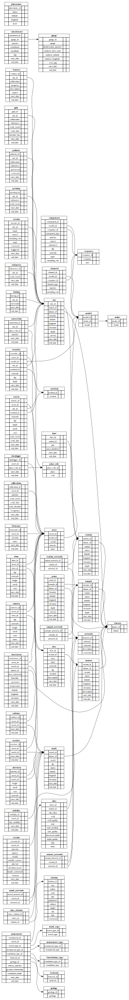

## sqlite

Converting the CSV base files into a standalone sqlite database is handled through the `Table` struct.

The elements of the struct handle the structure and construction of the actual SQL table, these include:

- name: the name of the table.
- headers: a mapping between CSV column names and column order.
- primary: a list of the table primary (or unique) keys.
- native: a list of columns which should not be handled as strings.
- foreign: a mapping of columns to other table entries to allow for foreign keys.
- remap: a mapping of CSV columns names to database names.
- ignore: ???
- start: a lookup value to the CSV column which holds the start date.
- end: a lookup value to the CSV column which holds the end date.

An example for the `Site` table:

```golang
var SiteTable Table = Table{
        name:    "Site",
        headers: siteHeaders,
        primary: []string{"Station", "Location", "Start Date"},
        native:  []string{"Latitude", "Longitude", "Elevation", "Depth"},
        foreign: map[string][]string{
                "Station": {"Station"},
        },
        remap: map[string]string{
                "Start Date": "Start",
                "End Date":   "End",
        },
        start: "Start Date",
        end:   "End Date",
}
```

where the Headers are defined as a mapping of column names to column order in the associated CSV file. e.g.

```golang
const (
        siteStation = iota
        siteLocation
        siteLatitude
        siteLongitude
        siteElevation
...
)

var siteHeaders Header = map[string]int{
        "Station":    siteStation,
        "Location":   siteLocation,
        "Latitude":   siteLatitude,
        "Longitude":  siteLongitude,
        "Elevation":  siteElevation,
...
}
```

Once a `Table` has been built, it can be attached to a CSV `List` via the `TableList` function of `Set`. This
function can then call itself to load in the actual data via the `meta/sqlite` code.

Building the sqlite tables is done by hand in `meta/sqlite`. Again a struct called `Table` is used,
the layout of this struct is as follows:

- Create: the commands needed to create the table, as a string.
- Select:  a function that returns a prepared statement for selecting a primary key for the table.
- Insert:  a function that returns a prepared statement for inserting values into the table.
- Fields: a slice of fields as used in the CSV files which are inserted into the table.
- Nulls:  a slice of column names that are allow to be null (identified by empty CSV strings).
- Unwrap: is used for building linking tables.

Here is the code for adding the `Site` table:

```golang
const siteCreate = `
DROP TABLE IF EXISTS site;
CREATE TABLE IF NOT EXISTS site (
  site_id INTEGER PRIMARY KEY NOT NULL,
  station_id INTEGER NOT NULL,
  datum_id INTEGER NOT NULL,
  location TEXT NOT NULL,
  latitude REAL NOT NULL,
  longitude REAL NOT NULL,
  elevation REAL NULL,
  depth REAL NULL,
  survey TEXT DEFAULT "Unknown" NOT NULL,
  start_date DATETIME NOT NULL CHECK (start_date IS strftime('%Y-%m-%dT%H:%M:%SZ', start_date)),
  end_date DATETIME NOT NULL CHECK (end_date IS strftime('%Y-%m-%dT%H:%M:%SZ', end_date)),
  FOREIGN KEY (station_id) REFERENCES station (station_id),
  FOREIGN KEY (datum_id) REFERENCES datum (datum_id),
  UNIQUE (station_id, location)
);
CREATE TRIGGER IF NOT EXISTS site_too_soon BEFORE INSERT ON site
WHEN NEW.start_date < (SELECT station.start_date FROM station WHERE station.station_id = new.station_id)
BEGIN
  SELECT RAISE(FAIL, "site too soon for station");
END;
CREATE TRIGGER IF NOT EXISTS site_too_late BEFORE INSERT ON site
WHEN NEW.end_date > (SELECT station.end_date FROM station WHERE station.station_id = new.station_id)
BEGIN
  SELECT RAISE(FAIL, "site too late for station");
END;
`

var site = Table{
        Create: siteCreate,
        Select: func() string {
                return fmt.Sprintf("SELECT site_id FROM site WHERE station_id = (%s) AND location = ?", station.Select())
        },
        Insert: func() string {
                return fmt.Sprintf("INSERT INTO site (station_id, datum_id, location, latitude, longitude, elevation, depth, survey, start_date, end_date) VALUES ((%s), (%s), ?, ?, ?, ?, ?, ?, ?, ?);",
                        station.Select(), datum.Select())
        },

        Fields: []string{"Station", "Datum", "Location", "Latitude", "Longitude", "Elevation", "Depth", "Survey", "Start Date", "End Date"},
        Nulls:  []string{"Elevation", "Depth"},
}
```

An example of a linking table is joining entries for a `Citation` table and the `citations` column
from the `Class` table. It is using references to the `class` and `citation` `Select` functions to
build the required joins.

```golang
const classCitationCreate = `
DROP TABLE IF EXISTS class_citation;
CREATE TABLE IF NOT EXISTS class_citation (
  class_citation_id INTEGER PRIMARY KEY NOT NULL,
  class_id INTEGER NOT NULL,
  citation_id INTEGER NOT NULL,
  FOREIGN KEY (class_id) REFERENCES class (class_id),
  FOREIGN KEY (citation_id) REFERENCES citation (citation_id),
  UNIQUE (class_id, citation_id)
);`

var classCitation = Table{
        Create: classCitationCreate,
        Select: func() string {
                return fmt.Sprintf("SELECT class_citation_id FROM class_citation WHERE class_id = (%s) AND citation_id = (%s)",
                        class.Select(), citation.Select(),
                )
        },
        Insert: func() string {
                return fmt.Sprintf("INSERT INTO class_citation (class_id, citation_id) VALUES ((%s), (%s));",
                        class.Select(), citation.Select(),
                )
        },
        Fields: []string{"Station", "Citations"},
        Unwrap: "Citations",
}
```

## schema

The schema can be automatically generated via the `sqlite-schema-diagram.sql` code in `meta/sqlite` from a delta.db file, e.g.

```
sqlite3 delta.db -init sqlite-schema-diagram.sql "" > delta.dot
```

and then

```
dot -Tsvg -odelta.svg delta.dot
```

[](delta.svg)
